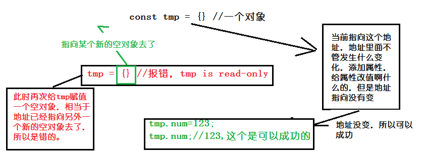

##一、let 和 const
###1.let命令
  es6新增命令let，用来声明变量，用法和var类似，但是let声明的变量仅在当前代码块儿内有效。
```javascript
{
  let a = 1;
  var b = 2;
}
a // 错误：a is not defined，
b // 2
```
  for循环的计数器，用let命令就很好：
```javascript
for (let i =0; i<10; i++){
  // ....do something
}
console.log(i);// i is not defined
```
  上面的代码里面，i就是只在循环体里面有效，如果用var的话：
```javascript
var a = [];
for(var i=0; i<10; i++){
  a[i] = function() {
    console.log(i)
  }
}
a[6]()//10,因为变量i是var声明的，所以在全局范围内都有效，所以全局只有一个变量i，每次循环，变量i的值都会发生改变，而循环内被赋给数组a的函数内部的console.log(i)，里面的i指向全局的i，也就是说，所有数组a的成员里面的i指向的都是一个i，所以最后运行输出的总是最后一轮的i，所以是10.

/*使用let*/
var a = [];
for (let i = 0; i < 10; i++) {
  a[i] = function () {
    console.log(i);
  };
}
a[6](); // 6，使用let的话，声明的变量仅在块级作用域内有效，当前i只在本轮循环有效，所以每一次循环i其实都是一个新的变量，所以最后输出的是6.而由于JavaScript引擎内部会记住上一轮循环的值，初始化本轮的变量i的时候，并不会还是从0开始，而是直接在上一轮的循环基础上进行计算。
```
  此外，for循环还有一个特别的地方，设置循环变量的那部分是一个父级作用域，而循环体内部是一个单独的子作用域。
```javascript
  for (let i = 0; i < 3; i++) {
  let i = 'abc';
  console.log(i);//输出三次abc，因为函数内部的变量i与循环变量i不在同一个作用域，有各自单独的作用域
}
```
#### 1.1 不存在声明提前
  var命令会有声明提前的现象，就是变量可以在声明之前使用，值为undefined，这样是比较奇怪的，一般情况下应该是声明之后才能用才对，let改变了这个语法行为，它所声明的变量一定是要在声明之后使用，不然就报错：
```javascript
console.log(a);//undefined,因为a是用var声明的，会被声明提前，在脚本开始运行的时候，a就被提到了代码最前面，但是赋值留在原地，所以输出undefined
var a=0;
console.log(b);//报错，b用let声明，不会发生声明提前，在这个代码用到b的时候，b还不存在，所以直接报错
let b=1;
```
#### 1.2 暂时性死区
  只要块级作用域内存在let命令，它所声明的变量就binding这个区域，不再受外部的影响了：
```javascript
var n=123;
if(1){
  n='123';//引用错误
  let n;
}
/*
  因为存在全局变量n，然后块级作用域内又声明了一个局部变量n，导致后者绑定这个块级作用域，所以在这个if里面，n没有被声明就用了，就报错了。es6明确规定，如果区块中存在let和const命令，这个区块对这些命令声明的变量从一开始就形成了封闭作用域，凡是在声明之前就使用了这些变量，就会报错。
*/
```
  总之，在代码块内，使用let命令声明变量之前，该变量都是不可用的，这在语法上称为“暂时性死区”（temporal dead zone，简称 TDZ）
```javascript
if (1){
  //TDZ开始
  n='123';//引用错误
  console.log(n);;//引用错误
  let n;//TDZ结束
  console.log(n);//undefined，因为还没赋值
  n=123;
  console.log(n)//123
}
```
  在上面的代码中，在let命令声明变量n之前，都属于变量n的死区，“暂时性死区”也意味着typeof也不再是一个安全的操作：
```javascript
typeof x;//引用错误
let x;
//因为x用let声明，在let之前都是x的死区，只要使用就会报错。

typeof suibainVal///如果一个变量没有被声明，反而只是输出undefined
```
  有些死区比较隐蔽，不容易被发现：
```javascript
function fun(x = y, y = 2) {
  return [x, y];
}
fun(); // 报错，因为参数x默认值是y，而y还没有被声明，属于死区

//另一种情况
function fun(x = 2, y = x) {
  return [x, y];
}
fun(); // [2, 2]，但是反过来，因为x已经声明过了，就不会报错
```
  还有这样的：
```javascript
var x = x;//不报错
let x=x;//报错，x is not defined，因为x还没被声明，就要去用它的值，当然会报错。
```
  es6规定暂时性死区和let，const语句不出现声明提前，主要是为了减少运行时的错误，防止变量在声明前就使用这个变量，从而导致意料之外的行为。暂时性死区的本质，就是只要一进入当前作用域，所要使用的变量就已经存在了，但是不可获取，只有等待声明变量的那个代码出现了，才能获取和使用该变量。
#### 1.3 不允许重复声明
  let不允许在相同的作用域内（敲黑板，作用域内~），重复声明同一个变量：
```javascript
function fun() {//报错
  let a=1;
  let a=2;
}
//不要在函数内部重新声明参数：
function fun(arg){
  let arg;;//报错
}
function fun(arg){
  {
    let arg;//不报错
  }
}
```
### 2.块级作用域
#### 2.1 WHY
  es5只有全局作用域和函数作用域，没有块级作用域，这样很不合理：
  第一，内层变量可能会覆盖外层变量：
```javascript
var tmp = new Date();
function f() {
  console.log(tmp);
  if (0) {
    var tmp = 'hello world';
  }
}
f(); // undefined,这个代码本来是if代码块的外部使用外层的tmp变量，内部使用内层的tmp变量，但是函数if执行之后，输出undefined，即使因为声明提前，内层的tmp覆盖掉了外层的tmp。
```
  第二，for循环里面用来计数的变量泄露为全局变量：
```javascript
var s = 'hello';
for (var i = 0; i < s.length; i++) {
  console.log(s[i]);
}
console.log(i); // 5，本来i只用来控制循环，当时循环结束以后i仍然存在，泄露成了全局变量。
```
#### 2.2 es6的块级作用域
  let为JS新增了块级作用域：
```javascript
function f1() {
  let n = 5;
  if (true) {
    let n = 10;
  }
  console.log(n); // 5,函数里面有两个代码块都声明了n，最后运行输出5，说明外层代码块不受内层代码块的影响，如果两次都使用var定义变量n的话，最后输出的就是10了
}
```
  es6允许块级作用域随意嵌套，外层作用域始终无法读取内层作用域的变量，内层作用域可以定义外层作用域的同名变量，有了块级作用域，就不需要再大量使用匿名函数自调了。
#### 2.3 块级作用域与函数声明
  es5规定，函数只能在顶层作用域和函数作用域之中声明，不能在块级作用域中声明：
```javascript
if(1){ // 非法
  function fun(){}
}
try{// 非法
  function fun() {}
} catch(e){}
// 上面这两种函数声明，在es5上都是非法的，但是浏览器没有遵守这个规定，为了兼容以前的旧代码，还是支持在块级作用域之中声明函数，因此上面两种情况实际都能运行，不会报错。
```
  es6引入了块级作用域，明确允许在块级作用域之中声明函数，es6规定，块级作用域之中，函数声明语句的行为类似let，在块级作用域之外不可引用。
```javascript
function fun() {console.log(1)}
(function() {
  if(0){
    // 重复声明一次函数fun
    function fun() {console.log(2)}
  }
  fun();
}());
```
  上面代码在es5中，会输出2，因为在if内声明的函数fun会被声明提前，所以其实真正运行的时候，代码顺序是这样的：
```javascript
function fun(){console.log(1)}
(function() {
  function fun() {console.log(2)}
  if(0){}
  fun();
}())
```
  es6就完全不一样了，理论上会得到1，因为块级作用域内声明的函数类似于let，对作用域之外没有影响，但是如果真的在es6浏览器中运行，是会报错的，因为如果改变了块级作用域内声明的函数的处理规则，显然会对老代码产生很大的影响，为了减轻因此产生的不兼容问题，es6有规定浏览器可以不完全遵守规定，可以有自己的行为方式。
  - 允许在块级作用域内声明函数
  - 函数声明类似于var，即会提升到全局作用域或函数作用域的头部
  - 同时和函数声明还会提升到所在的块级作用域的头部
      不过，这三条规则只对es6的浏览器实现有效，其它环境的实现不用遵守，还是将块级作用域的函数声明当做let处理。
        根据这三条规则，在浏览器的es6环境中，块级作用域内声明函数，行为类似于var声明的变量。
```javascript
//  浏览器的es6环境
function fun() {console.log(1)}
(function () {
  if (0){
  // 重复声明一次函数fun
    function fun() {console.log(2)}
  }
  f();
}());
// 报错 fun is not a function
```
  因为实际运行的时候，代码顺序是这样：
```javascript
function fun() {console.log(1)}
(function() {
  var fun=undefined;
  if(0){
    function fun() {console.log(2)}
  }
  fun();// fun is not a function
}())
```
  考虑到环境导致的行为差异太大，应该避免在块级作用域内声明函数，如果确实需要，也应该写成函数表达式，而不是函数声明语句：
```javascript
// 函数声明语句
{
  let a =1;
  function fun() {
    return a;
  }
}
// 函数表达式
{
  let a = 1;
  let fun = function () {
    return a;
  }
}
```
  另外，还有一个需要注意的地方，es6的块级作用域允许声明函数的规则，只在只用大括号的情况下成立，如果没有使用大括号，就会报错：
```javascript
'use strict';
if(1){
  function fun() {}//不报错
}
'use strict'
if (0) 
  function fun(){}//报错
```
###3.const命令
####3.1 基本用法
  const声明一个只读的常量，一旦声明，常量的值既不能改变：
```javascript
const PPI = 3.14;
PI;//3.14
PI = 3//报错，Assignment to constant variable.
```
  因为const声明的变量不能改变值，所以const一旦声明变量就要立刻初始化，不能留到以后赋值：
```javascript
  const tmp;// 只声明不赋值，Missing initializer in const declaration
```
  const的作用域与let命令一样，只在声明所在的块级作用域内有效：
```javascript
  if(1){
    const NUM = 1;
  }
  NUM;//报错，NUM is not defined
```
  const命令声明的常量也没有声明提前，同样存在暂时性死区，只能在声明的位置后面使用：
```javascript
if(1){
  console.log(NUM);//报错，NUM is not defined
  const NUM=1;
}
```
  const声明的变量，和let一样不可重复声明：
```javascript
var str='緑間どこ'
let num=1;
//下面的都会报错
const str = 'ここです'
const num=1;
```
####3.2 本质
  const实际上保证的，并不是变量的值不能改动，而是变量指向的那个内存地址不得改动，对于简单类型的数据值就保存在变量指向的那个地址，所以相当于是常量。但是对于复合类型的数据，变量指向的那个内存地址，保存的就是一个指向，const只能保证这个指向是固定的，至于它指向的数据结构是不是可变的，就完全不能控制了，看图：

  再比如：
```javascript
cosnt a=[];
a.push(1)//执行
a.length=0;//执行
a=[0]//报错
//常量a作为一个数组，这个数组本身是可写的，但是如果将另一个数组赋值给a，就会报错
```
  如果想将对象冻结的话，应该使用object.freeze方法：
```javascript
const tmp=Object.freeze({})
tmp.num=1;//因为常量tmp是一个被冻结的对象，常规模式，下面一行不起作用，严格模式，改行报错
```
  除了将对象本身冻结，对象的属性也应该被冻结：
```javascript
var freezeFun = (obj)=>{
  Object.freeze(obj);
  Object.keys(obj).forEach((key,i)=>{
    if(typeof obj[key]==='object'){
      freezeFun(obj[key])
    }
  })
}
```
### 4.顶层对象的属性
  顶层对象，在浏览器环境指的是window对象，在Node指的是global，es5中，顶层对象的属性与全局变量是等价的：
```javascript
window.a=1;
a;//1
a=2;
window.a;//2
//顶层对象的属性赋值与全局变量大的赋值，是一样的
```
  顶层对象的属性与全局变量挂钩，会有很大的问题，首先是没办法在编译的时候就报出变量未声明的错误，只有运行的时候才能知道，因为全局变量可能是顶层对象的属性创造的，而属性的创造是动态的；其次如果因为打错字什么的很容易就创建了一个全局变量出来，最后顶层对象的属性是导出可以读写的，这非常不利于模块化编程，另一方面，window对象有实体含义，指的是浏览器的窗口对象。
  es6就规定了，一方面为了保证兼容性，var命令和function命令声明的全局变量，依旧是顶层对象的属性，另一方面let命令、const命令、class命令声明的全局变量，不属于顶层对象的属性。全局变量逐步要与顶层对象属性脱钩。
```javascript
var a=1;
window.a;//1
let b=1;
window.b;//undefined
```
###5.global对象
  es5的顶层对象，本身也是一个问题，因为它在各种实现里面是不统一的
  - 浏览器里面，顶层对象是window，但是node和webworker没有window
  - 浏览器和webworker里面，self也指向顶层独享，但是node没有self
  - node里面，顶层对象是global，但是其它环境都不支持
    同一段代码为了能够在各种环境中都能取到顶层对象，现在一般是使用this变量，但是有局限性：
  - 全局环境中，this会返回顶层对象。但是，Node 模块和 ES6 模块中，this返回的是当前模块。
  - 函数里面的this，如果函数不是作为对象的方法运行，而是单纯作为函数运行，this会指向顶层对象。但是，严格模式下，这时this会返回undefined。
  - 不管是严格模式，还是普通模式，new Function('return this')()，总是会返回全局对象。（如果浏览器用了内容安全政策，那eval，new Function这些方法可能无法使用）
    综上，很难找到一种可以在所有情况下都取到顶层对象的方法，然后有两种可以使用的方法，虽然有点勉强：
```javascript
//一
(typeof window !== 'undefined'?window:
  (typeof process === 'object' && typeof require === 'function' && typeoof global === 'object')? global:this)
  //二、
var getGlobal = function () {
  if (typeof self !== 'undefined') { return self; }
  if (typeof window !== 'undefined') { return window; }
  if (typeof global !== 'undefined') { return global; }
  throw new Error('本地全局对象不可用');
}
```
```txt
  某个提案，在语言标准的层面，引入global作为顶层对象。
  比如：
  var global = require('system.global')()
  或者用es6的写法：
  import getGlobal from 'system.global';
  const global = getGlobal();
  这样就把顶层对象放入了变量global里。
```

## 二、变量的解构赋值
### 1.数组的解构赋值
#### 1.1 基本用法
  es6允许按照一定的模式，从数组和对象中提取值，对变量进行赋值，被称为解构：
```javascript
//以前赋值只能这样写：
let a=1;
let b=1;
let c=3;
//es6可以写成这样：
let [a,b.c]=[1,2,3]//这个就表示，可以从数组中提取值，按照对应位置，对变量赋值
```
  本质上这种写法属于“模式匹配”，只要等号两边的模式相同，左边的变量就会被赋予对应的值，嵌套数组进行结构大概有这么几种：
```javascript
let [a,[[b],c]]=[1,[[2],3]];
a//1
b//2
c//3

let [,, third]=[1,2,3]
third//3

let [x,,y]=[1,2,3]
x//1
y//3

let [a,...b]=[1,2,3,4]
a//1
b//[2,3,4]

let [x,y,...z]=[1]
x//1
y//undefined
z//[]
```
  如果解构不成功，变量的值就等于undefined。
```javascript
let [b]=[]
let [a,b]=[1]
//解构不成功，b的值都是undefined
```
  有的时候出现不完全解构的情况，就是等号左边的模式，只匹配一部分的等号右边的数组，这种情况下，解构依然可以成功：
```javascript
let [x,y]=[1,2,3]
x//1
y//2
let [a,[b],d]=[1,[2,3],4]
a//1
b//2
d//4
```
  如果等号右边不是数组（不能被遍历的解构），就会报错
```javascript
let [a]=1;
let [a]=false;
let [a]=NaN;
let [a]=undefined;
let [a]=null;
let [a]={}
//报错，因为等号右边的值，要么转换为对象以后不具备遍历器节后（前五个就是这样），要么本身不具备遍历器接口（最后一个表达式）
```
  对于set解构，也可以使用数组的解构赋值：
```javascript
let [x,y,z]new Set([1,2,3])
x//1
```
  所以，其实只要是某种数据解构具有遍历器接口，都可以采用数组形式的解构赋值。
```javascript
function* fun() {//Generator函数
  let a=0;
  let b=1;
  while(1){
    yield a;//产出
    [a,b]=[b,a+b]
  }
}
let [one,two,three,four,five,six]=fun()
//fun()是一个Generator函数，原生具有遍历器接口，解构赋值会依次从这个接口获取值
```
#### 1.2 默认值
  解构赋值允许指定默认值：
```javascript
let [a=true]=[];
a//true
let [a,b=1]=[0]
a//0
b//1
let [a, b=1][0,undefined]
a//0
b//1
//es6内部使用 === 运算符判断一个位置是否有值，所以只有当一个数组成员严格等于undefined默认值才会生效
```
```javascript
let [x=1]=[undefined]
x//1
let [x=1]=[null]
x//null
//如果一个数组成员是null，默认值就不会生效，因为null不严格等于undefined
```
  如果默认值是一个表达式，那么这个表达式是惰性求值的，即只有在用到的时候，才会求值：
```javascript
function fun() {
  console.log(1)
}
let [x=fun()]=[1]
x//1,因为x可以在后面取到值，所以函数fun不会被执行，所以执行的时候代码其实是这样的：

let x;
if([1][0]===undefined){
  x=fun()
}else {
  x=[1][0]
}
```
  默认值可以引用解构赋值的其它变量，但是该变量必须已经声明：
```javascript
let [a=1,b=a]=[];//a=1,b=1
let [a=1,b=a]=[2];//a=1,b=2
let [a=1,b=2]=[2];//a=1,b=2
let [a=b,b=1]=[];//报错，b is not defined，用到b的时候，b还没声明出来
```
### 2.对象的解构赋值
  解构同样可以用于对象：
```javascript
let {a,b}={a:1, b:2}
a//1
b//2
```
  对象的解构与数组有一个很大的不同，数组的元素是按照顺序排列的，变量的取值是由位置决定的，而对象的属性没有次序，变量必须与属性同名，才能取到正确的值。
```javascript
let {a,b}={b:2,a:2}//a=2,b=2,等号左边的两个变量的顺序与等号右边的
let {a}={b:1,c:2};
a//undefined，a变量没有对应的同名属性，导致取不到值，所以是undefined
```
  如果变量名与属性名不一致，得写成下面这个样子：
```javascript
let {a:b}={b:1,c:2}
a//1
let obj={x:1,y:2};;
let {x:a,y:b}=obj;
a//1
b//2
//实际上，对象的解构赋值就是这个形式的简写：
let {a:a,b:b}={a:1,b:2}//冒号前后相同时可以只写一个的
```
 也就是说，对象的解构赋值的内部机制，就是先找到同名属性，然后再赋值给对应的变量，真正被赋值的是后者，而不是前者，比如：
```javascript
let {x:a}={x:1,y；2}
a//1
x//报错，x is not defined
//x是匹配的模式，a才是变量，所以真正被赋值的变量是a，不是模式x
```
  与数组一样，解构也可以用于嵌套结构的对象：
```javascript
let obj={
  p:[
    'hello',{y:'world'}
  ]
};
let {p:[x,{y}]}=obj
x//hello
y//world
```
  此时的p是模式，不是变量，因此不会被赋值，如果p也要作为变量赋值，可以写成这样：
```javascript
let obj={
  p:[
    'hello',{y:'world'}
  ]
};
let (p,p:[x,,{y}])=obj
x//hello
y//world
p//['hello',{y:'world'}]
```
```javascript
const node = {
  loc:{
    start:{
      line:1,
      column:5
    }
  }
};
let {loc,loc:{start},loc:{start:{line}}}=node//后两个loc都是模式
line//1
loc//Object{start:Object}
start//Object{line:1,column:5}
//三次解构赋值，分别是对loc、start、line三个属性的解构赋值，最后一次对line属性的解构赋值之中，只有line是变量，loc和start都是模式，不是变量
```
  再看一下嵌套赋值：
```javascript
let obj={}
let arr=[]
({a:obj.prop,b:arr[0]})={a:1,b:true};
obj//{prop:1}
arr//[true]
```
  对象的解构也可以指定默认值：
```javascript
var {x=3}={}
x//3
var {x,y=3}={x=2}
x//2
y//3
var {x:y=3}={}
y//3
var {x:y=3}={x:5}
y//5
var {str:msg='luelueluelue'}={}
msg//luelueluelue
```
  默认生效的条件是，对象的属性值严格等于undefined，
```javascript
var {x=3}={x:undefined}
x//3
var {x=3}={x:null}
x//null
//属性x等于null，因为null与undefined不严格相等，所以是个有效的赋值，导致默认值3不会生效
let {b}={a:1}
b//undefined,如果解构失败，变量的值等于undefined
```
  如果解构模式是嵌套的对象，而且子对象所在的父属性不存在，就会报错：
```javascript
let {a:{b}}={b:1}
//等号左边对象的a属性，对应一个子对象，该子对象的b属性，解构时会不报错，因为此时a等于undefined，再取子属性就会报错

let x;
{x}={x:1}//语法错误，因为JavaScript引擎会将{x}理解成一个代码块，从而发生语法错误，只有不将大括号写在行首，避免JavaScript将其解释为代码块，才能解决这个问题

//正确的写法
let x;
({x}={x:1});
//这个就是将整个解构赋值语句，放在一个圆括号里面，就可以正确执行
```
  关于圆括号与解构赋值的关系，解构赋值允许等号左边的模式之中，不放置任何变量名，因此，可以写出非常古怪的赋值表达式：
```javascript
({} = [true,false])
({}=1234)
({}=[])
//虽然表达式没有意义，但是语法是合法的，可以执行。
```
  对象的解构赋值，可以很方便的将现有对象的方法，赋值到某个变量：
```javascript
let {log,sin,cos}=Math
//将Math对象的对数、正弦、余弦三个方法，赋值到对应的变量上，使用起来就会方便很多
```
  由于数组本质是特殊的对象，因此可以对数组进行对象属性的解构：
```javascript
ket arr=[1,2,3]
let {0:one,[arr.length-1]:two}=arr;
one//1
two//3
//对数组进行对象解构，数组arr的0键对应的值是1，[arr.length-1]就是2键，对应的值是3，方括号这种写法，属于“属性名表达式”
```
### 3.字符串的解构赋值
  字符串也可以解构赋值，因为字符串被转换成了类似数组的对象：
```javascript
const [a, b, c, d, e] = 'hello';
a // "h"
b // "e"
c // "l"
d // "l"
e // "o"
```
  类似数组的对象都有一个length属性，因此还可以对这个属性解构赋值：
```javascript
let {length:len}='hello'
len//5
```
### 4.数值和布尔值的解构赋值
  解构赋值时，如果等号右边是数值和布尔值，则会先转为对象：
```javascript
let {toString:s}=1;
s===Number.prototyoe.toString//true
let {toString:s}true;
s===Boolean.prototype.toString//true
//数值和布尔值的包装对象都有TOSString属性，则会先转为对象
```
  解构赋值的规则是，只要等号右边的值并不是对象或数组，就先将其转换为对象，由于undefined和null无法转为对象，所以对它们进行解构赋值，都会报错
```javascript
let {prop:a}=undefined//报错
let {prop:y}=null//报错
```
### 5.函数参数的解构赋值
  函数的参数也可以使用解构赋值：
```javascript
function add ([x,y]){
  return  x+y;
}
add([1,2])//3
//函数add的参数表面上是一个数组，但是在传入参数的时候，数组参数就被解构成变量x和y，对于函数内部的代码来说，它们能感受到的参数就是x和y
```
  再比如：
```javascript
[[1, 2], [3, 4]].map(([a, b]) => a + b);
// [3,7]
```
  函数参数的解构也可以使用默认值:
```javascript
function move({x = 0,y=0} = {}) {
  return [x,y];
}
move({x: 3, y: 8}); //[3, 8]
move({x: 3}); //[3, 0]
move({}); //[0, 0]
move(); //[0, 0]
//函数move的参数是一个对象，通过对这个对象进行解构，得到变量x和y的值，如果解构失败，x和y等于默认值。
```
  如果写法不同，结果也不同：
```javascript
function move({x, y} = { x: 0, y: 0 }) {
  return [x, y];
}
move({x: 3, y: 8}); //[3, 8]
move({x: 3}); //[3, undefined]
move({}); //[undefined, undefined]
move(); //[0, 0]
//如果是为函数move的参数指定默认值，而不是为变量x和y指定默认值，所以会得到与前一种写法不同的结果
```
  undefined就会触发函数参数的默认值：
```javascript
[1,undefined,3].map((x='yes')=>x)//[1,'yes',3]
```
### 6.圆括号问题
  解构赋值虽然方便，但是解析起来不容易，对于编译器来说，一个式子到底是模式还是表达式，没有办法从一开始就知道，必须解析到或者根本解析不到等号才能知道，带来的问题是，如果模式中出现圆括号怎么处理，es6的规则是，只要有可能导致解构的歧义，就不得使用圆括号。但是这个规则并不那么容易辨别，处理起来很麻烦，所以建议只要有可能，就不要在模式中放置圆括号：
#### 6.1 不能使用圆括号的情况
  - 变量声明语句
```javascript
let [(a)]=[1];
let {x:(c)}={};
let ({x:c})={};
let {(x):c}={}
let { o: ({ p: p }) } = { o: { p: 2 } };
// 6个语句都会报错，因为它们都是变量声明语句，模式不能使用圆括号
```
  - 函数参数
```javascript
// 函数参数也属于变量声明，因此不能带有圆括号
function fun([(z)]){return z}//报错
function fun ([z,(x)]){return x}//报错
```
  - 赋值语句的模式
```javascript
//将代码整个模式放在圆括号里面，报错
({p:a})={p:42}
([a])=[5]
//将代码一部分模式放在圆括号里面，报错
[({p:a}),{x:c}] = [{}, {}];
```
#### 6.2 可以使用圆括号的情况
  可以使用圆括号的情况只有一种：赋值语句的非模式部分，可以使用圆括号：
```javascript
[(b)]=[3];//模式是取数组的第一个成员，跟圆括号无关
({p:(d)}={})//模式是p不是d
[(xx.x)]=[3]//取对象的第一个成员，跟圆括号无关
//这三个都可以正确执行，因为它们都是赋值语句，而不是声明语句，然后它们的圆括号都不属于模式的一部分
```
### 7.用途
  - 交换变量的值
```javascript
let x=1;
let y=2;
[x,y]=[y,x]//交换变量，简洁易懂，语义清晰
```
  - 从函数返回多个值
```javascript
  //函数只能返回一个值，如果要返回多个值，只能将它们放在数组或对象里返回，现在可以这样写
  function fun(){//返回数组
    return [1,2,3]
  }
  let [a,b,c]=fun()
  function fun(){//返回对象
    return {a:1,b:2}
  }
  let {a,b}=fun()
```
  - 函数参数的定义
```javascript
//解构赋值可以方便的将一组参数与变量名对应起来
function fun([a,b,c]){...}
fun([1,2,3])//参数是一组有次序的值
function fun({a,b,c}){...}
fun({c:2,b:1,a:0})
```
  - 提取json数据
```javascript
//解构赋值对提取json对象中的数据很有用
let json={
  name:'许嵩',
  age:32,
  songs:['我乐意']
}
let {name,age,songs:string}=json
console.log(name,aga,string)//许嵩，332，['我乐意'],这不就快速获取到了json数据的值了
```
  -函数参数的默认值
```javascript
jQuery.ajax=function(url,{
  async=true,
  beforeSend=function(){  },
  cache=true,
  complete=function(){},
  crossDomain=false,
  global=true,
  //....
}={}){
  //...
}
//指定参数的默认值，避免了在函数体内部再写var a=config.a...之类的语句了
```
  -遍历map结构
```javascript
  //任何部署了遍历器的接口的独享，都可以用for of循环遍历，map结构原生支持遍历器接口，配合变量的结构赋值，获取键名和键值
  const map =new Map()
  map.set('a',1)
  map.set('b',2)
  for(let [keyy,value] of map){
    console.log(key + ':' + value)//a:1,b:2
  }
  //如果只想获取键名，或者只想拿键值，可以这样：
  for (let [key] of map) {}//获取键名
  for (let [,value] of map) {}//获取键值
```
  - 输入模块的指定方法：
```javascript
//加载模块时，往往需要指定输入哪些方法，结构赋值可以让输入语句更清晰
const {SourceMapConsumer,SourceNode}=require('source-map')
```

## 三、字符串的扩展
### 1.字符的Unicode表示
  JS允许采用\uxxxx形式表示一个字符，其中xxxx表示字符的Unicode码点，比如：
```javascript
'\u0061' //'a'
//但是这种表示法只限于码点在\u0000~\uFFFF之间的字符，超出这个范围，必须用两个双字节的形式表示，比如：
"\uD842\uDFB7" //𠮷，这不是吉，但是和吉的读音一样
'\u20bb7' // ' 7',如果直接在\u后面跟上超过0xFFF的数值，，JS会理解成\u20bb+1，由于\u20bb是一个不可打印的字符，所以只会显示空格 然后后面跟着一个7
```
  es6对这一点做出了改进，只要将码点放入大括号，就能正确解读该字符：
```javascript
'\u{20bb7}' //𠮷
'\u{41}\u{42}\u{43}'  //'ABC'
'\u{1F680}' === '\uD83D\uDE80' //true
// 这个等式2为true，表示大括号表示法与四字节的UTF-16编码是等价的，所以现在就有六种方法表示一个字符
'\z' === 'z' //true
'\172' === 'z'//true
'\x7A' === 'z'//true
'\u007A' === 'z'//true
'\u{7A}' === 'z'//true
```
### 2.codePointAt()
  JS内部，字符以UTF-16的格式储存，每个字符固定为2个字节，对于那些需要4个字节储存的字符，JS会认为它们是两个字符：
```javascript
var s='𠮷';
s.length //2
s.charAt(0)// ''
s.charCodeAt(0)//55362
s.charCodeAt(1)//57271
// '𠮷'的码点是0x220bb7，UTF-16编码为0xD842 0xDFB7，上面打印出来的是十进制的，需要四个字节存储，对于这种4个字节的字符，JS不能正确处理，字符串长度会认为是2，而且chartAt方法无法读取整个字符，charCodeAt方法只能分别返回前两个字节和后两个字节的值。
```
  es6提供了codePointAt方法，来正确处理4个字节储存的字符，返回一个字符的码点：
```javascript
let s='𠮷a';
s.codePointAt(0)//134071
s.codePointAt(1)//57271
s.codePointAt(2)//97
// codePointAt方法的参数，是字符在字符串中的位置，JS将'𠮷a'视为三个字符，codePointAt方法在第一个字符上，正确的识别了'𠮷'，返回了十进制码点134071,在第二个字符就是'𠮷'的后两个字节上和第三个字符a上，codePointAt方法的结果和charCodeAt方法相同。

//codePointAt方法返回的是十进制的码点，要是要十六进制的，可以使用toString
let s='𠮷a';
s.codePointAt(0).toString(16) //"20bb7"
s.codePointAt(2).toString(16) //"61"

//但是，这里有个问题就是a在字符串里的位置是1，但是得向codePointAt方法传入2，所以需要用for of循环，来识别32位的UTF-16字符:
lets ='𠮷a';
for (let ch of s) {
  console.log(ch.codePointAt(0).toString(16));// 20bb7,61
}
```
  codePointAt方法是测试一个字符是由两个字节还是由四个字节组成的最简单的办法：
```javascript
function is32(c){
  return c.codePointAt(0)>0xFFFF
}
is32('𠮷')///true
is332('a')//false
```
### 3.String.fromCodePoint()
  es5有String.fromCharCode方法，用于从码点返回对应的字符，但是它不能识别32位的UTF-16字符：
```javascript
String.fromCharCode(0x20bb7)//'ஷ'，因为不能识别大鱼0xFFFF的码点，所以最高位的2被舍弃了，最后码点返回的是u+0bb7对应的字符，反正也不认识
```
  es6提供String.formCodePoint方法，可以识别大于0xFFFF的字符：
```javascript
String.fromCodePoint(0x20BB7)//"𠮷"
String.fromCodePoint(0x78, 0x1f680, 0x79) === 'x\uD83D\uDE80y'//true
//如果String.formCodePoint方法有多个参数，则会被合并成一个字符串返回，
//fromCodePoint方法定义在string对象上，codePointAt定义在字符串本身上
```
### 4.字符串的遍历器接口
  es6为字符串添加了遍历器接口，字符串也可以使用for of循环：
```javascript
for (let tmp of 'vae') {
  console.log(tmp)// v , a, e
}
```
  除了遍历字符串，这个遍历器最大的优点是可以识别大于0xFFFF的码点，传统的for循环无法识别这样的码点。
```javascript
let text=String.fromCodePoint(0x20BB7);
for (let i=0; i<text.length; i++) {
  console.log(text[i]);
}
// " "
// " "

for (let i of text) {
  console.log(i);// "𠮷"
}
 // 字符串text只有一个字符，但是for循环会认为它包含两个字符，而for of循环会正确识别出这一个字符
```
### 5.at()
  es5对字符串对象提供charAt方法，返回字符串给定位置的字符，该方法不能识别码点大于0xFFFF的字符：
```javascript
'abc'.charAt(0) // "a"
'𠮷'.charAt(0) // "\uD842"
// 第二条语句，charAt方法期望返回的是用2个字节表示的字符，但是这个汉字占了4个字符，charAt(0)表示获取这4个字节中的前2个字节，所以无法正常显示，目前有一个字符串实例的at方法，可以识别Unicode编号大于0xFFFF的字符，返回正确的字符：
'abc'.at(0) // "a"
'𠮷'.at(0) // "𠮷"
```
### 6.normalize()
  许多欧洲语言有语调符号和重音符号，为了表示它们，Unicode提供了两种方法，一种是直接提供带重音符号的字符，另一种是提供合成符号，就是原字符与重音符号的合成，两个字符合成一个字符，这两种表示方法在视觉和语义上 都等价，但是JavaScript不能识别：
```javascript
  '\u01d1'==='\u004f\u030c' //false
  '\u01d1'.length//1
  '\u004f\u030c'.length //2
  // 上面代码表示，JavaScript将和合成字符视为两个字符，导致了两种表示方法不相等
```
  es6提供字符串实例的normalize()方法，用来将字符大的不同表示方法统一为同样的形式，这称为Unicode正规化：
```javascript
  '\u01D1'.normalize() === '\u004F\u030C'.normalize()// true
```
  normalize方法可以接受一个参数来指定normalize的方式，参数可选值有：
  - NFC，默认参数，表示 标准等价合成，，返回多个简单字符的合成字符，标准的能加指的就是视呵呵语义上的等价。Normalization Form Canonical Composition
  - NFD，表示 标准等价分解，就是在标准等价的前提下，返回合成字符分解的多个简单字符。Normalizattion Form Canonical Decomposition
  - NFKC，表示 兼容等价合成，返回合成字符，兼容等价指的是语义上存在等价，但视觉上不等价，Normalization Form Compatibility Composition。
  - NFKD，表示 兼容等价分解，就是在兼容等价的前提下，返回合成字符分解的多个简单 字符，Normalization Form Compatibility Decomposition
```javascript
'\u004F\u030C'.normalize('NFC').length // 1
'\u004F\u030C'.normalize('NFD').length // 2
// 这两行代码表示，NFC参数返回字符的合成形式，NFD参数返回字符的分解形式，不过，normalize方法目前不能识别三个或者三个以上的字符，这种情况下，就还是用正则表达式，通过Unicode编号区间判断
```
### 7.includes() startsWith() endsWith()
  以前，JavaScript只有indexOf方法，可以用来确定一个字符串是否包含在另一个字符串中，es6提供了新的三种方法：
  - includes() 返回布尔值，表示是否找到了参数字符转
  - startsWith() 返回布尔值，表示参数字符串是否在原字符串的头部
  - endsWith() 返回布尔值，表示参数字符串是否在原字符串的尾部
```javascript
let str='hello world!'
str.startsWith('h')//true
str.endsWith('!')//true
str.includes(d)//true
// 这三个方法都支持第二个参数，表示从第n位开始查找
let str='hello vae!'
str.startsWith('vae', 6)//true
str.endsWith('hello',5)//true
str.includes('hello', 6)//false
// 这样写就表示使用第二个参数nn时，endsWith的行为与其它两个方法有所不同，它针对前n个字符，而其它两个方法针对从第n个位置直到字符串结束
```
### 8.repeat()
  repeat方法返回一个新的字符串，表示将原字符串重复n次
```javascript
'x'.repeat(3)//'xxx'
'vae'.repeat(2)//'vaevae'
'no'.repea(0)//''
// 参数如果是小数，会被取整
'no'.repeat(2.9)//'nono'
// 如果repeat的参数是负数或者Infinity，会报错
'vae'.repeat(Infinity)//RangeError
'vae'.repeat(-1)//RangeError
//但是如果参数是0到-1之间的小数，则等同于0，这是因为会先进行取整运算，0到-1之间的小数，取整以后等于-0，repeat相当于0
'no'.repeat(-0.9)//''
//参数NaN等同于0
'no'.repeat(NaN)//0
//如果repeat的参数是字符串，就先转为数字
'no'.repeat('ai') // ""
'no'.repeat('3') // "nonono"
```
### 9.padStart() padEn()
  es6引入了字符串补全长度的功能，如果某个字符串不够指定长度，会在头部或者尾部补全，padStart用于头部补全，padEnd用于尾部补全：
```javascript
'x'.padStart(5, 'ab')//'ababx'
'x'.padStart(4, 'ab')//'abax'
'x'.padEnd(5, 'ab')//'xabab'
'x'.padEnd(4, 'ab')//'xaba'
//padStart和padEnd一共接受两个参数，第一个参数用来指定字符串的最小长度，第二个参数是用来补全的字符串

//如果原字符串的长度，等于或大于指定的最小长度，则返回原字符串
'xxx'.padStart(2, 'ab') // 'xxx'
'xxx'.padEnd(2, 'ab') // 'xxx'

//如果用来补全的字符串与原字符串，二者的长度之和超过了指定的最小长度，则会截去超出位数的补全字符串
'ab'.padStart(10,'0123456789')//'01234567ab'

//如果省略第二个参数，默认使用空格补全长度
'x'.padStart(44)//'    x'
'x'.padEnd(4)//'x    '

//padStart的常见用途是为数值补全指定位数，比如这样：
'1'.padStart(10, '0') // "0000000001"
'12'.padStart(10, '0') // "0000000012"
'123456'.padStart(10, '0') // "0000123456"

//另一个用途是提示字符串格式
'12'.padStart(10, 'YYYY-MM-DD') // "YYYY-MM-12"
'09-12'.padStart(10, 'YYYY-MM-DD') // "YYYY-09-12"
```
### 10.matchAll() 
  matchAll方法返回一个正则表达式在当前字符串的所有匹配
### 11.模板字符串
  以前的JavaScript语言，输出模板通常这样写：
```javascript
$('#result').append(
	'你说啥<b>'+person.name+'</b>'+
	'听不见'+person.name+'瞎了'+person.year+'年了'
)
​````
  这种写法太复杂了，错一个引号就慢慢找去吧，模板字符串就很好用了：
​```javascript
$('#result').append(
	`你说啥<b>${person.name}</b>听不见，${person.name}瞎了${person.year}年了`
)
```
  模板字符串是增强版的字符串，用反引号标识，他可以当做普通字符串使用，也可以用来定义多行字符串，或者在字符串中嵌入变量：
```javascript
`潇洒如我最近确变得有点敏感'\n'半小时收不到你讯息就会坐立不安`//普通字符串

`都说别爱的太满 这道理知易行难
我还挺乐意享受这份甜中微酸`//多行字符串

//字符串嵌入变量
let name='你' , thing ='西瓜'
`${name}的笑像${thing}最中间那一勺的口感，点亮了一整个夏天星空也为你斑斓`

//模板字符串都是用反引号表示，如果在模板字符串中需要使用反引号，那就要用\转译
let greeting = `\`Yo\` World!`

//如果使用模板字符串表示多行字符串，所有的空格和缩进都会被保留在输出之中
$('#list').html(`
<ul>
  <li>壹</li>
  <li>贰</li>
</ul>
`);

//上面这样写，所有的模板字符串的空格和换行，都是被保留的，比如ul标签前面会有一个换行，如果也要消除这个换行，可以使用trim方法消除：
$('#list').html(`
<ul>
  <li>壹</li>
  <li>贰</li>
</ul>
`.trim());

//模板字符串中嵌入变量，需要将变量名写在${}里面
function authorize(user, action) {
  if (!user.hasPrivilege(action)) {
    throw new Error(
      // 传统写法为
      // 'User '+ user.name+ ' is not authorized to do '+ action+ '.'
      `User ${user.name} is not authorized to do ${action}.`);
  }
}
```
  大括号里面可以放任意的JavaScript表达式，可以进行运算，以及引用对象属性，在大括号里面也可以调用函数。
  如果大括号中的值不是字符串，将按照一般的规则转为字符串，比如大括号中是一个对象，将默认调用对象的toString方法，如果模板字符串中的变量没有声明，将报错：
```javascript
// 变量name没有声明
let msg = `Hello, ${name}`// 报错
```
  由于模板字符串的大括号内部就是执行JavaScript代码，所以要是大括号内部是一个字符串，就直接输出了：
```javascript
`hello ${'worrld'}`//hello world
```
  模板字符串也可以嵌套：
```javascript
const tmp=addr=>`
	<table>
		${addr.map(addr=>`
			<tr><td>${addr.first}</td></tr>
			<tr><td>${addr.last}</td></tr>
		`).join('')}
	</table>
`
//这个就是在模板字符串的变量中，又嵌入了另一个模板字符串，这样用：
const data =[
  {first:'baker',last:'street'}
  {first: 221,last:'B'}
]
console.log(tmp(data))
/*
<table>
	<tr><td>baker</td></tr>
	<tr><td>sreet</td></tr>
	<tr><td>221</td></tr>
	<tr><td>B</td></tr>
</table>
*/
```
  如果需要引用模板字符串本身，在需要时执行，可以这样写：
```javascript
//一、
let str='return'+'`hello ${name}`'
let fun=new Function('name',str)
fun('vae')//hello vae
//二、
let str='(name)=>`hello ${name}`'
let fun=eval.call(null,str)
fun('vae')//hello vae
```
### 12.标签模板
  除了上面的功能，它还可以紧跟在一个函数名后面，该函数将被用来处理这个模板字符串，被称为“标签模板”功能
```javascript
alert `123` //等同于
alert (123)
```
  标签模板其实不是模板，而是函数调用的一种特殊形式，标签 指的的就是函数，紧跟在后面的模板字符就是它的参数，但是如果模板字符里面有变量，就不是简单的调用了，而是会将模板字符串先处理成多个参数，再调用函数：
```javascript
let a=1;
let b=2;
tag`hello ${a+b}world${a*b}`
tag(['hello','world','',3,2])
//这里面模板字符串前面有一个标识名tag，它是一个函数，整个表达式的返回值就是tag函数处理模板字符串后的返回值，函数tag又一次会接收到多个参数：
function tag(strArr,val1,val2){//...}//等同于
function tag(strArr,...vals){//...}
```
  tag函数的第一个参数是一个数组，该数组的成员是模板字符串中的那些没有变量替代的部分，也就是说，变量替换只发生在数组的第一个成员与第二个成员之间、第二个成员与第三个成员之间，以此类推。tag函数的其它参数，都是模板字符串各个变量被替换后的值，上面的例子里面，模板字符串包含有两个变量，因此tag会接收到val1和val2两个参数。
  tag函数所有参数的实际值是这样的：
  - 第一个参数 :['hello','world','']
  - 第二个参数:3
  - 第三个参数:2
    所以也就是说tag函数实际以下面的形式调用：
```javascript
tag(['Hello ', ' world ', ''], 3, 2)
```
  可以按照需要编写tag的代码，下面是tag函数的一种写法以及运行结果：
```javascript
let a=1;
let b=2;
function tag(s,v1,v2){
  console.log(s[0]);
  console.log(s[1]);
  console.log(s[2]);
  console.log(v1);
  console.log(v2);
  return "OK";
}
tag`Hello ${a+b} world ${a*b}`;// hello//world//''//3//2//ok
```
  一个更复杂的例子：
```javascript
let total = 30;
let msg = passthru`总价${total} (含税：${total*1.05})`;

function passthru(literals) {
  let result = '';
  let i = 0;
  while (i<literals.length) {
    result+=literals[i++];
    if (i<arguments.length) {
      result+=arguments[i];
    }
  }
  return result;
}

msg // "总价30 (含税31.5)"
//这个例子展示了，如何将各个参数按照原来的位置拼合回去
```
  passthru函数采用rest参数的写法长这样：
```javascript
function passthru(literals, ...values) {
  let output = "";
  let index;
  for (index = 0; index<values.length; index++) {
    output += literals[index]+values[index];
  }
  output+=literals[index]
  return output;
}
```
  标签模板的一个重要应用，就是过滤HTML字符串，防止用户恶意输入：
```javascript
let message = SaferHTML`<p>${sender}给你发了个消息</p>`
function SaferHTML(tmpData){
  let s=tmpData[0];
  for(let i=1;i<arguments.length;i++){
    let arg=String(arguments[i])
     s+=arg.replace(/&/g, "&amp;")
            .replace(/</g, "&lt;")
            .replace(/>/g, "&gt;");//避开替换中的特殊字符
     s+=tmpData[i]//不避开模板中中的特殊字符
  }
  return s;;
}
//其中sender变量往往是用户提供的，经过SaferHTML函数处理，里面的特殊字符都会被转义
let sender = '<script>alert("abc")</script>'; // 恶意代码
let message = SaferHTML`<p>${sender} 给你发了个消息</p>`;
message//<p>&lt;script&gt;alert("abc")&lt;/script&gt; 给你发了个消息</p>
```
  标签模板的另一个应用，就是多语言转换：
```javscript
i18n`欢迎访问 ${siteName},您是第 ${visitorNumber}位访问者!`
// "欢迎访问xxx，您是第xxxx位访问者！"
```
  模板字符串本身并不能取代Mustache之类的模板库，因为没有条件判断和循环处理功能，但是通过标签函数，可以自己添加这些功能：
```javascript
// 下面的hashTemplate函数是一个自定义的模板处理函数
let libraryHtml=hashTemplate`
  <ul>
    #for book in ${myBooks}
      <li><i>#{book.title}</i> by #{book.author}</li>
    #end
  </ul>
`;
```
  此外，也可以使用标签模板，在JS里里面呢嵌入其它语言：
```javascript
jsx`<div>
    <input ref='input' onChange='${this.handleChange}'  defaultValue='${this.state.value}' /> ${this.state.value} </div>
`
//通过jsx函数，将一个DON字符串转为React对象。
```
  假如在JS的代码里面运行Java代码：
```javascript
java`
class HelloWorldApp {
  public static void main(String[] args) {
    System.out.println(“Hello World!”); // 打印该字符串
  }
}
`
HelloWorldApp.main();
//模板处理函数的第一个参数，还有一个raw属性
console.log`123`//['123', raw: Array[1]]
//console.log接受的参数，实际上是一个数组。该数组有一个raw属性，保存的是转义后的原字符串。
```
  又有一个例子：
```javascript
tag`第一行的\n第二行的`

function tag(strings) {
  console.log(strings.raw[0]);
  // strings.raw[0] 为 "第一行的\\n第二行的"
  // 打印输出 "第一行的\n第二行的"
}
//这里面，tag函数的第一个参数strings，有一个raw属性，也指向一个数组。该数组的成员与strings数组完全一致。比如，strings数组是["第一行的\n第二行的"]，那么strings.raw数组就是["第一行的\\n第二行的"]。两者唯一的区别，就是字符串里面的斜杠都被转义了。比如，strings.raw 数组会将\n视为\\和n两个字符，而不是换行符。
```
### 13.String.raw()
  es6为原生的String对象，提供了raw方法。String.raw方法，往往用来充当模板字符串的处理函数，返回一个斜杠都被转义（即斜杠前面再加一个斜杠）的字符串，对应于替换变量后的模板字符串。
```javascript
String.raw`Hi\n${2+2}!`;// 返回 "Hi\\n4!"
String.raw`Hi\u000A!`;// 返回 "Hi\\u000A!"
//如果原字符串的斜杠已经转义，那么String.raw会进行再次转义。
String.raw`Hi\\n` // 返回 "Hi\\\\n"
```
  String.raw方法可以作为处理模板字符串的基本方法，它会将所有变量替换，而且对斜杠进行转义，方便下一步作为字符串来使用。String.raw方法也可以作为正常的函数使用。这时，它的第一个参数，应该是一个具有raw属性的对象，且raw属性的值应该是一个数组。
```javascript
String.raw({ raw: 'test' }, 0, 1, 2);// 't0e1s2t'
// 等同于
String.raw({ raw: ['t','e','s','t'] }, 0, 1, 2);
```
  作为函数，String.raw的代码实现长这样：
```javascript
String.raw = function (strings, ...values) {
  let output = '';
  let index;
  for (index=0; index<values.length; index++) {
    output+=strings.raw[index]+values[index];
  }
  output+=strings.raw[index]
  return output;
}
```
### 14.模板中字符串的限制
  标签模板里面，可以内嵌其它语言，但是，模板字符串默认会将字符串转义，导致无法嵌入其他语言。
  比如，标签模板里面可以嵌入LaTEX语言（什么鬼？~）
```javascript
//一段不知道是什么语言的代码
function latex(strings) {
  // ...
}

let document = latex`
\newcommand{\fun}{\textbf{Fun!}}  // 正常工作
\newcommand{\unicode}{\textbf{Unicode!}} // 报错
\newcommand{\xerxes}{\textbf{King!}} // 报错
Breve over the h goes \u{h}ere // 报错
`
//这里面，变量document内嵌的模板字符串，对于 LaTEX 语言来说完全是合法的，但是 JavaScript 引擎会报错。原因就在于字符串的转义。模板字符串会将\u00FF和\u{42}当作 Unicode 字符进行转义，所以\unicode解析时报错；而\x56会被当作十六进制字符串转义，所以\xerxes会报错。也就是说，\u和\x在 LaTEX 里面有特殊含义，但是 JavaScript 将它们转义了。
```
  为了解决这个问题，ES2018 放松了对标签模板里面的字符串转义的限制。如果遇到不合法的字符串转义，就返回undefined，而不是报错，并且从raw属性上面可以得到原始字符串。
```javascript
function tag(strs) {
  strs[0] === undefined
  strs.raw[0] === "\\unicode and \\u{55}";
}
tag`\unicode and \u{55}`
//这里面，模板字符串原本是应该报错的，但是由于放松了对字符串转义的限制，所以不报错了，JavaScript 引擎将第一个字符设置为undefined，但是raw属性依然可以得到原始字符串，因此tag函数还是可以对原字符串进行处理。

//注意，这种对字符串转义的放松，只在标签模板解析字符串时生效，不是标签模板的场合，依然会报错。
let bad = `bad escape sequence: \unicode`; // 报错
```

## 四、正则的扩展
### 1.RegExp构造函数
  在es5中，RegExp构造函数的参数有两种情况，第一种情况是参数是字符串，这时第二个参数表示正则表达式的修饰符（flag）
```javascript
var regex=new RegExp('xyz','i')//等价于
var regex=/xyz/i  // i ignore，忽略大小写
```
  第二种情况是，参数是一个正则表达式，这时会返回一个原有正则表达式的拷贝：
```javascript
var regex=new RegExp(/xyz/i) // 等价于
var regex=/xyz/i
```
  但是es5不允许此时使用第二个参数添加修饰符，否则就会报错：
```javascript
var regex=new RegExp(/xyz/, ''i'')//报错，从另一个RegExp构建一个RegExp时不支持修饰符
```
  es6改变了这种行为，如果RegExp构造函数第一个参数是一个正则对象，那么可以使用第二个参数指定修饰符吗，而且返回的正则表达式会忽略原有的正则表达式的修饰符，只使用新的指定的修饰符：
```javascript
new RegExp(/abc/ig,'i').flags//原有正则对象的修饰符是ig，但是会被后面的i覆盖
```
### 2.字符串的正则方法
  字符串对象共有4个方法，可以使用正则表达式：match()、replace()、search()和split()。es6将这4个方法，在语言内部全部调用RegExp的实例方法，从而做到所有与正则相关的方法全都定义在RegExp对象上：
  - String.prototype.match调用RegExp.prototype[Symbol.match]
  - String.prototype.replace调用RegExp.prototype[Symbol.replace]
  - String.prototype.split调用RegExp.prototype[Symbol.split]
### 3.u修饰符
  es6对正则表达式添加了u修饰符，含义就是Unicode模式，用来正确处理大于\uuFFFF的Unicode字符，就是说，会正确处理四个字节的UTF-16编码。
```javascript
/^\uD83D/u.test('\uD83D\uDC2A') //false
/^\uD83D/.test('\uD83D\uDC2A') //true
//这里面，\uD83D]\uDC2A是一个四字节的UUTF-16编码，代表一个字符，但是es5不支持四个字节的UTF-16编码，会将其识别为两个字符，导致第二行代码的结果为true，加了u修饰符以后，es6就会识别其为一个字符，所以第一行的就是true
```
  加上u修饰符，就会修改下面这些正则表达式的行为：
  - 点字符
    点( . )字符在正则表达式中，含义是除了换行符以外的任意单个字符，对于码点大于0xFFFF的Unicode字符，点字符不能识别，必须加上u修饰符
```javascript
var s = '𠮷';
/^.$/.test(s) //false
/^.$/u.test(s) //true
//如果不添加u修饰符，正则表达式就会认为字符串为两个字符，从而匹配失败
```
  - Unicode字符表示法
    es6新增了使用大括号表示Unicode字符，这种表示方法在正则表达式中必须加上u修饰符，才能识别当中的大括号，否则会被解释为量词：
```javascript
/\u{61}/.test('a') //false
/\u{61}/u.test('a') //true
/\u{20BB7}/u.test('𠮷') //true
//如果不加修饰符，正则表达式无法识别\u{61}这种表示法，只会认为匹配61个连续的u
```
  - 量词
    使用u修饰符后，所有的量词都会正确识别码点大于0xFFFF的Unicode字符：
```javascript
/a{2}/.test('aa') //true
/a{2}/u.test('aa') //true
/𠮷{2}/.test('𠮷𠮷') //false
/𠮷{2}/u.test('𠮷𠮷') //true
```
  - 预定义模式
    u修饰符也影响到预定义模式，能否正确识别码点大于0xFFFF的Unicode字符：
```javascript
/^\S$/.test('𠮷') //false
/^\S$/u.test('𠮷') //true
//\s是预定义模式，匹配所有的非空白字符，只有加了u修饰符，才能正确匹配码点大于0xFFFF的Unicode字符，利用这一点，可以写出一个正确返回字符串长度的函数
function codePointLength(text) {
  var result=text.match(/[\s\S]/gu);
  return result?result.length:0;
}
var s='𠮷𠮷';
s.length // 4
codePointLength(s) // 2
```
  - i修饰符
    有些Unicode字符的编码不同，但是字型很接近，比如\u0048和\u212A都是大写的K：
```javascript
/[a-z]/i.test('\u212A') //false,不加u就无法识别非规范的K字符
/[a-z]/iu.test('\u212A') //true
```
### 4.y修饰符
  除了u修饰符，es6还为正则表达式添加了y修饰符，叫做sticky修饰符，y修饰符与g修饰符类似，也是全局匹配，后一次匹配都从上一次匹配成功的下一个位置开始，不同之处在于，g修饰符只要剩余位置中存在匹配就可以，但是y修饰符确保匹配必须从剩余的第一个位置开始：
```javascript
var s='aaa_aa_a';
var r1=/a+/g;
var r2=/a+/y;
r1.exec(s) //["aaa"]
r2.exec(s) //["aaa"]
r1.exec(s) //["aa"]
r2.exec(s) //null
//这个代码里面有两个正则表达式，一个使用g修饰符，一个使用y修饰符，这连个正则表达式个执行了一次，第一次执行的时候，二者行为相同，剩余字符串都是_aa_a，由于g修饰没有位置要求，所以第二次执行会返回结果，而y修饰符要求匹配必须从头部开始，所以返回null，如果改一下正则表达式，保证每次都能头部匹配，y修饰符就会返回结果了：
var s='aaa_aa_a';
var r=/a+_/y;
r.exec(s) //["aaa_"]
r.exec(s) //["aa_"]

//使用lastIndex属性，来更好的说明y修饰符
const REGEX=/a/g
REGEX.lastInedx=2;//指定从2号位置开始匹配
const match=REGEX.exec('xaya')
match.index//3
REGEX.lastInndex//4
REGEX.exec('xaya')//null，4号位置开始匹配失败
//这个代码里面，lastIndex属性指定每次搜索的开始位置，g修饰符从这个位置开始向后搜索，知道发现匹配为止。

//y修饰符同样遵守lastIndex属性，但是要求必须在lastIndex指定的位置发现匹配
const REGEX = /a/y;
REGEX.lastIndex = 2;// 指定从2号位置开始匹配
REGEX.exec('xaya') // null，不是粘连，匹配失败
REGEX.lastIndex = 3;// 指定从3号位置开始匹配
const match = REGEX.exec('xaya');// 3号位置是粘连，匹配成功
match.index // 3
REGEX.lastIndex // 4
```
  其实，y修饰符符号隐含了头部匹配的标志^ 
```javascript
/b/y.exec('abc')//null,由于不能保证头部匹配，所以返回null，y修饰符的设计本意，就是让头部匹配的标志^在全局匹配中都有效

//字符串对象的replace方法的例子：
const REGEX = /a/gy;
'aaxa'.replace(REGEX, '-') //'--xa'
//这个代码里最后一个a因为不是出现在下一次匹配的头部，所以不会被替换。

//单单一个y修饰符对match方法，只能返回第一个匹配，必须与g修饰符连用，才能返回所有匹配
'a1a2a3'.match(/a\d/y) // ['a1']
'a1a2a3'.match(/a\d/gy) // ['a1','a2','a3']
```
  y修饰符的一个应用，是从字符串提取token，y修饰符确保了匹配之间不会有漏掉的字符：
```javascript
const TOKEN_Y=/\s*(\+|[0-9]+)\s*/y;
const TOKEN_G=/\s*(\+|[0-9]+)\s*/g;
tokenize(TOKEN_Y, '3 + 4')// [ '3', '+', '4' ]
tokenize(TOKEN_G, '3 + 4')// [ '3', '+', '4' ]
function tokenize(TOKEN_REGEX, str) {
  let resul =[];
  let match;
  while (match=TOKEN_REGEX.exec(str)) {
    result.push(match[1]);
  }
  return result;
}

//如果字符串里面没有非法字符，y修饰符与g修饰符的提取结果是一样的，但是一旦出现非法字符，两者的行为就不一样了：
tokenize(TOKEN_Y, '3x + 4')// [ '3' ]
tokenize(TOKEN_G, '3x + 4')// [ '3', '+', '4' ]
//g修饰符会忽略非法字符，y不会，就很容易发现错误了
```
### 5.sticky属性
  与y修饰符相匹配，es6的正则对象多了sticky属性，表示是否设置了y修饰符
```javascript
var r = /hello\d/y;
r.sticky // true
```
### 6.flags属性
  es6为正则表达式新增了flags属性，会返回正则表达式的修饰符：
```javascript
/abc/ig.source //'abc',es5的source属性，返回正则表达式的正文
/abc/ig.flags//’gi，es6的flags属性，返回正则表达式的修饰符
```
### 7.s修饰符：dotAll模式
  正则表达式中，点（.）是一个特殊字符，代表任意的单个字符，但是有两个例外，一个是四个字节的UTF-16字符，这个可以用u修饰符解决，另一个是行终止符，该字符表示一行的终结，以下四个字符属于“行终止符”
  - U+000A换行符（\n）
  - U+000D 回车符（\r）
  - U+2028 行分隔符（line separator）
  - U+2029 段分隔符（paragraph separator）
```javascript
/foo.bar/ .test('foo\nbar')//false,因为 . 不匹配\n，所以正则返回false
//但是，很多时候就想匹配的是任意单个字符，可以变通一下写法
/foo[^]bar/.test('foo\nbar')// true，就是看着有点别扭
```
  es2018引入s修饰符，使得.可以匹配任意单个字符
```javascript
/foo.bar/s .test('foo\nbar') // true
//这被称为dotAll模式，即点（.）代表一切字符，所以正则表达式还引入了dotAll属性，返回一个布尔值，表示该正则表达式是否处于dotAll模式
const re = /foo.bar/s; // 另一种写法
// const re = new RegExp('foo.bar', 's');
re.test('foo\nbar') // true
re.dotAll // true
re.flags // 's'
///s修饰符和多行修饰符/m不冲突,二者一起使用的情况下，. 匹配所有字符，而^和$匹配每一行的行首和行尾。
```

## 五、数值的扩展
### 1.二进制和八进制表示法
  es6提供了二进制和八进制数值的新的写法，分别用前缀0b和0o表示：
```javascript
0b111110111 === 503 //true
0o767 === 503 //true
```
  从es5开始，在严格模式之中，八进制就不再允许使用前缀0表示，es6进一步明确要使用前缀0o表示：
```javascript
// 非严格模式
(function(){
  console.log(0o11 === 011);
})() //true
// 严格模式
(function(){
  'use strict';
  console.log(0o11 === 011);
})()//报错，
```
  如果要将0b和0o前缀的字符串数值转为十进制，要使用Number方法：
```javascript
Number('0b111')//7
Number('0o10')//8
```
### 2.Number.isFinite(),Number.isNaN()
  Number.isFinite()用来检查一个数值是否为有限的（finite），即不是Infinity。
```javascript
Number.isFinite(15); // true
Number.isFinite(0.8); // true
Number.isFinite(NaN); // false
Number.isFinite(Infinity); // false
Number.isFinite(-Infinity); // false
Number.isFinite('foo'); // false
Number.isFinite('15'); // false
Number.isFinite(true); // false
//如果参数类型不是数值，Number.isFinite一律返回false
```
  Number.isNaN()用来检查一个值是否为NaN：
```javascript
Number.isNaN(NaN) // true
Number.isNaN(15) // false
Number.isNaN('15') // false
Number.isNaN(true) // false
Number.isNaN(9/NaN) // true
Number.isNaN('true' / 0) // true
Number.isNaN('true' / 'true') // true
//如果参数类型不是NaN，Number.isNaN一律返回false
```
  它们与传统的全局方法isFinite()和isNaN()的区别在于，传统方法先调用Number()将非数值的值转为数值，再进行判断，而这两个新方法只对数值有效，Number.isFinite()对于非数值一律返回false, Number.isNaN()只有对于NaN才返回true，非NaN一律返回false。
```javascript
isFinite(25) // true
isFinite("25") // true
Number.isFinite(25) // true
Number.isFinite("25") // false
isNaN(NaN) // true
isNaN("NaN") // true
Number.isNaN(NaN) // true
Number.isNaN("NaN") // false
Number.isNaN(1) // false
```
### 3.Number.parseInt(),Number.parseFloat()
  ES6 将全局方法parseInt()和parseFloat()，移植到Number对象上面，行为完全保持不变。
```javascript
// ES5的写法
parseInt('12.34') // 12
parseFloat('123.45#') // 123.45
// ES6的写法
Number.parseInt('12.34') // 12
Number.parseFloat('123.45#') // 123.45
//看上去没啥区别，这样做是逐步减少全局性方法，使得语言逐步模块化
Number.parseInt === parseInt // true
Number.parseFloat === parseFloat // true
```
### 4.Number.isInteger()
  此方法用来判断一个数值是否为整数：
```javascript
Number.isInteger(25) // true
Number.isInteger(25.1) // false

//JavaScript 内部，整数和浮点数采用的是同样的储存方法，所以 25 和 25.0 被视为同一个值。
Number.isInteger(25) // true
Number.isInteger(25.0) // true

//如果参数不是数值，Number.isInteger返回false。
Number.isInteger() // false
Number.isInteger(null) // false
Number.isInteger('15') // false
Number.isInteger(true) // false
```
  注意，由于JavaScript数值存储为4位双精度格式，数值精度最多可以达到53个二进制位（1个隐藏位与52个有效位），如果数值的精度超过这个限度，第54位以及后面的位就会被丢弃，这种情况下，isInteger可能会误判
```javascript
Number.isInteger(3.0000000000000002) // true
//上面代码中，Number.isInteger的参数明明不是整数，但是会返回true。原因就是这个小数的精度达到了小数点后16个十进制位，转成二进制位超过了53个二进制位，导致最后的那个2被丢弃了。

//类似的情况还有，如果一个数值的绝对值小于Number.MIN_VALUE（5E-324），即小于 JavaScript 能够分辨的最小值，会被自动转为 0。这时，Number.isInteger也会误判。
Number.isInteger(5E-324) // false
Number.isInteger(5E-325) // true
//上面代码中，5E-325由于值太小，会被自动转为0，因此返回true。
```
  所以，如果对数据精度要求较高，不建议使用Number.isInteger()判断一个数值是否为整数。
### 5.Number.EPSILON
  es6在Number对象上面，新增一个极小的常量Number.EPSILON，根据规格，它表示1与大于1的最小浮点数之间的差。对于64位浮点数来说，大于1的最小浮点数相当于二进制的1.00..001，小数点后面有连续51个零，这个值减去1之后，就等于2的-52次方。
```javascript
Number.EPSILON === Math.pow(2, -52)// true
Number.EPSILON// 2.220446049250313e-16
Number.EPSILON.toFixed(20)// "0.00000000000000022204"
//Numebr.EPSILON实际上是JavaScript能够表示的最小精度，误差如果小于这个值，就可以认为已经没有意义了，即不存在误差了
```
  引入这么小的量的目的，在于为浮点数计算，设置一个误差范围，因为浮点数计算是不精确的：
```javascript
0.1 + 0.2//0.30000000000000004
0.1 + 0.2 - 0.3// 5.551115123125783e-17
5.551115123125783e-17.toFixed(20)// '0.00000000000000005551'
//这样就知道了吧，0.2+0.1与0.3的结果是false
0.1+0.2===0.3//false
```
  Number.EPSILON可以用来设置“能够接受的误差范围”，比如，误差范围设为2的-50次方，即如果两个浮点数的差小于这个值，就认为这两个浮点数相等：
```javascript
5.551115123125783e-17 < Number.EPSILON * Math.pow(2, 2)// true
```
  所以，Number.EPSILON的实质是一个可以接受的最小误差的范围
```javascript
function withinErrorMargin(left,right){//误差检查函数
    return Math.abs(left-right)<Number.EPSILON*Math.pow(2,2)
}
0.1+0.2===0.3//false
withinErrorMargin(0.1+0.2,,0.3)//true
1.1 + 1.3 === 2.4 // false
withinErrorMargin(1.1 + 1.3, 2.4) // true
```
### 6.安全整数和Number.isSafeInteger()
  JavaScript能够准确表示的整数范围在-2^53到2^53之间，不含两个端点，超过这个范围无法精确表示这个值：
```javascript
Math.pow(2,53)// 9007199254740992
9007199254740992  // 9007199254740992
9007199254740993  // 9007199254740992
Math.pow(2, 53) === Math.pow(2, 53) + 1// true,看看，这一个数就不精确了
```
  es6引入了Number,MAX_SAFE_INTEGER和Number.MIN_SAFE_INTEGER这两个常量，用来表示这个范围的上下限：
```javascript
Number.MAX_SAFE_INTEGER === Math.pow(2, 53) - 1// true
Number.MAX_SAFE_INTEGER === 9007199254740991// true
Number.MIN_SAFE_INTEGER === -Number.MAX_SAFE_INTEGER// true
Number.MIN_SAFE_INTEGER === -9007199254740991// true
//这可以看到JavaScript能够精确表示的极限

//Number.isSafeInnteger()则是用来判断一个整数是否落在这个范围之内：
Number.isSafeInteger('a') // false
Number.isSafeInteger(null) // false
Number.isSafeInteger(NaN) // false
Number.isSafeInteger(Infinity) // false
Number.isSafeInteger(-Infinity) // false
Number.isSafeInteger(3) // true
Number.isSafeInteger(1.2) // false
Number.isSafeInteger(9007199254740990) // true
Number.isSafeInteger(9007199254740992) // false
Number.isSafeInteger(Number.MIN_SAFE_INTEGER - 1) // false
Number.isSafeInteger(Number.MIN_SAFE_INTEGER) // true
Number.isSafeInteger(Number.MAX_SAFE_INTEGER) // true
Number.isSafeInteger(Number.MAX_SAFE_INTEGER + 1) // false

//这个函数的实现很简单，就是跟安全整数的两个边界值比较一下
Number.isSafeInteger = function (n) {
  return (typeof n === 'number'&&Math.round(n) === n&&Number.MIN_SAFE_INTEGER <= n&&n <= Number.MAX_SAFE_INTEGER);
}
//实际使用这个函数的时候，需要注意验证运算结果是否落在安全整数的范围内，不要只验证运算结果，而要同时验证参与运算的每个值：
Number.isSafeInteger(9007199254740993)// false
Number.isSafeInteger(990)// true
Number.isSafeInteger(9007199254740993 - 990)// true
9007199254740993 - 990// 返回结果 9007199254740002，正确答案应该是 9007199254740003
//这里面，9007199254740993不是一个安全整数，但是Number.isSafeInteger会返回结果，显示计算结果是安全的，这是因为这个数超出了精度范围，导致在计算机内部以9007199254740992的形式储存
9007199254740993 === 9007199254740992// true

//所以，如果只验证运算结果是否为安全整数，很可能得到错误结果，下面的函数可以同时验证两个运算数和运算结果
function trusty(left,rigth,result){
    if(Number.isSafeInteger(left))&&Number.isSafeInteger(right)&&Number.isSafeInteger(result){
        return result;
    }
    throw new RangeError('不被信任的操作')
}
trusty(9007199254740993, 990, 9007199254740993 - 990)//报错：操作不被信任
trusty(1,2,3)//3
```
### 7.Math对象的扩展
  es6在Math对象上新增了17个（！！！！）与数学相关的方法，所有的这些方法都是静态的，只能在Math对象上调用：
#### 7.1 Math.trunc()
  Math.trunc方法用于去除一个数的小数部分，返回整数部分：
```javascript
Math.trunc(4.1) // 4
Math.trunc(4.9) // 4
Math.trunc(-4.1) // -4
Math.trunc(-4.9) // -4
Math.trunc(-0.1234) // -0
```
  对于非数值，Math.trunc内部使用Number方法将其先转换为数值：
```javascript
Math.trunc('123.456')//123
Math.trunc(true)//1
Math.trunc(false)//0
Math.trunc(null) // 0
```
  对于空值和无法取整数的值，返回NaN：
```javascript
Math.trunc(NaN)//NaN
Math.trunc('foo')// NaN
Math.trunc()// NaN
Math.trunc(undefined) // NaN
```
  对于没有部署这个方法的环境，可以用下面的代码模拟：
```javascript
Math.trunc=Math.trunc||function(x){
    return x<0?Math.ceil(c):Math.floor(x)
}
```
#### 7.2 Math.sign()
  Math.sign方法用来判断一个数到底是正数、负数还是零。对于非数值，会先将其转换为数值，它会返回五种值：
  - 参数为正数，返回+1
  - 参数为负数，返回-1
  - 参数为0，返回0
  - 参数为-0，返回-0
  - 其它值，返回NaN
```javascript
Math.sign(-5) // -1
Math.sign(5) // +1
Math.sign(0) // +0
Math.sign(-0) // -0
Math.sign(NaN) // NaN
```
  如果参数是非数值，会自动转换为数值，对于那些无法转为数值的值，会返回NaN：
```javascript
Math.sign('') // 0
Math.sign(true)// +1
Math.sign(false)// 0
Math.sign(null)// 0
Math.sign('9')// +1
Math.sign('foo')// NaN
Math.sign()// NaN
Math.sign(undefined)// NaN
```
  对于没有部署这个方法的环境，可以自己写一个啊：
```javascript
Math.sign=Math.sign||function(x){
    x= +x;
    if(x===0 || isNaN(x)){
        return x
    }
    rreturn x>0?1:-1;
}
```
#### 7.3 Math.cbrt()
  Math.cbrt方法用于计算一个数的立方根：
```javascript
Math.cbrt(-1)// -1
Math.cbrt(0)// 0
Math.cbrt(1)// 1
Math.cbrt(2)// 1.2599210498948734
```
  对于非数值，Math.cbrt方法内部也是先使用Number方法将其转为数值：
```javascript
Math.cbrt('8')//2
Math.cbrt('luelue')//NaN
```
  对于没有部署这个方法的环境，可以用下面的代码模拟：
```javascript
  Math.cbrt=Math.cbrt || function(x){
    var y=Math.pow(Math.abs(x),1/3)
    return x<0?-y:y
}
```
#### 7.4 Math.clz32()
  JavaScript的整数使用32位二进制形式表示，Math.clz32方法返回一个数的32位无符号整数形式有多少个前导0：
```javascript
Math.clz32(0) // 32
Math.clz32(1) // 31
Math.clz32(1000) // 22
Math.clz32(0b01000000000000000000000000000000) // 1
Math.clz32(0b00100000000000000000000000000000) // 2
//这里面，0的二进制形式全为0，所以有32个前导0,1的二进制形式是0b1，只占1位，所以32位之中有31个前导0,1000的二进制形式是0b1111101000，一共有10位，所以32位之中有22个前导0
```
  clz32这个函数名就来自”count leading zero bits in 32-bit binary representation of a number“（计算一个数的 32 位二进制形式的前导 0 的个数）的缩写。左移运算符(<<)与Math.clz32方法直接相关：
```javascript
Math.clz32(0)// 32
Math.clz32(1)// 31
Math.clz32(1<<1)// 30
Math.clz32(1<<2)// 29
Math.clz32(1<<29)// 2
```
  对于小数，Math.clz32方法只考虑整数部分：
```javascript
Math.clz32(3.2)//30
Math.clz32(3.9)//30
```
  对于空值或其它类型的值，Math.clz32方法会将它们先转为数值，然后再计算：
```javascript
Math.clz32()// 32
Math.clz32(NaN)// 32
Math.clz32(Infinity)// 32
Math.clz32(null)// 32
Math.clz32('foo')// 32
Math.clz32([])// 32
Math.clz32({})// 32
Math.clz32(true)// 31
```
#### 7.5 Math.imul()
  这个方法返回两个数以32位带符号整数形式相乘的结果，返回的也是一个32位的带符号整数：
```javascript
Math.imul(2, 4)   // 8
Math.imul(-1, 8)  // -8
Math.imul(-2, -2) // 4
```
  如果只考虑最后32位，大多数情况下，Math.imul(a,b)与a\*b的结果是相同的，即该方法等同于(a\*b)|0的效果，超过32位的部分溢出，之所以需要部署这个方法，是因为JavaScript有精度限制，超过2的53次方的值无法精确表示，这就是说，对于那些很大数的乘法，低位数值往往是不准确的，Math.imul方法可以返回正确的低位数值：
```javascript
(0x7fffffff * 0x7fffffff)|0 // 0，由于这两个二进制数的最低位都是 1,这个返回结果肯定不对的，因为根据二进制的乘法，计算结果的二进制最低位应该也是1，这个错误就是因为它们的乘积超过了2的53次方，JavaScript无法保存额外的精度，就把低位值变成0，Math.imul方法可以返回正确的1：
Math.imul(0x7fffffff, 0x7fffffff) // 1
```
#### 7.6 Math.founnd()
  此方法返回一个数的32位单精度浮点数形式，对于32位单精度格式来说，数值精度是24个二进制位，所以对于-2^24^至2^24^之间的整数，返回结果与参数本身一致:
```javascript
Math.fround(0)// 0
Math.fround(1)// 1
Math.fround(2 ** 24 - 1)// 16777215
//如果参数的绝对值大于2^24^，返回的结果便开始丢失精度
Math.fround(2 ** 24)// 16777216
Math.fround(2 ** 24 + 1)// 16777216
```
  Math.fround方法的主要作用，是将64位双精度浮点数转为32位 单精度浮点数，如果小数的精度超过24个二进制位，返回值就会不同于原值，否则返回值不变，就还是和64位双精度值一致：
```javascript
// 未丢失有效精度
Math.fround(1.125)// 1.125
Math.fround(7.25)// 7.25
// 丢失精度
Math.fround(0.3)// 0.30000001192092896
Math.fround(0.7)// 0.699999988079071
Math.fround(1.0000000123) // 1
```
  对于NaN和Infinity，此方法返回原值，对于其它类型的非数值，Math.fround方法会先将其转为数值，再返回单精度浮点数：
```javascript
Math.fround(NaN)// NaN
Math.fround(Infinity)// Infinity
Math.fround('5')// 5
Math.fround(true)// 1
Math.fround(null)// 0
Math.fround([])// 0
Math.fround({})// NaN
```
  对于没有部署这个方法的环境，可以模拟一下：
```javascript
Math.fround=Math.fround||function(x){
    return new Float32Arrat([x])[0]
}
```
#### 7.7 Math.hypot()
  此方法返回所有参数的平方和的平方根：
```javascript
Math.hypot(3, 4)// 5
Math.hypot(3, 4, 5)// 7.0710678118654755
Math.hypot()// 0
Math.hypot(NaN)// NaN
Math.hypot(3, 4, 'foo')// NaN
Math.hypot(3, 4, '5')// 7.0710678118654755
Math.hypot(-3) // 3
//如果参数不是数值，Math.hypot方法会将其转为数值，只要有一个参数无法转为数值，就会返回NaN
```
#### 7.8 对数 方法
##### 7.8.1 Math.expm1()
  Math.expm1()返回e^x^-1即Math.exp(x)-1（高中的对数函数什么来着？？）
```javascript
Math.expm1(-1)// -0.6321205588285577
Math.expm1(0)// 0
Math.expm1(1)// 1.718281828459045
```
  对于没有部署这个方法的环境，可以写个函数模拟：
```javascript
Math.expm1=Math.expm1||function(x){
    return Math.exp(x)-1
}
```
##### 7.8.2 Math.log1p()
  这个方法返回1+x的自然对数，即Math.log(1+x)，如果x小于-1，返回NaN：
```javascript
Math.log1p(1)// 0.6931471805599453
Math.log1p(0)// 0
Math.log1p(-1)// -Infinity
Math.log1p(-2)// NaN
```
  对于没有部署这个方法的环境，可以自己写一个：
```javascript
Math.log1p=Math.log1p||function(x){
    return Math.log(1+x)
}
```
##### 7.8.3 Math.log10()
  返回以10为底的x的对数。如果x小于0，则返回NaN：
```javascript
Math.log10(2)// 0.3010299956639812
Math.log10(1)// 0
Math.log10(0)// -Infinity
Math.log10(-2)// NaN
Math.log10(100000) // 5
```
  没有这个方法的环境，自己写：
```javascript
Math.log10=Math.log10||function(x){
    return Math.log(x)/Math.LN10
}
```
##### 7.8.4 Math.log2()
  返回以2为底的对数，如果x小于0，则返回NaN：
```javascript
Math.log2(3)// 1.584962500721156
Math.log2(2)// 1
Math.log2(1)// 0
Math.log2(0)// -Infinity
Math.log2(-2)// NaN
Math.log2(1024)// 10
Math.log2(1 << 29)// 29
```
  没有这个方法的，自己动手，丰衣足食：
```javascript
Math.log2=Math.log2||function(x){
    return Math.log(x)/MMath.LN2
}
```
#### 7.9 双曲函数方法
  - Math.sinh(x)返回x的双曲正弦
  - Math.cosh(x)返回x的双曲余弦
  - Math.tanh(x)返回x的双曲 正切
  - Math.asinh(x)返回x的反双曲正弦
  - Math.acosh(x)返回x的反双曲余弦
  - Math.atanh(x)返回x的反双曲正切
  - 这是记住了方法也不知道用在哪里 系列
### 8.指数运算符
  新增的 指数运算符： \*\*
```javascript
  2**2//4
  2**3//8
```
  指数运算符可以与等号结合，形成一个新的赋值运算符(\*\*=)
```javascript
let a=10
a**=2//100，,相当于a=a*a
let b=4;
b**+3//48,相当于b=b*b*b
```
  在V8引擎中，指数运算符与Math.pow的实现不相同，对于特别大的运算结果，两者会有细微的差异：
```javascript
Math.pow(99,99)//3.697296376497263e+197
99 ** 99// 3.697296376497268e+197
//运算结果的最后一位有效数字是有差异的
```

## 六、函数的扩展
### 1.函数参数的默认值
#### 1.1 基本用法
  es6之前，是不能直接给函数的参数指定默认值的，只能采用变通的方法：
```javascript
function log(x, y) {
  y = y || 'World';
  console.log(x, y);
}
log('Hello') // Hello World
log('Hello', 'China') // Hello China
log('Hello', '') // Hello World
//这个代码里面检查函数log的参数y有没有赋值，如果没有，则指定默认值为world，这种写法的缺点在于，如果参数y赋值了，但是对应的布尔值为false，则该赋值不起作用。就像上面代码的最后一行，参数y等于空字符，结果被改为默认值。

//为了避免这个问题，通常需要先判断一下参数y是否被赋值，如果没有，再等于默认值。
if(typeof y === 'undefined'){
    y='world'
}
```
  es6允许为函数的参数设置默认值，即直接写在参数定义的后面：
```javascript
function log(x,y='world'){
    console.log(x,y)
}
log('Hello') // Hello World
log('Hello', 'China') // Hello China
log('Hello', '') // Hello
//es6的写法比es5简洁很多，而且非常自然：
function Point(x = 0, y = 0) {
  this.x = x;
  this.y = y;
}
const p = new Point();
p // { x: 0, y: 0 }
```
  除了简洁，es6的写法还有两个好处，首先，阅读代码的人可以立刻意识到哪些参数是可以省略的，不用查看函数体或者文档，其次有利于将来的代码优化，即使未来的版本在对外接口中，彻底拿掉这个参数，也不回导致以前的代码无法运行。
  参数变量是默认声明的，所以不能用let或者const再次声明：
```javascript
function foo(x=s){
    let x=1//error
    const x=2//error
}
//这个代码里面，参数变量x是默认声明的，在函数体中，不能用let或者const再次声明，否则会报错
```
  使用参数默认值时，函数不能有同名参数：
```javascript
//不报错
function foo(x,x,y){...}
//报错:Duplicate parameter name not allowed in this context
function foo(x,x,y=1){....}
```
  另外一个容易忽略的地方是，参数默认值不是传值的，而是每次都重新计算默认值表达式的值。也就是说参数默认值是惰性求值的
```javascript
let x = 99;
function foo(p = x + 1) {
  console.log(p);
}
foo() // 100
x = 100;
foo() // 101
//上面代码中，参数p的默认值是x+1。这时，每次调用函数foo，都会重新计算x+1，而不是默认p等于100。
```
#### 1.2 与结构赋值默认值结合使用
  参数默认值可以与解构赋值的默认值，结合起来使用：
```javascript
function foo({x, y = 5}) {
  console.log(x, y);
}
foo({}) // undefined 5
foo({x: 1}) // 1 5
foo({x: 1, y: 2}) // 1 2
foo() // TypeError: Cannot read property 'x' of undefined
//这段代码只使用了对象的解构赋值默认值，没有使用函数参数的默认值，只有当函数foo的参数是一个对象时，变量x和y才会通过解构赋值生成，如果函数foo调用时没有提供参数，变量x和y就不会生成，从而报错。通过提供函数参数的默认值，就可以避免这种情况
function foo({x, y = 5} = {}) {
  console.log(x, y);
}
foo() // undefined 5
//如果没有提供参数，函数foo的参数默认为一个空对象
```
  下面是另一个解构赋值默认值的例子：
```javascript
function fetch(url, { body = '', method = 'GET', headers = {} }) {
  console.log(method);
}
fetch('http://example.com', {})// "GET"
fetch('http://example.com')// 报错
//这段代码里，如果函数fetch的第二个参数是一个对象，就可以为它的三个属性设置默认值。这种写法不能省略第二个参数，如果结合函数参数的默认值，就可以省略第二个参数。这时，就出现了双重默认值
function fetch(url, { body = '', method = 'GET', headers = {} } = {}) {
  console.log(method);
}
fetch('http://example.com')// "GET"
//上面代码中，函数fetch没有第二个参数时，函数参数的默认值就会生效，然后才是解构赋值的默认值生效，变量method才会取到默认值GET。
```
  看一下下面两种写法有什么区别？
```javascript
// 写法一
function m1({x = 0, y = 0} = {}) {
  return [x, y];
}
// 写法二
function m2({x, y} = { x: 0, y: 0 }) {
  return [x, y];
}
//两种写法都对函数的参数设定了默认值，区别是写法一函数参数的默认值是空对象，但是设置了对象解构赋值的默认值；写法二函数参数的默认值是一个有具体属性的对象，但是没有设置对象解构赋值的默认值。

// 函数没有参数的情况
m1() // [0, 0]
m2() // [0, 0]

// x 和 y 都有值的情况
m1({x: 3, y: 8}) // [3, 8]
m2({x: 3, y: 8}) // [3, 8]

// x 有值，y 无值的情况
m1({x: 3}) // [3, 0]
m2({x: 3}) // [3, undefined]

// x 和 y 都无值的情况
m1({}) // [0, 0];
m2({}) // [undefined, undefined]

m1({z: 3}) // [0, 0]
m2({z: 3}) // [undefined, undefined]
```
#### 1.3 参数默认值的位置
  通常情况下，定义了默认值的参数，应该是函数的尾参数，因为这样比较容易看出来，到底省略了哪些参数，如果非尾部的参数设置默认值，实际上这个参数是没法省略的。
```javascript
// 例一
function f(x = 1, y) {
  return [x, y];
}
f() // [1, undefined]
f(2) // [2, undefined])
f(, 1) // 报错
f(undefined, 1) // [1, 1]

// 例二
function f(x, y = 5, z) {
  return [x, y, z];
}
f() // [undefined, 5, undefined]
f(1) // [1, 5, undefined]
f(1, ,2) // 报错
f(1, undefined, 2) // [1, 5, 2]
//ほら、有默认值的参数都不是尾参数，这时，无法只省略该参数，而不省略它后面的参数，除非显示输入undefined。如果传入undefined，将触发该参数等于默认值，null则没有这个效果
function foo(x = 5, y = 6) {
  console.log(x, y);
}
foo(undefined, null)// 5 null
//上面代码中，x参数对应undefined，结果触发了默认值，y参数等于null，就没有触发默认值
```
#### 1.4 函数的length属性
  指定了默认值以后，函数的length属性将返回没有指定默认值的参数个数，也就是说指定了默认值以后，length属性将失真。
```javascript
(function (a) {}).length // 1
(function (a = 5) {}).length // 0
(function (a, b, c = 5) {}).length // 2
//这段代码中，length属性的返回值，等于函数的参数个数减去了指定了默认值参数个数，比如上面最后一个函数，定义了3个参数，其中有一个参数c指定了默认值，因此length属性等于3-1，最后得到2。

//这是因为length属性的含义是，该函数预期传入的参数个数，某个参数指定默认值以后，预期传入的参数个数就不包括这个参数了，同理后面的rest参数也不会计入length属性：
(function(...args) {}).length // 0

//如果设置了默认值的参数不是尾参数，那么length属性也不再计入后面的参数了
(function (a = 0, b, c) {}).length // 0
(function (a, b = 1, c) {}).length // 1
```
#### 1.5 作用域
  一旦设置了参数的默认值，函数进行声明初始化时，参数会形成一个单独的作用域，等到初始化结束，这个作用域就会消失，这种语法行为，在不设置参数默认值时是不会出现的：
```javascript
var x=1;
function fun(x,y=x){
    console.log(y)
}
fun(2)//2
//这个代码中，参数y的默认值等于变量x，调用函数f时，参数形成一个单独的作用域，在这个作用域里面，默认值变量x指向第一个参数x，而不是全局变量x，所以输出是2

//再看一个
let x=1;
function fun(y=x){
    let x=2;
    console.log(y)
}
fun()//1
//函数fun调用的时候，参数y=x形成一个单独的作用域，这个作用域里面，变量x本身没有定义，所以指向外层的全局变量x，函数调用时，函数体内部的局部变量x影响不到默认值变量x，如果此时全局变量x不存在，就会报错
function fun(y=x){
    let x=2;
    console.log(y)
}
fun()//报错，x is not defined

//下面这样写，也会报错
var x=1;
function fun(x=x){...}
fun()//报错 x is not defined
//这里面参数x=x形成一个单独的作用域，实际执行的是let x=x，由于暂时性死区的原因，这行代码会报错“x未定义”
```
  如果参数的默认值是一个函数，该函数的作用域也遵守这个规则，看下这个例子：
```javascript
let foo = 'outer';
function bar(func = () => foo) {
  let foo = 'inner';
  console.log(func());
}
bar(); // outer
//这段代码里，函数bar的参数func的默认值是一个匿名函数，返回值为变量foo，函数参数形成的单独作用域里面，并没有定义变量foo，所以foo指向外层的全局变量foo，因此输出outer

//如果写成下面这样，就会报错
function bar(func=() => foo){
    let foo='inner';
    console.log(func())
}
bar()//报错，foo is not defined，匿名函数里面的foo指向函数外层，但是函数外层并没有声明变量foo，所以报错
```
  这里有一个更复杂一些的例子：
```javascript
var x = 1;
function foo(x, y = function() { x = 2; }) {
  var x = 3;
  y();
  console.log(x);
}
foo() // 3
x // 1
//函数foo的参数形成一个单独的作用域，这个作用域里面，首先声明了变量x，然后声明了变量y，y的默认值是一个匿名函数，这个函数内部的变量x指向同一个作用域的第一个参数x，函数foo内部又声明了一个内部变量x，该变量与第一个参数x由于不是同一个作用域，所以不是同一个变量，因此执行y后，内部变量x和外部全局变量x的值都没变，如果将var x = 3的var去除，函数foo的内部变量x就指向第一个参数x，与匿名函数内部的x是一致的，所以最后输出的就是2，而外层的全局变量x依然不受影响。
var x=1;
function foo(x,y=function(){x=2}){
    x=3;
    y();
    console.log(x)
}
foo()//2
x//1
```
#### 1.6 应用
  利用参数默认值，可以指定某一个参数不得省略，如果省略就抛出一个错误：
```javascript
function throwIfMissing() {
  throw new Error('Missing parameter');
}
function foo(mustBeProvided = throwIfMissing()) {
  return mustBeProvided;
}
foo()// Error: Missing parameter
//foo函数如果调用的时候没有参数，就会调用默认值throwIfMissing函数，从而抛出一个错误。从上面代码还可以看到，参数mustBeProvided的默认值等于throwIfMissing函数的运行结果（注意函数名throwIfMissing之后有一对圆括号），这表明参数的默认值不是在定义时执行，而是在运行时执行。如果参数已经赋值，默认值中的函数就不会运行。另外，可以将参数默认值设为undefined，表明这个参数是可以省略的。
function foo(optional = undefined) { ··· }
```
### 2.rest参数
  es6引入rest参数（形式为...变量名），用于获取函数的多余参数，这样就不需要使用arguments对象了，rest参数搭配的变量是一个数组，该变量将多余的参数放入数组中。
```javascript
function add(...values){
    let sum=0;
    for (var val of values){
        sum += val
    }
    return sum
}
add(1,2,3)//6
//add是一个求和参数，利用rest参数，可以向该函数传入任意数目的参数
```
  看一个rest参数代替arguments变量的例子：
```javascript
//arguments变量的写法
function sortNumbers(){
    return Array.prototype.slice.call(arguments).sort()
}
//rest参数写法
const sortNumber=(...numbers)=>numbers.sort()//明显这个更简洁啊
```
  arguments对象不是数组，而是一个类似数组的对象，所以为了使用数组的方法，必须使用Array.prototype.slice.call先将其转为数组，rest参数就不存在这个问题，它就是一个真正的数组，数组特有的方法都可以使用，看一个利用rest参数改写数组push方法的例子。
```javascript
function push(array,...items){
    items.function(function(item){
        array.push(item);
        console.log(item)
    })
}
var arr=[];
push(arr,1,2,3)
//rest参数之后不能再有其它参数，它只能是最后一个参数，否则会报错
//函数的length属性，不包括rest参数
(function(a) {}).length  // 1
(function(...a) {}).length  // 0
(function(a, ...b) {}).length  // 1
```
### 3.严格模式
  从es5开始，函数内部可以设定为严格模式：
```javascript
function doSomething(a, b) {
  'use strict';
  //代码
}
```
  es6做了一点修改，规定只要函数参数使用了默认值、解构赋值、或者扩展运算符，那么函数内部就不能显式设定为严格模式，否则会报错：
```javascript
// 报错
function doSomething(a, b = a) {
  'use strict';
  //....
}
// 报错
const doSomething = function ({a, b}) {
  'use strict';
  // ....
};
// 报错
const doSomething = (...a) => {
  'use strict';
  // ....
};
const obj = {
  // 报错
  doSomething({a, b}) {
    'use strict';
    // ....
  }
};
//这样规定的原因是，函数内部的严格模式，同时适用于函数体和函数参数，但是函数执行的时候，先执行函数参数，然后再执行函数体，这样就有一个不合理的地方，只有从函数体之中，才能知道参数是否应该以严格模式执行，但是参数却应该先于函数体执行

function doSomething(value = 070) {// 报错
  'use strict';
  return value;
}
//这段代码中，参数value的默认值是八进制数070，但是严格模式下不能用前缀0表示八进制，所以应该报错，但是实际上，JavaScript引擎会先执行value=070，然后进入函数体内部，发现需要用严格模式执行，这时才会报错。
```
  虽然可以先解析函数体代码，再执行参数代码，但是这样无疑就增加了复杂性。因此，标准索性禁止了这种用法，只要参数使用了默认值、解构赋值、或者扩展运算符，就不能显式指定严格模式。
  两种方法可以规避这种限制。第一种是设定全局性的严格模式，这是合法的。
```javascript
'use strict';
function doSomething(a,b=a){...}
```
  第二种是把函数包在一个无参数的立即执行函数里面：
```javascript
const doSomething = (function () {
  'use strict';
  return function(value = 42) {
    return value;
  };
}());
```
### 4.name属性
  函数的name属性，返回该函数的函数名：
```javascript
function foo(){}
foo.name// 'foo'
//这个属性早就被浏览器广泛支持，但是直到es6才将其写入标准
```
  需要注意的是，es6对这个属性的行为做出了一些修改，如果将一个匿名函数赋值给一个变量，es5的name属性，会返回空字符串，es6的name属性会返回实际的函数名
```javascript
var fun=function(){}
//es5
fun.name //''
//es6
fun.name //'fun'
//变量fun就等于一个匿名函数，es5和es6属性返回的值不一样
```
  如果将一个具名函数赋值给一个变量，那es5和es6都返回这个具名函数原本的名字：
```javascript
const bar = function baz() {};
// ES5
bar.name // 'baz'
// ES6
bar.name // 'baz'
```
  Function构造函数返回的函数实例，name属性的值为anonymous：
```javascript
(new Function).name//'anonymous'
```
  bind返回的函数，name属性值会加上bound前缀：
```javascript
function foo() {};
foo.bind({}).name // "bound foo"
(function(){}).bind({}).name // "bound "
```
### 5.箭头函数
#### 5.1 基本用法
  es6允许使用 “=>”定义函数：
```javascript
var fun = v=>v;
//等同于
var fun=function(v){return v}
```
  如果箭头函数不需要参数或需要多个参数，就使用一个圆括号代表参数部分：
```javascript
var fun=()=>5
//等同于
var fun =function(){return 5}
var sum=(num1,num2)=>num1+num2
//等同于
var sum=functionn(num1,num2){return num1+num2}
```
  如果箭头函数的代码块部分多于一条语句，就要使用大括号将它们括起来，并且使用return语句返回。
```javascript
var sum=(num1,num2)=>{return num1+num2}
```
  由于大括号被解释为代码块，所以如果箭头函数直接返回一个对象，必须在对象外面加上括号，否则会报错：
```javascript
let getTempItem = id => { id: id, name: "Temp" };//报错
let getTempItem = id => ({ id: id, name: "Temp" });//不报错
```
  下面是一种特殊情况，虽然可以运行，但会得到错误的结果：
```javascript
let foo=()=>{a:1}
foo()//undefined,原始意图是返回一个对象{a:1}，但是由于引擎认为大括号是代码块，所以执行了一行语句a:1,这时，a可以被解释为语句的标签，因此实际执行的语句是1，然后函数就结束了，没有返回值。

//如果箭头函数只有一行语句，且不需要返回值，可以采用下面的写法，就不用写大括号了：
let fn = () => void doesNotReturn();
```
  箭头函数可以与变量解构结合使用：
```javascript
const full = ({ first, last }) => first + ' ' + last;
// 等同于
function full(person) {
  return person.first + ' ' + person.last;
}
```
  箭头函数使得表达更加简洁：
```javascript
const isEven = n => n % 2 == 0;
const square = n => n * n;
//只用了两行，就定义了两个简单的工具函数，如果不用箭头函数，可能就要占用多行，而且还不如现在这样写的醒目
```
  箭头函数的一个用处就是简化回调函数
```javascript
// 正常函数写法
[1,2,3].map(function (x) {
  return x * x;
});
// 箭头函数写法
[1,2,3].map(x => x * x);

//另一个例子是：
// 正常函数写法
var result = values.sort(function (a, b) {
  return a - b;
});
// 箭头函数写法
var result = values.sort((a, b) => a - b);
```
  下面是rest参数与箭头函授结合的例子：
```javascript
cosnt numbers=(...nums)=>nums;
numbers(1,2,3,4,5)//[1,2,3,4,5]
const headAndTail=(head,...tail)=>[head,tail]
headAndTail(1,2,3,4,5)//[1,[2,3,4,5]]
```
#### 5.2 使用注意点
  箭头函数有几个使用注意点：
  - 函数体内的this对象，就是定义时所在的对象，而不是使用时所在的对象
  - 不可以当做构造函数，也就是说，不可以使用new命令，否则会抛出错误
  - 不可以使用arguments对象，该对象在函数体内不存在，如果要用，可以用rest参数代替
  - 不可以使用yield命令，因此箭头函数不能用作Generator函数
  第一点注意一下，this对象的指向是可变的，但是在箭头函数中，它是固定的：
```javascript
function foo(){
    setTimeout(()=>{
        console.log('id:',this.id)
    },100)
}
var id =14;
foo.call({id:24})//id:24
//setTimeout的参数是一个箭头函数，这个箭头函数的定义生效是在foo函数生成的时候，而它真正执行要等到100毫秒后，如果是普通函数，执行this应该指向全局对象window，这时应该输出21，但是箭头函数导致this总是指向函数定义生效时所在的对象（就是{id:24}），所以输出24。
```
  箭头函数可以让setTimeout里面的this，绑定定义时所在的作用域，而不是指向运行时所在的作用域：
```javascript
function Timer(){
    this.s1=0;
    this.s2=0;;
    //箭头函数
    setInterval(()=>this.s1++,1000);
    //普通函数
    setInterval(function(){
        this.s2++;
    },1000)
}
var timer=new Timer();
setTimeout(()=>console.log('s1:',timer.s1),3100)//s1:3
setTimeout(()=>console.log('s2:',timer.s2),3100)//s2:0
//Timer函数内部设置了两个定时器，分别使用了箭头函数和普通函数。前者的this绑定定义时所在的作用域（即Timer函数），后者的this指向运行时所在的作用域（即全局对象），所以31100毫秒之后，timer.s1被更新了三次，而timer.s2一次都没更新
```
  箭头函数可以让this指向固定化，这种特性很有利于封装回调函数，看下面这个例子，DOM事件的回调函数封装在一个对象里面：
```javascript
var handler={
    id:'123456',
    init:function({  document.addEventListener('click',event=>this.doSomething(event.type),false)
    },
    doSomething:function(type){
        console.log('handling'+type+'for'+this.id)
    }
}
//init方法中，使用了箭头函数，这导致这个箭头函数里面的this，总是指向handler对象，否则，回调函数运行时，this.doSomething这一行会报错，因为此时this指向document对象。
```
  this指向的固定化，并不是因为镜头函数内部有绑定this的机制，实际原因是箭头函数没有自己的this，导致内部的this就是外层代码的this，正是因为它没有this，所以也就不能用作构造函数：
  所以箭头函数转成es5的代码长这样：
```javascript
//es6
function foo(){
    setTimeout(()=>{
        console.log('id',this.id)
    },100)
}
//es5
function foo(){
    var _this=this;
    setTimeout(function(){
        console.log('id:',_this.id)
    },100)
}
//转换后的es5代码能看出来，箭头函数里面根本没有自己的this，而是引用的外层this
```
  那么问题来了，下面的代码之中有几个this？
```javascript
function foo(){
    return ()=>{
        return ()=>{
            return ()=>{
                console.log('id:',this.id)
            }
        }
    }
}
var f=foo.call({id:1})
var t1 = f.call({id: 2})()(); // id: 1
var t2 = f().call({id: 3})(); // id: 1
var t3 = f()().call({id: 4}); // id: 1
//只有一个this，就是函数foo的this，所以t1，t2，t3都输出同样的结果，因为所有的内层函数都是箭头函数，都没有自己的this，它们的this其实都是最外层foo函数的this
```
  除了this，以下三个变量在箭头函数之中也是不存在的，指向外层函数的对应变量：arguments、super、new.target
```javascript
function foo(){
    setTimeout(()=>{
  		console.log('args:',arguments)
    },100)
}
foo(1,2,3,4)//args:[1,2,3,4]，箭头函数内部的变量arguments，其实是函数foo的arguments变量
```
  另外，由于箭头函数没有自己的this，所以当然也就不能用call()、apply()、bind()这些方法去改变this的指向（敲黑板）
```javascript
(function(){
    return [
        (()=>this.x).bind({x:'inner'})()
    ]
}).call({x:'outer'})//['outer']，因为箭头函数没有自己的this，所以bind方法无效，内部的this指向外部的this。
```
#### 5.3 嵌套的箭头函数
  箭头函数内部，还可以再使用箭头函数，es5语法的多重嵌套函数长这样：
```javascript
function insert(value){
    return {into:function(array){
        return {after:function(afterValue){
            array.splice(array.indexOf(afterValue)+1,0,value);
            return array;
        }}
    }}
}
insert(2).into([1,3]).after(1)//[1,2,3]
```
  使用箭头函数改写：
```javascript
let insert=(value)=>({into:(array)=>({after:(afterValue)=>{
    array.aplice(array.indexOf(afterValue)+1,0,value);
    return array;
}})});
insert(2).into([1,3]).after(1)//[1,2,3]
```
  看一个部署管道机制的例子，即前一个函数的输出是后一个函数的输入：
```javascript
const pipeline=(...funs)=>val=>funs.reduce((a,b)=>b(a),val);
const plus1=a=>a+1;
const mult2=a=>a*2;
const addThenMult=pipeline(plus1,mult2);
addThenMult(5)//12

//如果觉得可读性差，可以这样写
const plus1 = a => a + 1;
const mult2 = a => a * 2;
mult2(plus1(5))// 12
```
  箭头函数还有一个功能，就是可以很方便地改写λ演算(一套用于研究函数定义，函数应用和递归的形式系统，，所以怎么用？？？？啥时候能用这个？？？？)：
```javascript
// λ演算的写法
fix = λf.(λx.f(λv.x(x)(v)))(λx.f(λv.x(x)(v)))
// ES6的写法
var fix = f => (x => f(v => x(x)(v)))
               (x => f(v => x(x)(v)));
```
### 6.双冒号运算符
  箭头函数可以绑定this对象，大大减少了显示绑定this对象的写法（call，apply，bind），但是，箭头函数并不适用于所有场合，所以有一个提案，提出了“函数绑定”运算符，用来取代call，apply，bind调用。函数绑定运算符是并排的两个冒号（::），双冒号左边是一个对象，右边是一个函数，该运算符会自动将左边的对象，作为上下文环境（就是this对象），绑定到右边的函数上面：
```javascript
foo::bar;
//相当于
bar.bind(foo)

foo::bar(...arguments)
//相当于
bar.apply(foo,arguments)

const hasOwnProperty=Object.prototype.hasOwnProperty;
function hasOwn(obj,key){
    return obj::hasOwnProperty(key)
}
```
  如果双冒号左边为空，右边是一个对象的方法，则等于将该方法绑定在该对象上面：
```javascript
var method=obj::obj.foo;
//等同于
var method=::obj.foo

let log=::console.log
//等同于
var log=console.log.bind(console)
```
  如果双冒号运算符的运算结果，还是一个对象，就可以采用链式写法：
```javascript
import { map, takeWhile, forEach } from "iterlib";
getPlayers()
::map(x => x.character())
::takeWhile(x => x.strength > 100)
::forEach(x => console.log(x));
```
### 7.尾调用优化
  尾调用就是指某个函数 的最后一步是调用另一个函数：
```javascript
function fun(x){
    return g(x) 
}
//函数fun的最后一步是调用函数g，这就是尾调用
```
  以下三种情况，都不属于尾调用：
```javascript
// 情况一,调用函数g之后还有赋值操作
function f(x){
  let y = g(x);
  return y;
}
// 情况二，调用之后还有运算
function f(x){
  return g(x) + 1;
}
// 情况三
function f(x){
  g(x);
}
//情况三等同于下面这样
function f(x){
    g(x);
    return undefined;
}
```
  尾调用不一样出现在函数尾部，只要是最后一步操作即可：
```javascript
function f(x) {
  if (x > 0) {
    return m(x)
  }
  return n(x);
}
//上面代码中，函数m和n都属于尾调用，因为它们都是函数f的最后一步操作。
```
#### 7.1 尾调用优化
  尾调用之所以与其它调用不同，就在与它特殊的调用位置。函数调用会在内存形成一个“调用记录”，又称“调用帧”，保存调用位置和内部变量等信息。如果在函数A的内部调用函数B，那么在A的调用帧上方，还会形成一个B的调用帧。等到B运行结束，将结果返回到A，B的调用帧才会消失。如果函数B内部还调用函数C，那就还有一个C的调用帧，以此类推。所有的调用帧，就形成一个“调用栈”。尾调用由于是函数的最后一步操作，所以不需要保留外层函数的调用帧，因为调用位置、内部变量等信息都不会再用到了，只要直接用内层函数的调用帧，取代外层函数的调用帧就可以了。
```javascript
function f() {
  let m=1;
  let n=2;
  return g(m + n);
}
f();
// 等同于
function f(){
  return g(3);
}
f();
// 等同于
g(3);
/*如果函数g不是尾调用，函数f就需要保存内部变量m和n的值、g的调用位置等信息。但由于调用g之后，函数f就结束了，所以执行到最后一步，完全可以删除f(x)的调用帧，只保留g(3)的调用帧。
  这就叫做“尾调用优化”，即只保留内层函数的调用帧。如果所有函数都是尾调用，那么完全可以做到每次执行时，调用帧只有一项，这将大大节省内存。这就是“尾调用优化”的意义。
  注意，只有不再用到外层函数的内部变量，内层函数的调用帧才会取代外层函数的调用帧，否则就无法进行“尾调用优化”。*/
  
  function addOne(a){
  var one = 1;
  function inner(b){
    return b+one;
  }
  return inner(a);//不会进行尾调用优化，因为内层函数inner用到了外层函数addOne的内部变量one。
}
```
#### 7.2 尾递归
  函数调用自身，称为递归，如果尾调用自身，就称为尾递归。递归非常消耗内存，因为需要同时保存成千上百个调用帧，很容易发生栈溢出错误，但对于尾递归来说，由于只存在一个调用帧，所以永远不会发生栈溢出错误：
```javascript
function factorial(n) {
  if (n === 1) return 1;
  return n * factorial(n - 1);
}
factorial(5) // 120
//这里计算n的阶乘，最多需要保存n个调用记录，复杂度O(n)
```
  如果改写成尾递归，只保留一个调用记录，复杂度O(1)
```javascript
function factorial(n, total) {
  if (n === 1) return total;
  return factorial(n - 1, n * total);
}
factorial(5, 1) // 120
```
  可以用计算斐波那契数列来看一下尾递归优化，非尾递归的斐波那契数列 实现长这样：
```javascript
function Fibonacci (n) {
  if ( n <= 1 ) {return 1};
  return Fibonacci(n - 1) + Fibonacci(n - 2);
}
Fibonacci(10) // 89
Fibonacci(100) // 堆栈溢出
Fibonacci(500) // 堆栈溢出,50都算的慢死了，别500了
```
  尾递归优化过的斐波那契数列数列实现长这样：
```javascript
function Fibonacci2 (n , ac1 = 1 , ac2 = 1) {
  if( n <= 1 ) {return ac2};
  return Fibonacci2 (n - 1, ac2, ac1 + ac2);
}
Fibonacci2(100) // 573147844013817200000
Fibonacci2(1000) // 7.0330367711422765e+208
Fibonacci2(10000) //报错，Maximum call stack size exceeded
```
#### 7.3 递归函数的改写
  尾递归的实现，往往需要改写递归函数，确保最后一步只调用自身。做到这一点的方法，就是把所有用到的内部不变量改写成函数的参数。比如上面，阶乘函数factorial需要用到一个中间变量total，那就把这个中间变量改写成函数的参数，这样做的缺点就是不太直观，一下子很难看出来，为什么计算5的阶乘，需要传入两个参数5和1呢
  两个方法可以解决这个问题，方法一就是是在尾递归函数之外，再提供一个正常形式的函数：
```javascript
function tailFactorial(n, total) {
  if (n === 1) return total;
  return tailFactorial(n - 1, n * total);
}
function factorial(n) {
  return tailFactorial(n, 1);
}
factorial(5) //120,通过一个正常形式的阶乘函数factorial，调用尾递归函数tailFactorial，看起来就正常多了
```
  函数式编程有一个概念，叫做柯里化，意思是将参数的函数转换成单参数的形式，这里也可以使用柯里化：
```javascript
function currying(fn, n) {
  return function (m) {
    return fn.call(this, m, n);
  };
}
function tailFactorial(n, total) {
  if (n === 1) return total;
  return tailFactorial(n - 1, n * total);
}
const factorial = currying(tailFactorial, 1);
factorial(5) //120,通过柯里化，将尾递归函数tailFactorial变为只接受一个参数的factorial
```
  第二种方法就简单多了，直接用es6 的函数默认值：
```javascript
function factorial(n,total=1){
    if(n===1) return total;
    return factorial(n-1,n*total)
}
factorial(5)//120，参数total有默认值1，所以调用的时候不用提供这个值。
```
  总结一下，递归本质上是一种循环操作。纯粹的函数式编程语言没有循环操作命令，所有的循环都用递归实现，这就是为什么尾递归对这些语言极其重要。对于其他支持“尾调用优化”的语言（比如 ES6），只需要知道循环可以用递归代替，而一旦使用递归，就最好使用尾递归。
#### 7.4 严格模式
  es6的尾调用优化只在严格模式下开启，正常模式是无效的。这是因为在正常模式下，函数内部有两个变量，可以跟踪函数的调用栈：
  - func.arguments：返回调用时函数的参数
  - func.caller：返回调用当前函数的那个函数
  尾调用优化发生时，函数的调用栈会改写，因此上面连个变量就会失真，严格模式禁止用这两个变量，所以尾调用模式仅在严格模式下生效：
```javascript
function restricted() {
  'use strict';
  restricted.caller;    // 报错
  restricted.arguments; // 报错
}
restricted();
```
#### 7.5 尾递归优化的实现
  尾递归优化只在严格模式下生效，那么正常模式下，或者不支持该功能的环境中，就得自己实现尾递归优化。原理很简单，尾递归之所以需要优化，原因是调用栈太多，造成溢出，那么只要减少调用栈，就不会溢出，这时候需要用循环换掉递归：
```javascript
//正常的递归函数
function sum(x,y){
    if(y>0){
        return sum(x+1,y-1)
    }else {
        return x
    }
}
sum(1,10000)//报错，Maximum call stack size exceeded
//sum是一个递归函数，参数x是需要累加的值，参数y控制递归次数。一旦指定sum递归 100000 次，就会报错，提示超出调用栈的最大次数。

//蹦床函数（trampoline）可以将递归执行转为循环执行。
function trampoline(f) {
  while (f && f instanceof Function) {
    f = f();
  }
  return f;
}
//蹦床函数接受一个函数f作为参数，只要f执行后返回一个函数就继续执行，注意这里是返回一个函数，然后执行该函数，而不是函数里面调用函数，这样就避免了递归执行，从而就消除了调用栈过大的问题。然后，要做的就是将原来的递归函数，改写为每一步返回另一个函数。
function sum(x, y) {
  if (y > 0) {
    return sum.bind(null, x + 1, y - 1);
  } else {
    return x;
  }
}
//sum函数的每次执行，都会返回自身的另一个版本。现在，使用蹦床函数执行sum，就不会发生调用栈溢出。
trampoline(sum(1, 100000))// 100001
```
  蹦床函数并不是真正的尾递归优化，下面的才是：
```javascript
function tco(f){
    var value;
    var active=false;
    var accumulated=[];
    retrun function accumulator(){
        accumulated.push(arguments);
        if(!active){
            active=true;
            while(accumulated.length){
                value=f.apply(this,accumulated.shift())
            }
            active=false;
            return value
        }
    }
}
var sum=tco(function(x,y){
    if(y>0){
        return sum(x+1,y-1)
    }else{
        return x
    }
})
sum(1,100000)//100001
//tco函数是尾递归优化的实现，它的奥妙就在于状态变量active。默认情况下，这个变量是不激活的。一旦进入尾递归优化的过程，这个变量就激活了。然后，每一轮递归sum返回的都是undefined，所以就避免了递归执行；而accumulated数组存放每一轮sum执行的参数，总是有值的，这就保证了accumulator函数内部的while循环总是会执行。这样就很巧妙地将“递归”改成了“循环”，而后一轮的参数会取代前一轮的参数，保证了调用栈只有一层。
```
### 8.函数参数的尾逗号
  es2017允许函数的最后一个参数有尾逗号，此前，函数定义和调用时，都不允许最后一个参数后面出现逗号：
```javascript
function clownsEveryWhere(param1,param2){...}
clownsEverywhere(
  'foo',
  'bar'
)//如果在param2后面或者bar后面加一个逗号，就会报错
```
  如果像上面这样，将参数写成多行（即每个参数占据一行），以后修改代码的时候，想为函数clownsEverywhere添加第三个参数，或者调整参数的次序，就势必要在原来最后一个参数后面添加一个逗号。这对于版本管理系统来说，就会显示添加逗号的那一行也发生了变动。这看上去有点冗余，因此新的语法允许定义和调用时，尾部直接有一个逗号。
```javascript
function clownsEverywhere(
  param1,
  param2,
) { /*代码*/ }
clownsEverywhere(
  'foo',
  'bar',
)//这样的规定使得函数参数与数组和对象的尾逗号规则，保持一致了
```

## 七 、数组的扩展
### 1.扩展运算符
  扩展运算符是三个点(...)，它好比rest参数的逆运算，将一个数组转为用逗号分隔的参数序列，
```javascript
console.log(...[1, 2, 3])// 1 2 3
console.log(1, ...[2, 3, 4], 5)// 1 2 3 4 5
[...document.querySelectorAll('div')]// [<div>, <div>, <div>]
```
  该运算符主要用于函数调用：
```javascript
function push(array,...items){
    array.push(..items)
}
function add(x,y){
    return x+y
}
const numbers=[4,38]
add(...numbers)//42
//array.push(...items)和add(...numbers)这两行，都是函数的调用，它们都使用了扩展运算符，该运算符将一个数组，变为参数序列
```
  扩展运算符与正常的函数参数可以结合使用，非常灵活：
```javascript
function fun(v, w, x, y, z) { }
const args = [0, 1];
f(-1, ...args, 2, ...[3]);
```
  扩展运算符后面还可以放置表达式：
```javascript
const arr = [
  ...(x > 0 ? ['a'] : []),
  'b',
];
```
  如果扩展运算符后面是一个空数组，则不产生任何效果：
```javascript
[...[], 1]// [1]
```
#### 1.1 代替函数apply方法
  由于扩展运算符可以展开数组，所以不需要apply方法，将数组转为函数的参数了：
```javascript
// ES5 的写法
function fun(x, y, z) {
  // ...
}
var args=[0, 1, 2];
fun.apply(null, args);

// ES6的写法
function fun(x, y, z) {
  // ...
}
let args = [0, 1, 2];
fun(...args);
```
  下面是扩展运算符取代apply方法的一个实际例子，应用Math.max方法，简化求出一个数组最大元素的写法：
```javascript
// ES5 的写法
Math.max.apply(null, [14, 3, 77])
// ES6 的写法
Math.max(...[14, 3, 77])
// 等同于
Math.max(14, 3, 77);
//由于JavaScript不提供求数组最大元素的函数，所以套用Math.max函数，将数组转为一个参数序列，然后求最大值，有了扩展运算符以后，就可以直接用Math.max了
```
  另一个例子是通过push函数，将一个数组添加到另一个数组的尾部：
```javascript
// ES5的 写法
var arr1=[0, 1, 2];
var arr2=[3, 4, 5];
Array.prototype.push.apply(arr1, arr2);
// ES6 的写法
let arr1=[0, 1, 2];
let arr2=[3, 4, 5];
arr1.push(...arr2);
//es5的写法中，push方法的参数不能是数组，所以只好通过apply方法变通使用push方法，用扩展运算符，就可以直接将数组传入push方法

// ES5
new (Date.bind.apply(Date, [null, 2015, 1, 1]))
// ES6
new Date(...[2015, 1, 1]);
```
#### 1.2 扩展运算符的应用
##### 1.2.1 复制数组
  数组是复合数据类型，直接复制的话，只是复制了一个指向底层数据结构的指针，而不是克隆一个全新的数组：
```javascript
const a1 = [1, 2];
const a2 = a1;
a2[0] = 2;
a1 // [2, 2]
//a2并不是a1的克隆，而是指向同一份数据的另一个指针，修改a2，会直接导致a1的变化
```
  es5只能用变通方法来复制数组：
```javascript
const a1=[1,2]
const a2=a2.concat();
a2[0]=1;
a1//[1,2]
//a1会返回原数组的克隆，再修改a2就不会对a1产生影响
```
  扩展运算符提供了复制数组的简便写法：
```javascript
const a1=[1,2]
const a2=[...a1]//写法一
const [...a2]=a1//写法二
//这样写，a2都是a1的克隆
```
##### 1.2.2 合并数组
  扩展运算符提供了数组合并的新写法：
```javascript
//es5
[1,2].concat(more)
//es6
[1,2,...more]

var arr1=['a','b']
var arr2=['c']
var arr3=['d','e']

//es5的合并数组
arr1.concat(arr2,arr3)//['a', 'b', 'c', 'd', 'e']
//es6的合并数组
[...arr1, ...arr2, ...arr3]// [ 'a', 'b', 'c', 'd', 'e' ]
```
##### 1.2.3 与解构赋值结合
  扩展运算符可以与解构赋值结合起来，用于生成数组：
```javascript
a = list[0], rest = list.slice(1)// ES5
[a, ...rest] = list// ES6

//看一些别的例子
const [first, ...rest] = [1, 2, 3, 4, 5];
first // 1
rest  // [2, 3, 4, 5]
const [first, ...rest] = [];
first // undefined
rest  // []
const [first, ...rest] = ["foo"];
first  // "foo"
rest   // []

//如果将扩展运算符用于数组赋值，只能放在参数的最后一位，否则会报错
const [...butLast, last] = [1, 2, 3, 4, 5];// 报错
const [first, ...middle, last] = [1, 2, 3, 4, 5];// 报错
```
##### 1.2.4 字符串
  扩展运算符还可以将字符串转为真正的数组：
```javascript
[...'hello']// [ "h", "e", "l", "l", "o" ]
//这样写有一个重要的好处，就是能够正确识别四个字节的Unicode字符
'x\uD83D\uDE80y'.length // 4
[...'x\uD83D\uDE80y'].length // 3
//上面代码的第一种写法，JavaScript 会将四个字节的 Unicode 字符，识别为 2 个字符，采用扩展运算符就没有这个问题。因此，正确返回字符串长度的函数，可以像下面这样写。
function length(str) {
  return [...str].length;
}
length('x\uD83D\uDE80y') // 3
//the bravery of soldier，bravery is by  far the kindest word for stupidity，don't you think
//凡是涉及到四个字节的Unicode字符的函数，都有这个问题，因此最好都用扩展运算符改写
let str = 'x\uD83D\uDE80y';
str.split('').reverse().join('')// 'y\uDE80\uD83Dx'
[...str].reverse().join('')// 'y\uD83D\uDE80x'
//如果不使用扩展运算符，字符串的reverse操作就不正确
```
##### 1.2.5 实现了Iterator接口的对象
  任何Iterator接口的对象，都可以用扩展运算符为真正的数组：
```javascript
let nodeList = document.querySelectorAll('div');
let array = [...nodeList];
//querySelectorAll方法返回的是一个nodeList对象。它不是数组，而是一个类似数组的对象。这时，扩展运算符可以将其转为真正的数组，原因就在于NodeList对象实现了 Iterator 。

//对于那些没有部署 Iterator 接口的类似数组的对象，扩展运算符就无法将其转为真正的数组
let arrayLike = {
  '0': 'a',
  '1': 'b',
  '2': 'c',
  length: 3
};
// 报错: Cannot spread non-iterable object.
let arr = [...arrayLike];
//arrayLike是一个类似数组的对象，但是没有部署 Iterator 接口，扩展运算符就会报错。这时，可以改为使用Array.from方法将arrayLike转为真正的数组。
```
##### 1.2.6 Map 和 Set 结构，Generator 函数
  扩展运算符内部调用的是数据结构的 Iterator 接口，因此只要具有 Iterator 接口的对象，都可以使用扩展运算符，比如 Map 结构。
```javascript
let map = new Map([
  [1, 'one'],
  [2, 'two'],
  [3, 'three'],
]);
let arr = [...map.keys()]; // [1, 2, 3]

//Generator 函数运行后，返回一个遍历器对象，因此也可以使用扩展运算符。
const go = function*(){
  yield 1;
  yield 2;
  yield 3;
};
[...go()] // [1, 2, 3]
//变量go是一个 Generator 函数，执行后返回的是一个遍历器对象，对这个遍历器对象执行扩展运算符，就会将内部遍历得到的值，转为一个数组。

//如果对没有 Iterator 接口的对象，使用扩展运算符，将会报错。
const obj = {a: 1, b: 2};
let arr = [...obj]; // 报错: Cannot spread non-iterable object
```
### 2.Array.from()
  Array.from方法用于将两类对象转为真正的数组：类似数组的对象（array-like-object）和可遍历（iterable）的对象（包括es6新增的数据解构Set和Map），下面是一个类似数组的对象，Array.from将它转为真正的数组：
```javascript
let arrayLike = {
    '0': 'a',
    '1': 'b',
    '2': 'c',
    length: 3
};
// ES5的写法
var arr1 = [].slice.call(arrayLike); // ['a', 'b', 'c']
// ES6的写法
let arr2 = Array.from(arrayLike); // ['a', 'b', 'c']
```
  实际应用中，常见的类似数组的对象是DOM操作返回的NodeList集合，以及函数内部的arguments对象，Array.from都可以将它们转为真正的数组：
```javascript
// NodeList对象
let ps = document.querySelectorAll('p');
Array.from(ps).filter(p => {
  return p.textContent.length > 100;
});
// arguments对象
function foo() {
  var args = Array.from(arguments);
  // ...
}
//querySelectorAll方法返回的是一个类似数组的对象，可以将这个对象转为真正的数组，再使用filter方法
```
  只要是部署了Iterator接口的数据解构，Array.from都能将其转为数组：
```javascript
Array.from('hello')//['h', 'e', 'l', 'l', 'o']
let namesSet=new Set(['a','b'])
Array.form(namesSet)//['a','b']
//因为字符串和Set解构都具有Iterator接口，因此可以被Array.from转为真正的数组
```
  如果参数是一个真正的数组，Array.from会返回一个一模一样的新数组：
```javascript
Array.fro([1,2,3])//[1,2,3]
//扩展运算符（...）也可以将某些数据解构转为数组
// arguments对象
function foo() {
  const args = [...arguments];
}
// NodeList对象
[...document.querySelectorAll('div')]
```
  扩展运算符背后调用的是遍历器接口(Symbol.iterator)，如果一个对象没有部署这个接口，就无法转换，Array.from方法还支持类似数组的对象，所谓类似数组的对象，本质特征只有一点，即必须有length属性，因此任何有length属性的对象，都可以通过Array.from方法转为数组，而此时扩展运算符就无法转换：
```javascript
Array.from({ length: 3 })// [ undefined, undefined, undefined ]
//Array.from返回了一个具有三个成员的数组，每个位置的值都是undefined，扩展运算符转换不了这个对象，对于还没有部署该方法的浏览器，可以用Array.prototype.alice方法替代
const toArray=(()=>Array.from?Array.from:obj=>[].slice.call(obj))();
```
  Array.from还可以接受第二个参数，作用类似于数组的map方法，用来对每个元素进行处理，将处理后的值放入返回的数组：
```javascript
Array.from(arrayLike, x => x * x);
// 等同于
Array.from(arrayLike).map(x => x * x);
Array.from([1, 2, 3], (x) => x * x)// [1, 4, 9]

//看一下取出一组DOM节点的文本内容
let spans=document.querySelectorAll('span.name')
//map()
let names1=Array.prototype.map.call(spans,s=>s.textContent);
//Array.from()
let names=Array.from(spans,s=>s.textContent)
```
  将数组中布尔值为false的成员转为0：
```javascript
Array.from([1, , 2, , 3], (n) => n || 0)// [1, 0, 2, 0, 3]
```
  返回各种数据的类型：
```javascript
function typesof(){
    return Array.from(arguments,value=>typeof value)
}
typeof(null,[],NaN)//['object', 'object', 'number']
```
  如果map函数里面用到了this关键字，还可以传入Array.from的第三个参数，用来绑定this。Array.from()可以将各种值转为真正大的数组，并且还提供map功能，这意味着只要有一个原始数据结构，就可以先对它的值进行处理，然后转成规范的数组结构，进而就可以使用数量众多的数组方法：
```javascript
Array.from({length:2},()=>'sherlock')//['sherlock','sherlock']
//Array.from的第一个参数指定了第二个参数运行的次数，这种特性可以让该方法的用法变得非常灵活
```
  Array.from()的另一个应用是，将字符串转为数组，然后返回字符串的长度，因为它能正确处理各种Unicode字符，可以避免JavaScript将大于\uFFFF的Unicode字符，算作两个字符的bug：
```javascript
function countSymbols(string){
    return Array.from(string).length
}
```
### Array.of()
  Array.of方法用于将一组值，转换为数组：
```javascript
Array.of(3, 11, 8) // [3,11,8]
Array.of(3) // [3]
Array.of(3).length // 1
```
  这个方法的主要目的，是弥补数组构造函数Array()的不足，因为参数个数的不同，会导致Array()的行为有差异：
```javascript
Array()//[]
Array(3)//[,,,]
Array(1,11,8)//[3,11,8]
//Array方法，没有参数、一个参数和三个参数时，返回的结果都不一样，只有当参数个数不少于两个时，Array()才会返回由参数组成的新数组，参数个数只有一个时，实际上是指定数组的长度
```
  Array.of基本可以用来代替Array()或new Array(),并且不存在由于参数不同而导致的重载，它的行为非常统一
```javascript
Array.of()//[]
Array.off(undeifned)//[undefined]
Array.of(1)//[1]
Array.of(1,2)//[1,2]
```
  Array.of总是返回参数值组成的数组，如果没有参数，就返回一个空数组。Array.of方法可以用下面的代码模拟实现：
```javascript
function ArrayOf(){
    return [].slice.call(arguments)
}
```
### 4.数组实例的copyWithin()
  数组实例的copyWithin方法，在当前数组内部，将指定位置的成员复制到其它位置，然后返回当前数组，也就是说，使用这个方法，会修改当前数组：
```javascript
Array.prototype.copyWithin(target,start=0,end=this.length)
```
  它接受三个参数：
  - target（必写）：从该位置开始替换数据，如果为负值，表示倒数
  - start（可选）：从该位置开始读取数据，默认为0，如果为负值，表示倒数
  - end（可选）：到该位置前停止读取数据，默认等于数组长度，如果为负值，表示倒数
  这三个参数都应该是数值，如果不是，会自动转为数组：
```javascript
[1, 2, 3, 4, 5].copyWithin(0, 3)// [4, 5, 3, 4, 5],表示将从3位置直到数组结束的成员（就是4,5），复制到从0位置开始的，结果就是覆盖了原来的1和2

// 将3号位复制到0号位
[1, 2, 3, 4, 5].copyWithin(0, 3, 4)// [4, 2, 3, 4, 5]

// -2相当于3号位，-1相当于4号位
[1, 2, 3, 4, 5].copyWithin(0, -2, -1)// [4, 2, 3, 4, 5]

// 将3号位复制到0号位
[].copyWithin.call({length: 5, 3: 1}, 0, 3)// {0: 1, 3: 1, length: 5}

// 将2号位到数组结束，复制到0号位
let i32a = new Int32Array([1, 2, 3, 4, 5]);
i32a.copyWithin(0, 2);// Int32Array [3, 4, 5, 4, 5]

// 对于没有部署 TypedArray 的 copyWithin 方法的平台，需要采用下面的写法
[].copyWithin.call(new Int32Array([1, 2, 3, 4, 5]), 0, 3, 4);
// Int32Array [4, 2, 3, 4, 5]
```
### 5.数组实例的find()和findIndex()
  数组实例的find方法，用于找出第一个符合条件的数组成员，它的参数是一个回调函数，所有数组成员依次执行该回调函数，直到找到第一个返回值为true的成员，然后返回该成员，如果没有符合条件的成员，则返回undefined：
```javascript
[1, 4, -5, 10].find((n) => n < 0)// -5,找出第一个小于0的成员
[1, 5, 10, 15].find(function(value, index, arr) {
  return value > 9;
}) // 10，find方法的回调函数可以接受三个参数，依次为当前的值，当前的位置和原数组
```
  数组实例的findIndex方法的用法与find方法非常类似，返回第一个符合条件的数组成员的位置，如果所有成员都不符合条件，则返回-1：
```javascript
[1, 5, 10, 15].findIndex(function(value, index, arr) {
  return value > 9;
}) // 2
//这两个方法都可以接受第二个参数，用来绑定回调函数的this对象]

function fun(v){return v>this.age}
let person={name:'John',age:35};
[20,40,30,0].find(f,person)//40
//find函数接受了第二个参数person对象，回调函数中的this对象指向person对象。
```
  此外，这两个方法都可以发现NaN，弥补了数组的indexOf方法的不足：
```javascript
[NaN].indexOf(NaN)// -1
[NaN].findIndex(y => Object.is(NaN, y))// 0
//indexOf方法无法是被数组的NaN成员，但是findIndex方法可以借助Object.is方法做到
```
### 6.数组实例的fill()
  fill方法使用给定值，填充一个数组：
```javascript
['a', 'b', 'c'].fill(7)// [7, 7, 7]
new Array(3).fill(7)// [7, 7, 7]
//fill方法用于空数组的初始化非常方便，数组中已有的元素，会被全部抹去
```
  fill方法还可以接受第二个和第三个参数，用于指定填充的起始位置和结束位置。
```javascript
['a','b','c'].fill(7,1,2)//['a','7','c']//fill方法从1位置开始，向原数组填充7，到2位置之前结束
```
  如果填充的类型为对象，那么被赋值的是同一个内存地址的对象，而不是深拷贝对象：
```javascript
let arr=new Array(3).fill({name:"Jhon"})
arr[0].name='Sherlock';
arr//[{name:'Sherlock'},{name:'Sherlock'},{name:'Sherlock'}]
let arr=new Array(3).fill([]);
arr[0].push(5)
arr//[[5],[5],[5]]
```
### 7.数组实例的entries(),key()和values()
  ES6 提供三个新的方法——entries()，keys()和values()——用于遍历数组。它们都返回一个遍历器对象，可以用for...of循环进行遍历，唯一的区别是keys()是对键名的遍历、values()是对键值的遍历，entries()是对键值对的遍历。
```javascript
for (let index of ['a', 'b'].keys()) {
  console.log(index);
}
// 0
// 1
for (let elem of ['a', 'b'].values()) {
  console.log(elem);
}
// 'a'
// 'b'
for (let [index, elem] of ['a', 'b'].entries()) {
  console.log(index, elem);
}
// 0 "a"
// 1 "b"
```
  如果不使用for .. of循环，可以手动调用遍历器对象的next方法，进行遍历：
```javascript
let letter = ['a', 'b', 'c'];
let entries = letter.entries();
console.log(entries.next().value); // [0, 'a']
console.log(entries.next().value); // [1, 'b']
console.log(entries.next().value); // [2, 'c']
```
### 8.数组实例的includes()
  Array.prototype.includes方法返回一个布尔值，表示某个数组是否包含给定的值，与字符串的includes方法类似。ES2016 引入了该方法。
```javascript
[1, 2, 3].includes(2)     // true
[1, 2, 3].includes(4)     // false
[1, 2, NaN].includes(NaN) // true
```
  该方法的第二个参数表示搜索的起始位置，默认为0。如果第二个参数为负数，则表示倒数的位置，如果这时它大于数组长度（比如第二个参数为-4，但数组长度为3），则会重置为从0开始。
```javascript
[1, 2, 3].includes(3, 3);  // false
[1, 2, 3].includes(3, -1); // true
```
  没有该方法之前，通常使用数组的indexOf方法，检查是否包含某个值。
```javascript
if (arr.indexOf(el) !== -1) {
  // ...
}
```
  indexOf方法有两个缺点，一是不够语义化，它的含义是找到参数值的第一个出现位置，所以要去比较是否不等于-1，表达起来不够直观。二是，它内部使用严格相等运算符（===）进行判断，这会导致对NaN的误判。
```javascript
[NaN].indexOf(NaN)// -1
```
  includes使用的是不一样的判断算法，就没有这个问题：
```javascript
[NaN].includes(NaN)// true
```
  下面代码用来检查当前环境是否支持该方法，如果不支持，部署一个简易的替代版本：
```javascript
const contain=(()=>{
    Array.prototype.includes?(arr,value)=>arr.includes(value):(arr,value)=>arr.some(el=>el===value)
})();
contains(['foo','bar','baz'])//=>false
```
  另外，Map和Set数据结构有一个has方法，需要注意与includes区分：
  - Map 结构的has方法，是用来查找键名的，比如Map.prototype.has(key)、WeakMap.prototype.has(key)、Reflect.has(target, propertyKey)。
  - Set 结构的has方法，是用来查找值的，比如Set.prototype.has(value)、WeakSet.prototype.has(value)
### 9.数组的空位
  数组的空位指，数组的某一个位置没有任何值，比如，Array构造函数返回的数组都是空位
```javascript
Array(3)//[,,,],返回一个具有3个空位的数组
```
  空位不是undefined，一个位置的值等于undefined，依然是有值的，空位是没有任何值，in运算符可以说明这一点
```javascript
0 in [undefined,undefined,undefined]//true
0 in [,,,]//true
//第一个数组的0位置是有值的，虽然是undefined，第二个数组的0位置没有值
```
  es5对空位的处理，就已经很不一致了，大多数情况下会忽略空位
  - forEach(),filter(),reduce(),every()和some()都会跳过空位
  - map()会跳过空位，但会保留这个值
  - join()和toString()会将空位视为undefined，而undefined和null都会被处理成空字符串
```javascript
[,'a'].forEach((x,i)=>console.log(i))//1,forEach方法
['a',,'b'].filter(x=>true)//['a','b'],filter方法
[,'a'].every(x => x==='a') // true，every方法
[1,,2].reduce((x,y) => return x+y) // 3，reduce方法
[,'a'].some(x => x !== 'a') // false，some方法
[,'a'].map(x => 1) // [,1]，map方法
[,'a',undefined,null].join('#') // "#a##"，join方法
[,'a',undefined,null].toString() // ",a,,"，toString方法
```
  es6则是明确将空位转为undefined。Array.from方法也会将数组的空位，转为undefined，也就是说，这个方法不会忽略空位：
```javascript
Array.from(['a',,'b'])// [ "a", undefined, "b" ]
```
  扩展运算符(...)也会将空位转为undefined：
```javascript
[...['a',,'b']]// [ "a", undefined, "b" ]
```
  copyWithin()会连空位一起拷贝
```javascript
[,'a','b',,].copyWithin(2,0)//[,'a',,'a']
```
  fill()会将空位视为正常的数组位置：
```javascript
new Array(3).fill('a')//["a","a","a"]
```
  for...of循环也会遍历空位
```javascript
let arr = [, ,];
for (let i of arr) {
  console.log(1);
}
// 1
// 1
//数组arr有两个空位，for of并没有忽略它们，如果改成map方法遍历，空位是会跳过的
```
  entries()、keys()、values()、find()和findIndex()会将空位处理成undefined。
```javascript
// entries()
[...[,'a'].entries()] // [[0,undefined], [1,"a"]]

// keys()
[...[,'a'].keys()] // [0,1]

// values()
[...[,'a'].values()] // [undefined,"a"]

// find()
[,'a'].find(x => true) // undefined

// findIndex()
[,'a'].findIndex(x => true) // 0

//因为空位的处理规则非常不统一，所以建议避免出现空位
```

## 八、对象扩展
### 1.属性的简洁表示法
  es6允许直接写入变量和函数，作为对象的属性和方法，这样的书写更加简洁：
```javascript
const foo='bar';
const baz={foo};
baz//{foo:'bar'}
//等同于
const baz={foo:foo}
//es6允许在对象之中直接写变量，这时，属性名为变量名，属性值为变量的值
function f(x, y) {
  return {x, y};
}
// 等同于
function f(x, y) {
  return {x: x, y: y};
}
f(1, 2) // Object {x: 1, y: 2}
```
  除了属性简写，方法也可以简写：
```javascript
const o = {
  method() {
    return "Hello!";
  }
};
// 等同于
const o = {
  method: function() {
    return "Hello!";
  }
};
//看一个实际的例子
let birth='2000/01/01';
const Person={
    name:'许嵩',
    //等同于birth:birth
    birth,
    //等同于hello:function()...
    hello(){console.log('我最喜欢的人是',this.name)}
}
```
  这种写法用于函数的返回值，将会非常方便：
```javascript
function getPoint(){
    const x=1;
    const y=10;
    return {x,y}
}
getPoint()//{x:1,y:10}
```
  CommonJS模块输出一组变量，就非常适合使用简洁写法：
```javascript
let ms={};
function getItem(key){
    return key in ms?ms[key]:null
}
function setItem(key,value){
    ms[key]=value
}
function clear(){
    ms={}
}
module.exports={getItem,setItem,clear}
//等同于
module.exports = {
  getItem: getItem,
  setItem: setItem,
  clear: clear
};
```
  属性的赋值器（setter）和取值器（getter），其实也是用这种写法：
```javascript
const cart={
    _wheels:4,
    
    get wheels(){
        return this._wheels
    },
    set wheels(value){
        if(value<this._wheels){
            throw new Error('就是想报个错')
        }
        this._wheels=values
    }
}
```
  注意，简洁写法的属性名总是字符串，这会导致一些看上去比较奇怪的结果：
```javascript
const obbj={
    class(){}
}
//等同于
var obj={
    'class':function(){}
}
//因为class是字符串，所以不会因为它属于关键字，而导致语法解析报错

//如果某个方法的值是一个Generator函数，前面需要加上星号
const obj={
    * m(){
        yield 'hello world'
    }
}
```
### 2.属性名表达式
  JavaScript定义对象的属性，有两种方法：
```javascript
//方法一
obj.foo=true;
//方法二
obj['a'+'bc']=123
//方法一是直接用标识符作为属性名，方法二是用表达式作为属性名，这时要将表达式放在方括号之内。

//但是，如果使用字面量方式定义对象(使用大括号),在es5中只能使用方法一定义属性：
var obj={
    foo:true,
    abc:123
}
```
  es6允许字面量定义对象时，用方法二作为对象的属性名，即把表达式放在方括号内：
```javascript
let propKey='foo';
let obj={
 	[propKey]:true,
 	['a'+'bc']:123
}
```
  看一下别的例子：
```javascript
let lastWord='last word';
const a={
    'first word':'hello',
    [lastWord]:'world'
};
a['first word']//'hello'
a[lastWord]//'world'
a['last word']//'world'
```
  表达式还可以用于定义方法名：
```javascript
let obj={
    ['h'+'ello'](){
        return 'hi'
    }
}
obj.hello//hi
```
  属性名表达式与简洁表示法，不能同时使用，会报错：
```javascript
// 报错
const foo = 'bar';
const bar = 'abc';
const baz = { [foo] };

// 正确
const foo = 'bar';
const baz = { [foo]: 'abc'};
```
  属性名表达式如果是一个对象，默认情况下会自动将对象转为字符串[object Object]:
```javascript
const keyA = {a: 1};
const keyB = {b: 2};
const myObject = {
  [keyA]: 'valueA',
  [keyB]: 'valueB'
};
myObject // Object {[object Object]: "valueB"},[keyA]和[keyB]得到的都是[object Object]，所以[keyB]会把[keyA]覆盖掉，而myObject最后只有一个[object Object]属性。
```
### 3.方法的name属性
  函数的name属性，返回函数名，对象方法也是函数，因此也有name属性：
```javascript
const person={
    sayName(){
        console.log('hello')
    }
}
person.sayName.name //'sayName'，方法的name属性返回函数名
```
  如果对象的方法使用了getter和setter，则name属性不是在该方法上面，而是该方法的属性的描述对象的get和set属性上面，返回值是方法名前加上get和set：
```javascript
const obj={
    get foo(){},
    set foo(x){}
}
obj.foo.name //报错，Cannot read property 'name' of undefined
const descriptor=Object.getOwnPropertyDescriptor(obj,'foo')
descriptor.get.name //'get foo'
descriptor.set.name // "set foo"
```
  有两种特殊情况，bind方法创造的函数，name属性返回bound加上原函数的名字，Function构造函数创造的函数，name属性返回anonymous：
```javascript
(new Function()).name // "anonymous"
var doSomething = function() {...}
doSomething.bind().name // "bound doSomething"
```
  如果对象的方法是一个Symbol的值，那么name属性返回的是这个Symbol值的描述：
```javascript
const key1 = Symbol('description');
const key2 = Symbol();
let obj = {
  [key1]() {},
  [key2]() {},
};
obj[key1].name // "[description]"
obj[key2].name // ""
//key1对应的Symbol值有描述，key2没有
```
### 4.Object.is()
  es5比较两个值是否相等，只有两个运算符：== 和 ===，它们都有缺点，前者会自动转换数据类型，后者的NaN不等于自身，以及+0等于-0，JavaScript缺乏一种运算，在所有环境中，只要两个值是一样的，它们就应该相等。
  es6提出的“Same-value equality”算法，用来解决这个问题。Object.is就是部署这个算法的新方法，它用来比较两个值是否严格相等，与===的行为基本一致：
```javascript
Object.is('foo','foo')//true
Object.is({},{})//false
```
  不同之处在于，一是+0不等于-0，二是NaN等于自身：
```javascript
+0==-0//true
NaN===NaN//false
Object.is(+0,-0)//false
Object.is(NaN,NaN)//true
```
  es5可以通过下面的代码，部署Object.is:
```javascript
Object.defineProperty(Object,'is',{
    value:function(x,y){
        if(x===y){
            //针对+0不等于-0的情况
            return x!==0 || 1/x ===1/y;
        }
        //针对NaN的情况
        return x!==x &&y!==y;
    },
    configurable:true,
    enumerable:false,
    writable:true
})
```
### 5.Object.assign()
#### 5.1 基本用法
  Object.assgin方法用于对象的合并，将源对象的多有可枚举属性，复制到目标对象：
```javascript
const target={a:1}
const source1={b:2}
const source2={c:3};
Object.assign(target,sorce1,source2)
target//{a:1,b:2,c:3}
```
  Object.assign方法的第一个参数是目标对象，后面的参数都是源对象。如果目标对象与源对象有同名属性，或多个源对象有同名属性，则后面的属性会覆盖前面的属性：
```javascript
const target = { a: 1, b: 1 };
const source1 = { b: 2, c: 2 };
const source2 = { c: 3 };
Object.assign(target, source1, source2);
target // {a:1, b:2, c:3}
```
  如果只有一个参数，Object.assign会直接返回该参数：
```javascript
const obj = {a: 1};
Object.assign(obj) === obj // true
```
  如果该参数不是对象，则会先转成对象，然后返回：
```javascript
typeof Object.assign(2)//'object'
```
  由于undefined和null无法转成对象，所以如果它们作为参数，就会报错：
```javascript
Object.assign(undefined)//报错
Object.assign(null)//报错
```
  如果非对象参数出现在源对象的位置（即非首参数），那么处理规则有所不同，首先，这些参数都会转成对象，如果无法转成对象，就会跳过，这意味着，如果undefined和null不在首参数，就不会报错：
```javascript
let obj = {a: 1};
Object.assign(obj, undefined) === obj // true
Object.assign(obj, null) === obj // true
```
  其它类型的值不在首参数，也不会报错，但是除了字符串会以数组形式。拷贝入目标对象，其它值都不会产生效果：
```javascript
const v1 = 'abc';
const v2 = true;
const v3 = 10;
const obj = Object.assign({}, v1, v2, v3);
console.log(obj); // { "0": "a", "1": "b", "2": "c" }
//v1、v2、v3分别是字符串、布尔值和数值，结果只有字符串合入目标对象（以字符数组的形式），数值和布尔值都会被忽略。这是因为只有字符串的包装对象，会产生可枚举属性。

Object(true) // {[[PrimitiveValue]]: true}
Object(10)  //  {[[PrimitiveValue]]: 10}
Object('abc') // {0: "a", 1: "b", 2: "c", length: 3, [[PrimitiveValue]]: "abc"}
//布尔值、数值、字符串分别转成对应的包装对象，可以看到它们的原始值都包装在内部属性[[PrimitiveValue]]上面，这个属性是不会被Object.assgin拷贝的，只有字符串的包装对象，会产生可枚举的实义属性，那些属性则会被拷贝
```
  Object.assign拷贝的属性是有限制的，只拷贝源对象的自身属性（不拷贝继承属性），也不拷贝不可枚举的属性（enumerable: false）。
```javascript
Object.assign({b: 'c'},
  Object.defineProperty({}, 'invisible', {
    enumerable: false,
    value: 'hello'
  })
)
// { b: 'c' },Object.assign要拷贝的对象只有一个不可枚举属性invisible，这个属性并没有被拷贝进去。

//属性名为 Symbol 值的属性，也会被Object.assign拷贝。
Object.assign({ a: 'b' }, { [Symbol('c')]: 'd' })
// { a: 'b', Symbol(c): 'd' }
```
#### 5.2 注意点
##### 5.2.1 浅拷贝
  Object.assign方法实行的是浅拷贝，也就是说，如果源对象某个属性的值是对象，那么目标对象拷贝得到的是这个对象的引用：
```javascript
const obj1 = {a: {b: 1}};
const obj2 = Object.assign({}, obj1);
obj1.a.b = 2;
obj2.a.b // 2
//源对象obj1的a属性的值是一个对象，Object.assign拷贝得到的是这个对象的引用，这个对象的任何变化，都会反应到目标对象上面
```
##### 5.2.2 同名属性的替换
  对于这种嵌套的对象，一旦遇到同名属性，Object.assign的处理方法是替换，而不是添加：
```javascript
const target={a:{b:'c',d:'e'}}
const source={a:{b:'huan'}}
Object.assign(target,source)//{a:{b:'huan'}}
//target对象的a属性被source对象的a属性整个替换掉了，而不会得到{a:{b:'huan',d:'e'}}
```
##### 5.2.3 数组的处理
  Object.assign只能进行值的复制2，如果要复制的是一个取值函数，那么将求值后再复制：
```javascript
const source={
    get foo() {return 1}
}
const target={}
Object.assign(target,source)//{foo:1}
//source对象的foo属性是一个取值函数，Object.assign不会复制这个取值函数，只会拿到值以后，将这个值复制过去
```
#### 5.3 常见用途
##### 5.3.1 为对象添加属性
```javascript
class Point{
    constructor(x,y){
        Object.assign(this,{x,y})
    }
}
//上面方法通过Object.assign方法，将x属性和y属性添加到Point类的对象实例
```
##### 5.3.2 为对象添加方法
```javascript
Object.assign(SomeClass.prototype,{
    someMethod(arg1,arg2){
        //...
    },
    otherMethod(){
        //...
    }
})
//相当于
SomeClass.prototype.someMethod=function(arg1,arg2){//...}
SomeClass.prototype.otherMethod=function(){//...}
//上面使用对象属性的简洁表示法，直接将两个函数放在大括号里面，再使用assign方法添加到SomeClass.prototype之中
```
##### 5.3.3 克隆对象
```javascript
function clone(origin){
    return Object.assign({},origin)
}
//将原始对象拷贝到一个空对象，就得到了原始对象的克隆
```
  不过，采用这种方法克隆，只能克隆原始对象自身的值，不能克隆它继承的值，如果想要保持继承链，可以采用下面的代码：
```javascript
function clone(origin){
    let originProto=Object.getPrototypeOf(origin);
    return Object.assign(Object.create(originProto),origin)
}
```
##### 5.3.4 合并多个对象
  将多个对象合并到某个对象：
```javascript
const merge={target,...source}=>Object.assign(target,...source)
```
  如果想要合并后返回一个新对象，可以改写上面函数，对一个空对象合并：
```javascript
const merge=(...source)=>Object.assign({},...source)
```
##### 5.3.5 为属性指定默认值
```javascript
const DEFAULT={
    logLevel:0,
    outputFormat:'html'
}
function processContent(options){
    options=Object.assign({},DEFAULTS,options);
    console.log(options)
    //...
}
//DEFAULTS对象是默认值，options对象是用户提供的参数，Object.assign方法将DEFAULTS和options合并成一个新对象，如果两者有同名属性，则option的属性值会覆盖DEFAULTS的属性值
```
  由于存在浅拷贝的问题，DEFAULTS对象和options对象的所有属性的值，最好都是简单类型，不要指向另一个对象，否则，DEFAULTS对象的该属性可能不起作用：
```javascript
const DEFAULTS={
    url:{
        host:'suibian.com',
        port:3600
    }
}
processContent({url:{port:8000}})
/*
{
    url:{port:8000}
}
本来这代码的愿意是将url.port改成8000，url.host不变，结果options.url覆盖掉DEFAULTS.url，所以url.host就不存在了
*/
```
### 6.属性的可枚举性和遍历
#### 6.1 可枚举性
  对象的每个属性都有一个描述对象（Descriptor），用来控制该属性的行为，Object.getOwnPropertyDescriptor方法可以获取该属性的描述对象
```javascript
let obj={foo:123}
Object.getOwnPropertyDescriptor(obj,'foo')
/*
{
    value:123,
    writable:true,
    enumerable:true,
    configurable:true
}
*/
```
  描述对象的enumerable属性，成为“可枚举性”，如果该属性为false，就表示某些操作会忽略当前属性。目前，有四个操作会忽略enumerable为false的属性：
  - for  in循环，只遍历对象自身的继承和可枚举的属性
  - Object.keys()，返回对象自身的所有可枚举的属性的键名
  - JSON.stringify()，只串行化对象自身的可枚举的属性
  - Object.assign()，忽略enumerable为false的属性，只拷贝对象自身的可枚举属性。
  这四个操作中，前三个是es5就有的，最后一个Object.assign()是es6新增的，其中，只有for in会返回继承的属性，其它三个方法都会忽略继承的属性，只处理对象自身的属性，实际上，引入可枚举最初的目的就是让某些属性可以规避掉for in操作，不然所有内部属性和方法都会被遍历到。比如，对象原型的toString方法，以及数组的length属性，就可以通过可枚举性，从而避免被for in遍历到。
```javascript
Object.getOwnPropertyDescriptor(Object.prototype,'toString').enumerable//false
Object.getOwnPropertyDescriptor([], 'length').enumerable// false
//toString和length属性的enumerable都是false，因此for in不会遍历到这两个继承自原型的属性
```
  此外，es6规定，所有Class的原型的方法都是不可枚举的：
```javascript
Object.getOwnPropertyDescriptor(class{foo(){}}.prototype,'foo').enumerable//false
```
  总的来说，操作中引入继承的属性会让问题复杂化，大多数时候就只关心自身的属性，所以尽量用Object.keys()代替for in循环
#### 6.2 属性的遍历
**1.** for in
  for in循环遍历对象自身的继承的可枚举属性（不含Symbol属性）
**2.** Object.keys(obj)
  Object.keys返回一个数组，包括对象自身的（不含继承的）所有可枚举属性（不含Symbol属性）的键名
**3.** Object.getOwnPropertyNames(obj)
  Object.getOwnPropertyNames返回一个数组，包含对象自身的所有属性（不含Symbol属性，但是包括不可枚举属性）的键名
**4.** Object.getOwnPropertySymbols(obj)
  Object.getOwnPropertySymbols返回一个数组，包含对象自身的所有Symbol属性的键名
**5.** Reflect.ownKeys(obj)
  Reflect.ownKeys返回一个数组，包含对象自身的所有键名，不管键名是Symbol或是字符串，也不管是否可枚举。
  上面5种方法遍历对象的键名，都遵守同样的属性遍历的次序规则
  - 首先遍历所有的数值键，按照数值升序排列
  - 其次遍历所有的字符串键，按照加入时间升序排列
  - 最后遍历所有Symbol键，按照加入时间升序排列
```javascript
Reflect.ownKeys({[Symbol()]:0,b:0,10:0,2:0,a:0})
//['2','10','b','a',Symbol()],Reflect.ownKeys方法返回一个数组，包含了参数对象的所有属性，这个数组的属性次序是，先是数值属性2和10，然后是字符串属性b和a，最后是Symbol属性
```
### 7.Object.getOwnPropertyDescriptors()
  Object.getOwnPropertyDescriptor方法会返回某个对象属性的描述对象，es2017引入Object.getOwnPropertyDescriptors方法，返回指定对象所有自身属性的描述对象：
```javascript
const obj={
    foo:123,
    get bar(){return 'abc'}
};
Object.getOwnPropertyDescriptors(obj)
/*
{
    foo:
    	{
            value:123,
            writable:true,
            enumerable:true,
            configurable:true
    	},
    bar:
    	{
            get:[Function:get bar],
            set: undefined,
            enumerable:true,
            configurable:true
    	}
}
Object.getOwnPropertyDescriptors方法返回一个对象，所有原对象的属性名都是该对象的属性名，对应的属性值就是该属性的描述对象
*/
```
  这个方法的实现非常容易：
```javascript
function getOwnPropertyDescriptors(obj){
    const result={};
    for (let key of Reflecct.ownKeys(obj)){
        result[key]=Object.getPwnPropertyDescriptor(obj,key)
    }
    return result;
}
```
  该方法引入的目的，主要是为了解决Object.assign()无法正确拷贝get属性和set属性的问题：
```javascript
const source={
    set foo(value){
        console.log(value)
    }
};
const target1={};
Object.assign(target1,source);
Object.getOwnPropertyDescriptor(target1,'foo')
/*
{
    value:undefined,
    writable:true,
    enumerable:true,
    configurable:true
}
source对象的foo属性的值是一个赋值函数，Object.assign方法将这个属性拷贝给target1对象，结果该属性的值就变成undefined，这是因为Object.assign方法总是拷贝一个属性的值，而不会拷贝它背后的赋值方法或取值方法
*/
```
  这时，Object.getOwnPropertyDescriptors方法配合Object.defineProperties方法，就可以实现正确拷贝。
```javascript
const source = {
  set foo(value) {
    console.log(value);
  }
};

const target2 = {};
Object.defineProperties(target2, Object.getOwnPropertyDescriptors(source));
Object.getOwnPropertyDescriptor(target2, 'foo')
/*
{
    get:undefined,
    det:[Function:set foo],
    enumerable:truee,
    configurable:true
}
*/
  其中，上面两个对象合并的逻辑可以写成一个函数：
  const shallowMerge = (target, source) => Object.defineProperties(
  target,
  Object.getOwnPropertyDescriptors(source)
);
```
  Object.getOwnPropertyDescriptors方法的另一个用处，是配合Object.create方法，将对象属性克隆到一个新对象。这属于浅拷贝：
```javascript
const clone = Object.create(Object.getPrototypeOf(obj),
  Object.getOwnPropertyDescriptors(obj));
// 或者
const shallowClone = (obj) => Object.create(
  Object.getPrototypeOf(obj),
  Object.getOwnPropertyDescriptors(obj)
);
//这种会克隆对象obj，另外，Object.getOwnPropertyDescriptors方法可以实现一个对象继承另一个对象。以前，继承另一个对象，常常写成下面这样。
const obj={
    __proto__:prot,
    foo:123
}
```
  es6规定\_\_proto\_\_只有浏览器要部署，其它环境不用部署，如果去除\_\_proto\_\_，上面的代码就要改成这样：
```javascript
const obj=Object.create(prot);
obj.foo=123;
//或者
const obj=Object.assign(
	Object.create(prot),
	{foo:123}
)
```
  有了Object.getOwnPropertyDescriptors，就有另外一种写法了：
```javascript
const obj = Object.create(
  prot,
  Object.getOwnPropertyDescriptors({
    foo: 123,
  })
)
```
  Object.getOwnPropertyDescriptors也可以用来实现Mixin模式：
```javascript
let mix=(object)=>({
    with:(...mixins)=>mixins.reduce(
    	(c,mixin)=>Object.create(
    		c,Object.getOwnPropertyDescriptors(mixin)
    	),
    	object
    )
})
//多层混入示例
let a = {a: 'a'};
let b = {b: 'b'};
let c = {c: 'c'};
let d = mix(c).with(a, b);
d.c // "c"
d.b // "b"
d.a // "a"
//上面返回一个新的对象d，代表了对象a和b被混入了对象c的操作。
```
### 8.\_\_proto\_\_属性，Object.setPrototypeOf()，Object.getPrototypeOf()
  JavaScript 语言的对象继承是通过原型链实现的。ES6 提供了更多原型对象的操作方法。
#### 8.1 \_\_proto\_\_属性
  此属性用来读取或设置当前对象的prototype对象。
```javascript
//es6的写法
const obj={
    method:function(){...}
}
obj.__proto__=someOtherObj;
//es5的写法
var obj=Object.create(someOtherObj)
obj.method=function(){....}
```
  该属性没有写入es6的正文，而是写入了附录，原因是proto前后都有双下划线，说明它本质上是一个内部属性，而不是一个正式的对外api，只是由于浏览器广泛支持，才被加入了es6。标准明确规定，只有浏览器必须部署这个属性，其他运行环境不一定需要部署，而且新的代码最好认为这个属性是不存在的。因此，无论从语义的角度，还是从兼容性的角度，都不要使用这个属性，而是使用下面的Object.setPrototypeOf()（写操作）、Object.getPrototypeOf()（读操作）、Object.create()（生成操作）代替。实现上，\_\_proto\_\_调用的是Object.prototype.\_\_proto\_\_，具体实现如下:
```javascript
Object.defineProperty(Object.prototype,'__proto__',{
    get(){
        let _thisObj=Object(this);
        return Object.getPropertyOf(_thisObj)
    },
    set(proto) {
        if (this === undefined || this === null) {
          throw new TypeError();
        }
        if (!isObject(this)) {
          return undefined;
        }
        if (!isObject(proto)) {
          return undefined;
        }
        let status = Reflect.setPrototypeOf(this, proto);
        if (!status) {
          throw new TypeError();
        }
  },
})
function isObject(value) {
  return Object(value) === value;
}
```
  如果一个对象本身部署了proto属性，该属性的值就是对象的原型：
```javascript
Object.getProtoTypeOf((__proto__:null))//null
```
#### 8.2 Object.setPropertypeOf()
  这个方法的作用和proto相同，用来设置有一个对象的prototype对象，返回参数对象本身，它是es6正式推荐的设置原型对象的方法：
```javascript
// 格式
Object.setPrototypeOf(object, prototype)
// 用法
const o = Object.setPrototypeOf({}, null);
//相当于
function (obj, proto) {
  obj.__proto__ = proto;
  return obj;
}
```
  看下面的例子：
```javascript
let proto={};
let obj={x:10};
Object.setPrototypeOf(obj,proto)
proto.y=20
proto.z=40
obj.x//10
obj.y//20
obj.z//40
//将proto对象设为obj对象的原型，所以从obj对象可以读取proto对象的属性，如果第一个参数不是对象，会自动转为对象，但是由于返回的还是第一个参数，所以这个操作不会产生任何效果：
Object.setPrototypeOf(1, {}) === 1 // true
Object.setPrototypeOf('foo', {}) === 'foo' // true
Object.setPrototypeOf(true, {}) === true // true

//由于undefined和null无法转为对象，所以如果是第一个参数是undefined或null，就会报错
Object.setPrototypeOf(undefined, {})
//报错，TypeError: Object.setPrototypeOf called on null or undefined
Object.setPrototypeOf(null, {})
//报错，TypeError: Object.setPrototypeOf called on null or undefined
```
#### 8.3 Object.getPrototypeOf()
  该方法与Object.setPrototypeOf方法配套，用于读取一个对象的原型对象。
```javascript
Object.getPrototypeOf(obj)
```
  看这个例子：
```javascript
function Rectangle() {// ...}
const rec = new Rectangle();
Object.getPrototypeOf(rec) === Rectangle.prototype// true
Object.setPrototypeOf(rec, Object.prototype);
Object.getPrototypeOf(rec) === Rectangle.prototype// false
```
  如果参数不是对象，会被自动转为对象：
```javascript
// 等同于 Object.getPrototypeOf(Number(1))
Object.getPrototypeOf(1)
// Number {[[PrimitiveValue]]: 0}

// 等同于 Object.getPrototypeOf(String('foo'))
Object.getPrototypeOf('foo')
// String {length: 0, [[PrimitiveValue]]: ""}

// 等同于 Object.getPrototypeOf(Boolean(true))
Object.getPrototypeOf(true)
// Boolean {[[PrimitiveValue]]: false}

Object.getPrototypeOf(1) === Number.prototype // true
Object.getPrototypeOf('foo') === String.prototype // true
Object.getPrototypeOf(true) === Boolean.prototype // true
```
  如果参数是undefined或null，它们无法转为对象，所以会报错：
```javascript
Object.getPrototypeOf(null)
//报错，TypeError: Cannot convert undefined or null to object

Object.getPrototypeOf(undefined)
//报错，TypeError: Cannot convert undefined or null to object
```
### 9.super关键字
  this关键字总是指向函数所在的当前对象，es6又新增了另一个类似的关键字，super，指向当前对象的原型对象：
```javascript
const proto={foo:'hello'}
const obj={
    foo:'world',
    find(){
        return super.foo
    }
}
Object.setPrototypeOf(obj, proto);
obj.find() // "hello",对象obj的find方法之中，通过super.foo引用了原型对象proto的foo属性。
```
  super关键字表示原型对象时，只能用在对象的方法之中，用在其它地方都会报错：
```javascript
const obj = {
  foo: super.foo //报错
}
const obj = {
  foo: () => super.foo //报错
}
const obj = {
  foo: function () {
    return super.foo //报错
  }
}
//上面三种super的用法都会报错，因为对于 JavaScript 引擎来说，这里的super都没有用在对象的方法之中。第一种写法是super用在属性里面，第二种和第三种写法是super用在一个函数里面，然后赋值给foo属性。目前，只有对象方法的简写法可以让 JavaScript 引擎确认，定义的是对象的方法。
```
  JavaScript 引擎内部，super.foo等同于Object.getPrototypeOf(this).foo（属性）或Object.getPrototypeOf(this).foo.call(this)（方法）。
```javascript
const proto = {
  x: 'hello',
  foo() {
    console.log(this.x);
  },
};
const obj = {
  x: 'world',
  foo() {
    super.foo();
  }
}
Object.setPrototypeOf(obj, proto);
obj.foo() // "world"，super.foo指向原型对象proto的foo方法，但是绑定的this缺还是当前对象obj，因此输出的就是world
```
### 10.Object.keys()，Object.values()，Object.entries()
#### 10.1 Object.keys()
  ES5 引入了Object.keys方法，返回一个数组，成员是参数对象自身的（不含继承的）所有可遍历（enumerable）属性的键名。
```javascript
var obj={foo:'bar',baz:42}
Object.keys(obj) //['foo','baz']
```
  es2017引入了跟Object.keys配套的Object.values和Object.entries，作为遍历一个对象的补充手段，供for..of使用：
```javascript
let {keys, values, entries} = Object;
let obj = { a: 1, b: 2, c: 3 };
for (let key of keys(obj)) {
  console.log(key); // 'a', 'b', 'c'
}
for (let value of values(obj)) {
  console.log(value); // 1, 2, 3
}
for (let [key, value] of entries(obj)) {
  console.log([key, value]); // ['a', 1], ['b', 2], ['c', 3]
}
```
#### 10.2 Object.values()
  Obbject.value方法返回一个数组，成员是参数对象自身的所有可遍历属性的键值：
```javascript
const obj={foo:'bar',baz:42}
Object.value(obj)//['bar':42]
```
  返回数组的成员顺序：
```javascript
const obj={100:'a',2:'b',7:'c'};
Object.values(obj)//['b','c','a'],属性名为数值的的属性，是按照数值的大小，从大到小遍历的，因此返回的顺序是b、c、a
```
  Object.values只返回对象自身的可遍历属性：
```javascript
const obj=Object.create({},{p:{value:42}})
Object.values(obj)//[]，Object.create方法的第二个参数添加的对象属性，如果不显式声明，默认是不可遍历的，因为p的属性描述对象的enumerable默然是false，Object.value不会返回这个属性值，只要把enumerable改成true，Object.values就会返回属性p的值：
const obj = Object.create({}, {p:
  {
    value: 42,
    enumerable: true
  }
});
Object.values(obj) // [42]
```
  Object.values会过滤属性名为Symbol值的属性：
```javascript
Object.values({[Symbol()]:123,foo:'abc'})
```
  如果Object.values方法的参数是一个字符串，会返回各个字符组成的一个数组：
```javascript
Object.values('foo')//['f','o','o'],,字符串会先转成一个类似数组的对象，字符串的每个字符，就是该对象的一个属性，因此，Object.values返回每个属性的键值，就是各个字符组成的一个数组。如果参数不是对象，Object.values会先将其转为对象。由于数值和布尔值的包装对象，都不会为实例添加非继承的属性。所以，Object.values会返回空数组。
Object.values(42) // []
Object.values(true) // []
```
#### 10.3 Object.entries
  Object.entries方法返回一个数组，成员是参数对象自身的（不含继承的）所有可遍历（enumerable）属性的键值对数组。
```javascript
const obj={foo:'bar',baz:42};
Object.entries(obj)//[['foo':'bar'],['baz':42]],除了返回值不一样，该方法的行为与Object.values基本一致
```
  如果原对象的属性名是一个Symbol值，该属性会被忽略：
```javascript
Object.entries({[Symbol()]:123,foo:'abc'})//[['foo','abc']],这个代码里面，原对象有两个属性，Object.entries只输出属性名非Symbol值的属性，将来可能会有Reflect.ownEntries()方法，返回自身的所有属性
```
  Object.entries的基本用途是遍历对象的属性：
```javascript
let obj={one:1,two:2}
for (let [k,v] of Object.entries(obj)){
    console.log(`${JSON.stringify(k)}: ${JSON.stringify(v)}`);//'one':1,'two':2
}
```
  Object.entries方法的另一个用处是，将对象转为真正的Map结构：
```javascript
const obj={foo:'bar',baz:42}
const map=new Map(Object,entries(obj))
map//Map{foo:'bar',baz:42}
```
  自己实现Object.entries方法：
```javascript
//Generator函数的版本
function* entries(obj){
    for (let key of Object.keys(obj)){
        yield [key,obj[key]]
    }
}
//非Generator函数的版本
function entries(obj){
    let arr=[];
    for (let key of Object.keys(obj)){
        arr.push([key,obj[key]])
    }
    return arr;
}
```
### 11.对象的扩展运算符
#### 11.1 解构赋值
  对象的解构赋值用于从一个对象取值，相当于将目标对象自身的所有可遍历的、但尚未被读取的属性，分配到指定的对象上面，所有的键和它们的值，都会拷贝到新对象上面：
```javascript
let {x,y,...z}={x:1,y:2,a:3,b:4}
x//1
y//2
z//{a:3,bb:4},变量z是解构赋值所在的对象，它获取等号右边的所有尚未读取的键(a和b)，将它们连同值一起拷贝过来
```
  由于解构赋值要求等号右边是一个对象，所以如果等号右边是undefined或null，就会报错，因为它们无法转为对象：
```javascript
let {x,y,...z}=null//运行时错误
let {x,y,...z}=undefined//运行时错误
//解构赋值必须是最后一个参数，否则会报错：
let { ...x, y, z } = obj; //语法错误，解构赋值不是最后一个参数
let { x, ...y, ...z } = obj; //语法错误，解构赋值不是最后一个参数
```
  解构赋值的拷贝是浅拷贝，即如果一个键的值是复合类型的值（数组、对象、函数），那么解构赋值拷贝的是这个值的引用，而不是这个值的副本：
```javascript
let obj={a:{b:1}}
let {...x}obj
obj.a.b=2;
x.a.b//2,x是解构赋值所在的对象，拷贝了对象obj的a属性，a属性引用了一个对象，修改这个对象的值，会影响到解构赋值对它的引用
```
  另外，扩展运算符的解构赋值，不能复制继承自原型对象的属性：
```javascript
let o1 = { a: 1 };
let o2 = { b: 2 };
o2.__proto__ = o1;
let { ...o3 } = o2;
o3 // { b: 2 }
o3.a // undefined
//对象o3复制了o2，但是只复制了o2自身的属性，没有赋值它们的原型对象o1的属性

const o = Object.create({ x: 1, y: 2 });
o.z = 3;
let { x, ...newObj } = o;
let { y, z } = newObj;
x // 1
y // undefined
z // 3
//这段代码里面，变量x是单纯的解构赋值，所以可以读取对象o继承的属性，变量y和z是扩展运算符的解构赋值，只能读取对象o自身的属性，所以变量z可以赋值成功，变量y取不到值。ES6 规定，变量声明语句之中，如果使用解构赋值，扩展运算符后面必须是一个变量名，而不能是一个解构赋值表达式，所以上面代码引入了中间变量newObj，如果写成下面这样会报错。
let { x, ...{ y, z } } = o;
// 语法错误: ... must be followed by an identifier in declaration contexts
```
  解构赋值的一个用处，是扩展某个函数的参数，引入其它操作：
```javascript
function baseFunction({a,b,c}){....}
function wrapperFunction({x,y,...restConfig}){
   // 使用 x 和 y 参数进行操作
  // 其余参数传给原始函数
  return baseFunction(restConfig);
}
//上面代码中，原始函数baseFunction接受a和b作为参数，函数wrapperFunction在baseFunction的基础上进行了扩展，能够接受多余的参数，并且保留原始函数的行为
```
#### 11.2 扩展运算符
  对象的扩展运算符( ... ）用于取出参数对象的所有可遍历属性，拷贝到当前对象之中。
```javascript
let z = { a: 3, b: 4 };
let n = { ...z };
n // { a: 3, b: 4 }
```
  这等同于使用Object.assign方法：
```javascript
let aClone = { ...a };
// 等同于
let aClone = Object.assign({}, a);
```
  上面这个例子只是拷贝了实例的属性，如果想完整克隆一个对象，还拷贝对象原型的属性，可以采用下面的写法：
```javascript
// 写法一
const clone1 = {
  __proto__: Object.getPrototypeOf(obj),
  ...obj
};
// 写法二
const clone2 = Object.assign(
  Object.create(Object.getPrototypeOf(obj)),
  obj
);
// 写法三
const clone3 = Object.create(
  Object.getPrototypeOf(obj),
  Object.getOwnPropertyDescriptors(obj)
)
//写法一的__proto__属性在非浏览器的环境不一定部署，因此推荐使用写法二和写法三。
```
  扩展运算符可以用于合并两个对象：
```javascript
let ab = { ...a, ...b };
// 等同于
let ab = Object.assign({}, a, b);
```
  如果用户自定义的属性，放在扩展运算符后面，则扩展运算符内部的同名属性会被覆盖掉：
```javascript
let aWithOverrides = { ...a, x: 1, y: 2 };
// 等同于
let aWithOverrides = { ...a, ...{ x: 1, y: 2 } };
// 等同于
let x = 1, y = 2, aWithOverrides = { ...a, x, y };
// 等同于
let aWithOverrides = Object.assign({}, a, { x: 1, y: 2 });
//a对象的x属性和y属性，拷贝到新对象后会被覆盖掉
```
  这用来修改现有对象部分的属性，就方便了嘿：
```javascript
let newVersion = {
  ...previousVersion,
  name: 'New Name' // Override the name property
};
//newVersion对象自定义了name属性，其他属性全部复制自previousVersion对象。
```
  如果把自定义属性放在扩展运算符前面，就变成了设置新对象的默认属性值：
```javascript
let aWithDefaults = { x: 1, y: 2, ...a };//属性键不冲突，因为对象记录了插入顺序
// 等同于
let aWithDefaults = Object.assign({}, { x: 1, y: 2 }, a);
// 等同于
let aWithDefaults = Object.assign({ x: 1, y: 2 }, a);
```
  与数组的扩展运算符一样，对象的扩展运算符后面可以跟表达式：
```javascript
const obj={
    ...(x>1?{a:1}:{}),
    b:2
}
//如果扩展运算符后面是一个空对象，则没有任何效果：
{...{}, a: 1}
//{ a: 1 }
//如果扩展运算符的参数是null和undefined，这两个值会被忽略，不会报错:
let emptyObject={...nul,...undefined}//不报错
```
  扩展运算符的参数对象之中，如果有取值函数get，这个函数是会执行的：
```javascript
//不抛出错误，因为x属性只是被定义，但没执行
let aWithXGetter={
    ...a,
    get x(){
        throw new Error('目前没报错')
    }
}
//抛出错误，因为x属性被执行了：
let runtimeError={
    ...a,
    ...{
        get x(){
            throw new Error('报错啦！')
        }
    }
}
```

## 九、Symbol
### 1.概述
  es5的对象属性名都是字符串，这容易造成属性名的冲突，比如，我使用了一个他人提供的对象，但又想为这个对象添加新的方法，新方法的名字就有可能提供与现有方法产生冲突，如果有一种机制，保证每个属性的名字都是独一无二的就好了，这样就从根本上防止属性名的冲突。所以es6引入Symbol。
  es6引入了一种新的原始数据类型Symbol，表示独一无二的值，它是JavaScript语言的第七种数据类型。Symbol值通过Symbol函数生成，这就是说，对象的属性名现在可以有两种类型，一种是原来就有的字符串，另一种就是新增的Symbol类型，凡是属性名属于Symbol累心，就都是独一无二的，可以保证不会与其他属性名产生冲突：
```javascript
let s=Symbol();
typeof s//symbol,变量s就是一个独一无二的值，typeof运算符的结果，表明变量s是Symbol数据类型，而不是字符串之类的其它类型。
```
  Symbol函数前不能使用new命令，否则会报错，这是因为生成的Symbol是一个原始类型的值，不是对象，也就是说由于Symbol值不是对象，所以不能添加属性，基本上它是一种类似于字符串的数据类型。
  Symbol函数可以接受一个字符串作为参数，表示Symbol实例的描述，主要是为了在控制台显示，或者转为字符串时，比较容易区分：
```javascript
let s1=Symbol('foo')
let s2=Symbol('bar')
s1//Symbol(foo)
s2//Symbol(bar)
s1.toString()//'Symbol(foo)'
s2.toString)()//'Symbol(bar)'
//s1和s2都是Symbol函数的返回值，而且参数相同，但是它们是不相等的。

//Symbol值不能与其它类型的值进行运算，会报错
let sym =Symbol('a symbol')
'there is a symbol' + sym//报错：can'tconvert symbol toostring
`there is  a symbol ${sym}`

//但是Symbol值可以显式转为字符串
let sym = Symbol('a symbol');
String(sym) // 'Symbol(a symbol)'
sym.toString() // 'Symbol(a symbol)'

//另外，Symbol值也可以转为布尔值，但是不能转为数值
let sym = Symbol();
Boolean(sym) // true
!sym  // false
if (sym) {...}
Number(sym) //报错
sym + 2 //报错
```
### 2.作为属性名的Symbol
  由于每一个Symbol值都是不相等的，这意味着Symbol值可以作为标识符，用于对象的属性名，就能保证不会出现同名的属性，这对于一个对象由多个模块构成的情况非常有用，能防止某个键不小心改写成覆盖：
```javascript
let mySymbol = Symbol();
// 第一种写法
let a = {};
a[mySymbol] = 'Hello!';
// 第二种写法
let a = {
  [mySymbol]: 'Hello!'
};
// 第三种写法
let a = {};
Object.defineProperty(a, mySymbol, { value: 'Hello!' });
// 以上写法都得到同样结果
a[mySymbol] // "Hello!"
//上面代码通过方括号结构和Object.defineProperty,将对象的属性名指定为一个Symbol值。

//注意，Symbol值作为对象属性名时，不能用点运算符：
const mySymbol=Symbol();
const a={};
a.mySymbol='hello';;
a[mySymbol]=//undefined
a['mySymbol']//'hello'
//因为点运算符后面总是字符串，所以不会读取mySymbol作为标识名所指代的那个值，导致a的属性名实际上是一个字符串，而不是一个Symbol值。
```
  同理，在对象的内部，使用Symbol值定义属性时，Symbol值必须放在方括号之中：
```javascript
let s = Symbol();
let obj = {
  [s]: function (arg) { ... }
};
obj[s](123);
//如果s不放在方括号之中，该属性的键名就是字符串s，而不是s所代表的那个Symbol值。采用增强的对象写法，上面代码的obj对象可以写的更简洁一些
let obj ={
    [s](arg){...}
}
```
  Symbol类型还可以用于定义一组常量，保证这组常量的值都是不相等的：
```javascript
log.levels = {
  DEBUG: Symbol('debug'),
  INFO: Symbol('info'),
  WARN: Symbol('warn')
};
log(log.levels.DEBUG, 'debug message');
log(log.levels.INFO, 'info message');
```
  另外一个例子：
```javascript
const COLOR_RED    = Symbol();
const COLOR_GREEN  = Symbol();
function getComplement(color) {
  switch (color) {
    case COLOR_RED:
      return COLOR_GREEN;
    case COLOR_GREEN:
      return COLOR_RED;
    default:
      throw new Error('Undefined color');
    }
}
```
  常量使用Symbol值最大的好处，就是其它任何值都不可能有相同的值了，因此可以保证上面的switch语句会按设计的方式工作，还有，Symbol值作为属性名时，该属性还是公开属性，不是私有属性。
### 3.实例：消除魔术字符串
  魔术字符串指的是在代码之中多次出现、与代码形成强耦合的某一个具体的字符串或者数值，烽哥良好的代码，应该尽量消除魔术字符串，改由含义清晰的变量代替：
```javascript
function getArea(shape,options){
    let ares=0;
    switch(shape){
        case 'Triangle'://魔术字符串
          area=.5*options.width*options.height;
          break;
          //....
    }
    return area
}
getArea('Triangle', { width: 100, height: 100 }); // 魔术字符串
//其实字符串Triangle就是一个魔术字符串，它多次出现，与代码形成“强耦合”，不利于将来的修改和维护
```
  常用的消除魔术字符串的方法，就是把它写成一个变量：
```javascript
const shapeType={
    triangle:'Triangle'
};
function getArea(shape,options){
  let area = 0;
  switch (shape) {
    case shapeType.triangle:
      area = .5 * options.width * options.height;
      break;
  }
  return area;
}
getArea(shapeType.triangle, { width: 100, height: 100 });
//上面把Triangle写成shapeType对象的triangle属性，这样就消除了强耦合。如果仔细分析，可以发现shapeType.triangle等于哪个值并不重要，只要确保不会跟其他shapeType属性的值冲突即可。因此，这里就很适合改用 Symbol 值。

const shapeType = {
  triangle: Symbol()
};
//上面代码中，除了将shapeType.triangle的值设为一个 Symbol，其他地方都不用修改。
```
### 4.属性名遍历
  Symbol 作为属性名，该属性不会出现在for...in、for...of循环中，也不会被Object.keys()、Object.getOwnPropertyNames()、JSON.stringify()返回。但是，它也不是私有属性，有一个Object.getOwnPropertySymbols方法，可以获取指定对象的所有 Symbol 属性名。 Object.getOwnPropertySymbols方法返回一个数组，成员是当前对象的所有用作属性名的 Symbol 值。
```javascript
const obj={};
let a=Symbol('a');
let b=Symbol('b');
obj[a]='hello'
obj[b]='world'
const objectSymbol=Object.getOwnPropertySymbol(obj)
objectSymbols//[Symbol(a),Symbol(b)]
```
  下面是另一个例子，Object.getOwnPropertySymbols方法与for...in循环、Object.getOwnPropertyNames方法进行对比的例子。
```javascript
const obj = {};
let foo = Symbol("foo");
Object.defineProperty(obj, foo, {
  value: "foobar",
});
for (let i in obj) {
  console.log(i); // 无输出
}
Object.getOwnPropertyNames(obj)// []
Object.getOwnPropertySymbols(obj)// [Symbol(foo)]
//上面代码中，使用Object.getOwnPropertyNames方法得不到Symbol属性名，需要使用Object.getOwnPropertySymbols方法
```
  另一个新的API，Reflect.ownKeys方法可以返回所有类型的键名，包括常规键名和Symbol键名：
```javascript
let obj = {
  [Symbol('my_key')]: 1,
  enum: 2,
  nonEnum: 3
};
Reflect.ownKeys(obj)//  ["enum", "nonEnum", Symbol(my_key)]
```
  由于以Symbol值作为名称的属性，不会被常规方法遍历得到，可以利用这个特性，为对象定义一些非私有的、但又希望值用于内部的方法：
```javascript
let size = Symbol('size');
class Collection {
  constructor() {
    this[size] = 0;
  }
  add(item) {
    this[this[size]] = item;
    this[size]++;
  }
  static sizeOf(instance) {
    return instance[size];
  }
}
let x = new Collection();
Collection.sizeOf(x) // 0
x.add('foo');
Collection.sizeOf(x) // 1
Object.keys(x) // ['0']
Object.getOwnPropertyNames(x) // ['0']
Object.getOwnPropertySymbols(x) // [Symbol(size)]
// 对象x的size属性是一个Symbol值，所以Object.keys(x)、Object.getOwnPropertyNames(x)都无法获取它，这就造成了一种非私有的内部方法的效果
```
### 5.Symbol.for()，Symbol.keyFor()
  有时，希望重新使用同一个 Symbol 值，Symbol.for方法可以做到这一点。它接受一个字符串作为参数，然后搜索有没有以该参数作为名称的 Symbol 值。如果有，就返回这个 Symbol 值，否则就新建并返回一个以该字符串为名称的 Symbol 值。
```javascript
let s1=Symbol.for('foo')
let s2=Symbol.for('foo')
s1===s2//true
//s1和s2都是Symbol值，但是它们都是同样参数的Symbol.for方法生成的，所以实际上是同一个值。
```
  Symbol.for()与Symbol()这两种写法，都会生成新的Symbol，它们的区别是，前者会被登记在全局环境中供搜索，后者不会，Symbol.for()不会每次调用就返回一个新的Symbol类型的值，而是会先检查给定的key是否已经存在，如果不存在，才会新建一个值，比如，如果我调用Symbol.for('cat')30次，每次都会返回同一个Symbol值，但是调用Symbol('cat')30次，会返回30个不同的Symbol值：
```javascript
Symbol.for("bar") === Symbol.for("bar")// true
Symbol("bar") === Symbol("bar")// false
//由于Symbol()写法没有登记机制，所以每次调用都会返回一个不同的值
```
  Symbol.keyFor方法返回一个已登记的Symbol类型值的key：
```javascript
let s1=Symbol.for('foo')
Symbol.keyFor(s1)//'foo'
let s2=Symbol('foo')
Symbol.keyFor(s2)//undefined
//变量s2属于未登记的Symbol值，所以返回undefined
```
  需要注意，Symbol.for为Symbol值登记的名字，是全局环境的，可以在不同的iframe或service worker中取到同一个值
```javascript
iframe = document.createElement('iframe');
iframe.src = String(window.location);
document.body.appendChild(iframe);
iframe.contentWindow.Symbol.for('foo') === Symbol.for('foo')// true
//iframe窗口生成的Symbol值，可以在主页面得到
```
### 6.实例：模块的Singleton模式
  Singleton模式指的是调用一个类，任何时候返回的都是同一个实例：
  对于Node来说，模块文件可以看成是一个类，如果想要保证每次执行这个模块文件，返回的都是同一个实例，可以把实例放到顶层对象global
```javascript
// mod.js
function A() {
  this.foo = 'hello';
}
if (!global._foo) {
  global._foo = new A();
}
module.exports = global._foo;
```
  然后加载上面的mod.js
```javascript
const a=require('./mod.js')
console.log(a.foo)
//变量a，任何时候加载的都是A的同一个实例
```
  但是，有个问题是，全局变量global.\_foo是可写的，任何文件都可以修改：
```javascript
global._foo = { foo: 'world' };
const a = require('./mod.js');
console.log(a.foo);
//这段代码，会使得加载mod.js的脚本都失真

//为了防止这种情况，就可以使用Symbol：
// mod.js
const FOO_KEY = Symbol.for('foo');
function A() {
  this.foo = 'hello';
}
if (!global[FOO_KEY]) {
  global[FOO_KEY] = new A();
}
module.exports = global[FOO_KEY];

//上面代码中，可以保证global[FOO_KEY]不会被无意间覆盖，但还是可以被改写。
global[Symbol.for('foo')] = { foo: 'world' };
const a = require('./mod.js');
```
  如果键名使用Symbol方法生成，那么外部将无法引用这个值，当然也就无法改写：
```javascript
// mod.js
const FOO_KEY = Symbol('foo');
//....上面代码将导致其他脚本都无法引用FOO_KEY。但这样也有一个问题，就是如果多次执行这个脚本，每次得到的FOO_KEY都是不一样的。虽然 Node 会将脚本的执行结果缓存，一般情况下，不会多次执行同一个脚本，但是用户可以手动清除缓存，所以也不是绝对可靠。
```
### 7.内置的Symbol值
#### 7.1 Symbol.hasInstance
  它指向一个内部方法，当其它对象使用instanceof运算符，判断是否为该对象的实例时，会调用这个方法，比如，foo instanceof Foo在语言内部，实际调用的是Foo[Symbol.hasInstance] (foo)：
```javascript
class MyClass{
    [Symbol.hasInstance](foo){
        return foo instanceof Array;
    }
}
[1,2,3] instanceof new MyClass()//true
//MyClass是一个类，new MyClass()会返回一个实例，该实例的Symbol.hasInstance方法，会在进行instanceof运算时自动调用，判断左侧的运算是否为Array的实例
```
  另一个例子：
```javascript
class Even {
  static [Symbol.hasInstance](obj) {
    return Number(obj) % 2 === 0;
  }
}
// 等同于
const Even = {
  [Symbol.hasInstance](obj) {
    return Number(obj) % 2 === 0;
  }
};
1 instanceof Even // false
2 instanceof Even // true
12345 instanceof Even // false
```
#### 7.2 Symbol.isConcatSpreadable
  对象的Symbol.isConcatSpreadable属性等于一个布尔值，表示该对象用于Array.prototype.concat()时，是否可以展开。
```javascript
let arr1 = ['c', 'd'];
['a', 'b'].concat(arr1, 'e') // ['a', 'b', 'c', 'd', 'e']
arr1[Symbol.isConcatSpreadable] // undefined
let arr2 = ['c', 'd'];
arr2[Symbol.isConcatSpreadable] = false;
['a', 'b'].concat(arr2, 'e') // ['a', 'b', ['c','d'], 'e']
//这段代码说明，数组的默认行为是可以展开的，Symbol.isConcatSpreadable默认等于undefined。该属性等于true时，也有展开的效果。
```
  类似数组的对象正好相反，默认不展开，它的Symbol.isConcatSpreadable属性为true，才可以展开：
```javascript
let obj = {length: 2, 0: 'c', 1: 'd'};
['a', 'b'].concat(obj, 'e') // ['a', 'b', obj, 'e']
obj[Symbol.isConcatSpreadable] = true;
['a', 'b'].concat(obj, 'e') // ['a', 'b', 'c', 'd', 'e']
```
  Symbol.isConcatSpreadable属性也可以定义在类里面:
```javascript
class A1 extends Array{
    constructor(args){
        super(args);
        this[Symbol.isConcatSpreadable]=true
    }
}
class A2 extends Array{
    constructor(args){
        super(args)
    }
    get [Symbol.isConcatSpreadable](){
        return false
    }
}
let a1=new A1();
a1[0]=3;
a1[1]=4;
let a2=new A2();
a2[0]=5;
a2[1]=6;
[1,2].concat(a1).concat(a2)//[1,2,3,4,[5,6]]
//类A1是可以展开的，类A2不可展开，所以使用concat时有不一样的结果。

//注意，Symbol.isConcatSpreadable的位置差异，A1是定义在实例上，A2是定义在类本身，效果相同。
```
#### 7.3 Symbol.species
  对象的Symbol.species属性，指向一个构造函数。创建衍生对象时，会使用该属性。
```javascript
class MyArray extends Array{}
const a=new MyArray(1,2,3)
const b=a.map(x=>x)
const c=a.filter(x=>x>1)
b instanceof MyArray//true
c instanceof MyArray//true
//在上面，子类MyArray继承了父类Array，a是MyArray的实例，b和c是a的衍生对象，可能一般情况下b和c会被认为都是调用数组方法生成的，所以应该是数组，但其实它们是MyArray的实例
```
  Symbol.species属性就是为了解决这个问题而存在哒，现在，可以为MyArray设置为Symbol.species属性：
```javascript
class MyArray extends Array {
    static get [Symbol.species](){return Array}
}
//由于定义了Symbol.species属性，创建衍生对象时就会使用这个属性返回的函数，作为构造函数，这个例子也说明，定义Symbol.species属性要采用get取值器，默认的Symbol.species属性等同于下面的写法：
static get [Symbol.species](){
    return this
}
```
  那再看一下前面的例子：
```javascript
class MyArray extends Array{
    static get [Symbol.species]() {return Array;}
}
const a=new MyArray();
const b=a.map(x=>x)
b instanceof MyArray //false
b instanceof Array //true
//a.map(x => x)生成的衍生对象，就不是MyArray的实例，而直接就是Array的实例。

class T1 extends Promise {
}
class T2 extends Promise {
  static get [Symbol.species]() {
    return Promise;
  }
}
new T1(r => r()).then(v => v) instanceof T1 // true
new T2(r => r()).then(v => v) instanceof T2 // false
//上面代码中，T2定义了Symbol.species属性，T1没有。结果就导致了创建衍生对象时（then方法），T1调用的是自身的构造方法，而T2调用的是Promise的构造方法。
```
  总之，Symbol.species的作用在于，实例对象在运行过程中，需要再次调用自身的构造函数时，会调用该属性指定的构造函数。它主要的用途是，有些类库是在基类的基础上修改的，那么子类使用继承的方法时，作者可能希望返回基类的实例，而不是子类的实例。
#### 7.4 Symbol.match
  对象的Symbol.match属性，指向一个函数，当执行str.match(myObject)时，如果该属性存在，会调用它，返回该方法的返回值：
```javascript
String.prototype.match(regexp)
//等同于
regexp[Symbol.match](this)
class MyMatcher{
    [Symbol.matcch](string){
        return 'hello world'.indexOf(string)
    }
}
'e'.match(new MyMatcher())//1
```
#### 7.5 Symbol.replace
  对象的Symbol.replace属性，指向一个方法，当该对象被String.prototype.replace方法调用时，会返回该方法的返回值：
```javascript
String.prototype.replace(searchValue, replaceValue)
// 等同于
searchValue[Symbol.replace](this, replaceValue)
```
```javascript
const x = {};
x[Symbol.replace] = (...s) => console.log(s);
'Hello'.replace(x, 'World') // ["Hello", "World"]
//Symbol.replace方法会收到两个参数，第一个参数是replace方法正在作用的对象，上面例子是Hello，第二个参数是替换后的值，上面例子是World。
```
#### 7.6 Symbol.search
  指向一个方法，当该对象被String.prototype.search方法调用时，会返回该方法的返回值：
```javascript
String.prototype.search(regexp)
// 等同于
regexp[Symbol.search](this)
class MySearch {
  constructor(value) {
    this.value = value;
  }
  [Symbol.search](string) {
    return string.indexOf(this.value);
  }
}
'foobar'.search(new MySearch('foo')) // 0
```
#### 7.7 Symbol.splite
  指向一个方法，当该对象被String.prototype.split方法调用时，会返回该方法的返回值。
```javascript
String.prototype.split(separator, limit)
// 等同于
separator[Symbol.split](this, limit)
```
  for example:
```javascript
class MySplitter {
  constructor(value) {
    this.value = value;
  }
  [Symbol.split](string) {
    let index = string.indexOf(this.value);
    if (index === -1) {
      return string;
    }
    return [
      string.substr(0, index),
      string.substr(index + this.value.length)
    ];
  }
}
'foobar'.split(new MySplitter('foo'))// ['', 'bar']
'foobar'.split(new MySplitter('bar'))// ['foo', '']
'foobar'.split(new MySplitter('baz'))// 'foobar'
//使用Symbol.split方法，重新定义了字符串对象的split方法的行为
```
#### 7.8 Symbol.iterator 
  指向该对象的默认遍历器方法：
```javascript
const myIterable = {};
myIterable[Symbol.iterator] = function* () {
  yield 1;
  yield 2;
  yield 3;
};
[...myIterable] // [1, 2, 3]
```
  对象进行for of循环时，会调用Symbol.interator方法，返回该对象的默认遍历器：
```javascript
class Collection {
  *[Symbol.iterator]() {
    let i = 0;
    while(this[i] !== undefined) {
      yield this[i];
      ++i;
    }
  }
}
let myCollection = new Collection();
myCollection[0] = 1;
myCollection[1] = 2;
for(let value of myCollection) {
  console.log(value);
}
// 1
// 2
```
#### 7.9 Symbol.toPrimitive
  指向一个方法，该对象转为原始类型的值时，会调用这个方法，返回该对象对应的原始类型的值。Symbol.toPrimitive被调用时，会接受一个字符串参数，表示当前运算的模式，一共有三种模式：
  - Number：该场合需要转成数值
  - String：该场合需要转成字符串
  - Default：可以转成数值，也可以转成字符串
```javascript
let obj = {
  [Symbol.toPrimitive](hint) {
    switch (hint) {
      case 'number':
        return 123;
      case 'string':
        return 'str';
      case 'default':
        return 'default';
      default:
        throw new Error();
     }
   }
};
2 * obj // 246
3 + obj // '3default'
obj == 'default' // true
String(obj) // 'str'
```
#### 7.10 Symbol.toStringTag
  对象的Symbol.toStringTag属性，指向一个方法。在该对象上面调用Object.prototype.toString方法时，如果这个属性存在，它的返回值会出现在toString方法返回的字符串之中，表示对象的类型。也就是说，这个属性可以用来定制[object Object]或[object Array]中object后面的那个字符串。
```javascript
//eg1
({[Symbol.toStringTag]: 'Foo'}.toString())
// "[object Foo]"
// eg2
class Collection {
  get [Symbol.toStringTag]() {
    return 'xxx';
  }
}
let x = new Collection();
Object.prototype.toString.call(x) // "[object xxx]"
```
  es6新增内置对象的Symbol.toStringTag属性值如下：
  - JSON[Symbol.toStringTag]：'JSON'
  - Math[Symbol.toStringTag]：'Math'
  - Module 对象M[Symbol.toStringTag]：'Module'
  - ArrayBuffer.prototype[Symbol.toStringTag]：'ArrayBuffer'
  - DataView.prototype[Symbol.toStringTag]：'DataView'
  - Map.prototype[Symbol.toStringTag]：'Map'
  - Promise.prototype[Symbol.toStringTag]：'Promise'
  - Set.prototype[Symbol.toStringTag]：'Set'
  - %TypedArray%.prototype[Symbol.toStringTag]：'Uint8Array'等
  - WeakMap.prototype[Symbol.toStringTag]：'WeakMap'
  - WeakSet.prototype[Symbol.toStringTag]：'WeakSet'
  - %MapIteratorPrototype%[Symbol.toStringTag]：'Map Iterator'
  - %SetIteratorPrototype%[Symbol.toStringTag]：'Set Iterator'
  - %StringIteratorPrototype%[Symbol.toStringTag]：'String Iterator'
  - Symbol.prototype[Symbol.toStringTag]：'Symbol'
  - Generator.prototype[Symbol.toStringTag]：'Generator'
  - GeneratorFunction.prototype[Symbol.toStringTag]：'GeneratorFunction'
#### 7.11 Symbol.unscopables
  对象的Symbol.unscopables属性，指向一个对象。该对象指定了使用with关键字时，哪些属性会被with环境排除。
```javascript
Array.prototype[Symbol.unscopables]
/*{
  copyWithin: true,
  entries: true,
  fill: true,
  find: true,
  findIndex: true,
  includes: true,
  keys: true
}*/

Object.keys(Array.prototype[Symbol.unscopables])
// ['copyWithin', 'entries', 'fill', 'find', 'findIndex', 'includes', 'keys']

//这就说明了，数组有7个属性，会被with命令排除
// 没有 unscopables 时
class MyClass {
  foo() { return 1; }
}
var foo = function () { return 2; };
with (MyClass.prototype) {
  foo(); // 1
}
// 有 unscopables 时
class MyClass {
  foo() { return 1; }
  get [Symbol.unscopables]() {
    return { foo: true };
  }
}
var foo = function () { return 2; };
with (MyClass.prototype) {
  foo(); // 2
}
//上面代码通过指定Symbol.unscopables属性，使得with语法块不会在当前作用域寻找foo属性，即foo将指向外层作用域变量。
```

## 十、Set和Map数据解构
### 1.Set
#### 1.1 基本用法
  es6提供了新的数据解构Set，它类似于数组，但是成员的值是唯一的，没有重复的值。Set本身是一个构造函数，用来生成Set数据结构：
```javascript
const s=new Set()
[2, 3, 5, 4, 5, 2, 2].forEach(x => s.add(x));

for (let i of s) {
  console.log(i);// 2 3 5 4
}
//通过add方法向Set结构加入成员，结果表明Set结构不会添加重复的值
```
  Set函数可以接受一个数组（或者具有interable接口的其它数据结构）作为参数，用来初始化：
```javascript
//eg1
const set=new Set([1,2,3,4,4]);
[...set]//[1,2,3,4]
//eg2
const items=new Set([1,2,3,4,3,2,1])
items.size //4
//eg3
const set=new Set(document.querySelectorAll('div'))
set.size// 56
//类似于
const set = new Set();
document
 .querySelectorAll('div')
 .forEach(div => set.add(div));
set.size // 56
//eg1和eg2都是Set函数接受数组作为参数，例三是接受类似数组的对象作为参数
//所以，现在又有了一种去除数组重复成员的方法
[...new Set(array)]
```
  向Set加入值的时候，不会发生类型转换，所以5和'5'是完全不同的两个值。Set内部判断两个值是否不同，使用的算法叫做“Same-value-zero equality”，它类似于精确相等运算符（===），主要的区别是NaN等于自身，而精确相等运算符认为NaN不等于自身：
```javascript
let set=new Set();
let a=NaN
let b=NaN;
set.add(a);
set.add(b);
set//Set{NaN}
//上面代码向Set实例添加了两个NaN，但是只能加入一个，这表明，在Set内部，两个NaN是相等的
```
  但是如果是对象的话：
```javascript
let set = new Set();
set.add({});
set.size // 1
set.add({});
set.size // 2
//两个空对象不相等，所以它们被视为两个值
```
#### 1.2 Set实例的属性和方法
  Set结构的实例有以下属性：
  - Set.prototype.constructor：构造函数，默认就是Set函数
  - Set.prototype.size：返回Set实例的成员总数
  Set实例的方法分为 两大类：操作方法（用于操作数据）和遍历方法（用于遍历成员），四个操作方法如下：
  - add(value)：添加某个值，返回 Set 结构本身
  - delete(value)：删除某个值，返回一个布尔值，表示删除是否成功
  - has(value)：返回一个布尔值，表示该值是否为Set的成员
  - clear()：清除所有成员，没有返回值
  上面这些属性和方法的实例如下：
```javascript
s.add(1).add(2).add(2)//2被加了两次
s.size //2
s.has(1) // true
s.has(2) // true
s.has(3) // false
s.delete(2);
s.has(2) // false
```
  对比一下，看看在判断是否包括在一个键上面，Object结构和Set解构的写法不一样：
```javascript
// 对象的写法
const properties = {
  'width': 1,
  'height': 1
};
if (properties[someName]) {....}
// Set的写法
const properties = new Set();
properties.add('width');
properties.add('height');
if (properties.has(someName)) {....}
```
  Array.from方法可以将Set结构转为数组
```javascript
const items=new Set([1,2,3,4])
const array=Array.from(iteems)
```
  数组去重的又一个方法：
```javascript
function dedupe(array){
    return Array.from(new Set(array))
}
dedupe([1,2,3,4,4])//[1,2,3,4]，现在数组去重加了一个方法了
```
#### 1.3 遍历操作
  Set结构的实例有四个遍历方法，可以用于遍历成员：
  - keys():返回键名的遍历器
  - values()：返回键值的遍历器
  - entries()：返回键值对的遍历器
  - forEach()：使用回调函数遍历每个成员
  需要特别指出的是，Set的遍历顺序就是插入顺序，这个特性有时非常有用，比如使用Set保存一个回调函数列表，调用时就能保证按照添加顺序调用
##### 1.3.1 keys(),values(),entries()
  keys方法，values方法，entries方法，返回的都是遍历器对象，由于Set结构没有键名，只有键值，所以keys方法和values方法的行为完全一致
```javascript
let set = new Set(['red', 'green', 'blue']);
for (let item of set.keys()) {
  console.log(item);
}
// red
// green
// blue
for (let item of set.values()) {
  console.log(item);
}
// red
// green
// blue
for (let item of set.entries()) {
  console.log(item);
}
// ["red", "red"]
// ["green", "green"]
// ["blue", "blue"]
//entries方法返回的遍历器，同时包括键名和键值，所以每次输出一个数组，它的两个成员完全相等
```
  Set结构的实例默认可遍历，它的默认遍历器生成函数就是它的values方法：
```javascript
Set.prototype[Symbol.iterator]===Set.prototype.values//true
```
  这意味着，可以省略values方法，直接用for...of循环遍历Set
```javascript

let set=new Set(['red','green','blue'])
for(let x of set){
    console.log(x)
}
//red
//green
//blue
```
##### 1.3.2forEach()
  Set结构的实例与数组一样，也拥有forEach方法，用于对每个成员执行某种操作，没有返回值：
```javascript
set=new Set([1,2,3])
set.forEach((value,key)=>console.log(key+":"+value))
/*
	1:1
	2:2
	3:3
	forEach方法的参数就是一个处理函数，该函数的参数与数组的forEach一致，依次为键值、键名、集合本身，这里需要注意，Set结构的键名就是键值（二者是同一个值），因此第一个参数与第二个参数的值永远都是一样。
	另外，forEach方法还可以有第二个参数，表示绑定处理函数内部this对象
*/
```
##### 1.3.3 遍历的应用
  扩展运算符（...）内部使用for of循环，所以也可以用于Set结构
```javascript
let set = new Set(['red', 'green', 'blue']);
let arr = [...set];// ['red', 'green', 'blue']
```
  扩展运算符和Set结构相结合，就可以去除数组的重复成员：
```javascript
let arr=[3,5,2,2,5,5]
let unique=[...new Set(arr)]//[3,5,2]，可以说是目前最方便的数组去重了，但是鄙视的时候这样写一个试试
```
  数组的map和filter方法也可以间接用于Set了：
```javascript
let set = new Set([1, 2, 3]);
set = new Set([...set].map(x => x * 2));// 返回Set结构：{2, 4, 6}
let set = new Set([1, 2, 3, 4, 5]);
set = new Set([...set].filter(x => (x % 2) == 0));// 返回Set结构：{2, 4}
```
  因此使用Set可以很容易地实现并集（Union）、交集（Intersect）和差集（Difference）:
```javascript
let a = new Set([1, 2, 3]);
let b = new Set([4, 3, 2]);
// 并集
let union = new Set([...a, ...b]);// Set {1, 2, 3, 4}
// 交集
let intersect = new Set([...a].filter(x => b.has(x)));// set {2, 3}
// 差集
let difference = new Set([...a].filter(x => !b.has(x)));// Set {1}
```
  如果想在遍历操作中，同步改变原来的Set解构，目前没有直接的方法，但有两种变通方法，一种是利用原Set结构映射出一个新的结构，然后赋值给原来的Set结构，另一种是利用Array.from方法：
```javascript
// 方法一
let set = new Set([1, 2, 3]);
set = new Set([...set].map(val => val * 2));// set的值是2, 4, 6
// 方法二
let set = new Set([1, 2, 3]);
set = new Set(Array.from(set, val => val * 2));// set的值是2, 4, 6
//这两种方法，直接在遍历操作中改变原来的Set结构
```
### 2.WeakSet
#### 2.1 含义
  WeakSet 结构与 Set 类似，也是不重复的值的集合。但是，它与 Set 有两个区别。
  首先，WeakSet 的成员只能是对象，而不能是其他类型的值。
```javascript
const ws = new WeakSet();
ws.add(1)// TypeError: Invalid value used in weak set
ws.add(Symbol())// TypeError: invalid value used in weak set
//试图向WeakSet添加一个数值和Symbol值，结果还会报错，因为WeakSet只能放置对象
```
  其次，WeakSet 中的对象都是弱引用，即垃圾回收机制不考虑 WeakSet 对该对象的引用，也就是说，如果其他对象都不再引用该对象，那么垃圾回收机制会自动回收该对象所占用的内存，不考虑该对象还存在于 WeakSet 之中。
  这是因为垃圾回收机制依赖引用计数，如果一个值的引用次数不为0，垃圾回收机制就不会释放这块内存。结束使用该值之后，有时会忘记取消引用，导致内存无法释放，进而可能会引发内存泄漏。WeakSet 里面的引用，都不计入垃圾回收机制，所以就不存在这个问题。因此，WeakSet 适合临时存放一组对象，以及存放跟对象绑定的信息。只要这些对象在外部消失，它在 WeakSet 里面的引用就会自动消失。
  由于上面这个特点，WeakSet 的成员是不适合引用的，因为它会随时消失。另外，由于 WeakSet 内部有多少个成员，取决于垃圾回收机制有没有运行，运行前后很可能成员个数是不一样的，而垃圾回收机制何时运行是不可预测的，因此 ES6 规定 WeakSet 不可遍历
#### 2.2 语法
  WeakSet是一个构造函数，可以使用new命令，创建WeakSet数据结构：
```javascript
const ws=new WeakSet();
```
  作为构造函数，WeakSet可以接受一个数组或类似数组的对象作为参数，那其实任何具有Interable接口的对象，都可以作为WeakSet的参数，该数组的所有成员，都会自动成为WeakSet实例对象的成员。
```javascript
const a=[[1,2],[3,4]]
const ws=new WeakSet(a)//WeakSet{[1,2],[3,4]}
//a是一个数组，它有两个成员，也都是数组。将a作为 WeakSet 构造函数的参数，a的成员会自动成为 WeakSet 的成员。
//注意，是a数组的成员成为 WeakSet 的成员，而不是a数组本身。这意味着，数组的成员只能是对象。
const b = [3, 4];
const ws = new WeakSet(b);// Uncaught TypeError: Invalid value used in weak set(…),数组b的成员不是对象，加入WeakSet就会报错。
```
  WeakSet结构有以下三个方法：
  - WeakSet.prototype.add(value)：向WeakSet实例添加一个新成员
  - WeakSet.prototype.delete(value)：清除WeakSet实例的指定成员
  - WeakSet.prototype.has(value)：返回一个布尔值，表示某个值是否在WeakSet实例之中
  for example：
```javascript
const ws = new WeakSet();
const obj = {};
const foo = {};
ws.add(window);
ws.add(obj);
ws.has(window); // true
ws.has(foo); // false
ws.delete(window);
ws.has(window);// false
```
  WeakSet没有size属性，没有办法遍历它的成员：
```javascript
ws.size // undefined
ws.forEach // undefined
ws.forEach(function(item){ console.log('WeakSet has ' + item)})//语法错误: undefined is not a function，试图获取size和forEach属性，结果都不能成功
```
  WeakSet不能遍历，是因为成员都是弱引用，随时可能消失，遍历机制无法保证成员的存在，很可能刚刚遍历结束，成员就取不到了，WeakSet的一个用处，是储存DOM节点，而不用担心这些节点从文档移除时，会引发内存泄露。
  for example again：
```javascript
const foos=new WeakSet()
class Foo{
    constructor(){
        foos.add(this)
    }
    method(){
        if(!foo.has(this)){
            throw new TypeError('Foo.prototype.method只能在Foo的实例上调用')
        }
    }
}
//这段代码保证了Foo的实例方法，只能在Foo的实例上调用。这里使用 WeakSet 的好处是，foos对实例的引用，不会被计入内存回收机制，所以删除实例的时候，不用考虑foos，也不会出现内存泄漏。
```
### 3.Map
#### 3.1 含义和基本用法
  JS的对象，本质上是键值对的集合，但是传统上只能用字符串当做键，这给它的使用带来了很大的限制：
```javascript
const data = {};
const element = document.getElementById('myDiv');
data[element] = 'metadata';
data['[object HTMLDivElement]'] // "metadata"
//上面代码原意是将一个 DOM 节点作为对象data的键，但是由于对象只接受字符串作为键名，所以element被自动转为字符串[object HTMLDivElement]。
```
  为了解决这个问题，es6提供了Map数据结构，它类似于对象，也是键值对的集合，但是“键”的范围不限于字符串，各种类型的值（包括对象）都可以当做键，也就是说，Object结构提供了 “字符串--值”的对象，Map结构提供了“值--值”的对应，是一种更完善的Hash结构实现，如果需要 键值对 的数据结构，Map比Object更合适：
```javascript
const m = new Map();
const o = {p: 'Hello World'};
m.set(o, 'content')
m.get(o) // "content"
m.has(o) // true
m.delete(o) // true
m.has(o) // false
//上面代码使用Map结构的set方法，将对象o当做m的一个键，然后又使用get方法读取这个键，接着使用delete方法删除这个键
```
  上面的例子展示了如何向Map添加成员，作为构造函数，Map也可以接受一个数组作为参数，该数组的成员是一个表示键值对的数组：
```javascript
const map = new Map([
  ['name', '张三'],
  ['title', 'Author']
]);
map.size // 2
map.has('name') // true
map.get('name') // "张三"
map.has('title') // true
map.get('title') // "Author"
//新建Map实例的时候，就指定了两个键name和title
```
  Map构造函数接受数组作为参数，实际上执行的是下面的算法：
```javascript
const items=[
    ['name':'张三'],
    ['title','Author']
];
const map=new Map();
items.forEach(
	([key,value])=>map.set(key,value)
)
```
  不仅仅是数组，任何具有Iterator接口、且每个成员都是一个双元素的数组的数据结构都可以当做Map构造函数的参数，这就是说Set和Map都可以用来生成新的Map：
```javascript
const set=new Set([
    ['foo',1],
    ['bar',2]
])
const m1=new Map(set);
m1.get('foo')//1
const m2=new Map([['baz',3]])
const m3=nnew Map(m2)
m3.get('baz')//3
//使用Set对象和Map对象，当做Map构造函数的参数，结果都生成了新的Map对象
```
  如果对同一个键多次赋值，后面的值将覆盖前面的值：
```javascript
const map = new Map();
map.set(1, 'aaa').set(1, 'bbb');
map.get(1) // "bbb"
//上面代码对键1连续赋值两次，后一次的值会覆盖前一次的值，所以输出bbb
```
  如果读取一个未知的键，则返回undefined：
```javascript
new Map().get('fhwehfshdf')//undefined
```
  只有对同一个对象的引用，Map结构才将其视为同一个键：
```javascript
const map = new Map();
map.set(['a'], 555);
map.get(['a']) // undefined
//set和get方法，表面是针对同一个键，但是实际上这是两个值，内存地址是不一样的，所以get没有办法读取这个键，所以是undefined
```
  同样的，同样的值的两个实例，在Map结构中，被视为两个键：
```javascript
const map = new Map();
const k1 = ['a'];
const k2 = ['a'];
map.set(k1, 111).set(k2, 222);
map.get(k1) // 111
map.get(k2) // 222
//ほら、变量k1和k2的值是一样的，但是它们在 Map 结构中被视为两个键。
```
  Map的键实际上是跟内存地址绑定的，只要内存地址不一样，就视为两个键，这就解决了同名属性碰撞的问题，如果要扩展别人的库的时候，如果使用对象作为键名，就不用担心自己的属性与原作者的属性同名。
  如果Map的键是一个简单类型的值（数字，字符串，布尔值），则只要两个值严格相等，Map将其视为一个键，比如0和-0就是一个键，布尔值true和字符串true则是两个不同的键，另外undefined和null也是两个不同的键，虽然NaN不严格相等于自身，但Map将其视为同一个键：
```javascript
let map = new Map();
map.set(-0, 123);
map.get(+0) // 123
map.set(true, 1);
map.set('true', 2);
map.get(true) // 1
map.set(undefined, 3);
map.set(null, 4);
map.get(undefined) // 3
map.set(NaN, 123);
map.get(NaN) // 123
```
#### 3.2 实例的属性和操作方法
##### 3.2.1 size属性
  size属性返回Map结构的成员总数：
```javascript
const map=new Map()
map.set('foo',true)
map.set('bar',false)
map.size //2
```
##### 3.2.2 set(key,value)
  set方法设置键名key对应的键值为value，然后返回整个Map结构，如果key已经有值，则键值会被更新，否则就新生成该键。
```javascript
const m = new Map();
m.set('edition', 6)// 键是字符串
m.set(262, 'standard')// 键是数值
m.set(undefined, 'nah')// 键是 undefined
```
  set方法返回的是当前的Map对象，所以可以用链式写法：
```javascript
let map = new Map().set(1, 'a').set(2, 'b').set(3, 'c');
```
##### 3.2.3 get(key)
  get方法读取key对应的键值，如果找不到key，返回undefined：
```javascript
const m = new Map();
const hello = function() {console.log('hello');};
m.set(hello, 'hello') // 键是函数
m.get(hello)  //hello
```
##### 3.2.4 has(key)
  key方法返回一个布尔值，表示某个键是否在当前Map对象之中：
```javascript
const m = new Map();
m.set('edition', 6);
m.set(262, 'standard');
m.set(undefined, 'nah');
m.has('edition')// true
m.has('years')// false
m.has(262)// true
m.has(undefined)// true
```
##### 3.2.5 delete(key)
  delete方法删除某个键，返回true，如果删除失败，返回false：
```javascript
const m = new Map();
m.set(undefined, 'nah');
m.has(undefined)// true
m.delete(undefined)
m.has(undefined)// false
```
##### 3.2.6 clear()
  clear方法清除所有成员，没有返回值：
```javascript
let map = new Map();
map.set('foo', true);
map.set('bar', false);
map.size // 2
map.clear()
map.size // 0
```
#### 3.3 遍历方法
  Map结构原生提供三个遍历器生成函数和一个遍历方法：
  - keys():返回键名的遍历器
  - values():返回键值的遍历器
  - entries():返回所有成员的遍历器
  - forEach():遍历Map的所有成员
    需要注意的是，Map的遍历顺序就是插入顺序：
```javascript
const map=new Map([
    const map = new Map([
  ['F', 'no'],
  ['T',  'yes'],
]);
for (let key of map.keys()) {
  console.log(key);
}
// "F"
// "T"
for (let value of map.values()) {
  console.log(value);
}
// "no"
// "yes"
for (let item of map.entries()) {
  console.log(item[0], item[1]);
}
// "F" "no"
// "T" "yes"

// 或者
for (let [key, value] of map.entries()) {
  console.log(key, value);
}
// "F" "no"
// "T" "yes"
// 等同于使用map.entries()
for (let [key, value] of map) {
  console.log(key, value);
}
// "F" "no"
// "T" "yes"
])
//这最后一个例子，表示Map结构的默认遍历器接口，就是entries方法
map[Symbol.iterator] === map.entries// true
```
  Map结构转为数组结构，比较快速的方法就是使用扩展运算符（...）
```javascript
const map = new Map([
  [1, 'one'],
  [2, 'two'],
  [3, 'three'],
]);

[...map.keys()]// [1, 2, 3]
[...map.values()]// ['one', 'two', 'three']
[...map.entries()]// [[1,'one'], [2, 'two'], [3, 'three']]
[...map]// [[1,'one'], [2, 'two'], [3, 'three']]
```
  结合数组的map方法，filter方法，可以实现Map的遍历和过滤（Map本身没有map和filter方法）
```javascript
const map0 = new Map()
  .set(1, 'a')
  .set(2, 'b')
  .set(3, 'c');
const map1 = new Map(
  [...map0].filter(([k, v]) => k < 3)
);// 产生 Map 结构 {1 => 'a', 2 => 'b'}
const map2 = new Map(
  [...map0].map(([k, v]) => [k * 2, '_' + v])
    );// 产生 Map 结构 {2 => '_a', 4 => '_b', 6 => '_c'}
```
  此外，Map还有一个forEach方法，与数组的forEach方法类似，也可以实现遍历：
```javascript
map.forEach(function(value,key,mmap){
    console.log("Key: %s, Value: %s", key, value)
})
```
  forEach方法还可以接受第二个参数，用来绑定this：
```javascript
const reporter={
    report:funcion(key,value){
        console.log("Key: %s, Value: %s", key, value);
    }
}
map.forEach(function(value, key, map) {
  this.report(key, value);//this就指向了reporter
}, reporter);
```
#### 3.4 与其它数据结构的互相转换
##### 3.4.1 Map转为数组
  最简单的方法，就是使用扩展运算符：
```javascript
const myMap = new Map().set(true, 7).set({foo: 3}, ['abc']);
[...myMap]// [ [ true, 7 ], [ { foo: 3 }, [ 'abc' ] ] ]
```
##### 3.4.2 数组转为Map
  将数组传入Map构造函数，就可以转为Map：
```javascript
new Map([
    [true,7],
    [{foo:3},['abc']]
])
/*
	Map{
        true=>7,
        Object{foo:3}=>['abc']
	}
*/
```
##### 3.4.3 Map转为对象
  如果所有Map的键都是字符串，它可以无损的转为对象：
```javascript
function strMapToObj(strMap){
    let obj=Object.create(null);
    for(let[k,v] of strMap){
        obj[k]==v;
    }
    return obj;
}
const myMap=new Map().set('yes',true).set('no',false)
strMapToObj(myMap)//{yes:true,no:false}
//如果有非字符串的键名，那么这个键名会被转成字符串，再作为对象的键名
```
##### 3.4.4 对象转为Map
```javascript
function objToStrMap(obj){
    let strMap=new Map();
    for(let k of Object.keys(obj)){
        strMap.set(k,obj[k])
    }
    return strMap
}
objToStrMap({yes:true,no:false})//Map{'yes'=>truee,'nno'=>false}
```
##### 3.4.5 Map转为JSON
  Map转为JSON要区分两种情况，一种情况是，Map的键名都是字符串，这时可以选择转为对象JSON：
```javascript
function strMapToJson(strMap){
    return JSON.stringify(strMapToObj(strMap));
}
let myMap=new Map().set('yes',true).set('no',false);
strMapToJson(myMap)//'{'yes':true,'no':false}'
```
  另一种情况是，Map的键名有非字符串，这时可以选择转为数组JSON。
```javascript
function mapToArrayJson(map){
    return JSON.stringify([...map])
}
let myMap=new Map().set(true,7).set({foo:3},['abc']);
mapToArrayJson(myMap)//'[[true,7],[{"foo":3},["abc"]]]'
```
##### 3.4.6 JSON转为Map
  JSON转为Map，正常情况下，所有键名都是字符串：
```javascript
function jsonToStrMap(jsonStr){
    return objToStrMap(JSON.parse(jsonStr))
}
jsonToStrMap('{"yes": true, "no": false}')
```
  但是，有一种特殊情况，整个JSON就是一个数组，每个数组成员本身，又是一个有两个成员的数组，这时，它可以一一对应地转为Map，这往往是Map转为数组JSON的逆操作：
```javascript
function jsonToMap(jsonStr){
    return new Map(JSON.parse(jsonStr))
}
jsonToMap('[[true,7],[{"foo":3},["abc"]]]')//Map {true => 7, Object {foo: 3} => ['abc']}
```
### 4.WeakMap
#### 4.1 含义
  WeakMap结构与Map结构类似，也是用于生成键值对的集合：
```javascript
// WeakMap 可以使用 set 方法添加成员
const wm1 = new WeakMap();
const key = {foo: 1};
wm1.set(key, 2);
wm1.get(key) // 2
// WeakMap 也可以接受一个数组，
// 作为构造函数的参数
const k1 = [1, 2, 3];
const k2 = [4, 5, 6];
const wm2 = new WeakMap([[k1, 'foo'], [k2, 'bar']]);
wm2.get(k2) // "bar"
```
  WeakMap与Map的区别有两点，首先，WeakMap只接受对象作为键名（null除外），不接受其它类型的值作为键名：
```javascript
const map = new WeakMap();
map.set(1, 2)//报错: 1 is not an object!
map.set(Symbol(), 2)
//报错: Invalid value used as weak map key
map.set(null, 2)
//  报错: Invalid value used as weak map key
//上面代码中，如果将数值1和Symbol值作为WeakMap的键名，都会报错
```
  其次，WeakMap的键名所指向的对象，不计入垃圾回收机制,WeakMap的设计目的在于，有时候想在某个对象上面存放一些数据，但是这会形成对于这个对象的引用：
```javascript
const e1=document.getElementById('foo');
const e2=document.getElementById('bar')
const arr=[
    [e1,'foo元素'],
    [e2,'bar元素']
]
//e1和e2是两个对象，通过arr数组，对这两个对象添加一些文字说明，就形成了arr对e1和e2的引用

//一旦不再需要这两个对象，就必须手动删除这个引用，否则垃圾回收机制就不会释放e1和e2占用的内存
arr[0]=null;
arr[1]=null//虽然这样写不方便，但是一旦忘记写，就会造成内存泄露
```
  WeakMap可以解决这个问题，它的键名所引用的对象都是弱引用，即垃圾回收机制将不将该引用考虑在内，因此，只要所引用的对象的其它引用都被清除，垃圾回收机制就会释放该对象所占用的内存，也就是说，一旦不再需要，WeakMap里面的键名对象和所对应的键值对会自动消失，不用手动删除引用。基本上，如果我要往对象上添加数据，又不想干扰垃圾回收机制，就可以使用WeakMap。一个典型的应用场景是，在网页的DOOM元素上添加数据，就可以使用WeakMap结构，当该DOM元素被清除，其所对象的WeakMap记录就会自动被移除：
```javascript
const wm = new WeakMap();
const element = document.getElementById('example');
wm.set(element, 'some information');
wm.get(element) // "some information"
//这段代码中，先新建一个WeakMap实例，然后，将一个DOM节点作为键名存入该实例，并将一些附件信息作为键值，一起存放在WeakMap里面，这时，WeakMap里面对element的引用就是弱引用，不会被计入垃圾回收机制。
```
  也就是说，上面的DOM节点对象的应用计数是1，而不是2，这时，一旦消除对该节点的引用，它占用的内存就会被垃圾回收机制释放，WeakMap保存的这个键值对，也会自动消失。总之，WeakMap的专用场合就是，它的键所对应的对象，可能会在将来消失，WeakMap结构有助于防止内存泄露。
  注意，WeakMap弱引用的只是键名，而不俗会键值，键值依然是正常引用：
```javascript
const wm=new WeakMap();
let key={};
let obj={foo:1}
wm.set(key,obj);
obj=null;
wm.get(key)//Object(foo:1)
//上面代码中，键值obj是正常引用。所以，即使在 WeakMap 外部消除了obj的引用，WeakMap 内部的引用依然存在。
```
#### 4.2 WeakMap 的语法
  WeakMap 与 Map 在 API 上的区别主要是两个，一是没有遍历操作（即没有keys()、values()和entries()方法），也没有size属性。因为没有办法列出所有键名，某个键名是否存在完全不可预测，跟垃圾回收机制是否运行相关。这一刻可以取到键名，下一刻垃圾回收机制突然运行了，这个键名就没了，为了防止出现不确定性，就统一规定不能取到键名。二是无法清空，即不支持clear方法。因此，WeakMap只有四个方法可用：get()、set()、has()、delete()。
```javascript
const wm = new WeakMap();
// size、forEach、clear 方法都不存在
wm.size // undefined
wm.forEach // undefined
wm.clear // undefined
```
#### 4.3 WeakMap的示例
```javascript
//先运行这个：
node --expose-gc//--expose-gc参数表示允许手动执行垃圾回收机制
//然后
global.gc();//手动执行一次垃圾回收，保证获取的内存使用状态准确
undefined
//再然后
process.memoryUsage()//查看内存占用的初始状态，heapUsed 为 4M 多
{ rss: 22016000,
  heapTotal: 6660096,
  heapUsed: 4628248,
  external: 16836 }
let wm = new WeakMap();
undefined

let key = new Array(5 * 1024 * 1024)//新建一个变量 key，指向一个 5*1024*1024 的数组
undefined
//再再然后，设置WeakMap示例的键名，也指向key数组，这时，key数组实际被引用了两次，变量key引用一次，WeakMap的键名引用了第二次，但是WeakMap是弱引用，对于引擎来说，引用计数还是1
wm.set(key, 1);
WeakMap {}

global.gc();
undefined

process.memoryUsage()//再执行这个，内存占用增加46M了
{ rss: 64643072,
  heapTotal: 496640
  heapUsed: 4682561
  external: 8658 }

//再再再然后，清除变量key对数组的引用，但没有手动清除，WeakMap实例的键名对数组的引用
key=null
null

//再再执行垃圾回收
global.gc()
undefined

//内存占用变回4M左右了，所以这样大概知道了吧，WeakMap的键名引用没有阻止gc对内存的回收
process.memoryUsage()
{ rss: 22663168,
  heapTotal: 77086
  heapUsed: 484875
  external: 8679 }
  
//只要外部的引用消失，WeakMap内部的引用，就会被垃圾回收自动清除
```
#### 4.4 WeakMap的用途
  WeakMap 应用的典型场合就是 DOM 节点作为键名：
```javascript
let myElement = document.getElementById('logo');
let myWeakmap = new WeakMap();
myWeakmap.set(myElement, {timesClicked: 0});
myElement.addEventListener('click', function() {
  let logoData = myWeakmap.get(myElement);
  logoData.timesClicked++;
}, false);
//myElement是一个 DOM 节点，每当发生click事件，就更新一下状态。将这个状态作为键值放在 WeakMap 里，对应的键名就是myElement。一旦这个 DOM 节点删除，该状态就会自动消失，不存在内存泄漏风险。
```
  另一个用处就是部署私有属性：
```javascript
const _counter = new WeakMap();
const _action = new WeakMap();
class Countdown {
  constructor(counter, action) {
    _counter.set(this, counter);
    _action.set(this, action);
  }
  dec() {
    let counter = _counter.get(this);
    if (counter < 1) return;
    counter--;
    _counter.set(this, counter);
    if (counter === 0) {
      _action.get(this)();
    }
  }
}
const c = new Countdown(2, () => console.log('DONE'));
c.dec()
c.dec()
//Countdown类的两个内部属性_counter和_action，是实例的弱引用，所以如果删除实例，它们也就随之消失，不会造成内存泄漏。
```

## 十一、Proxy
### 1.概述
  Proxy用于修改某些操作的默认行为，等同于在语言层面做出修改，所以属于一种 元编程 ，即对编程语言进行编程。Proxy可以理解成，在目标对象之前架设一层  拦截  ，外界对该对象的访问，都必须先通过这层拦截，因此提供了一种机制，可以对外界的访问进行过滤和改写。Proxy愿意是代理了，这里就是表示由它来代理某些操作，在这里翻译成 代理器：
```javascript
var obj=new Proxy({},{
    get:function(target,key,receiver){
        console.log(`getting ${key}`);
        return Reflect.get(target,key,receiver)
    },
    set:function(target,key,value,receiver){
        console.log(`setting ${key}`);
        return Reflect.set(target,key,value,receiver)
    }
})
//上面代码对一个空对象架设了一层拦截，重定义了属性的读取（get）和设置（set）行为。这里暂时先不解释具体的语法，只看运行结果。对设置了拦截行为的对象obj，去读写它的属性，就会得到下面的结果。
obj.count = 1
//setting count!
++obj.count
//getting count!
//setting count!
//2
//上面的代码说明，Proxy实际上重载了点运算符，即用自己的定义覆盖了语言的原始定义
```
  es6原生提供Proxy构造函数，用来生成Proxy实例：
```javascript
var proxy=new Proxy(target,handler)
```
  Proxy 对象的所有用法，都是上面这种形式，不同的只是handler参数的写法。其中，new Proxy()表示生成一个Proxy实例，target参数表示所要拦截的目标对象，handler参数也是一个对象，用来定制拦截行为。
  一个拦截读取属性行为的例子：
```javascript
var proxy = new Proxy({}, {
  get: function(target, property) {
    return 35;
  }
});
proxy.time // 35
proxy.name // 35
proxy.title // 35
/*
	这段代码，作为构造函数，Proxy接受两个参数，第一个参数是所要代理的目标对象，即如果没有Proxy的介入，操作原来要访问的就是这个对象；第二个参数是一个配置对象，对于每一个被代理的操作，需要提供一个对应的处理函数，该函数将拦截对应的操作。比如，上面代码中，配置对象有一个get方法，用来拦截对目标对象属性的访问请求，get方法的两个参数分别是目标对象和所要访问的属性。可以看到，由于拦截函数总是返回35，所以访问任何属性都得到35
*/
```
  注意，要使得Proxy起作用，必须针对Proxy实例进行操作，而不是针对目标对象进行操作。如果handler没有设置任何拦截，那就等同于 直接通向原对象：
```javascript
var target = {};
var handler = {};
var proxy = new Proxy(target, handler);
proxy.a = 'b';
target.a // "b"
//handler是一个空对象，没有任何拦截效果，访问proxy就等同于访问target。
```
  一个技巧是将Proxy对象，设置到object.proxy属性，从而可以在object对象上调用：
```javascript
var object={proxy:new Proxy(target,handler)}
```
  Proxy实例也可以作为其它对象的原型对象：
```javascript
var proxy = new Proxy({}, {
  get: function(target, property) {
    return 35;
  }
});
let obj = Object.create(proxy);
obj.time // 35
//proxy对象是obj对象的原型，obj对象本身没有并没有time属性，所以根据原型链，会在proxy对象上读取该属性，导致被拦截
```
  同一个拦截器函数，可以设置拦截多个操作：
```javascript
var handler={
    get:function(target,name){
        if(name === 'prototype'){
            return Object.prototype;
        }
        return 'hello,'+name
    },
    apply:function(target,thisBinding,args){
        return args[0]
    },
    construct:function(target,args){
        return {value:args[1]}
    }
}
var fproxy=new Proxy(function(x,y){
    return x+y
},handler)
fproxy(1,2)//1
new fproxy(1,2)//{value:2}
fproxy.prototype === Object.prototype// true
fproxy.foo === "Hello, foo"// true
//对于可以设置、但没有设置拦截的操作，则直接落在目标对象上，按照原先的方式产生结果
```
  Proxy支持的拦截操作如下：
  - get(target,propKey,receiver)：拦截对象属性的读取，比如proxy.foo和proxy['foo']
  - set(target,propKey,value,receiver)：拦截对象属性的设置，比如proxy.foo=v或者proxy['foo']=v，返回一个布尔值
  - has(target,propKey)：拦截propKey in proxy 的操作，返回一个布尔值
  - deleteProperty(target,propKey)：拦截delete proxy[propKey]的操作，返回一个布尔值
  - ownKeys(target)：拦截Object.getOwnPropertyNames(proxy)、Object.getOwnPropertySymbols(proxy)、Object.keys(proxy)、for...in循环，返回一个数组。该方法返回目标对象所有自身的属性的属性名，而Object.keys()的返回结果仅包括目标对象自身的可遍历属性。
  - getOwnPropertyDescriptor(target, propKey)：拦截Object.getOwnPropertyDescriptor(proxy, propKey)，返回属性的描述对象
  - defineProperty(target, propKey, propDesc)：拦截Object.defineProperty(proxy, propKey, propDesc）、Object.defineProperties(proxy, propDescs)，返回一个布尔值
  - preventExtensions(target)：拦截Object.preventExtensions(proxy)，返回一个布尔值
  - getPrototypeOf(target)：拦截Object.getPrototypeOf(proxy)，返回一个对象
  - isExtensible(target)：拦截Object.isExtensible(proxy)，返回一个布尔值
  - setPrototypeOf(target, proto)：拦截Object.setPrototypeOf(proxy, proto)，返回一个布尔值。如果目标对象是函数，那么还有两种额外操作可以拦截
  - apply(target, object, args)：拦截 Proxy 实例作为函数调用的操作，比如proxy(...args)、proxy.call(object, ...args)、proxy.apply(...)
  - construct(target, args)：拦截 Proxy 实例作为构造函数调用的操作，比如new proxy(...args)。
### 2.Proxy实例的方法
#### 2.1 get()
  get方法用于拦截某个属性的读取操作，可以接受第三方参数，依次为目标对象，属性名和proxy实例本身
  for example：
```javascript
var person = {
  name: "张三"
};
var proxy = new Proxy(person, {
  get: function(target, property) {
    if (property in target) {
      return target[property];
    } else {
      throw new ReferenceError("Property \"" + property + "\" does not exist.");
    }
  }
});
proxy.name // "张三"
proxy.age // 抛出一个错误,如果访问目标对象不存在的属性，会抛出错误，如果没有这个拦截函数，访问不存在的属性，只会返回undefined
```
  get方法可以继承：
```javascript
let proto = new Proxy({}, {
  get(target, propertyKey, receiver) {
    console.log('GET ' + propertyKey);
    return target[propertyKey];
  }
});
let obj = Object.create(proto);
obj.foo // "GET foo"
//因为操作定义在Prototype对象上面，所以如果读取obj对象继承的属性时，拦截会生效
```
  比如，使用get拦截，实现数组读取负数的索引：
```javascript
function createArray(...elements) {
  let handler = {
    get(target, propKey, receiver) {
      let index = Number(propKey);
      if (index < 0) {
        propKey = String(target.length + index);
      }
      return Reflect.get(target, propKey, receiver);
    }
  };
  let target = [];
  target.push(...elements);
  return new Proxy(target, handler);
}
let arr = createArray('a', 'b', 'c');
arr[-1] // c,数组位置的参数是-1，就会输出数组的倒数第一个成员c
```
  利用Proxy，可以将读取属性的操作get，转变为执行某个函数，从而实现属性的链式操作：
```javascript
var pipe = (function () {
  return function (value) {
    var funcStack = [];
    var oproxy = new Proxy({} , {
      get : function (pipeObject, fnName) {
        if (fnName === 'get') {
          return funcStack.reduce(function (val, fn) {
            return fn(val);
          },value);
        }
        funcStack.push(window[fnName]);
        return oproxy;
      }
    });
    return oproxy;
  }
}());
var double = n => n * 2;
var pow    = n => n * n;
var reverseInt = n => n.toString().split("").reverse().join("") | 0;
pipe(3).double.pow.reverseInt.get; // 63
//设置了Proxy以后，达到了将函数名链式使用的效果
```
  还比如，利用get拦截，实现一个生成各种DOM节点的通用函数dom：
```javascript
const dom = new Proxy({}, {
  get(target, property) {
    return function(attrs = {}, ...children) {
      const el = document.createElement(property);
      for (let prop of Object.keys(attrs)) {
        el.setAttribute(prop, attrs[prop]);
      }
      for (let child of children) {
        if (typeof child === 'string') {
          child = document.createTextNode(child);
        }
        el.appendChild(child);
      }
      return el;
    }
  }
});
const el = dom.div({},
  'Hello, my name is ',
  dom.a({href: '//example.com'}, 'Mark'),'. I like:',
  dom.ul({},
    dom.li({}, 'The web'),
    dom.li({}, 'Food'),
    dom.li({}, '…actually that\'s it')
  )
);
document.body.appendChild(el);
```
  下面的例子，是get方法的第三个参数的例子，它总是指向原始的读操作所在的那个对象，一般情况下就是Proxy实例：
```javascript
const proxy = new Proxy({}, {
  get: function(target, property, receiver) {
    return receiver;
  }
});
proxy.getReceiver === proxy // true,proxy对象的getReceiver属性是由proxy对象提供的，所以receiver指向proxy对象
```
```javascript
const proxy = new Proxy({}, {
  get: function(target, property, receiver) {
    return receiver;
  }
});
const d = Object.create(proxy);
d.a === d // true
//因为d对象本身没有a属性，所以读取d.a的时候，会去d的原型proxy对象找，这是receiver就指向d，代表原始的操作所在的那个对象
```
  如果一个属性的configurable和writable为false，则该属性不能被代理，通过Proxy对象访问该属性会报错：
```javascript
const target = Object.defineProperties({}, {
  foo: {
    value: 123,
    writable: false,
    configurable: false
  },
});
const handler = {
  get(target, propKey) {
    return 'abc';
  }
};
const proxy = new Proxy(target, handler);
proxy.foo //报错: Invariant check failed
```
#### 2.2 set()
  set方法用来拦截某个属性的赋值操作，可以接受四个参数，依次为目标对象、属性名、属性值和Proxy实例本身，其中最后一个参数可选。
  假定Person对象有一个age属性，该属性应该是一个不大于200的整数，那么可以使用Proxy保证age的属性值符合要求：
```javascript
let validator = {
  set: function(obj, prop, value) {
    if (prop === 'age') {
      if (!Number.isInteger(value)) {
        throw new TypeError('The age is not an integer');
      }
      if (value > 200) {
        throw new RangeError('The age seems invalid');
      }
    }
    // 对于满足条件的 age 属性以及其他属性，直接保存
    obj[prop] = value;
  }
};
let person = new Proxy({}, validator);
person.age = 100;
person.age // 100
person.age = 'young' // 报错
person.age = 300 // 报错
//上面代码中，由于设置了存值函数set，任何不符合要求的age属性赋值，都会抛出一个错误，这是数据验证的一种实现方法。利用set方法，还可以数据绑定，即每当对象发生变化时，会自动更新 DOM。
```
  有时会在对象上面设置内部属性，属性名的第一个字符使用下划线开头，表示这些属性不应该被外部使用，结合get和set方法，就可以做到防止这些内部属性被外部读写：
```javascript
const handler = {
  get (target, key) {
    invariant(key, 'get');
    return target[key];
  },
  set (target, key, value) {
    invariant(key, 'set');
    target[key] = value;
    return true;
  }
};
function invariant (key, action) {
  if (key[0] === '_') {
    throw new Error(`Invalid attempt to ${action} private "${key}" property`);
  }
}
const target = {};
const proxy = new Proxy(target, handler);
proxy._prop//错误: Invalid attempt to get private "_prop" property
proxy._prop = 'c'//错误: Invalid attempt to set private "_prop" property
//只要读写的属性名的第一个字符是下划线，一律报错，从而禁止读写内部属性
```
  set方法第四个参数的例子：
```javascript
const handler={
    set:function(obj,prop,value,receiver){
        ibj[prop]=receiver
    }
}
const proxy=new Proxy({},handler)
proxy.foo='bar';
proxy.foo=proxy//true
//set方法的第四个参数receiver，指的是原始的操作行为所在的那个对象，一般情况下proxy实例本身
//比如
const handler = {
  set: function(obj, prop, value, receiver) {
    obj[prop] = receiver;
  }
};
const proxy = new Proxy({}, handler);
const myObj = {};
Object.setPrototypeOf(myObj, proxy);
myObj.foo = 'bar';
myObj.foo === myObj // true
//上面代码中，设置myObj.foo属性的值时，myObj并没有foo属性，因此引擎会拿到myObj的原型链去找foo属性，myObj的原型对象proxy是一个Proxy实例，设置它的foo属性会触发set方法，这是第四个参数receiver就指向原始赋值行为所在的对象myObj
```
  如果目标对象自身的某个属性，不可写或不可配置，那么set方法将不起作用：
```javascript
const obj = {};
Object.defineProperty(obj, 'foo', {
  value: 'bar',
  writable: false,
});
const handler = {
  set: function(obj, prop, value, receiver) {
    obj[prop] = 'baz';
  }
};
const proxy = new Proxy(obj, handler);
proxy.foo = 'baz';
proxy.foo // "bar"
//obj.foo属性不可写，Proxy对这个属性的set代理将不会生效
```
#### 2.3 apply()方法
  apply方法拦截函数的调用、call0和apply操作。apply方法可以接受三个参数，分别是目标对象、目标对象的上下文对象--this和目标对象的参数数组：
```javascript
var handler={
    apply (target, ctx, args) {
    return Reflect.apply(...arguments);
  }
}
```
  for example：
```javascript
var target = function () { return 'I am the target'; };
var handler = {
  apply: function () {
    return 'I am the proxy';
  }
};
var p = new Proxy(target, handler);
p()// "I am the proxy",变量p是Proxy的实例，当它作为函数调用时（p()），就会被apply方法拦截，返回一个字符串
```
  another example：
```javascript
var twice = {
  apply (target, ctx, args) {
    return Reflect.apply(...arguments) * 2;
  }
};
function sum (left, right) {
  return left + right;
};
var proxy = new Proxy(sum, twice);
proxy(1, 2) // 6
proxy.call(null, 5, 6) // 22
proxy.apply(null, [7, 8]) // 30
//这段代码中，每当执行proxy函数（直接调用或者call和apply被调用），就会被proxy方法拦截
//如果直接调用Reflect.apply方法，也会被拦截
Reflect.apply(proxy, null, [9, 10]) // 38
```
#### 2.4 has()
  has方法用来拦截HasProperty操作，即判断对象是否具有某个属性时，这个方法会生效。典型的操作就是 in运算符。has方法可以接受两个参数，分别是目标对象、需查询的属性名。
  下面的例子使用has方法隐藏某些属性，不被in运算符发现。
```javascript
var handler={
    has(target,key){
        if(key[0]==='_'){
            return false;
        }
        return key in target
    }
}
var target = { _prop: 'foo', prop: 'foo' };
var proxy = new Proxy(target, handler);
'_prop' in proxy // false,如果原对象的属性名的第一个字符是下划线，proxy.has就会返回false，从而不会被in发现。

//如果原对象不可配置或者禁止扩展，这时has拦截会报错
var obj = { a: 10 };
Object.preventExtensions(obj);
var p = new Proxy(obj, {
  has: function(target, prop) {
    return false;
  }
});
'a' in p //报错，type error
//obj对象禁止扩展，结果使用has拦截就会报错。也就是说，如果某个属性不可配置（或者目标对象不可扩展），则has方法就不得“隐藏”（即返回false）目标对象的该属性。
```
  需要注意的是，has方法拦截的是HasProperty操作，而不是HasOwnProperty操作，即has方法不判断一个属性是对象自身的属性，还是继承的属性。另外，虽然for in循环也用到了in运算符，但是has拦截对for in循环不生效：
```javascript
let stu1 = {name: '张三', score: 59};
let stu2 = {name: '李四', score: 99};
let handler = {
  has(target, prop) {
    if (prop === 'score' && target[prop] < 60) {
      console.log(`${target.name} 不及格`);
      return false;
    }
    return prop in target;
  }
}
let oproxy1 = new Proxy(stu1, handler);
let oproxy2 = new Proxy(stu2, handler);

'score' in oproxy1
// 张三 不及格
// false
'score' in oproxy2
// true
for (let a in oproxy1) {
  console.log(oproxy1[a]);
}
// 张三
// 59
for (let b in oproxy2) {
  console.log(oproxy2[b]);
}
// 李四
// 99
//has拦截只对in运算符生效，对for in循环不生效，导致不符合要求的属性没有被for in循环所排除
```
#### 2.5 construct()
  construct方法用于拦截new命令，这样写：
```javascript
var handler={
    construct(target,args,newTarget){
        return new target(..args)
    }
}
```
  construct方法可以接受两个参数：
  - target：目标对象
  - args：构造函数的参数对象
    for example：
```javascript
var p = new Proxy(function () {}, {
  construct: function(target, args) {
    console.log('called: ' + args.join(', '));
    return { value: args[0] * 10 };
  }
});
(new p(1)).value
// "called: 1"
// 10

//constrcut方法返回的必须是一个对象，否则会报错
var p = new Proxy(function() {}, {
  construct: function(target, argumentsList) {
    return 1;
  }
});
new p() // 报错
```
#### 2.6 deleteProperty()
  这个方法，用于拦截delete操作，如果这个方法抛出错误或者返回false，当前属性就无法被delete命令删除：
```javascript
var handler = {
  deleteProperty (target, key) {
    invariant(key, 'delete');
    return true;
  }
};
function invariant (key, action) {
  if (key[0] === '_') {
    throw new Error(`Invalid attempt to ${action} private "${key}" property`);
  }
}
var target = { _prop: 'foo' };
var proxy = new Proxy(target, handler);
delete proxy._prop// 报错: Invalid attempt to delete private "_prop" property
//deleteProperty方法拦截了delete操作符，删除第一个字符为下划线的属性会报错。注意，目标对象自身的不可配置（configurable）的属性，不能被deleteProperty方法删除，否则报错。
```
#### 2.7 defineProperty()
  defineProperty方法拦截了Object.defineProperty操作：
```javascript
var handler = {
  defineProperty (target, key, descriptor) {
    return false;
  }
};
var target = {};
var proxy = new Proxy(target, handler);
proxy.foo = 'bar'// 报错啦: proxy defineProperty handler returned false for property '"foo"'
//上面defineProperty方法返回false，导致添加新属性会抛出错误。注意，如果目标对象不可扩展（extensible），则defineProperty不能增加目标对象上不存在的属性，否则会报错。另外，如果目标对象的某个属性不可写（writable）或不可配置（configurable），则defineProperty方法不得改变这两个设置。
```
#### 2.8 getOwnPropertyDescriptor()
  这个方法拦截Object.getOwnPropertyDescriptor()，返回一个属性描述对象或者undefined：
```javascript
var handler = {
  getOwnPropertyDescriptor (target, key) {
    if (key[0] === '_') {
      return;
    }
    return Object.getOwnPropertyDescriptor(target, key);
  }
};
var target = { _foo: 'bar', baz: 'tar' };
var proxy = new Proxy(target, handler);
Object.getOwnPropertyDescriptor(proxy, 'wat')//undefined
Object.getOwnPropertyDescriptor(proxy, '_foo')// undefined
Object.getOwnPropertyDescriptor(proxy, 'baz')// { value: 'tar', writable: true, enumerable: true, configurable: true }
//注：handler.getOwnPropertyDescriptor方法对于第一个字符为下划线的属性名会返回undefined
```
#### 2.9 getPrototypeOf()
  用来拦截获取对象原型，拦截的操作如下：
  - Object.prototype.\_\_proto\_\_
  - Object.prototype.isPrototypeOf()
  - Object.getPrototypeOf()
  - Reflect.getPrototypeOf()
  - instanceof
  for example：
```javascript
var proto = {};
var p = new Proxy({}, {
  getPrototypeOf(target) {
    return proto;
  }
});
Object.getPrototypeOf(p) === proto // true,getPrototypeOf方法拦截Object.getPrototypeOf()，返回proto对象
//注意，getPrototypeOf方法的返回值必须是对象或者null，否则报错。另外，如果目标对象不可扩展（extensible）， getPrototypeOf方法必须返回目标对象的原型对象
```
#### 2.10 isExtensible()
  isExtensible方法拦截Object.isExtensible操作：
```javascript
var p=new Proxy({},{
    isExtensible:function(target){
        console.log('called');
        return true
    }
})
Object.isExtensible(p)//'called'  true
//设置了isExtensible方法，在调用Object.isExtensible时会输出called
```
  该方法只能返回布尔值，否则返回值会被自动转为布尔值。这个方法有一个强限制，它的返回值必须与目标对象的isExtensible属性保持一致，否则就会抛出错误：
```javascript
Object.isExtensible(proxy)===Object.isExtensible(target)
```
  for example：
```javascript
var p=new Proxy({},{
    isExtensible:function(target){
        return false
    }
})
Object.isExtensible(p)//报错
```
#### 2.11 ownKeys()
  ownKeys方法用来拦截对象自身属性的读取操作，会被拦截的操作如下：
  - Object.getOwnPropertyNames()
  - Object.getOwnPropertySymbols()
  - Object.keys()
  - for...in循环
  拦截Object.keys()：
```javascript
let target={
    a:1,
    b:2,
    c:3
}
let handler={
    ownkeys(target){
        return ['a']
    }
}
let proxy=new Proxy(target,handler)
Object.keys(proxy)//['a'],拦截了对于target对象的Object.keys()操作，只返回a,b.c三个属性中的a属性
```
  拦截第一个字符为下划线的属性名：
```javascript
let target = {
  _bar: 'foo',
  _prop: 'bar',
  prop: 'baz'
};
let handler = {
  ownKeys (target) {
    return Reflect.ownKeys(target).filter(key => key[0] !== '_');
  }
};
let proxy = new Proxy(target, handler);
for (let key of Object.keys(proxy)) {
  console.log(target[key]);// "baz"
}
```
  使用Object.keys方法时，有三类属性会被ownKeys方法自动过滤掉，不会返回：
  - 目标对象上不存在的属性
  - 属性名为Symbol值
  - 不可遍历的属性（enumerable为false）
```javascript
let target={
    a:1,
    b:2,
    c:3,
    [Symbol.for('secret')]:'4'
}
Object.defineProperty(target,'key',{
    enumerable:false,
    configurable:true,
    wraitable:true,
    value:'static'
})
let handler={
    ownKeys(target){
        return ['a','d',Symbol.for('secret','key')]
    }
}
ley proxy=new Proxy(target,handler)
Object.keys(proxy)//['a'],ownKeys方法之中，显示返回不存在的属性(d)、Symbol值（Symbol.for('secret'）、不可变能力的属性(key)，结果都被自动过滤掉
```
  ownKeys方法还可以拦截Object.getOwnPropertyNames()：
```javascript
var p = new Proxy({}, {
  ownKeys: function(target) {
    return ['a', 'b', 'c'];
  }
});

Object.getOwnPropertyNames(p)// [ 'a', 'b', 'c' ]
```
  for in 循环也受到ownKeys方法的拦截：
```javascript
const obj={hello:'world'}
const proxy=new Proxy(obj,{
    ownKeys:function(){
        return ['a','b']
    }
})
for (let key in proxy){
    console.log(keys)//没有任何的输出
}
```
  ownKeys方法返回的数组成员，只能是字符串或Symbol值，如果有其它乐行的值，或者返回的根本不是数组，就会报错：
```javascript
var obj={ }
var p=new Proxy(obj,{
    ownKeys:function(target){
        return [12,true,undefined,null,{},[]]
    }
})
Object.getOwnPropertyNames(p)//报错，12 is not a valid property name，ownKeys方法虽然返回一个数组，但是每个数组成员都不是字符串或Symbol值，所以报错
```
  如果目标对象自身包含不可配置的属性，则该属性必须被ownKeys方法返回，否则报错：
```javascript
var obj = { }
Object.defineProperty(obj, 'a', {
  configurable: false,
  enumerable: true,
  value: 10 }
);
var p = new Proxy(obj, {
  ownKeys: function(target) {
    return ['b'];
  }
});
Object.getOwnPropertyNames(p)//报错: 'ownKeys' on proxy: trap result did not include 'a'，obj对象的a属性是不可配置的，这时ownKeys方法返回的数组之中，必须包含a，否则会报错
```
  如果目标对象是不可扩展的，这时ownKeys方法返回的数组之中，必须包含原对象的所有属性，且不能包含多余的属性，否则报错：
```javascript
var obj = {
  a: 1
};
Object.preventExtensions(obj);

var p = new Proxy(obj, {
  ownKeys: function(target) {
    return ['a', 'b'];
  }
});
Object.getOwnPropertyNames(p)//报错: 'ownKeys' on proxy: trap returned extra keys but proxy target is non-extensible，obj对象是不可扩展的，这时ownKeys方法返回的数组之中，包含了obj对象的多余属性b，所以导致了报错
```
#### 2.12 preventExtensions()
  这个方法拦截Object.preventExtentions()，方法返回一个布尔值，否则会被自动转为布尔值。
  这个方法有一个限制就是，目标对象不可扩展的时候，就是Object.isExtensible(proxy)为false，proxy.preventExtensions才能返回true，否则就报错：
```javascript
var p=new Proxy({},{
    preventExtensions:function(target){
        return true
    }
})
Object.preventExtensions(p)//报错，proxy.preventExtensions方法返回true，但这时Object.isExtensible(proxy)会返回true，所以报错
```
  为了防止这个问题，通常要在proxy.preventExtensions方法里面，调用一次Object.preventExtensions
```javascript
var p = new Proxy({}, {
  preventExtensions: function(target) {
    console.log('called');
    Object.preventExtensions(target);
    return true;
  }
});
Object.preventExtensions(p)// "called"  true
```
#### 1.13 setProttotypeOf()
  用来拦截Object.setPrototypeOf方法，for  example：
```javascript
var handler = {
  setPrototypeOf (target, proto) {
    throw new Error('Changing the prototype is forbidden');
  }
};
var proto = {};
var target = function () {};
var proxy = new Proxy(target, handler);
Object.setPrototypeOf(proxy, proto);//报错: Changing the prototype is forbidden，只要修改target的原型对象，就会报错。该方法只能返回布尔值，否则会被自动转为布尔值，另外，如果目标对象不可扩展，setPrototypeOf方法不得改变目标对象的原型
```
### 3.Proxy.revocable()
  返回一个可取消的Proxy实例：
```javascript
let target={};
let handler={};
leet {proxy,revoke}=Proxy.revocable(target,handler);
proxy.foo=1234
proxy.foo //1234
revoke()
proxy.foo //报错，Revoked。Proxy.revocable方法返回一个对象，该对象的proxy属性是Proxy实例，revoke属性是一个函数，可以取消Proxy实例，上面一段代码里面，当执行revoke函数之后，再访问Proxy实例，就会报错
```
  Proxy.revocable的一个使用场景是，目标对象不允许直接访问，必须通过代理访问，一旦访问结束，就收回代理权，不允许再次访问。
### 4.this问题
  虽然Proxy可以代理针对目标对象的访问，但它不是目标对象的透明代理，即不做任何拦截的情况下，也无法保证与目标对象的行为一直，主要原因就是在Proxy代理的情况下，目标对象内部的this关键字会指向Proxy代理：
```javascript
const target={
    m:function(){
        console.log(this===proxy)
    }
}
const handler={}
const proxy=new Proxy(target,handler)
target.m()//false
proxy.m()//true,一旦proxy代理target.m，后者内部的this就是指向proxy，而不是target
```
  for example，由于this指向的变化，导致Proxy无法代理目标对象：
```javascript
const _name=new WeakMap()
class Person{
    constructor(name){
        _name.set(this,name)
    }
    get name(){
        return _name.get(this)
    }
}
const sher=new Person('Sherlock')
sher.name //'Sherlock'
const proxy=new Proxy(sher,{})
proxy.name //undefined
//目标对象sher的name属性，实际保存在外部的WeakMap对象_name上面，通过this键区分，由于通过proxy.name访问时，this指向proxy，导致无法取到值，所以返回undefined。
```
  有些原生对象的内部属性，只有通过正确的this才能拿到，所以Proxy也无法代理这些原生对象的属性：
```javascript
const target = new Date();
const handler = {};
const proxy = new Proxy(target, handler);
proxy.getDate();//报错: this is not a Date object。getDate方法只能在Date对象实例上面拿到，如果this不是Date对象实例就会报错。这时，this绑定原始对象，就可以解决这个问题：
const target = new Date('2015-01-01');
const handler = {
  get(target, prop) {
    if (prop === 'getDate') {
      return target.getDate.bind(target);
    }
    return Reflect.get(target, prop);
  }
};
const proxy = new Proxy(target, handler)
proxy.getDate() // 1
```
### 5.实例：Web服务的客户端
  Proxy对象可以拦截目标对象的任意属性，所以用它写Web服务的客户端就很合适了：
```javascript
const service = createWebService('http://example.com/data');
service.employees().then(json => {
  const employees = JSON.parse(json);
  // ···
});
//这段代码新建了一个Web服务的接口，这个接口返回各种数据，Proxy可以拦截这个对象的任意属性，所以不用为每一种数据写一个适配方法，只要写一个Proxy拦截器就行：
function createWebService(baseUrl) {
  return new Proxy({}, {
    get(target, propKey, receiver) {
      return () => httpGet(baseUrl+'/' + propKey);
    }
  });
}
```

## 十二、Reflect
### 1.概述
  Reflect对象与Proxy对象一样，也是es6为了操作对象而提供的新的api，Reflect对象的设计目的是这样的：
  - 将Object对象的一些明显属于语言内部的方法比如Object.defineProperty这样的，放到Reflect对象上，现阶段，某些方法同时在Object和Reflect对象上部署，未来的新方法将只部署在Reflect对象上，也就是说，从Reflect对象上可以拿到语言内部的方法
  - 修改某些Object方法的返回结果，让其变得更合理。比如，Object.defineProperty(obj, name, desc)在无法定义属性时，会抛出一个错误，而Reflect.defineProperty(obj, name, desc)则会返回false
```javascript
// 老写法
try {
  Object.defineProperty(target, property, attributes);
  //成功
} catch (e) {
  //失败
}
// 新写法
if (Reflect.defineProperty(target, property, attributes)) {
  //成功
} else {
  //失败
}
```
  - 让Object操作都变成函数行为，某些Object操作是命令式，比如name in obj和delete obj[name]，而Reflect.has(obj,name)和Reflect.deleteProperty(obj,name)让它们变成了函数行为：
```javascript
//老写法
'assign' in Object//true
//新写法
Reflect.has(Object,'assign')//true
```
  - Reflect对象的方法与Proxy对象的方法一一对应，只要是Proxy对象的方法，就能在Reflect对象上找到对应的方法，这就让Proxy对象可以方便地调用对应的Reflect方法，完成默认行为，作为修改行为的基础，也就是说，不管Proxy怎么修改默认行为，也是可以在Reflect上获取默认行为：
```javascript
Proxy(target, {
  set: function(target, name, value, receiver) {
    var success = Reflect.set(target,name, value, receiver);
    if (success) {
      log('property ' + name + ' on ' + target + ' set to ' + value);
    }
    return success;
  }
})
//Proxy方法拦截target对象的属性赋值行为，它采用Reflect.set方法将值赋值给对象的属性，确保完成原有的行为，然后再部署额外的功能
```
  for example：
```javascript
var loggedObj = new Proxy(obj, {
  get(target, name) {
    console.log('get', target, name);
    return Reflect.get(target, name);
  },
  deleteProperty(target, name) {
    console.log('delete' + name);
    return Reflect.deleteProperty(target, name);
  },
  has(target, name) {
    console.log('has' + name);
    return Reflect.has(target, name);
  }
})//每一个Proxy对象的拦截操作（get，delete，has），内部都调用对应的Reflect方法，保证原生行为能够正常执行，添加的工作，就是将每一个操作输出一行日志

//有了Reflect对象以后，很多操作会更易读：
// 老写法
Function.prototype.apply.call(Math.floor, undefined, [1.75]) // 1
// 新写法
Reflect.apply(Math.floor, undefined, [1.75]) // 1
```
### 2.静态方法
  Reflect对象一共有13个静态方法：
  - Reflect.apply(target,this.Arg,args)
  - Reflect.construct(target,arrgs)
  - Reflect.get(target,name,receiver)
  - Reflect.set(target,name,value,receiver)
  - Reflect.defineProperty(target,name,desc)
  - Reflecct.deleteProperty(target,name)
  - Reflect.has(target,name)
  - Reflect.ownKeys(target)
  - Reflect.isExtensible(target)
  - Reflect.preventExtensions(target)
  - Reflect.getOwnPropertyDescriptor(target,name)
  - Reflect.getPrototypeOf(target)
  - Reflect.setPrototypeOf(target,prototype)
  上面这些方法的作用，大部分与Object对象的同名方法的作用都是相同的，而且它与Proxy对象的方法是一一对应的。
#### 2.1 Reflect.get(target,name,receiver)
  Reflect.get方法查找并返回target对象的name属性，如果没有该属性，则返回undefined：
```javascript
var myObject={
    foo:1,
    bar:2,
    get baz(){
        return this.foo + this.bar
    }
}
Reflect.get(myObject,'foo')//1
Reflect.get(myObject,'bar')//2
Reflect.get(myObject,'baz')//3
```
  如果name属性部署了读取函数--getter，则读取函数的this绑定receiver：
```javascript
var myObject={
    foo:1,
    bar:2,
    get baz(){
        return this.foo+this.bar
    }
}
var myReceiverObject={
    foo:4,
    bar:4,
}
Reflect.get(myObject,'baz',myReceiverObject)//8
//如果第一个参数不是对象，Reflect.get方法会报错：
Reflect.get(1,'foo')//报错
Reflect.get(false,'foo')//报错
```
#### 2.2 Reflect.set(target,name,value,receiver)
  Reflect.set方法设置target对象的name属性等于value：
```javascript
var myObject=={
    foo:1,
    set ba(value){
        return this.foo=value
    }
}
myObject.foo //1
Reflect.set(myObject,'foo',2)
myObject.foo //2
Reflect.set(myObject,'bar',3)
myObject.foo //3
```
  如果name属性设置了赋值函数，则赋值函数的this绑定了receiver：
```javascript
var myObject={
    foo:4,
    set bar(value){
        return this.foo=value;
    }
}
var myReceiverObject={foo:0}
Reflect.set(myObject,'bar',1,myReceiverObject)
myObject.foo// 4
myReceiverrObject.foo// 1
```
  如果Proxy对象和Reflect对象联合使用，前者拦截赋值操作，后者完成赋值的默认行为，而且传入了receiver，那么Reflect.set会触发Proxy.defineProperty拦截
```javascript
let p={a:'a'}
let handler={
    set(target,key,value,receiver){
        console.log('set');
        Reflect.set(target,key,value,receiver)
    },
    defineProperty(target,key,attribute){
        console.log('define')
        Reflect.defineProperty(target,key,attribute)
    }
}
let obj=new Proxy(p,handler)
obj.a='A'// set //define
//这段代码里面，Proxy.set拦截里面使用了Reflect.set，而且传入receiver，导致触发Proxy.defineProperty拦截，这是因为Proxy.set的receiver参数总是指向当前的Proxy实例（即上一个例子的obj），而Reflect.set一旦传入receiver，就会将属性赋值到receiver上面，导致触发defineProperty拦截，如果Reflect.set没有传入receiver，那么就不会触发defineProperty拦截
//比如：
let p = {a: 'a'};
let handler = {
  set(target, key, value, receiver) {
    console.log('set');
    Reflect.set(target, key, value)
  },
  defineProperty(target, key, attribute) {
    console.log('defineProperty');
    Reflect.defineProperty(target, key, attribute);
  }
};
let obj = new Proxy(p, handler);
obj.a = 'A';// set
//如果第一个参数不是对象，Reflect.set会报错
Reflect.set(1, 'foo', {}) // 报错
Reflect.set(false, 'foo', {}) // 报错
```
#### 2.3 Reflect.has(obj,name)
  Reflect.has方法对应name in obj里面的in运算符：
```javascript
var myOject={foo:1}
//旧写法
'foo' in myObject//true
//新写法
Reflect.has(myObject,'foo')//true
//如果第一个参数不是对象，Reflect.hsa和in运算符都会报错
```
#### 2.4 Reflect.deleteProperty(obj,name)
  等同于delete obj[name]，用于删除对象的属性：
```javascript
const myObj = { foo: 'bar' };
// 旧写法
delete myObj.foo;
// 新写法
Reflect.deleteProperty(myObj, 'foo');
```
  该方法返回一个布尔值，如果删除成功，或者删除的属性不存在，返回true，删除失败，被删除的属性依然存在，返回false。
#### 2.5 Reflect.construct(target,args)
  等同于new target(..args)，这提供了一种不使用new，来调用构造函数的方法：
```javascript
function Greeting(name){
    this.name=name
}
//new的写法
const instance=new Greeting('Sherlock')
//Reflect.construct的写法
const instance=Reflect.construct(Greeting,['张三'])
```
#### 2.6 Reflect.getProptotypeOf(obj)
  用于读取对象的\_\_proto\_\_属性，对应Object.getPrototypeOf(obj)
```javascript
const myObj = new FancyThing();
// 旧写法
Object.getPrototypeOf(myObj)===FancyThing.prototype;
// 新写法
Reflect.getPrototypeOf(myObj)===FancyThing.prototype

//Reflect.getPrototypeOf和Object.getPrototypeOf的一个区别是，如果参数不是对象，Object.getPrototypeOf会将这个参数转为对象，然后再运行，而Reflect.getPrototypeOf会报错。
Object.getPrototypeOf(1) // Number {[[PrimitiveValue]]: 0}
Reflect.getPrototypeOf(1) // 报错
```
#### 2.7 Reflect.setPrototypeOf(obj,newProto)
  用于设置对象的\_\_proto\_\_属性，返回第一个参数对象，对应Object.setPrototypeOf(obj,newProto)
```javascript
const myObj=new FancyThing()
//旧写法
Object.setPrototypeOf(myObj,OtherThing.prototype)
//新写法
Reflect.setPrototypeOf(myObj,OtherThing.prototype)

//如果第一个参数不是对象，Obejct.setPrototypeOf会返回第一个参数本身，而Reflect.setPrototypeOf会报错
Object.setPrototypeOf(1, {})// 1
Reflect.setPrototypeOf(1, {})//报错: Reflect.setPrototypeOf called on non-object

//如果第一个参数是undefined或null，Object.setPrototypeOf和Reflect.setPrototypeOf都会报错
Object.setPrototypeOf(null, {})
//: Object.setPrototypeOf called on null or undefined
Reflect.setPrototypeOf(null, {})
//报错: Reflect.setPrototypeOf called on non-object
```
#### 2.8 Reflect.apply(fun,thisArg,args)
  等同于Function.prototype.apply.call(fun,thisArg,args),用于绑定this对象后执行给定函数。一般来说，如果要绑定一个函数的this对象，可以这样写fn.apply(obj,args)，但是如果函数定义了自己的apply方法，就只能写成Function.prototype.apply.call(fn,obj,args),采用Reflect对象可以简化这种操作：
```javascript
const ages = [11, 33, 12, 54, 18, 96];
// 旧写法
const youngest = Math.min.apply(Math, ages);
const oldest = Math.max.apply(Math, ages);
const type = Object.prototype.toString.call(youngest);
// 新写法
const youngest = Reflect.apply(Math.min, Math, ages);
const oldest = Reflect.apply(Math.max, Math, ages);
const type = Reflect.apply(Object.prototype.toString, youngest, []);
```
#### 2.9 Reflect.defineProperty(target,propertyKey,attributes)
  这个方法基本等同于Object.defineProperty，用来为对象定义属性：
```javascript
function MyDate(){....}
//旧写法
Object.defineProperty(MyDate,'now',{
    value: ()=>Date.now()
})
//新写法
Reflect.defineProperty(MyDate,'now',{
    value: ()=>Date.now()
})
//如果Reflect.defineProperty的第一个对象不是参数，就会抛出错误，比如Reflect.defineProperty(1,.'foo')

//这个方法可以与Proxy.defineProperty配合使用：
const p = new Proxy({}, {
  defineProperty(target, prop, descriptor) {
    console.log(descriptor);
    return Reflect.defineProperty(target, prop, descriptor);
  }
});
p.foo = 'bar';// {value: "bar", writable: true, enumerable: true, configurable: true}
p.foo // "bar"，Proxy.defineProperty对属性赋值设置了拦截，然后使用Reflect.defineProperty完成了赋值
```
#### 2.10 Reflect.getOwnPropertyDescriptor(target, propertyKey)
  该方法基本等同于Object.getOwnPropertyDescriptor，用于得到指定属性的描述对象，将来会替代掉后者。
```javascript
var myObject = {};
Object.defineProperty(myObject, 'hidden', {
  value: true,
  enumerable: false,
});
// 旧写法
var theDescriptor = Object.getOwnPropertyDescriptor(myObject, 'hidden')
// 新写法
var theDescriptor = Reflect.getOwnPropertyDescriptor(myObject, 'hidden')
```
  Reflect.getOwnPropertyDescriptor和Object.getOwnPropertyDescriptor的一个区别是，如果第一个参数不是对象，Object.getOwnPropertyDescriptor(1,'foo')不不报错，返回undefined，而Reflect.getOwnPropertyDescriptor(1,'foo')会抛出错误，表示参数非法
#### 2.11 Reflect.isExtensible(target)
  Reflect.isExtensible方法对应Object.isExtensible，返回一个布尔值，表示当时对象是否可扩展：
```javascript
const myObject={}
//旧写法
Object.isExtensible(myObject) // true
// 新写法
Reflect.isExtensible(myObject) // true
//如果参数不是对象，Object.isExtensible会返回false，因为非对象本来就是不可扩展的，而Reflect.isExtensible会报错。
Object.isExtensible(1) // false
Reflect.isExtensible(1) // 报错
```
#### 2.12 Reflect.preventExtensions(target)
  该方法对应Object.preventExtensions方法，用于让一个对象变为不可扩展。它返回一个布尔值，表示是否操作成功。
```javascript
var myObject = {};
// 旧写法
Object.preventExtensions(myObject) // Object {}
// 新写法
Reflect.preventExtensions(myObject) // true

//如果参数不是对象，Object.preventExtensions在 ES5 环境报错，在 ES6 环境返回传入的参数，而Reflect.preventExtensions会报错。
// ES5 环境
Object.preventExtensions(1) // 报错
// ES6 环境
Object.preventExtensions(1) // 1
// 新写法
Reflect.preventExtensions(1) // 报错
```
#### 2.13 Reflect.ownKeys (target)
  Reflect.ownKeys方法用于返回对象的所有属性，基本等同于Object.getOwnPropertyNames与Object.getOwnPropertySymbols之和。
```javascript
var myObject = {
  foo: 1,
  bar: 2,
  [Symbol.for('baz')]: 3,
  [Symbol.for('bing')]: 4,
};
// 旧写法
Object.getOwnPropertyNames(myObject)// ['foo', 'bar']
Object.getOwnPropertySymbols(myObject)//[Symbol(baz), Symbol(bing)]
// 新写法
Reflect.ownKeys(myObject)// ['foo', 'bar', Symbol(baz), Symbol(bing)]
```
### 3.实例：使用Proxy实现观察者模式
  观察者模式（Observable mode）指的是函数自动观察数据对象，一旦对象有变化，函数会自动执行：
```javascript
const person = observable({
  name: 'Sherlock',
  age: 30
});

function print() {
  console.log(`${person.name}, ${person.age}`)
}

observe(print);
person.name = 'Jhon';// 输出 Jhon 30
//数据对象person是观察者目标，函数print是观察者，一旦数据对象发生变化，print就会自动执行
```
  那使用Proxy写一个观察者模式的最简单实现，即实现observable和observe这两个函数，observable函数返回一个原始对象的Proxy代理，拦截赋值操作，触发充当观察者的各个函数：
```javascript
const queuedObservers = new Set();
const observe = fn => queuedObservers.add(fn);
const observable = obj => new Proxy(obj, {set});
function set(target, key, value, receiver) {
  const result = Reflect.set(target, key, value, receiver);
  queuedObservers.forEach(observer => observer());
  return result;
}
//先定义一个Set集合，所有观察者函数都放进这个集合，然后，observable函数返回原始对象的代理，拦截赋值操作，拦截函数set之中，会自动执行所有观察者
```

## 十三、Promise对象
### 1.Promise的含义
  Promise是异步编程的一种解决方案，要比传统的解决方案（回调函数和事件）更合理更强大。Promise就是一个容器，里面保存着某个未来才会结束的事件（最多的就是用在异步请求上了）结果。从语法上说，Promise是一个对象，从它可以获取异步操作的消息，Promise提供统一的api，各种异步操作都可以用同样的方法进行处理。
  Promise对象有以下两个特点：
  - 对象的状态不受外界影响，Promise对象代表一个异步操作，有三种状态：pending（进行中）、fulfilled（已成功）和rejected（已失败）。只有异步操作的结果，可以决定当前是哪一种状态，任何其它操作都无法改变这个状态，这也是Promise这个名字的由来，承诺嘛，表示其它手段无法改变。
  - 一旦状态改变，就不会再变，任何时候都可以得到这个结果。Promise对象的状态改变，只有两种可能：从pending变为fulfilled和从pending变为rejected。只要这两种情况发生，状态就凝固了，不会再变了，会一直保持这个结果，这时就称为 resolved（已定型）。如果改变已经发生了，再对Promise对象添加回调函数，也会立即得到这个结果。这与事件（Event）完全不同，事件的特点是，如果你错过了它，再去监听，是得不到结果的
  **PS：**后面的resolved统一只指fulfilled状态，不包含rejected状态
  有了Promise对象，就可以将异步操作以同步操作的流程表达出来，避免了层层嵌套的回调函数。此外，Promise对象提供统一的接口，使得控制异步操作更加容易。
  Promise也有一些缺点。首先，无法取消Promise，一旦新建它就会立即执行，无法中途取消。其次，如果不设置回调函数，Promise内部抛出的错误，不会反应到外部。第三，当处于pending状态时，无法得知目前进展到哪一个阶段（刚刚开始还是即将完成）。
### 2.基本用法
  es6规定，Promise对象是一个构造函数，用来生成Promise实例。
  for example：
```javascript
const promise = new Promise(function(resolve, reject) {
  //写点啥
  if (/* 异步操作成功 */){
    resolve(value);
  } else {
    reject(error);
  }
});
```
  Promise构造函数接受一个函数作为参数，该函数的两个参数分别是resolve和reject。它们是两个函数，由JavaScript引擎提供，不用自己部署。
  resolve函数的作用是，将Promise对象的状态从 “未完成”变为“成功”（即从 pending 变为 resolved），在异步操作成功时调用，并将异步操作的结果，作为参数传递出去；reject函数的作用是，将Promise对象的状态从“未完成”变为“失败”（即从 pending 变为 rejected），在异步操作失败时调用，并将异步操作报出的错误，作为参数传递出去。
  Promise实例生成以后，可以用then方法分别指定resovled状态和rejected状态的回调函数：
```javascript
promise.then(function(value) {
  // success
}, function(error) {
  // failure
})
//then方法可以接受两个回调函数作为参数。第一个回调函数是Promise对象的状态变为resolved时调用，第二个回调函数是Promise对象的状态变为rejected时调用。其中，第二个函数是可选的，不一定要提供。这两个函数都接受Promise对象传出的值作为参数
```
  for example：
```javascript
function timeout(ms) {
    return new Promise((resolve,reject)=>{
        setTimeout(resolve,ms,'done')
    })
}
timeout(100).then((value)=>{
    console.log(value)
})
//timeout方法返回一个Promise实例，表示一段时间以后才会发生的结果，过了指定的时间以后，Promise实例的状态变为resolved，就会触发then方法绑定的回调函数
```
  Promise新建后就会立即执行：
```javascript
let promise= new Promise(function(resolve,reject){
    console.log('1Promise')
    resolve()
})
promsie.then(function(){
    console.log('2resolved')
})
console.log('3结束')
//1Promise
//3结束
//2resolved。。。。。被运行顺序支配的恐惧
// Promise新建后立即执行，所以首先输出的是Promise，然后，then方法指定的回调函数，将在当前脚本所有同步任务执行完才会执行，所以resolved最后输出
```
  for example，异步加载图片：
```javascript
function loadImageAsync(url){
    return new Promsie(function(resolve,reject){
        const image=new Image()
        image.onload=function(){
            reaolve(image)
        }
        image.onerror=function(){
            reject(new Error('不能在'+ url + '加载图片'))
        }
        image.src=url
    })
}
//使用Promise包装了一个图片加载的异步操作，如果加载成功，就调用resolve方法，否则就调用reject方法
```
  用Promise对象实现AJAX操作：
```javascript
const getJSON=function(url){
    const promise=new Promise(function(resolve,reject){
        const handler=function(){
            if(this.readyState!==4){
                return
            }
            if(this.status===200){
                resolve(this.response)
            }else{
                reject(new Error(this.statusText))
            }
        }
        const client=new XMLHttpRequest()
        client.open('GET',url)
        client.onreadystatechange==handler;
        client.responseType='json';
        client.setRequestHeader('Accept','application/json')
        client.send()
    })
    return promise
}
getJson('/posts.json').then(function(json){
    console.log('Content:'+json)
},function(error){
    console.error(error)
})
//getJSON是对XMLHttpRequest对象的封装，用于发出一个针对JSON数据的HTTP请求，并且返回一个Promise对象。注意，在getJSON内部，resolve函数和reject函数调用时，都带有参数
```
  如果调用resolve函数和reject函数时带有参数，那么它们的参数会被传递给回调函数。reject函数的参数通常都是error对象的实例，表示抛出的错误，resolve函数参数除了正常的值以外，还可能是另一个Promise实例，比如这样：
```javascript
const p1=new Promise(function(resolve,reject){....})
const p2=new Promise(function(resolve,reject){....resolve(p1)})
//p1和p2都是Promise的实例，但是p2的resolve方法将p1作为参数，即一个异步操作的结果是返回另一个异步操作

//这时p1的状态就会传递给p2，也就是说，p1的状态决定了p2 的状态，如果p1的状态是pending，那么p2的回调函数就会等待p1的状态改变，如果p1的状态已经是resolved或者rejected，那么p2的回调函数会立即执行：
const p1=new Promise(function(resolve,reject){
    setTimeout(()=>reject(new Error('失败')),3000)
})
const p2 = new Promise(function (resolve, reject) {
  setTimeout(() => resolve(p1), 1000)
})
p2.then(result => console.log(result))
  .catch(error => console.log(error))
// Error: 失败，p1是一个 Promise，3 秒之后变为rejected。p2的状态在 1 秒之后改变，resolve方法返回的是p1。由于p2返回的是另一个 Promise，导致p2自己的状态无效了，由p1的状态决定p2的状态。所以，后面的then语句都变成针对后者（p1）。又过了 2 秒，p1变为rejected，导致触发catch方法指定的回调函数

//注意，调用resolve或者reject并不会终结Promise的参数函数的执行
new Promise((resolve,reject)=>{
    resolve(1);
    console.log(2)
}).then(r=>{
    console.log(r)
})
//2 然后是1，调用resolve(1)以后，后面的console.log(2)还是会执行，并且会首先打印出来。这是因为立即 resolved 的 Promise 是在本轮事件循环的末尾执行，总是晚于本轮循环的同步任务
```
  一般来说，调用resolve或reject以后，Promise 的使命就完成了，后继操作应该放到then方法里面，而不应该直接写在resolve或reject的后面。所以，最好在它们前面加上return语句，这样就不会有意外。
```javascript
new Promise((resolve, reject) => {
  return resolve(1);
  // 后面的语句不会执行
  console.log(2);
})
```
### 3.Promise.prototype.then()
  Promise实例具有then方法，也就是说，then方法是定义在原型对象Promise.prototype上的，它的作用是为Promise实例添加状态改变时间的回调函数。前面说的，then方法的第一个参数是resolved状态的回调函数，第二个参数（可选）是rejected状态的回调函数。then方法返回的是一个新的Promise实例（并不是原来的那个Promise实例），因此可以采用链式写法，用then方法后面再调用另一个then方法：
```javascript
getJSON('/posts.json').then(function(json){
    return json.post
}).then(function(post){.....})
//上面使用then方法，依次指定了两个回调函数，第一个回调函数完成以后，会将返回结果作为参数，传入第二个回调函数。
//采用链式的then，可以指定一组按照次序调用的回调函数，这时，前一个回调函数，有可能返回的还是一个Promise对象，这时后一个回调函数，就会等待该Promise对象的状态发生变化，才会被调用：
getJSON('/post/1.json').then(function(post){
    return getJSON(post.commentURL)
}).then(funa(comments){
    console.log('resolved:'+comments)
},function funb(err){
    console.log('rejected',err)
})
//第一个then方法指定的回调函数，返回的是一个Promise对象，这时，第二个then方法指定的回调函数，就会等待这个新的Promise对象状态发生变化，如果变为resolved，就调用funa，如果状态变为rejected，就调用funb
//用箭头函数的改一下，看着简洁：
getJSON("/post/1.json").then(
  post => getJSON(post.commentURL)
).then(
  comments => console.log("resolved: ", comments),
  err => console.log("rejected: ", err)
)
```
### 4.Promise.prototype.catch()
  这个方法是.then(null,rejection)的别名，用于指定发生错误时的回调函数：
```javascript
getJSON('/post.json').then(function(posts){
    ....
}).catch(function(error){
    //处理getJSON和前一个回调函数运行时发生的错误
    console.log('有错误',error)
})
//getJSON方法返回一个 Promise 对象，如果该对象状态变为resolved，则会调用then方法指定的回调函数；如果异步操作抛出错误，状态就会变为rejected，就会调用catch方法指定的回调函数，处理这个错误。另外，then方法指定的回调函数，如果运行中抛出错误，也会被catch方法捕获：
p.then((val) => console.log('fulfilled:', val))
  .catch((err) => console.log('rejected', err));
// 等同于
p.then((val) => console.log('fulfilled:', val))
  .then(null, (err) => console.log("rejected:", err));
```
  for example：
```javascript
const promise = new Promise(function(resolve, reject) {
  throw new Error('报错了吗');
});
promise.catch(function(error) {
  console.log(error);
});
// Error: 报错了吗，promise抛出一个错误，就被catch方法指定的回调函数捕获
```
  此外：
```javascript
// 写法一
const promise = new Promise(function(resolve, reject) {
  try {
    throw new Error('错了吗');
  } catch(e) {
    reject(e);
  }
});
promise.catch(function(error) {
  console.log(error);
});
// 写法二
const promise = new Promise(function(resolve, reject) {
  reject(new Error('错了'));
});
promise.catch(function(error) {
  console.log(error);
});
//比较上面的两种写法，可以发现reject方法的作用，等同于抛出错误
```
  如果Promise状态已经变成resolved，再泡茶壶错误是无效的：
```javascript
const promise = new Promise(function(resolve, reject) {
  resolve('欧了');
  throw new Error('错了');
});
promise.then(function(value) { console.log(value) })
  .catch(function(error) { console.log(error) });
//欧了，Promise在resolve语句后面，再抛出错误，不会被捕获，等于没有抛出，因为Promise状态一旦改变就永久保持该状态，不会再变了
```
  Promise 对象的错误具有“冒泡”性质，会一直向后传递，直到被捕获为止。也就是说，错误总是会被下一个catch语句捕获。
```javascript
getJSON('/post/1.json').then(function(post) {
  return getJSON(post.commentURL);
}).then(function(comments) {
  //.....
}).catch(function(error) {
  // 处理前面三个Promise产生的错误
});
//上面代码中，一共有三个 Promise 对象：一个由getJSON产生，两个由then产生。它们之中任何一个抛出的错误，都会被最后一个catch捕获。
```
  一般来说，不要在then方法里面定义 Reject 状态的回调函数（即then的第二个参数），总是使用catch方法。
```javascript
//这样不好吧
promise
  .then(function(data) {
    // success
  }, function(err) {
    // error
  });
//这样可以
promise
  .then(function(data) { //cb
    // success
  })
  .catch(function(err) {
    // error
  });
//上面代码中，第二种写法要好于第一种写法，理由是第二种写法可以捕获前面then方法执行中的错误，也更接近同步的写法（try/catch）。因此，建议总是使用catch方法，而不使用then方法的第二个参数。
```
  跟传统的try/catch代码块不同的是，如果没有使用catch方法指定错误处理的回调函数，Promise 对象抛出的错误不会传递到外层代码，即不会有任何反应。
```javascript
const someAsyncThing = function() {
  return new Promise(function(resolve, reject) {
    // 下面一行会报错，因为x没有声明
    resolve(x + 2);
  });
};
someAsyncThing().then(function() {
  console.log('都挺好的');
});
setTimeout(() => { console.log(123) }, 2000);
// Uncaught (in promise) ReferenceError: x is not defined
// 123
//上面代码中，someAsyncThing函数产生的 Promise 对象，内部有语法错误。浏览器运行到这一行，会打印出错误提示ReferenceError: x is not defined，但是不会退出进程、终止脚本执行，2 秒之后还是会输出123。这就是说，Promise 内部的错误不会影响到 Promise 外部的代码，通俗的说法就是“Promise 会吃掉错误”。

//这个脚本放在服务器执行，退出码就是0（即表示执行成功）。不过，Node 有一个unhandledRejection事件，专门监听未捕获的reject错误，上面的脚本会触发这个事件的监听函数，可以在监听函数里面抛出错误。
process.on('unhandledRejection', function (err, p) {
  throw err;
});
//上面代码中，unhandledRejection事件的监听函数有两个参数，第一个是错误对象，第二个是报错的 Promise 实例，它可以用来了解发生错误的环境信息。

//注意，Node 有计划在未来废除unhandledRejection事件。如果 Promise 内部有未捕获的错误，会直接终止进程，并且进程的退出码不为 0。
```
  一个栗子：
```javascript
const promise = new Promise(function (resolve, reject) {
  resolve('可以的');
  setTimeout(function () { throw new Error('错的') }, 0)
});
promise.then(function (value) { console.log(value) });
//可以的
// Uncaught Error: 错的，Promise指定在下一轮“事件循环”再抛出错误。到了那个时候，Promise 的运行已经结束了，所以这个错误是在 Promise 函数体外抛出的，会冒泡到最外层，成了未捕获的错误。
```
  一般Promise对象后面还是要跟catch方法，这样可以处理Promise内部发生的错误，catch方法返回的还是一个Promise对象，因此后面还可以接着调用then方法：
```javascript
const someAsyncThing = function() {
  return new Promise(function(resolve, reject) {
    // 下面一行会报错，因为x没有声明
    resolve(x + 2);
  });
};
someAsyncThing().catch(function(error) {
  console.log('又错啦', error);
})
.then(function() {
  console.log('错了也可以继续');
});
//又错啦 [ReferenceError: x is not defined]
//错了也可以继续，运行完catch方法指定的回调函数，会接着运行后面那个then方法指定的回调函数，如果没有报错，则会跳过catch方法
Promise.resolve()
.catch(function(error) {
  console.log('错了', error);
})
.then(function() {
  console.log('继续');
});
//继续，因为代码没有报错，跳过了catch方法，直接执行后面的then方法，此时要是then方法里面报错，就跟前面的catch无关了
```
  catch方法之中，还能再抛出错误：
```javascript
const someAsyncThing = function() {
  return new Promise(function(resolve, reject) {
    // 下面一行会报错，因为x没有声明
    resolve(x + 2);
  });
};
someAsyncThing().then(function() {
  return someOtherAsyncThing();
}).catch(function(error) {
  console.log('错！', error);
  // 下面一行会报错，因为 y 没有声明
  y + 2;
}).then(function() {
  console.log('继续');
});
//错！ [ReferenceError: x is not defined]，catch方法抛出一个错误，因为后面没有别的catch方法了，导致这个错误不会被捕获，也不会传递到外层，如果改写一下：
someAsyncThing().then(function() {
  return someOtherAsyncThing();
}).catch(function(error) {
  console.log('错了', error);
  // 下面一行会报错，因为y没有声明
  y + 2;
}).catch(function(error) {
  console.log('继续', error);
});
//错了 [ReferenceError: x is not defined]
//继续 [ReferenceError: y is not defined]，因为第二个catch方法用来捕获前一个catch方法抛出的错误
```
### 5.Promise.prototype.finally()
  finally方法用于指定不管Promise对象最后状态如何，都会执行的操作，该方法是es2018引入标准：
```javascript
promise.then(result=>{....})
	.catch(error=>{....})
	.finally(()=>{....})//不管 promise最后的状态，在执行完then或catch指定的回调函数以后，都会执行finally方法指定的回调函数
```
  看下面一个例子，服务器使用Promise处理请求，然后使用finally方法关掉服务器：
```javascript
server.listen(port).then(function(){....})
	.finally(server.stop)
```
  finally方法的回调函数不接受任何参数，这意味着没有办法知道，前面的Promise状态到底是fulfilled还是rejected，这表明，finally方法里面的操作，应该是与状态无关的，不依赖于Promise的执行结果。finally本质上是then方法的特例：
```javascript
promise.finally(()=>{....})
//等同于
promise.then(result=>{
    .....
},error=>{
    .....
    throw error
})
//不使用finally方法，同样的语句需要为成功和失败两种情况各写一次，但是用finally方法，则只需要写一次
```
  它的实现是这样子的：
```javascript
Promise.prototype.finally=function(callback){
    let p=this.constructor
    return this.then(
    	value => P.resolve(callback()).then(()=> value),
    	reason => P.resolve(callback()).then(()=> {throw reason})
    )
}
//不管前民的Promise是Fulfilled还是rejected，都会执行回调函数callback
```
  此外，从上面的实现可以看待，finally方法总是会返回原来的值：
```javascript
//resolve的值是undefined
Promise.resolve(2).then(()=>{},()=>{})
//resolve的值是2
Promise.resolve(2).finally(() => {})
// reject 的值是 undefined
Promise.reject(3).then(() => {}, () => {})
// reject 的值是 3
Promise.reject(3).finally(() => {})
```
### 6.Promise.all()
  该方法用于将多个Promise实例，包装成一个新的Promise实例：
```javascript
const p=Promise.add([p1,p2,p3])//Promise.all方法接受一个数组作为参数，p1、p2、p3都是Promise实例，如果不是就会先调用等会儿说的一个Promise.resolve方法，将参数转为Promise实例，再进一步处理。这个方法的参数可以不是数组，但是必须有Iterator接口，返回的每个成员都是Promise实例
```
  p的状态由p1 p2 p3决定，分为两种情况：
  - 只有p1 p2 p3的状态都变成fulfilled，p的状态才会变成fulfilled，此时p1 p2 p3的返回值组成一个数组，传递给p的回调函数
  - 只要p1 p2 p3之中有一个被rejected，p的状态就变成rejected，此时第一个被reject的实例的返回值，会传递给p的回调函数
  for example：
```javascript
//生成一个Promise对象的数组
const promises=[1,2,3,4,5,6].map(function(id){
    return getJSON('/post'+id+'.json')
})
Promise.all(promise).then(function(posts){
    ....
}).catch(function(reason){
    .....
})
//promises是包含6个PPromise实例的数组，只有这6个实例的状态都变成fulfilled，或者其中有一个变为rejected，才会调用Promise.all方法后面的回调函数
```
  再举个栗子：
```javascript
const databasePromise = connectDatabase();
const booksPromise = databasePromise
  .then(findAllBooks);
const userPromise = databasePromise
  .then(getCurrentUser);
Promise.all([
  booksPromise,
  userPromise
]).then(([books, user]) => pickTopRecommentations(books, user));
//booksPromise和userPromise是两个异步操作，只有等到它们的结果都返回了，才会触发pickTopRecommentations这个回调函数
```
  如果作为参数的Promise实例，自己定义了catch方法，那么它一旦没rejected，并不会触发Promise.all的catch方法：
```javascript
const p1 = new Promise((resolve, reject) => {
  resolve('hello');
}).then(result => result).catch(e => e);
const p2 = new Promise((resolve, reject) => {
  throw new Error('报错了');
}).then(result => result).catch(e => e);
Promise.all([p1, p2]).then(result => console.log(result))
		.catch(e => console.log(e));
// ["hello", Error: 报错了]
//p1会resolved，p2首先会rejected，但是p2有自己的catch方法，该方法返回的是一个新的Promise实例，p2指向的实际上是这个实例。该实例执行完catch方法后，也会变成resolved，导致Promise.all()方法参数里面的两个实例都会resolved，因此会调用then方法指定的回调函数，而不会调用catch方法指定的回调函数
```
  如果p2没有自己的catch方法，就会调用Promise.all()的catch方法：
```javascript
const p1 = new Promise((resolve, reject) => {
  resolve('hello');
}).then(result => result);

const p2 = new Promise((resolve, reject) => {
  throw new Error('错了');
}).then(result => result);
Promise.all([p1, p2]).then(result => console.log(result))
	.catch(e => console.log(e));
// Error: 错了
```
### 7.Promise.race()
  该方法同样是将多个Promise实例，包装成一个新的Promise实例：
```javascript
const p=Promise.race([p1,p2,p3])//只要p1 p2 p3之中有一个实例率先改变状态，p的状态就跟着改变，那个率先改变的Promise实例的返回值，就传递给p的回调函数。
```
  Promise.race方法的参数与Promise.all方法一样，如果不是Promise实例，就会先调用等会下面要说的Promise.resolve方法，将参数转为Promise实例，再进一步处理。比如下面这个例子，如果指定时间内没有获得结果，就将Promise的状态变为reject，否则变为resolve：
```javascript
const p = Promise.race([
  fetch('/resource-that-may-take-a-while'),
  new Promise(function (resolve, reject) {
    setTimeout(() => reject(new Error('request timeout')), 5000)
  })
]);
p.then(console.log).catch(console.error);//如果5秒之内fetch方法无返回结果，变量p的状态就会变为rejected，从而触发catch方法指定的回调函数
```
### 8.Promise.resolve()
  有时需要将现有的对象转为Promise对象，Promise.resolve方法就起到这个作用。
```javascript
const jsPromise=Promsie.resolve($.ajax('/suibian.json'))//将jQuery生成的deferred对象，转为有一个新的Promise对象
```
  Promise.resolve等价于下面的写法：
```javascript
Promise.resolve('foo')
//等价于
new Promise(resolve=>resolve('foo'))
```
  Promise.resolve方法的参数分成四种情况：
  - 情况1：参数是一个Promise实例
  	如果参数是Promise实例，那么Promise.resolve将不做任何修改、原封不动地返回这个实例
  - 情况2：参数是一个thenable对象
```javascript
//thenable对象指的是具有then方法的对象，比如下面这个对象：
let thenable={
    then:function(resolve,reject){
        resolve(42)
    }
}
//Promise.resolve方法会将这个对象转为Promise对象，然后就立即执行thenable对象的then方法

let thenable = {
    then:function(resolve,rejectt){
        resolve(42)
    }
}
let p1=Promise.resolve(thenable)
p1.then(function(value){
    console.log(value)//42
})
//这段代码里面，thenable对象的then方法执行后，对象p1的状态就变为resolved，从而立即执行最后那个then方法指定的回调函数，输出42
```
  - 情况3：参数不是具有then方法的对象，或根本就不是对象
```javascript
//如果参数是一个原始值，或者是一个不具有then方法的对象，则Promise.resolve方法返回一个新的Promise对象，状态为resolved
const p=Promise.resolve('hello')
p.then(function(s){
    console.log(s)//hello
})
//在这里，生成了一个新的Promise对象的实例p，由于字符串hello不属于异步操作（判断方法是字符串对象不具有then方法），返回Promise实例的状态从一生成就是resolved，所以回调函数会立即执行，Promise.resolve方法的参数，会同时传给回调函数、
```
  - 情况4：不带有任何参数
```javascript
//Promise.resolve方法允许调用时不带参数，直接返回一个resolved状态的Promise对象，所以，如果希望得到一个Promise对象，比较方便的方法就是直接调用Promise.resolve方法
const p = Promise.resolve();//p就是一个Promise对象
p.then(function () {
  ....
});
//需要注意的是，立即resolve的Promise对象，是在本轮事件循环的结束时，而不是在下一轮事件选循环的开始，events loop
setTimeout(function(){
    console.log(1)
},0)
Promise.resolve().then(() => console.log(2))
console.log(3)
//3
//2
//1
//setTimeout是在下一轮事件循环开始的时候执行的，Promise.resolve是在本轮事件循环的结束执行的，最后打印3是立即就执行了，所以顺序是 3  2  1 
```
### 9.Promise.reject()
  返回一个新的Promise实例，该实例的状态为rejected：
```javascript
const p=Promise.reject('出错啦')
//等同于
const p=new Promise((resolve,reject)=> reject('出错啦'))
p.then(null,, s=> console.log(s))//出错啦
//这段代码生成一个Promise对象的实例p，状态为rejected，回调函数会立即执行
```
  注意，Promise.reject()方法的参数，会原封不动地作为reject的理由，变成后续方法的参数，这一点与Promise.resolve方法不一致：
```javascript
const thenable={
    then(resolve,reject){
        reject('出错啦')
    }
}
Promise.reject(thenable).catch(e=>{consle.log(e===thenable)})//true, Promise.reject方法的参数是一个thenable对象，执行以后，后面的catch方法的参数不是reject抛出的 出错啦 这个字符串，而是thenable对象
```
### 10.应用
#### 10.1 加载图片
  可以将图片的加载写成一个Promise，一旦加载完成，Promise的状态就会发生变化：
```javascript
const preloadImage=function(path){
    return new Promise(function(resolve,reject){
        const image=new Image();
        image.onload=resolve
        image.onerror=reject;
        image.src=path
    })
}
```
#### 10.2 Generator函数与Promise的结合
  使用Generator函数管理流程，遇到异步操作的时候，通常返回一个Promise对象：
```javascript
function getFoo(){
    return new Promise(function(resolve,reject){
        resolvve('foo')
    })
}
const g=function*(){
    try{
        const foo=yield getFoo()
        console.log(foo)
    }catch(e){
        console.log(e)
    }
}
function run(generator){
    const it=generator();
    function go(result){
        if(result.done) return result.value;
        return result.value.then(fucntion(value){
            return go(it.next(value))
        },function(error){
            return go(it.throw(error))
        })
    }
    go(it.next())
}
run(g)
//这段代码中的Generator函数g之中，有一个异步操作getFoo，它返回的就是一个Promise对象，函数run用来处理这个Promise对象，并调用下一个next方法
```
### 11.Promise.try()
  实际开发的时候，经常遇到一种情况：不知道或者不想区分，函数f是同步函数还是异步操作，但是想用Promise来处理它，因为这样就可以不管f是否包含异步操作，都用then方法指定下一步流程，用catch方法处理f抛出的错误，一般就会采用下面的写法：
```javascript
Promise.resolve().then(f)
```
  上面这个写法有个缺点，就是如果f是同步函数，那么它会在本轮事件循环的末尾执行 
```javascript
const f=()=>console.log('now')
Promise.resolve().then(f);
console.log('next')//next  然后是  now
//函数f是同步的，但是用Promise包装了以后，就变成了异步执行。
```
  如果想要可以让同步函数同步执行，异步函数异步执行，并且具有统一api的话，第一种可以用async函数写：
```javascript
const f = () => console.log('now');
(async () => f())();
console.log('next');
//先now
//再next
//第二行是一个立即执行的匿名函数，会立即执行里面的async函数，因此如果f是同步的，就会得到同步的结果，如果f是异步的，就可以用then指定下一步，就像这样：
(async()=>f())().then(....)
//需要注意的是async () => f()会吃掉f()抛出的错误。所以，如果想捕获错误，要使用promise.catch方法
(async () => f())().then(...).catch(...)
```
  还有一种方法是使用new Promise()
```javascript
const f = () => console.log('now');
(
  () => new Promise(
    resolve => resolve(f())
  )
)();
console.log('next');
// now
// next
//这个也是先执行的匿名函数，执行new Promise(),这种情况下，同步函数也是同步执行的
```
  因为需求比较常见，所以目前有个提案就是提供Promise.try方法代替上面的写法：
```javascript
const f = () => console.log('now');
Promise.try(f);
console.log('next');
// now
// next
```
  由于Promise.try为所有操作提供了统一的处理机制，所以如果想用then方法管理流程，最好都用Promise.try包装一下。这样有许多好处，其中一点就是可以更好地管理异常：
```javascript
function getUsername(userId) {
  return database.users.get({id: userId})
  .then(function(user) {
    return user.name;
  });
}
//database.users.get()返回一个 Promise 对象，如果抛出异步错误，可以用catch方法捕获，就像下面这样写。
database.users.get({id: userId}).then(...).catch(...)
```
  但是database.users.get()可能还会抛出同步错误（比如数据库连接错误，具体要看实现方法），这时就不得不用try...catch去捕获。
```javascript
try {
  database.users.get({id: userId}).then(...).catch(...)
} catch (e) {
  // ...
}

//这样的写法显得笨拙了，这时就可以统一用promise.catch()捕获所有同步和异步的错误。
Promise.try(database.users.get({id: userId})).then(...).catch(...)
//事实上，Promise.try就是模拟try代码块，就像promise.catch模拟的是catch代码块。
```

## 十四、Iterator和for of 循环
### 1.Iterator 遍历器的概念
  JS原有的表示 集合 的数据结构，主要是数组和对象，es6又添加了Map和Set，这就有了四种数据集合，用户可以组合使用它们，定义自己的数据结构，比如数组的成员是Map，Map的成员是对象，这样就需要一种统一的接口机制，来处理所有不同的数据结构。
  遍历器就是这样一种机制，它是一种接口，为各种不同的数据结构提供统一的访问机制。任何数据结构只要部署Iterator接口，就可以完成遍历操作。Iterator的作用有三个：一是为各种数据结构提供一个统一的、简便的访问接口，二是使得数据结构的成员能够按某种次序排列，三是es6创造了一种新的遍历命令 for of 循环，Iterator接口主要提供for of 消费。
  Iterator的遍历过程是这样的：
  1.创建一个指针对象，指向当前数据结构的起始位置，也就是说，遍历器对象本质上，就是一个指针对象
  2.第一次调用指针对象next方法，可以将指针指向数据结构的第一个成员
  3.第二次调用指针对象的next方法，指针就指向数据结构的第二个成员
  4.不断调用指针对象的next对象，直到它指向数据结构的结束位置
  每次调用next方法，都会返回数据结构的当前成员的信息，具体来说，就是返回一个包含value和done两个属性的对象，其中value属性是当前成员的值，done属性是一个布尔值，表示遍历是否结束。
  模拟next方法返回值：
```javascript
var it=makeIterator(['a','b'])
it.next()//{vlue:'a',done:false}
it.next()//{value:'b',done:false}
it.next()//{value:undefined,done:true}
function makeIterator(arr){
    var nextIndex=0;
    return {
        next:function(){
            return nextIndex<arr.length?
            	{value:arr[nextIndex++],done:false}:
            	{value:undefined,done,true}
        }
    }
}
//首先定义了一个makeIterator函数，它是一个遍历器生成函数，作用就是返回一个遍历器对象，对数组['a','b']执行这个函数，就会返回该数组的遍历器对象it。指针对象的next方法，用来移动指针，开始时，指针指向数组的开始位置，然后，每次调用next方法，指针就会指向数组的下一个成员，第一次调用指针指向a，第二次指向b。next方法返回一个对象，表示当前数据成员的信息，这个对象具有value和done两个属性，value属性返回当前位置的成员，done属性是一个布尔值，表示遍历是否结束，即是否还有必要再一次调用next方法。
```
  总之，调用指针对象的next方法，就可以遍历事先给定的数据结构。
  对于遍历器来说，done:false和value:undefined属性都是可以省略的，因此上面的makeIterator函数可以简写成下面的形式：
```javascript
function makeIterator(arr){
    var nextIndex=0;
    return {
        next:function(){
            return nextIndex<Arr.length?
            	{value:arr[nextIndex++]}:
            	{don:true}
        }
    }
}
```
  由于Iterator只是把接口规格加到数据结构之上，所以遍历器与它所遍历的那个数据结构，实际上是分开的，完全可以写出没有对应数据结构的遍历器对象，或者说用遍历器对象模拟出数据结构，举一个无限运行的遍历器栗子：
```javascript
var it=idMaker()
it.next().value//0
it.next().value//1
it.next().value//2
......
function idMaker(){
    var index=0;
    return {
        next:function(){
            return {value:index++,done:false}
        }
    }
}
//遍历器生成函数idMaker，返回一个遍历器对象，但是并没有对应的数据结构，或者说，遍历器对象自己描述了一个数据结构出来
```
  如果使用TypeScript的写法，遍历器接口（Iterable）、指针对象（Iterator）和next方法返回值的规格可以描述如下 ：
```typescript
interface Iterable{
    [Symbol.iterator]():Iterator
}
iterface Iterator{
    next(value?:any);IterationResult
}
interface IterationResult{
    value:any,
    done:boolean
}
```
### 2.默认Iterator接口
  Iterator接口的目的，就是为所有数据结构，提供了一种统一的访问机制，即for of 循环，当使用for of 循环遍历某种数据结构时，该循环会自动去寻找Iterator接口。一种数据结构只要部署了Iterator接口，就称这种数据结构是可遍历的。
  es6规定，默认Iterator接口部署在数据结构的Symbol.iterator属性，或者说，一个数据结构只要具有Symbol.iterator属性，就认为它是 可遍历的。Symbol.iterator属性本身是一个函数，就是当前数据结构默认的遍历器生成函数，执行这个函数，就会返回一个遍历器，至于属性名Symbol.iterator，它是一个表达式，返回Symbol对象Iterator属性，这是一个预定义好的、类型为Symbol的特殊值，所以要放在方括号内：
```javascript
const obj={
    [Symbol.iterator]:function(){
        return {
            next:function(){
                return {
                    value:1,
                    done:true
                }
            }
        }
    }
}
//对象obj是可遍历的，因为具有Symbol.iterator属性，执行这个属性，会返回一个遍历器对象，该对象的根本特征就是具有next方法，每次调用next方法，都会返回一个遍历器对象，该对象的根本特征就是具有next方法，每次调用next方法，都会返回一个代表当前成员的信息对象，具有value和done两个属性
```
  es6的有些数据结构原生具备Iterator接口，它们不用做任何处理，就可以被for of 循环遍历，原因在于，这些数据结构原生部署了Symbol.iterator属性，另外一些数据结构没有，凡是部署了Symbol.iterator属性的数据结构，就成为部署了遍历器接口，调用这个接口，就会返回一个遍历器对象。
  原生具备Iterator接口的数据结构有这些：
  - Array
  - Map
  - Set
  - String
  - TypedArray
  - 函数的arguments对象
  - NodeList对象
    数组的Symbol.iterator属性：
```javascript
let arr=['a','b','c']
let iter=arr[Symbol.iterator]();
iter.next()//{value:'a',done:false}
iter.next()//{value:'b',done:false}
iter.next()//{value:'c',done:false}
iter.next()//{value:undefined,done:true}
//arr是一个数组，原生就有遍历器接口，部署在arr的Symbol.iterator属性上面，所以调用这个属性，就得到遍历器对象了
```
  对于原生部署Iterator接口的数据机构，不用自己写遍历器生成函数，for of 循环会自动遍历它们。除此之外，其它数据结构（主要是对象）的Iterator接口，都需要自己在Symbol.iterator属性上面部署，这样才会被for of循环遍历。对象之所以没有部署Iterator接口，是因为对象的哪个属性先遍历哪个属性后遍历是不确定的，需要开发者手动指定，本质上，遍历器是一种线性处理，对于任何非线性的数据结构部署遍历器接口，就等于部署一种线性转换，不过，严格的说，对象部署遍历器接口也并不是那么必要，因为这时对象实际上被当做Map结构使用，es5没有Map结构，而es6原生提供了。一个对象如果要具备可被for of 循环调用的Iterator接口，就必须在Symbol.iteraotor的属性上部署遍历器生成方法：
```javascript
class RangeIterator{
    constructor(start,stop){
        this.value=start;
        this.stop=stop
    }
    [Symbol.iterator](){return this}
    next(){
        var value=this.value;;
        if(value<this.stop){
            this.value+++;
            return {done:false,value:value}
        }
        return {done:true,value:undefined}
    }
}
function range(start,stop){
    return new RangeIterator(start,stop)
}
for (var value of range(0,3)){
    console.log(value)//0,1,2
}
//这段代码是一个类部署Iterator接口的写法，Symbol.iterator属性对应一个函数，执行后返回当前对象的遍历器对象
```
  通过遍历器实现指针结构：
```javascript
function Obj(value){
    this.value=value;
    this.next=null
}
Obj.prototype[Symbol.iterator]=function(){
    var iterator={next:next}
    var current=this;;
    function next(){
        if(current){
            var value=current.value;
            current=current.next;
            return {done:false,value:value}
        }else{
            return {done:true}
        }
    }
    return iterator
}
var one=new Obj(1);
var two=new Obj(2);
var three=new obj(3)
onee.next=two;
two.next=three;
for (var i of onne){
    console.log(i)//1,2,3
}
//这段代码首先在构造函数的原型链上部署Symbol.iterator方法，调用该方法会返回遍历器对象Iterator，调用该对象的next方法，在返回一个值的同时，自动将内部指针移到下一个实例
```
  为对象添加Iterator接口：
```javascript
let obj = {
  data: [ 'hello', 'world' ],
  [Symbol.iterator]() {
    const self = this;
    let index = 0;
    return {
      next() {
        if (index < self.data.length) {
          return {
            value: self.data[index++],
            done: false
          };
        } else {
          return { value: undefined, done: true };
        }
      }
    }
  }
}
```
  对于类似数组的对象，部署Iterator接口，有一个简单方法，就是Symbol.iterator方法直接引用数组的Iterator接口：
```javascript
NodeList.prototype[Symbol.iterator]=Array.prototype[Symbol.iterator]
//或者
NodeList.prototype[Symbol.iterator] = [][Symbol.iterator];
[...document.querySelectorAll('div')] // 可以执行了
//NodeList 对象是类似数组的对象，本来就具有遍历接口，可以直接遍历。上面代码中，将它的遍历接口改成数组的Symbol.iterator属性，没有任何影响。
```
  另一个类似数组的对象调用数组的Symbol.iterator方法的例子
```javascript
let iterable = {
  0: 'a',
  1: 'b',
  2: 'c',
  length: 3,
  [Symbol.iterator]: Array.prototype[Symbol.iterator]
};
for (let item of iterable) {
  console.log(item); // 'a', 'b', 'c'
}
//普通对象部署数组的Symbol.iterator方法，并无效果。
let iterable = {
  a: 'a',
  b: 'b',
  c: 'c',
  length: 3,
  [Symbol.iterator]: Array.prototype[Symbol.iterator]
};
for (let item of iterable) {
  console.log(item); // undefined, undefined, undefined
}
//如果Symbol.iterator方法对应的不是遍历器生成函数（即会返回一个遍历器对象），解释引擎将会报错。
var obj = {};
obj[Symbol.iterator] = () => 1;
[...obj] // 报错: [] is not a function
```
  有了遍历器接口，数据结构就可以用for of循环遍历，也可以使用while循环遍历。
```javascript
var $iterator = ITERABLE[Symbol.iterator]();
var $result = $iterator.next();
while (!$result.done) {
  var x = $result.value;
  // ...
  $result = $iterator.next();
}
//上面代码中，ITERABLE代表某种可遍历的数据结构，$iterator是它的遍历器对象。遍历器对象每次移动指针（next方法），都检查一下返回值的done属性，如果遍历还没结束，就移动遍历器对象的指针到下一步（next方法），不断循环。
```
### 3.调用Iterator接口的场合
  有一些场合会默认调用 Iterator 接口（即Symbol.iterator方法），除了等会儿的for of 循环，还有几个别的场合。
#### 3.1 解构赋值
  对数组和Set结构进行解构赋值时，会默认调用Symbol.iterator方法：
```javascript
let set = new Set().add('a').add('b').add('c');
let [x,y] = set;// x='a'; y='b'
let [first, ...rest] = set;// first='a'; rest=['b','c'];
```
#### 3.2 扩展运算符
  扩展运算符  ... 也会调用默认的Iterator接口
```javascript
//栗子1
var str = 'hello';
[...str] //  ['h','e','l','l','o']
//栗子2
let arr = ['b', 'c'];
['a', ...arr, 'd']
// ['a', 'b', 'c', 'd']
//上面代码的扩展运算符内部就调用 Iterator 接口。

//实际上，这提供了一种简便机制，可以将任何部署了 Iterator 接口的数据结构，转为数组。也就是说，只要某个数据结构部署了 Iterator 接口，就可以对它使用扩展运算符，将其转为数组。
let arr = [...iterable];
```
#### 3.3 yield*
  yield\*后面跟的是一个可遍历的结构，它会调用该结构的遍历器接口
```javascript
let generator = function* () {
  yield 1;
  yield* [2,3,4];
  yield 5;
};
var iterator = generator();
iterator.next() // { value: 1, done: false }
iterator.next() // { value: 2, done: false }
iterator.next() // { value: 3, done: false }
iterator.next() // { value: 4, done: false }
iterator.next() // { value: 5, done: false }
iterator.next() // { value: undefined, done: true }
```
#### 3.4 其它场合
  由于数组的遍历会调用遍历器接口，所以任何接受数组作为参数的场合，调用的都是遍历器接口：
  - for  of
  - Array.from()
  - Map(),Set(),WeakMap(),WeakSet()
  - Promise.all()
  - Promise.race()
### 4.字符串的Iterator接口
  字符串是一个类似数组的对象，也原生具有Iterator接口：
```javascript
var str='vae'
typeof str[Symbol.iterator]//'fucntion'
var interator=str[Symbol.iterator]()
iterator.next()// { value: "h", done: false }
iterator.next()// { value: "i", done: false }
iterator.next()// { value: undefined, done: true }
//调用Symbol.iterator方法返回一个遍历器对象，在这个遍历器上可以调用next方法，实现对字符串的遍历
```
  可以通过 覆盖原生Symbol.iterator，去修改遍历器行为：
```javascript
var str=new Sring('vae')
[...str]//['v','a','e']
str[Symbol.iterator]==function(){
    return {
        next:function(){
            if(this._first){
                this._first=false;
                return {value:'VAE',done:false}
            }else {
                return {done:true}
            }
        },
        _first:true
    }
}
[...str]//['VAE']
str//'vae',字符串str的Symbol.iterator方法被修改了，所以扩展运算符返回的值变成了VAE，当时字符串本身还是vae
```
### 5.Iterator接口与Generator函数
  Symbol.iterator方法的最简单实现，还是用Generator函数：
```javascript
let myInterable={
    [Symbol.iterator]:function*(){
        yield:1;
        yield:2;
        yield:3;
    }
}
[...myInterator]//[1,2,3]
//或者采用这个简洁写法
let obj={
    *[Symbol.iterator](){
        yield 'hello';
        yield 'vae';
    }
}
for (let x of obj){
    console.log(x)//'hello'  'vae'
}
//Symbol.itterator方法几乎不用部署任何代码，只要用yield命令给出每一步的返回值即可
```
### 6.遍历器对象的return(),throw()
  遍历器对象除了具有next方法，还可以具有return方法和throw方法，如果自己写遍历器对象生成函数，那么next方法是必须部署的，return方法和throw方法都是部署可选的。
  return 方法的使用场合是，如果 for of 循环提前退出（通常是有错误，或者有break语句或者continue语句），就会调用return方法，如果一个对象在完成遍历前，需要清理或释放资源，就可以部署return方法：
```javascript
function readLinesSync(file){
    return {
        [Symbol.iterator](){
            retturrn {
                next(){
                    return {done:false}
                },
                return(){
                    file.close();
                    return {done:true}
                }
            }
        }
    }
}
//函数 readLinesSync接受一个文件对象作为参数，返回一个遍历器对象，其中除了next方法，还部署了return方法。下面的三种情况，都会触发执行return方法
//情况1
for (let line of readLinesSync(fileName)){
    console.log(line)
    break;//输出文件的第一行以后，就是智选哪个return方法，关闭这个文件
}
//情况2
for (let line of readLinesSync(filename)){
    console.log(line);
    continue;输出所有行以后，执行return，关闭该文件
}
//情况三
for(let line of readLinesSync(fileName)){
    console.log(line)
    throw new Error();//会在执行return方法关闭文件之后，再抛出错误
}
//PS：return方法必须返回一个对象
```
### 7. for of 循环
  es6引入for of 循环，作为遍历所有数据结构的统一方法。一个数据结构只要部署了Symbol.iterator属性，就被视为具有Iterator接口，就可以用for of循环遍历它的成员，也就是说，for of循环内部调用的是数据结构的Symbol.iterrator方法。for of循环可以使用的范围包括数组、Set和Map结构、某些类似数组的对象、Generator对象，以及字符串。
#### 7.1 数组
  数组原生具备Iterator接口，for of循环本质上就是调用这个接口产生的遍历器：
```javascript
const arr=['red','green','blue']
for (let v of arr){
    console.log(v)//red green blue 
}
const obj={};
obj[Symbol.iterator]=arr[Symbol.iterator].bind(arr)
for (let v of obj){
    console.log(v)//red green blue
}
//空对象obj部署了数组arr的Symbol.iterattor属性，结果obj的for of 循环产生了与arr一样的结果
```
  for of循环可以代替数组实例的foreach方法：
```javascript
const arr=['red','green','blue']
arr.forEach(function(element,index){
    console.log(element)//red green blue
    console.log(index)//0 1 2
})
```
  JavaScript原有的for in循环，只能获得对象的键名，不能直接获取键值，for of允许获得键值，，，但是键名拿不到了
```javascript
var arr=['a','b','c','d']
for (let a in arr){
    console.log(a)// 0 1 2 3
}
for (let a of arr){
    console.log(a)// a b c d
}
```
  for of 循环调用遍历器接口，数组的遍历器接口只返回具有数字索引的属性，这和for in循环也不一样：
```javascript
let arr=[2,4,6]
arr.foo='vae'
for (let i in arr){
    console.log(i)//0 1 2 foo
}
for (let i of arr){
    console.log(i)//2,4,6，并不会返回foo属性
}
```
#### 7.2 Set和Map结构
  Set和Map结构也原生具有Iterator接口，可以直接使用for of循环：
```javascript
var engines = new Set(["Gecko", "Trident", "Webkit", "Webkit"]);
for (var e of engines) {
  console.log(e);
}
/*Gecko
Trident
Webkit*/
var es6 = new Map();
es6.set("edition", 6);
es6.set("committee", "TC39");
es6.set("standard", "ECMA-262");
for (var [name, value] of es6) {
  console.log(name + ": " + value);
}
/*edition: 6
committee: TC39
standard: ECMA-262*/
//这段代码演示了如何遍历Set结构和Map结构，需要注意的是：首先，遍历的顺序是按照各个成员被添加进数据结构的顺序。其次，Set结构遍历时，返回的是一个值，而Map结构遍历时，返回的是一个数组，该数组的两个成员分别为当前Map成员的键名和键值
let map=new Map().set('a',1).set('b',2)
for (let pair of map){
    console.log(pair)
}
/*['a',1]
['b',2]*/
for (let [key,value] of map){
    console.log(key + ':'+value)
}
/*a:1
b；2*/
```
#### 7.3 计算生成的数据结构
  有些数据结构是在现有数据结构的基础上，计算生成的，比如es6的数组，Set、Map都部署了一下三个方法，调用后都返回遍历器对象
  - entries()，返回一个遍历器对象，用来遍历[键名，键值]组成的数组，对于数组，键名就是索引值，对于Set，键名与键值相同，Map结构的Iterator接口，默认就是调用entries方法
  - keys()返回一个遍历器对象，用来遍历所有的键名
  - values()返回一个遍历器对象，用来遍历所有的键值
  这三个方法调用后生成的遍历器对象，所遍历的都是计算生成的数据结构：
```javascript
let arr=['a','b','c']
for (let pair of arr.entries()){
    console.log(pair)
}
/*
[0,'a']
[1,'b']
[2,'c']
*/
```
#### 7.5 类似数组的对象
  类似数组的对象包括好几类，下面的是for of循环用于字符串、DOM NodeList对象、arguments对象的例子：
```javascript
//字符串
let str='vae'
for (let s of str){
    console.log(s)// v a e
}
//DOM NodeList对象
let paras=document.querySelectorAll('p')
for(let p of paras){
    p.classList.add('test')
}
//arguments对象
function printArgs(){
    for (let x of arguments){
        console.log(x)
    }
}
printArgs('a','b')//'a'   'b'
//对于字符串来说，for of循环还有一个特点，就是会正确识别32位UTF-16字符
for (let x of 'a\uD83D\uDC0A') {
  console.log(x);//'a'  '\uD83D\uDC0A'
}
```
  并不是所有类似数组的对象都具有Iterator接口，一个简便的解决方法，就是使用Array.from方法将其转为数组：
```javascript
let arrayLike={length:2,0:'a',1:'b'}
//报错
for (let x of arrayLike){
    console.log(x)
}
//正确
for (let x of Array.form(arrayLike)){
    console.log(x)
}
```
#### 7.6 对象
  对于普通的对象，for of结构不能直接使用，会报错，必须部署了Iterator接口后才能使用，但是，这样的情况下，for in 循环依然可以用来遍历键名
```javascript
let es6={
    edition:6,
    committee:'TC39',
    standard:'ECMA-262'
}
for (let e in es6){
    console.log(e)
}
/*
	edition
	committee
	standard
*/
for (let e of es6){
    console.log(e)//报错，es6[Symbol.iterator] is not a function
}
//这段代码表示对于普通的对象，for in 循环可以遍历键名，for of 循环会报错
```
  一种解决方案是，使用Object.keys方法将对象的键名生成一个数组，然后遍历这个数组：
```javascript
for (var key of Object.keys(someObject)){
    console.log(key + ":" + someObject[key])
}
```
  另一个方法是使用Generator函数将对象重新包装一下
```javascript
function* entries(obj){
    for (let key of Object.keys(obj)){
        yidld [key,obj[key]]
    }
}
for (let [key,value] of entries(obj)){
    console.log(key,':',value)
}
/*
	a:1
	b:2
	c:3
*/
```
#### 7.7 与其它遍历语法的比较：
  以数组为例，JavaScript提供多种遍历语法，最原始的写法就是for循环：
```javascript
for (var index=0;index<arr.length;index++){
    console.log(arr[index])
}
//上面这样写，比较麻烦，所以数组提供内置的forEach方法：
arr.forEach(function(value){
    console.log(value)
})
//这种写法的问题在于，无法中途跳出forEach循环，break命令或return命令都不能奏效
```
  for in 循环可以遍历数组的键名：
```javascript
for (var index in arr){
    console.log(arr[index])
}
```
  for in 有几个缺点：
  - 数组的键名是数字，但是for in循环是以字符串作为键名0 1 2 等
  - for in 循环不仅遍历数字键名，还会遍历手动添加的其它键，甚至包括原型链上的键
  - 某些情况下，for in 循环会以任意顺序遍历键名
  总之，for in 循环主要是为遍历对象而设计的，不适用于遍历数组。
  for of 循环相比上面几种做法，有一些显著的优点：
```javascript
for (let value of arr){
    console.log(value)
}
/*
	1.有着for in 一样的简洁语法，但是没有for of那些缺点
	2.不同于forEach方法，它可以与break、continue和return配合使用
	3.提供了遍历所有数据结构的统一操作接口
*/
```
  一个使用break语句，跳出for of 循环的例子：
```javascript
for (var n of fibonacci){
    if(n>1000)
      break;
    console.log(n)//输出斐波那契数列小于1000的数字，如果当前项大于 1000，就会使用break语句跳出for...of循环。
}
```
END

## 十五、Generator函数的语法
### 1.简介
#### 1.1 基本概念
  Generator函数是es6提供的一种异步编程解决方案，语法行为与传统函数完全不同。Generator函数有多种理解角度，语法上，首先可以把它理解成Generator函数是一个状态机，封装了多个内部状态。执行Generator函数会返回一个遍历器对象，也就是说，Generator函数除了状态机，还是一个遍历器对象的生成函数，返回的遍历器对象，可以依次遍历Generator函数内部的每一个状态。
  执行Generator函数会返回一个遍历器对象，也就是说，Generator函数除了状态机，还是一个遍历器对象生成函数，返回的遍历器对象，可以依次遍历Generator函数内部的每一个状态。
  形式上，Generator函数是一个普通函数，但是有两个特征，一是function关键字与函数名之间有一个星号；二是function函数体内部使用yield表达式，定义不同的内部状态。
```javascript
function* helloGenerator(){
    yield 'hello';
    yield 'world';
    return 'ending'
}
var hw=helloGenerator()
//先定义了一个Generator函数helloGenerator，它内部有两个yield表达式，即该函数有三个状态：hello、world和return语句。然后Generator函数的调用方法与普通函数一样，也是在函数名后面加上一对圆括号，不同的是，调用Generator函数后，该函数并不执行，返回的也不是函数运行结果，而是一个指向内部状态的指针对象。
```
  下一步，必须调用遍历器对象的next方法，是的指针移动向下一个状态，也就是说，每次调用next方法，内部指针就从函数头部或上一次停下来的地方开始执行，直到遇到下一个yield表达式为止，也就是说，Generator函数是分段执行的，yield表达式是暂停执行的标记，而next方法可以恢复执行：
```javascript
hw.next()// { value: 'hello', done: false }
hw.next()// { value: 'world', done: false }
hw.next()// { value: 'ending', done: true }
hw.next()// { value: undefined, done: true }
/*
	这段代码，总共调用了四次next方法
	第一次调用，Generator函数开始执行，直到遇到第一个yield表达式。next方法返回一个对象，它的value属性就是当前yield表达式的值hello，done属性值为false，表示还没结束。
	第二次调用，Generator函数从上次yield表达式停下的地方，一直执行到下一个yield表达式，next方法返回的对象的value属性就是当前yield表达式的值world，done属性的值false，表示遍历还没有结束。
	第三次调用，Generator函数从上次yield表达式停下的地方，一直执行到return语句，如果没有return语句，就会执行到函数结束胡。next方法返回的对先弄个的value属性，就是紧跟在return语句后面的表达式的值，如果没有return，则value属性的值为undefined，done的属性值为true，表示结束
	第四次调用，此时Generator函数已经运行完毕，next方法返回对象的value属性为undefined，done属性为true，以后再调用next方法，返回的都是这个值。
	
	总结一下：调用Generator函数，返回一个遍历器对象，代表Generator函数的内部指针，以后每次调用遍历器对象的next方法，就会返回一个有着value和done两个属性的对象。value属性表示当前的内部状态值，是yield表达式后面那个表达式的值，done属性是一个布尔值，表示是否遍历结束。
*/
```
  es6并没有规定，function关键字与函数名之间的星号必须放在哪里，所以下面这样写都行：
```javascript
function * foo(x, y) { ··· }
function *foo(x, y) { ··· }
function* foo(x, y) { ··· }
function*foo(x, y) { ··· }
//由于Generator函数仍然是普通函数，所以一般的写法是上面的第三种，即星号紧跟在function关键字后面
```
#### 1.2 yield表达式
  由于Generator函数返回的遍历器对象，只有调用next方法才会遍历下一个内部状态，所以其实提供了一种可以暂停执行的函数，yield表达式就是暂停标志。
  遍历器对象的next方法的运行逻辑如下：
  1.遇到yield表达式，就暂停执行后面的操作，并将紧跟在yield后面的那个表达式的值，作为返回的对象的value属性值。
  2.下次调用next方法时，再继续往下执行，直到遇到下一个yield表达式。
  3.如果没有再遇到新的yield表达式，就一直运行到函数结束，知道return语句为止，并将return语句后面的表达的值作为返回的对象的value属性值
  4.如果该函数没有return语句，则返回的对象的value属性值为undefined
  需要注意的是，yield表达式后面的表达式，只有当调用next方法、内部指针指向该语句时，才会执行，因此等于为JavaScript提供了手动的 惰性求值的语法功能。
```javascript
function* gen(){
    yield 123 + 456//不会立即求值，只会在next方法将指针移到这一句的时候，才求值
}
```
  yield表达式与return语句既有相似之处，也有区别，相似之处在于，都能返回紧跟在语句后面的那个表达式的值，区别在于每次遇到yield，函数暂停执行，下一次再从该位置继续向后执行，而return语句不具备位置记忆的功能，一个函数里面，只能执行一次return语句，但是可以执行多次yield表达式。正常函数只能返回一个值，因为只能执行一次return；Generator函数可以返回一系列的值，因为可以有任意多个yield。从另一个角度看，也可以说Generator生成了一系列的值。
  Generator函数可以不用yield表达式，这时就变成了一个单纯的暂缓执行函数：
```javascript
function* fun(){
    console.log('执行')
}
var generator=fun()
setTimeout(function(){
    generator.next()
},2000)
//这段代码里面，如果函数fun是普通函数，在为变量generator赋值的时候就会执行，但是，函数funn是一个Generator函数，所以就只有在调用next方法的时候，fun才会执行
```
  注意，yield表达式只能用在Generator函数里面，用在其它地方都会报错：
```javascript
(function(){
    yield 1;
})()//报错：Unexpected number
```
  再举个栗子：
```javascript
var arr=[1,[[2,3],4],[5,6]]
var flat=function*(a){
    a.forEach(function(item){//forEach是一个普通函数，也会产生错误
        if(typeof item !== 'number'){
            yield* flat(item)
        }else{
            yield item;
        }
    })
}
for (var f of flat(arr)){
    console.log(f)
}
```
  但是可以改用for循环：
```javascript
var arr = [1, [[2, 3], 4], [5, 6]];
var flat = function* (a) {
  var length = a.length;
  for (var i = 0; i < length; i++) {
    var item = a[i];
    if (typeof item !== 'number') {
      yield* flat(item);
    } else {
      yield item;
    }
  }
};
for (var f of flat(arr)) {
  console.log(f);// 1, 2, 3, 4, 5, 6
}
```
  yield表达式如果用在另一表达式之中，必须放在圆括号里面：
```javascript
function* fun(){
    console.log('hello'+yield)//语法错误
    console.log('hello'+yield 123)//语法错误
    console.log('hello'+(yield))//可以
    console.log('hello'+(yield 123))//可以
}
```
  yield表达式用作函数或放在赋值表达式的右边，可以不加括号：
```javascript
function* fun(){
    foo(yield 'a', yield 'b')//ok
    let input=yield//ok
}
```
#### 1.3 与Iterator接口的关系
  任意对象的Symbol.iterator方法，等于该对象的遍历器生成函数，调用该函数会返回对象的一个遍历器对象。由于Generator函数就是遍历器生成函数，因此可以把Generator赋值给对象的Symbol.iterator属性，从而使得该对象具有Iterator接口：
```javascript
var myInterator={}；
myInterator[Symbol.iterator]=function* (){
    yield 1;
    yield 2;
    yield 3;
}
[...myInterator]//[1,2,3],因为Generator函数赋值给Symbol.iterator属性，从而使得myInterator对象具有了Iterator接口，可以被...运算符遍历
```
  Generator函数执行后，返回一个遍历器对象，该对象本身也具有Symbol.iterator属性，执行后返回自身：
```javascript
function* gen(){......}
var g=gen();
g[Symbol.iterator]（）===g//true，gen是一个Generator函数，调用它会生成一个遍历器对象g，它的Symbol.iterator属性，也是一个遍历器对象生成函数，执行后返回它自己
```
### 2.next方法的参数
  yield表达式本身没有返回值，或者说总是返回undefined。next方法可以带一个参数，该参数就会被当做上一个yield表达式的返回值：
```javascript
function* fun(){
    for(var i=0;true;i++){
        var reset=yield i;
        if(reset){i=-1}
    }
}
var g=fun()
g.next() // { value: 0, done: false }
g.next() // { value: 1, done: false }
g.next(true) // { value: 0, done: false }
//这段代码先定义了一个无限运行的Generator函数fun，如果next方法没有参数，每次运行到yield表达式，变量reset的值总是undefined，当next方法带一个参数true时，变量reset就被重置为这个参数就是true，因此i会等于-1，下一轮循环就会从-1开始递增。
```
  这个功能有很重要的语法意义，Generator函数从暂停状态到恢复运行，它的上下文状态是不变的，通过next方法的参数，就有办法在Generator函数开始运行之后，继续向函数体内部注入值，也就是说，可以在Generator函数运行的不同阶段，从外部向内部注入不同的值，从而调整函数行为。
  再举个栗子：
```javascript
function* foo(x){
    var y=2*(yield(x+1))
    var z=yield(y/3)
    return (x+y+z)
}
var a=foo(5)
a.next()//Object(value:6,done:false)
a.next()//Object(value:NaN,done:false)
a.next()//Object{value:NaN,done:true}
// 第二次运行next方法的时候不带参数，导致y的值等于2*undefined，除以3还是NaN，所以返回对象的value属性也等于NaN。第三次运行next方法的时候不带参数，所以z等于undefined，返回对象的value属性等于5+NaN+undefined，当然是NaN啦
var b=foo(5)
b.next()//{value:6,done:false}
b.next(12)//{value:8,done:false}
b.next(13)//{value:42,done:true}
//第一次调用b的next方法时2，返回x+1的值为6；第二次调用next方法，将上一次yield表达式的值设为12，所以y等于24，返回24/3的值也就是8，第三次调用next方法，将上一洗yield的值设为13，所以z等于13，这时候x=5,y=24,所以最后return语句的值等于42，就问你懵逼不懵逼
```
  由于next方法的参数表示上一个yield表达式的返回值，所以在第一次使用next方法的时候，传递参数无效。V8引擎直接忽略第一次使用next方法时的参数，只有从第二次使用next方法开始，参数才是有效的。从语义上讲，第一个next方法用来启动遍历器对象，所以不用带有参数。
  一个栗子，通过next方法的参数，向Generator函数内部输入值：
```javascript
function* dataConsumer(){//每次通过next方法向Generator函数输入值，然后打印出来
    console.log('开始')
    console.log(`1,${yield}`)
    console.log(`2,${yield}`)
    return '结束'
}
let genObj=dataConsumeer()
genObj.next()//开始
genObj.next('a')//1,a
genObj.next('b')//2,b
```
  如果想要第一次调用next方法时，就能够输入值，可以子Generator函数外面再包一层
```javascript
function wrapper(generatorFunction){{
    return function(..args){
        let generatorObject=generatorFunction(..args);
        generatorObject.next();
        return generatorObject;
    }
}}
const wrapped=wrapper(function* (){
    console.log(`啦啦啊啊：${yield}`);
    return 'done'
})
wrapped().next('hello')//啦啦啊啊：hello，Generator函数如果不用wrapper先包一层，是无法第一次调用next方法，就输入参数的
```
### 3. for of 循环
  for of循环可以自动遍历Generator函数生成的Iterator对象，且此时不再需要调用next方法：
```javascript
function* foo() {
  yield 1;
  yield 2;
  yield 3;
  yield 4;
  yield 5;
  return 6;
}
for (let v of foo()) {
  console.log(v);// 1 2 3 4 5
}
//这里使用for of循环，一次显示5个yield表达式的值，这里需要注意的是一旦next方法的返回对象的done属性为true，for of循环就会终止，且不包含该返回对象，所以上面代码的return语句返回的6，不包括在for of循环之中
```
  利用Generator函数和for of循环实现斐波那契数列：
```javascript
function* fibonacci(){
    let [prev,curr]=[0,1]
    for(;;){
        yield curr;
        [prev,curr]=[curr,prev+curr]
    }
}
for (let n of fibonacci()){
    if(n>1000) break;
    console.log(n)//使用for of语句不需要使用next方法
}
```
  利用for of小循环，可以写出遍历任意对象的方法，原生的JavaScript对象没有遍历接口，无法使用for of循环，通过Generator函数为它加上这个接口，就可以用了：
```javascript
function* objectEntries(obj){
    let propKeys=Reflect.ownKeys(obj)
    for(let propKey of propKeys){
        yield [propKey,obj[propKey]]
    }
}
let sher={first:'Sherlock',last:'Holmes'}
for(let [key,value] of objectEntries[[jane]]){
    console.log(`${key}:${value}`)//first:Sherlock    last:Holmes
}
//本来对象sher原生不具备Iterator接口，无法用for of遍历，但是通过Generator函数objectEntries为它加上遍历器接口，就可以用for of遍历了，加上遍历器接口的另一种写法是，将Generator函数加到对象的Symbol.iterator属性上面
function* objectEntries(){
    let propKeys=Object.keys(this);
    for(let propKey of propKeys){
        yield [propKey,this[propKey]]
    }
}
let sher={first:'Sherlock',last:'Holmes'}
sher[Symbol.iterator]=objectEntries;
for (let [key, value] of sher){
    console.log(`${key}:${value}`)
}
```
  除了for of 循环以外，扩展运算符（...）、解构赋值和Array.from方法内部调用的，都是遍历器接口。这意味着，它们都可以将Generator函数返回的Iterator对象，作为参数：
```javascript
function* numbers(){
    yield 1
    yield 2
    return 3
    yield 4
}
//扩展运算符
[...numbers()]//[1,2]
//Array.from方法
Array.from(numbers())//[1,2]
//解构赋值
let [x,y]=numbers()
x//1
y//2
//for of 循环
for (let n of numbers()){
    console.log(n)//1,2
}
```
### 4.Generator.prototype.throw()
  Geneartor函数返回的遍历器对象，都有一个throw方法，可以在函数体外抛出错误，然后在Generator函数体内捕获:
```javascript
var g = function* () {
  try {
    yield;
  } catch (e) {
    console.log('内部捕获', e);
  }
};
var i = g();
i.next();
try {
  i.throw('a');
  i.throw('b');
} catch (e) {
  console.log('外部捕获', e);
}
// 内部捕获 a
// 外部捕获 b
//这段代码中，遍历器对象i连续抛出两个错误，第一个错误被Generator函数体内的catch语句捕获。i第二次抛出错误，由于Generator函数内部的catch语句已经执行过了，不会再捕捉到这个错误了，所以这个错误就被抛出了Generator函数体，被函数体外的catch语句捕获
```
  throw方法可以接受一个参数，该参数会被catch语句接收，建议抛出Error对象的实例：
```javascript
var g = function* () {
  try {
    yield;
  } catch (e) {
    console.log(e);
  }
};
var i = g();
i.next();
i.throw(new Error('出错了！'));
// Error: 出错了！(…),注意不要混淆遍历器对象的throw方法和全局的throw命令。上面代码的错误，是用遍历器对象的throw方法抛出的，而不是用throw命令抛出的。后者只能被函数体外的catch语句捕获

var g = function* () {
  while (true) {
    try {
      yield;
    } catch (e) {
      if (e != 'a') throw e;
      console.log('内部捕获', e);
    }
  }
};
var i = g();
i.next();
try {
  throw new Error('a');
  throw new Error('b');
} catch (e) {
  console.log('外部捕获', e);
}
// 外部捕获 [Error: a]，之所以捕获a，是因为函数体外的catch语句块，捕获了抛出的a错误以后，就不会再继续try代码块里面的剩余的语句了
```
  如果Generator函数内部没有部署try catch代码块，那么throw方法抛出的错误，将被外部try catch代码块捕获：
```javascript
var g=function* (){
    while(true){
        yield;
        console.log('内部错误',e)
    }
}
var i=g()
i.next()
try{
    i.throw('a')
    i.throw('b')
} catch(e){
    console.log('外部捕获',e)
}
//外部 捕获 a，Generator函数g内部没有部署try catch代码块，所以抛出的错误直接被外部catch代码块捕获
```
  如果Generator函数内部和外部，都没有部署try catch 代码块，那么程序将报错，直接中断执行：
```javascript
var gen=function* gen(){
    yield console.log('hello')
    yield console.log('world')
}
var g=gen()
g.next();//hello
g.throw()//Uncaught undefined
//g.throw抛出错误以后，没有任何try catch代码块可以捕获这个错误，导致程序报错，中断执行
```
  throw 方法抛出的错误要被内部捕获，前提是必须执行过一次next方法：
```javascript
function* gen(){
    try{
        yield 1;
    }catch(e){
        console.log('内部捕获')
    }
}
var g=gen()
g.throw(1)//Uncaught 1
//g.throw(1)执行时，next方法一次都没有执行过，这时抛出的错误不会被内部捕获而是直接在外部抛出，导致程序出错。这种行为其实比较好理解，因为第一次执行next方法，等同于启动执行Generator函数的内部代码，否则Generator函数还没有开始执行，这时候throw方法抛出错误只可能抛出在函数外部
```
  throw 方法被捕获以后，会附带执行下一条yield表达式，也就是说会附带执行一次next方法：
```javascript
var gen=function* gen(){
    try{
        yield console.log('a')
    }catch(e){....}
    yield console.log('b')
    yield console.log('c')
}
vvar g=gen()
g.next()//a
g.throw()//b
g.next()//c
//g.throw方法被捕获以后，会自动执行一次next方法，所以会打印b。另外，只要Generator函数内部 部署了try catch代码块，那么遍历器的throw方法抛出的错误，不影响下一次遍历。
```
  另外，throw命令与g.throw方法是无关的，两个互不影响：
```javascript
var gen=function* gen(){
    yield console.log('hello');
    yield console.log('world')
}
var g=gen();
g.next()
try{
    throw new Error();
}catch(e){
    g.next()
}
//hello    world
//throw命令抛出的错误不会影响到遍历器的状态，所以两个执行next方法，都进行了正确的操作。
```
  这种函数体内捕获错误的机制，大大方便了对错误的处理。多个yield表达式，可以只用一个try catch代码块来捕获错误。如果使用回调函数的写法，想要捕获多个错误，就不得不为每个函数内部写一个错误处理语句，现在只在Generator函数内部写一次catch语句就可以了。
  Generator函数体外抛出的错误，可以在函数天内捕获，反过来，Generator函数体内抛出的错误，也可以被函数体外的catch捕获：
```javascript
function* foo(){
    var x=yield 3;
    var y=x.toUpperCase();
    yield y
}
var it=foo()
it.next()//{value:3,done:false}
try{
	it.next(42)
}ctach(err){
    console.log(err)
}
//第二个next方法向函数体内传入一个参数42，数值是没有toUpperCase方法的，所以会抛出一个TypeError错误，被函数体外的catch捕获
```
  一旦Generator执行过程中抛出错误，且没有被内部捕获，就不会再执行下去了，如果此后还调用next方法，将返回一个value属性等于undefined、done属性等于true的对象，即JavaScript引擎认为这个Generator已经运行结束了：
```javascript
function* g(){
    yield 1;;
    console.log('抛出一个异常');
    throw new Error('generator broke')
    yield 2;
    yield 3;
}
function log(generator){
    var v;
    console.log('开始 generator')
    try {
        v=generator.next();
        console.log('第一个运行next方法',v)
    }catch(err){
        console.log('捕捉错误',v)
    }
    try{
        v=generator.next();
        console.log('第二次运行next方法',v)
    }catch((err)){
        console.log('捕捉错误',v)
    }
    try{
        v=generator.next();
        console.log('第三次运行next方法',v)
    }ctach(err){
        console.log('捕捉粗偶',v)
    }
    console.log('结束')
}
log(g())
//开始 generator
//第一次运行next方法 {value:1,done:false}
//抛出一个异常
//捕捉错误 {value:1,done:false}
//第三次运行next方法 {value:undefined,done:true}
//结束
//这段代码总共运行了三次next方法，第二次运行的时候抛出错误，然后第三次运行的时候，Generator函数就已经结束了，不再执行下去了
```
### 5.Generator.prototype.return()
  Generator函数返回的遍历器对象，还有一个return方法，可以返回给定的值，并且终结遍历Generator函数：
```javascript
function* gen(){
    yield 1;
    yield 2;
    yield 3
}
var g=gen()
g.next()//{value:1,done:false}
g.return()//{valule:'foo',done:true}
g.next()//{value:undefined,done:true}
//遍历器对象g调用return方法后，返回值的value属性就是return方法的参数foo。并且，Generator函数的遍历就终止了，返回值的done属性为true，以后再调用next方法，done属性总是返回true
```
  如果return方法调用时，不用提供参数，则返回值的value属性为undefined：
```javascript
function* gen(){
    yield 1;
    yield 2;
    yield 3
}
var g=gen()
g.next()//{value:1,done:false}
g.return()//{value:undefined,done:true}
```
  如果Generator函数内部有try finally代码块，那么return方法会推迟到finally代码块执行完再执行：
```javascript
function* numbers(){
    yield 1;
    try{
        yield 2;
        yield 3;
    }finally{
        yield 4;
        yield 5;
    }
    yield 6
}
var g=numbers();
g.next()//{value:1,done:false}
g.next()//{value:2,done:fasle}
g.return(7)//{value:4,done:false}
g.next()//{value:5,done:false}
g.next()//{value:7,done:true}
//调用return方法后，就开始执行finally代码块，然后等到finally代码块执行完，再执行return方法
```
### 6.next()、throw()、return()的共同点
  next()  throw()  return()这三个方法本质上是同一件事，可以放在一起理解。它们的作用都是让Generator函数恢复执行，并且使用不同弄的语句替换yield表达式。
  next() 是将yield表达式替换成一个值：
```javascript
const g=function* (x,y){
    let result=yield x+y;
    returrn result;
}
const gen=g(1,2)
gen.next()//Object{value:3,done:false}
gen.next(1)//Object{value:1,done:true}
//相当于let result = yield x+y 替换成 let result=1，如果next方法没有参数，就相当于替换成undefined
```
  throw()是将yield表达式替换成一个throw语句：
```javascript
gen.throw(new Error('出错了'))//Uncaught Error:出错了
//相当于将let result=yield x+Y，替换成let result=throw(new Error('出错了'))
```
  return()是将yield表达式替换成一个return语句：
```javascript
gen.return(2)//Object{value:2,done:true}
//相当于将let result=yield x+y替换成let result =return 2
```
### 7.yield* 表达式
  如果在Generator函数内部调用另一个Generator函数，默认情况下是没有效果的：
```javascript
function* foo(){
    yield 'a'
    yield 'b'
}
function* bar(){
    yield 'x';
    foo();
    yield 'y'
}
for (let v of bar()){
    console.log(v)/// 'x'   'y'
}
//foo和bar都是Generator函数，在bar里面调用foo，是不会有效果的
```
  这个就需要用到yield\*表达式，用来在一个Generator函数里面执行另一个Generator函数：
```javascript
function* bar(){
    yield 'x';
    yield* foo();
    yield 'y'
}
//等同于
function* bar(){
    yield 'x'
    yield 'a'
    yield 'b'
    yield 'y'
}
//相当于
function* bar(){
    yield 'x'
    for(let v of foo()){
        yield v;
    }
    yield 'y'
}
for (let v of bar()){
    console.log(v)
}
//'x'  'a'  'b'  'y'
```
  举一个对比的栗子：
```javascript
function* inner() {
  yield 'hello';
}
function* outer1() {
  yield 'open';
  yield inner();
  yield 'close';
}
var gen = outer1()
gen.next().value // "open"
gen.next().value // 返回一个遍历器对象
gen.next().value // "close"
function* outer2() {
  yield 'open'
  yield* inner()
  yield 'close'
}
var gen = outer2()
gen.next().value// 'open'
gen.next().value// 'hello'
gen.next().value// 'close'
//这个栗子里面，outer2使用了yield*,outer1没使用，结果就是outer1返回一个遍历器对象，outer2返回该遍历器对象的内部值
```
  从语法角度看，如果yield表达式后面跟的是一个遍历器对象，需要在yield表达式后面加上星号，表明它返回的是一个遍历器对象，这被称为yield\*表达式
```javascript
let delegatedIterator=(function* (){
    yield 'hello'
    yield 'sayonara'
}())
let delegatingIterator=(function*(){
    yield 'Greeting'
    yield* delegatedIterator
    yield 'ok, ja'
}())
for(let value of delegatingIterator){
    console.log(value)
}
//'Greeting'  'hello'  'sayyonara' 'ok, ja'
//这段代码，delegatingIterator是代理者，delegatedIterator是被代理者，由于yield* delegatedIterator语句得到的值，是一个遍历器，所以要用星号表示，运行结果就是使用一个遍历器，遍历了多个Generator函数，有递归的效果
```
  yield\*后面的Generator函数（没有return语句时），等同于在Generator函数内部，部署一个for of 循环：
```javascript
function* concat(iter1,iter2){
    yield* iter1;
    yield* iter2
}
//相当于
function* concat(iter1,iter2){
    for(var value of iter1){
        yield value
    }
    for (var value of iter2){
        yield value
    }
}
//这段代码说明，yield* 后面的Generator函数（没有return语句时），不过是for of的一种简写形式，完全可以用后者代替前者，反之，在有return语句时，则需要用var value=yield* Iterator的形式获取return语句的值。
```
  如果yield\*后面跟着一个数组，由于数组原生支持遍历器，因此就会遍历数组成员：
```javascript
function* gen(){
    yield* ['a','b','c']
}
gen().next()//{value:'a',done:false}
//yield表达式返回整个字符串，yield*语句返回单个字符，因为字符串具有Iterator接口，所以被yield* 遍历
```
  如果被代理的Generator函数有return语句，那么就可以向代理它的Generator函数返回数据：
```javascript
function* foo(){
    yield 2;
    yield 3
    return 'foo'
}
function* bar(){
    yield 1
    var v=yield* foo()
    console.log('v:' +v)
    yield 4
}
var it=bar()
it.next()//{value:1,done:false}
it.next()//{vaule:2,done:false}
it.next()//{value:3,done:false}
it.next()//'v:foo'  {value:4,done:false}
it.next()//{value:undefined,done:true}
//在第四次调用next方法的时候会有输出，这是因为函数foo的return语句，向函数bar提供了返回值
```
  再举个栗子：
```javascript
function* genFuncWithReturn(){
    yield 'a'
    yield 'b'
    return '结果类'
}
function* logReturned(genObj){
    let result=yield*genObj;
    console.log(result)
}
[...logReturned(genFuncWithReturn())]// 结果类  值为['a','b']
//这段代码存在两次遍历，第一次是扩展运算符遍历函数logReturned返回的遍历器对象，第二次是yield*语句遍历函数genFuncWithReturn返回的遍历器对象，这两次遍历的效果是叠加的，最终表现为扩展运算符遍历函数genFuncWithReturn返回的遍历器对象。所以最后的数据表达式得到的值等于['z','b'],但是函数genFuncWithReturn的return语句的返回值 结果类，会返回给函数logReturned内部的result变量，因此会有终端输出。。
```
  yield\*命令可以很方便地去除嵌套数组的所有成员：
```javascript
function* iterTree(tree){
    if(Array.isArray(tree)){
        for(let i=0;i<tree.length;i++){
            yield* iterTree(treee[i])
        }
    }else{
        yield tree
    }
}
const tree=['a',['b','c'],['d','e']]
for (let x of iterTree(tree)){
    console.log(x)//a  b  c  d  e
}
```
  使用yield\*语句遍历完全二叉树：
```javascript
// 下面是二叉树的构造函数，三个参数分别是左树、当前节点和右树
function Tree(left, label, right) {
  this.left = left;
  this.label = label;
  this.right = right;
}
// 下面是中序（inorder）遍历函数。由于返回的是一个遍历器，所以要用generator函数。函数体内采用递归算法，所以左树和右树要用yield*遍历
function* inorder(t) {
  if (t) {
    yield* inorder(t.left);
    yield t.label;
    yield* inorder(t.right);
  }
}
// 下面生成二叉树
function make(array) {
  if (array.length == 1) return new Tree(null, array[0], null);// 判断是否为叶节点
  return new Tree(make(array[0]), array[1], make(array[2]));
}
let tree = make([[['a'], 'b', ['c']], 'd', [['e'], 'f', ['g']]]);
// 遍历二叉树
var result = [];
for (let node of inorder(tree)) {
  result.push(node);
}
result// ['a', 'b', 'c', 'd', 'e', 'f', 'g']
```
### 8.作为对象属性的Generator函数
  如果一个对象的属性是Generator函数，可以简写成下面的形式：
```javascript
let obj = {
  * myGeneratorMethod() {...}//myGeneratorMethod属性前面有一个星号，表示这个属性是一个 Generator 函数
};
//相当于：
let obj = {
  myGeneratorMethod: function* () {...}
};
```
### 9.Generator函数的this
  Generator函数总是返回一个遍历器，es6规定这个遍历器是Generator函数的实例，也继承了Generator函数的prototype对象上的方法：
```javascript
function* g() {}
g.prototype.hello = function () {
  return 'hi';
};
let obj = g()
obj instanceof g // true
obj.hello() // 'hi'
//这段代码表明，Generator函数g返回的遍历器obj，是g的实例，而且继承了g.prototype，但是如果把g当做普通的构造函数，并不会生效，因为g返回的总是遍历器对象，而不是this对象：
function* g() {
  this.a = 11;
}
let obj = g();
obj.next();
obj.a // undefined，Generator函数g在this对象上添加了一个属性a,但是obj对象拿不到这个属性
```
  Generator函数也不能跟new命令一起用，会报错：
```javascript
function* F() {
  yield this.x = 2;
  yield this.y = 3;
}
new F()//报错: F is not a constructor
```
  如果想让Generator函数返回一个正常的对象实例，既可以用next方法，又可以获得正常的this，可以用一些变通的方法。首先生成一个空对象，使用call方法绑定Generator函数内部的this，这样构造函数调用以后，这个空对象就是Generator函数的实例对象了：
```javascript
function* F(){
    this.a=1
    yield this.b=2
    yield this.c=3
}
var obj={}
var f=F.call(obj)
f.next()//Object{value:2,done:false}
f.next()//Object{value:3,done:false}
f.next()//Object{value:undefined,done:true}
obj.a//1
obj.b//2
obj.c//3
//这段代码中，首先是F内部的this对象绑定obj对象，然后调用它，返回一个Iterator对象，这个对象执行三次next方法（因为F内部有两个yield表达式），完成F内部所有代码的运行，这时，所有内部属性都绑定在obj对象上了，因此obj对象也就成了F的实例，上面执行的是遍历器对象f，但是生成是对象实例是obj，如果想要这个两个对象的统一的话：
//一个方法就是将obj换成F.prototype
function* F() {
  this.a = 1;
  yield this.b = 2;
  yield this.c = 3;
}
var f = F.call(F.prototype);
f.next()// Object {value: 2, done: false}
f.next()// Object {value: 3, done: false}
f.next()// Object {value: undefined, done: true}
f.a // 1
f.b // 2
f.c // 3
//再将F改成构造函数，就可以对它执行new命令了:
function* gen(){
    this.a=1;
    yield this.b=2;
    yield this.c=3
}
function F(){
    returrn gen.call(gen.prototype)
}
var f=new F()
f.next()//Object{value:2,done:false}
f.next()//Object{value:3,done:false}
f.next()//Object{value:undefined,done:true}
f.a//1
f.b//2
f.c//3
```
### 10.含义
#### 10.1 Generator与状态机
  Generator是实现状态机的最佳结构，比如，下面的clock函数就是一个状态机：
```javascript
var ticking=true;
var clock=function(){
    if(ticking) console.log('tick')
    else console.log('tock')
    ticking = !ticking
}
//这段代码的clock函数一共有两种状态（Tick和Tock），每运行一次，就改变一次状态。这个函数如果用 Generator 实现，就是下面这样：
var clock = function* () {
  while (true) {
    console.log('Tick!');
    yield;
    console.log('Tock!');
    yield;
  }
}
//上面的Generator实现与es5星币，少了用来保存状态的外部变量ticking，这样就更简洁，更安全、更符合函数式编程的思想，在写法上也更优雅。Generator之所以可以不用外部变量保存状态，是因为它本身就包含了一个状态信息，即目前是否处于暂停状态
```
#### 10.1 Generator与协程
  协程（coroutine）是一种程序运行的方式，可以理解成“协作的线程”或“协作的函数”。协程既可以用单线程实现，也可以用多线程实现。前者是一种特殊的子例程，后者是一种特殊的线程。
##### 10.1.1 协程与子例程的差异
  传统的 子例程 采用堆栈式 后进先出 的执行方式，只有当调用的子函数完全执行完毕，才会结束执行父函数。协程不一样，多个线程（单线程的情况下，就是多个函数了）可以并行执行，但是只有一个线程（或函数）处于正在运行的状态，其它线程或者函数都处于暂停态，线程或函数之间可以交换执行权，也就是说一个线程或者函数执行到一半，可以暂停执行，将执行权交给另一个线程或函数，等到稍后收回执行权的时候，再恢复执行，这种可以并行执行、交换执行权的线程或函数。就称为协程。从实现看，在内存中，子例程只使用一个栈，而协程是同时存在多个栈，但只有一个栈是在运行状态，也就是说，协程是以多占用内存为代价，实现多任务的并行 。
##### 10.1.2 协程与普通线程的差异
  协程适合用于多任务运行的环境，在这个意义上，它与普通的线程很相似，都有自己的执行上下文、可以分享全局变量，它们的不同之处在于，同一时间可以有多个线程处于运行状态，但是运行的协程只能有一个，其它协程都处于暂停状态。此外，普通的线程是抢先式的，到底哪个线程优先得到资源，必须由运行环境决定，但是协程是合作式的，执行权由协程自己分配。
  由于JavaScript是单线程语言，只能保持一个调用栈，引入协程以后，每个任务可以保持自己调用栈，这样做的最大好处就是抛出错误的时候，可以找到原始的调用栈，不至于像异步操作的回调函数那样，一旦出错，原始的调用栈早就结束掉了。
  Generator函数是es6对协程的实现，但属于不完全实现，Generator函数被称为 半协程 ，意思是只有Generator函数的调用者，才能将程序的执行权还给Generator函数，如果是完全执行的协程，任何函数都可以让暂停的协程继续执行。
  如果将Generator函数当做协程，完全可以将多个需要互相协作的任务写成Generator函数，它们之间使用yield表达式交换控制权。
##### 10.1.3 Generator与上下文
  JavaScriptdiamante运行时，会产生一个全局的上下文环境，包含了当前所有的变量和对象。然后，执行函数或块级代码的时候，又会在当前上下文环境的上层，产生一个函数运行的上下文，变成当前的上下文，由此形成一个上下文环境的堆栈。
  这个堆栈是后进先出的数据结构，最后产生的上下文环境首先执行完成，退出堆栈，然后再执行完成它下层的上下文，直至所有代码执行完成，堆栈清空。
  Generator函数不是这样，它执行产生的上下文环境，一旦遇到yield命令，就会暂时退出堆栈，但是并不消失，里面的所有变量和对象会冻结在当前状态，等到对它执行next命令时，这个上下文环境又会重新加入调用栈，冻结的变量和对象恢复执行：
```javascript
function* gen() {
  yield 1;
  return 2;
}
let g = gen();
console.log(
  g.next().value,
  g.next().value,
);
//这段代码中，第一次执行g.next()时，Generator 函数gen的上下文会加入堆栈，即开始运行gen内部的代码。等遇到yield 1时，gen上下文退出堆栈，内部状态冻结。第二次执行g.next()时，gen上下文重新加入堆栈，变成当前的上下文，重新恢复执行
```
### 11.应用
#### 11.1 异步操作的同步化表达
  Generator函数的暂停执行的效果，意味着可以把异步操作写在yield表达式里面，等到调用next方法时，再往后执行，这实际上等同于不需要写回调函数了，因为异步操作的后续操作可以放在yield表达式的下面，反正要等到调用next方法时再执行，所以，Generator函数的一个重要实际意义就是用来处理异步操作，改写回调函数：
```javascript
function* loadUI(){
    showLoadingScreen();
    yield loadUIDataAsynchronously();
    hideLoadingScreenn()
}
var loader=loadUI()
//加载UI
loader.next()
//卸载UI
loader.next()
//这段代码里面，第一次调用loadUI函数时，该函数不会执行，仅返回一个遍历器。下一次对该遍历器调用next方法，则会显示Loading界面（showLoadingScreen），并且异步加载数据（loadUIDataAsynchronously）。等到数据加载完成，再一次使用next方法，则会隐藏Loading界面，这种写法的好处就是所有loading界面的逻辑，都被封装在一个函数，按部就班非常清晰。
```
  Ajax是典型的异步操作，通过Generator函数部署Ajax操作，可以用同步的方式表达：
```javascript
 function* main(){
     var result=yield request('http://suibian.url')
     var res=JSON.parse(result)
     console.log(res.result)
 }
 function request(url){
     makeAjaxCall(url,function(res){
         it.next(res)
     })
 }
var it=main()
it.next()
//函数main就是通过Ajax操作获得数据，可以看到，除了多了一个yield，它几乎与同步操作的写法完全一样。注意，makeAjaxCall函数中的next方法，必须加上response参数，因为yield表达式，本身是没有值的，总是等于undefined
```
  通过Generator函数逐行读取文本文件：
```javascript
function* number(){
    let file=new FileReader('numbers.txt')
    try{
        while(!file.,eof){
            yield parseInt(file.readLine(), 10)
        }
    } finally{
        file.close()
    }
}
//打开文本文件，使用yield表达式可以手动逐行读取文件
```
#### 11.2 控制流管理
  如果有一个多步操作非常耗时，采用回调函数，可能会写成下面这样：
```javascript
step1(function(value1){
    step2(value1,function(value2){
        step3(value2,function(value3){
            step4(value3,function(value4){
                //传说中的回调低于
            })
        })
    })
})
```
  采用Promise改写上面的代码：
```javascript
Promise.resolve(step1).then(step2)
		.then(step3).then(step4)
		.thne(function(valuee){
            .....
		},function(error){
            .....
		}).done()
//这样就把回调函数，改成了直线执行的形式，但是加入了大量的Promise的语法
```
  Generator函数可以进一步改善代码运行流程：
```javascript
function* longRunningTask(value1){
    try{
        var value2=yield step1(value1);
        var value3=yield step2(value2)
        var value4=yoeld step3(value3)
        var value5=yield step4(value4)
    }catch(e){
        .....
    }
}
//然后使用一个函数，按次序自动执行所有步骤
scheduler(longRunningTask(initialValue));
function scheduler(task){
    var taskObj=task.next(task.value)
    //如果Generator函数未结束，就继续调用
    if (!taskObj.done){
        task.value=taskObj.value
        scheduler(task)
    }
}
//这种做法，只适合同步操作，即所有的task都必须是同步的，不能有异步操作，因为这里的代码一得到返回值，就继续往下执行，没有判断异步操作何时完成。
```
  利用for of循环会自动依次执行yield命令的特性，提供一种更一般的控制流管理的方法：
```javascript
let steps=[step1Func,step2Func,step3Func];
function* iterateSteps(step){
    for (var i=0;i<step.length;i++){
        var step=steps[i]
        yield step()
    }
}
//数组steps封装了一个任务的多个步骤，Generator函数iterateSteps则是依次为这些步骤加上yield命令

//将任务分解成步骤之后，还可以将项目分解成多个依次执行的任务：
let jobs = [job1, job2, job3];
function* iterateJobs(jobs){
  for (var i=0; i< jobs.length; i++){
    var job = jobs[i];
    yield* iterateSteps(job.steps);
  }
}
//数组jobs封装了一个项目的多个任务，Generator函数iterateJobs则是依次为这些任务加上yield*命令

//最后就可以用for of循环一次性依次执行所有任务的所有步骤
for(var step of iterateJobs(jobs){
    console.log(step.id)
})
//上面的做法只能用于所有步骤都是同步操作的情况，不能有异步操作的步骤
```
  for of 的本质是一个white循环，所以上面的代码实质上执行的是下面的逻辑：
```javascript
var it = iterateJobs(jobs);
var res = it.next();
while (!res.done){
  var result = res.value;
  // ...
  res = it.next();
}
```
#### 11.3 部署Iterator接口
  利用Generator函数，可以在任意对象上部署Iterator接口：
```javascript
function* iterEntries(obj){
    let keys=Object.keys(obj);
    for (let i=0;i<keys.length;i++){
        ley key=keys[i]
        yield [key,obj[key]]
    }
}
let myObj={foo:3,bar:7}
for(let [key,value] of iterEntries(myObj)){
    console.log(key,value)
}
//foo 3
//bar 7
//myObj是一个普通的对象，通过iterEntries函数，就有了Iterator接口，也就是说，可以在任意对象上部署next方法
```
  下面是一个对数组部署Iterator接口的例子，尽管数组原生具有这个接口：
```javascript
function* makeSimpleGenerator(array){
    var nextIndex=0
    while(nextIndex<array.length){
        yield array[nextIndex++]
    }
}
var gen=makeSimpleGenerator(['he','da'])
gen.next().value//'he'
gen.next().value//'da'
gen.next().done//true
```
#### 11.4 作为数据结构
  Generator可以看做是数据结构，更确切的说，可以看做是一个数组结构，因为Generator函数可以返回一系列的值，这意味着它可以对任意表达式，提供类似数组的接口：
```javascript
function* doStuff(){
    yield fs.readFile.bind(null,'sui.txt')
    yield fs.readFile.bind(null,'bian.txt')
    yield fs.readFile.bind(null,'qita.txt')
}
//这个代码就是一次返回三个函数，但是由于使用了Generator函数，导致了可以像处理数组那样，处理这三个返回的函数

for (task of doStuff()){//task是一个函数，可以像回调函数那样使用它}
```
  实际上，如果用es5表达，完全可以用数组模拟Generator的这种用法：
```javascript
function doStuff(){
    return [
        yield fs.readFile.bind(null,'sui.txt')
    	yield fs.readFile.bind(null,'bian.txt')
    	yield fs.readFile.bind(null,'qita.txt')
    ]
}
//这个函数，可以用一模一样的for of 循环处理，比较之下，就可以看出来Generator使得数据或者操作，具备了类似数组的接口
```

## 十五、Generator函数的异步应用
  es6之前，异步编程的方法，大概有这几种：
  - 回调函数
  - 事件监听
  - 发布/订阅
  - Promise对象
### 1.基本概念
#### 1.1 异步
  异步 ，就是一个任务不是连续完成的，可以理解成该任务被人为分成两段，先执行第一段，然后转而执行其它任务，等做好了准备，再回头执行第二段。比如，有一个任务是读取文件进行处理，任务的第一段是向操作系统发出请求，要求读取文件，然后程序执行其它任务，等到操作系统返回文件，再接着执行任务的第二段（处理文件）。这种不连续的执行，就叫做异步。相应的，连续的执行就叫做同步，由于是连续执行，不能插入其它任务，所以操作系统从硬盘读取文件的这段时间，程序只能干等着~
#### 1.2 回调函数
  JavaScript语言对异步编程的实现，就是回调函数，所谓回调函数，就是把任务的第二段单独写在一个函数里面，等到重新执行这个任务的时候，就直接调用这个函数。
  读取文件进行处理，是这个样子的：
```javascript
fs.readFile('/etc/passwd', 'utf-8', function (err, data) {
  if (err) throw err;
  console.log(data);
});
//readFile函数的第三个参数，就是回调函数，也就是任务的第二段，等到操作系统返回了/etc.passwd这个文件以后，回调函数才会执行
```
  那问题来了，Node约定，回调函数的第一个参数，必须是错误对象err是为啥，原因是执行分成两段，第一段执行完以后，任务所在的上下文环境就已经结束了，在这以后抛出的错误，原来的上下文环境已经无法捕捉，只能当做参数，传入第二段。
#### 1.3 Promise
  回调函数本身并没有问题，它的问题出现在多个回调函数嵌套，假定读取A文件之后，再读取B文件，代码长这样：
```javascript
fs.readFile(fileA,'utf-8',function(err,data){
    fs.readFile(fileB,'utf-8',function(err,data){
        ....
    })
})
//那如果依次读取两个以上的文件，就会出现多重嵌套。代码不是纵向发展，而是横向发展，很快就会乱成一团，无法管理，因为多个异步操作形成了强耦合，只要有一个操作需要修改，它的上层回调函数和下层回调函数，可能都要跟着修改，这种情况就是 callback hell
```
  Promise对象就是为了解决这个问题提出的，它不是新的语法功能，而是一种新的写法，允许将回调函数的嵌套，改成链式调用，采用Promise，连续读取多个文件，写法长这样：
```javascript
var readFile=require('fs-readFile-promise')
readFile(fileA).then(function(data){
    console.log(data.toString())
}).then(function(){
    return readFile(fileB)
}).then(function(data){
    console.log(data.toString())
}).catch(function(err){
    console.log(err)
})
//这段代码，使用fs-readfile-promise模块，它的作用就是返回一个Promise版本的readFile函数。Promise提供then方法加载回调函数，catch方法捕捉执行过程中抛出的错误
```
  其实Promise的写法只是回调函数的改进，使用then方法以后，异步任务的两段执行 看的更清楚了，除此之外，没啥新东西，但是一堆的then看着也不舒服。
### 2.Generator函数
#### 2.1 协程
  传统的编程语言是有异步编程的解决方案的，其中有一种叫做 协程 ，意思是多个线程互相协作，完成异步任务。协程有点像函数，又有点像线程，它的运行流程大致如下：
  - 第一步，协程A开始执行
  - 第二步，协程A执行到一半，进入暂停，执行权转移到协程B
  - 第三步，一段时间后，协程B交还执行权
  - 第四步，协程A恢复执行
    这个流程的协程A，就是异步任务，因为它分成两段或多段执行。
    举例来说，读取文件的协程写法长这样：
```javascript
function* asyncJob() {
  // 其它代码
  var f = yield readFile(fileA);
  //其它代码
}
//这段代码 的函数asyncJob是一个协程，其中的yield命令，表示执行到此处，执行权将交给其它协程，也就是说yield命令是异步两个阶段的分界线
```
  协程遇到yield命令就暂停，等到执行权返回，再从暂停的地方继续往后执行，它的最大优点，就是代码的写法非常像同步操作，去掉yield命令看，差不多一模一样。
#### 2.2 协程的Generator函数实现
  Generator函数是协程在es6的实现，最大的特点就是可以交出函数的执行权就是暂停执行。
  整个Generator函数就是一个封装的异步任务，或者说是异步任务的容器 ，异步操作需要暂停的地方，都用yield语句注明，Generator函数的执行方法如下：
```javascript
function* gen(x){
    var y=yield x+2
    return y
}
var g=gen(1);
g.next()//{value:3,done:false}
g.next()//{value:undefined,done:true}
//这段代码中，调用 Generator 函数，会返回一个内部指针（即遍历器）g。这是 Generator 函数不同于普通函数的另一个地方，即执行它不会返回结果，返回的是指针对象。调用指针g的next方法，会移动内部指针（即执行异步任务的第一段），指向第一个遇到的yield语句，上例是执行到x + 2为止。换言之，next方法的作用是分阶段执行Generator函数。每次调用next方法，会返回一个对象，表示当前阶段的信息（value属性和done属性）。value属性是yield语句后面表达式的值，表示当前阶段的值；done属性是一个布尔值，表示 Generator 函数是否执行完毕，即是否还有下一个阶段。
```
#### 2.3 Generator函数的数据交换和错误处理
  Generator函数可以暂停执行和恢复执行，这是它能封装异步任务的根本原因。除此之外，他还有两个特性，使它可以作为异步编程的完整解决方案：函数体内外的数据交换和错误处理机制。next返回值的value属性，是Generator函数向外输出数据；next方法还可以接受参数，想Generator函数体内输入数据：
```javascript
function* gen(x){
  var y = yield x + 2;
  return y;
}
var g = gen(1);
g.next()// { value: 3, done: false }
g.next(2)// { value: 2, done: true }
//这段代码中，第一个next的方法的value属性，返回表达式x+2的值3，第二个next方法带有参数2，这个参数可以传入Generator函数，作为上个阶段异步任务的返回结果，被函数体内的变量y接收，因此，这一步的value属性，返回的就是2--变量y的值
```
  Generator函数内部还可以部署错误处理代码，捕获函数体外抛出的错误：
```javascript
function* gen(x){
    try{
        var y=yield x+2
    }catch(e){
        console.log(e)
    }
    return y;
}
var g=gen(1)
g.next()
g.throw('出错了')//出错了，Generator函数体外，使用指针对象throw方法抛出的错误，可以被函数体内的try catch代码块捕获。这意味着，出错的代码与处理错误的代码，实现了时间和空间上的分离，这对于异步编程无疑是很重要的
```
#### 2.4 异步任务的封装
  使用Generator函数，执行一个真实的异步任务：
```javascript
var fetch=require('node-fetch')
function* gen(){
    var uri='suibian.url'
    var result=yield fetch(url)
    console.log(result.bio)
}
//这段代码中，Generator函数封装了异步操作，该操作先读取一个远程接口，然后从JSON格式的数据解析信息，就像前面说过的，这段代码非常像同步操作，除了加上yield命令

//执行这段代码的方法如下：
var g=gen()
var result=g.next()
result.value.then(function(data){
    return data.json()
}).then(function(data){
    g.next()
})
//首先执行Generator函数，获取遍历器对象，然后使用next方法，执行异步任务的第一阶段，由于Fetch模块的是一个Promise对象，因此要用then方法调用下一个next方法
```
### 3.Thunk 函数
  Thunk函数是自动执行Generator函数 的一种方法
#### 3.1 参数的求值策略
  编程语言起初关注焦点在于 求值策略，即函数的参数到底应该何时求值：
```javascript
var x=1;
function fun(m){
    return m*2
}
fun(x+5)
//在这里，先定义了函数fun，然后向它传入表达式x+5，那么问题来了，这个表达式应该何时求值
```
  一种意见是传值调用，就是在进入函数体之前，就计算x+5的值，再将这个值传入函数f,相当于直接传6进去；还有就是 传名调用，就是直接将x+5传入进去，只在调用的时候求值。传值调用比较简单，但是对参数求值的时候，实际上还没用到这个参数，有可能造成性能损失，比如：
```javascript
function f(a, b){
  return b;
}
f(3 * x * x - 2 * x - 1, x);//第一个参数是一个复杂的表达式，但是函数体内根本没用到，对于这个参数值，实际上是不必要的
```
#### 3.2 Thunk函数的含义
  编译器的 传名调用 实现，往往是将参数放到一个临时函数之中，再将这个临时函数传入函数体，这个临时函数就叫做Thunk函数：
```javascript
function f(m){
    return m*2
}
f(x+5)
//相当于
var thunk=function(){
    return x+5
}
function f(thunk){
    return thunk()*2
}
//函数f的参数x+—5被一个函数替换了，凡是用到原参数的地方，对Thunk函数求值即可
```
  这就是Thunk函数的定义，它是 传名调用的一种实现策略，用来替换某个表达式
#### 3.3 JavaScript语言的Thunk函数
  JavaScript语言是传值调用，它的Thunk函数含义有所不同，在JavaScript语言中，Thunk函数替换的不是表达式，而是多参数函数，将其替换成一个只接受回调函数作为参数的单参数函数：
```javascript
//正常版本的readFile（多参数）
fs.readFile(fileName,callback)
//Thunk版本的readFile（单参数）
var Thunk=function(fileName){
    return function(callback){
        return fs.readFile(fileName,callback)
    }
}
var readFileThunk=Thunk(fileName)
readFileThunk(callback)
//fs模块的readFile方法是一个多参数函数，两个参数分别为文件名和回调函数，经过转换器处理，它变成了一个单参数函数，只接受回调函数作为参数，这个单参数版本，就叫做Thunk函数
```
  任何函数，只要参数有回调函数，就能写成Thunk函数的形式，下面是一个Thunk函数转换器：
```javascript
//es5版本
var Thunk=function(fn){
    return function(){
        var args=Array.prototype.slice.call(arguments)
        return function(callback){
            args.push(callback)
            return fn.apply(this,args)
        }
    }
}
//es6版本
const Thunk=function(fn){
    return function(...args){
        return function(callback){
            return fn.call(this,...args,callback)
        }
    }
}
//使用上面的转换器，生成fs.readFile的Thunk函数
var readFileThunk=Thunk(fs.readFile)
readFile(fileA)(callback)
```
  一个完整的栗子：
```javascript
function f(a,cb){
    cb(a)
}
const ft=Thunk(f)
ft(1)(console.log)//1
```
#### 3.4 Thunkify模块
  生产环境的转换器，建议使用Thunkify模块。
  首先是安装：npm i thunkify
  使用方式如下：
```javascript
var thunkify=require('thunkify')
var fs=require('fs')
var read=thunkify(fs.readFile)
read('package.json')(function(err,str){....})
```
  Thunkify的源码与上一节那个简单的转换器非常像：
```javascript
function thunkify(fn){
    return function(){
        var args=new Array(arguments.length)
        var ctx=this;
        for (var i=0;i<arr.length;i++){
            args[i]=arguments[i]
        }
        return function(done){
            var called;
            args.push(function(){
                if(called) return;
                called=true;
                done.apply(null,arguments)
            })
            try{
                fn.apply(ctx,args)
            }catch(err){
                done(err)
            }
        }
    }
}
```
  它的源码主要多了一个检查机制，变量called确保回调函数只运行一次，这样的设计与下面的Generator函数相关，看个栗子：
```javascript
function f(a,b,callback){
    var sum=a+b
    callback(sum)
    callback(num)
}
var ft=thunkify(f)
var print=console.log.bind(console)
ft(1,2)(print)//3,由于thunkify只允许回调函数执行一次，所以只输出一行结果
```
#### 3.5 Generator函数的流程管理
  Thunk函数可以用于Generator函数的自动流程管理。
  Generator函数可以自动执行：
```javascript
function* gen(){...}
var g=gen()
var res=g.next()
while(!res.reault){
    console.log(res.result)
    res=g.next()
}
```
  上面的代码Generator函数gen会自动执行完所有步骤，但是这不适合异步操作，如果必须保证前一步执行完才能执行后一步，上面的自动执行就不可行，这时，Thunk函数就可以用了，以读取文件为例，下面的Generator函数封装了两个异步操作：
```javascript
var fs=require('fs')
var thunkify=require('thunkify')
var readFileThunk=thunkify(fs.readFile)
var gen=function* (){
    var r1=yield readFileThunk('/etc/fatab')
    console.log(r1.toString())
    var r2=yield readFileThunk('/etc/shells')
    console.log(r2.toString())
}
//这段代码中，yield命令用于将程序的执行权移除Generator函数，那么就需要一种方法，将执行权再交给Generator函数
```
  这种方法就是Thunk函数，因为它可以在回调函数里将执行权交给Generator函数，先看一下如何手动执行上面这个Generator函数：
```javascript
var g=gen()
var r1=g.next()
r1.value(function(err,data){
    if(err) throw err;
    var r2=g.next(data)
    r2.value(function(err,data){
        if(err) throw err
        g.next(data)
    })
})
//变量g是Generator函数的内部指针，表示目前执行到哪一步，next方法负责将指针移动到下一步，并返回该步的信息（value属性和done属性）。
```
  Generator函数的执行过程，其实是将偶同一个回调函数，反复传入next方法的value属性。那就可以用递归来自动完成这个过程
#### 3.6 Thunk函数的自动流程
  Thunk函数最大的作用就是在于可以自动执行Generator函数，一个基于Thunk函数的Generator执行器：
```javascript
function run(fn) {
    var gen=fn();
    function next(err,data){
        var result=gen.next(data);
        if (result.done) return
        result.value(next)
    }
    next()
}
function* g(){.....}
run(g)
//run函数，就是一个Generator函数的自动执行器，内部的next函数就是Thunk的回调函数，next函数先将指针移到Generator函数的下一步（gen.next方法），然后判断Generator函数是否结束（result.done属性），如果没结束，就将next函数再传入Thunk函数（result.value属性），否则就直接退出

//有了这个执行器，执行Generator函数就方便多了，不管内部有多少个异步操作，直接把Generator函数传入run函数就行，前提是每个异步操作，都要是Thunk函数，也就是说跟在yield命令后面的必须是Thunk函数：
var g=function* (){
    var f1=yield readFileThunk('fileA')
    var f2=yield readFileThunk('fileB')
    ....
    var fn=yield readFileThunk('fileN')
}
run(g)
//函数g封装了n个异步的读取文件操作，只要执行run函数，这些操作就会自动完成，这样一来，异步操作不仅可以写的像同步操作，而且一行代码就可以执行
```
  Thunk函数并不是Generator函数自动执行的唯一方案，因为自动执行的关键是必须有一种机制，自动控制Generator函数的流程，接收和交还程序的执行权，回调函数可以做到这一点，Promise对象也可以做到这一点、
### 4.co模块
#### 4.1 基本用法
  co模块用于Generator函数的自动执行，下面是一个Generator函数，用于依次读取两个文件：
```javascript
var gen=function* (){
    var f1=yield readFile('/etc/fstab')
    var f2=yield readFile('/etc/shells')
    console.log(f1.toString())
    console.log(f2.toString())
}
//有co模块，可以不用再编写Generator函数的执行器
var co=require('co')
co(gen)//Generator函数只要传入co函数，就会自动执行
//co函数返回一个Promise对象，因此可以用then方法添加回调函数：
co(gen).then(function(){
    console.log('Generator 函数执行完成')//等到Generator函数执行结束，就会输出一行提示
})
```
#### 4.2 co模块的原理
  Generator就是一个异步操作的容器，它的自动执行需要一种机制，当异步操作有了结果，能够自动交回执行权。
  两种方法可以做到这一点：
  - 回调函数，将异步操作包装成Thunk函数，在回调函数里面交回执行权
  - Promise对象，将异步操作包装成Promise对象，用then方法交回执行权
  co模块其实就是将两种自动执行器，包装成一个模块，使用co的前提条件是，Generator函数的yield命令后面，只能是Thunk函数或Promise对象，如果数组或对象的成员，全部都是Promise对象，也可以使用co
#### 4.3 基于Promise对象的自动执行
  沿用上面的例子，首先把fs模块的readFile方法包装成一个Promise对象：
```javascript
var fs=require('fs')
var readFile=function(fileName){
    return new Promise(function(resolve,reject){
        fs.readFile(fileName,function(error,data){
            if(error) return reject(error)
            resolve(data)
        })
    })
}
var gen=function*(){
    var f1=yield readFile('/etc/fstab')
    var f2=yield readFile('/etc/shells')
    console.log(f1.toString())
    console.log(f2.toString())
}
//然后手动执行上面的Generator函数
var g=gen()
g.next().value.then(function(data){
    g.next(data).value.then(function(data){
        g.next(data)
    })
})
```
  手动执行其实就是用then方法，层层添加回调函数，基于此，可以写一个自动执行器：
```javascript
function run(gen){
    var g=gen()
    function next(data){
        var result = g.next(data)
        if(result.done) return result.value
        result.value.then(function(data){
            next(data)
        })
    }
    next()
}
run(gen)//只要Generator函数还没执行到最后一步，next函数就调用自身，以此实现自动执行
```
#### 4.4 co模块的源码
  co就是上面那个自动执行器的扩展，源码有几十行，简单毛线。
  首先，co函数接受Generator函数作为参数，返回一个Promise对象：
```javascript
function co(gen){
    var ctx=this;
    return new Promise(function(resolve,reject){
        if (typeof gen === 'function') gen = gen.call(ctx)
        if(!gen || typeof gen.next !== 'function') return resolve(gen)
    })
}
```
  接着，co将Generator函数的内部指针对象的next方法，包装成onFulfilled函数，这主要是为了能够捕捉抛出的错误：
```javascript
function co(gen){
    var ctx=this;
    return new Promise(function(resolve,reject){
        if (typeof gen === 'function') gen=gen.call(ctx)
        if(!gen || typeof gen.next !=='function') return resolve(gen)
        onFulfilled()
        function onFulfilled(res){
            var ret;
            try{
                ret=gen.next(res)
            }catch(e){
                return reject(e)
            }
            next(ret)
        }
    })
}
```
  最后就是next函数，它会反复调用自身：
```javascript
function next(ret){
    if(ret.done) return resolve(ret.value)
    var value=toPromise.call(ctx,ret.value)
    if(value && isPromise(value)) return value.then(onFulfilled,onRejected)
    return onRejected(
      new TypeError('You may only yield a function, promise, generator, array, or object, but the following object was passed: "'+ String(ret.value)+ '"')
    )
}
```
  上面代码中，next函数的内部代码，一共只有四行命令，第一行检查当前是否为Generator函数的最后一步，如果是就返回；第二行确保每一步的返回值，都是Promise对象；第三行使用then方法，为返回值加上回调函数，然后通过onFulfilled函数再次调用next函数；第四行，在参数不符合要求的情况下（参数非Thunk函数和Promise对象），将Promise对象的状态改为rejected，从而终止运行。
#### 4.5 处理并发的异步操作
  co支持并发的异步操作，即允许某些操作同时进行，等到它们全部完成，才进行下一步。这时，要把并发的操作都放在数组或对象里面，跟在yield语句后面
```javascript
//数组的写法:
co(function* (){
    var res=yield[
        Promise.resolve(1),
        Promise.resolve(2)
    ]
    console.log(res)
}).cactch(onerror)
//对象的写法
co(function* (){
    var res=yield{
        1:Promise.resolve(1),
        2:Promise.resolve(2)
    }
    console.log(res)
}).catch(onerror)
```
  另一个栗子：
```javascript
co(function* (){
    var values=[n1,n2,n3]
    yield values.map(suibianAsync)
})
function* suibianAsync(x){
    //....
    return y
}
//这里允许并发三个suibianAsync异步操作，等到它们全部完成，才会进行下一步
```
#### 4.6 实例：Stream
  Node提供Stream面膜是读写数据，特点是一次只处理数据的一部分，数据分成一块一块依次处理，就好像 数据流 一样，这对于处理大规模数据非常有利，Stream模式使用EventEmitterAPI，会释放三个事件：
  - data事件：下一块数据块已经准备好了
  - end事件：整个  数据流  处理  完了
  - error事件：发生错误
  使用Promise.race()函数，可以判断这三个事件之中哪个最先发生，只有当data事件最先发生时，才进入下一个数据块的处理，从而，可以通过一个while循环，完成所有的数据读取：
```javascript
const co=require('co')
const fs=require('fs')
const stream=fs.createReadStream('./les_miserables.txt')
let valjeanCount=0
co(function*(){
    while(true){
        const res=yield Promise.race([
            new Promsie(resolve => stream.once('data',resolve))
            new Promise(resolve => stream.once('end',resolve))
            new Promsie((resolve,reject)=>stream.once('error',reject))
        ])
        if(!res) break;
        stream.removeAllListeners('data')
        stream.removeAllListeners('end')
        stream.removeAllListeners('error')
        valjeanCount += (res.toString().match(/valjean/ig) || []).length
    }
    console.log('count:',valjeanCount)//count:1120
})
 //这里采用stream模式读取 悲惨世界 的文本文件，对于每个数据都使用stream.once方法，在data、end、error三个事件上添加一次性回调函数，变量res只有在data事件发生时才有值，然后累加每个数据块之中valjean这个词出现的次数
```

## 十七、async函数
### 1.含义
  async函数就是Generator函数的语法糖，之前有一个依次读取两个文件的Generator函数：
```javascript
const fs = require('fs');
const readFile = function (fileName) {
  return new Promise(function (resolve, reject) {
    fs.readFile(fileName, function(error, data) {
      if (error) return reject(error);
      resolve(data);
    });
  });
};
const gen = function* () {
  const f1 = yield readFile('/etc/fstab');
  const f2 = yield readFile('/etc/shells');
  console.log(f1.toString());
  console.log(f2.toString());
};
```
  写成async函数，就是这样：
```javascript
const asyncReadFile=async function(){
    const f1=await readFile('/etc/fstab')
    const f2=await readFile('/etc/shells')
    console.log(f1.toString())
    console.log(f2.toString())
}
```
  async 函数就是将Generator函数的星号 替换成async，将 yield替换成await。async函数对Generator函数的改进，体现在四点：
  - 内置执行器
```javascript
  //Generator函数的执行必须依靠执行器，所以才有了co模块，而async函数自带执行器，也就是说,async函数的执行，与普通函数一模一样，只要一行
  asyncReadFIle()
  //这里调用了asyncReadFile函数，然后它就会自动执行，输出最后的结果，这完全不像Generator函数，需要调用next方法，或者用co模块，才能真正执行，得到最后的结果
```
  - 更好的语义
    async和await，比起星号和yield，语义要更清楚，async表示函数里有异步操作，await表示紧跟在后面的表达式需要等待结果
  - 更广的适用性
    co模块约定，yield命令后面只能是Thunk函数或Promise对象，而async函数的await命令后面，可以是Promise对象和原始类型的值（数值、字符串和布尔值， 但这时等同于同步操作）
  - 返回值是Promise
    async函数的返回值是Promise对象，这比Generator函数的返回值是Iterator对象方便多了，这样可以用then方法指定下一步的操作
  async函数 完全可以看做多个异步操作，包装成的一个Promise对象，而await命令就是内部then命令的语法糖。
### 2.基本用法
  async函数返回一个Promise对象，可以使用then方法添加回调函数，当函数执行的时候，一旦遇到await就会先返回，等到异步操作完成，再接着执行函数体后面的语句。
  举个栗子：
```javascript
async function getStockPriceByName(name){
    const symbol=await getStockSymbol(name)
    const stockPrice=await getStockPrice(symbol)
    return stockPrice
}
getStockPriceByName('goog').then(function (result){
    console.log(result)
})
//这是一个获取股票报价的函数，函数前面的async关键字，表明该函数内部有异步操作，调用该函数时，会立即返回一个Promise对象
```
  还有一个栗子，指定多少毫秒以后输出一个值：
```javascript
function timeout(ms){
    return new Promise((resolve)=>{
        setTimeout(resolve,ms)
    })
}
async function asyncPrint(value,ms){
    await timeout(ms);
    console.log(value)
}
asyncPrint('luelue',50)
```
  async 函数有多种使用形式：
```javascript
//函数声明
async function foo()
//函数表达式
const foo=async function(){}
//对象的方法
let obj={async foo(){}}
obj.foo().thne(...)
//Class的方法
class Storage{
    constructor(){
        this.cachePromise=caches.open('avatars')
    }
    async getAvatar(name){
        const cache=await this.cachePromise
        return cache.match(`/avatars/${name}.jpg`)
    }
}
const storage=new Storage();
storage.getAvatar('jake').then(....)
//箭头函数
const foo=async()=>{}
```
### 3.语法
#### 3.1 返回Promise对象
  async函数返回一个Promise对象。async函数内部return语句返回的值，会成为then方法回调函数的参数：
```javascript
async function f(){
    return 'hello world'
}
f().then(v => console.log(v))//'hello world'，函数f内部return命令返回的值，会被then方法回调函数接收到
```
  async函数内部抛出错误，会导致返回的Promise对象变为reject状态，抛出的错误对象会被catch方法回调函数接收到：
```javascript
async funcrtion f(){
    throw nnew Error('出错了')
}
f().then(
	v => console.log(v)
	e => console.log(e)
)//Error，出错了
```
#### 3.2 Promise对象的状态变化
  async函数返回的Promise对象，必须等到内部所有await命令后面的Promise对象执行完，才会发生状态改变，除非遇到return语句或者抛出错误，也就是说，只有async函数内部的异步操作执行完，才会执行then方法指定的回调函数。
  举个栗子：
```javascript
async function getTitle(url){
    let response=await fetch(url);
    let html=await response.text()
    return html.match(/<title>([\s\s]+)<\/title>/i)[i]
}
getTitle('https://suibian.url').then(console.log)// suibian
//函数getTitle内部有三个操作：抓取网页、取出文本、匹配页面标题，只有这三个操作全部完成，才会then方法里面的consol.log
```
#### 3.3 await命令
  正常情况下，await命令后面是一个Promise，如果不是，会被转成一个立即resolve的Promise对象：
```javascript
async function f(){
    return await 123
}
f().then(v => console.log(v))//123
```
  await命令后面的Promise对象如果变为reject状态，则reject的参数会被catch方法的回调函数接收到：
```javascript
async function f(){
    await Promise.reject('出错了')
}
f().then(v => console.log(v))
	.catch(e => console.log(e))//出错了，await语句前面没有return，但是reject方法的参数依然传入了catch方法的回调函数，这里如果在await前面加上return，效果是一样的
```
  只要一个await语句后面的Promise变为reject，那么整个async函数都会中断执行：
```javascript
async function f(){
    await Promise.reject('出错了')
    await Promise.resolve('hello world')//不会执行，因为第一个await语句状态变成了reject
}
```
  有时会希望即使前一个异步操作失败，也不要中断后面的异步操作，这时可以将第一个await放在try catch结构里面，这样不管这个异步操作是否成功，第二个await都会执行：
```javascript
async function f(){
    try{
        await Promise.reject('出错了')
    }catch(e){}
    return await Promise.resolve('hello world')
}
f().then(v => console.log(v))//hello world
```
  另一种方法是await后面的Promise对象再跟一个catch方法，处理前面可能出现的错误：
```javascript
async function f(){
    await Promise.reject('出错了').catch(e => console.log(e))
    return await Promise.resole('hello world')
}
f().then(v => console.log(v))// 出错了  hello world
```
#### 3.4 错误处理
  如果reject后面的异步操作出错，那么等同于async函数返回的Promise对象被reject：
```javascript
async function f(){
    await new Promise(function(resolve,reject){
        throw new Error('出错啦')
    })
}
f().then(v => console.log(v)).catch(e => console.log(e))//Error： 出错啦
//async函数f执行后，await后面的Promise对象就会抛出一个错误对象，导致catch方法的回调函数被调用，它的参数就是抛出的错误对象。
```
  防止出错的方法，也是将其放在try catch代码块之中：
```javascript
async function f(){
    try{
        await new Promise(function (resolve,reject){
            throw new Error('出错啦')
        })
    }catch(e){}
    return await('hello world')
}
```
  如果有多个await命令，可以统一放在 try catch结构中
```javascript
async function main(){
    try{
        const val1=await firstStep()
        const val2=await seconedStep(val1)
        cosnt val3=await thirdStep(val1,val2)
        console.log('最后：',val3)
    }
    catch(err){console.log(err)}
}
```
  使用try catch结构，实现多次重复尝试：
```javascript
const superagent=require('superagent')
const NUM_RETRIES=2
async function test(){
    let i;
    for(i=0;i<NUM_RETRIES;i++){
        try{
            await superagent.get('suibian.url');
            break;
        }catch(err){}
    }
    console.log(i)//2
}
test()
//如果await成功，就会使用break语句退出循环，如果失败，会被catch语句捕捉，然后进入下一轮循环
```
#### 3.5 使用 ご注意
  第一点，前面说过的，await命令后面的Promise对象，运行结果可能是rejected，所以最好把await命令放在try catch代码中:
```javascript
async function fun(){
    try{
        await somethingThatReturnsAPromise()
    }catch(err){
        console.log(err)
    }
}
//另一种写法
async function fun(){
    await somethingThatReturnsAPromise()
    .catch(function(err){
        console.log(err)
    })
}
```
  第二点，多个await命令后面的异步操作，如果不存在继发关系，最好让它们同时触发：
```javascript
let foo=await getFoo()
let bar=await getBar()
//getFoo和getBar是两个独立的操作，被写成继发关系，这样比较耗时，因为只有getFoo完成以后，才会执行getBar，完全可以让它们同时触发

//写法一
let [foo,bar]=await Promise.all([getFoo(),getBar()])
//写法二
let fooPromise=getFoo()
let barPromise=getBar()
let foo=await fooPromise;
let bar=await barPromise
//getFoo和getBar都是同时触发的，这样就会缩短程序的执行时间
```
  第三点，await命令只能用在async函数之中，如果用在普通函数，就会报错：
```javascript
async function dbFuc(db){
    let docs=[{},{},{}]
    //报错
    docs.forEach(function(doc){
        await db.post(doc)
    })
}
//因为await用在普通函数之中，所以报错了吗，但是如果将forEach方法的参数改成async函数，也有问题
function dbFuc(db){//这里不需要async
     let docs=[{},{},{}]
     //可能得到错误结果
     docs.forEach(async function(doc){
         await db.post(doc)
     })
}
//上面的代码可能不会正常工作，原因是这时三个db.post操作将是并发执行，也就是同时执行，而不是继发执行。正确的写法是采用for循环
async function dnFuc(db){
    let docs=[{},{},{}]
    for(let doc of docs){
        await db.post(doc)
    }
}
```
  如果确实希望多个请求并发执行，可以使用Promise.all方法，当三个请求都会resolved时，下面两种写法效果相同：
```javascript
async function dbFuc(db){
    let docs=[{},{},{}]
    let Promises=docs.map((doc)=> db.post(doc))
    let results=await Promise.all(promises)
    console.log(results)
}
//或者使用下面的写法
async function dbFuc(db){
    let docs=[{},{},{}]
    let promises=docs.map((doc)=>db.post(doc))
    let results=[];
    for(let promise of promises){
        results.push(await promise)
    }
    console.log(results)
}
```
  目前@std/esm模块加载器支持顶层await，即await命令可以不放在async函数里面，直接使用：
```javascript
//async函数的写法
const start=async()=>{
    const res=await fetch('xxxx.com')
    return res.text();
}
start().then(console.log)
//顶层await的写法,脚本必须使用@std/esm加载器才会生效
const res=await fetch('xxxx.com')
console.log(await res.text())
```
### 4.async函数的实现原理
  async函数的实现原理，就是将Generator函数和自动执行器，包装在一个函数里：
```javascript
async function fun(args){....}
//等同于
function fun(args){
    return spawn(function*(){....})
}
//所有的async函数都可以写成上面的第二种形式，其中的spawn函数就是自动执行器
```
  spawn函数实现：
```javascript
function spawn(genF){
    return new Promise(function(resole,reject){
        const gen=genF()
        functionstep(nextF){
            let next;
            try{
                next=nextF()
            }catch(e){
                return reject(e)
            }
            if(next.done){
                return resolve(next.value)
            }
            Promise.resolve(next.value).then(function(v){
                step(function(){return gen.next(v)})
            },function(e){
                step(function(){return gen.throw(e)})
            })
        }
        step(function(){return gen.next(undefined)})
    })
}
```
### 5.与其它异步处理方法的比较
  通过下面这个例子，看一下async函数与Promise、Generator函数的比较
  假定某个DOM元素上面，部署了一系列的动画，前一个动画结束，才能开始后一个，如果当中有一个动画出错，就不再往下执行，返回上一个成功执行的动画返回值。
  首先是Promise的写法：
```javascript
function chainAnimationsPromise(elem,animations){
    //变量ret用来保存上一个动画的返回值
    let ret=null;
    //新建一个空的Promise
    let p=Promise.resolve()
    //使用then方法，添加所有动画
    for(let anim of animations){
        p=p.then(functiion(val){
            ret=val;
            return anim(elem)
        })
    }
    //返回一个部署了错误捕捉机制的Promise
    return p.catch(function(e){
        //忽略错误，继续执行
    }).then(function(){
        return ret
    })
}
//虽然Promise的写法比回调函数的写法大大改进，但是一眼看上去，代码完全都是Promise的API，操作本身额语义反而不容易看出来
```
  然后是Generator函数的写法：
```javascript
function chainAnimationsGenerator(elem,animations){
    return spawn(function* (){
        let ret=null;
        try{
            for(let anim of animations){
                ret=yield anim(elem)
            }
        }catch(e){//忽略错误，继续执行}
        return ret;
    })
}
//这段代码使用Generator函数遍历了每个动画，语义化比Promise写法更清晰，用户定义的操作，全部都出现在spawn函数的内部，这个写法的问题在于，必须有一个任务运行期，自动执行Generator函数，上面代码spawn函数就是自动执行器，它返回一个Promise对象，而且必须保证yield语句后面的表达式，必须返回一个Promise
```
  最后是一个async函数的写法：
```javascript
async function chainAniamtionsAsync(elem,animations){
    let ret=null;
    try{
        for(let anim of animations){
            ret=await anim(elem)
        }
    }catch(e){//忽略错误，继续执行}
    return ret
}
//Async函数的实现最简洁有没有，最符合语义，几乎没有语义不相关的代码，它将Generator写法中的自动执行器，改在语言层面提供，不暴露给用户，因此代码量最少，如果使用Generator写法，自动执行器需要用户自己提供
```
### 6.实例：按顺序完成异步操作
  Promise的写法：
```javascript
function logInOrder(urls){
    //远程读取所有url
    const textPromises=urls.map(url => {
        return fetch(url).then(response => response.text())
    })
    //按次序输出
    textPromises.reduce((chain,textPromise) => {
        return chain.then(()=>{textPromise})
        .then(text => console.log(text))
    },Promise.resolve())
}
//这段代码使用fetch方法，同时远程读取一组URL，每个fetch操作都返回一个Promise对象，放入textPromises数组，然后，reduce方法依次处理每个Promise对象，然后使用then，将所有的Promise对象连接起来，因此就可以依次输出结果
```
  这种写法不太直观，可读性比较差，下面是async函数实现：
```javascript
async function logInOrder(urls){
    for (const url of urls){
        const response = await fetch(url)
        console.log(await response.text())
    }
}
//代码简化了很多，但是所有的远程操作都是继发，只有前一个URL返回结果了才会去读取下一个URL，这样做效率很差，非常浪费时间
```
  那就需要并发发出远程请求：
```javascript
async function logInOrder(urls){
    //并发读取远程URL
    const textPromises=urls.map(async url =>{
        cosnt response=await fetch(url)
        return response.text()
    })
    //按次序输出
    for (const textPromise of textPromises){
        console.log(await textPromise)
    }
}
//虽然map方法的参数是async函数，但是它是并发执行的，因为只有async函数内部是继发执行，外部不受影响，后面的for of循环内部使用了await，因此实现了按顺序输出
```
### 7.异步遍历器
  Iterator接口是一种数据遍历的协议，只要调用遍历器对象的next烦恼歌发，就会得到一个对象，表示当前遍历指针所在的那个位置的信息，next方法返回的对象的结构是{value,done},其中value表示当前的数据的值，done是一个布尔值，表示遍历是否结束。这里隐含着一个规定，next方法必须是同步的，只要调用就必须立刻返回值，也就是说，一旦执行next方法，就必须同步的得到value和done这两个属性，如果遍历指针正好指向同步操作，没毛病，但是对于异步操作，就不太合适了，目前的解决方法是，Generator函数里面的异步操作，返回一个Thunk函数或者Promise对象，即value属性是一个Thunk函数或者Promise对象，等待以后返回真正的值，而done属性则还是同步产生的。es2018引入了 异步遍历器，为异步操作提供原生的遍历器接口，即value和done这两个属性都是异步产生。
#### 7.1 异步遍历器的接口
  异步比那里器的最大语法特点，就是调用遍历器的next方法，返回的是一个Promise对象：
```javascript
asyncIterator.next().then(({value,done})=> //....)
//asyncIterator是一个异步遍历器，调用next方法以后，返回一个Promise对象，因此，可以使用then方法指定，这个Promise对象的状态变为resolve以后的回调函数，回调函数的参数，则是一个具有value和done两个属性的对象，这个跟同步遍历器是一样的
```
  一个对象的同步遍历器的接口，部署在Symbol.iterator属性上面，同样的，对象的异步遍历器接口，部署在Symbol.asyncIterator属性上面，不管是什么样的对象，只要它的Symbol.asyncIterator属性有值，就表示应该对它进行异步遍历。
  一个异步遍历器的栗子：
```javascript
const asyncIterable=createAsyncIterable(['a','b'])
const asyncIterator=asyncIterable[Symbol.asyncIterator]()
asyncIterator.next()
.then(iterResult1 => {
    console.log(iterResult1)//{value:'a',done:false}
    return asyncIterator.next()
}).then(iterResult22 => {
    console.log(iterResult2)//{value:'b',done:false}
    return asyncIterator.next()
}).then(iterResult3 => {
    console.log(iterResult3)//{value: undefined,done:true}
})
//异步遍历器其实返回了两次值，第一次调用的时候，返回一个Promise对象；等到Promise对象resolve了，再返回一个表示当前数据成员信息的对象。这就是说，异步遍历器与同步遍历器最终行为是一致的，只会先返回Promise对象，作为中介
```
  由于异步遍历器的next方法，返回的是一个Promise对象，因此可以把它放在await命令后面：
```javascript
async function f(){
    const asyncIterable=createAsyncIterable(['a','b'])
    const asyncIterator=asyncIterable[Symbol.asynncIterator]()
    console.log(await asyncIterator.next())//{value:'a',done:false}
    console.log(await asyncIterator.next())//{value:'b',done:false}
    console.log(await asyncIterator.next())//{value:undefined,done:true}
    //next方法用await处理以后，就不必使用then方法了，整个流程已经很接近同步处理了
}
```
  注意异步遍历器的next方法是可以连续调用的，不必等到上一步产生的Promise对象resolve以后再调用，这种情况下，next方法会累积起来，自动按照每一步的顺序运行下去。
```javascript
//把所有的next方法放在Promise.all方法里面
const asyncGenObj=createAsyncIterable(['a','b'])
const [{value:v1},{value:v2}]=await Promsie.all([
    asyncGenObj.next(),asyncGenObj.next()
])
console.log(v1,v2)//a b
```
  另一种用法是一次性调用所有的next方法，然后await最后一步操作：
```javascript
async function runner(){
    const writer=openFile('someFile.txt')
    writer.next('hello')
    writer.next('world')
    await writer.return()
}
runner()
```
#### 7.2 for await of
  前面说的，for of循环用于遍历同步的Iterator接口，新引入的for await of 循环则是用于遍历异步的Iterator接口：
```javascript
async function fun(){
    for await(const x of createAsyncIterable(['a','b'])){
        console.log(x)//a //b
    }
}
//createAsyncIterable()返回一个拥有异步遍历器接口的对象，for of循环自动调用这个对象的一步遍历器的next方法，会得到一个Promise对象。await用来出来这个Promise对象，一旦resolve，就把得到的值（x）传入for of的循环体
```
  for await of循环的一个用途，是部署了asyncIterable操作的异步接口，可以直接放入这个循环：
```javascript
let body =''
async function f(){
    for await (const data of req) body+=data
    const parsed=JSON.parse(body)
    console.log('got',parsed)
}
//req是一个asyncIterable对象，用来异步读取数据，可以看到，使用for await of循环的一个用途，是部署了asyncIterable操作的异步接口，可以直接放入这个循环
let body = ''
async function fun() {
    for await(const data of req) body += data
    const parsed=JSON.parse(body)
    console.log('got',parsed)
}
//req是一个asyncIterable对象，用来异步读取数据，使用for await of循环的话，代码会非常简洁
```
  如果next方法返回的Promise对象被reject，for await of就会报错，要用try catch捕捉：
```javascript
async function(){
    try{
        for await(const x of createRejectingIterable()){
            console.log(x)
        }
    }catch(e){
        console.log(e)
    }
}
```
  注意，for await of 循环也可以用于同步遍历器：
```javascript
(async function(){
    for await(const x of ['a','b']){
        console.log(x)//a //b
    }
})()
```
  Node V10支持异步遍历器，Stream就部署了这个接口，下面是读取文件的传统写法与异步遍历器写法的差异：
```javascript
//传统写法
function main(inputFilePath){
    const readStream=fs.createReadStream(inputFilePath,{encoding:'utf8',highWaterMark:1024});
    readStream.on('data',(chunk)=>{
        console.log('>>>'+chunk)
    });
    readStream.on('end',()=>{
        console.log('### DONE ###')
    })
}
//异步遍历器写法
async function main(inputFilePath){
    const readStream=fs.createReadStream(inputFilePath,{encoding:'utf8',highWaterMark:1024});
    for await (const chunk of readStream){
        console.log('>>>'+chunk)
    }
    console.log('### DONE ###')
}
```
#### 7.3 异步Generator函数
  就像Generator函数返回一个同步遍历器对象一样，异步Generator函数的作用，是返回一个异步遍历器对象。在语法上，异步Generator函数就是async函数与Generator函数的结合：
```javascript
async function* gen(){
    yield 'hello'
}
const genObj=gen()
genObj.next().then(x => console.log(x))//{value:'hello',done:false}
//gen是一个异步Generator函数，执行后返回一个异步Iterator对象，对该对象调用next方法，返回一个Promise对象
```
  异步遍历器的设计目的之一，就是Generator函数处理同步操作和异步操作时，能够使用同一套接口：
```javascript
//同步Generator函数
function* map(iterable,func){
    const iter=iterable[Symbol.iterator]()
    while(true){
        const {value,done}=iter.next()
        if(done) break
        yield func(value)
    }
}
//异步Generator函数
async function* map(iterable,func){
    cosnt iter=iterable[Symbol.asyncIterator]()
    while(true){
        const {value,done}=await iter.next()
        if(done) break;
        yield func(value)
    }
}
//map是一个Generator函数，第一个参数是可遍历对象Iterable，第二个参数是一个回调函数func。map的作用是将Iterable每一步返回的值，使用func进行处理，这里有两个版本的map，前一个处理同步遍历器，后一个处理异步遍历器，两个版本的写法基本上一样
```
  另一个异步Generator函数的例子：
```javascript
async function* readLines(path){
    let file=await fileOpen(path)
    try{
        while(!file.EOF){
            yield await file.readLine()
        }
    }finally{
        await file.close()
    }
}
//这段代码中，异步操作前面使用的await关键字表明，即await后面的操作，应该返回Promise对象，凡是使用yield关键字的地方，就是next方法停下来的地方，它后面的表达式的值（即await file.readLine()的值），会作为 next()返回对象的value属性，这一点是与同步Generator函数是一致的
```
  异步Generator函数内部，能够同时使用await和yield命令，可以理解为，await 命令用于将操作产生的值输入函数内部，yield命令用于将函数内部的值输出。上面代码定义的Generator函数的用法如下：
```javascript
(async function(){
    for await (const line of readLines(filePath)){
        console.log(line)
    }
})()
```
  异步Generator函数可以与for await of 循环结合起来使用：
```javascript
async function* prefixLines(asyncIterable){
    for await (const line of asyncIterable){
        yield '>'+line
    }
}
//异步Generator函数的返回值是一个异步Iterator，即每次调用它的next方法，会返回一个Promise对象，也就是说，跟在yield命令后面的，应该是一个Promise对象，如果像上面那个例子那样，yield命令后面是一个字符串，会被自动包装成一个Promise对象
function fetchRandom() {
  const url = 'https://www.random.org/decimal-fractions/'
    + '?num=1&dec=10&col=1&format=plain&rnd=new';
  return fetch(url);
}
async function* asyncGenerator() {
  console.log('Start');
  const result = await fetchRandom(); // (A)
  yield 'Result: ' + await result.text(); // (B)
  console.log('Done');
}
const ag = asyncGenerator();
ag.next().then(({value, done}) => {
  console.log(value);
})
```
  上面代码中，ag是asyncGenerator函数返回的异步遍历器对象，调用ag.next()以后，上面代码的执行顺序如下：
  1.ag.next()立刻返回一个Promise对象
  2.asyncGenerator函数开始执行，打印出Start
  3.await命令返回一个Promise对象，asyncGenerator函数停在这里
  4.A处变成fulfilled状态，产生的值放入result变量，asyncGenerator函数继续往下执行
  5.函数在B处的yield暂停执行 ，一旦yield命令取到值，ag.next()返回的那个Promise对象变成fullfilled状态
  6.ag.next()后面的then方法指定的回调函数开始执行，该回调函数的参数是一个对象{value,done},其中value的值是yield命令后面的那个表达式的值，done的值是false
  A和 B 两行的作用类似于下面的代码：
```javascript
return new Promise((resolve,reject)=>{
    fetchRandom().then(result => result.text())
    	.then(result => {
            resolve({
                value:'结果：'+result
                done: false
            })
    	})
})
//如果异步Generator函数抛出错误，会导致Promise对象的状态变为reject，然后抛出的错误被catch方法捕获
async function* asyncGenerator(){
    throw new Error('有毛病啊')
}
asyncGenerator().next().catch(err => console.log(err))//Error:有毛病啊
```
  普通的async函数返回的是一个Promise对象，而异步Generator函数返回的是一个异步Iterator对象，可以这样理解：async函数和异步Generator函数，是封装异步操作的两种方法，都用来达到同一种目的。区别在于，前者自带执行器，后者通过for await of 执行，或者自己编写执行器。下面是一个异步Generator函数的执行器：
```javascript
async function takeAsync(asyncIterable,count=Infinity){
    const result=[]
    const iterator=asyncIterable[Symbol.asyncIterator]()
    while(result.length<count){
        const {value,done}=await iterator.next()
        if(done) break
        result.push(value)
    }
    return result
}
//异步 Generator函数产生的异步遍历器，会通过while循环自动执行，每当await Iterator.next()完成，就会进入下一轮循环，一旦done属性变为true，就会跳出循环，异步遍历器执行结束
```
  自动执行器的一个使用实例：
```javascript
async function fun(){
    async function* gen(){
        yield 'a'
        yield 'b'
        yield 'c'
    }
    return await takeAsync(gen())
}
fun().then(function(result){
    console.log(result)//['a','b','c']
})
//异步Generator函数出现以后，JavaScript就有了四种函数形式：普通函数、async函数、Generator函数和异步Generator函数。基本上，如果是一系列按照顺序执行的异步操作（比如读取文件，然后写入新内容，再存入硬盘），可以使用async函数；如果是一系列相同数据结构的异步操作（比如一行一行读取文件），可以使用异步Generator函数
```
  异步Generator函数也可以通过next方法的参数，接受外部传入的数据：
```javascript
const writer=openFile('suibian.txt')
writer.next('hello')//立即执行
writer.next('world')//立即执行
await writer.return()//等待写入结束
//这段代码中，openFile是一个异步Generator函数，next方法的参数，向该函数内部的操作传入数据，每次next方法都是同步执行的，最后的await命令用于等待整个写入操作结束
```
  最后，同步的数据结构，也可以使用异步Generator函数：
```javascript
async function* createAsyncIterable(syncIterable){
    for(const elem of syncIterable){
        yield elem
    }
}
// 这段代码里面，本来没有异步操作，所以也就没有使用await关键字
```
#### 7.4 yield\*语句
  yield\*语句也是一个异步遍历器：
```javascript
async function* gen1(){
    yield 'a'
    yield 'b'
    return 2
}
async function* gen2(){
    //result最终会等于2
    const result=yield* gen1()//gen2这里的result变量，最后的值是2
}
```
  与同步Generator函数一样，for await of循环会展开yield\*：
```javascript
(async function(){
    for await (const x of gen2()){
        console.log(x)
    }
})
```

## 十八、Class的基本语法
### 1.简介
  JavaScript语言中，生成实例对象的传统方法是通过构造函数，举个栗子：
```javascript
function Point(x,y){
    this.x=x;
    this.y=y
}
Point.prototype.toString=function(){
    return '()'+this.x+','+this.y+')'
}
var p=new Point(1,2)
```
  es6提供了更接近传统语言的写法，引入了Class这个概念，作为对象的模板，通过class关键字，可以定义类。基本上，es6的class可以看做只是一个语法糖，它的绝大部分功能，es5都可以做到，新的class写法只是让对象原型的写法更加清晰、更像面向对象编程的语法而已。上面的代码用es6的class改写，是这样的：
```javascript
//定义类
class Point{
    constructor(x,y){
        this.x=x;
        this.y=y;
    }
    toString(){
        return '()'+this.x+','+this.y+')'
    }
}
//这段代码定义了一个类，里面有一个constructor方法，这个是构造方法，this关键字则代表实例对象，也就是说es5的构造函数Point，对应es6的Point类的构造方法。Point类除了构造方法，还定义了一个toString方法，定义 类 的方法的时候，前面不需要加上function这个关键字，直接把函数定义放进去了就行了。另外，方法之间不需要逗号分割，加了会报错
```
  es6的类，完全可以看作构造函数的另一种写法：
```javascript
class Point{....}
typeof Point//'function'
Point === Point.prototype.constructor//true
//这就表明了，类的数据类型就是函数，类本身就指向构造函数
```
  使用的时候，也是直接对类使用new命令，跟构造函数的用法一致：
```javascript
class Bar{
    doStuff(){}{
        console.log('stuff')
    }
}
var b=new Bar()
b.doStuff()//'stuff'
```
  构造函数的prototype属性，在es6的 类 上面继续存在，类的所有方法都定义在类的prototype属性上面：
```javascript
class Point {
  constructor() {.... }
  toString() {....}
  toValue() {....}
}
// 等同于
Point.prototype = {
  constructor() {},
  toString() {},
  toValue() {},
};
```
  在类的实例上面调用方法，其实就是调用原型上的方法：
```javascript
class B {}
let b=new B{}
b.constructor===B.prototype.constructor//true
//b是B的实例，它的constructor方法就是B类原型的constructor方法
```
  由于类的方法都定义在prototype对象上面，所以类的新方法可以添加在prototype对象上面。Object.assign方法可以很方便地一次向类添加多个方法：
```javascript
class Point{
    constructor(){...}
}
Object.assign(Point.prototype,{
    toString(){},
    toValue(){}
})
```
  prototype对象的constructor属性，直接指向 类 本身，这与es5的行为是一致的：
```javascript
Point.prototype.constructor ===Piont//true
```
  另外，类的内部所有定义的方法，都是不可枚举的：
```javascript
class Point{
    consrtuctor(x,y){....}
    toString(){....}
}
Object.keys(Point.prototype)//[]
Object.getOwnPropertyNames(Point.prototype)//['constructor','toString']
//toString方式Point类内部定义的方法，它是不可枚举的，这一点与es5的行为不一致
var Point=function(x,y){...}
Point.prototype.toString=function(){....}
Object.keys(Point.prototype)//['toString']
Object.getOwnPropertyNames(Point.prototype)//['constructor','toString']
//这里采用es5的写法，toString方法就是可枚举的
```
  类的属性名，可以采用表达式：
```javascript
let methodName='getArea'
class=Aquare{
    constructor(length){...}
    [methodName](){....}
}
//Square类的方法名getArea，是从表达式得到的
```
### 2.严格模式
  类和模块的内部，默认就是严格模式，所以不需要使用use strict 指定运行模式，只要代码写在类或模块之中，就只有严格模式可用。其实以后所有的代码，其实都是运行在模块之中，所以es6实际上是把整个语言升级到了严格模式。
### 3.constructor方法
  constructor方法是类的默认方法，通过new命令生成对象实例时，自动调用该方法。一个类必须有constructor方法，如果没有显式定义，一个空的constructor方法会被默认添加：
```javascript
class Point{}
//相当于
class Point{
    constructor(){}
}
//定义空类Point的时候，JavaScript引擎就会自动给它添加一个空的constructor方法
```
  constructor方法默认返回实例的对象（this），完全可以指定返回另外一个对象：
```javascript
class Foo{
    constructor(){
        return Object.xreate(null)
    }
}
new Foo() instanceof Foo//false
//constructor函数返回一个全新的对象，结果导致实例对象并不是Foo类的实例
```
  类必须使用new 调用，否则会报错，这是它跟普通构造函数的一个主要区别，后者不用new也可以执行：
```javascript
class Foo{
    constructor(){
        return Object.create(null)
    }
}
Foo()//报错：Class constructor Foo cannot be  invoked without 'new'
```
### 4.类的实例对象
  生成类的实例对象的写法，与es5完全一样，也是使用new命令，如果忘记加new，是会报错的：
```javascript
class Point{...}
//报错
var  point=Point(2,3)
//正确的
var point=new Point(2,3)
```
  与es5一样，实例的属性除非显式定义在其本身（就是定义在this对象上），否则都是定义在原型上（即定义在class上）
```javascript
//定义类
class Point{
    constructor(x,y){
        this.x=x;
        this.y=y
    }
    toString(){
        return '('+this.x+','+this.y+')'
    }
}
var point=new Point(2,3)
point.toString()//(2,3)
point.hasOwnProperty('x')//true
point.hasOwnProperty('y')//true
point.hasOwnProperty('toString')//false
point.__proto__.hasOwnProperty('toString')//true
//x和y都是实例对象point自身的属性，所以hasOwnProperty方法返回的都是true，而toString是原型对象的属性，所以hasOwnProperty方法返回false
```
  与es5一样，类的所有实例共享一个原型对象：
```javascript
var p1=new Point(2,3)
var p2=new Point(3,2)
p1.__proto===p2.proto//true
//p1和p2都是Point的实例，它们的原型都是Point.prototype，所以__proto__属性是相等的
```
  这也意味着，可以通过实例的\_\_proto\_\_属性为 类 添加方法。\_\_proto\_\_并不是语言本身的特性，这是各大厂商具体实现时添加的私有属性，虽然 目前很多浏览器的JS引擎都提供了这个私有属性，但依旧不建议在生产中使用该属性，避免对环境产生依赖。生产环境中，可以使用Object.getPrototypeOf方法来获取实例对象的原型，然后再来为原型添加方法/属性：
```javascript
var p1=new Point(2,3)
var p2=new Point(3,2)
p1.__proto__.printName=function(){return 'vae'}
p1.printName()//'vae'
p2.printName()//'vae'
var p3=new Point(4,2)
p3.printName()//'vae'
//这段代码在p1的原型上添加了一个printName方法，由于p1的原型就是p2的原型，因此p2也可以调用这个方法，而且此后新建的实例p3也可以调用这个方法，这意味着，使用实例的__proto__属性改写原型，必须相当谨慎，并不推荐使用，因为这回改变 类 的原始定义，影响到所有实例，再说了，孩子都有了，改什么爹啊，要改也是应该在没生孩子之前改哇
```
### 5.Class表达式
  与函数一样，类也可以使用表达式的形式定义：
```javascript
const MyClass=class Vae{
    getClassName(){
        return Vae.name
    }
}
//这里使用表达式定义了一个类，这里类的名字是MyClass而不是Vae，Vae只在Class的内部代码可用，指代当前类
```
```javascript
let inst=new MyClass
inst.getClassName()//Vae
Vae.name// 报错：Vae is not defined，Vae只在Class内部有定义

//如果类的内部没有用到的话，可以省略Vae，也就是可以写成下面的形式：
const MyClass=class{.....}
```
  采用Class表达式，可以写出立即执行的Class：
```javascript
let person=new class{
    constructor(name){
        this.name=name
    }
    sayName(){
        console.log(this.name)
    }
}('张三')
person.sayName()//'张三'，person是一个立即执行的类的实例
```
### 6.不存在变量提升
  类不存在变量提升：
```javascript
new Foo()//ReferenceEror
class Foo{}
//Foo类使用在前，定义在后，这样会报错，因为es6不会把类的声明提升到代码头部，这种规定的原因是与下面要说的继承有关，必须保证子类在父类之后定义
```
```javascript
{
    let Foo=class {}
    class Bar extends Foo{}
}
//这里不会报错，因为Bar继承Foo的时候，Foo已经有定义了，但是如果存在class的提升，上面的代码就会报错，因为class会被提升到代码头部，而let命令是不提升的，所以导致Bar继承Foo的时候，Foo还没有定义
```
### 7.私有方法和私有属性
#### 7.1 现有的方法
  私有方法是常见的需求，但是es6不提供，只能通过变通方法模拟实现，一种做法是在命令上加以区别：
```javascript
class Widget{
    //公有方法
    foo(baz){
        this._bar(baz)
    }
    //私有方法
    _bar(baz){
        return this.snaf=baz;
    }
    //...
}
//这段代码中_bar方法前面的下划线，表示这只是一个只限于内部使用的私有方法，但是这种命名是不保险的，在类的外部，还是可以调用到这个方法
```
  另一种方法就是索性将私有方法移出模块，因为模块内部的所有方法都是对外可见的：
```javascript
class Widget{
    foo(baz){
        bar.call(this,baz)
    }
    //...
}
function bar(baz){
    return this.snaf=baz
}
//foo是公有方法，内部调用了bar.call(this,baz)，这使得bar实际上成为了当前模块的私有方法
```
  还有一种方法是利用Symbol值的唯一性，将私有方法的名字命名为一个Symbol值：
```javascript
const bar=Symbol('bar')
const snaf=Symbol('snaf')
export default class myClass{
    //公有方法
    foo(baz){
        this[bar](baz)
    }
    //私有方法
    [bar](baz){
        return this[snaf]=baz
    }
    //....
}
//bar和snaf都是Symbol的值，导致第三方无法获取到它们，因此达到了私有方法和私有属性的效果
```
#### 7.2 私有属性的提案
  与私有方法一样，es6不支持私有属性，目前有提案，为class加了私有属性，方法是在属性名之前，使用#表示：
```javascript
class Point{
    #x;
    constructor(x=0){
        #x=+x;//写成this.#x也可以
    }
    get x(){return #x}
    set x(value)(#x=+value)
}
//这个代码里面，#x就是私有属性，在Point类之外是读取不到这个属性的，由于#是属性名的一部分，使用时必须带有#一起使用，所以#x和x是两个不同的属性
```
  私有属性可以指定初始值，在构造函数执行时进行初始化：
```javascript
class Point{
    #x=0;
    constructor(){
        #x;//0
    }
}
```
  之所以要引入一个新的前缀#表示私有属性，而没有采用private关键字，是因为JavaScript是一种动态语言，使用独立的符号似乎是比较可靠的方法，能够准确的区分一种属性是否为私有属性。另外，Ruby语言使用@表示私有属性，es6没有用这个符号而使用#，是因为@已经被留给了Decorator，这种写法 不仅可以写私有属性，还可以用来写私有方法：
```javascript
class Foo{
    #a;
    #b;
    #sum(){return #a+#b}
    printSum(){console.log(#sum())}
    constructor(a,b){#a=a;#b=b}
}
//#sum就是一个私有方法。
```
  另外，私有属性也可以设置getter和setter方法：
```javascript
class Counter{
    #xValue=0;
    get #x(){return #xValue}
    set #x(value){
        this.#xValue=value
    }
    constructor(){
        super()
        //.....
    }
}
//#x是一个私有属性，它的读写都通过get #x()和set #x()来完成
```
#### 7.3 this的指向
  类的方法内部如果含有this，它默认指向类的实例，但是必须非常小心，如果一旦单独使用该方法，很可能报错:
```javascript
class Logger{
    printName(name='there'){
        this.print(`hello${name}`)
    }
    print(text){
        console.log(text)
    }
}
const logger=new Logger()
const {printName}=logger
printName()//报错：Cannot read property 'print' of undefined
//printName方法中的this，默认指向Logger类的实例，但是如果将这个方法提取出来单独使用，this会指向该方法运行时所在的环境，因为找不到print方法而导致报错
```
  一个比较简单的解决方法是，在构造方法中绑定this，这样就不会找不到print方法了：
```javascript
class Logger{
    constructor(){
        this.printName=this.printName.bind(this)
    }
}
```
  另一种解决方法是使用箭头函数：
```javascript
class Logger{
    constructor(){
        this.printName=(name = 'there') => {
            this.print(`hello${name}`)
        }
    }
}
```
  还要一种解决方法是使用Proxy，获取方法的时候，自动绑定this：
```javascript
function selfish(target){
    const cache=new WeakMap();
    const  handler={
        get (target,key){
            const value=Reflect.get(target,key)
            if(typeof value !== 'function'){
                return value
            }
            if(!cache.has(value)){
                cache.set(value,value.bind(target))
            }
            return cache.get(value)
        }
    }
    const proxy=new Proxy(target,handler)
    return proxy
}
const logger=selfish(new Logger())
```
### 9.name属性
  由于本质上，es6的类只是es5的构造函数的一层包装，所以函数的许多特性都被Class继承，包括name属性：
```javascript
class Point{}
Point.name //'Point'
```
  name属性总是返回紧跟在class关键字后面的类名。
### 10.Class的 getter 和 setter
  与es5一样，在 类 的内部可以使用get和set关键字，对某个属性设置存值函数和取值函数，拦截该属性的存取行为：
```javascript
class MyClass{
    conostructor(){....}
    get prop(){return 'getter'}
    set prop(value){console.log('setter:'+value)}
}
let inst=new MyClass()
inst.prop=123//setter:123
inst.prop //'getter'
//prop属性有对应的寸值函数和取值函数，因此赋值和去读行为都被自定义了
```
  寸值函数和取值函数是设置在属性的Descriptor对象上的：
```javascript
class CustomHTMLElement{
    constructor(elment) {
        this.element=element
    }
    get html(){
        return this.element.innerHTML;
    }
    set html(value){
        this.element.innerHTML=value
    }
}
var descriptor=Object.getOwnPropertyDescriptor(
	CunstomHTMLElement.prototype,'html'
)
'get' in descriptor//true
'set' in descriptor//true
//寸值函数和取值函数是定义在html属性的描述对象上面的，和es5一致
```
### 11.Class的Generator方法
  如果某个方法之前加上 星号，就表示该方法是一个Generator函数：
```javascript
class Foo {
  constructor(...args) {
    this.args = args;
  }
  * [Symbol.iterator]() {
    for (let arg of this.args) {
      yield arg;
    }
  }
}
for (let x of new Foo('hello', 'world')) {
  console.log(x);
}
// hello
// world
//Foo类的Symbol.iterator方法前有一个星号，表示该方法是一个 Generator 函数。Symbol.iterator方法返回一个Foo类的默认遍历器，for...of循环会自动调用这个遍历器。
```
### 12.Class的静态方法
  类相当于实例的原型，所以在类中定义的方法，都会被实例继承，如果在一个方法前，加上static关键字，就表示该方法不会被实例继承，而是直接通过类来调用，这就成为 静态 方法
```javascript
class Foo {
  static classMethod() {
    return 'hello';
  }
}
Foo.classMethod() // 'hello'
var foo = new Foo();
foo.classMethod()// 报错: foo.classMethod is not a function
//Foo类的classMethod方法前有static关键字，表明该方法是一个静态方法，可以直接在Foo类上调用（Foo.classMethod()），而不是在Foo类的实例上调用。如果在实例上调用静态方法，会抛出一个错误，表示不存在该方法。
```
  注意，如果静态方法包含this关键字，这个this指的是类，而不是实例：
```javascript
class Foo {
  static bar () {
    this.baz();
  }
  static baz () {
    console.log('hello');
  }
  baz () {
    console.log('world');
  }
}
Foo.bar() // hello
//静态方法bar调用了this.baz，这里的this指的是Foo类，而不是Foo的实例，等同于调用Foo.baz。另外，从这个例子还可以看出，静态方法可以与非静态方法重名。
```
  父类的静态方法，可以被子类继承：
```javascript
class Foo {
  static classMethod() {
    return 'hello';
  }
}
class Bar extends Foo {}
Bar.classMethod() // 'hello'
```
  静态方法也是可以从super对象上调用的：
```javascript
class Foo {
  static classMethod() {
    return 'hello';
  }
}
class Bar extends Foo {
  static classMethod() {
    return super.classMethod() + ', too';
  }
}
Bar.classMethod() // "hello, too"
```
### 13.Class的静态属性和实例属性
  静态属性指的是Class本身的属性，即Class.propName，而不是定义在实例对象上的属性：
```javascript
class Foo {
}
Foo.prop = 1;//Foo类定义静态属性prop
Foo.prop // 1
```
  目前，只有这种写法可行，因为es6明确规定，Class内部只要静态方法，没有静态属性：
```javascript
//以下两种写法都无效
class Foo{
    //写法一
    prop:2
    //写法二
    static prop:2
}
Foo.prop //undefined
```
  目前有一个静态属性的提案，对实例属性和静态属性都规定了新的写法
  - 类的实例属性
```javascript
//类的实例属性可以用等式，写入类的定义之中。
class MyClass {
  myProp = 42;
  constructor() {
    console.log(this.myProp); // 42
  }
}
//myProp就是MyClass的实例属性。在MyClass的实例上，可以读取这个属性。

//以前，定义实例属性，只能写在类的constructor方法里面。
class ReactCounter extends React.Component {
  constructor(props) {
    super(props);
    this.state = {
      count: 0
    };
  }
}
//构造方法constructor里面，定义了this.state属性。

//有了新的写法以后，可以不在constructor方法里面定义。
class ReactCounter extends React.Component {
  state = {
    count: 0
  };
}
//这种写法比以前更清晰。

//为了可读性的目的，对于那些在constructor里面已经定义的实例属性，新写法允许直接列出。
class ReactCounter extends React.Component {
  state;
  constructor(props) {
    super(props);
    this.state = {
      count: 0
    };
  }
}
```
  - 类的静态属性
```javascript
//类的静态属性只要在上面的实例属性写法前面，加上static关键字就可以了。
class MyClass {
  static myStaticProp = 42;
  constructor() {
    console.log(MyClass.myStaticProp); // 42
  }
}
//同样的，这个新写法大大方便了静态属性的表达。

// 老写法
class Foo {....}
Foo.prop = 1;
// 新写法
class Foo {
  static prop = 1;
}
//老写法的静态属性定义在类的外部。整个类生成以后，再生成静态属性。这样让人很容易忽略这个静态属性，也不符合相关代码应该放在一起的代码组织原则。另外，新写法是显式声明（declarative），而不是赋值处理，语义更好。
```
### 14.new.target属性
  new是从构造函数生成实例对象的命令。es6为 new命令引入了一个new.target属性，该属性一般用在构造还是那会之后，返回new命令作用于的那个构造函数，如果构造函数不是通过new命令调用的，new.target会返回undefined，因此这个属性可以用来确定构造函数是怎么调用的:
```javascript
function Person(name) {
  if (new.target !== undefined) {
    this.name = name;
  } else {
    throw new Error('必须使用 new 命令生成实例');
  }
}
// 另一种写法
function Person(name) {
  if (new.target === Person) {
    this.name = name;
  } else {
    throw new Error('必须使用 new 命令生成实例');
  }
}
var person = new Person('张三'); // 正确
var notAPerson = Person.call(person, '张三');  // 报错
//这段代码确保构造函数只能通过new命令调用。

//Class 内部调用new.target，返回当前 Class。
class Rectangle {
  constructor(length, width) {
    console.log(new.target === Rectangle);
    this.length = length;
    this.width = width;
  }
}
var obj = new Rectangle(3, 4); // 输出 true

//需要注意的是，子类继承父类时，new.target会返回子类。
class Rectangle {
  constructor(length, width) {
    console.log(new.target === Rectangle);
    // ...
  }
}
class Square extends Rectangle {
  constructor(length) {
    super(length, length);
  }
}
var obj = new Square(3); // 输出 false
```
```javascript
//上面代码中，new.target会返回子类。利用这个特点，可以写出不能独立使用、必须继承后才能使用的类。
class Shape {
  constructor() {
    if (new.target === Shape) {
      throw new Error('本类不能实例化');
    }
  }
}
class Rectangle extends Shape {
  constructor(length, width) {
    super();
    // ...
  }
}

var x = new Shape();  // 报错
var y = new Rectangle(3, 4);  // 正确
//Shape类不能被实例化，只能用于继承。注意，在函数外部，使用new.target会报错。
```

## 十九、Class的继承
### 1.简介
  Class 可以通过extends关键字实现继承，这比 ES5 的通过修改原型链实现继承，要清晰和方便很多：
```javascript
class Point {
}
class ColorPoint extends Point {
}
//ColorPoint类通过extends关键字，继承了Point类的所有属性和方法。但是由于没有部署任何代码，所以这两个类完全一样，等于复制了一个Point类。然后在ColorPoint内部加上代码。
class ColorPoint extends Point {
  constructor(x, y, color) {
    super(x, y); // 调用父类的constructor(x, y)
    this.color = color;
  }
  toString() {
    return this.color + ' ' + super.toString(); // 调用父类的toString()
  }
}
//constructor方法和toString方法之中，都出现了super关键字，它在这里表示父类的构造函数，用来新建父类的this对象。
```
  子类必须在constructor方法中调用super方法，否则新建实例时会报错。这是因为子类自己的this对象，必须先通过父类的构造函数完成塑造，得到与父类同样的实例属性和方法，然后再对其进行加工，加上子类自己的实例属性和方法。如果不调用super方法，子类就得不到this对象。
```javascript
class Point {....}
class ColorPoint extends Point {
  constructor() {
  }
}
let cp = new ColorPoint(); // ReferenceError
//ColorPoint继承了父类Point，但是它的构造函数没有调用super方法，导致新建实例时报错。
```
  ES5 的继承，实质是先创造子类的实例对象this，然后再将父类的方法添加到this上面（Parent.apply(this)）。ES6 的继承机制完全不同，实质是先创造父类的实例对象this（所以必须先调用super方法），然后再用子类的构造函数修改this。如果子类没有定义constructor方法，这个方法会被默认添加，代码如下。也就是说，不管有没有显式定义，任何一个子类都有constructor方法。
```javascript
class ColorPoint extends Point {
}
//相当于
class ColorPoint extends Point {
  constructor(...args) {
    super(...args);
  }
}
```
  另一个需要注意的地方是，在子类的构造函数中，只有调用super之后，才可以使用this关键字，否则会报错。这是因为子类实例的构建，是基于对父类实例加工，只有super方法才能返回父类实例。
```javascript
class Point {
  constructor(x, y) {
    this.x = x;
    this.y = y;
  }
}
class ColorPoint extends Point {
  constructor(x, y, color) {
    this.color = color; // ReferenceError,super之前报错
    super(x, y);
    this.color = color; // 正确，super之后正确
  }
}
```
  下面是生成子类实例的代码。
```javascript
let cp = new ColorPoint(25, 8, 'green');//实例对象cp同时是ColorPoint和Point两个类的实例
cp instanceof ColorPoint // true
cp instanceof Point // true

//最后，父类的静态方法，也会被子类继承:
class A {
  static hello() {
    console.log('hello world');
  }
}
class B extends A {
}
B.hello()  // hello world,上面代码中，hello()是A类的静态方法，B继承A，也继承了A的静态方法。
```
###  2.Object.getPrototypeOf()
这个方法可以用来从子类上获取父类：
```javascript
Object.getPropertyOf(ColorPoint)===Point//true，因此可以使用这个方法判断，一个类是否继承了另一个类
```
### 3.super关键字
  super这个关键字，既可以当做函数使用，也可以当做对象使用，在这两种情况下，用法完全不同。第一种情况，super作为函数调用时，代表父类的构造函数，es6要求，子类的构造函数必须执行一次super函数:
```javascript
class A{}
class B extends A{
    constructor(){
        super()
    }
}
//子类B的构造函数之中的super(),代表调用父类的构造函数，这是必须的，否则JavaScript引擎会报错，super虽然代表了父类A的构造函数，但是返回的是子类B的实例，即super内部的this指的是B，因此super()在这里相当于A.prototype.constrcutor.call(this)
class A{
    constructor(){
        console.log(new.target.name)
    }
}
class B extends A{
    constructor(){
        super()
    }
}
new A()//A
new B()//B
//new,target指向当前正在执行的函数，在super执行的时候，它指向的是子类B的构造函数，而不是父类A的构造函数，也就是说，super()内部的this指向的是B
```
  作为函数时，super()只能用在子类的构造函数之中，用在其它地方就会报错：
```javascript
class A{}
class B extends A{
    m(){
        super()//报错，super()不能用在这里
    }
}
```
  第二种情况，super作为对象中，在普通方法中，指向父类的原型对象；在静态方法中，指向父类：
```javascript
class A{
    p(){
        return 2
    }
}
class B extends A{
    get m(){
        return super.p
    }
}
let b=new B()
b.m//undefined,p是父类A实例的属性，super.p就引用不到它

//如果属性定义在父类的原型对象上，super就可以取到
class A{}
A.prototype.x=2
clas B extends A{
    constructor(){
        super();
        console.log(super.x)//2，属性x是定义在A.prototype上面的，所以super.可以取到它的值
    }
}
let b=new B()
```
  es6规定，在子类普通方法中通过super调用父类的方法时，方法内部的this指向当前子类实例：
```javascript
class A{
    constructor(){
        this.x=1;
    }
    print(){
        console.log(this.x)
    }
}
class B extends A{
    constructor(){
        super();
        this.x=2
    }
    m(){
        super.print()
    }
}
let b=new B();
b.m()//2
//这里面，super.print()虽然调用的是A.prototype.print()，但是A.prototype.print()内部的this指向子类B的实例，导致输出的是2，而不是1，也就是说，实际上执行的是super.print.call(this)
```
  由于this指向子类实例，所以如果通过super对某个属性赋值，这时super就是this，赋值的属性会变成子类实例的属性：
```javascript
class A{
    constructor(){
        this.x=1
    }
}
class B extends A{
    constructor(){
        super();
        this.x=2;
        super.x=3;
        console.log(super.x)//undefined、
        console.log(this.x)//3
    }
}
let b=new B()
//super.x被赋值为3，这时等同于对this.x赋值为3，而当读取super.x的时候，读的是A.prototype.x，所以返回undefined
```
  如果super作为对象，用在静态方法之中，这时super将指向父类，而不是父类的原型对象：
```javascript
class Parent{
    static myMethod(msg){
        console.log('static',msg)
    }
    myMethod(msg){
        console.log('instance',msg)
    }
}
class Child extends Parent{
    static myMethod(msg){
        super.myMethod(msg)
    }
    myMethod(msg){
        super.myMethod(msg)
    }
}
Child.myMethod(1)//static 1
var child=new Child()
child.myMethod(2)//instance 2
//super在静态啊之中指向父类，在普通方法之中指向父类的原型对象
```
  另外，在子类的静态方法中通过super调用父类的方法时，方法内部的this指向当前的子类，而不是子类的实例：
```javascript
class A{
    constructor(){
        this.x=1;
    }
    static print(){
        console.log(this.x)
    }
}
class B extends A{
    constructor(){
        super();
        this.x=2;
    }
    static m(){
        super.print()
    }
}
B.x=3
B.m()//3，B.m里面，super.print指向父类的静态方法，这个方法里面的thhis指向的是B，而不是B的实例
```
  使用super的时候，必须显式指定是作为函数、还是作为对象使用，否则会报错：
```javascript
class A{}
class B extends A{
    constructor(){
        super()
        console.log(super)//报错
    }
}
//console.log(super)当中的super，无法看出是作为函数使用，还是作为对象使用，所以JavaScript引擎解析代码的时候就会报错，这时，如果能清晰地表明super的数据类型，就不会报错

class A{}
class B extends A{
    constructor(){
        super()
        console.log(super.valueOf() instanceof B)//true
    }
}
let b=new B()
//super.valueOf()表明super是一个对象，因此就不会报错，同时由于super使得this指向B的实例，所以super.valueOf()返回的是一个B的实例
```
  最后，由于对象总是继承其它对象的，所以可以在任意一个对象中，使用super关键字：
```javascript
var obj={
    toString(){
        return 'MyObject:'+super.toString()
    }
}
obj.toString()//MyObject:[object Object]
```
### 4.类的prototype属性和__proto__属性
  大多数浏览器的es5实现之中，每一个对象都有一个\_\_proto\_\_属性，指向对应的构造函数的prototype属性，Class作为构造函数的语法糖，同时有prototype属性和\_\_proto\_\_属性，因此同时存在两条继承链：
  - 子类的\_\_proto\_\_属性，表示构造函数的继承，总是指向父类
  - 子类prototype属性的\_\_proto\_\_属性，表示方法的继承，总是指向父类的prototype属性
```javascript
class A{}
class B extends A{}
B.__proto__===A//true
B.prototype.__proto__===A.prototype//true
//子类B的__proto__属性指向父类A，子类B的prototype属性的__proto__属性指向父类A的prototype属性
```
  这样的结果是因为，类的继承是按照下面的模式实现的：
```javascript
class A{}
clas B{}
//B的实例继承A的实例
Object.setPrototypeOf(B.prototype,A.prototype)
//B继承A的静态属性
Object.setPrototypeOf(B,A)
const b=new B()
```
  之前对象的扩展说过Object.setPrototypeOf方法的实现：
```javascript
Object.setPrototypeOf=function(obj,proto){
    obj.__proto__=proto
    return obj
}
//所以得到上面的结果

Object.setPrototypeOf(B.prototype,A.prototype)
//相当于
B.prototype.__proto__=A.prototype
Object.setPrototypeOg(B,A)
//相当于
B.__proto__=A
//这两条继承链，可以这样理解：作为一个对象，子类（B）的原型（__proto__属性）是父类（A）；作为一个构造函数，子类（B）的原型对象（prototype属性）是父类的原型对象（prototype属性）的实例
Object.create(A.prototype)//相当于
B.prototype.__proto__=A.prototype
```
#### 4.1 extends的继承目标
  extends关键字后面可以跟多种类型的值：
```javascript
class B extends A{}
//这里面的A，只要是有一个prototype属性的函数，就能被B继承。由于函数都有prototype属性（除了Function.prototype函数），因此A可以是任意函数。
```
  下面，讨论三种特殊情况：
  第一种特殊情况，子类继承Object类：
```javascript
class A extends Object{}
A.__proto__==Object//true
A.prototype.__proto__==Object.prototype//true
//这种情况下，A其实就是构造函数Object的复制，A的实例就是Object的实例。
```
  第二种情况，不存在任何继承：
```javascript
class A{}
A.__proto__===Function.prototype//true
A.__prototype.__proto__===Object.prototype//true
//这种情况下，A作为一个基类（即不存在任何继承），就是一个普通函数，所以直接继承Function.prototype，但是，A调用后返回一个空对象（即Object实例），所以A.prototype.__proto__指向构造函数（object）的prototype属性
```
  第三种特殊情况，子类继承null：
```javascript
class A extends null{}
A.__proto__===Function.prototype//true
A.prototype.__proto__===undefined//true
//这种情况与第二种情况非常像，A也是一个普通函数，所以直接继承Function.prototype，但是A调用后返回的对象不继承任何方法，所以它的__proto__指向undefined，即实质上执行了下面的代码：
class C extends null{
    constructor(){return Object.create(null)}
}
```
#### 4.2 实例的\_\_proto\_\_属性
  子类实例的\_\_proto\_\_属性的\_\_proto\_\_属性，指向父类实例的\_\_proto\_\_属性，也就是说，子类的原型的原型，是父类的原型：
```javascript
var p1 = new Point(2, 3);
var p2 = new ColorPoint(2, 3, 'red');
p2.__proto__ === p1.__proto__ // false
p2.__proto__.__proto__ === p1.__proto__ // true
//ColorPoint继承了Point，导致前者原型的原型是后者的原型

//因此通过子类实例的__proto__.__proto__属性，可以修改父类实例的行为
p2.__proto__.__proto__.printName = function () {
  console.log('Ha');
};
p1.printName() // "Ha"，在ColorPoint的实例p2上向Point类添加方法，结果影响到了Point的实例p1。
```
### 5.原生构造函数的继承
  原生构造函数是指语言内置的构造函数，通常用来生成数据结构。ECMAScript 的原生构造函数大致有下面这些。
  - Boolean()
  - Number()
  - String()
  - Array()
  - Date()
  - Function()
  - RegExp()
  - Error()
  - Object()
  以前，这些原生构造函数是无法继承的，比如，不能自己定义一个Array的子类：
```javascript
function MyArray() {
  Array.apply(this, arguments);
}
MyArray.prototype = Object.create(Array.prototype, {
  constructor: {
    value: MyArray,
    writable: true,
    configurable: true,
    enumerable: true
  }
});
//这里定义了一个继承Array的MyArray类，但是，这个类的行为与Array完全不一致
var colors = new MyArray();
colors[0] = "red";
colors.length  // 0
colors.length = 0;
colors[0]  // "red"
//之所以会发生这种情况，是因为子类无法获得原生构造函数的内部属性，通过Array.apply()或者分配给原型对象都不行，原生构造函数会忽略apply方法传入的this，也就是说，原生构造函数的this无法绑定，导致拿不到内部属性。
```
  es5是先新建子类的实例对象this，再将父类的属性添加到子类上，由于父类的内部属性无法获取，导致无法继承原生的构造函数，比如，Array构造函数有一个内部属性[[DefineOwnProperty]]，用来定义新属性时，更新length属性，这个内部属性无法在子类获取，导致子类的length属性行为不正常。
  那比如想让一个普通对象继承Error对象：
```javascript
var e = {};
Object.getOwnPropertyNames(Error.call(e))// [ 'stack' ]
Object.getOwnPropertyNames(e)// []
//这里想要通过Error.call(e)这种写法，让普通对象e具有Error对象的实例属性。但是，Error.call()完全忽略传入的第一个参数，而是返回一个新对象，e本身没有任何变化。这证明了Error.call(e)这种写法，无法继承原生构造函数。
```
  es6允许继承原生构造函数定义子类，因为es6是先新建父类实例对象this，然后再用子类的构造函数修饰this，是的父类的所有行为都可以继承，举例说明：
```javascript
class MyArray extends Array {
  constructor(...args) {
    super(...args);
  }
}
var arr = new MyArray();
arr[0] = 12;
arr.length // 1
arr.length = 0;
arr[0] // undefined,MyArray类，继承了Array构造函数，因此就可以从MyArray生成数组的实例。这意味着，ES6 可以自定义原生数据结构（比如Array、String等）的子类，这是 ES5 无法做到的。这个例子也说明，extends关键字不仅可以用来继承类，还可以用来继承原生的构造函数。因此可以在原生数据结构的基础上，定义自己的数据结构。

//定义了一个带版本功能的数组。
class VersionedArray extends Array {
  constructor() {
    super();
    this.history = [[]];
  }
  commit() {
    this.history.push(this.slice());
  }
  revert() {
    this.splice(0, this.length, ...this.history[this.history.length - 1]);
  }
}
var x = new VersionedArray();
x.push(1);
x.push(2);
x // [1, 2]
x.history // [[]]
x.commit();
x.history // [[], [1, 2]]
x.push(3);
x // [1, 2, 3]
x.history // [[], [1, 2]]
x.revert();
x // [1, 2]
//这段代码中，VersionedArray会通过commit方法，将自己的当前状态生成一个版本快照，存入history属性。revert方法用来将数组重置为最新一次保存的版本。除此之外，VersionedArray依然是一个普通数组，所有原生的数组方法都可以在它上面调用。
```
  一个自定义Error子类的例子，可以用来定制报错时的行为：
```javascript
class ExtendableError extends Error {
  constructor(message) {
    super();
    this.message = message;
    this.stack = (new Error()).stack;
    this.name = this.constructor.name;
  }
}
class MyError extends ExtendableError {
  constructor(m) {
    super(m);
  }
}
var myerror = new MyError('ll');
myerror.message // "ll"
myerror instanceof Error // true
myerror.name // "MyError"
myerror.stack
// Error at MyError.ExtendableError  ...
//继承Object的子类，有一个行为差异。
class NewObj extends Object{
  constructor(){
    super(...arguments);
  }
}
var o = new NewObj({attr: true});
o.attr === true  // false
//NewObj继承了Object，但是无法通过super方法向父类Object传参。这是因为 ES6 改变了Object构造函数的行为，一旦发现Object方法不是通过new Object()这种形式调用，ES6 规定Object构造函数会忽略参数。
```
### 6.Mixin模式的实现
  Mixin指的是多个对象合成一个新的对象，新对象具有各个组成成员的接口，最简答实现长这样：
```javascript
const a={
    a:'a'
}
const b={
    b:'b'
}
const c={...a,...b}//{a:'a',b:'b'},c对象是a对象和b对象的合成，具有两者的接口
```
  一个更完备的实现，将多个类的接口 混入 mix in另一个类：
```javascript
function mix(...mixins) {
  class Mix {}
  for (let mixin of mixins) {
    copyProperties(Mix, mixin); // 拷贝实例属性
    copyProperties(Mix.prototype, mixin.prototype); // 拷贝原型属性
  }
  return Mix;
}
function copyProperties(target, source) {
  for (let key of Reflect.ownKeys(source)) {
    if ( key !== "constructor"
      && key !== "prototype"
      && key !== "name"
    ) {
      let desc = Object.getOwnPropertyDescriptor(source, key);
      Object.defineProperty(target, key, desc);
    }
  }
}

//这里的mix函数，可以将多个对象合成为一个类。使用的时候，只要继承这个类即可。
class DistributedEdit extends mix(Loggable, Serializable) {
  // ...
}
```

## 二十、Decorator（修饰器）
### 1.类的修饰
  许多面向对象的语言都有修饰器函数，用来修改类的行为，目前，有一个提案将这项功能，引入了ECMAScript：
```javascript
@testable
class MyTestableClalss{....}
function testable(target){
    target.isTestable=true
}
MyTestableClass.isTestable//true
//@testable就是一个装饰器，它修改了MyTestableClass这个类的行为，为它本身加上了静态属性isTestable，testable函数的参数target是MyTestableClass类本身
```
  基本上，修饰器的行为就是下面这样：
```javascript
@decorator
class A{}
//相当于
class A{}
A=decorator(a)||A
//也就是说，修饰器是一个对类进行处理的函数，修饰器函数的第一个参数，就是所要修饰的目标类
function testable(target){.....}//target就是会被修饰的类
```
  如果觉得一个参数不够用，可以在修饰器外面再封装一层函数：
```javascript
function testable(isTestable){
    return function(target){
        target.isTestable=isTestable
    }
}
@testable(true)
class MyTestableClass{}
MyTestableClass.isTestable//true
@testable(false)
class MyClass{}
MyClass.isTestable//false
//修饰器testable可以接受参数，这就等于可以修改装饰器的行为
```
  修饰器对类的行为的改变，是代码编译时发生的，而不是在运行时，这意味修饰器能在编译阶段运行代码，也就是说，修饰器本质就是编译时执行的函数。前面的例子是为类添加一个静态属性，如果想添加实例属性，可以通过目标类的prototype对象操作：
```javascript
function testable(target){
    target.prototype.isTestable=true
}
@testable
class MyTestableClass{}
let obj=new MyTestableClass()
obj.isTestable//true
//修饰器函数testable是在目标类的prototype对象上添加属性，所以可以在实例上调用
```
  一个栗子：
```javascript
//mixins.js
export function mixins(...list){
    return function (target){
        Object.assign(tagret.prototype,...list)
    }
}
//main.js
import {mixins} from './mixins'
const Foo={
    foo(){console.log('foo')}
}
@mixins(Foo)
class MyClass{}
let obj=new MyClass()
obj.foo()//'foo'
//这段代码通过修饰器mixins，把Foo对象的方法添加到了MyClass的实例上面，可以用Object.assign()模拟这个功能
const Foo={
    foo(){console.log('foo')}
}
class MyClass{}
Object.assign(MyClass.prototype,Foo)
let obj=new MyClass()
obj.foo()//'foo'

//实际开发中，React与Redux库结合使用，常常需要写成这样：
class MyReactComponent extends React.Component{}
export default connect(mapStateToProps,mapDispatchToProps)(MyReactComponent)

//有了装饰器，可以改写代码成这样：
@connect(mapStateToProps,mapDispatchToProps)
export default class MyReactComponent extends  React.component{}
```
### 2.方法的修饰
  修饰器不仅可以修饰类，还可以修饰类的属性：
```javascript
class Person{
    @readonly
    name(){return `${this.first} ${this.last}`}
}
//修饰器readonly用来修饰 类 的name方法
```
  修饰器函数readonly一共可以接受三个参数
```javascript
function readonly(target,name,descriptor){
    /*
    	descriptor对象的值如下：
    	{
            value:specifiedFunction,
            enumerable:false,
            configurable:true,
            writable:true
    	}
    */
    descriptor.writable=false;
    return descriptor
}
readonly(Person.prototype,'name',descriptor)
//类似于
Object.defineProperty(Perosn.prototype,'name',descriptor)
```
  修饰器第一个参数是类的原型对象，上面的例子是Person.prototype，修饰器的本意是要 修饰 类的实例，但是这个时候实例还没生成，所以只能去修饰原型（这不同于类的修饰，那种情况时target参数指的是类本身）；第二个参数是所要修饰的属性名，第三个参数是该属性的描述对象。另外，上面的代码说明修饰器readonly会修改属性的描述对象（descriptor），然后被修改的描述对象再用来定义属性。
  下面是一个例子，修改属性描述对象的enumerable属性，使得该属性不可遍历：
```javascript
class Person{
    @nonenumberable
    get kidCount(){return this.children.length}
}
function nonenumerable(target,name,descriptor){
    descriptor.enumerable=false
    return descriptor
}
```
  下面的@log修饰器，可以起到输出日志的作用：
```javascript
class Math{
    @log
    add(a,b){
        return a+b
    }
}
function log(target,name,descriptor){
    var oldValue=descriptor.value;
    descriptor.value=function(){
        console.log(`Calling ${name} with`,arguments)
        return oldValue.apply(this,arguments)
    }
    return descriptor
}
const math=new Math()
//传入参数，就能得到日志了
math.add(2,4)
//@log修饰器的作用就是在执行原始操作之前，执行一次console.log，从而达到输出日志的目的
```
  修饰器有注释的作用：
```javascript
@testable
class Person{
    @readonly
    @nonenumerable
    name(){return `${this.first} ${this.last}`}
}
//Person类是可测试的，而name方法是只读和不可枚举的
```
  一个使用Decorator写的组件：
```javascript
@Component({
    tag:'my-component',
    styleUrl:'my-component.scss'
})
expotr class MyComponent{
    @Prop() first: string
    @Prop() last: string
    @Sate() isVisible:boolean=true
    render(){
        return (
        	<p>hello,his name is {this.first}{this.last}</p>
        )
    }
}
```
  如果同一个方法有多个修饰器，会先从外到内，然后由内向外执行：
```javascript
function dec(id){
    console.log('evaluated',id)
    return (target,property,decriptor)=>console.log('executed',id)
}
class Example{
    @dec(1)
    @dec(2)
    method(){}
}
/*
	evaluated 1
	evaluated 2
	executed 2
	executed 1
	外层修饰器@id(1)先进入，但是内层修饰器@id(2)先执行
*/
```
  除了注释，修饰器还能用来类型检查，所以对于类来说，这项功能相当有用，从长期来看，它将是JavaScript代码静态分析的重要工具。
### 3.为什么修饰器不能用于函数
  修饰器只能用于类和类的方法，不能用于函数，因为存在函数提升：
```javascript
var counter=0;
var add=function(){
    counter++;
}
@add
function foo(){}
//这里本来是想执行后counter等于1，但是实际上结果是counter等于0，因为函数提升，使得实际执行的代码是这样的：
@add
function foo(){}
var counter;
var add;
counter=0;
add=function(){
    counter++
}
```
  一个栗子：
```javascript
var readonly=require('some-decorator')
@readonly
function foo(){}
//实际执行的时候是这样的：
var readonly;
@readonly
function foo(){}
readOnly=require('some-decorator')
```
  所以，总之由于存在函数提升，使得修饰器不能用于函数，类是不会提升的，所以就没有这方面的问题。另一方面，如果一定要修饰函数，可以采用高阶函数的形式直接执行：
```javascript
function doSomething(name){
    console.log('hello'+name)
}
function loggingDecorator(wrapped){
    return function(){
        console.log('starting')
        const result=wrapped.apply(this,arguments)
        console.log('finish')
        return result;
    }
}
const wrapped=loggingDecorator(doSomthing);
```
### 4.core-decorator.js
  core-decorator.js是一个第三方模块，提供了几个常见的修饰器
#### 4.1 @autobind
  autobind修饰器使得方法中的this对象，绑定原始对象：
```javascript
import {autobind} from 'core-decorators'
class Person{
    @autobind
    getPerson(){
        return this
    }
}
let person=new Person()
let getPerson=person.getPerson
getPerson()===person//true
```
#### 4.2 @readonly
  readonly修饰器使得属性或者方法不可写：
```javascript
import (readonly) from 'core-decorators'
class Meal{
    @readonly
    entree='steek'
}
var dinner=new Meal()
dinner.entree='salmon'//Cannot assign to read only property 'entree' of [object Object]
```
#### 4.3 @override
  override修饰器检查子类的方法，是否正确覆盖了父类的同名方法，如果不正确会报错：
```javascript
import {override} from 'core-decorator'
class Parent{
    speak(first,second){}
}
class Child extends Parent{
    @override
    speak(){}//语法错误：Child#speak() does not properly override Parent#speak(first, second)
}
//或者这样
class Child extends Parent{
    @override
    speaks(){}//语法错误：No descriptor matching Child#speaks() was found on the prototype chain....
    
}
```
#### 4.4 @deprecate
  或者叫deprecated也行，这个修饰器会在控制台显示一条警告，表示该方法将废除：
```javascript
import (deprecate) from 'core-decorators'
class Person{
    @deprecate
    facepalm(){}
    @deprecate('wo stopped facepalming')
    faceplamHard(){}
    @deprecate('we stooped facepalming',{url:'https://knowyourname.comm/memes/facepalm'})
}
let person=new Person()
person.facepalm()//// DEPRECATION Person#facepalm: This function will be removed in future versions.
person.facepalmHard();// DEPRECATION Person#facepalmHard: We stopped facepalming
person.facepalmHarder();
/**
DEPRECATION Person#facepalmHarder: We stopped facepalming

See https://knowyourmeme.com/memes/facepalm for more details.
*/
```
#### 4.5 @suppressWarning
  抑制deprecated修饰器导致的console.warn()调用，但是，异步代码发憷的调用除外：
```javascript
import (suppressWarnings) from 'core-decorators'
class Person{
    @deprecated
    facepalm(){}
    @supressWarnings
    facepalmWithoutWarning(){
        this.facepalm()
    }
}
let person=new Person()
person.faepalmWithoutWarning()//nno warrning is logged
```
### 5.使用修饰器实现自动发布事件
  可以使用修饰器，使得对象的方法被调用时，自动发出一个事件：
```javascript
const postal=require('postal/lib.postal.lodash')
export default function publish(topic,channel){
    const channelName=channel||'/'
    const msgChannel=postal.channel(channelName)
    msgChannel.subscribe(topic,v=>{
        console.log('频道：',channelName)
        console.log('事件：',topic)
        console.log('数据：',v)
    })
    return function(target,name,descriptor){
        const fn=descriptor.value
        descriptor.value=function(){
            let value=fn.apply(this,arguments)
            msgChannel.publish(topic,value)
        }
    }
}
//这里定义了一个publish的修饰器，它通过改写descriptor.value，使得原方法被调用时，会自动发出一个事件，它使用的事件  发布/订阅 库是Postal.js
```
  用法如下：
```javascript
//index.js
import publish from './publish'
class FooComponent {
    @publish('foo.some.message','component')
    someMethod(){
        return {my:'data'}
    }
    @publish('foo.some.other')
    anotherMethod(){....}
}
let foo=new FooCOmponent()
foo.someMethod()
foo.anotherMethod()
//以后，只要调用someMethod或者anotherMethod，就会自动发出一个事件
$ bash-node index.js
频道:  component
事件:  foo.some.message
数据:  { my: 'data' }
频道:  /
事件:  foo.some.other
数据:  undefined
```
### 6.Mixin
  在修饰器的基础上，可以实现Mixin模式，所谓Mixin模式。就是对象继承的一种替代方案，中文叫做 混入，意味在一个对象之中混入另外一个对象的方法。
  举个栗子：
```javascript
const Foo={
    foo(){console.log('foo')}
}
class MyClass{}
Object.assign(MyClass.prototype,Foo)
let obj=new MyClass()
obj.f00()//'foo'
//对象Foo有一个foo方法，通过Object.assign方法，可以将foo方法混入MyClass类，导致MyClass的实例obj对象都具有foo方法
```
  写一个通用脚本mixins.js，将Mixin写成一个修饰器：
```javascript
export function mixins(...list){
    return function(target){
        Object.assign(target.prototype,...list)
    }
}
```
  然后，就可以使用上面这个修饰器，为类 混入 各种方法：
```javascript
import {mixins} from './mixins'
const Foo={
    foo(){console.log('foo')}
}
@mixins(Foo)
class MyClass{}
let obj=new MyClass()
obj.foo()//'foo'
//通过mixins这个修饰器，实现了在MyClass类上面  混入 Foo对象的foo方法
```
  不过上面的方法会改写MyClass类的prototype对象，如果不喜欢这一点的话，也可以通过类的继承实现Mixin：
```javascript
class MyClass extends MyBaseClass{.....}
//MyClass继承了MyBaseClass，如果想在MyClass里面 混入 一个foo方法，一个方法是在MyClass和MyBaseClass之间插入一个混入类，这个类具有foo方法，并且继承了MyBaseClass的所有方法，然后MyClass再继承这个类

let MyMixin=(superclass)=>class extends superclass{
    foo(){
        console.log('foo from MyMixin')
    }
}
//MyMixin是一个混入类生成器，接受superclass作为参数，然后返回一个继承superclass的子类，该子类包含一个foo方法

//接着目标类再去继承这个混入类，就达到了 混入 foo方法的目的
class MyClass extends MyMixin(MyBaseClass){....}
let c=new MyClass()
c.foo()//'foo from MyMixin'

//如果需要 混入 多个方法，就生成多个混入类
clas MyClass extends MiXin1(Mixin2(MyBaseClass)){.....}

//这种写法的好处是可以调用super，因此可以避免在 混入 过程中覆盖父类的同名方法
let Mixin1=(superclass)=>class extends superclass{
    foo(){
        console.log('foo from Mixin1')
        if (super.foo) super.foo()
    }
}
let Mixin2=(superclass)=>class extends superclass{
    foo(){
        console.log('foo from Mixin2')
        if(super.foo) super.foo()
    }
}
class s{
    foo(){
        console.log('fo from s')
    }
}
class C extends Mixin1(Mixin2(S)){
    foo(){
        console.log('foo from C')
        super.foo()
    }
}
//这段代码里，每次 混入 发生时，都调用了父类的super.foo方法，导致父类的同名方法没有被覆盖该，行为被保留了下来
new C().foo()
/*
	foo from c
	foo from Mixin1
	foo from Mixin2
	foo from S
*/
```
### 7.Trait
  Trait也是一种修饰器，效果与Mixin类似，但是提供更多的功能没比如防止同名方法的冲突、排除混入某些方法、为混入的方法起别名等。
  下面采用traits-decorator这第三方模块作为例子，这个模块提供的traits修饰器，不仅可以接受对象，还可以接受es6类作为参数：
```javascript
import {traits} from 'traits-decorator'
class TFoo{
    foo(){console.log('bar')}
}
@traits(TFoo,TBBar)
class MyClsass{}
let obj=new MyClass()
obj.foo()//foo
obj.bar()//bar
//通过traits修饰器，在MyClass类上面 混入 了TFoo类的foo方法和TBar对象的bar方法
```
  Trait不允许 混入 同名方法：
```javascript
import {traits} from 'traits-decorator'
class TFoo{
    foo(){
        console.log('foo')
    }
}
const TBar={
    bar(){console.log('bar')},
    foo(){console.log('foo')}
}
@traits(TFoo,TBar)
class MyClass{}
/*
	报错
	throw new Error('Method named: ' + methodName + ' is defined twice.');
		   ^
	Error: Method named: foo is defined twice.
	这段代码中，TFoo和TBar都有foo方法，结果traits修饰器报错
*/

//一种解决方法是排除TBar的foo方法
import {traits,excludes} from 'traits-decorator'
class TFoo{
    foo(){console.log('foo')}
}
const TBar={
    bar(){console.log('bar')},
    foo(){console.log('foo')}
}
@traits(TFoo,TBar::excludes('foo'))//使用 ::绑定运算符，混入时就不报错了
class MyClass{}
let obj=new MyClass()
obj.foo()//foo
obj.bar()//bar

//另一种方法是为TBar的foo方法起一个别名
import{traits,alias} from 'traits-decorator'
class TFoo{
    foo(){console.log('foo')}
}
const TBar={
    bar(){console.log('bar')}
    foo(){console.log('foo')}
}
@traits(TFoo,TBar::alias({foo:'aliasFoo'}))//在这儿起了别名，MyClass也可以混入TBar的foo方法了
class MyClass{}
let obj=new MyClass()
obj.foo()//foo
obj.aliasFoo//foo
obj.bar //bar
```
  alias和excludes方法，可以结合起来使用：
```javascript
@traits(TExample::excludes('foo','bar')::alias({baz:'exampleBaz'}))
class MyClass{}
//排除了TExample的foo方法和bar方法，为baz方法起了别名exampleBaz
```
  as方法则为上面的代码提供了另一种写法：
```javascript
@traits(TExample::as({excludes:['foo','bar'],alias:{baz:'exampleBaz'}}))
class MyClass{}
```
### 8.Babel转码器
  目前Babel转码器已经支持Decorator了。
  首先安装babel-core和babel-plugin-transform-decorators，由于后者包括在babel-preset-stage-0之中，所以改为安装babel-preset-stage-0亦可。
```javascript
npm install babel-core babel-plugin-transform-decorators
//然后设置配置文件.babelrc
{
    'plugins':['transform-decorators']
}
//这时，Babel就可以对Decorator转码了

//脚本中打开的命令如下：
babel.transform('code',{plugins:['transform-decorators']})
```

## 二十一、Module语法
### 1.概述
  历史上，JavaScript一直没有模块体系，无法将一个大程序拆分成互相依赖的小文件，再用简单的方法拼装起来。其他语言都有这项功能，比如 Ruby 的require、Python 的import，甚至就连 CSS 都有@import，但是 JavaScript 任何这方面的支持都没有，这对开发大型的、复杂的项目形成了巨大障碍。
  在 ES6 之前，社区制定了一些模块加载方案，最主要的有 CommonJS 和 AMD 两种。前者用于服务器，后者用于浏览器。ES6 在语言标准的层面上，实现了模块功能，而且实现得相当简单，完全可以取代 CommonJS 和 AMD 规范，成为浏览器和服务器通用的模块解决方案。ES6 模块的设计思想是尽量的静态化，使得编译时就能确定模块的依赖关系，以及输入和输出的变量。CommonJS 和 AMD 模块，都只能在运行时确定这些东西。比如，CommonJS 模块就是对象，输入时必须查找对象属性。
```javascript
//CommonJS模块
let {stat,exists,readFile}=require('fs')
//相当于
let _fs=require('fs')
let stat=_fs.stat;
let exsits=_fs.exists;
let readfile=_fs.readfile
//这里实质是整体加载fs模块，生成一个对象(_fs)，然后再从这个对象上面读取3个方法，这种加载称为 运行时加载，因为只有运行时才能得到这个对象，导致完全咩有办法在编译时做 静态优化。
```
  es6模块不是对象，而是通过export命令显示指定输出的代码，再通过import命令输入：
```javascript
//es6模块
import (stat,exists,readFile) from 'fs'
//这里实质上是从fs模块加载3个方法，其它方法不加载，这种加载称为 编译时加载 或者静态加载，即es6可以在编译时就完成模块加载，效率要比CommonJS模块的加载方式高，当然，这也导致了没法引用es6模块本身，因为它不是对象
```
  由于es6模块是编译时加载，使得静态分析成为可能，有了它，就能进一步拓宽JavaScript的语法，比如引入宏和类型检验这些只能靠静态分析实现的功能。除了静态加载带来的各种好处，es6模块还有以下好处：
  - 不再需要UMD模块格式了，将来服务器和浏览器都会支持es6模块格式，目前，通过各种工具库，其实已经做到了这一点
  - 将来浏览器的新API就能用模块格式提供，不再必须做成全局变量或者navigator对象的属性
  - 不再需要对象作为命名空间（比如Math对象），未来这些功能可以通过模块提供
### 2.严格模式
  es6的模块自动采用严格模式，不管有咩有加 use strict
  严格模式主要有一下限制：
  - 变量不必须声明后再使用
  - 函数的参数不能有同名属性，否则报错
  - 不能使用with语句
  - 不能对只读属性赋值，否则报错
  - 不能使用前缀0表示八进制数，否则报错
  - 不能删除不可删除的属性，否则报错
  - 不能删除变量delete prop，会报错，只能删除属性delete global[prop]
  - eval不会在它的外层作用域引入变量
  - eval和arguments不能被重新赋值
  - arguments不会自动反映函数参数的变化
  - 不能使用arguments.callee
  - 不能使用arguments.caller
  - 禁止this指向全局对象
  - 不能使用fn.caller和fn.arguments获取函数调用的堆栈
  - 增加了保留字（比如protected、static和interface）
  上面这些限制，模块都必须遵守，其中需要注意this的限制，es6模块之中，顶层的this指向undefined，即不应该在顶层代码使用this
### 3.export命令
  模块功能主要由两个命令个构成：export和import。export命令用于规定模块外的接口，import命令用于输入其它模块提供的功能。
  一个模块就是一个独立的文件，该文件内部的所有变量，外部无法获取。如果希望外部能够读取模块内部的某个变量，就必须使用export关键字输出该变量，下面是一个JS文件，里面使用export命令输出变量：
```javascript
//profile.js
export var firstName='Sherlock'
export var lastName='Holmes'
export var year=1880
//在这里用export向外部输出了三个变量
```
  export的写法，除了上面这样写，还有另外一种写法：
```javascript
//profile.js
var firstName='Sherlock'
var lastName='Holmes'
var year=1880
export {firstName,lastName,year}
//在export后面，使用大括号指定所要输出的一组变量，它与前一种写法是等价的，但是应该优先考虑这种写法，这个一眼就看出来了要导出的东西
```
  export命令除了输出变量，还可以输出函数或类：
```javascript
export function multiply(x,y){//向外输出一个函数multiply
    return x*y
}
```
  通常情况下，export输出的变量就是本来的名字，但是可以使用as关键字重命名：
```javascript
function v1(){....}
function v2(){....}
export{
    v1 as streamV1,
    v2 as streamV2,
    v2 as streamLatestVersion
}
//这里用as关键字，重名了函数v1和v2的对外接口，重命名以后，v2可以用不同的名字输出两次
```
  需要特别注意的是，export命令规定的是对外的接口，必须与模块内部的变量建立一一对应关系：
```javascript
//报错
export 1//直接输出1了，这是值，不是接口
//报错
var m=1
export m//同理，这不是接口
```
  正确的应该这样写：
```javascript
//写法一
export var m=1
//写法二
var m=1
export {m}
//写法三
var n=1
export {n as m}
//这三种写法都是对的，规定了对外的接口m，其它脚本可以通过这个接口，取到值1，它们的实质是在接口名与模块内部变量之间，建立了一一对应的关系
```
  同样的，function和class的输出，也必须遵守这样的写法：
```javascript
//报错
function f(){}
export f;
//正确
export function f(){}
//正确
function f(){}
export {f}
```
  另外，export语句输出的接口，与其对应的值是动态绑定的关系，即通过该接口，可以取到没模块内部实时的值：
```javascript
export var foo='bar'
setTimeout(()=>foo'baz',500)//输出变量foo，值为bar，500毫秒之后变成baz
```
  最后，export命令可以出现在模块的任意位置，只要处于模块顶层就可以，如果处于块级作用域内，就会报错，等会儿要说的import也是这样，这是因为处于条件代码块之中，就没法做静态优化了，违背了es6模块的设计初衷：
```javascript
function foo(){
    export default 'bar'//语法错误,export不能放在函数里面
}
foo()
```
### 4.import命令
  使用export命令定义了模块的对外接口以后，其它js文件就可以通过import命令加载这个模块：
```javascript
//main.js
import {firstName,lastName,year} from './profile.js'
function setName(element){
    element.textContent=first + ' ' + lastName
}
//import命令用于加载profile文件，并从中输入变量，import命令接受一对大括号，里面指定要从其它模块导入的变量名，大括号里面的变量名，必须与被导入模块对外接口的名称相同
```
  如果想为输入的变量重新取一个名字，import命令要使用as关键字，将输入的变量重命名：
```javascript
import {lastName as surname} from './profile.js'
//import命令输入的变量都是只读的，因为它的本质是输入接口，也就是说，不允许在加载模块的脚本里面，改写接口
import {a} from './xxx.js'
a={}//报错： a is read-only，因为a只是一个只读的接口，不能去改

//但是如果a是一个对象，可以改写a的属性
import {a} from './xxx,js'
a.foo='hello'//这个是合法的，但是这种写法很难查错，所以一般情况下凡是输入的变量都当做完全只读，轻易不要改变它的属性
```
  import后面的from指定模块文件的位置，可以是相对路径，.js后缀可以省略，如果只是模块名，不带有路径，那么必须有配置文件，告诉JavaScript引擎该模块的位置：
```javascript
import {myMethod} from 'util'
//util是模块文件名，由于不带有路径，必须通过配置，告诉引擎怎么取到这个模块
```
  注意，import命令具有提升效果，会提升到整个模块的头部，首先执行：
```javascript
foo()
import {foo} from 'my_module'
//这样并不会报错，因为import的执行早于foo的调用，这种行为的本质是import命令是编译阶段执行的，在代码运行之前
```
  由于import是静态执行，所以不能使用表达式和变量，这些只有在运行时才能得到结果的语法结构：
```javascript
//报错
import {'f'+'oo'} from 'my_module'
//报错
let module='my_module'
import {foo} from module
//报错
if(x===1){
    import {foo} from 'module1'
}else{
    import {foo} from 'module2'
}
//这三种写法都用了表达式、变量和if结构，在静态分析阶段，这些语法都是没法得到值的
```
  最后，import语句会执行所加载的模块，因此可以有下面的写法：
```javascript
import 'lodash'//仅仅执行lodash模块，但是不输入任何值
```
  入股多次重复执行同一句import语句，那么只会执行 一次，而不会执行多次：
```javascript
import 'lodash'
import 'lodash'//虽然引入了两次，但是只会执行一次
```
```javascript
import {foo} from 'my_module'
import {bar} from 'my_module'
//相当于
import {foo,bar}from 'my_module'
//虽然前面foo和bar在两个语句中加载，但是它们对应的是同一个my_module实例
```
  目前阶段，通过Babel转码，CommonJS模块的require命令和es6模块的import命令，可以写在同一个模块里面，但是最好不要这样做，因为import在静态解析阶段执行，所以它是一个模块之中最早执行的，下面的代码就可能不会得到预期结果：
```javascript
require('core-js/modules/es6.symbol')
require('core-js/modules/es6.promise')
import React from 'React'
```
### 5.模块的整体加载
  除了指定的加载某个输出值，还可以使用整体加载，即用  星号 指定一个对象，所有输出值都加载在这个对象上面。
```javascript
//circle.js，输出area和circumference两个方法
export function area(radius){
    return Math.PI*radius*radius
}
export function circumference(radius){
    return 2*Math.PI*radius
}
```
```javascript
//main.js 加载上面那个模块
import {area,circumference} from './circle'
console.log('圆面积：'+area(4))
console.log('圆周长：'+circumference(14))
```
  注意，模块整体加载所在的那个对象，应该是可以静态分析的，所以不允许运行时改变，下面的写法都是不允许的：
```javascript
import * as circle from './circle'
//下面两行都是不允许的
circle.foo='hello'
circle.area=function(){}
```
### 6.export default命令
  从前面的那些例子可以看到使用import命令的时候，用户需要知道所要加载变量名或函数名，否则无法加载。为了方便使用，可以用export default命令，为模块指定默认输出：
```javascript
//export-default.js
export default function(){//默认输出一个函数
    console.log('foo')
}
```
  其它模块加载该模块时，import命令可以为该匿名函数指定任意名字：
```javascript
//import-default.js
import customName from './export-default';
customName()//'foo'
//这里import命令，可以用任意名称指向export-default.js输出的方法，这时就不需要知道原模块输出的函数名，需要注意的是，这时import命令后面，不能使用大括号
```
  export default命令用在非匿名函数前，也是可以的：
```javascript
//export-default.js
export default function foo(){
    console.log('foo')
}
//或者写成
function foo(){
    console.log('foo')
}
export default foo;
//foo函数的函数名foo，在模块外部是无效的，加载的时候，视同匿名函数加载
```
  看一下默认输出和正常输出的比较：
```javascript
//第一组
export default function crc32(){//输出
    ....
}
import crc32 from 'crc32';//输入
//第二组
export function crc32(){....}//输出
import {crc32} from 'crc32'//输入
//这两组写法，第一组是使用export default时，对应的import 语句不需要使用大括号，第二组是不使用export default时，对应的import语句需要使用大括号
```
  export default命令用于指定模块的默认输出，一个模块只能有一个默认输出，因此export default命令只能使用一次，所以，import命令后面才不用加大括号，因为只可能唯一对应export default命令。
  本质上，export default就是输出一个叫做default的变量或方法，然后系统允许我为它取任意的名字，所以下面的写法是有效的：
```javascript
//module.js
function add(x,y){
    return x*y
}
export {add as default}
//相当于   export default add

//app.js
import {default as foo} from 'modules'
//相当于  import foo from 'modules'
```
  正是因为export default命令其实只是输出一个叫做default的变量，所以它后面不能跟变量声明语句：
```javascript
//正确
export var a=1
//正确
var a=1
export default a
//错误
export default var a=1
//export default a的含义是将变量a的值赋值给变量default，所以最后一种写法会报错。

//同样的，因为export default命令的本质是将后面的值赋给default变量，所以可以直接将一个值写在export default之后
//正确
export default 42
//报错，因为没有指定对外的接口，上一句指定了对外接口为default
export 42
```
  有了export default命令，输入模块时就非常直观了，以输入ladash模块为例：
```javascript
import _ from 'lodash'
```
  如果想在一条import语句中，同时输入默认方法和其它接口，可以这样写：
```javascript
import _, {each,each as forEach} from 'lodash'
//对应的export语句长这样
export default function (obj) {....}
export function each(obj,iterator,context){....}
export {each as forEach}//这里的意思是指，暴露出forEach接口，默认指向each接口，即forEach和each指向同一个方法
```
  export default 也可以用来输出类：
```javascript
//MyClass.js
export default class {...}
//main.js
import MyClass from 'myClass'
let o=new MyClass()
```
### 7.export 与 import 的复合写法
  如果在一个模块之中，先输入后输出同一个模块，import语句可以与export语句写在一起：
```javascript
export {foo,bar} from 'my_module'
//可以理解为
import {foo,bar} from 'my_module'
export {foo,bar}
//export和import可以结合在一起，写成一行，但需要注意的是，写成一行以后，foo和bar实际上并没有被导入当前的模块，只是相对于对外转发了这两个接口，导致当前模块不能直接使用foo和bar
```
  模块的接口改名和整体输出，也可以采用这种写法：
```javascript
// 接口改名
export { foo as myFoo } from 'my_module';
// 整体输出
export * from 'my_module';

//默认接口的写法如下。
export { default } from 'foo';

//具名接口改为默认接口的写法如下。
export { es6 as default } from './someModule';

// 等同于
import { es6 } from './someModule';
export default es6;
//同样地，默认接口也可以改名为具名接口。
export { default as es6 } from './someModule';

//下面三种import语句，没有对应的复合写法。
import * as somedentifier from "someModule";
import someIdentifier from "someModule";
import someIdentifier, { namedIdentifier } from "someModule";

//为了做到形式的对称，现在有提案，提出补上这三种复合写法。
export * as someIdentifier from "someModule";
export someIdentifier from "someModule";
export someIdentifier, { namedIdentifier } from "someModule";
```
### 8.模块的继承
  模块之间也可以继承。
  假设有一个circleplus模块，继承了circle模块：
```javascript
//circleplus.js
export * from 'circle'
export var e=2.71828182846
export default function(x){
    return Math.exp(x)
}
//export * 表示再输出circle模块的所有属性和方法，注意，export* 命令会忽略circle模块的default方法，然后上面代码又输出了自定义的e变量和默认方法
```
  这时，也可以将circle的属性或方法，改名后再输出：
```javascript
//circleplus.js
export {area as circleArea} from 'circle'//这里表示，只输出circle模块的area方法，且将其改名为circleArea
```
  加载上面模块的写法如下：
```javascript
//main.js
import * as math from 'circleplus';
import exp from 'circleplus'/*/表示将circleplus模块的默认方法加载为exp方法
console.log(exp(math.e))
```
### 9.跨模块常量
  之前说const的时候说过const声明的常量只在当前代码块有效。如果想设置跨模块的常量或者说一个值要被多个模块共享，可以这样写：
```javascript
//constants.js模块
export const A=1;
export const B=3;
export const c=4
//test1.js模块
import * as constants from './constants'
console.log(constants.A)//1
console.log(constants.B)//3

//test2.js模块
import {A,B} from './constants'
console.log(A)//1
console.log(B)//3
```
  如果要使用的常量非常多，可以建一个专门的constants目录，将各种常量写在不同的文件里面，保存在该目录下：
```javascript
//constants.db.js
export const db={
    url: 'suibian.url',
    admin_username:'admin',
    admin_password:'admin password'
}
//constants/user.js
export const users=['root','admin','staff','ceo','chief','moderator']
```
  然后将这些文件输出的常量，合并在index.js里面：
```javascript
//constants/index.js
export {db} from './db'
export {user} from './users'
```
  使用的时候，直接加载index.js就可以了：
```javascript
//script/js
import {db,users} from './index'
```
### 10.import()
#### 10.1 简介
  前面说的import命令会被JavaScript引擎静态分析，先于模块内的其它语句执行，所以下面的代码会报错：
```javascript
if(x===2){
    import MyModule from './myModule'
}
//引擎处理import语句是在编译时，这时不会去分析或执行if语句，所以import语句放在if代码块之中毫无意义，因此会报句法错误，而不是执行时错误。也就是说，import和export命令只能在模块的顶层，不能在代码块之中
```
  这样的设计，固然有利于编译器题号效率，但也导致无法在运行时加载模块，在语法上，条件加载就不可能实现，如果import命令是要取代Node的require方法，这就形成了一个障碍，因为require是运行时加载模块，import命令无法取代require的动态加载功能：
```javascript
const path='./'+fileName
const myModule=require(path)//这里就是动态加载，require到底加载哪个模块，只有运行时才知道，import命令做不到这一点
```
  所以有个提案，引入import()，完成动态加载
```javascript
import(specifier)//import函数的参数specifier，指定所要加载的模块的位置。import命令能够接受什么参数，import()函数就能接受什么参数，两者区别主要是后者为动态加载。
```
  import()返回一个Promise对象，举个栗子：
```javascript
const main=document.querySelector('main')
import(`./section-modules/${someVariable}.js`)
  .then(module => {
    module.loadPageInto(main);
  })
  .catch(err => {
    main.textContent = err.message;
  });
//import()函数可以用在任何地方，不仅仅是模块，非模块的脚本也可以使用。它是运行时执行，也就是说，什么时候运行到这一句，就会加载指定的模块。另外，import()函数与所加载的模块没有静态连接关系，这点也是与import语句不相同。import()类似于 Node 的require方法，区别主要是前者是异步加载，后者是同步加载。
```
#### 10.2 适用场合
##### 10.2.1 按需加载
  import()可以在需要的时候，再加载某个模块：
```javascript
button.addEventListener('click', event => {
  import('./dialogBox.js')
  .then(dialogBox => {
    dialogBox.open();
  }).catch(error => {
    //错误处理
  })
});
//import()方法放在click事件的监听函数之中，只有用户点击了按钮，才会加载这个模块。
```
##### 10.2.2 条件加载
  import()可以放在if代码块，根据不同的情况，加载不同的模块：
```javascript
if (condition) {
  import('moduleA').then(...);
} else {
  import('moduleB').then(...);
}
//如果满足条件，就加载模块 A，否则加载模块 B。
```
##### 10.2.3 动态的模块路径
  import()允许模块路径动态生成：
```javascript
import(f()).then(....)//根据函数f的返回结果，加载不同的模块
```
#### 10.3 注意点
  import()加载模块完成以后，这个模块会作为一个对象，当做then方法的参数，因此可以使用对象结构赋值的语法，获取输出接口：
```javascript
import('./myModule.js').then(({export1, export2}) => {
  // ...·
});
//export1和export2都是myModule.js的输出接口，可以解构获得。

//如果模块有default输出接口，可以用参数直接获得。
import('./myModule.js').then(myModule => {
  console.log(myModule.default);
});

//上面的代码也可以使用具名输入的形式。
import('./myModule.js').then(({default: theDefault}) => {
  console.log(theDefault);
});

//如果想同时加载多个模块，可以采用下面的写法。
Promise.all([
  import('./module1.js'),
  import('./module2.js'),
  import('./module3.js'),
]).then(([module1, module2, module3]) => {
   ···
});

//import()也可以用在 async 函数之中。
async function main() {
  const myModule = await import('./myModule.js');
  const {export1, export2} = await import('./myModule.js');
  const [module1, module2, module3] =
    await Promise.all([
      import('./module1.js'),
      import('./module2.js'),
      import('./module3.js'),
    ]);
}
main();
```

## 二十二、Module的加载实现
### 1.浏览器加载
#### 1.1 传统方法
  HTML网页中，浏览器通过<script>标签加载JavaScript脚本：
```html
<!-- 页面内嵌的脚本 -->
<script type="application/javascript">
  // module code
</script>
<!-- 外部脚本 -->
<script type="application/javascript" src="path/to/myModule.js">
</script>
<!--因为浏览器脚本的默认语言是JavaScript，所以 type那里可以省略-->
```
  默认情况下，浏览器是同步加载JavaScript脚本，即渲染引擎遇到<script>标签就会停下来，等到执行完脚本，再继续向下渲染。如果是外部脚本，还必须加入脚本下载的时间。如果脚本体积很大，下载和执行的时间就会很长，因此造成浏览器堵塞，用户会感觉到浏览器 卡死了，没有任何响应。这种体验就不太好了，所以浏览器允许脚本异步加载，下面就是两种异步加载的语法：
```html
<script src="path/to/myModule.js" defer></script>
<script src="path/to/myModule.js" async></script>
<!--script标签打开的defer或async属性，脚本就会异步加载，渲染引擎遇到这行命令就会开始下载外部脚本，但不会等它下载和执行，而是直接执行后面的命令-->
```
  defer与async的区别是：defer要等到整个页面在内存中正常渲染结束（DOM结构完全生成，以及其它脚本执行完成），才会执行；async一旦下载完成，渲染引擎就会中断渲染，执行这个脚本以后，再继续渲染。总结就是 defer是渲染完再执行，async是下载完就执行。另外，如果有多个defer脚本，会按照它们在页面出现的顺序加载，而多个async脚本是不能保证加载顺序的。
#### 1.2 加载规则
  浏览器加载es6模块，也使用<script>标签，但是要加入type='module'属性，告诉浏览器这是一个es6模块：
```html
<script type="module" src="./foo.js"></script>
```
  浏览器对于带有type="module"的<script>，都是异步加载，不会造成堵塞浏览器，即等到整个页面渲染完，再执行模块脚本，等同于打开了<script>标签的defer属性：
```html
<script type="module" src="./foo.js"></script>
<!-- 等同于 -->
<script type="module" src="./foo.js" defer></script>
```
  如果网页有多个<script type="module">，它们会按照在页面出现的顺序依次执行。<script>标签的async属性也可以打开，这时只要加载完成，渲染引擎就会中断渲染立即执行，执行完成后，再恢复渲染：
```html
<script type="module" src="./foo.js" async></script>
```
  一旦使用了async属性，<script type="module">就不会按照在页面出现的顺序执行，而是只要该模块加载完成，就执行该模块。ES6 模块也允许内嵌在网页中，语法行为与加载外部脚本完全一致。
```html
<script type="module">
  import utils from "./utils.js";
  //.....
</script>
```
  对于外部的模块脚本，需要注意：
  - 代码是在模块作用域之中运行，而不是在全局作用域运行，模块内部的顶层变量，外部不可见
  - 模块脚本自动采用严格模式，不管有没有声明use strict
  - 模块之中，可以使用import命令加载其它模块，也可以使用export命令输出对外接口
  - 模块之中，顶层的this关键字返回undefined，而不是指向window，也就是说，在模块顶层使用this关键字，是无意义的。
  - 同一个模块如果加载多次，将只执行一次
  一个示例模块：
```javascript
import utils from 'https://example.com/js/utils.js';
const x = 1;
console.log(x === window.x); //false
console.log(this === undefined); // true
```
  利用顶层的this等于undefined这个语法点，可以侦测当前代码是否在es6模块之中：
```javascript
const isNotModuleScript = this !== undefined;
```
### 3.es6模块与CommonJS模块的差异
  首先es6模块与CommonJS模块有两个重大差异
  - CommonJS模块输出的是一个值的拷贝，es6模块输出的是值的引用
  - CommonJS模块是运行时加载，es6模块是编译时输出接口
  第二个差异是因为CommonJS加载的是一个对象，该对象只有在脚本运行完才会生成。而es6模块不是对象，它的对外接口只是一种静态定义，在代码静态解析阶段就会生成。
  重点说一下第一个差异。
  CommonJS模块输出的是值的拷贝，也就是说，一旦输出一个值，模块内部的变化就影响不到这个值，栗子：
```javascript
//libs.js
var counter=3;
function incCounter(){
    counter++;
}
module.exports={
    counter: counter,
    incCounter: incCounter
}
//这里输出内部变量counter和改写这个变量的颞部方法incCounter，然后在main.js里面加载这个模块
```
```javascript
//main.js
var mod=require('./lib')
console.log(mod.counter)//3
mod.incCounter()
console.log(mod.counter)//3
//这里就说明了，lid.js模块加载以后，它的内部变化就影响不到输出的mod.counter了，这是因为mod.counter是一个原始类型的值，会被缓存，除非写成一个函数，才能得到内部变动后的值
```
```javascript
//lib.js
var counter=3;
function incCounter(){
    counter++;
}
module.exports={
    get counter(){
        return counter
    },
    incCounter:incCounter
}
//这里输出的counter属性实际上是一个取值器函数，现在再执行main.js，就可以正确读取内部变量counter的变动了
$ node main.js
3
4
```
  es6模块的运行机制与CommonJS不一样，JS引擎对脚本静态分析的时候，遇到模块加载命令import，就会生成一个只读应用，等到脚本真正执行时，再根据这个只读引用，到被加载的那个模块里面去取值。换句话说，ES6 的import有点像 Unix 系统的“符号连接”，原始值变了，import加载的值也会跟着变。因此，ES6 模块是动态引用，并且不会缓存值，模块里面的变量绑定其所在的模块。
  还是上面的栗子：
```javascript
// lib.js
export let counter = 3;
export function incCounter() {
  counter++;
}
// main.js
import { counter, incCounter } from './lib';
console.log(counter); // 3
incCounter();
console.log(counter); // 4
//这里就说明了，es6模块输入的变量counter是活的，完全反应其所在模块lib.js内部的变化
```
  这是一个export里面的栗子：
```javascript
// m1.js
export var foo = 'bar';
setTimeout(() => foo = 'baz', 500);
// m2.js
import {foo} from './m1.js';
console.log(foo);
setTimeout(() => console.log(foo), 500);
//m1.js的变量foo，在刚加载时等于bar，过了 500 毫秒，又变为等于baz

//看一下，m2.js能否正确读取这个变化
$ babel-node m2.js
bar
baz
//这里表明，es6模块不会缓存运行结果，而是动态地去被加载的模块取值，并且变量总是绑定其所在的模块。
```
  由于es6输入的模块变量，只是一个 符号连接，所以这个变量是只读的，对它进行重新赋值就会报错：
```javascript
// lib.js
export let obj = {};
// main.js
import { obj } from './lib';
obj.prop = 123; // OK
obj = {}; // TypeError
//mian.js从lib.js输入变量obj，可以对obj添加属性，但是重新赋值就会报错，因为变量obj指向的地址是只读的，不能重新赋值，这就好比main.js创造了一个名为obj的const变量
```
  最后，export通过接口，输出的是同一个值，不同的脚本加载这个接口口，得到的都是同样的实例：
```javascript
//mod.js
function C(){
    this.sum=0;
    this.add=function(){
        this.sum +=1
    }
    this.show=function(){
        console.log(this.sum)
    }
}
export let c=new C()
//这里的mod.js，输出的是一个c的实例，不同的脚本加载这个模块，得到的都是同一个实例
```
```javascript
//x.js
import {c} from './mode'
c.add()
//y.js
import {c} from './mod'
c.show()
//mian.js
import './x'
import './y'
//现在执行main.js，输出的是1
$ babel-node main.js
1
//这就证明了x.js和y.,js加载的都是c的同一个实例
```
### 3.Node加载
#### 3.1 概述
  Node对es6模块的处理比较麻烦，因为它有自己的CommonJS模块格式，与es6模块格式是不兼容的。目前的解决方案是，将两者分开，es6模块和CommonJS采用各自的加载方案。Node要求es6模块采用.mjs后缀文件名，也就是说，只要脚本文件里面使用import或者export命令，那么就必须采用.mjs后缀名。require命令不能加载.mjs文件，会报错，只有import命令才可以加载mjs文件，反过来，.mjs文件里面也不能使用require命令，必须使用import。
  目前这项功能还在试验阶段，需要安装Node v8.5.0或以上版本，要用--experimental-modules参数才能打开该功能：
```javascript
node --experimental-modules my-app.mjs
```
  为了与浏览器的import加载规则相同，Node的.mjs文件支持url路径：
```javascript
import './foo?query=1'//加载./foo传入参数?query=1,脚本路径带有参数?query=1,Node会按照URL规则解读，同一个脚本只要参数不同，就会被加载多次，并且保存成不同的缓存。由于这个原因，只要文件名中含有：、%、#、？等特殊字符，最好对这些字符进行转义
```
  目前Node的import命令只支持加载本地模块，不支持加载远程模块。如果模块名不含路径，那么import命令失去node_modules陌路寻找这个模块：
```javascript
import 'baz'
import 'abc/123'
```
  如果模块名包含路径，那么import命令会按照路径寻找这个名字的脚本文件：
```javascript
import 'file:///etc/config/app.json'
import './foo'
import './foo?search'
import './/bar'
import '/baz'
//如果脚本文件省略了后缀名，比如import './foo'，Node 会依次尝试四个后缀名：./foo.mjs、./foo.js、./foo.json、./foo.node。如果这些脚本文件都不存在，Node 就会去加载./foo/package.json的main字段指定的脚本。如果./foo/package.json不存在或者没有main字段，那么就会依次加载 ./foo/index.mjs、 ./foo/index.js、 ./foo/index.json、 ./foo/index.node。如果以上四个文件还是都不存在，就会抛出错误。
```
#### 3.2 内部变量
  es6模块应该是通用的，同一个模块不用修改，就可以用在浏览器环境和服务器华宁，为了达到这个目标，Node规定es6模块之中不能使用CommonJS模块的特有的一些内部变量。
  首先，就是this关键字，es6模块之中，顶层的this指向undefined，CommonJS模块的顶层this指向当前模块，这是二者的一个重大差异。
  其次，以下这些顶层变量在es6模块之中都是不存在的：
  - arguments
  - require
  - module
  - exports
  - \_\_filename
  - \_\_dirname
  如果一定要使用这些变量，有一个变通的方法，就是写一个CommonJS模块输出这些变量 ，然后再用es6模块加载这个CommonJS模块。但是这样一来，该es6模块就不能直接用于浏览器环境了，所以不推荐这样做。
```javascript
//expose.js
module.exportts={__dirname}
//use.mjs
import expose from './expose.js'
const {__dirname}=expose
//expose.js是一个CommonJS模块，输出变量__dirname，该变量在es6模块之中不存在，es6模块加载expose.js，就可以得到__dirname.
```
#### 3.3 es6模块加载CommonJS模块
  CommonJS模块的输出都定义在module.exports这个属性上面，Node的import命令加载CommonJS模块，Node会自动将module.exports属性，当做模块的默认输出，即等同于export default xxx
  一个CommonJS模块：
```javascript
//a.js
module.exports={
    foo:'hello',
    bar:'world'
}
//等同于
export default {
    foo:'hello',
    bar:'world'
}
//import命令加载上面的模块，module.exports会被视为默认输出，即import命令实际上输入的是这样一个对象{default:module.exports}
```
  所以一共有三种写法，可以拿到CommonJS模块的module.exports：
```javascript
// 写法一
import baz from './a';
// baz = {foo: 'hello', bar: 'world'};

// 写法二
import {default as baz} from './a';
// baz = {foo: 'hello', bar: 'world'};

// 写法三
import * as baz from './a';
// baz = {
//   get default() {return module.exports;},
//   get foo() {return this.default.foo}.bind(baz),
//   get bar() {return this.default.bar}.bind(baz)
// }
//这三种写法，可以通过baz.default拿到module.exports.foo属性和bar属性就是可以通过这种方法拿到了module.exports
```
  比如：
```javascript
//b.js
module.exports=null;
//es.jjs
import foo from './b'
//foo=null
import * as bar from './b'
//bar = {default:null}
//es.js采用第二种写法时，要通过bar.default这样的写法，才能拿到module.exports

//c.js
module.exports=function two(){
    return 2;
}
//es.js
import foo from './c'
foo()//2
import * as bar from './c'
bar.default()//2
bar()//报错，bar is not a function，bar本身是一个对象，不能当做函数电泳，只能通过bar.default调用
```
  CommonJS模块的输出缓存机制，在es6加载方式下依然有效：
```javascript
//foo.js
module.exports=123;
setTimeout(_ => module.exports=null)//对于加载的这个foo.js脚本，module.exports将一直是123，而不会变成null。
```
  由于es6模块是编译时确定输出接口，CommonJS模块是运行时确定输出接口，所以采用import命令加载CommonJS模块时，不允许采用下面的写法：
```javascript
//不正确
import {readFile} from 'fs'//因为fs是CommonJS格式，只有在运行时才能确定readFile接口，而import命令要求编译时就确定这个接口，解决方法就是改为整体输入
// 正确的写法一
import * as express from 'express';
const app = express.default();
// 正确的写法二
import express from 'express';
const app = express();
```
#### 3.4 CommonJS模块加载es6模块
  CommonJS模块加载es6模块，不能使用require命令，而要使用import()函数，es6模块的所有输出接口，会成为输入对象的属性：
```javascript
//es.mjs
let foo={bar:'my-default'}
export default foo;
//cjs.js
const es_namespace=await import ('./es.mjs')
/*
	es_namespace={
        get default(){....}
	}
*/
console.log(es_namespace.default)//{bar:'my-default'}
//这里的代码中，default接口变成了es_namespace.default属性
```
  还有栗子：
```javascript
// es.js
export let foo = { bar:'my-default' };
export { foo as bar };
export function f() {};
export class c {};
// cjs.js
const es_namespace = await import('./es');
/*es_namespace = {
	get foo() {return foo;}
	get bar() {return foo;}
	get f() {return f;}
	get c() {return c;}
}*/
```
### 4.循环加载
  循环加载 指的是，a脚本的执行依赖b脚本，而b脚本的执行又依赖a脚本：
```javascript
//a.js
var b=require('b')
//b.js
var a=require('a')
```
  通常，循环加载表示存在强耦合，如果处理不好，还可能导致递归加载，使得程序无法执行，因此应该避免出现。
  但是实际上，这是很难避免的，尤其是依赖关系复杂的大项目，很容易出现a依赖b，b依赖c，c又依赖a这样的情况。这意味着，模块加载机制必须考虑 循环加载 的情况。对于JavaScript语言来说，目前最常见的两种模块格式CommonJS和es6，处理 循环加载 的方法是不一样的，返回的结果也不一样。
#### 4.1 CommonJS模块的加载原理
  CommonJS的一个模块，就是一个脚本文件，require命令第一次加载该脚本，就会执行整个脚本，然后在内存生成一个对象：
```json
{
    id: '...'
    exports:{....}
    loaded:true,
    .....
}
//这段代码就是Node内部加载模块后生成的一个对象，该对象的id属性是模块名，exports属性是模块输出的各个接口，loaded属性是一个布尔值，表示该模块的脚本是否执行完毕，其它还有很多属性，这里都省略了
```
  以后需要用到这个模块的时候，就会到exports属性上面取值。即使再次执行require命令，也不会再次执行该模块，而是到缓存之中取值。也就是说，CommonJS模块无论加载多少次，都只会在第一次加载时运行一次，以后再加载就返回第一次运行的结果，除非手动清除系统缓存。
#### 4.2 CommonJS模块的循环加载
  CommonJS模块的重要特性是加载时执行，即脚本代码在require的时候，就会全部执行。一旦出现某个模块被 循环加载，就只输出已经执行的部分，还未执行的部分不会输出。
  Node文档里面，脚本文件a.js代码：
```javascript
exports.done=false;
var b=require('./b.js')
console.log('在a.js中，b.done=$j',b.done);
exports.done=true
console.log('a.js执行完毕')
//a.js脚本先输出一个done变量，然后加载另一个脚本文件b.js，注意，此时a.js代码就停在这里，等待b.js执行完毕，再往下执行
```
  脚本文件b.js的代码：
```javascript
exports.done=false;
var a=require('./a.js')
console.log('在b.js中，a.done=$j',a.done)
exports.done=true
console.log('b.js执行完毕')
//这段代码之中，b.js执行到第二行，就会去加载a.js，这时，就发生了 循环加载，系统 就会去a.js模块对应的exports属性取值，可是因为a.js还没有执行完，从exports属性只能取回已经执行的部分，而不是最后的值

//a.js已经执行的部分，只有一行
exports.done=false
//因此对于b.js来说，它从a.js只输入一个变量done，值为false。

//然后b.js接着往下执行，等到全部执行完毕，再把执行权交还给a.js，于是，a.js接着往下执行，直到执行完毕。可以写一个脚本main.js，验证这个过程：
var a=require('./a.js')
var b=require('./b.js')
console.log('在 main.js 之中, a.done=%j, b.done=%j', a.done, b.done);
//执行main.js，运行结果如下。
$ node main.js
在 b.js 之中，a.done = false
b.js 执行完毕
在 a.js 之中，b.done = true
a.js 执行完毕
在 main.js 之中, a.done=true, b.done=true
//这里验证了两件事，一是在b.js之中，a.js没有执行完毕，只是执行了第一行。而是main.js执行到第二行时，不会再次执行b.js，而是输出缓存的b.js的执行结果，即它的第四行
exports.done=true
//总之，CommonJS输入的是被输出值的拷贝，不是引用
```
  另外，由于CommonJS模块遇到循环加载时，返回的是当前已经执行的部分的值，而不是代码全部执行后的值，两者可能会有差异，所以输入变量的时候，必须非常小心：
```javascript
var a = require('a'); // 安全的写法
var foo = require('a').foo; // 危险的写法

exports.good = function (arg) {
  return a.foo('good', arg); // 使用的是 a.foo 的最新值
};

exports.bad = function (arg) {
  return foo('bad', arg); // 使用的是一个部分加载时的值
};
//如果发生循环加载，require('a').foo的值很可能后面会被改写，改用require('a')会更保险一点。
```
#### 4.3 es6模块的循环加载
  es6处理 循环加载 与CommonJS有本质的不同，es6模块是动态引用，如果使用import从一个模块加载变量（即import foo from 'foo'），那些变量不会被缓存，而是成为一个指向被加载模块的引用，需要开发者自己保证，真正取值的时候能够取到值。
  一个栗子：
```javascript
// a.mjs
import {bar} from './b';
console.log('a.mjs');
console.log(bar);
export let foo = 'foo';
// b.mjs
import {foo} from './a';
console.log('b.mjs');
console.log(foo);
export let bar = 'bar';
//a.mjs加载b.mjs，b.mjs又加载a.mjs，构成循环加载。执行a.mjs，结果如下。
$ node --experimental-modules a.mjs
b.mjs// ReferenceError: foo is not defined
```
  报错了。一行行看，es6循环加载是怎么处理的，首先，执行a.mjs以后，引擎发现它加载了b.mjs，因此会优先执行b.mjs，然后再执行a.mjs。接着，执行b.mjs的时候，已知它从a.mjs输入了foo接口，这时不会去执行a.mjs，而是认为这个接口已经存在了，继续往下执行。执行到第三行console.log(foo)的时候，才发现这个接口根本没定义，因此报错。解决这个问题的方法，就是让b.mjs运行的时候，foo已经有定义了。这可以通过将foo写成函数来解决。
```javascript
// a.mjs
import {bar} from './b';
console.log('a.mjs');
console.log(bar());
function foo() { return 'foo' }
export {foo};
// b.mjs
import {foo} from './a';
console.log('b.mjs');
console.log(foo());
function bar() { return 'bar' }
export {bar};
//这时再执行a.mjs就可以得到预期结果。
$ node --experimental-modules a.mjs
b.mjs
foo
a.mjs
bar
//这是因为函数具有提升作用，在执行import {bar} from './b'时，函数foo就已经有定义了，所以b.mjs加载的时候不会报错。这也意味着，如果把函数foo改写成函数表达式，也会报错。
// a.mjs
import {bar} from './b';
console.log('a.mjs');
console.log(bar());
const foo = () => 'foo';
export {foo};
//上面代码的第四行，改成了函数表达式，就不具有提升作用，执行就会报错。
```
  再看一下es6模块加载器SystemJS的栗子：
```javascript
// even.js
import { odd } from './odd'
export var counter = 0;
export function even(n) {
  counter++;
  return n === 0 || odd(n - 1);
}
// odd.js
import { even } from './even';
export function odd(n) {
  return n !== 0 && even(n - 1);
}
//even.js里面的函数even有一个参数n，只要不等于 0，就会减去 1，传入加载的odd()。odd.js也会做类似操作。

//运行上面这段代码，结果如下。
$ babel-node
> import * as m from './even.js';
> m.even(10);
true
> m.counter
6
> m.even(20)
true
> m.counter
17
//参数n从 10 变为 0 的过程中，even()一共会执行 6 次，所以变量counter等于 6。第二次调用even()时，参数n从 20 变为 0，even()一共会执行 11 次，加上前面的 6 次，所以变量counter等于 17。
```
  这个栗子要是改成CommonJS，就根本无法执行，会报错：
```javascript
// even.js
var odd = require('./odd');
var counter = 0;
exports.counter = counter;
exports.even = function (n) {
  counter++;
  return n == 0 || odd(n - 1);
}

// odd.js
var even = require('./even').even;
module.exports = function (n) {
  return n != 0 && even(n - 1);
}
//even.js加载odd.js，而odd.js又去加载even.js，形成“循环加载”。这时，执行引擎就会输出even.js已经执行的部分（不存在任何结果），所以在odd.js之中，变量even等于undefined，等到后面调用even(n - 1)就会报错。
$ node
> var m = require('./even');
> m.even(10)
//TypeError: even is not a function
```
### 5.es6模块的转码
#### 5.1 es6 module transpiler
  ES6 module transpiler是 square 公司开源的一个转码器，可以将 ES6 模块转为 CommonJS 模块或 AMD 模块的写法，从而在浏览器中使用。
  首先，安装这个转码器。
	$ npm install -g es6-module-transpiler
  然后，使用compile-modules convert命令，将 ES6 模块文件转码。
	$ compile-modules convert file1.js file2.js
  -o参数可以指定转码后的文件名。
	$ compile-modules convert -o out.js file1.js
#### 5.2 SystemJS
  另一种解决方法是使用 SystemJS。它是一个垫片库（polyfill），可以在浏览器内加载 ES6 模块、AMD 模块和 CommonJS 模块，将其转为 ES5 格式。它在后台调用的是 Google 的 Traceur 转码器。使用时，先在网页内载入system.js文件。
	<script src="system.js"></script>
  然后，使用System.import方法加载模块文件。
```html
<script>
  System.import('./app.js');
</script>
```
  上面代码中的./app，指的是当前目录下的 app.js 文件。它可以是 ES6 模块文件，System.import会自动将其转码。需要注意的是，System.import使用异步加载，返回一个 Promise 对象，可以针对这个对象编程。下面是一个模块文件。
```javascript
// app/es6-file.js:
export class q {
  constructor() {
    this.es6 = 'hello';
  }
}
```
  然后，在网页内加载这个模块文件。
```html
<script>
System.import('app/es6-file').then(function(m) {
  console.log(new m.q().es6); // hello
});
</script>
<!--System.import方法返回的是一个 Promise 对象，所以可以用then方法指定回调函数。-->
```

## 二十三、编程风格
### 1.块级作用域
#### 1.1 let取代var
  ES6 提出了两个新的声明变量的命令：let和const。其中，let完全可以取代var，因为两者语义相同，而且let没有副作用。
```javascript
'use strict';
if (true) {
  let x = 'hello';
}

for (let i = 0; i < 10; i++) {
  console.log(i);
}
//如果用var替代let，实际上就声明了两个全局变量，这显然不是本意。变量应该只在其声明的代码块内有效，var命令做不到这一点。
```
  var命令存在变量提升效用，let命令没有这个问题。
```javascript
'use strict';
if (true) {
  console.log(x); // ReferenceError
  let x = 'hello';
}
//如果使用var替代let，console.log那一行就不会报错，而是会输出undefined，因为变量声明提升到代码块的头部。这违反了变量先声明后使用的原则。
```
  所以，建议不再使用var命令，而是使用let命令取代。
#### 1.2 全局常量和线程安全
  在let和const之间，建议优先使用const，尤其是在全局环境，不应该设置变量，只应设置常量。const优于let有几个原因。一是const可以提醒阅读程序的人，这个变量不应该改变，另个一个是const比较符合函数式编程思想，运算不改变值，只是新建值，而且这样也有利于将来的分布式运算；最后一个原因是JavaScript编译器会对const进行优化，所以多使用const有利于提高程序的运行效率，也就是说let和const的本质区别，是编译器内部的处理不同：
```javascript
//bad
var a=1,b=2,c=3
//good
const a=1;
const b=2;
const c=3;
//best
const [a,b,c]=[1,2,3]
```
  const声明常量还有两个好处，一是阅读代码的人会立刻意识到不应该修改这个值，二是防止了无意间修改变量值所导致的错误。
  所有的函数都应该设置为常量。
  长远来看，JavaScript可能会有多线程的实现，这时let表示的变量，只应出现在单线程运行的代码中，不能是多线程共享的，这样有利于保证线程安全。
### 2.字符串
  静态字符串一律使用单引号或反引号，不使用双引号，动态字符串使用反引号：
```javascript
// bad
const a = "foobar";
const b = 'foo' + a + 'bar';
// acceptable
const c = `foobar`;
// good
const a = 'foobar';
const b = `foo${a}bar`;
const c = 'foobar';
```
### 3.解构赋值
  使用数组成员对变量赋值时，优先使用解构赋值：
```javascript
const arr=[1,2,3,4]
//bad
const first=arr[0]
const second=arr[1]
//good
const [first,second]=arr
```
  函数的参数如果是对象的成员，优先使用解构赋值：
```javascript
//bad
function getFullName(user){
    const firstName=user.firstName
    const lastName=user.lastName
}
//good
function getFullName(obj){
    const {firstName,lastName}=obj
}
//best
function getFullName({firstName,lastName})
```
  如果函数返回多个值，优先使用对象的解构赋值，而不是数组的解构赋值。这样便于以后添加返回值，以及更改返回值的顺序：
```javascript
//bad
function processInput(input){
    return [left,right,top,bottom]
}
//good
function processInput(input){
    return {left,right,top,bottom}
}
const {left,right}=processInput(input)
```
### 4.对象
  单行定义的对象，最后一个成员不以逗号结尾，多行定义的对象，最后一个成员以逗号结尾：
```javascript
//bad
const a={k1:v1,k2:v2}
const b={
    k1:v1,
    k2:v2
}
//good
const a={k1:v1,k2:v2}
const b={
    k1:v1,
    k2:v2
}
```
  对象尽量静态化，一旦定义，就不得随意添加新的属性。如果添加属性不可避免，要使用Object.assign方法：
```javascript
//bad
const a={}
a.x=3;
//如果添加属性不可避免了
const a={};
Object.assign(a,{x:3})
//good
const a={x:null}
a.x=3
```
  如果对象的属性名是动态的，可以在创造对象的时候，使用属性表达式定义：
```javascript
//bad
const obj={
    id:5,
    name:'San Francisco'
}
Object[getKey('enabled')]=true
//good
const obj={
    id:5,
    name:'San Francisco',
    [getKey('enabled')]:true
}
//对象obj的最后一个属性名，需要计算得到，这时最好采用属性表达式，在新建obj的时候，将该属性与其它属性定义在一起。这样一来，所有属性就在一个地方定义了。
```
  另外，对象的属性和方法，尽量采用简洁表达法，这样易于描述和书写：
```javascript
var ref='some value'
//bad
const atom={
    ref:ref,
    value:1,
    addValue;function(value){
        return atom.value+value
    }
}
//good
const atom={
    ref,
    value:1,
    addValue(value){
        return atom.value+value
    }
}
```
### 5.数组
  使用扩展运算符(...)拷贝数组：
```javascript
//bad
const len=items.length
const itemsCopy=[]
let i;
for(i=0;i<len;i++){
    itemsCopy[i]=items[i]
}
//good
const itemsCopy=[...items]
```
  使用Array.from方法，将类似数组的对象转为数组：
```javascript
const foo=document.querySelectorAll('.foo')
const nodes=Array.from(foo)
```
### 6.函数
  立即执行函数可以写成箭头函数的形式：
```javascript
(()=>{
    console.log('hello world')
})()
```
  那些需要使用函数表达式的场合，尽量用箭头函数代替，因为更简单，还绑定了this：
```javascript
//bad
[1,2,3].map(function(x){
    return x*x
})
//good
[1,2,3].map((x)=>{
    return x*x
})
//best
[1,2,3].map(x=>x*x)
```
  箭头函数取代Function.prototype.bind，不应再用self/\_this/that绑定this：
```javascript
//bad
const self=this
const boundMethod=function(...params){
    return method.apply(self,params)
}
//acceptable
const boundMethod=method.bind(thhis)
//best
const boundMethod=(...params)=>method.apply(this,params)
```
  简单的、单行 的、不会复用的函数，建议采用箭头函数，如果函数体较为复杂，行数较多，还是应该采用传统的函数写法。所有配置项都应该集中在一个对象，放在最后一个参数，布尔值不可以直接作为参数：
```javascript
//bad
function divide(a,b,option=false){}
//good
function divide(a,b,{option=false}={}){}
```
  不要在函数体内使用arguments变量，使用rest运算符(...)代替。因为rest运算符显示表明我想要获取参数，而且arguments是一个类似数组的对象，而rest运算符可以提供一个真正的数组：
```javascript
//bad
function concatenateAll(){
    const args=Array.prototype.slice.call(arguments)
    return args.join('')
}
//good
function  concatenateAll(...args){
    return args.join('')
}
```
  使用默认值语法设置函数参数的默认值：
```javascript
//bad
function handleThings(opts){
    opts=opts||{}
}
//good
function handleThings(opts={}){....}
```
### 7.Map结构
  注意区分Object和Map，只有模拟现实世界的实体对象时，才使用Object。如果只是需要区分key:value的数据结构，使用Map结构。因为Map有内建的遍历机制：
```javascript
leet map=new Map(arr)
for(let key of map.keys()){
    console.log(key)
}
for (let value of map.values()){
    console.log(value)
}
for (let item of map.entries()){
    console.log(item[0],item[1])
}
```
### 8.Class
  用Class取代需要prototype的操作。因为Class的写法更简洁，更易于理解：
```javascript
//bad
function Queue(contents =[]){
    this.__queue=[...contents]
}
Queue.prototype.pop=function(){
    const value=this._queue[0]
    this._queue.splice(0,1)
    return value
}
//good
class Queue{
    constructor(contents=[]){
        this._queue=[...contents]
    }
    pop(){
        const value=this._queue[0]
        this._queue.splice(0,1)
        return value
    }
}
```
  使用extends实现继承，这样更简单，不会破坏instanceof运算的危险：
```javascript
//bad
const inherits=require('inherits')
function PeekableQueue(contents){
    Queue.apply(this,contents)
}
inherits(PeekableQueue,Queue);
PeekableQueue.prototype.peek=function(){
    return this._queue[0]
}
//good
class PeekableQueu extends Queue{
    peek(){
        return this._queue[0]
    }
}
```
### 9.模块
  首先Module语法是JavaScript模块的标准写法，坚持使用这种写法。使用import取代require。
```javascript
//bad
const moduleA=require('moduleA')
const func1=module!.func1;
const func2=moduleA.func2
//good
import {func1,func2} from 'moduleA'
```
  使用export取代module.exports：
```javascript
//CommonJS的写法
var React=require('react')
var Breadcrumbs=React.createClass({
    render(){
        return <nav/>
    }
})
module.exports=Breadcrumbs
//es6的写法
import React from 'react'
class Breadcrumbs extends React.Component{
    render(){
        return <nav/>
    }
}
export default Breadcrumbs
```
  如果模块只有一个输出值，就使用export default，如果模块有多个输出值，就不使用export default，export default与普通的export 不要同时使用。
  不要在模块输入中使用通配符。因为这样可以确保模块之中，有一个默认输出：
```javascript
//bad
import * as myObject from './importModule'
//good
import myObject from './importModule'
```
  如果模块默认输出一个函数，函数名的首字母应该小写：
```javascript
function makeSttyleGuide(){....}
export default makeStyleGuide
```
  如果模块默认输出一个对象，对象的首字母应该大写：
```javascript
const StyleGuide={
    es6:{}
}
export default StyleGuide;
```
### 10.ESLint的使用
  ESLint是一个语法规则和代码风格的检查工具，可以用来保证写出语法正确、风格统一的代码。
  首先，安装ESLint：
  	npm i -g eslint
  然后，安装Airbnb语法规则，以及import、a11y、react插件：
  	npm i -g eslint-config-airbnb
  	npm i -g eslint-plugin-import eslint-plugin-jsx-a11y eslint-plugin-react
  最后，在项目的根目录下新建一个.eslinttrc文件，配置ESLint：
```json
{
    'extends':'eslint-config-airbnb'
}
```
  现在就可以检查，当前项目代码是否符合预设的规则。index.js文件代码如下：
```javascript
var unusued='lueluelue'
function greet(){
    var msg='hello world'
    alrt(msg)
}
greet()
```
  使用ESLint检查这个文件就会报错：
  	$ eslint index.js
    index.js
      1:1  error  Unexpected var, use let or const instead         no-var
      1:5  error  unusued is defined but never used        no-unused-vars
      4:5  error  Expected indentation of 2 characters but found 4 indent
      4:5  error  Unexpected var, use let or const instead         no-var
      5:5  error  Expected indentation of 2 characters but found 4 indent
      ✖ 5 problems (5 errors, 0 warnings)
  这里就说明了，原文件有五个错误，其中两个是不应该使用var命令，而要用let或者const；一个是定义了变量但是没有用过；另外两个是行首缩进为4个空格，而不是2个
 
## 二十四、读懂ECMAScript规格
### 1.术语
  查看规格是解决语法问题的最可靠、最权威的终极方法，是解决问题的最后一招。有一些术语，帮助理解规格：
#### 1.1 抽象操作
  是引擎的一些内部方法，外部不能调用。规格定义了一系列的抽象操作，规定了它们的行为，留给各种引擎自己去实现。比如，Boolean(value)的算法，第一步是这样的：
	1.let b be ToBoolean(value)
  这里的ToBoolean就是一个抽象操作，是引擎内部求出布尔值的算法。许多函数的算法都会多次用到同样的步骤，所以es6规格将它们抽出来，定义成 抽象操作， 方便描述。
#### 1.2 Record和field
  es6规格将键值对的数据结构称为Record，其中的每一组键值对称为field。这就是说，一个Record由多个field组成，而每个field都包含一个键名和一个键值对。
#### 1.3 [[Notation]]
  ES6规格大量使用[[Notation]]这种书写法，比如[[Value]]、[[Writable]]、[[Get]]、[[Set]]等等。它用来指代field的键名。举例来说，obj是一个Record，它有一个Prototype属性。es6规格不会写obj.Prorotype，而是写obj.[[Prototype]]，一般来说，使用[[Notation]]这种书写法的属性 ，都是对象的内部属性。
  所有的JavaScript函数都有一个内部属性[[Call]]，用来运行该函数：
```javascript
  	F.[[Call]](V,argumentsList)
  	//F是一个函数对象，[[Call]]是它的内部方法，F.[[Call]]()表示运行该函数，V表示[[Call]]运行时this的值，argumentsList则是调用时传入函数的参数。
```
#### 1.4 Completion Record
  每一个语句都会返回一个Completion Record，表示运行结果，每个Completion Record有一个[[Type]]属性，表示运行结果的类型。
  [[Type]]属性有五种可能的值：
  - normal
  - return
  - throw
  - break
  - continue
  如果[[Type]]的值是normal，就称为 normal completion，表示运行正常。其他的值，都称为 abrupt completion。其中，开发者只需要关注[[Type]]为throw的情况，即运行出错；break、continue、return这三个值都只出现在特定场景，可以不用考虑。
### 2.抽象操作的标准流程
  抽象操作的运行流程，一般是这样：
	1.Let resultCompletionRecord be AbstractOp().
	2.If resultCompletionRecord is an abrupt completion, return resultCompletionRecord.
	3.Let result be resultCompletionRecord.[[Value]].
	4.return result.
  上面的第一步是调用抽象操作AbstractOp()，得到resultCompletionRecord，这是一个 Completion Record。第二步，如果这个 Record 属于 abrupt completion，就将resultCompletionRecord返回给用户。如果此处没有返回，就表示运行结果正常，所得的值存放在resultCompletionRecord.[[Value]]属性。第三步，将这个值记为result。第四步，将result返回给用户。
  es6规格将这个标准流程，使用简写的方式表达
	1.Let result be AbstractOp().
	2.ReturnIfAbrupt(result).
	3.return result.
  这个简写方式里面的ReturnIfAbrupt(result)，就代表了上面的第二步和第三步，即如果有报错，就返回错误，否则取出值。甚至还有进一步简写格式：
	1.let result be ? AbstractOp()
	2.return result
  上面流程的?，就代表AbstractOp()。一旦报错，就返回错误，否则取出值。
  除了?，es6规格还使用另一个简写符号!：
	1.Let result be ! AbstractOp()
	2.return result
  上面流程的!，代表AbstractOp()不会报错，返回的一定是 normal completion，总是可以取出值。
### 3.相等运算符
  ==运算符是一个语法行为多变，不符合直觉的运算符。看一下规则是如何规定它的行为的：
```javascript
	0 == null// false，那么问题来了，为什么是false
```
  规格对于每一种语法行为的描述，都分成两部分：先是总体的行为描述，然后是实现的算法细节。算法细节，总共12步：
	1.如果x不是正常值（比如抛出一个错误），中断执行。
	2.如果y不是正常值，中断执行。
	3.如果Type(x)与Type(y)相同，执行严格相等运算x === y。
	4.如果x是null，y是undefined，返回true。
	5.如果x是undefined，y是null，返回true。
	6.如果Type(x)是数值，Type(y)是字符串，返回x == ToNumber(y)的结果。
	7.如果Type(x)是字符串，Type(y)是数值，返回ToNumber(x) == y的结果。
	8.如果Type(x)是布尔值，返回ToNumber(x) == y的结果。
	9.如果Type(y)是布尔值，返回x == ToNumber(y)的结果。
	10.如果Type(x)是字符串或数值或Symbol值，Type(y)是对象，返回x == ToPrimitive(y)的结果。
	11.如果Type(x)是对象，Type(y)是字符串或数值或Symbol值，返回ToPrimitive(x) == y的结果。
	12.返回false。
  由于0的类型是数值，null的类型是Null，所以上面的11步都得不到结果，要到第12步才能得到false。所以 0==null是false
### 4.数组的空位
  下面再看另一个例子:
```javascript
const a1 = [undefined, undefined, undefined];
const a2 = [, , ,];
a1.length // 3
a2.length // 3
a1[0] // undefined
a2[0] // undefined
a1[0] === a2[0] // true
//数组a1的成员是三个undefined，数组a2的成员是三个空位。这两个数组很相似，长度都是 3，每个位置的成员读取出来都是undefined。
```
但是，它们实际上存在重大差异。
```javascript
0 in a1 // true
0 in a2 // false
a1.hasOwnProperty(0) // true
a2.hasOwnProperty(0) // false
Object.keys(a1) // ["0", "1", "2"]
Object.keys(a2) // []
a1.map(n => 1) // [1, 1, 1]
a2.map(n => 1) // [, , ,]
//这里一共列出了四种运算，数组a1和a2的结果都不一样。前三种运算都说明，数组a2取不到属性名。最后一种运算说明，数组a2没有发生遍历。
```
  在规格中，关于数组这样说的：
	数组成员可以省略。只要逗号前面没有任何表达式，数组的length属性就会加 1，并且相应增加其后成员的位置索引。被省略的成员不会被定义。如果被省略的成员是数组最后一个成员，则不会导致数组length属性增加。
  就是说，数组的空位会反应在length属性，也就是说空位有自己的位置，但是这个位置的值是未定义，即这个值是不存在。如果一定要读取，结果就是undefined。所以in运算符、数组的hasOwnProperty方法、Object.keys方法，都取不到空位的属性名。因为这个属性名根本就不存在。规格里面没说要为空位分配属性名，直说要为下一个元素的位置索引加1
### 5.数组的map方法
  规格中关于map的算法描述是这样的：
	1.得到当前数组的this对象
	2.如果报错就返回
	3.求出当前数组的length属性
	4.如果报错就返回
	5.如果 map 方法的参数callbackfn不可执行，就报错
	6.如果 map 方法的参数之中，指定了this，就让T等于该参数，否则T为undefined
	7.生成一个新的数组A，跟当前数组的length属性保持一致
	8.如果报错就返回
	9.设定k等于 0
	10.只要k小于当前数组的length属性，就重复下面步骤
		1.设定Pk等于ToString(k)，即将K转为字符串
		2.设定kPresent等于HasProperty(O, Pk)，即求当前数组有没有指定属性
		3.如果报错就返回
		4.如果kPresent等于true，则进行下面步骤
			1.设定kValue等于Get(O, Pk)，取出当前数组的指定属性
			2.如果报错就返回
			3.设定mappedValue等于Call(callbackfn, T, «kValue, k, O»)，即执行回调函数
			4.如果报错就返回
			5.设定status等于CreateDataPropertyOrThrow (A, Pk, mappedValue)，即将回调函数的值放入A数组的指定位置
			6.如果报错就返回
		5.k增加 1
	11.返回A
  当处理一个全是空位的数组的时候，前面的步骤没有问题，进入第10步的第2步时，kPresent会报错，因为空位对应的属性名，对于数组来说是不存在的，所以就会返回不会进行后面的步骤。
```javascript
const arr=[,,,]
arr.map(n=>{
    console.log(n)
    return 1
})//[,,,],arr是一个全空位的数组，map方法遍历成员时，发现是空位，就直接跳过，不会进入回调函数。因此回调函数里面的consol.log语句根本不会执行，整个map方法返回的是一个新的全是空位的数组
```
  V8引擎对map方法的实现如下，跟规格的算法描述一致：
```javascript
function ArrayMap(f, receiver) {
  CHECK_OBJECT_COERCIBLE(this, "Array.prototype.map");

  // Pull out the length so that modifications to the length in the
  // loop will not affect the looping and side effects are visible.
  var array = TO_OBJECT(this);
  var length = TO_LENGTH_OR_UINT32(array.length);
  return InnerArrayMap(f, receiver, array, length);
}

function InnerArrayMap(f, receiver, array, length) {
  if (!IS_CALLABLE(f)) throw MakeTypeError(kCalledNonCallable, f);

  var accumulator = new InternalArray(length);
  var is_array = IS_ARRAY(array);
  var stepping = DEBUG_IS_STEPPING(f);
  for (var i = 0; i < length; i++) {
    if (HAS_INDEX(array, i, is_array)) {
      var element = array[i];
      // Prepare break slots for debugger step in.
      if (stepping) %DebugPrepareStepInIfStepping(f);
      accumulator[i] = %_Call(f, receiver, element, i, array);
    }
  }
  var result = new GlobalArray();
  %MoveArrayContents(accumulator, result);
  return result;
}
```