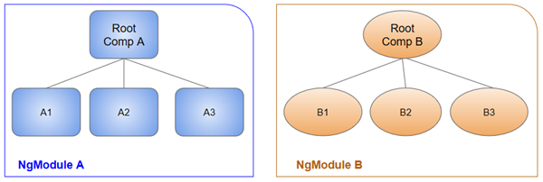
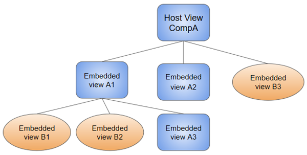
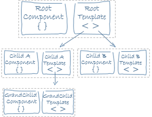

# 架构
## 一、架构概览
  Angular 是一个用 HTML 和 TypeScript 构建客户端应用的平台与框架。 Angular 本身使用 TypeScript 写成的。它将核心功能和可选功能作为一组 TypeScript 库进行实现，你可以把它们导入你的应用中。
  Angular 的基本构造块是 NgModule，它为组件提供了编译的上下文环境。 NgModule 会把相关的代码收集到一些功能集中。Angular 应用就是由一组 NgModule 定义出的。 应用至少会有一个用于引导应用的根模块，通常还会有很多特性模块。
  - 组件定义视图。视图是一组可见的屏幕元素，Angular 可以根据你的程序逻辑和数据来选择和修改它们。 每个应用都至少有一个根组件。
  -  组件使用服务。服务会提供那些与视图不直接相关的功能。服务提供商可以作为依赖被注入到组件中， 这能让你的代码更加模块化、可复用，而且高效。
    组件和服务都是简单的类，这些类使用装饰器来标出它们的类型，并提供元数据以告知 Angular 该如何使用它们。
  -  组件类的元数据将组件类和一个用来定义视图的模板关联起来。 模板把普通的 HTML 和指令与绑定标记（markup）组合起来，这样 Angular 就可以在呈现 HTML 之前先修改这些 HTML。
  -  服务的元数据提供了一些信息，Angular 要用这些信息来让组件可以通过依赖注入（DI）使用该服务。
    应用的组件通常会定义很多视图，并进行分级组织。 Angular 提供了 Router 服务来帮助你定义视图之间的导航路径。 路由器提供了先进的浏览器内导航功能。
### 1.模块
  Angular 定义了 NgModule，它和 JavaScript（ES2015） 的模块不同而且有一定的互补性。 NgModule 为一个组件集声明了编译的上下文环境，它专注于某个应用领域、某个工作流或一组紧密相关的能力。 NgModule 可以将其组件和一组相关代码（如服务）关联起来，形成功能单元。
  每个 Angular 应用都有一个根模块，通常命名为 AppModule。根模块提供了用来启动应用的引导机制。 一个应用通常会包含很多功能模块。
  像 JavaScript 模块一样，NgModule 也可以从其它 NgModule 中导入功能，并允许导出它们自己的功能供其它 NgModule 使用。 比如，要在你的应用中使用路由器（Router）服务，就要导入 Router 这个 NgModule。
  把你的代码组织成一些清晰的功能模块，可以帮助管理复杂应用的开发工作并实现可复用性设计。 另外，这项技术还能让你获得惰性加载（也就是按需加载模块）的优点，以尽可能减小启动时需要加载的代码体积。
### 2.组件
  每个 Angular 应用都至少有一个组件，也就是根组件，它会把组件树和页面中的 DOM 连接起来。 每个组件都会定义一个类，其中包含应用的数据和逻辑，并与一个 HTML 模板相关联，该模板定义了一个供目标环境下显示的视图。
  @Component 装饰器表明紧随它的那个类是一个组件，并提供模板和该组件专属的元数据。
  装饰器是一些用于修饰 JavaScript 类的函数。Angular 定义了许多装饰器，这些装饰器会把一些特定种类的元数据附加到类上，以便 Angular 了解这些这些类的含义以及该如何使用它们。
### 3.模板、指令和数据绑定
  模板会把 HTML 和 Angular 的标记（markup）组合起来，这些标记可以在 HTML 元素显示出来之前修改它们。 模板中的指令会提供程序逻辑，而绑定标记会把你应用中的数据和 DOM 连接在一起。
  - 事件绑定让你的应用可以通过更新应用的数据来响应目标环境下的用户输入。
  - 属性绑定让你将从应用数据中计算出来的值插入到 HTML 中。
    在视图显示出来之前，Angular 会先根据你的应用数据和逻辑来运行模板中的指令并解析绑定表达式，以修改 HTML 元素和 DOM。 Angular 支持双向数据绑定，这意味着 DOM 中发生的变化（比如用户的选择）同样可以反映回你的程序数据中。你的模板也可以用管道转换要显示的值以增强用户体验。比如，可以使用管道来显示适合用户所在地区的日期和货币格式。 Angular 为一些通用的转换提供了预定义管道，你还可以定义自己的管道。
### 4.服务依赖于注入
  对于与特定视图无关并希望跨组件共享的数据或逻辑，可以创建服务类。 服务类的定义通常紧跟在 “@Injectable” 装饰器之后。该装饰器提供的元数据可以让你的服务作为依赖被注入到客户组件中。
  依赖注入（或 DI）让你可以保持组件类的精简和高效。有了 DI，组件就不用从服务器获取数据、验证用户输入或直接把日志写到控制台，而是会把这些任务委托给服务。
### 5.路由
  Angular 的 Router 模块提供了一个服务，它可以让你定义在应用的各个不同状态和视图层次结构之间导航时要使用的路径。 它的工作模型基于人们熟知的浏览器导航约定：
  - 在地址栏输入 URL，浏览器就会导航到相应的页面。
  - 在页面中点击链接，浏览器就会导航到一个新页面。
  - 点击浏览器的前进和后退按钮，浏览器就会在你的浏览历史中向前或向后导航。
    不过路由器会把类似 URL 的路径映射到视图而不是页面。 当用户执行一个动作时（比如点击链接），本应该在浏览器中加载一个新页面，但是路由器拦截了浏览器的这个行为，并显示或隐藏一个视图层次结构。
    如果路由器认为当前的应用状态需要某些特定的功能，而定义此功能的模块尚未加载，路由器就会按需惰性加载此模块。
    路由器会根据你应用中的导航规则和数据状态来拦截 URL。 当用户点击按钮、选择下拉框或收到其它任何来源的输入时，你可以导航到一个新视图。 路由器会在浏览器的历史日志中记录这个动作，所以前进和后退按钮也能正常工作。
    要定义导航规则，你就要把导航路径和你的组件关联起来。 路径（path）使用类似 URL 的语法来和程序数据整合在一起，就像模板语法会把你的视图和程序数据整合起来一样。 然后你就可以用程序逻辑来决定要显示或隐藏哪些视图，以根据你制定的访问规则对用户的输入做出响应。
### 6.接下来
  一张 图：
  
  - 组件和模板共同定义了Angular的视图
   - 组件类上的装饰器为其添加了元数据，其中包括指向相关模板的指针。
   - 组件模板中的指令和绑定标记会根据程序数据和程序逻辑修改这些视图。
  - 依赖注入器会为组件提供一些服务，比如路由器服务就能让你定义如何在视图之间导航。
##二、模块简介
  Angular 应用是模块化的，它拥有自己的模块化系统，称作 NgModule。 一个 NgModule 就是一个容器，用于存放一些内聚的代码块，这些代码块专注于某个应用领域、某个工作流或一组紧密相关的功能。 它可以包含一些组件、服务提供商或其它代码文件，其作用域由包含它们的 NgModule 定义。 它还可以导入一些由其它模块中导出的功能，并导出一些指定的功能供其它 NgModule 使用。
  每个 Angular 应用都至少有一个 NgModule 类，也就是根模块，它习惯上命名为 AppModule，并位于一个名叫 app.module.ts 的文件中。引导这个根模块就可以启动你的应用。
  虽然小型的应用可能只有一个 NgModule，不过大多数应用都会有很多特性模块。应用的根模块之所以叫根模块，是因为它可以包含任意深度的层次化子模块。
###1.根模块和特性模块
  首先每个angular应用至少有一个根模块（AppModule），在比较小的项目中，有这一个模块就够了。但是在大项目中，页面非常多，就有很多特性模块了，特性模块就是一个内聚代码块，专注于某个应用领域、工作流或者功能让相近页面相近的功能，比如钩哒里面的LayoutModule、RoutesModule、ServiceModule，看名字就知道这个模块里面大概是干嘛的。
###2.@NgModule 元数据
  在模块里面（不管是根模块还是特性模块）都有一个@NgModule的装饰器的类，NgModule是一个装饰器函数，它接收一个用来描述模块属性的元数据对象，最重要的属性有：
  - declarations，所有的视图类都在这儿声明，不声明就用肯定报错没跑了，组件、指令、管道都属于视图类。
  -  exports，declarations的子集，可用于其它模块的组件模板。
  -  imports，引入本模块所需要的其它模块。
  -  providers，服务的提供商，服务不放在这里面没法用，放在根模块的providers里面就全局都能用。
  - bootstrap，应用的主视图，称为根组件。它是应用中所有其它视图的宿主。只有根模块才应该设置这个 bootstrap 属性。
eg：一个简单的根模块：
```typescript
import {NgModule} from"@angular/core"
import {BrowserModule} from"@angular/platform-browser"
import {AppComponent} from"......"
@NgModule({
   imports: [BrowserModule],
   providers:[Logger],
   declarations:[AppComponent],
   exports: [AppComponent],
   // 其实根模块不需要导出任何东西，别的模块又不需要导入根模块，但是特性模块记得有需要的就要导出了，不然别的地方用不了
   bootstrap:[AppComponent]

})
```
  ps：引导根模块来启动应用的就是main.ts，里面有一句
```typescript
platformBrowserDynamic().bootstarpModule(AppModule)
```
  所以，启动开发服务器的时候，找到了main.ts，根据main找到了AppModule，根据AppModule里面bootstrap的指定，启动那个组件，就看到页面啦。
### 3.NgModule和组件
  NgModule 为其中的组件提供了一个编译上下文环境。根模块总会有一个根组件，并在引导期间创建它。 但是，任何模块都能包含任意数量的其它组件，这些组件可以通过路由器加载，也可以通过模板创建。那些属于这个 NgModule 的组件会共享同一个编译上下文环境。
  
  组件及其模板共同定义视图。组件还可以包含视图层次结构，它能让你定义任意复杂的屏幕区域，可以将其作为一个整体进行创建、修改和销毁。 一个视图层次结构中可以混合使用由不同 NgModule 中的组件定义的视图。 这种情况很常见，特别是对一些 UI 库来说。
  
  当你创建一个组件时，它直接与一个叫做宿主视图的视图关联起来。 宿主视图可以是视图层次结构的根，该视图层次结构可以包含一些内嵌视图，这些内嵌视图又是其它组件的宿主视图。 这些组件可以位于相同的 NgModule 中，也可以从其它 NgModule 中导入。 树中的视图可以嵌套到任意深度。
### 4.NgModules 和 JavaScript模块
  NgModule就是一个带有@NgModule的装饰器的类，是Angular的一个基础特性。
  JavaScript的模块系统，就是用来管理一组JS对象，和Angular的模块系统没啥关系，JS里面每一个文件都可以看作是一个模块，文件里面定义的对象属于这个模块，最后通过export关键字，可以向外暴露这些对象，可以使别的模块去引用它（import引入就能用啦）
  两个模块系统互补，写程序的时候都要用到。
### 5.Angular自带的库
  新建一个angular应用的时候，node-modules里面有很多的包，@angular开头的就是Angular的模块库，比如 在某个文件中 import {Component} from "@angular/core"，意思就是从@angular/core的库中，导入Component的装饰器；或者 import {BrowserModule} from "@angular/platform-browser"，就是从@angular/platform-browser库里面导入一个BrowserModule的Angular模块
  ps：某个应用模块需要用到BrowserModule的时候，不仅要引入，也要把它加入@NgModule元数据的imports数组里面去。imports ： [BrowserModule]，这种情况下，Angular和JS的模块系统就一起使用啦。
## 三、组件简介
  组件就是一个带有特定功能的可以被反复使用的视图。
  Angular是以模块为基本单位（Vue好像是以组件为基本单位的吧），模块是由各种各样的组件构成的。创建过的每一个组件，在使用之前，都要去对应的模块中去声明，声明之后，只允许在该模块内使用，在根模块里面声明的话，就哪儿都能用了。
  在类里面，就是导出那个，定义组件的应用逻辑，为视图提供支持，让视图不仅能看还能用。组件通过一些属性和方法组成的API和视图进行交互（就是全景图里面的属性绑定和事件绑定啦）。
eg:一个简单的组件实例代码
```typescript
	export class NameComponent implements OnInit {
		//导出一个类
		arrs: Arr[];
		//其实随便定义一个什么就行，用来接受从服务哪里获取到的值
		selectedArr: Arr;
		//随便定义的，接受事件被调用时传入的值
		constructor (private service: ArrService) {}
		//在构造函数里面实例化一个服务，这个服务是在某个地方写好，引入并注入过的啦，
		//ps：angular中的服务是单例模式，在这个应用程序中，这个对象只保留一个实例。
		ngOninit() {
		//生命周期函数，ngOnInit表示组件在创建后立刻就调用，别的钩子就见到的时候再说。
			this.arrs = this.service.getArrs();
			//service后面就是定义好的方法啦
		}
		selectedArrs(arr: Arr) {this.selectedArr = arr} 
		//这是一个事件，调用时就可以拿到传入的值并赋值给selectedArr
	}
```
### 1.组件的元数据
  简单来说，元数据就是@Component里面的那些属性，单独看某个Component的时候，就只是被导出了一个类，angular并不知道，通过元数据里面的属性，告诉angular这是个组件，告诉angular去哪儿获取我给组件指定的各种构建模块，什么HTML模板啦、css啦..
```txt
	selector：选择器，要用当前组件的时候，把这个名字当做普通的HTML标签
	templateUrl：模板的相对地址
	template：直接写HTML在这里，不用引入html文件
	styleUrls：一个数组，放css的地址，可以放多个
	providers：服务的依赖注入提供商数组，服务要想使用，先引入，然后指定提供商，然后实例化，才能使用。
```
### 2.模板与视图
  你要通过组件的配套模板来定义其视图。模板就是一种 HTML，它会告诉 Angular 如何渲染该组件。
  视图通常会分层次进行组织，让你能以 UI 分区或页面为单位进行修改、显示或隐藏。 与组件直接关联的模板会定义该组件的宿主视图。该组件还可以定义一个带层次结构的视图，它包含一些内嵌的视图作为其它组件的宿主。
  
  带层次结构的视图可以包含同一模块（NgModule）中组件的视图，也可以（而且经常会）包含其它模块中定义的组件的视图
### 3.模板语法
   组件建成的时候，自带了模板，在这里面定义组件的视图。模板是以HTML的形式存在，告诉angular如何渲染组件，但是也不完全是标准的HTML。
	比如：
```html
    <ul>
        <li *ngFor="let arr of arrs" (click)="selectedArrs(arr)" >{{arr}}</li>
        <!--*ngFor 循环指令，可以生成和arrs的length一样多的li，绑定单击事件就是(click)，绑定别的事件也要加()-->
    </ul>
    <app-detail *ngIf="selectedArr" [arr]="selectedArr"></app-detail>
    <!--app-detail，是别的组件的名字，当做普通的HTML标签使用；*ngIf，根据等号后面的值的真假来决定当前的元素要不要挂载到DOM树上；[]是属性绑定的时候用的，加入等号后面的值是不确定的，就需要用属性绑定-->
```
### 4.数据绑定
  在传统模式下，数据变化或者视图更改都是直接操作页面DOM元素，angular支持数据绑定，通过数据来控制页面视图。
比如：
```html
	<li>{{arr.xxx}}</li>
	//{{arr.xxx}}插值表达式 在<li>标签中显示组件的arr.xxx属性的值。
	<app-hero-detail [arr]="selectedArr"></app-hero-detail>
	//[arr]属性绑定 把父组件NameComponent的selectedArr的值传到子组件DetailComponent的arr属性中。
	<li (click)="selectedArr(arr)"></li>
	//(click) 事件绑定 在用户点击li时调用组件的selectedArr方法。
除了上面三种，还有第四种数据绑定：
	<input [(ngModel)]="arr.xxx">
	//[(ngModel)]双向数据绑定 数据属性的值通过属性绑定到视图到输入框，用户修改以后通过事件绑定把新值流回组件，并更新属性的值，这个绑定可以说是非常重要了。
```
  一图展示数据绑定的四种形式：
  
	ps：双向数据绑定的原理
		TODO暂时没有搞明白脏数据检查机制，网上的解释都是angularJS的，不准，待定。
### 5.管道
  Angular 的管道可以让你在模板中声明显示值的转换逻辑。 带有 @Pipe 装饰器的类中会定义一个转换函数，用来把输入值转换成供视图显示用的输出值。
  Angular 自带了很多管道，比如 date 管道和 currency 管道，完整的列表参见 Pipes API 列表。你也可以自己定义一些新管道。
  要在 HTML 模板中指定值的转换方式，请使用 管道操作符 (|)。{{interpolated_value | pipe_name}}
  你可以把管道串联起来，把一个管道函数的输出送给另一个管道函数进行转换。 管道还能接收一些参数，来控制它该如何进行转换。比如，你可以把要使用的日期格式传给 date 管道：
```html
<!-- Default format: output 'Jun 15, 2015'-->
 <p>Today is {{today | date}}</p>
<!-- fullDate format: output 'Monday, June 15, 2015'-->
<p>The date is {{today | date:'fullDate'}}</p>
 <!-- shortTime format: output '9:43 AM'-->
 <p>The time is {{today | date:'shortTime'}}</p>
```
### 6.指令
  angular的模板是动态的，动态的东西就要有指令来操控，angular渲染模板的时候，就是根据指令的操作对DOM进行转换。
  组件就是一个指令，@Component的装饰器实际上也是@Directive的装饰器，就是扩展了面向模板的特性。因为在angular中组件处于中心地位，所以在架构里面，把组件从指令里面独立了出来。
  angular所支持的常见的指令：
```txt
 	1. *ngFor，循环指令，生成N个标签
		eg : <any *ngFor="let tmp of COLL;let i=index"></any>
	2. *ngIf，选择指令，根据表达式的值的真假决定是否将元素挂载到DOM树
		eg ： <any *ngIf="expression"></any>
	3. [ngSwitch]，多重选择指令，跟if(){} else if(){} else{} 差不多
		eg : <div [ngSwitch]="">
				<any *ngSwitchCase=""></any>
				<any *ngSwitchDefault></any>
        	 </div>
	    一个坑：同一个元素标签上不能同时放两个结构型指令（上面这三个加*的，对DOM
	    	   修改删除的就是结构型指令），如果需要同时使用，可以在外层包裹
	    	   <ng-container>标签，把一个指令放在这个标签上面。
	4.事件绑定，给事件名加个小括号
		eg ： <any (eventname)="fn()"></any>
	5.属性绑定，动态绑定样式类或者样式
		ngClass ：<any [ngClass]="{className: true/false}">
		ngStyle ：<any [ngStyle]="{styleName: 放个变量在这}">
	6.插值表达式，就是双花括号，把表达式里面的值显示在页面上
		eg ： <any>{{表达式}}</any>
	7.双向数据绑定，从页面获取数据就靠它了，但是不能直接用，ngModel属于表单模块，使用之前在app.module.ts中要先引入FormsModule，放到imports数组中，才能使用。
		eg ： <input [(ngModel)]="变量">
			  显示：<any>{{变量}}</any>
		如果需要监听用户的操作，可以在标签上绑定(ngModelChange) = "fn()"
		
		ps：双向数据绑定原理
			大佬的博客：（自己还没完全整明白）
			http://blog.csdn.net/u011256637/article/details/71056731
			注：脏值检测就是不关心如何以及何时改变的数据，只关心在特定的检查阶段数据
			    是否改变的监听技术，可以实现批量处理完数据之后，再去统一更新视图。
```
## 四、服务与依赖注入简介
### 1.服务
  服务是一个广义的概念，它包括应用所需的任何值、函数或特性。狭义的服务是一个明确定义了用途的类。它应该做一些具体的事，并做好。
  Angular 把组件和服务区分开，以提高模块性和复用性。
  通过把组件中和视图有关的功能与其他类型的处理分离开，你可以让组件类更加精简、高效。 理想情况下，组件的工作只管用户体验，而不用顾及其它。 它应该提供用于数据绑定的属性和方法，以便作为视图（由模板渲染）和应用逻辑（通常包含一些模型的概念）的中介者。
  组件不应该定义任何诸如从服务器获取数据、验证用户输入或直接往控制台中写日志等工作。 而要把这些任务委托给各种服务。通过把各种处理任务定义到可注入的服务类中，你可以让它可以被任何组件使用。 通过在不同的环境中注入同一种服务的不同提供商，你还可以让你的应用更具适应性。
  Angular 不会强制遵循这些原则。它只会通过依赖注入让你能更容易地将应用逻辑分解为服务，并让这些服务可用于各个组件中。
```typescript
	  //比如封装一个打印服务：
	  	eg ：log.service.ts
	  		import {Injectable} from "@angular/core";
	  		@Injectable()
	  		export class LogService {
  				isDev : Boolean = false;
  				constructor() {}
  				print(msg : any){
  					if(this.isDev) console.log(msg);
  					//如果是生产环境就不打印，开发环境就打印
				}
			}
			
		//使用该服务：
			import {LogService}from './log.service';
			@Component({
  				providers: [LogService]
  				//指定提供商
			})
			constructor (private log: LogService){}//实例化才能用
			fn(){
  				this.log.print(XXXX);//随便在该组件需要的地方调用就好啦
			}
			
	  //更多的时候，在一个应用里面，是把所需要的网络请求封装在服务里面
	  	//eg ： http.service.ts
	  		import { Injectable } from '@angular/core';
			import { Http, Response } from '@angular/http';
			@Injectable()
			export class HttpService {
    			constructor(private http: Http) { }
    			sendRequest(myUrl:string){//发起网络请求
        		return this.http.get(myUrl)
        				.map((response: Response) => response.json());
    			}
			}
```
  使用该服务：
  步骤还是一样的：引入-->实例化-->调用
  调用方法:
```typescript
getData(){
  this.httpService.sendRequest("./test.json")
    .subscribe((data:any)=>{
    console.log(data);
  })
}
/*重点就是这个subscribe了，目前异步的的请求方式有：
AJAX、事件绑定、promise、
rxjs（observable/subscribe，消息订阅机制？？）*/
```
### 2.依赖注入
  ”依赖注入“是提供类的新实例的一种方式，还负责处理好类所需的全部依赖，大多数依赖都是服务，Angular使用依赖注入来提供新组件以及组件所需的服务。
  Angular通过查看构造函数的参数类型得知组件需要哪些服务，
	eg ： constructor (private http : HttpService){}
	    //该组件的构造函数需要一个HttpService的服务
  当Angular创建组件时，会首先为组件所需的服务请求一个injector-注入器
  注入器维护一个服务的实例的容器，存放着以前创建的实例，如果所请求的服务实例不在容器里面，注入器就创建一个服务实例然后添加到这个容器中，再把这个服务返回给Angular。当所有的请求服务都被解析完并返回时，Angular就以这些服务为参数去调用组件的构造函数，这就是整个依赖注入的过程。
  那么，在上面的服务调用里面，把需要用的服务放在了providers里面了，就是用注入器给HttpService注册了一个提供商，就是把HttpService给添加到注入器里面去了。
  服务可以注入到一个组件，也可以注入到一个模块中。
  如果服务通过不同组件的providers，注入到不同的组件，那么服务是被创建了很多次，每一个都是一个单独的实例，都没有关系。
  如果服务注入到了一个组件中，那么这个组件由有其它的子组件构成，那么在子组件中如果引入服务类（不会通过providers去指定），那么所实例化的服务类对象是同一个实例对象。
  如果服务是注入到了一个模块中，那么该模块任何一个组件所import和实例化得到的服务都是同一个实例
  如果想在全局使用这个服务，就在根模块的providers里面注入就好啦
	注意：
		· 依赖注入是渗透在整个Angular框架中的，被导出使用。
		· 注入器（Injector）是这个机制的核心（注入器要负责维护一个存放它创建过的容器，能使用提供商创建一个新的服务实例）
		· 提供商是用来创建服务的地方，将依赖注入到当前的对象中
		· 提供商要注册到注入器
### 3.提供服务
  对于要用到的任何服务，必须至少注册一个提供商，可以在模块中或者组件中注册这些提供商。
  - 当你往根模块中添加服务提供商时，服务的同一个实例会服务于你应用中的所有组件。
```typescript
providers: [
  BackendService,
  HeroService,
  Logger
],
```
  - 当你在组件级注册提供商时，你会为该组件的每一个新实例提供该服务的一个新实例。 要在组件级注册，就要在 @Component 元数据的 providers 属性中注册服务提供商。
```typescript
@Component({
  selector:    'app-hero-list',
  templateUrl: './hero-list.component.html',
  providers:  [ HeroService ]
})
```


