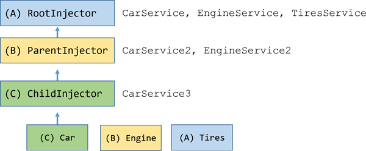

# 依赖注入
## 一、依赖注入（Dependency injection）模式
  依赖注入是一个重要的设计模式。它使用的非常广泛，简称DI，Angular有自己的依赖注入框架。
### 1.为啥要学依赖注入？
  先看下面的例子：
```typescript
	export class Car{
      public engine: Engine;
      public tires: Tires;
      public description = 'NO DI';
      constructor() {
        this.engine = new Engine();
        this.tires = new Tires();
      }
      // 使用engine 和 tires方法
      drive(){
        return `${this.description} car with ${this.engine.cylinders} cylinders and ${this.tires.make} tires`
      }
	}
```
  Car类在自己的构造函数中创建了它所需要的一切，但是这样做的话，Car类比较脆弱、不灵活而且难以测试。Car类需要一个engine 和 一些 tires，他没有去请求现成的实例，而是在构造函数中用具体的Engine和Tires类实例化自己的副本。
  如果Engine类升级了，它的构造函数要求传入一个参数，这个时候应该怎么办呢，这个Car类被破坏掉了，在把创建引擎的代码重写为this.engine = new Engine(theNew Parameter) 之前，他都是坏的。当第一次写Car类的时候，我并不关心Engine构造函数的参数，现在也不想关心。但是当Engine类的定义发生变化时，就得在乎一下了，Car类也不得不跟着改变。这就会让Car类变得过于脆弱。还有，如果我想在Car上使用不同品牌的轮胎呢，不行，我现在已经被锁定在Tires类创建时使用的那个品牌上。这让Car类缺乏弹性。
  现在每辆车都要自己的引擎。它不能和其它车辆共享引擎。虽然对于汽车这还能能够理解，但是设想一下那些应该被共享的依赖，比如说我车上用的车载无线电。这种车缺乏必要的弹性，无法共享当初给其它消费者创建的车载无线电。所以当需要给Car类写测试的时候，就会受制于它背后的依赖，是否能在测试环境中成功创建新的engine，Engine自己依赖什么，那些依赖本身又依赖什么，Engine的新实例是否会发起到服务器的异步调用。谁也不会想在测试的时候这么一层层的追问。现在就没法控制这辆车背后隐藏的依赖，当不能控制依赖时，类就会变得难以测试。。
  现在把Car的构造函数改造成使用DI的版本：
```typescript
public description = 'DI';;
constructor(public engine: Engine, public tires: Tires){}
```
  现在依赖的定义移到了构造函数中。Car类不再创建引擎engine或者轮胎tires，它仅仅“消费”它们。
  现在通过往构造函数中传入引擎和轮胎来创建一辆车。
```typescript
let car = new Car(new Engine(), new Tires())
```
  这样引擎和轮胎这两个依赖的定义与Car类本身就解耦了。此外，也可以传入任何类型的引擎或者轮胎，只要它们能满足引擎或轮胎的通用API需求。这样就算Engine类被扩展，也不回影响Car。
```typescript
  // 那Car的消费者也有这个问题，消费者必须修改创建这辆车的代码，就像这样：
  class Engine2 {
    constructor(public cylinders: number) { }
  }
  let bigCylinders = 12;
  let car = new Car(new Engine2(bigCylinders), new Tires());
  // 这里的要点是Car本身不必变化。然后解决消费者的问题。
```
  Car类非常容易测试，因为现在我对它的依赖是有控制权的，在每个测试期间，我都可以往构造函数中传入mock对象，做想让他们做的事：
```typescript
class MockEngine extends {cylinders = 8}
class MockTires  extends Tires  { make = 'YokoGoodStone'; }
let car = new Car(new MockEngine(), new MockTires());
```
  所以依赖注入就是一种编程模式，可以让类从外部源中获得它的依赖，而不必亲自创建它们。但是消费者怎么办，那些希望得到一个Car的人现在必须创建所有这三部分了：Car、Engine和Tires。Car类把它的快乐建立在了消费者的痛苦之上，需要某种机制给我把这三个部分装配好：
  那就来一个巨型的类来做这件事：
```typescript
import { Engine, Tires, Car } from './car';
// 现在这个模式就不咋好
export class CarFactory {
  createCar() {
    let car = new Car(this.createEngine(), this.createTires());
    car.description = 'Factory';
    return car;
  }
  createEngine() {
    return new Engine();
  }
  createTires() {
    return new Tires();
  }
}
```
  现在只需要三个创建方法，这还不算太坏，但是当应用规模变大之后，维护它就很难了，这个工厂类将变成由相互依赖的工厂方法构成的巨型蜘蛛网。如果能简单列出想建造的东西，而不用定义该把那些依赖注入到哪些对象就好了，依赖注入的的注入器就可以：
```typescript
let car = injector.get(car)//这样就ok啦
```
  Car 不需要知道如何创建 Engine 和 Tires。 消费者不需要知道如何创建 Car。 开发人员不需要维护巨大的工厂类。 Car 和消费者只要简单地请求想要什么，注入器就会交付它们。这就是“依赖注入框架”存在的原因。
## 二、Angular的依赖注入
  依赖注入是用来创建对象及其依赖的其它对象的一种方式。当依赖注入系统创建某个对象实例时，会负责提供该对象所依赖的对象。
### 1.DI的例子
  现在通过一个例子来学习Angular的依赖注入技术，首先这是人物例子的简化版的代码：
  **person.component.ts**
```typescript
    import {Component} from "@angular/core"
    @Component({
      selector:'app-person',
      template:`<h2>Person</h2><app-person-list></app-person-list>`
    })
    export class PersonComponent{}
```
  **person-list.component.ts**
```typescript
  import {Component} from '@angular/core';
  import {PERSON} from './mock-heroes';
@Component({
  selector: 'app-person-list',
  template: `
    <div *ngFor="let person of persons">
      {{person.id}} - {{person.name}}
    </div>
  `
})
export class PersonListComponent {
  person = PERSON;
}
```
  **person.ts**
```typescript
export class Person{
  id: number;
  name: string;
  isSecret = false;
}
```
  **mock-person.ts**
```typescript
import {person} from './person';

export const PERSON: PERSON[] = [
  { id: 11, isSecret: false, name: '许嵩' },
  { id: 12, isSecret: false, name: '山田凉介' },
  { id: 13, isSecret: false, name: '知念侑李' },
  { id: 14, isSecret: false, name: '夏目贵志' },
  { id: 15, isSecret: false, name: '金田一一' },
  { id: 16, isSecret: false, name: '江户川柯南' },
  { id: 17, isSecret: false, name: 'Sherlock' },
  { id: 18, isSecret: true,  name: 'Jhon' },
  { id: 19, isSecret: true,  name: 'Korn' },
  { id: 20, isSecret: true,  name: 'Knock' }
];
```
  PersonComponent是位于顶级的组件。它唯一的用途是显示PersonListComponent，它显示一个英雄名字的列表。这个版本的PersonListComponent从PERSON数组中获取person：
```typescript
  export class PersonListComponent{persons = PERSON}
```
  在开发的早期阶段，这就够用了，不过是不理想的，当要测试这个组件或者要从远端服务器获取数据时，就不得不修改PersonListComponent的实现，并要替换所有使用了PERSON模拟数据的地方。最好隐藏服务类的这些内部实现西街，就先把它定义在自己的文件中
### 2.创建一个可注入的PersonService
  AngularCLI可以使用 ng g service persons/person 创建一个新的PersonService类。这个命令创建出来的PersonService的初步代码长这样：
```typescript
import {Injectable} from "@angular/core";
@Injectable()
export class PersonService{
  constructor() {}
}
```
  目前先把@Injectable装饰器当做定义每个Angular服务时的必备部分，把该类的其它部分改写为暴露一个返回和以前一样的mock数据的getPersons方法
```typescript
import {Injectable} from '@angular/core';
import {PERSONS} from './mock-persons';
@Injectable()
export class PersonService() {
  getPersons() {return PERSONS}
}
```
  现在还不是真正的数据服务，如果该应用是从服务器获取数据的话，那getPersons的方法签名就应该是异步形成的，现在先不管这个，现在的问题在于把服务注入到PersonListComponent里面。
###3.注册服务提供商
  在把Angular中的服务注册进依赖注入器之前，它只是一个普通的类。Angular的依赖注入器负责创建服务的实例，并把它们注入到像PersonListComponent这样的类中。其实很少需要自己创建Angular的依赖注入器，当Angular运行本应用时，，它会为我创建这些注入器，首先会在引导过程中创建一个根注入器。但是在注入器创建服务之前，得先往注入器中注入这个服务的提供商。提供商会告诉注入器如何创建该服务，如果没有提供商，注入器不知道它该负责创建该服务，也不知道如何创建服务。
  可以使用Angular中那些支持providers数组书幸福的装饰器来注册提供商。很多Angular的装饰器都支持带有providers属性的元数据，最重要的两个例子就是@Component和@NgModule
####3.1 在组件中注册提供商
  看一下修改后别的PersonComponent，把PersonService注册到了它的providers数组中：
```typescript
import {Component} from '@angular/core';
import {PersonService} from './person.service';
@Component ({
  selector:'app-person',
  providers: [PersonService],
  template:`<h2>Persons</h2><app-person-list></app-person-list>`
})
export class PersonComponent {}
```
####3.2 @NgModule 中的providers
  在根模块里面，AppModule在自己的providers数组中注册了两个提供商：
```typescript
providers:[UserService,{provide: APP_CONFIG, useValue: PERSON_DI_CONFIG}]
//钩哒项目中的core.module.ts里面进行了此项配置
```
  第一条使用UserService这个注入token注册了UserService类，第二条使用了APP_CONFIG这个注入令牌注册了一个值（PERSON_DI_CONFIG）。这样注册完了之后，Angular现在可以向它创建的任何类中注册UserService或者PERSON_DI_CONFIG的值2了。
#### 3.3 @NgModule还是@Component？
  那么是应该使用Angular的模块还是组件来注册服务呢，这两个选择的差别在于服务的范围和生命周期。Angular模块中的providers（@NgModule.providers）是注册在应用的根注入器下的，因此，Angular可以往它所创建的任何类中注入相应的服务，一旦创建，服务的实例就会存在于该应用的全部生存期中，Angular会把这一个服务实例注入到需求它的每个类中。如果想要把这个UserService注入到应用中的很多地方，并且期望每次注入的都是同一个服务实例，那么在Angular的模块中提供的UserService就可以了。
  严格来说，Angular模块中的服务提供商会注册到根注入器上，但是惰性加载的模块是例外，，在这个例子中，所有模块都是在应用启动时立即加载的，因此模块上的所有服务提供商都注册到了应用的根注入器上。
  组件的提供商会注册到每个组件实例自己的注入器上，因此Angular只能在该组件及其各级子组件的实例上注入这个服务实例，而不能在其它地方注入这个服务实例。注意，由组件提供的服务，也同样具有有限的生命周期，组件的每个实例都会有自己的服务实例，并且，当组件实例被销毁的时候，服务的实例也同样会被销毁。在这个例子的应用中，PersonComponent会在应用启动时创建，并且它从未被销毁，因此，由PersonComponent创建的PersonService也同样会活在应用的整个生命周期中。如果我要把PersonService的访问权限限定在PersonComponent及其嵌套的PersonListComponent中，那么在PersonComponent中提供这个PersonService就行。
### 4.注入某个服务
  PersonListComponent应该从PersonService中获取这些人物数据。该组件不应该使用new来创建PersonService，它应该要求注入PersonService。那我可以通过在构造函数中添加一个带有该依赖的类型的参数要求Angular把这个依赖注入到组件的构造函数中。下面是PersonListComponent的构造函数，它要求注入PersonService：
```typescript
constructor (personService: PersonService)
```
  PersonListComponent还应该使用注入的这个PersonService做点什么，下面输出修改过的组件，改用注入的服务，与之前的版本对比一下：
  **之前的person-list.component**
```typescript
import {Component} from '@angular/core';
import {PERSONS} from './mock-persons';

@Component({
  selector: 'app-person-list',
  template: `
    <div *ngFor="let person of persons">
      {{person.id}} - {{person.name}}
    </div>
  `
})
export class PersonListComponent {
  persons = PERSON;
}
```
  **带有DI的person-list.component**
```typescript
import {Component} from '@angualr/core';
import {Person} from './person';
import {PersonService} from './person.service';
@Component({
  selector:'app-person-list',
  template:`<div *ngFor = 'let peron of perons> {{person.id}}- {{person.name}}</div>`
})
export class PersonListComponent{
  persons:Person[];
  contructor(personService: PersonService) {
    this.persons = personService.getPersons();
  }
}
```
  PersonListComponent并不知道PersonService来自哪里，当然我自己知道它来自父组件PersonComponent，但是如果我改在AppModule中提供PersonService，PersonListComponent不用做任何修改，它唯一需要关心的事情就是PersonService是由某个父注入器提供的。
### 5.单例服务
  服务在每个注入器的范围内是单例的，在任何一个注入器中，最多只会有同一个服务的一个实例。这里只有一个根注入器，而UserService就是在该注入器中注册的，所以在整个应用中只能有一个UserService实例，每个要求注入UserService的类都会得到这个服务实例。不过AngularDI是一个多级注入系统（下一节就是这个了），这意味着各级注入器都可以创建它们自己的服务实例，Angular总会创建多级注入器。
### 6.组件的子注入器
  例如，当Angular创建一个带有@Component的provides的组件实例时，也会同时为这个实例创建一个新的子注入器。组件注入器是彼此独立的，每一个都会为这些组件提供的服务创建单独的实例。
  在注入器继承机制的帮助下，我仍然可以把全应用级的服务注入到这些组件中，组件的注入器也是其父组件的注入器的子注入器，这同样适用于其父组件的注入器，以此类推最终会回到应用的根注入器，Angular可以注入由这个注入器谱系提供的任何一个注入器。比如，Angular可以把PersonComponent提供的PersonService和AppModule提供的UserService注入到PersonService中。
### 7.当服务需要别的服务时
  目前PersonService非常简单，它本身不需要任何依赖，但是如果它也需要依赖，也同样可以用构造函数注入模式，对比一下PersonService有无注入别的服务的两个版本
  **没有注入：**
```typescript
import {Injectable} from '@angular/core';
import {PERSON} from './mock-persons';
@Injectable()
export class PersonService{
  getPerson() {return PERSON}
}
```
  **注入了别的服务：**
```typescript
import {Inejctable} from '@angualr/core';
import {PERSON} from './mock-person';
import {Logger} from '../logger.service';
@Injectable()
export class PersonService{
  constructor(provate logger: Logger}{}
  getPersons() {
    this.logger.log('来拿数据了')
    return PERSON;
  }
}
```
  这个构造函数要求注入一个龙个人实例，并把它存到名为logger的私有字段中，当发起请求的时候，getPersons这个方法就会打印出来那个消息。
  **上面用的的logger服务长这样：**
```typescript
import {Injectable} from '@angular/core';
@Injectable()
export class Logger {
  logs: string[] = [];
  log(message: string) {
    this.logs.push(message);
    console.log(message);
  }
}
//要是没有这个服务，当Angular试图把Logger注入到PersonService中时，就会报错（ERROR Error：No provider for Logger）
```
  因为Logger服务的单例应该随处可用，所以要在根模块AppModule中提供它：
```typescriptt
prroviders:[
  Logger,
  UserService,
  {Provide: APP_CONFIG, useValue:PERSON_DI_CONFIG}
]
```
###8.@Injectable()
  @Injectable()装饰器表示可能需要往这个服务类中注入其它依赖。PersonService必须带有@Injectable()装饰器，因为它需要把Logger注入进来。（切记带着括号）
  当Angular要创建一个构造函数中带有参数的类时，会先查找这些参数的类型，以便根据这些参数的元数据注入正确的服务。如果不能找到该参数的信息，Angular就会报错。Angular只能在带有某种装饰器的类上查找参数信息，任何装饰器都可以，而@Injectable()装饰器是各种服务类的标准装饰器。
```txt
  之所以必须要有装饰器是因为typescript强制要求的，当把typescript转译成JavaScript时，通常会丢弃参数类型信息，但当该类带有装饰器并且当tsconfig.json配置文件中的emitDecoratorMetadata 编译选项为true时，他就会保留这些信息。CLI生成的tsconfig.json已经有了emitDecoratorMetadata ：true选项了，所以我只要把@Injectable()加到我的服务类上就行了。
```
  Logger服务也带有@Injectable()装饰器，不过它没有构造器，也没有依赖，该应用中的每个Angular服务类不管有没有构造器和依赖，都带有@Injectable()装饰器，@Injectable()是风格指南中对服务类的要求。
### 9.服务提供商们
  服务提供商提供依赖值的一个具体的、运行时的版本，注入器依靠提供商来创建服务的实例，注入器再将服务的实例注入组件、管道或者其它服务。必须为注入器注册一个服务的提供商，否则它就不知道该如何创建该服务。下面就解释指定提供商的多种方式，几乎所有的代码片段都是从范例应用的providers.component.ts文件中提取出来的。
#### 9.1 把类作为它自己的提供商
  有很多方式可以提供一些实现Logger类的东西，Logger类本身是一个显而易见且自然而然的提供商。
```typescript
providers: [Logger]
```
  但它不是唯一的途径，可以用其它备选提供商来配置注入器，只要它们能交付一个行为类似于Logger的对象就可以。可以提供一个替代类，那我可以提供一个类似日志的对象，可以给它一个提供商，让它调用可以创建日志服务的工厂函数，所有这些方法，只要用在正确的场合就都可以。重点是当注入器需要一个Logger时，它得先有一个提供商。
#### 9.2 provide对象字面量
  下面是类提供商的另一种语法：
```typescript
providers: [Logger]
```
  这其实是用于注册提供商的简写表达方式，使用的是一个带有两个属性的提供商对象字面量：
```typescript
[{provide: Logger, useClass: Logger}]
```
  provide属性保存的是token，它作为key使用，用于定位依赖值和注册提供商。第二个是一个提供商定义对象，可以把它看作是知道如何创建依赖值的配方。
#### 9.3 备选的类提供商
  某些时候，我会去请求一个不同的类来提供服务你，下面的代码就用来告诉注入器，当有人请求Logger的时候，返回BetterLogger。
```typescript
[{provide:Logger, useClass: BetterLogger}]
```
#### 9.4 带依赖的提供商
  假设EventBetterLogger可以在日志消息中显示用户名，这个日志服务从注入的UserService中取得用户，UserService通常也会在应用级注入：
```typescript
@Injectable()
ecport class EventBBetterLogger extends Logger{
  constructor (private userService: UserService){super();}
  log(message: string){
    let name = this.userService.user.name;
    super.log(`To ${name}:${message}`)
  }
}
```
  就像之前在BetterLogger中那样配置它：
```typescript
[UserService,
	{provide:Logger,useClass:EventBetterLogger}
]
```
#### 9.5 别名类提供商
  假设某个就组建依赖一个OldLogger类，OldLogger和NewLogger具有相同的接口，但是由于某些原因，不能升级这个旧组件并使用它。当旧组件想要使用OldLogger记录消息时，那到时候就改用NewLogger的单例对象来记录。
  不管组件请求的是新的还是就得日志服务，依赖注入器注入的都应该是同一个单例对象，也就是说OldLogger应该是NewLogger的别名。那我当然不希望应用中有两个不同的NewLogger实例，但是如果尝试通过useClass来把OldLogger作为NewLogger的别名，就会导致两个实例，这样不好，不好。
```typescript
[NewLogger,
  //不是别名，这是创建了两个NewLogger的实例
  {
    provide: OldLogge,
    useClass: NewLogger
  }
]
```
  解决，使用useExisting指定别名
```typescript
[NewLogger,
  //别名OldLogger到NewLogger上
  {
    provide: OldLogge,
    useExisting: NewLogger
  }
]
```
#### 9.6 值提供商
  有时候，提供一个预先做好的对象会比请求注入器从类中创建它更容易
```typescript
// Logger Service形式的对象
export function SilentLoggerFn() {}
const silentLogger = {
  logs: ['SilentLogger 记录下 “随便一些字符串”。通过“useValue”注册'],
  log: SilentLoggerFn
};
```
  于是可以通过useValue选项来注册提供商，它会让这个对象直接扮演Logger的角色。
```typescript
[{provide: Logger,useValue: silentLogger}]
```
#### 9.7 工厂提供商
  有时候需要动态创建一个依赖值，因为它所需要的信息知道最后一刻才能确定，也许是这个信息会在浏览器的绘画中不停地变化。还假设这个可注入的服务没法通过独立的源访问此信息。这种情况下，可以调用工厂提供商。
  下面通过添加新的业务需求来看这个问题：PersonService必须对普通用户隐藏掉一些秘密人物，只有授权用户才能看到秘密人物。就像EventBetterLogger那样，PersonService需要了解此用户的身份，它需要知道这个用户是否有权看到隐藏英雄，这个授权可能在单一的应用会话中被改变，例如，改用另一个身份登录时。与EventBetterLogger不同的是不能把UserService注入到PersonService中，PersonService无权访问用户信息，来决定谁有授权谁没有授权。
  让PersonService的构造函数带上一个布尔型的标志来控制是否显示隐藏的英雄：
```typescript
constructor(
	private logger:Logger,
	private IsAuthorized: boolean
) {}
getPersons(){
  let auth = this.isAuuthorized?'authorized':'unauthorized';
  this.logger.log('从${auth}拿到的的人物');
  return PEROSNS.filter(person => this.isAuthorized || !person.isSecret)
}
```
  我可以去注入Logger，但是不能注入逻辑型的isAuthorized，那不得不通过工厂提供商创建这个PersonService的新实例，那么工厂提供商需要一个工厂方法：
```typescript
let personServiceFactory = (logger: Logger, uuserService:  UserService) => {
  return new PersonService(logger,userService.userisAuthorized);
}
```
  虽然PersonService不能访问UserService，但是工厂方法可以。同时把logger和UserService注入到工厂提供商中，并且让注入器把它们传给工厂方法：
```typescript
export let personServiceProvider = {
  provide: PersonService,
  useFactory: personServiceFactory,
  deps:[Logger,UserService]
}
//useFactory 字段告诉Angular：这个提供商是一个工厂方法，它的实现是personServiceFactory
//deps属性是提供商令牌数组，Logger和UserService类作为它们自身类提供商的令牌，注入器解析这些令牌，把相应的服务注入到工厂函数中相应的参数中去。
```
  注意，在一个导出的变量中捕获了这个工厂提供商：personServiceProvider，这个额外的步骤让工厂提供商可被复用，无论哪里需要，都可以使用这个变量注册PersonService。在这个例子中，只在PersonsComponent中需要它，这里它代替了元数据providers数组中原来的PersonService注册，看一下新旧的对比：
```typescript
import {Component} from '@angular/core';
import {personServiceProviders} from './person.service.provider';//新版 
// import {PersonService} from './person.service'; //旧版
@Component ({
  selector :'app-persons';
  providers:[personServiceProviders], //新版
  // providers: [PersonService];//旧版
  template:`<h2>Persons</h2><app-person-list></app-person-list> `
})
export class PersonsComponent{}
```
### 10.依赖注入令牌
  当向注入器注册提供商时，实际上是把这个提供商和一个DI令牌关联起来了，注入器维护一个内部的令牌-提供商映射表，这个映射表会在请求依赖时被引用到，令牌就是这个映射表中的键值。在前面所有例子中，依赖值都是一个类实例，并且类的类型作为它自己的查找键值，在下面的代码中，PersonService类型作为令牌，直接从注入器中获取PersonService实例：
```typescript
personService:PersonService;
```
  编写需要基于类的依赖注入的构造函数是挺幸运了，只要定义一个PersonService类型的构造函数参数，Angular就会知道把跟PersonService类令牌关联的服务注入进来：
```typescript
constructor(personService:PersonService)
```
  这是一个特殊的规约，因为大多数依赖值都是以类的形式提供的。
#### 10.1 非类依赖
  如果依赖不是一个类，而是想要注册一个字符串，函数或者对象的话，应用程序经常为很多很小的因素定义配置对象，但是这些配置对象不总是类的实例，它们可能是独享，如下面这个：
```typescript
export const PERSON_DI_CONFIG AppConfig = {
  apiEndpoint: 'api.persons.com',
  title:'依赖注入'
}
```
  如果想让这个配置对象在注入时可用，就可以用值提供商来注册一个对象，但是这种情况下没有Config类，就没有办法找一个类来当做令牌。
```txt
TypeScript接口不是有一个有效的令牌
PERSON_DI_CONFIG常量有一个接口AppConfig，但是并不能把它当做TypeScript接口用作令牌：
// 失败，不能把interface作为provider token
  [{provide: AppConfig,useValue:PERSON_DI_CONFIG}]
// 失败，不能使用该接口作为参数类型进行注入
  constructor (private config: AppConfig){}
习惯于强类型语言中使用依赖注入的话看这个就很奇怪了，因为强类型语言中，接口是首选的用于查找依赖的主键。这不是Angular的错，接口只是TypeScript设计时的概念，JavaScript没有接口，TypeScript接口不会出现在生成的JavaScript代码中，在运行期，没有接口类型信息可供Angular查找。
```
#### 10.2 InjectionToken值
  解决方案是为非依赖定义和使用InjectionToken作为提供商令牌，定义方式长这样：
```typescript
import {InjectableToken} from '@angular/core'
export const APP_CONFIG = new InjectableToken<AppConfig>('app.config')
```
  类型参数，虽然是可选的，但是可以向开发者和开发工具传达类型信息，而且这个令牌的描述信息也可以为我们开发者提供帮助。使用这个InjectableToken对象注册以来的提供商：
```typescript
providers:[{provide:APP_CONFIG,useValue:PERSON_DI_CONFIG}]
```
  现在，@Inject装饰器的帮助下，这个配置对象可以注入到任何需要它的构造函数中：
```typescript
constructor(@Inject(APP_CONFIG) config: AppConfig) {
  this.title = config.title
}
// 虽然AppConfig接口在依赖注入过程中没有任何作用，但是它为该类中的配置对象提供了强类型信息
```
  或者在ngModule中提供并注入这个配置对象，如AppModule。
```typescript
providers:[
  UserService,
  {provide:APP_CONFIG,useValue:PERSON_DI_CONFIG}
]
```
### 11.可选依赖
  PersonService需要一个Logger，但是如果想不提供Logger也能得到它，可以把构造函数的参数标记为@Optional(),告诉Angular该依赖是可选的：
```typescript
import {Optional} from '@angular/core'
constructor(@Optional() private logger: Logger){
  if(this.logger){
    this.logger.log(some_message);
  }
}
```
  当使用@Optional()时，代码必须准备好如何处理控制，如果其它的代码没有注册一个logger，注入器会设置logger的值为null。
**ps：直接使用注入器**
```typescript
@Component({
  selector:'app-injectors',
  template:
  `
  	<h2>Other Injectors</h2>
  	<div id = 'car'>{{car.drive()}}</div>
  	<div id = 'person'>{{person.name}}</div>
  	<div id = 'rodent>{{rodent}}</div>
  `,
  providers:[Car,Engine,Tires,personService,Logger]
})
export class InjectorComponent implements OnInit{
  car: Car;
  personService:PersonService;
  person:Person;
  constructor(private injector: Injector){}
  ngOnInit() {
    this.car = this.injector.get(Car);
    this.personService = this.injector.get(PersonService);
    this.person = this.personService.getPersons()[0]
  }
  get rodent() {
    let rousDontExist = `R.O.U.S.s? 不存在`
    return this.injector.get(ROUS, rousDONTExist)
  }
}
```
  Injector本身是可注入的服务，在这个例子中，Angular把组件自身的Injectable注入到了组件的构造函数中，然后组件在ngOnInit()中向注入的注入器请求它所需要的服务。注意，这些服务本身没有注入到组件，它们是通过调用injector.get()获得的。get()方法如果不能解析所请求的服务，会抛出异常，调用get()时，还可以使用第二个参数，一旦获取的服务没有在当前或任何祖先注入器中注册过，就把它作为返回值。
```txt
ps:刚刚这个技术，是服务定位器的一个范例，要避免使用此技术，除非确实需要用这个，它难以解释理解和测试，仅仅通过阅读构造函数，没法知道这个类需要什么或者它将做什么。它可以从任何祖先组件中获得服务，而不仅仅是它自己，会迫使自己深入它的实现，才可能明白这个东西做了啥。（框架开发人员必须采用通用的或者动态的方式获取服务时，可能采用这个方法）
```
**ps：建议每个文件只放一个类**
  在同一个文件中有多个类容易造成混淆，最好避免，最好每个文件只放一个类，如果我把PersonService和PersonsComponent组合放在同一个文件里，就得把组件定义在最后，如果组件定义在服务前面，那肯定就报错了。虽然有forwardRef()方法，可以让人先定义组件，但是有简单的方法不用，偏偏用复杂的，是不是sha~
##三、多级依赖注入器
  Angular有一个多级依赖注入系统，实际上，应用程序中有一个与组件树平行的注入器树（平行就是指结构完全相同且一一对应）。我可以在组件树的任何级别上重新配置注入器。
###1.注入器树
  之前说过如何配依赖注入器，以及如何在需要用时用它获取依赖。实际上没有那个唯一的注入器这回事，一个应用中可能有多个注入器。一个Angular应用是一个组件树，每个组件石丽丽都有自己的注入器，组件的树与注入器的树平行。组件的注入器可能是一个组件树中更高级的祖先注入器的代理，但是这只是提升效率的实现细节，但是不要在意这些细节，就想成是每个组件都有自己的注入器就可以了。
  想一下 人物列表 应用的一个简单变种，它的顶层是AppComponent组件，他有一些子组件，PersonsListComponent组件保存和管理着PersonTaxReturnComponent的多个实例。下图展示了当PersonsCardComponent的三个PersonTaxReturnComponent实例同时展开时的三级组件树的状态：

#### 1.1 注入器冒泡
  当一个组件申请获得一个依赖时，Angular先尝试用该组件自己的注入器来满足它，如果该组件的注入器没有找到对应的提供商，它就把这个申请转给它父组件的注入器来处理，如果那个注入器也无法满足这个申请，它就继续转给它的父组件的注入器，这个申请继续往上冒泡，直到找到了一个能处理此批申请的注入器或者超出了组件树中的祖先位置为止。如果超出了组件树中的祖先还未找到，Angular就会抛出一个错误。
```txt
还可以“盖住”这次冒泡，一个中层的组件可以声称自己是“宿主”组件，向上查找提供商的过程会截止于这个“宿主”组件。
```
####  1.2 在不同层级再次提供同一个服务
  我可以在注入器树中的多个层次上为指定的依赖令牌重新注册提供商，但并非必须重新注册，事实上，虽然可以重新注册，但除非有很好的理由，否则不应该这么做。服务器解析逻辑会自上而下查找，碰到的第一个提供商会胜出，因此，注入器树中间层注入器上的提供商，可以拦截来自底层的对特定服务的请求。这导致他可以 “重新配置”和“遮蔽”高层的注入器。
  如果我只在顶级通常就是根模块AppModule，这三个注入器看起来将是“平面”的，所有的申请都会冒泡到根NgModule进行处理，也就是在bootstrapModule方法中配置的那个。
### 2.组件注入器
  在不同层次上重新配置一个或者多个提供商
#### 2.1 场景：服务隔离
  出于架构方面的考虑，可能就会让人决定把一个服务限制到只能在它所属的特定领域中访问。在下面的例子里面有一个VillainsListComponent，它显示一个反派的列表。虽然我可以在根模块AppModule中提供VillainsService，不过那样一来就会导致在整个应用中到处都能访问到VillainsService，包括在人物的工作流中。
  如果以后要修改VillainsService，那也有可能破坏英雄组件中的某些部分，这样不行，但是在根模块里面提供这个服务就可能导致这种状况。
  所以可以换一种方式，只在VillainsListComponent的元数据的providers中提供VillainsService，代码长这样：
```typescript
@Component({
  selector: 'app-villains-list',
  templateUrl: './villains-list.component.html',
  providers: [VillainsService]
})
```
#### 2.2 场景：多重编辑会话
  很多应用允许用户同时进行多个任务，比如，在纳税申报应用中，申报人可以打开多个报税单，随时可能从一个切换到另一个。下面的例子就还是基于任务列表，外层有一个PersonListComponent，它显示一个人物列表。
  要打开一个人的报税单，申报者点击人物的名字，它就会打开一个组件来编辑那个申报单，每个选中的申报单都会在自己的组件中打开，并且可以同时打开多个申报单。每个报税单组件都有下列特征：
  - 属于他自己的报税单会话
  - 可以修改一个报税单，而不会影响另一个组件中的申报单
  - 能把所做的修改保存到它的报税单中，或者放弃它们。
      实现方式之一就是让PersonTaxReturnComponent有逻辑来管理和还原那些更改，这对于简单的报税来说是很容易的，但是现实报税情况是很复杂的，对于这些修改的管理就要狠仔细啦，所以这种管理就需要借助于服务了。
        下面是一个报税单服务PersonTaxReturnService，它缓存了单条PersonTaxReturn，用于跟踪那个申报单的变更，并且可以保存或还原它，它还委托给了全应用级的单例服务PersonService，它是通过依赖注入机制取得的。
      **peron-tax-return.service.ts**
```typescript
import {Intectable} from '@angular/core';
import {PersonTaxReturn} from './person';
import {PersonService} from './person.service';
@Injectable()
export class PersonTaxReturnService{
  private currentTaxReturn: PersonTaxReturn;
  private originalTaxReturn: PersonTaxReturn;
  constructor(private personService: PersonService){}
  set taxReturn(htr:PersonTaxReturn){
    this.originalTaxReturn = htr;
    this.currentTaxReturn = htr.clone();
  }
  get taxReturn():PersonTaxReturn{
    return this.currentTaxReturn;
  }
  restoreTaxReturn(){
    this.taxReturn = this.originalTaxReturn;
  }
  saveTaxReturn(){
    this.taxReturn = this.currentTaxReturn;
    this.personService.saveTaxReturn(this.currentTaxReturn).subscribe()
  }
}
```
  然后下面是正在使用它的PersonTaxReturnComponent组件：
```typescript
import {Component,EventEmitter,Input,Output} from '@angualr/core';
import {PersonTaxReturn} from './person';
import {PersonTaxReturnService} from './person-tax-return.service';
@Component({
  selector:'app-person-tax-return',
  templateUrl: './person-tax-return.component.html',
  styleUrls: ['./person-tax-return.component.css'],
  providers:[PersonTaxReturnService]
})
export class PersonTaxReturnComponent{
  message = '';
  @Output() close == new EventEmitter<void>();
  get texReturn():PersonTaxReturn{
    return this.personTaxReturnService;
  }
  @Input()
  set taxReturn(htr:PersonTaxReturn){
    this.personTaxReturnService.taxReturn = htr;
  }
  constructor(private personTaxReturnService: PersonTaxReturnService){}
  onCanceled(){
    this.flashMessage('取消');
    this.personTaxReturnService.restoreTaxReturn()
  }
  onClose() {this.close.emit()}
  onSaved(){
    this.flashMessage('保存');
    this.personTaxReturnService.saveTaxReturn();
  }
  flashMessage(msg:string){
    this.message = msg;
    setTimeout(() => this.message = '',500)
  }
}
```
  通过输入属性可以得到要编辑的报税单，这个属性被实现成了getter和setter，设置器根据传进来的报税单初始化了组件自己的PersonTaxReturnService实例，getter总是返回该服务所存的人物当前状态，组件也会请求该服务来保存或还原这个报税单。但是这里有个问题，如果这个服务是一个全应用范围的单例，每个组件就都会共享同一个服务实例，每个组件也都会覆盖属于其它人物的报税单，再来看看组件中的providers属性：
```typescript
providers:[PersonTaxReturnService]
```
  PersonTaxReturnComponent 有它自己的PersonTaxReturnService提供商，那每个组件的实例都有自己的注入器，在组件级提供服务可以确保组件每个实例都得到一个自己的、私有的服务实例，那报税单就不会被别的覆盖掉了。
#### 2.3 场景：专门的提供商
  重新提供服务的另一个原因，是在组件树的深层中把该服务替换为更特殊的实现。之前有一个Car的例子来着，车子，引擎，轮胎啥的，假如我在根注入器代号A 中配置了通用的提供商：CarService、EngineService和TiresService。
  创建一个车辆组件A，它显示一个从另外三个通用服务构造出的车辆。然后创建一个子组件B，它为CarService和EngineService定义了自己的特殊的提供商，它们具有适用于组件B的特殊能力。组件B又是组件C 的父组件，而组件C又定义了自己的，更特殊的CarService提供商：

  在幕后，每个组件都有自己的注入器，这个注入器带有为组件本身准备的0个、1个或者多个提供商。当在最深层组件C解析Car的实例时2，它使用注入器C解析生成了一个Car的实例，使用注入器B解析了Engine，而Tires则是由根注入器A解析的。

##四、DI实用技巧
###1.应用程序全局依赖
  在应用程序根组件AppComponent中注册那些被应用程序全局使用的依赖提供商。在下面的例子中，通过@Component元数据的providers数据导入和注册了几个服务（LoggerService，userContext和UserService）
```typescript
import {LoggerService}      from './logger.service';
import {UserContextService} from './user-context.service';
import {UserService}        from './user.service';

@Component({
  selector: 'app-root',
  templateUrl: './app.component.html',
  providers: [LoggerService, UserContextService, UserService]
})
export class AppComponent {
/* 代码代码 */
}
```
  所有这些服务都是用类实现的，服务类能充当自己的提供商，这就是为什么只要把它们列在providers数组里就算注册成功了。现在已经注册了这些服务，这样Angular就能在应用程序的任何地方，把它们注入到任何组件和服务的构造函数里。
```typescript
constructor(logger:LoggerService){
  logger.logInfo('创建 人物输出组件')
}
```
```typescript
constructor(private userService: UserService, private loggerService: LoggerService) {
}
```
### 2.外部模块配置
  通常会在NgModule中注册提供商，而不是在应用程序根组件中。那如果我希望这个服务在应用中到处可以被注入，或者必须在应用启动前注册一个全局服务，那就这么做。
  下面的例子是第二种情况，它为组件路由器配置了一个非默认的地址策略，并把它加入到AppModule的providers数组中：
```typescript
providers: [
  { provide: LocationStrategy, useClass: HashLocationStrategy }
]
```
### 3.@Injectable和嵌套服务依赖
  这些被注入服务的消费者不需要知道如何创建这个服务，它也不用知道，新建和缓存这个服务是依赖注入器的工作。有时候一个服务依赖其它服务，而其它服务可能依赖另外的更多服务，按正确的顺序解析这些嵌套依赖也是框架的工作，在每一步，依赖的使用者只要在它的构造函数里简单声明它需要什么，框架就会完成所有剩下的事情。
  下面的例子往AppComponent里注入的LoggerService和UserService
```typescript
constructor(logger: LoggerService, public userContext: UserContextService){
  userContext.loadUser(this.userId);
  logger.logInfo('AppComponent 初始化')
}
```
UserContext有两个依赖LoggerService和负责获取特定用户信息的UserService。
```typescript
@Injectable()
export class UserContextService{
  constructor(private userService:UserService,private loggerService:LoggerService){}
}
```
  当Angular新建AppComponent时，依赖注入框架先创建一个LoggerService的实例，然后创建UserContextService实例，User人ContextService需要框架已经建好的LoggerService实例和尚未创建的UserService实例。UserService没有其它依赖，所以依赖注入框架可以直接new一个实例。
  依赖注入nb的在于，我创建AppComponent的时候不需要考虑什么，我就只在LoggerService 和 UserContextService 的构造函数里面简单的声明一下，框架就完成了剩下的工作（话说不知道原理用起来心虚啊，虽然我真的没搞懂原理何在），一旦所有的依赖都准备好了，AppComponent就会显示用户信息。
**@Injectable()朱姐**
  注意在UserContextService类里面的@Injectable()装饰器。
```typescript
@Injectable()
export class UserContextService{ }
```
  该装饰器让Angular有能力识别这两个依赖LoggerService和UserService的类型。严格来说这个@Injectable()装饰器只在一个服务类有自己的依赖的时候才是不可缺少的，LoggerService不依赖任何东西，所以该日志服务，在没有@Injectable()的时候应该也能工作，生成的代码也更少一些。
  但是在给它添加依赖的那一瞬间，该服务就会停止工作，要想修复它，就必须要添加@Injectable()。为了保持一致性和防止将来的麻烦，所以就应该从一开就加上@Injectable()。你要是只在真正需要的地方加它也没人管你。
  AppComponent类有两个依赖，但它没有@Injectable()，它不需要，因为组件类有@Component装饰器，在用TypeScript的Angular应用里，有  任何装饰器 来标识依赖的类型就够了。
### 4.把服务作用域限制到一个组件支数
  所有被注入的服务依赖都是单例的，也就是说在任意一个依赖注入器中，每个服务只有唯一的实例。但是Angular应用程序有多个依赖注入器，组织成一个与组件树平行的树状结构。所以，可以在任何组件级别提供和建立特定的服务，如果在多个组件中注入，服务就会被新建出多个实例，分别提供给不同的组件。默认情况下，一个组件中注入的服务依赖，会在该组件的所有子组件中可见，而且Angular会把同样的服务实例注入到该服务的子组件中。
  所以在根部的AppComponent提供的依赖单例就能被注入到应用程序中的任何地方的任何组件。但是这不一定总是想要的，有时候我想要把服务的有效性限制在应用程序的一个特定区域。
  通过在组件树的子级根组件中提供服务，可以把一个被注入服务的作用域局限在应用程序结构中的某个分支中。下面的例子展示了为了子组件和根组件AppComponent提供服务的相似之处，它们语法是相同的，这里通过列入providers数组，在PersonBaseComponent中提供了PersonService：
```typescript
@Component({
  selector: 'app-unsorted-person',
  template:`<div *ngFor= "let tmp of person">{{tmmp.name}}</div>`,
  providers:[PersonService]
})
export class PersonBaseComponent implements OnInit{
  constructor(private personService:PersonService)
}
```
  当Angular新建PersonBaseComponent的时候，它会同时新建一个PersonService实例，该实例只在该组件及其子组件中可以，前提是有这个子组件。也可以在应用程序别处的不同的的组件里提供PersonService，这样就会导致在不同注入器中存在该服务的不同实例。
  这个例子中，局部化的PersonService单例遍历整个例子里的代码，包括PersonBiosComponent、PersonBaseComponent。这些组件每个都有自己的PersonService实例，用来管理独立的英雄库。
### 5.多个服务实例（sandboxing）
  在同一个级别的组件树里，有时需要一个服务的多个实例，一个用来保存其伴生组件的实例状态的服务就是挺好的例子，每个组件都需要好服务的单独实例，每个服务都有自己的工作状态，与其它组件的服务和状态隔离，这叫做沙箱化，因为每个服务和组件实例都在自己的沙箱里运行。
  比如，一个PersonBiosComponent组件显示三个PersonBiosComponent的实例：
```typescript
@Component({
  selector:'app-person-bios',
  template: `
  	<app-person-bio [personId] = "1"></app-person-bio>
  	<app-person-bio [personId] = "2"></app-person-bio>
  	<app-person-bio [personId] = "3"></app-person-bio>
  `,
  providers:[PersonService]
})
export class PersonBiosComponent{}
```
  每个PersonBioComponent都能编辑每个人物的生平，PersonBioComponent依赖PersonCacheService服务来对该人物记性读取、缓存和执行其它持久化操作。
```typescript
@Injectable()
export class PersonCacheService{
  person:Person;
  constructor(private personService:PersonServie){}
  fetchCachedPerson(id:number){
    if(!this.person){
      this.person = this.personService.getPersonById(id)
    }
    return this.person;
  }
}
```
  很明显，这三个PersonBioComponent实例不能共享一样的PersonCacheService，要不然会相互起冲突，争相把自己人放在缓存里。通过在自己的元数据providers数组里面列出的PersonCacheService，每个PersonBioComponent就能有自己独立的PersonCacheService实例。
```typescript
@Component({
  selector: 'app-person-bio',
  template:`<h4>{{person.name}}</h4>
  <ng-content></ng-content>
  <textarea cols="25" [(ngModel)] = "person.description"></textarea>
`,
providers:[PersonCacheService]
})
export class PersonBiosComponent implements OnInit{
  @input() personId:number;
  constructor(private PersonCache:PersonCacheService){}
  ngOnInit(){
    this.personCache.fetchCachedPerson(this.personId)
  }
  get person() {return this.personCache.person}
}
```
  父组件PersonBiosComponent把一个值绑定到personId，ngOnInit把该id传递到服务，然后服务获取和缓存人物，person属性的getter从服务里面获取缓存的英雄，并在模板里显示它绑定到属性值。
### 6.使用@Optional()和@Host()装饰器来限定依赖查找方式
  依赖可以被注入到任何组件级别，当组件申请一个依赖时2，Angular从该组件本身的注入器开始，沿着依赖注入器的树往上找，直到找到第一个符合要求的提供商，如果Angular不能在这个过程中找到合适的依赖，它就会抛出一个错误。
  大部分的时候，如果确实想要这个行为，但是有时候需要限制这个依赖查找逻辑，或者提供一个缺失的依赖，单独或者联合使用@Host和@Optional限定型装饰器，就可以修改Angular的查找行为。当Angular找不到依赖时,@Optional装饰器就会告诉Angular继续执行，Angular把此注入参数设置为null，而不用默认的抛出错误的行为。@Host装饰器将把往上搜索的行为截止在宿主组件，宿主组件通常是申请这个依赖的组件，但当这个组件被投影进一个父组件后，这个父组件就变成了宿主，下一个例子演示第二种情况：
```typescript
// PersonBiosAndContactsComponent是前面的PersonBiosComponent的修改版
@Component({
  selector:'app-person-bios-and-contacts',
  template:`
  <app-person-bio [personId]="1"> <app-person-contact></app-person-contact> </app-person-bio>
  <app-person-bio [personId]="2"> <app-person-contact></app-person-contact> </app-person-bio>
  <app-person-bio [personId]="3"> <app-person-contact></app-person-contact> </app-person-bio>
  `,
  providers:[PersonService]
})
export class PersonBiosAndContactsComponent{
  constructor(logger: LoggerService) {
    logger.logInfo('创建 PersonBiosAndContactsComponent');
  }
}
```
  在<person-bio>标签中是一个新的<person-contact>元素，Angular就会把相应的PersonContactComponent投影给PersonBioComponent的视图里，将它放在PersonBioComponent模板的<ng-content>标签槽里。
  下面的PersonContactComponent，示范了限定型装饰器（@Optional和@Host）
```typescript
@Component({
  selector:'app-person-contact',
  template:`<div>电话：#{{phoneNumber}}
  	<span *ngIf = "hasLogger">略略略略</span>
  </div>`
})
export class PersonContactComponent{
  hasLogger = false;
  constructor(
  	@Host() // 限定型装饰器代替PersonCacheService
  	private personCache:PersonCacheService,
  	@Host() // 限制logger的搜索，隐藏应用程序范围的logger
  	@Optional() // 如果logger不存在就是OK的
  	private loggerService:LoggerService
  ) {
    if (loggerService) {
      this.hasLogger = true;
      loggerService.logInfo('PersonContactComponent 可以打印log了')
    }
  }
  get phoneNumber() {return this.personCache.person.phone}
}
```
  注意一下上面@Host()函数是personCache属性的装饰器，确保从其父组件PersonBioComponent得到一个缓存服务。如果该父组件不存在这个服务，Angular就会 抛出错误，即使组件树里的再上级有某个组件拥有这个服务，Angular也会抛出错误。
  另一个@Host()函数是属性loggerService的装饰器，在本应用程序中只有一个在AppComponent级提供的LoggerService实例。该宿主PersonBioComponent没有自己的LoggerService提供商。如果没有同时使用@Optional()装饰器的话，Angular就会抛出错误。但是还好有@Optional()，Angular把loggerService设置为null，并继续执行组件而不会抛出错误。
  如果注释掉@Host()装饰器，Angular就会沿着注入器树往上走，直到在AppComponent中找到该日志服务，日志服务的逻辑加入进来，更新了英雄的显示信息，这表明了确实 找到了日志服务。另一方面，如果恢复@Host()装饰器，注释掉@Optional，应用程序就会运行失败，因为它在宿主组件级别找不到需要的日志服务。
###7.注入组件的DOM元素
  有时候需要访问一个组件对应的DOM元素，先看一下代码，这是 在属性型指令HighlightDirective的基础上的一个简化版：
```typescript
import {Directive,ElementRef,HostListener,Input} from '@angular/core';
@Directive({
  selector: '[appHighlight]'
})
export class HightlightDirective{
  @Input('appHighlight') highlightColor: string;
  ptivate el:ElmentRef;
  construtor(el:ElmentRef){
    this.el = el.nativeElement;
  }
  @HostListener('mouseenter') onMouseEnter(){
    this.highlight(this.highlightColor || 'green')
  }
  @HostListener('mouseleave') onMMouseLeave(){
    this.highlight(null);
  }
  private highlight(color:string){
    this.el.style.background = color;
  }
}
```
  当用户把鼠标移到DOM元素上的时候，指令就会把该元素高亮，Angular把构造函数参数el设置为注入的ElementRef，该ElementRef代表了宿主的DOM元素，它的nativeElement属性把该DOM元素暴露给了指令。下面的代码就是把指令的myHighlight属性添加到两个div标签里面，一个没有赋值，一个赋值了颜色：
```html
<div id="highlight"  class="di-component"  appHighlight>
  <h3>Person Bios and Contacts</h3>
  <div appHighlight="yellow">
    <app-person-bios-and-contacts></app-person-bios-and-contacts>
  </div>
</div>
```
### 8.使用提供商定义依赖
  现在看一下如何编写提供商来提供被依赖的服务。给依赖注入器提供令牌来获取服务，之前通常写在构造函数里面，为参数指定类型，让Angular来处理依赖注入，该参数类型就是依赖注入器所需的token，Angular把token传给注入器，然后把得到的结果赋值给参数，看下面的代码：
```typescript
constructor(logger: LoggerService){
  logger.logInfo('正在创建 PersonBioComponent')
}
```
  Angular向注入器请求与LoggerService对应的服务，并将返回值赋值给logger参数。注入器可能在自己内部容器里里得到依赖，如果它没有话，也能在提供商的帮助下新建一个，提供商就是一个用于交付服务的配方，它被关联到一个token上。如果注入器无法根据token在自己的内部找到对应的提供商它便将强求移交给它的父级注入器，这个过程不断反复，直到没有更多注入器为止。如果没有找到，注入器就抛出一个错误，除非这个请求是可选的。
  新建的注入器中没有提供商，Angular会使用一些自带的提供商来初始化这些注入器，所以我必须自己注册属于自己的提供商，通常用组件或者指令元数据中的providers数组进行注册。
```typescript
providers:[LoggerService,UserContextService,UserService]
```
#### 8.1 定义提供商
  简单的类提供商是最典型的例子，只要在providers数值里面提到该类就可以了：
```typescript
providers:[PersonService]
```
  注册类提供商之所以这么简单，是因为最常见的可注入服务就是一个类的实例，但是并不是所有的依赖都只要创建一个类的新实例就可以交付了，还需要其它的交付方式，这意味着还是要用其它方式来指定提供商。
  PersonOfTheMonthComponent例子示范了一些替代方案，展示了为什么需要它们，这个组件很简单，只有一些属性和一个日志输出：
```typescript
import {Component,Inject} from '@angular/core';
import {DateLoggerService} from './date-logger.service';
import {Person} from './person';
import {PersonService} from './person.service';
import {LoggerService} from './logger.service';
import {MinimalLogger} from './minimal-logger.serivce';
import {RUNNERS_UP, runnersUpFactory} from './runner-up';
@Component({
  selector:'app-person-of-the-month',
  templateUrl:'./person-of-the-month.component.html',
  providers:[
    {provide:Person,useValue:somePerson},
    {provide:TITLE,useValue:'Person of the month'},
    {provide:PersonService,useClass:PersonService},
    {provide:LoggerService,useClass:DateLoggerSerivce},
    {provide:MinimalLogger,useExisting:LoggerSerivce},
    {provide: RUNNERS_UP,useFactory:runnersUpFactory(2), deps: [Person,PersonService]}
  ]
})
export class PersonOfTheMonthComponent{
  logs:string[] = [];
  constructor(
  	logger:MinimalLogger,
  	public personOfTheMonth:Person,
  	@Inject(RUNNERS_UP) public runnersUp:string,
  	@Inject(TITLE) public title: string
  ){
    this.logs = logger.log;
    logger.logInfo('开始')
  }
}
```
  - provide对象
```txt
  该provide对象需要一个token和一个定义对象，该token通常是一个类，并并非一定是这样。该定义对象有一个必填属性就是useValue，用来标识该提供商会如何新建和返回该服务的单例对象。
```
  - useValue - 值-提供商
```txt
  把一个固定的值，也就是该提供商可以将其作为依赖对象返回的值，赋值给useValue属性。使用该技巧来进行运行期常量设置，比如网站的基础地址和功能标志等，通常都是在单元测试中使用值-提供商，用一个假的或模仿的服务来取代一个生产环境的服务。
  PersonOfTheMonthComponent例子有两个值-提供商，第一个提供了Person类的实例，第二个指定了一个字符串资源：
  {provide:Person,useValue:somePerson}
  {provide:TITLE,useValue:'Person of the month'}
  Person提供商的token是一个类，这是合理的，因为它提供的结果是一个Person实例，并且被注入该英雄的消费者也需要知道它类型信息。TITLE提供商的token不是一个类，它是一个特别类型的提供商查询建叫做Injection Token，我可以把InjectionToken用作任何类型的提供商的令牌，但是它在依赖是简单类型的字符串、数字或者函数的时候会特别有帮助。
  一个值-提供的值必须要立即定义，不能事后再定义它的值，很显然，标题字符串是可以立即可用的，这个例子的somePerson变量是以前在下面这个文件中定义的：
  const somePerson = new Person(01, "许嵩",'今天发新歌啦', '233-233-233')
  其它提供商只在需要注入它们的事后才创建并多次那个加载它们的值。
```
  - useClass - 类-提供商
```txt
  userClass提供商创建并返回一个指定类大的新实例，使用该技术来为公共或默认类提供备选实现。该替代品能实现有一个不同的策略，比如拓展默认类或者在测试的事后假冒真实类。看一下刚刚PersonOfTheMMonthComponent里的例子：
  {provide:PersonService,useClass: PersonService}
  {provide:LoggerService,useClass:DateLoggerService}
  第一个提供商是展开了语法糖的，是一个典型情况的展开，一般来说，被新建的类（PersonService）同时也是该提供商的注入令牌，这里用完整形态来编写它，来反衬受欢迎的缩写形式。
  第二个提供商2使用DateLoggerService来满足LoggerService，该LoggerService在AppComponent级别已经被注册，当这个组件要求LoggerService的时候，它得到的却是DateLoggerService服务。 这个组件及其子组件会得到DateLoggerService实例，这个组件树之外的组件得到的仍是LoggerService实例。
  DateLoggerService从LoggerService继承，它把当前的日期/时间附加到每条信息上：
  
  @Injectable()
  export class DateLoggerService extends LoggerService{
    logInfo(msg:any){super.logInfo(stamp(msg))}
    logDebug(msg: any) { super.logInfo(stamp(msg))}
    logError(msg: any) { super.logError(stamp(msg))}
  }
  function stamp(msg:any){return new Date() + '有新消息' + msg}
```
  - useExisting - 别名-提供商
```txt
  使用useExisting，提供商可以把一个token映射到另一个上面，实际上第一个token是第二个token所对应的服务的别名，创造了访问同一个服务对象的两种方法。
  {provide: MinimalLogger, useExisting: LoggerService}
  通过使用别名接口来把一个API变窄，就像下面的例子使用别名就是这个目的。如果LoggerService有个很大的API接口虽然它只有三个接口一个属性，通过使用MinimalLogger类-接口别名，就能成功的把这个API接口缩小到只暴露两个成员：
  
  export abstract class MinimalLogger{
    logs:string[];
    logInfo:(msg:string)=>void;
  }
  然后在一个简化版的PersonOfTheMonthComponent中使用它：
  
  @Component({
    selector:'app-person-of-the-month',
    templateUrl:'./person-of-the-month.component.html',
    providers: [{ provide: MinimalLogger, useExisting: LoggerService}]
  })
  export class PersonOfTheMonthComponent{
    log:string[] =[];
    constructor(logger:MinimalLogger){
      logger.logInfo('开始')
    }
  }
  PersonOfTheMonthComponent构造函数的logger参数是一个MinimalLogger类型，支持Typescript的编辑器里面就会只看到两个成员logs和logInfo。实际上，Angular确实想把logger参数设置为注入器里LoggerService的完整版本，只是在之前的提供商注册里使用了useClass，所以该完整版本被DateLoggerService取代了。
```
  - useFactory - 工厂-提供商
```txt
  useFactory提供商通过调用工厂函数来新建一个依赖对象，就像下面这样：
  {provide: RUNNERS_UP,    useFactory:  runnersUpFactory(2), deps: [Person, PersonService]}
  使用这个技术，可以用包含了一些依赖服务和本地状态输入的工厂函数来建立一个依赖对象。
  该依赖对象不一定是一个类实例。它可以是任何东西。在这个例子里，依赖对象是一个字符串，代表了本月第二人物的名字。本地状态是数字 2，该组件应该显示的人物的个数。它就会立刻用 2 来执行 runnersUpFactory。runnersUpFactory 自身不是提供商工厂函数。真正的提供商工厂函数是 runnersUpFactory 返回的函数。
  export function runnerUpFactory(take:number){
    return (winner:Person,personService:PersonService):string => {
      /**/
    }
  }
  这个返回的函数需要一个Person和一个PersonService参数。Angular通过使用deps数组中的两个token，来识别注入的值，用来提供这些参数。这两个deps值是供注入器使用的token，用来提供工厂函数的依赖。一些内部工作后，这个函数返回名字字符串，Angular将其注入到PersonOfTheMonthComponent组件的runnersUp参数里。
```
### 9.备选提供商token：类-接口和Injection Token
  Angular依赖注入当token是类的时候是最简单的，该类同时也是返回的依赖对象的类型，但是token不一定都是类，就算它是一个类，它也不一定都返回类型相同的对象。
####9.1 类-接口
  前面的那个例子使用了MinimalLogger类作为LoggerService提供商的token，那个MinimalLogger是一个抽象类：
```typescript
  export abstract class MinimalLogger{
    logs:strinng[];
    logInfo:(msg:string) =>void
  }
```
  通常是从一个抽象类继承，但这个应用中并没有类会继承MinimalLogger。LoggerService和DateLoggerService本可以从MinimalLogger中继承，它们也可以实现MinimalLogger，而不用单独定义接口，但它们没有。MinimalLogger在这里仅仅被用作一个“依赖注入令牌”，这种用法的类叫做类-接口，它关键的好处是：提供了接口的强类型，能像正常类一样把它当做提供商token使用。类-接口应该只定义允许它的消费者调用的成员，窄的接口有助于 解耦该类的具体实现和它的消费者。
```txt
  为什么MinimalLogger是一个类而不是一个Typescript接口？
  不能把接口当做是提供商的token，因为接口不是有效的JavaScript对象，它们只存在在Typescript大的设计空间里，它们会在被编译为JavaScript之后消失，一个提供商token必须是一个真实的JavaScript对象上提供类似于接口的特性，一个真实的类会占用内存，该类应用没有具体的实现，MinimalLogger会被转译成下面这段没有优化过的，尚未最小化的JavaScript：
  
  var MinimalLogger = (function() {
    function MinimalLogger() {}
    return MinimalLogger;
  }());
  exports("MinimalLogger", MinimalLogger)
  只要不实现它，不管添加多少成员，它永远不会增长大小
```
#### 9.2 InjectionToken值
  依赖对象可以是一个简单的值，比如日期、数字和字符串，或者一个无形的对象，比如数组和函数。这样的对象没有应用程序接口，所以不能用一个类来表示，更适合表示它们的是：唯一的和符号性的令牌，一个JavaScript对象有个友好的名字，但是不会与其它的同名token发生冲突。
  InjectionToken具有这些特征，在Person of the month中出现了两次，一个是title的值，一个是runnersUp工厂提供商。，
```typescript
{ provide: TITLE,useValue:   'Person of the Month' },
{ provide: RUNNERS_UP,useFactory:  runnersUpFactory(2), deps: [Person, PersonService] }
```
  这样创建TITLE令牌：
```typescript
import { InjectionToken } from '@angular/core';
export const TITLE = new InjectionToken<string>('title');
```
  类型参数，虽然是可选的，但可以向开发者和开发工具传达类型信息，而且这个token的描述信息也可以为开发者提供帮助。
### 10.注入到派生类
  当编写一个继承自另一个组件的组件时，就要小心了，如果基础组件有依赖注入，必须要在派生类中重新提供和重新注入它们，并将它们通过构造函数传给基类，在现在这个例子里，SortedPeronsComponent继承自PersonsBaseComponent，显示一个被排序的人物列表。
  PersonsBaseComponent能自己独立运行工，它在自己的实例里要求PersonService,用来得到人物，并将他们按照数据库返回的顺序显示出来
  **sorted-person.component.ts**
```typescript
@Component({
    selector:'app-unsorted-persons',
    template:`<div *ngFor="let tmp of persons">{{tmp.name}}</div>`,
    providers:[PersonService]
})
export  class PersonsBaseComponent implements OnInit{
//构造函数应该保持简单，它们只应该用来初始化变量，这条规则用于在测试环境中放心的构造组件，以免在构造它们时，无意做了一些非常搞笑的动作（比如用于服务器进行会话），这就是为什么要在ngOnInit里面调用PersonService，而不是在构造函数中
    constructor(private pService:PersonService){}
    persons:Array<Person>;
    ngOnInit() {
        this.persons=this.pService.getAllPersons();
        this.afterGetPersons();
    }
    protected afterGetPersons() {}//派生类中的后处理人物覆盖
}
```
  用户希望看到英雄按人物字母顺序排序，与其修改原始的组件，不如派生它，新建SortedPersonsComponent，在展示人物之前进行排序，SortedPersonsComponent让基类来获取英雄，但是Angular并不能直接在基类里面直接注入PersonService，必须在这个组件里再次提供PersonService，然后通过构造函数传给基类：
**sorted-persons.component.ts**
```typescript
@Component({
    selector:'app-sorted-person',
    template:`<div *ngFor='let tmp of person'>{{tmp.name}}</div>`,
    providers:[PersonService]
})
export class SortedPersonsComponent extends PersonsBaseComponent{
    constructor(personService:PersonService){
        super{personService};
    }
    protected afterGetPersons(){
        this.persons=this.persons.sort((h1,h2)=>{
            return h1.name<h2.name?-1:(h1.name>h2.name?1:0)
        })
    }
}
//现在注意afterGETPersons()方法，第一反应是不是在SortedPersonsComponent组件里面建一个ngOnInit方法来做排序，但是Angular会先调用派生类的ngOnInit，后调用基类的ngOnInit，所以可能在英雄到达之前就开始排序，这就会有错误，所以可以通过覆盖基类的afterGetPersons()方法来解决这个问题，说了这些都是为了强调避免使用组件继承。
```
### 11.通过注入来找到一个组件
  应用程序组件经常需要共享信息，使用松耦合的技术会更好一点，比如数据绑定和服务共享，但有时候组件确实需要拥有另一个组件的引用，用来访问该组件的属性值或者调用它的方法。在Angular里获取一个组件的引用比较复杂，虽然Angular应用程序是一个组件树，但它没有公共API来在该树中巡查和穿梭。有一个API可以获取子级的引用（API中的Query，QueryList，ViewChildren，ContentChildren），但是美而有公共的API来获取父组件的引用，但是因为每个组件的实例都被添加到了依赖注入器的容器中，可以使用Angular依赖注入来找到父组件。
#### 11.1 找到已知类型的父组件
  我用标准的类注入来获取已知类型的父组件，在下面的例子里，父组件VaeComponent有几个子组件包括VmComponent：
**parent-finder.component.ts (VaeComponent v1)**
```typescript
@Component({
    selector:'vae',
    template:`
    	<div>
    		<h3>{{name}}</h3>
    		<vm></vm>
    		<vs></vs>
    		<vw></vw>
    	</div>
    `
})
export class VaeComponent extends Base{
    name ='Vae'
}
```
  在注入VaeComponent进来后，Vm报告它是否对Vae有访问权：
**parent-finder.component.ts(VmComponent)**
```typescript
@Component({
    selector:'vm',
    template:`
    	<div>
    		<h3>vm</h3>
    		{{vae?'发现':'没有发现'}}Vae访问这个组件类
    	</div>
    `
})
export class VmComponent{
    constructor(@Optional() public vae:VaeComponent){}
}
```
#### 11.2 无法通过它的基类找到一个父级
  如果不知道具体的父组件类名怎么办？
  一个可复用的组件可能是多个组件的子级，想象一个用来渲染金融工具头条新闻的组件，由于商业原因，该新闻组件在实时变化的市场数据流过时，要频繁的直接调用其父级工具。该应用程序可能有多余一打的金融工具组件，如果幸运的话，它们可能会从同一个基类派生，其API是NewsComponent组件所能理解的。
  更好的方式是通过接口来寻找实现了它的组件，但这是不可能的，因为Typescript的接口在编译成JavaScript不支持接口，没有东西可查。
  这样不好这样不好，问题是一个组件是否能通过它父组件的基类来注入它的父组件。
  用VmComponent例子来探究这个问题，Vae组件扩展（派生）自一个叫Base的类：
```typescript
export class VaeComponent extends Base
```
  VmComponent试图把Base注入到它的vae构造函数参数，来报告是否成功：
```typescript
@Component({
    selector:'vm',
    template:`
    	<div>
    		<h3>Vm</h3>
    		{{vae?'发现':'没有发现'}}Vae访问这个组件类
    	</div>
    `
})
export class VmComponent {
    constructor(@Optional() public vae:Base){}
}
//但是这样不行，最后会显示vae参数是null，不能通过基类注入父组件
```
#### 11.3 通过类-接口找到父组件
  可以通过类-接口找到一个父组件，该父组件必须通过提供一个与类-接口令牌同名的别名来与之合作。切记Angular总是从他自己的注入器添加一个组件实例，这就是为什么在之前Vae可以注入到Carol，编写一个别名提供商&mdash，一个拥有useExisting定义的provide函数--它新建一个备选的方式来注入同一个组件实例，并把这个提供商添加到VaeComponent和@Component元数据里的providers数组：
```typescript
providers: [{ provide: Parent, useExisting: forwardRef(() => VaeComponent) }],
```
  Parent是该提供商的类-接口令牌，VaeComponent引用了自身，造成循环引用，使用forwardRef打破了该循环，Carol，Vae的第三个子组件，把父级注入到了自己的parent参数，和之前做的一样：
```typescript
export class CarolComponent {
  name= 'Carol';
  constructor( @Optional() public parent: Parent ) { }
}
```
#### 11.4 通过父级树找到父组件
  想象组件树中的一个分支为：Alice-Barry-Carol，Alice和Barry都实现了这个Parent类-接口，Barry是个问题，它需要访问它的父组件Alice，但同时他也是Carol的父组件，这个意味着它必须同时注入Parent类-接口来获取Alice，和提供一个Parent来满足Carol，下面是Barry的代码：
```typescript
const templateB = `
  <div>
    <div>
      <h3>{{name}}</h3>
      <p>My parent is {{parent?.name}}</p>
    </div>
    <carol></carol>
    <chris></chris>
  </div>`;
@Component({
  selector:   'barry',
  template:   templateB,
  providers:  [{ provide: Parent, useExisting: forwardRef(() => BarryComponent) }]
})
export class BarryComponent implements Parent {
  name = 'Barry';
  constructor( @SkipSelf() @Optional() public parent: Parent ) { }
}
```
  Barry的providers数组看起来很想Vae的那个，如果准备一直像这样编写别名提供商的话，应该建立一个辅助函数，先看一下Barry的构造函数：
```typescript
constructor( @SkipSelf() @Optional() public parent: Parent ) { }
```
  这是Carol的构造函数：
```typescript
constructor( @Optional() public parent: Parent ) { }
```
  除了额外添加了一个@SkipSelf外，它和Carol的构造函数一样，添加@SkipSelf有两个原因：
  - 它告诉注入器从一个在自己上一级的组件开始搜索一个Parent依赖
  - 如果没写@SkipSelf装饰器的话，Angular就会抛出一个循环依赖的错误，不能创建循环依赖实例（BethComponent -> Parent -> BethComponent）
####  11.5 Parent类-接口
  类-接口是一个抽象类，被当成一个接口使用，而非基类。
  这个例子定义了一个Parent类-接口
```typescript
export abstract class Parent {name:string;}
```
  该Parent类-接口定义了Name属性，它有类型声明，但是没有实现，该name是该父级的所有子组件们唯一能调用的属性，这种“窄接口”有助于解耦子组件类和它的父组件。一个能用做父级的组价应该实现类-接口，和下面的AliceComponent的做法一样：
```typescript
export class AliceComponent implements Parent
```
  这样做可以提升代码的清晰度，但严格来说并不是必须的，虽然VaeComponent有一个name属性，但它的类签名并不需要提及Parent。
```typescript
export class VaeComponent extends Base
```
#### 11.6 provideParennt()助手函数
  编写父组件相同的各种别名提供商很快就会变得特别繁杂，在用forwardRef大的时候更加绕口：
```typescript
providers:[{provide:Parent,useExisting:forwardRef(()=>{VaeComponent})}]
```
  可以像下面这样把该逻辑抽取到一个助手函数里面：
```typescript
//助理函数以`parentType`的名义提供当前组件实例。
const provideParent =
  (component: any) => {
    return { provide: Parent, useExisting: forwardRef(() => component) };
  };
```
  现在就可以为组件添加一个更简单的、直观的父级提供商了：
```typescript
providers:[provideParent(AliceComponent)]
```
  但是现在这个助手函数只能为Parent类-接口提供别名，应用程序可能有很多类型的父组件，每个父组件都有自己的类-接口令牌，现在进行修改，默认接受一个Parent，但同时接受一个可选的第二参数，可以用来指定一个不同的父级类-接口
```typescript
//助理函数以`parentType`的名义提供当前组件实例。
//省略第二个参数时，`parentType`默认为`Parent`。
const provideParent=(component:any,parentType?:any)=>{
    return {provide:parentType || Parent,useExisting:forwardRef(()=>component)}
}
```
  然后使它添加一个不同类型的父级：
```typescript
providers:  [provideParent(BethComponent, DifferentParent)]
```
### 12.使用一个前向引用（forwardRef）来打破循环
  在TypeScript里面，类声明的顺序是很重要的，如果一个类尚未定义，就不能引用它，这通常不是一个问题，特别是当我遵循一个文件一个类规则的时候，但是有时候循环引用可能不能避免，当一个类A引用类B，同时'B'引用'A‘的时候，咋整，它们中间的某一个必须要先定义。
  Angular的forwardRef()函数建立一个间接的引用，Angular可以随后解析。ParentFinder是一个充满了无法解决的循环引用的例子。
  当一个类需要引用自身的时候，就面临同样的困境，就像在VaeComponent的providers数组中的困境一样，该providers数组是一个@Component装饰器函数的一个属性，它必须在类定义之前出现。
  现在用forwardRef来打破这种循环：
```typescript
providers:[{provide:Parent,useExisting:forwardRef(()=>VaewComponent)}]
```
