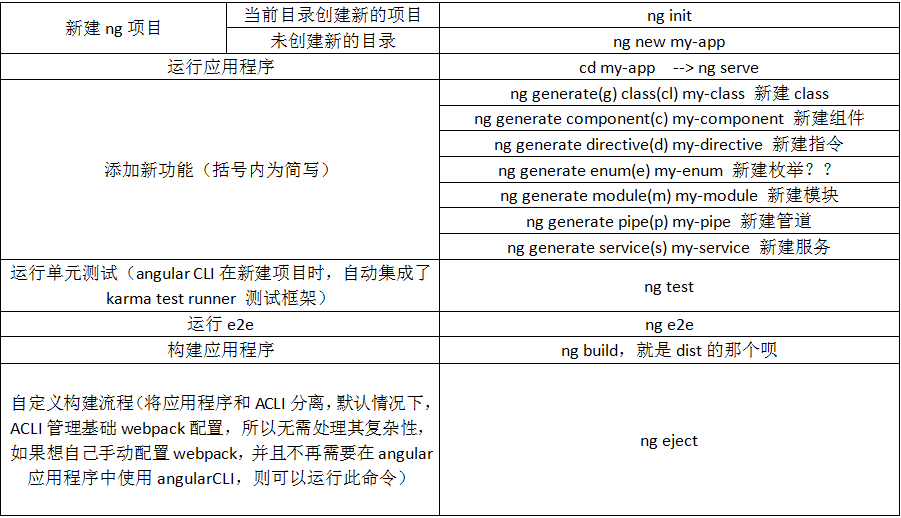

#angularCLI
  功能：创建新的angular项目，运行开发服务器，给目前的angular的项目添加新的功能，运行单元测试，运行e2e，构建应用程序。

##一、新建

###1）new 发生了什么？

 - 1.创建了新的my-app目录

 - 2.创建了应用程序相关的源文件和目录

 - 3.安装package.json中的依赖

 - 4.配置ts开发环境

 - 5.配置karma单元测试环境

 - 6.配置e2e测试环境

 - 7.创建environment相关的文件，初始化默认设置

###2）创建项目时，命令后的可跟选项

 - --dry-run，为true则不创建任何文件

 - --verbose，是否显示详细信息，默认false

 - --link-cli，是否自动连接到@angular/cli包，默认false

 - --skip-install，是否跳过安装依赖，默认false

 - --skip-git，不降目录初始化为git仓库，默认false

 - --skip-tests，不创建tests相关文件，默认false

 - --skip-commit，不进行初始的提交，默认false

 - --directory，设置创建的目录名，默认与应用程序同名

 - --source-dir，源文件的目录名称，默认src

 - --style，设置样语法，默认css

 - --prefix，创建新组件时，组件选择器使用的前缀，默认app-

 - --mobile，是否生成web app应用，默认false

 - --routing，是否新增带有路由信息的模块，并添加到根模块中，默认false

 - ----inline-style，是否使用内联样式，默认false

 - --inline-template，是否使用内联模板，默认false

## 二、运行

###1）ng serve发生了什么？

 - 1.去.angualr-cli.json中加载配置信息

 - 2.打包相关js和css文件

 - 3.启动本地开发服务器

##三、添加新功能

###1）运行新建类命令，发生了什么？

 - 在src/app目录下，创建new-class.ts文件，并导出NewClass类

 - 选项--spec，是否生成spec的单元测试文件，默认false

###2）运行新建组件命令，发生了什么？

 - 1.在src/app下，new-component目录被创建

 - 2.在该目录下，生成四个文件：css、html、ts、spec

 - 3.导出的NewComponent被自动添加到最近模块的@NgModule装饰器的declarations中，不一定是AppModule

ps：相关选项（前五个完全不用动啊~）

 - --flat，在src/app下直接生成组件，而不是在new-component文件夹中，默认false，当然要false啦...

 - --inline-template，使用内联模板，默认false

 - --inline-style，使用内联样式，默认false

 - --prefix，使用.angular-cli.json中配置的前缀来作为当前组件的前缀，默认为true

 - --spec，生成单元测试文件，默认为true

 - --view-encapsulation， 设置组件的视图封装策略？？什么玩意儿？？

 - --change-detection， 设置组件的变化检测策略？？

###3）运行新建指令命令，发生了什么？

 - 1.在src/app目录下创建new.directive.ts文件导出appNew的指令

 - 2.创建它的spec

 - 3.添加到最近模块的@NgNodule的declarations里面

ps：可用选项

 - --flat，在src/app下直接生成文件，不再创建单独的文件夹，默认true，和创建组件的时候不一样啦

- --prefix，默认true，解释的话不说两遍

- --spec，默认为true，解释的话不说两遍，那为啥这句话我说了两遍

###4）运行新建枚举命令，发生了什么？

 -  在src下，创建了app.new.enum.ts，并导出名为New的枚举，src下的根目录呢，话说枚举是啥？？？？

###5）运行创建模块命令，发生了什么？

 - 1.在src/app下，创建newmodule文件夹

 - 2.在文件里，创建NewModule模块

 ps：这个不会像组件一样给自动声明，自己根据需要，导入对应的模块，在其它模块需要此模块的时候，引入，放进imports里面去

再次ps：相关的选项

 - --routing，是否生成一个额外包含路由信息的NewRoutingModule模块，且该模块会被自动导入到新建的模块中去，默认false

 - --spec，默认false

###6）运行创建管道命令，发生了什么？何が起こったか？what happens?

 - 1.在src/app下，创建newpipe.pipe.ts文件，导出NewPipePipe的管道类

 - 2.创建spec

 - 3.添加到最近模块的@NgModule的declarations里面去，声明一下声明一下

ps：可用选项有--flat，默认true，--spec，默认true

###7）运行服务命令，发生了什么？教えてよ、何が

 - 1.在src/app下创建new-service.service.ts，导出NewServiceService的服务类，

 - 2.创建spec

ps：服务肃然创建好了，但是没有进行配置啊，根据需求在某个模块或者组件的providers里面配置这个新建的服务就好啦，美名其曰指定一个服务的提供商

再次ps：相关选项：--flat，默认true，--spec，默认为true

##四、

###1）ng test 的时候，发生了什么？

 - 1.angular CLI首先从.angualr-cli.json文件加载配置信息

 - 2.ACLI根据该文件中的karma相关的配置信息，运行karma。（karma的配置文件在根目录，karma.config.js）

 - 3.karma打开配置中设定的浏览器，默认chrome

 - 4.karma就指示chrome使用karma中配置的指定测试框架运行src下的test.js（默认Jasmine？？什么鬼）

 ps：创建应用程序时，自动创建src/test.js，预先配置为加载和配置测试angular应用程序所需的代码，并运行src中所有以.spec.ts结尾的文件

 - 5.karma将测试结果报告给控制台

 - 6.karma监听src目录下文件的变化，自动运行单元测试

  --是不是又想知道karma究竟又是怎么一回事了

##五、

###1）运行e2e发生了什么？？？？？

##六、

###1）运行ng build ，发生了什么？

 - 1.ACLI从.angular-cli.json文件中加载配置信息

 - 2.ACLI运行webpack打包项目相关的js与css文件

 - 3.打包后的资源，输出到配置文件中outDir所指定的目录，默认为dist

ps：相关选项

 - --aot，开启ahead-of-time编译

 - --base-href，设置index.html文件中的<base>元素的链接地址

 - --environment，设置所使用的环境，默认dev

 - --output-path，设置输出的；路径

 - --target，设置所使用的环境，默认为development

 - --watch，是否开启watch模式，监听文件的变化并重新构建，默认false

再次ps：targets，指定target的值，会影响到构建流程的运行方式，可选值有development，默认模式，不进行代码压缩或混淆；production，进行代码压缩和混淆，eg：ng build --target=production

再再次ps：environment，自定义应用程序的行为，可以在.angular-cli.json文件中定义自己的environment文件，默认的是dev：environment/environment.ts；prod：environment/environment.ts，构建流程默认的是使用dev环境，如果指定不了不同的环境，构建过程将使用相应的环境：ng build --environment(env)=dev/ng buildenvironment(env)=prod

在src/main.ts文件中看到的，通过导入environment.ts文件，可以访问environment相关的配置信息

##七、

###1）运行ng eject发生了什么？

 - 1.在.angualr-cli.json文件中加入ejected属性，并设置为true。

 - 2.在应用程序的根目录下将生成独立的webpack.config.json文件，然后就可以在没有使用angularCLI的情况下构建项目啦。

 - 3.package.json中的构建脚本被更新，可以运行npm run build来构建项目啦。

 - 4.package.json中的测试脚本被更新，可以运行npm run test来运行单元测试。

 - 5.package.json中的启动脚本被更新，可以运行npm run start或者 npm start来启动开发服务器啦。

 - 6.package.json中的e2e脚本被更新，可以运行e2e来运行End-to-End测试啦。