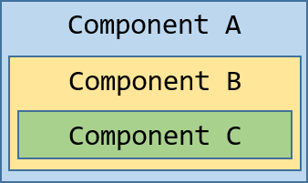

# 核心知识 - 架构
##一、整体架构


**图一 - angular全景图-非常非常重要的图**

### 1.写一个Angular 应用：
   1）用 Angular 扩展语法编写 HTML 模板（angular指令、管道、插值表达式等），
   2）用组件类管理这些模板（通过组件来指定模板显示），
   3）用服务添加应用逻辑（将应用中需要经常用到的逻辑封装在服务中，方便服用），
   4）用模块打包发布组件与服务（组件、服务需要在一个模块中去创建去声明）。
全景图可以看到，在angular应用中，以组件为单位，在组件中管理HTML模板，二者通过元数据进行连接（@Component里面的一些如templateUrl，styleUrls，selector）。通过属性绑定，组件可以把数据动态绑定在模板视图上，通过事件绑定，可以把视图上用户输入的数据传给组件做处理。指令可以控制HTML模板，组件引入服务，来处理逻辑问题。
   ps：DI Error 依赖注入错误，服务没有被注入
2.angular的八大核心概念（学习顺序）
模块、组件、模板、元数据、数据绑定、指令、服务、依赖注入。
##二、模块
###1.根模块和特性模块
首先每个angular应用至少有一个根模块（AppModule），在比较小的项目中，有这一个模块就够了。但是在大项目中，页面非常多，就有很多特性模块了，特性模块就是一个内聚代码块，专注于某个应用领域、工作流或者功能让相近页面相近的功能，比如钩哒里面的LayoutModule、RoutesModule、ServiceModule，看名字就知道这个模块里面大概是干嘛的。
###2.@NgModule
在模块里面（不管是根模块还是特性模块）都有一个@NgModule的装饰器的类，NgModule是一个装饰器函数，它接收一个用来描述模块属性的元数据对象，最重要的属性有：
a. declarations，所有的视图类都在这儿声明，不声明就用肯定报错没跑了，组件、指令、管道都属于视图类。
b. exports，declarations的子集，可用于其它模块的组件模板。
c. imports，引入本模块所需要的其它模块。
d. providers，服务的提供商，服务不放在这里面没法用，放在根模块的providers里面就全局都能用。
e. bootstrap，不是那个样式库的boot，它是在根模块里面指定要启动哪一个主视图，里面放的通常都是AppComponent。
eg：一个简单的根模块：
```typescript
import {NgModule} from"@angular/core"
import {BrowserModule} from"@angular/platform-browser"
import {AppComponent} from"......"
@NgModule({
   imports: [BrowserModule],
   providers:[Logger],
   declarations:[AppComponent],
   exports: [AppComponent],
   // 其实根模块不需要导出任何东西，别的模块又不需要导入根模块，但是特性模块记得有需要的就要导出了，不然别的地方用不了
   bootstrap:[AppComponent]

})
```
ps：引导根模块来启动应用的就是main.ts，里面有一句
```typescript
platformBrowserDynamic().bootstarpModule(AppModule)
```
所以，启动开发服务器的时候，找到了main.ts，根据main找到了AppModule，根据AppModule里面bootstrap的指定，启动那个组件，就看到页面啦。
###3.NgModules 和 JavaScript模块（接0206）
  NgModule就是一个带有@NgModule的装饰器的类，是Angular的一个基础特性。
  JavaScript的模块系统，就是用来管理一组JS对象，和Angular的模块系统没啥关系，JS里面每一个文件都可以看作是一个模块，文件里面定义的对象属于这个模块，最后通过export关键字，可以向外暴露这些对象，可以使别的模块去引用它（import引入就能用啦）
  两个模块系统互补，写程序的时候都要用到。
###4.Angular模块库
  新建一个angular应用的时候，node-modules里面有很多的包，@angular开头的就是Angular的模块库，比如 在某个文件中 import {Component} from "@angular/core"，意思就是从@angular/core的库中，导入Component的装饰器；或者 import {BrowserModule} from "@angular/platform-browser"，就是从@angular/platform-browser库里面导入一个BrowserModule的Angular模块
  ps：某个应用模块需要用到BrowserModule的时候，不仅要引入，也要把它加入@NgModule元数据的imports数组里面去。imports ： [BrowserModule]，这种情况下，Angular和JS的模块系统就一起使用啦。
## 三、组件
  组件就是一个带有特定功能的可以被反复使用的视图。
  Angular是以模块为基本单位（Vue好像是以组件为基本单位的吧），模块是由各种各样的组件构成的。创建过的每一个组件，在使用之前，都要去对应的模块中去声明，声明之后，只允许在该模块内使用，在根模块里面声明的话，就哪儿都能用了。
  在类里面，就是导出那个，定义组件的应用逻辑，为视图提供支持，让视图不仅能看还能用。组件通过一些属性和方法组成的API和视图进行交互（就是全景图里面的属性绑定和事件绑定啦）。
eg:一个简单的组件实例代码
```typescript
	export class NameComponent implements OnInit {
		//导出一个类
		arrs: Arr[];
		//其实随便定义一个什么就行，用来接受从服务哪里获取到的值
		selectedArr: Arr;
		//随便定义的，接受事件被调用时传入的值
		constructor (private service: ArrService) {}
		//在构造函数里面实例化一个服务，这个服务是在某个地方写好，引入并注入过的啦，
		//ps：angular中的服务是单例模式，在这个应用程序中，这个对象只保留一个实例。
		ngOninit() {
		//生命周期函数，ngOnInit表示组件在创建后立刻就调用，别的钩子就见到的时候再说。
			this.arrs = this.service.getArrs();
			//service后面就是定义好的方法啦
		}
		selectedArrs(arr: Arr) {this.selectedArr = arr} 
		//这是一个事件，调用时就可以拿到传入的值并赋值给selectedArr
	}
```
##四、模板
  组件建成的时候，自带了模板，在这里面定义组件的视图。模板是以HTML的形式存在，告诉angular如何渲染组件，但是也不完全是标准的HTML。
	比如：
```html
<ul>
<li *ngFor="let arr of arrs" (click)="selectedArrs(arr)" >{{arr}}</li>
<---*ngFor 循环指令，可以生成和arrs的length一样多的li，绑定单击事件就是(click)，绑定别的事件也要加()->
</ul>
<app-detail *ngIf="selectedArr" [arr]="selectedArr"></app-detail>
<--app-detail，是别的组件的名字，当做普通的HTML标签使用；*ngIf，根据等号后面的值的真假来决定当前的元素要不要挂载到DOM树上；[]是属性绑定的时候用的，加入等号后面的值是不确定的，就需要用属性绑定-->
```
##五、元数据
  简单来说，元数据就是@Component里面的那些属性，单独看某个Component的时候，就只是被导出了一个类，angular并不知道，通过元数据里面的属性，告诉angular这是个组件，告诉angular去哪儿获取我给组件指定的各种构建模块，什么HTML模板啦、css啦..
```txt
	selector：选择器，要用当前组件的时候，把这个名字当做普通的HTML标签
	templateUrl：模板的相对地址
	template：直接写HTML在这里，不用引入html文件
	styleUrls：一个数组，放css的地址，可以放多个
	providers：服务的依赖注入提供商数组，服务要想使用，先引入，然后指定提供商，然后实例化，才能使用。
```
##六、数据绑定
  在传统模式下，数据变化或者视图更改都是直接操作页面DOM元素，angular支持数据绑定，通过数据来控制页面视图。
比如：
```html
	<li>{{arr.xxx}}</li>
	//{{arr.xxx}}插值表达式 在<li>标签中显示组件的arr.xxx属性的值。
	<app-hero-detail [arr]="selectedArr"></app-hero-detail>
	//[arr]属性绑定 把父组件NameComponent的selectedArr的值传到子组件DetailComponent的arr属性中。
	<li (click)="selectedArr(arr)"></li>
	//(click) 事件绑定 在用户点击li时调用组件的selectedArr方法。
除了上面三种，还有第四种数据绑定：
	<input [(ngModel)]="arr.xxx">
	//[(ngModel)]双向数据绑定 数据属性的值通过属性绑定到视图到输入框，用户修改以后通过事件绑定把新值流回组件，并更新属性的值，这个绑定可以说是非常重要了。
```
	ps：双向数据绑定的原理
		TODO暂时没有搞明白脏数据检查机制，网上的解释都是angularJS的，不准，待定。
## 七、指令
  angular的模板是动态的，动态的东西就要有指令来操控，angular渲染模板的时候，就是根据指令的操作对DOM进行转换。
  组件就是一个指令，@Component的装饰器实际上也是@Directive的装饰器，就是扩展了面向模板的特性。因为在angular中组件处于中心地位，所以在架构里面，把组件从指令里面独立了出来。
  angular所支持的常见的指令：
```txt
 	1. *ngFor，循环指令，生成N个标签
		eg : <any *ngFor="let tmp of COLL;let i=index"></any>
	2. *ngIf，选择指令，根据表达式的值的真假决定是否将元素挂载到DOM树
		eg ： <any *ngIf="expression"></any>
	3. [ngSwitch]，多重选择指令，跟if(){} else if(){} else{} 差不多
		eg : <div [ngSwitch]="">
				<any *ngSwitchCase=""></any>
				<any *ngSwitchDefault></any>
        	 </div>
	    一个坑：同一个元素标签上不能同时放两个结构型指令（上面这三个加*的，对DOM
	    	   修改删除的就是结构型指令），如果需要同时使用，可以在外层包裹
	    	   <ng-container>标签，把一个指令放在这个标签上面。
	4.事件绑定，给事件名加个小括号
		eg ： <any (eventname)="fn()"></any>
	5.属性绑定，动态绑定样式类或者样式
		ngClass ：<any [ngClass]="{className: true/false}">
		ngStyle ：<any [ngStyle]="{styleName: 放个变量在这}">
	6.插值表达式，就是双花括号，把表达式里面的值显示在页面上
		eg ： <any>{{表达式}}</any>
	7.双向数据绑定，从页面获取数据就靠它了，但是不能直接用，ngModel属于表单模块，使用之前在app.module.ts中要先引入FormsModule，放到imports数组中，才能使用。
		eg ： <input [(ngModel)]="变量">
			  显示：<any>{{变量}}</any>
		如果需要监听用户的操作，可以在标签上绑定(ngModelChange) = "fn()"
		
		ps：双向数据绑定原理
			大佬的博客：（自己还没完全整明白）
			http://blog.csdn.net/u011256637/article/details/71056731
			注：脏值检测就是不关心如何以及何时改变的数据，只关心在特定的检查阶段数据
			    是否改变的监听技术，可以实现批量处理完数据之后，再去统一更新视图。
```
## 八、服务
  服务可以包括很多东西，比如值、函数、或者应用里面所需要的特性。总而言之就是对应用中逻辑的封装。组件类本身要保持精简，它不直接往控制台输出日志，不从服务器获得数据，也不进行验证和输入，把这些事情全部委托给服务。
  组件的任务就是提供用户体验，介于由模板渲染的视图和应用逻辑之间，一个良好的组件就只为数据绑定提供属性和方法，别的都委托给服务...好像没有完全遵循这个原则，大部分的时候都是只把网络请求封装了，别的东西依然写在了组件里。
```typescript
	  //比如封装一个打印服务：
	  	eg ：log.service.ts
	  		import {Injectable} from "@angular/core";
	  		@Injectable()
	  		export class LogService {
  				isDev : Boolean = false;
  				constructor() {}
  				print(msg : any){
  					if(this.isDev) console.log(msg);
  					//如果是生产环境就不打印，开发环境就打印
				}
			}
			
		//使用该服务：
			import {LogService}from './log.service';
			@Component({
  				providers: [LogService]
  				//指定提供商
			})
			constructor (private log: LogService){}//实例化才能用
			fn(){
  				this.log.print(XXXX);//随便在该组件需要的地方调用就好啦
			}
			
	  //更多的时候，在一个应用里面，是把所需要的网络请求封装在服务里面
	  	//eg ： http.service.ts
	  		import { Injectable } from '@angular/core';
			import { Http, Response } from '@angular/http';
			@Injectable()
			export class HttpService {
    			constructor(private http: Http) { }
    			sendRequest(myUrl:string){//发起网络请求
        		return this.http.get(myUrl)
        				.map((response: Response) => response.json());
    			}
			}
```
  使用该服务：
  步骤还是一样的：引入-->实例化-->调用
  调用方法:
```typescript
getData(){
  this.httpService.sendRequest("./test.json")
    .subscribe((data:any)=>{
    console.log(data);
  })
}
/*重点就是这个subscribe了，目前异步的的请求方式有：
AJAX、事件绑定、promise、
rxjs（observable/subscribe，消息订阅机制？？）*/
```
## 九、依赖注入
```txt
	”依赖注入“是提供类的新实例的一种方式，还负责处理好类所需的全部依赖，大多数依赖都是服务，Angular使用依赖注入来提供新组件以及组件所需的服务。
	Angular通过查看构造函数的参数类型得知组件需要哪些服务，
		eg ： constructor (private http : HttpService){}
				//该组件的构造函数需要一个HttpService的服务
	当Angular创建组件时，会首先为组件所需的服务请求一个injector-注入器
	注入器维护一个服务的实例的容器，存放着以前创建的实例，如果所请求的服务实例不在容器里面，注入器就创建一个服务实例然后添加到这个容器中，再把这个服务返回给Angular。当所有的请求服务都被解析完并返回时，Angular就以这些服务为参数去调用组件的构造函数，这就是整个依赖注入的过程。
	那么，在上面的服务调用里面，把需要用的服务放在了providers里面了，就是用注入器给HttpService注册了一个提供商，就是把HttpService给添加到注入器里面去了。
	
	服务可以注入到一个组件，也可以注入到一个模块中。
	如果服务通过不同组件的providers，注入到不同的组件，那么服务是被创建了很多次，每一个都是一个单独的实例，都没有关系。
	如果服务注入到了一个组件中，那么这个组件由有其它的子组件构成，那么在子组件中如果引入服务类（不会通过providers去指定），那么所实例化的服务类对象是同一个实例对象。
	如果服务是注入到了一个模块中，那么该模块任何一个组件所import和实例化得到的服务都是同一个实例
	如果想在全局使用这个服务，就在根模块的providers里面注入就好啦
	注意：
		· 依赖注入是渗透在整个Angular框架中的，被导出使用。
		· 注入器（Injector）是这个机制的核心（注入器要负责维护一个存放它创建过的容器，能使用提供商创建一个新的服务实例）
		· 提供商是用来创建服务的地方，将依赖注入到当前的对象中
		· 提供商要注册到注入器
```
######——架构END

# 核心知识——模板与数据绑定
## 一、显示数据
  在Angular中最典型的数据显示方式，就是把HTML模板中的控件绑定到Angular组件的属性中，以创建一个列表组件为例，我要显示一些人物的名字，根据条件决定在列表下方是否显示一条消息，最终要变成这个样子：
```txt
  人物列表
  我最喜欢的是：许嵩
  这些人是：
  	· 许嵩
  	· 山田凉介
  	· 夏洛克
  	· 夏目
  哎呀，还有好多呢....
```
- 使用插值表达式显示组件属性
  - 要显示组件的属性，就直接通过插值表达式（interpolation）来绑定属性名，直接把属性名放在双花括号里面，然后放在模板里面就好啦。
```typescript
  app.component.ts //演示练习这些小demo，放在app.component里面就好啦
	import {Component} from "@angular/core" 
	@Component({
		//app-root作为标签使用，当通过main.ts中的AppComponent类启动时，Angular在index.html找到<app-root>的元素，然后去实例化一个AppComponent，渲染到<app-root>的标签中
  		selector:'app-root',
  		template:` 
  			<p>{{title}}</p>
  			<p>我最喜欢的是：{{favorite}}</p>
  		`
  		//Angular自动从组件中提取title和favorite属性的值，并且把这些值插入浏览器中，当这些属性值发生变化时，Angular就会自动刷新显示。
	})
	export class AppComponent {
  		title : '人物列表',
  		favorite : '许嵩'
	}
```
- 选择内联模板或者模板文件
  - template用来定义内联模板，直接把元素写在后面就行，或者把模板放在单独的HTML文件里面，再通过templateUrl的属性，指定这个HTML文件的位置。
  - 上面的demo里面选择内联是因为代码很少，如果模板代码多的话，放在模板文件里面会更好有点，但是两种方法，在绑定数据上是完全一样的。
- 构造函数和变量初始化
  - demo里面使用变量赋值的方式初始化组件，或者，可以使用构造函数来声明和初始化属性
```typescript
  	export class XXXComponent{
  		title: string;
  		favorite: string; 
  		constructor() {
  			this.title = '人物列表';
  			this.favorite = '许嵩';
		}
	}
```
- 使用ngFor显示数组属性
  - 要显示人物的列表，可以先向组件中添加一个数组，里面放着每个人物的名字，然后把favorite改成数组的第一个名字。
```typescript
	export class AppComponent{//定义数据
  		title = '人物列表';
  		lists = ['许嵩'，'山田凉介','夏洛克','夏目'];
  		favorite = this.lists[0];
	}
	//然后在模板里面
	template:`
		<p>{[title]}</p>
		<p>我最喜欢的是：{{favorite}}</p>
		<p>这些人是：</p>
		<ul>
			<li *ngFor="let tmp of list">{{tmp}}</li>
		</ul>
	`
	ngFor循环的时候，拿出list中的每个值，放入<li>标签内，生成多个li标签。ngFor不仅能循环数组，对象也可以，在插值表达式里面用取对象值的方法也可以拿到想要的数据。
```
- 为数据创建一个类
  - demo里面是直接把数据定义在了组件内部，使用到的是一个普通的字符串数组的绑定，此外还有对于一个对象数组的绑定，要将此绑定转换成使用对象，需要把人物名字的数组转换成一个List的对象数组。
```txt
  首先需要创建一个List的类
  eg： List.ts
  		export class List{
  			constructor(
  				public id: number,
  				public name: string
  			){}
		}
  定义并导出这个类，里面有一个构造函数和id、name两个属性
  public id：number（这是ts的简写形式，用构造函数的参数直接定义属性） 做了哪些事？
  	· 声明了一个构造函数参数及其类型
  	· 声明了一个同名的公共属性
  	· 当new一个该类的实例时，把该属性初始化为相应的参数值
```
- 使用一个类
  - 导入List类之后，组件的lists属性就可以返回一个类型化过的lists数组了。
```typescript
	lists = [
  		new List(1,'许嵩'),
  		new List(2,'山田凉介'),
  		new List(3,'夏洛克'),
  		new List(4,'夏目')
	]
	favorite = this.lists[0];
	//按照上面这样创建这个数组，现在模板里面的{{tmp}}一下子把id和name都显示出来了，如果只要显示name：
	template: `
  		<p>{{title}}</p>
  		<p>我最喜欢的是: {{lists.name}}</p>
        <p>这些人是:</p>
        <ul>
          <li *ngFor="let tmp of lists">
            {{ tmp.name }}
          </li>
        </ul>
`
```
```txt
ps回忆（恰好想起来，和上面的没有关系）:
	JS面向对象，当用new创建一个新的对象的时候，发生了什么？？
	new的时候，做了四件事：
		1.创建了一个新的对象
		2.自动让新的子对象继承构造函数的原型对象！！important
		3.调用构造函数，向新的空的对象中强行添加新成员
		4.将新的变量地址返回给变量保存
```
- 通过ngIf进行条件显示
  - 显示数据的最后一步，根据需求是否显示某个视图
```txt
比如说，如果我列表的长度大于3了，就在视图最后显示一句话
	<li *ngIf="lists.length>3">哎呀，还有好多呢...</li>
	*ngIf 就是根据表达式的真假来显示或者移除某个元素
```
- 显示数据——小结
  - 带有双花括号的插值表达式 (interpolation) 来显示一个组件属性
  - 用 ngFor 循环显示出数组的值或者对象数组
  - 用一个 TypeScript 类来为我们的组件描述模型数据并显示模型的属性
  - 用 ngIf 根据一个布尔表达式有条件地显示一段 HTML

###### 最后，demo的所有代码：
- arc/app/app.component.ts
```typescript
	import { Component } from '@angular/core';
	import { List } from './list';
 
    @Component({
      selector: 'app-root',
      template: `
        <p>{{title}}</p>
        <p>我最喜欢的是: {{lists.name}}</p>
        <p>这些人是:</p>
        <ul>
          <li *ngFor="let tmp of lists">
            {{ tmp.name }}
            </li>
        </ul>
        <p *ngIf="lists.length > 3">哎呀，还有很多呢...</p>
    `
    })
    export class AppComponent {
      title = '人物列表';
      heroes = [
        new List(1, '许嵩'),
        new List(2, '山田凉介'),
        new List(3, '夏洛克'),
        new List(4, '夏目')
      ];
      favorite = this.lists[0];
    }
```
- src/app/list.ts
```typescript
	export class List(){
  		constructor(
  			public id: number,
  			public name: string
  		){}
	}
```
- app.module.ts和main.ts什么的没有什么变化...不写了
## 二、模板语法
  Angular应用管理着用户的所见所为，并且通过组件和模板来和用户交互。在MVC/MVVM框架中，组件就是Control或者ViewModule的角色了，模板就是View的角色。关于Angular的模板语言，需要知道它的基本原理，并且掌握大部分的语法。
###  1.模板中的HTML
```txt
  Angular的模板语言是HTML，HTML大部分的语法都是有效的模板语法，但是<script>被忽略了，还有html、body、base在模板中也没有意义，其它的元素都正常使用就好。
  在Angular里面，还可以通过组件和指令扩展HTML标签。创建的组件通过selector指定的名字直接用就好啦。
```
### 2.插值表达式
```txt
  插值表达式在之前的demo里面已经见了很多了，它可以把计算后的字符串插入HTML元素标签，它可以把计算后的字符串插入到 HTML 元素标签内的文本或对标签的属性进行赋值。
  <p>{{title}}
  	
  </p>
  花括号之间的就是组件的属性的名字，Angular会用组件中相应的属性的字符串的值，替换这个名字，在上面两行代码中，Angular会计算title和imgUrl的值，然后填在空白的地方，按顺序先显示title的内容，再显示图片。
  一般来说，括号间的素材是一个模板表达式，Angular先对它求职，再把它转成字符串
  比如<p>1 + 1= {{1+1}}</p>，插值表达式可以对其进行运算并显示在页面上，不管花括号里面是数字相加还是什么别的运算，也可以和组件中的属性或者方法一起调用。
```
### 3.模板表达式
  模板表达式产生一个值。 Angular 执行这个表达式，并把它赋值给绑定目标的属性，这个绑定目标可能是 HTML 元素、组件或指令。
  比如{{1+1}}中所包含的模板表达式是1 + 1。 在属性绑定中会再次看到模板表达式，它出现在等号右侧的引号中，就像这样：[property]="expression"。写的时候看上去像是js，很多js表达式也是合法的模板表达式，但是不是全部。
  有些js的表达式就不能用，可能会引起一些错误，比如：
```txt
  	赋值 (=, +=, -=, ...)
	new运算符
	使用;或,的链式表达式
	自增或自减操作符 (++和--)
```
  还有一些在语法上就不支持：
```txt
  	不支持位运算|和&
	具有新的模板表达式运算符，比如|、?.和!。
```
#### 3.1 表达式上下文
```txt
	eg：{{title}}
		<span [hidden]="isUnchanged">changed</span>
```
  典型的表达式上下文就是这个组件实例，它是各种绑定值的来源。 在demo中，双花括号中的title和引号中的isUnchanged所引用的都是AppComponent中的属性。
  表达式的上下文可以包括组件之外的对象。 比如模板输入变量 (let tmp)和模板引用变量(#userInput)就是备选的上下文对象之一。
```txt
	<div *ngFor="let tmp of lists">{{tmp.name}}</dv>
  	<input #userInput>{{userInput.value}}
```
  表达式中的上下文变量，是由模板变量，指令的上下文变量和组件的成员叠加而成的，如果我要引用的变量名存在于一个以上的命名空间中，那么模板变量是最优先的，其次是指令的上下文变量，最后是组件的成员。
  如果说我在组件的属性里面写了一个叫tmp的属性，那么就和*ngFor里面的tmp起了冲突，在{{tmp.name}}里面，tmp引用的是模板变量，而不是组件的属性。
  模板表达式不能引用全局命名空间中的任何东西，比如window或document。它们也不能调用console.log或Math.max。 它们只能引用表达式上下文中的成员。
#### 3.2表达式指南
  模板表达式能成就一个应用也能毁掉一个应用，在此列出以下指南：
  - 没有可见的副作用
    模板表达式除了目标属性的值以外，不应该改变应用的任何状态。
    这条规则是 Angular “单向数据流”策略的基础。 永远不用担心读取组件值可能改变另外的显示值。 在一次单独的渲染过程中，视图应该总是稳定的。
  - 执行迅速
    Angular 执行模板表达式非常的频繁。 它们可能在每一次按键或鼠标移动后被调用。 表达式应该快速结束，否则用户就会感到拖沓，特别是在较慢的设备上。 当计算代价较高时，应该考虑缓存那些从其它值计算得出的值。
  - 非常简单
    虽然也可以写出相当复杂的模板表达式，但不要那么写。
    常规是属性名或方法调用。偶尔的逻辑取反也还凑合。 其它情况下，应在组件中实现应用和业务逻辑，使开发和测试变得更容易。
  - 幂等性（可以使用相同参数重复执行，并能获得相同结果的函数。这些函数不会影响系统状态，也不用担心重复执行会对系统造成改变。）
    最好使用幂等的表达式，因为它没有副作用，并且能提升 Angular 变更检测的性能。
    在 Angular 的术语中，幂等的表达式应该总是返回完全相同的东西，直到某个依赖值发生改变。
    在单独的一次事件循环中，被依赖的值不应该改变。 如果幂等的表达式返回一个字符串或数字，连续调用它两次，也应该返回相同的字符串或数字。 如果幂等的表达式返回一个对象（包括Date或Array），连续调用它两次，也应该返回同一个对象的引用。
### 4.模板语句
  模板语句用来响应由绑定目标（如 HTML 元素、组件或指令）触发的事件。 模板语句在事件绑定的时候细说，它出现在=号右侧的引号中，就像这样：(event)="statement"。
```txt
  <button (click)="deletePerson()">Delete person</button>
```
  模板语句有副作用。 这是事件处理的关键。因为我们要根据用户的输入更新应用状态。
  响应事件是 Angular 中“单向数据流”的另一面。 在一次事件循环中，可以随意改变任何地方的任何东西。
  和模板表达式一样，模板语句使用的语言也像 JavaScript。 模板语句解析器和模板表达式解析器有所不同，特别之处在于它支持基本赋值 (=) 和表达式链 (;和,)。
  ps，一些js语法不能用：
```txt
  · new运算符
  · 自增和自减运算符：++和--
  · 操作并赋值，例如+=和-=
  · 位操作符|和&
  · 模板表达式运算符（就是管道的 | 还有判断的？之类的）
```
#### 4.1语句上下文
  和表达式中一样，语句只能引用语句上下文中 —— 通常是正在绑定事件的那个组件实例。
  典型的语句上下文就是当前组件的实例。 (click)="deletePerson()"中的deletePerson就是这个数据绑定组件上的一个方法。
```txt
  <button (click)="deletePerson()">Delete person</button>
  
  eg：
  <button (click)="onSave($event)">Save</button>
  <button *ngFor="let tmp of lists" (click)="deletePerson(tmp)">  {{tmp.name}}</button>
  <form #listForm (ngSubmit)="onSubmit(listForm)"> ... </form>
```
  语句上下文可以引用模板自身上下文中的属性。 在上面的demo中，就把模板的$event对象、模板输入变量 (let tmp)和模板引用变量 (#listForm)传给了组件中的一个事件处理器方法。
  模板上下文中的变量名的优先级高于组件上下文中的变量名。在上面的deletePerson(tmp)中，tmp是一个模板输入变量，而不是组件中的tmp属性。
  模板语句不能引用全局命名空间的任何东西。比如不能引用window 或 document，也不能调用console.log或Math.max。
#### 4.2 语句指南
  和表达式一样，避免写复杂的模板语句。 常规是函数调用或者属性赋值。
### 5.绑定语法（概览）
  数据绑定是一种机制，用来协调用户所见和应用数据，虽然我能往 HTML 推送值或者从 HTML 拉取值（jQuery操控DOM）， 但如果把这些琐事交给数据绑定框架处理， 应用会更容易编写、阅读和维护。 只要简单地在绑定源和目标 HTML 元素之间声明绑定，框架就会完成这项工作。
  Angular 提供了各种各样的数据绑定，之后细说。 先从高层视角来看看 Angular 数据绑定及其语法。
  绑定的类型可以根据数据流的方向分成三类： 从数据源到视图、从视图到数据源以及双向的从视图到数据源再到视图。
| 数据方向         |                    语法                    |                          绑定类型 |
| ------------ | :--------------------------------------: | ----------------------------: |
| 单向：从数据源到视图目标 | {{expression}}[target]="expression" bind-target="expression" | 插值表达式 Property Attribute 类 样式 |
| 单向：从视图目标到数据源 | (target)="statement" on-target="statement" |                            事件 |
| 双向           | [(target)]="expression" bindon-target="expression" |                            双向 |
  除了插值表达式之外的绑定类型，在等号左边是目标名， 无论是包在括号中 ([]、()) 还是用前缀形式 (bind-、on-、bindon-) 。
  这个目标名就是Property的名字。它可能看起来像是元素属性（Attribute）的名字，但它不是。 要理解它们的不同点，必须尝试用另一种方式来审视模板中的 HTML。
#### 5.1 新的思维模型
  数据绑定的威力和允许用自定义标记扩展 HTML 词汇的能力，容易误导我们把模板 HTML 当成 HTML+。
  它其实就是 HTML+。 但它也跟一般的的 HTML 有着显著的不同。 所以现在需要一种新的思维模型。
  在正常的 HTML 开发过程中，使用 HTML 元素创建视觉结构， 通过把字符串常量设置到元素的 attribute 来修改那些元素。
  比如：
```html
    <div class="special">Mental Model</div>
    
    <button disabled>Save</button>
```
  在 Angular 模板中，仍使用同样的方式来创建结构和初始化 attribute 值。
  然后，用封装了 HTML 的组件创建新元素，并把它们当作原生 HTML 元素在模板中使用
  比如：
```html
    <!-- Normal HTML -->
    <div class="special">Mental Model</div>
    <!-- A new element! -->
    <app-person-detail></app-person-detail>
```
  上面这个样子就是HTML+
  现在开始学习数据绑定。我们碰到的第一种数据绑定是这样的：
```html
<!-- Bind button disabled state to `isUnchanged` property -->
<button [disabled]="isUnchanged">Save</button>
```
  过儿再认识那个怪异的方括号记法。表面上看，我正在绑定按钮的disabled attribute。 并把它设置为组件的isUnchanged属性的当前值。
  但是wrong！日常的 HTML 确实是这样。但是在这儿，一旦开始数据绑定，就不再跟 HTML attribute 打交道了。 这里不是设置 attribute，而是设置 DOM 元素、组件和指令的 property。
  #### 5.2 HTML attribute 与 DOM property 的对比
```txt
	attribute 是由 HTML 定义的。property 是由 DOM (Document Object Model) 定义的。
	· 少量 HTML attribute 和 property 之间有着 1:1 的映射，如id。
	· 有些 HTML attribute 没有对应的 property，如colspan。
	· 有些 DOM property 没有对应的 attribute，如textContent。
	· 大量 HTML attribute看起来映射到了property…… 但却不像我们想的那样！
	最后一类尤其让人困惑…… 除非我们能理解这个普遍原则：
	attribute 初始化 DOM property，然后它们的任务就完成了。property 的值可以改变；attribute 的值不能改变。
	比如，当浏览器渲染<input type="text" value="许嵩">时，它将创建相应 DOM 节点， 其value property 被初始化为 “许嵩”。
	当用户在输入框中输入 “夏洛克” 时，DOM 元素的value property 变成了 “夏洛克”。 但是这个 HTML value attribute 保持不变。如果我们读取 input 元素的 attribute，就会发现确实没变： input.getAttribute('value') // 返回 "许嵩"。
	HTML attribute value指定了初始值；DOM value property 是当前值。
	disabled attribute 是另一个古怪的例子。按钮的disabled property 是false，因为默认情况下按钮是可用的。 当我们添加disabled attribute 时，只要它出现了按钮的disabled property 就初始化为true，于是按钮就被禁用了。
	添加或删除disabled attribute会禁用或启用这个按钮。但 attribute 的值无关紧要，这就是我们为什么没法通过 <button disabled="false">仍被禁用</button>这种写法来启用按钮。
	设置按钮的disabled property（如，通过 Angular 绑定）可以禁用或启用这个按钮。 这就是 property 的价值。
	就算名字相同，HTML attribute 和 DOM property 也不是同一样东西。
```
  总而言之，模板绑定是通过 property 和事件来工作的，而不是 attribute。不然全景图里面能是property binding么
  在 Angular里面，attribute 唯一的作用是用来初始化元素和指令的状态。 当进行数据绑定时，只是在与元素和指令的 property 和事件打交道，而 attribute 就完全靠边站了。
#### 5.3 绑定目标
  数据绑定的目标是 DOM 中的某些东西。 这个目标可能是（元素 | 组件 | 指令的）property、（元素 | 组件 | 指令的）事件，或(极少数情况下) attribute 名。 汇总表如下：
| 绑定类型      |                 目标                  |                    示例                    |
| --------- | :---------------------------------: | :--------------------------------------: |
| Property  | 元素的Property，组件的Property，指令的Property | <br /><app-person-detail [person]="currentPerson"></app-person-detail><br /><div [ngClass]="{'special': isSpecial}"></div> |
| 事件        |          元素的事件，组件的事件，指令的事件          | <button (click)="onSave()">Save</button><br /><app-person-detail (deleteRequest)="deletePerson()"></app-person-detail><br /><div (myClick)="clicked=$event" clickable>click me</div> |
| 双向        |             事件与Property             |        <input [([ngModel]="name">        |
| Attribute |           attribute（例外情况）           | <button [attr.aria-label]="help">help</button> |
| CSS类      |            CSS Property             | <div [class.special]="isSpecial">Special</div> |
| 样式        |           style Property            | <button [style.color]="isSpecial ? 'red' : 'green'"> |
### 6.属性绑定（[属性名]）
  当要把视图元素的属性 (property) 设置为模板表达式时，就要写模板的属性 (property) 绑定。
  最常用的属性绑定是把元素属性设置为组件属性的值，比如：
```html

```
  image元素的的src属性会被绑定到组件的imgUrl属性上。
```html
<button [disabled]="isUnchanged">Cancel is disabled</button>
```
  上面这个就是说当组件说它isUnchanged（未改变）时禁用按钮，还有就是设置指令的属性，比如：
```html
<div [ngClass]="classes">[ngClass] binding to the classes property</div>
```
  此外，还有父子组件通讯的时候需要设置自定义组件的模型属性：
```html
<app-person-detail [person]="currentPerson"></app-person-detail>
```
#### 6.1 单向输入
  属性绑定通常就被描述成单向数据绑定了，因为值的流动是单向的，从组件的数据属性流动到目标元素的属性，所以不能使用属性绑定来从目标元素拉取值，也不能绑定到目标元素的属性来读取它，只能设置它。
  此外，也不能使用属性 绑定 来调用目标元素上的方法。如果这个元素触发了事件，可以通过事件绑定来监听它们。如果必须读取目标元素上的属性或调用它的某个方法，得用另一种技术， ViewChild 和 ContentChild。
```txt
  ViewChild可以得到第一个元素，或者直接从DOM选择器上选择与之相匹配的，如果视图DOM发生了变化，并且新的子项和选择器相匹配，则属性将被更新。
  ContentChild与ViewChild不同的是，当内容DOM发生变化时，属性才会被改变。
```
#### 6.2 绑定目标
  eg：
```html

```
  包裹在方括号中的元素属性名标记着目标属性。代码中的目标属性是 image 元素的src属性。
  除此之外还有bind-，被称为规范形式：
```html

```
  目标的名字总是 property 的名字。即使它看起来和别的名字一样。 看到src时，可能会把它当做 attribute。但是并不是，它是 image 元素的 property 名。
  元素属性可能是最常见的绑定目标，但 Angular 会先去看这个名字是否是某个已知指令的属性名，比如：
```html
<div [ngClass]="classes">[ngClass] binding to the classes property</div>

ps:严格来说，Angular 正在匹配指令的输入属性的名字。 这个名字是指令的inputs数组中所列的名字，或者是带有@Input()装饰器的属性。 这些输入属性被映射为指令自己的属性。
```
#### 6.3 消除副作用
  就像之前说的，模板表达式的计算不能有可见的副作用（JS的语法有一些就不要用了），表达式语言本身可以提供一部分安全保障。 不能在属性绑定表达式中对任何东西赋值，也不能使用自增、自减运算符。
  当然，表达式可能会调用具有副作用的属性或方法。但 Angular 没法知道这一点，也没法阻止。
  表达式中可以调用像getFoo()这样的方法。只有我知道getFoo()干了什么。 如果getFoo()改变了某个东西，恰好又绑定到个这个东西，我就掉坑里了。 Angular 可能显示也可能不显示变化后的值。Angular 还可能检测到变化，并抛出警告型错误。所以 一般情况下，只绑定数据属性和那些只返回值而不做其它事情的方法就好。
####6.4 返回恰当的类型
  模板表达式应该返回目标属性所需类型的值。 如果目标属性想要个字符串，就返回字符串。 如果目标属性想要个数字，就返回数字。 如果目标属性想要个对象，就返回对象。
  PersonDetail组价的person属性想要一个Person对象，那就在属性绑定的时候精确地给他一个Person对象：
```html
<app-person-detail [person]="currentPerson"></app-person-detail>
```
#### 6.5方括号
  方括号告诉 Angular 要计算模板表达式。 如果忘了加方括号，Angular 会把这个表达式当做字符串常量看待，并用该字符串来初始化目标属性。 它不会计算这个字符串。
  eg：
```html
<!-- ERROR: PersonDetailComponent.person expects a Person object, not the string "currentPerson" -->
  <app-person-detail person="currentPerson"></app-person-detail>
```
#### 6.6 一次性字符串初始化
  当满足下列条件时，应该省略括号：
  - 目标属性接受字符串值。
  - 字符串是个固定值，可以直接合并到模块中。
  - 这个初始值永不改变。
    在标准 HTML 中经常用这种方式初始化 attribute，这种方式也可以用在初始化指令和组件的属性。 在PersonDetailComponent的prefix属性初始化为固定的字符串，而不是模板表达式。Angular 设置它，然后忘记它。
```html
<app-person-detail prefix="You are main" [person]="currentPerson"></app-person-detail>

ps:作为对比，[person]绑定是组件的currentPerson属性的活绑定，它会一直随着更新。
```
#### 6.7 选择属性绑定还是插值表达式
  代码eg：
```html
<p> is the <i>interpolated</i> image.</p>
<p> is the <i>property bound</i> image.</p>

<p><span>"{{title}}" is the <i>interpolated</i> title.</span></p>
<p>"<span [innerHTML]="title"></span>" is the <i>property bound</i> title.</p>
```
  在多数情况下，插值表达式是更方便的备选项。 实际上，在渲染视图之前，Angular 把这些插值表达式翻译成相应的属性绑定。当要渲染的数据类型是字符串时，两种形式都行。 鉴于可读性，所以倾向于插值表达式。 建议建立代码风格规则，选择一种形式， 这样，既遵循了规则，又能让手头的任务做起来更自然。但数据类型不是字符串时，就必须使用属性绑定了。
  比如假设有个恶意的内容：evilTitle = 'Template <script>alert("evil never sleeps")</script>Syntax';
  Angular 数据绑定对危险 HTML 有防备。 在显示它们之前，它对内容先进行消毒。 不管是插值表达式还是属性绑定，都不会允许带有 script 标签的 HTML 泄漏到浏览器中。
```html
<!--
  Angular generates warnings for these two lines as it sanitizes them
  WARNING: sanitizing HTML stripped some content (see http://g.co/ng/security#xss).
 -->
<p><span>"{{evilTitle}}" is the <i>interpolated</i> evil title.</span></p>
<p>"<span [innerHTML]="evilTitle"></span>" is the <i>property bound</i> evil title.</p>

所以最后显示会变这样：
 'Template <script>alert("evil never sleeps")</script>Syntax'is the  interpolated evil title.
  Template Syntax is the  interpolated evil title.
```
### 7.attribute、class 和 style 绑定
#### 7.1 attribute 绑定
  可以通过attribute 绑定来直接设置 attribute 的值，这是“绑定到目标属性 (property)”这条规则中唯一的例外。这是唯一的能创建和设置 attribute 的绑定形式。
  之前一直还在说，通过属性绑定来设置元素的属性总是好于用字符串设置 attribute。那为啥 Angular 还提供了 attribute 绑定。
  因为当元素没有属性可绑的时候，就必须使用 attribute 绑定。考虑 ARIA， SVG 和 table 中的 colspan/rowspan 等 attribute。 它们是纯粹的 attribute，没有对应的属性可供绑定。
  比如想写下面这样的：
```html
<tr><td colspan="{{1 + 1}}">Three-Four</td></tr>

<!--报错：
  Template parse errors:
Can't bind to 'colspan' since it isn't a known native property
（模板解析错误：不能绑定到 'colspan'，因为它不是已知的原生属性）-->
```
  正如提示中所说，<td>元素没有colspan属性。 但是插值表达式和属性绑定只能设置属性，不能设置 attribute。我们需要 attribute 绑定来创建和绑定到这样的 attribute。attribute 绑定的语法与属性绑定类似。 但方括号中的部分不是元素的属性名，而是由attr前缀，一个点 (.) 和 attribute 的名字组成。 可以通过值为字符串的表达式来设置 attribute 的值。
  这里把[attr.colspan]绑定到一个计算值：
```html
<table border=1>
  <!--  expression calculates colspan=2 -->
  <tr><td [attr.colspan]="1 + 1">One-Two</td></tr>

  <!-- ERROR: There is no `colspan` property to set!
    <tr><td colspan="{{1 + 1}}">Three-Four</td></tr>
  -->
  <tr><td>Five</td><td>Six</td></tr>
</table>
```
  attribute 绑定的主要用例之一是设置 ARIA attribute（译注：ARIA指可访问性，用于给残障人士访问互联网提供便利），比如：
```html
<!-- create and set an aria attribute for assistive technology -->
<button [attr.aria-label]="actionName">{{actionName}} with Aria</button>
```
#### 7.2 CSS类绑定
  借助 CSS 类绑定，可以从元素的class attribute 上添加和移除 CSS 类名。CSS 类绑定绑定的语法与属性绑定类似。 但方括号中的部分不是元素的属性名，而是由class前缀，一个点 (.)和 CSS 类的名字组成， 其中后两部分是可选的。比如这样：[class.class-name]。
```html
<!-- standard class attribute setting  -->
<div class="bad curly special">Bad curly special</div>
```
  demo里面示范了如何通过 CSS 类绑定来添加和移除应用的 "special" 类，不用绑定直接设置 attribute 。
  或者可以把它改写为绑定到所需 CSS 类名的绑定；这是一个或者全有或者全无的替换型绑定。 （就是当 badCurly 有值时 class 这个 attribute 设置的内容会被完全覆盖）
```html
<!-- reset/override all class names with a binding  -->
<div class="bad curly special" [class]="badCurly">Bad curly</div>
```
  最后，可以绑定到特定的类名。 当模板表达式的求值结果是真值时，Angular 会添加这个类，反之则移除它。
```html
<!-- toggle the "special" class on/off with a property -->
<div [class.special]="isSpecial">The class binding is special</div>

<!-- binding to `class.special` trumps the class attribute -->
<div class="special" [class.special]="!isSpecial">This one is not so special</div>
```
  但是用的时候直接可以用ngClass来切换类名啊，超级方便。
#### 7.3 样式绑定
  通过样式绑定，可以设置内联样式。样式绑定的语法与属性绑定类似。 但方括号中的部分不是元素的属性名，而由style前缀，一个点 (.)和 CSS 样式的属性名组成。 比如这样：[style.style-property]。
```html
<button [style.color]="isSpecial ? 'red': 'green'">Red</button>
<button [style.background-color]="canSave ? 'cyan': 'grey'" >Save</button>
```
  有些样式绑定中的样式带有单位。在这里，以根据条件用 “em” 和 “%” 来设置字体大小的单位。
```html
<button [style.font-size.em]="isSpecial ? 3 : 1" >Big</button>
<button [style.font-size.%]="!isSpecial ? 150 : 50" >Small</button>
```
  同样的，用的时候还是直接用ngStyle啊...
### 8.事件绑定
  （之前的就是全景图的property binding，这次就是event binding啦）
  前面遇到的绑定的数据流都是单向的：从组件到元素。
  但用户不会只盯着屏幕看。他们会在输入框中输入文本。他们会从列表中选取条目。 他们会点击按钮。这类用户动作可能导致反向的数据流：从元素到组件。知道用户动作的唯一方式是监听某些事件，如按键、鼠标移动、点击和触摸屏幕。 可以通过 Angular 事件绑定来声明对哪些用户动作感兴趣。事件绑定语法由等号左侧带圆括号的目标事件和右侧引号中的模板语句组成。 下面事件绑定监听按钮的点击事件。每当点击发生时，都会调用组件的onSave()方法。
  像这样：
```html
<button (click)="onSave()">Save</button>
```
#### 8.1 目标事件
  圆括号中的名称 —— 比如(click) —— 标记出目标事件。在下面例子中，目标是按钮的 click 事件
```html
  <button (click)="onSave()">Save</button>
```
  这个也有规范形式，就是不怎么用：
```html
  <button on-click="onSave()">On Save</button>
```
  元素事件可能是更常见的目标，但 Angular 会先看这个名字是否能匹配上已知指令的事件属性，比如：
```html
  <!-- `myClick` is an event on the custom `ClickDirective` -->
<div (myClick)="clickMessage=$event" clickable>click with myClick</div>
```
  我这个myClick必定是定义过的才能用，不然就报“未知错误”了。
#### 8.2 $event和事件处理语句
  在事件绑定中，Angular 会为目标事件设置事件处理器。当事件发生时，这个处理器会执行模板语句。 典型的模板语句通常涉及到响应事件执行动作的接收器，例如从 HTML 控件中取得值，并存入模型。绑定会通过名叫$event的事件对象传递关于此事件的信息（包括数据值）。事件对象的形态取决于目标事件。如果目标事件是原生 DOM 元素事件， $event就是 DOM事件对象，它有像target和target.value这样的属性。
  比如：
```html
  <input [value]="currentPerson.name" (input)="currentPerson.name=$event.target.value">
```
  上面的代码在把输入框的value属性绑定到firstName属性。 要监听对值的修改，代码绑定到输入框的input事件。 当用户造成更改时，input事件被触发，并在包含了 DOM 事件对象 ($event) 的上下文中执行这条语句。要更新firstName属性，就要通过路径$event.target.value来获取更改后的值。
#### 8.3 使用 EventEmitter 实现自定义事件
  通常，指令使用 Angular EventEmitter 来触发自定义事件。 指令创建一个EventEmitter实例，并且把它作为属性暴露出来。 指令调用EventEmitter.emit(payload)来触发事件，可以传入任何东西作为消息载荷。 父指令通过绑定到这个属性来监听事件，并通过$event对象来访问载荷。
  假设PersonDetailComponent用于显示人物的信息，并响应用户的动作。 虽然PersonDetailComponent包含删除按钮，但它自己并不知道该如何删除这个人物。 最好的做法是触发事件来报告“删除用户”的请求。
```typescript
  app.component.ts:
  template: `
        <div>
          
          <span [style.text-decoration]="lineThrough">
            {{prefix}} {{person?.name}}
          </span>
          <button (click)="delete()">Delete</button>
        </div>`
  deleteRequest = new EventEmitter<Person>();

  delete() {
	this.deleteRequest.emit(this.person);
  }
```
  当deleteRequest事件触发时，Angular 调用父组件的deletePerson方法， 在$event变量中传入要删除的人物（来自PersonDetail）。
#### 8.4 模板语句的副作用
  deletePerson方法有副作用：它删除了一个人物。 模板语句的副作用不仅没问题，反而正是所期望的。删除这个人物会更新模型，还可能触发其它修改，包括向远端服务器的查询和保存。 这些变更通过系统进行扩散，并最终显示到当前以及其它视图中。
### 9.双向数据绑定
  在项目中经常需要显示数据属性，并在用户作出更改时更新该属性。在元素层面上，既要设置元素属性，又要监听元素事件变化。Angular 为此提供一种特殊的双向数据绑定语法：[(x)]。 [(x)]语法结合了属性绑定的方括号[x]和事件绑定的圆括号(x)。当我更改数据的时候，视图直接跟着改变，非常方便啊。
  当一个元素拥有可以设置的属性x和对应的事件xChange时，就能解释通[(x)]语法了。
  下面的SizerComponent符合这个模式。它有size属性和伴随的sizeChange事件：
```typescript
import { Component, EventEmitter, Input, Output } from '@angular/core';
@Component({
  selector: 'app-sizer',
  template: `
  <div>
    <button (click)="dec()" title="smaller">-</button>
    <button (click)="inc()" title="bigger">+</button>
    <label [style.font-size.px]="size">FontSize: {{size}}px</label>
  </div>`
})
export class SizerComponent {
  @Input()  size: number | string;
  @Output() sizeChange = new EventEmitter<number>();
  dec() { this.resize(-1); }
  inc() { this.resize(+1); }
  resize(delta: number) {
    this.size = Math.min(40, Math.max(8, +this.size + delta));
    this.sizeChange.emit(this.size);
  }
}
```
  size的初始值是一个输入值，来自属性绑定。（size前面加了@Input）点击按钮，在最小/最大值范围限制内增加或者减少size。 然后用调整后的size触发sizeChange事件。
  在下面的代码里面，AppComponent.fontSize被双向绑定到SizerComponent：
```html
<app-sizer [(size)]="fontSizePx"></app-sizer>
<div [style.font-size.px]="fontSizePx">Resizable Text</div>
```
  SizerComponent.size初始值是AppComponent.fontSizePx。 点击按钮时，通过双向绑定更新AppComponent.fontSizePx。 被修改的AppComponent.fontSizePx通过样式绑定，改变文本的显示大小。
  双向绑定语法实际上是属性绑定和事件绑定的语法糖。 Angular将SizerComponent的绑定分解成这样：
```html
  <app-sizer [size]="fontSizePx" (sizeChange)="fontSizePx=$event"></app-sizer>
```
  $event变量包含了SizerComponent.sizeChange事件的荷载。 当用户点击按钮时，Angular 将$event赋值给AppComponent.fontSizePx。比起单独绑定属性和事件，双向数据绑定语法显得非常方便。
  在像<input>和<select>这样的 HTML 元素上不能使用这样的双向数据绑定。 因为原生 HTML 元素不遵循x值和xChange事件的模式。
  但是，最后还是只用[(ngModel)]啊，表单元素上就能双向数据绑定啦。
### 10.内置指令 - 内置属性指令
  属性型指令会监听和修改其它HTML元素或组件的行为、元素属性（Attribute）、DOM属性（Property）。 它们通常会作为HTML属性的名称而应用在元素上。
  常用的属性型指令
  - NgClass - 添加或移除一组CSS类
  - NgStyle - 添加或移除一组CSS样式
  - NgModel - 双向绑定到HTML表单元素
#### 10.1 NgClass 指令
  在Angular里面经常用动态添加或删除 CSS 类的方式来控制元素如何显示。 通过绑定到NgClass，可以同时添加或移除多个类。
  CSS类用来添加或者删除单个类好用：
```html
<!-- 切换"special" 这个类 -->
<div [class.special]="isSpecial">The class binding is special</div>
```
  上面用来切换一个还行，如果是多个class，就需要用ngClass，把ngClass绑定到一个 key:value 形式的控制对象。这个对象中的每个 key 都是一个 CSS 类名，如果它的 value 是true，这个类就会被加上，否则就会被移除。
  组件方法setCurrentClasses可以把组件的属性currentClasses设置为一个对象，它将会根据三个其它组件的状态为true或false而添加或移除三个类。
```typescript
currentClasses: {};
setCurrentClasses() {
  // CSS classes: 添加或者删除组件属性的每一个当前状态
  this.currentClasses =  {
    'saveable': this.canSave,
    'modified': !this.isUnchanged,
    'special':  this.isSpecial
  };
}
```
  然后把NgClass属性绑定到currentClasses，根据它来设置此元素的CSS类：
```html
<div [ngClass]="currentClasses">This div is initially saveable, unchanged, and special</div>
```
  setCurrentClassess()既可以在初始化时调用，也可以在所依赖的的属性变化时调用。
#### 10.2 NgStyle指令
  根据组件的状态动态设置内联样式。 NgStyle绑定可以同时设置多个内联样式。
  样式绑定是设置单一样式值的简单方式。比如：
```html
<div [style.font-size]="isSpecial ? 'x-large' : 'smaller'" >
  This div is x-large or smaller.
</div>
```
  如果需要设置多个内联样式，就用ngStyle。
  NgStyle需要绑定到一个 key:value 控制对象。 对象的每个 key 是样式名，它的 value 是能用于这个样式的任何值。
  看组件的setCurrentStyles方法，它会根据另外三个属性的状态把组件的currentStyles属性设置为一个定义了三个样式的对象：
```typescript
currentStyles: {};
setCurrentStyles() {
  // CSS styles: set per current state of component properties
  this.currentStyles = {
    'font-style':  this.canSave      ? 'italic' : 'normal',
    'font-weight': !this.isUnchanged ? 'bold'   : 'normal',
    'font-size':   this.isSpecial    ? '24px'   : '12px'
  };
}
```
  把NgStyle属性绑定到currentStyles，以据此设置此元素的样式：
```html
<div [ngStyle]="currentStyles">
  This div is initially italic, normal weight, and extra large (24px).
</div>
```
  setCurrentStyles()也是，既可以在初始化时调用，也可以在所依赖的的属性变化时调用。
#### 10.3 NgModel - 使用[(ngModel)]双向绑定到表单元素
  当开发数据输入表单时，通常都要既显示数据属性又根据用户的更改去修改那个属性。
  使用NgModel指令进行双向数据绑定可以简化这种工作。比如：
```html
  <input [(ngModel)]="currentPerson.name">
```
  使用 ngModel 时需要 FormsModule。在使用ngModel指令进行双向数据绑定之前，必须导入FormsModule并把它添加到Angular模块的imports列表中。
  eg：
```typescript
import { NgModule } from '@angular/core';
import { BrowserModule }  from '@angular/platform-browser';
import { FormsModule } from '@angular/forms'; 
// 从表单中引入FormsModule

@NgModule({
  imports: [
    BrowserModule,
    FormsModule  // <--- 引入 NgModule
  ],
})
export class AppModule { }
```
  先看之前的name绑定，是通过分别绑定到<input>元素的value属性和input事件来达到同样的效果：
```html
<input [value]="currentHero.name" (input)="currentHero.name=$event.target.value" >
```
  这样显得很笨重，谁会记得该设置哪个元素属性以及当用户修改时触发哪个事件？ 我该如何提取输入框中的文本并且更新数据属性？谁会希望每次都去查资料来确定这些？
  ngModel指令通过自己的输入属性ngModel和输出属性ngModelChange隐藏了那些细节。
```html
<input  [ngModel]="currentHero.name"  (ngModelChange)="currentHero.name=$event">
```
```txt
  ps：
  ngModel输入属性会设置该元素的值，并通过ngModelChange的输出属性来监听元素值的变化。
  各种元素都有很多特有的处理细节，因此NgModel指令只支持实现了ControlValueAccessor的元素， 它们能让元素适配本协议。 <input>输入框正是其中之一。 Angular为所有的基础HTML表单都提供了值访问器（Value accessor），表单一章展示了如何绑定它们。
  不能把[(ngModel)]用到非表单类的原生元素或第三方自定义组件上，除非写一个合适的值访问器，这种技巧超出了本章的范围。
  自己写的Angular组件不需要值访问器，因为我们可以让值和事件的属性名适应Angular基本的双向绑定语法，而不使用NgModel。 前面看过的sizer就是使用这种技巧的例子。
```
  使用独立的ngModel绑定优于绑定到该元素的原生属性，那样做的就更好了。
  而且不用被迫两次引用这个数据属性，Angular可以捕获该元素的数据属性，并且通过一个简单的声明来设置它，这样它就可以使用[(ngModel)]语法了。
```html
  <input [(ngModel)]="currentPerson.name">
```
  [(ngModel)]语法只能设置数据绑定属性。 如果要做更多或者做点不一样的事，就用它的展开形式。
  比如：
```html
<input [ngModel]="currentPerson.name" (ngModelChange)="setUppercaseName($event)">
```
  失去焦点之后，输入框的内容就会转成全大写。
### 11.内置指令 - 内置结构型指令
#### 11.1 NgIf指令
  通过把NgIf指令应用到元素上（称为宿主元素），可以往DOM中添加或从DOM中移除这个元素，比如：
```html
<app-person-detail *ngIf="isActive"></app-person-detail>
```
  当isActive为真时，就把当前组件挂载到DOM树上，为假时，就移除该组件。
  这和显示隐藏不一样，比如：
```html
<!-- isSpecial is true -->
<div [class.hidden]="!isSpecial">Show with class</div>
<div [class.hidden]="isSpecial">Hide with class</div>

<!-- HeroDetail is in the DOM but hidden -->
<app-hero-detail [class.hidden]="isSpecial"></app-hero-detail>

<div [style.display]="isSpecial ? 'block' : 'none'">Show with style</div>
<div [style.display]="isSpecial ? 'none'  : 'block'">Hide with style<
/div>
```
  当隐藏子树时，它仍然留在 DOM 中。 子树中的组件及其状态仍然保留着。 即使对于不可见属性，Angular 也会继续检查变更。 子树可能占用相当可观的内存和运算资源。
  当NgIf为false时，Angular 从 DOM 中物理地移除了这个元素子树。 它销毁了子树中的组件及其状态，也潜在释放了可观的资源，最终让用户体验到更好的性能。
  显示/隐藏的技术对于只有少量子元素的元素是很好用的，但要当心别试图隐藏大型组件树。相比之下，NgIf则是个更安全的选择。
  eg：
```html
<div *ngIf="currentPerson">Hello, {{currentPerson.name}}</div>
<div *ngIf="nullPerson">Hello, {{nullPerson.name}}</div>
```
  ngIf指令通常会用来防范空指针错误。 而显示/隐藏的方式是无法防范的，当一个表达式尝试访问空值的属性时，Angular就会抛出一个异常。
  在上面的demo中，用NgIf来保护了两个<div>防范空指针错误。 currentPerson的名字只有当存在currentPerson时才会显示出来。 而nullPerson永远不会显示。
#### 11.2 NgFor指令
  这是循环指令，展示一个由多个条目组成的列表。首先定义了一个 HTML 块，它规定了单个条目应该如何显示。 再告诉 Angular 把这个块当做模板，渲染列表中的每个条目。
  常用方式：
```html
<div *ngFor="let tmp of lists">{{tmp.name}}</div>
```
  NgFor的微语法：
```txt
  赋值给*ngFor的字符串不是模板表达式。 它是一个微语法 —— 由 Angular 自己解释的小型语言。在这个例子中，字符串"let tmp of lists"的含义是：
  取出lists数组中的每个英雄，把它存入局部变量hero中，并在每次迭代时对模板 HTML 可用
  Angular 把这个指令翻译成了一个<ng-template>包裹的宿主元素，然后使用这个模板重复创建出一组新元素，并且绑定到列表中的每一个person。
```
#### 11.3 模板输入变量
  tmp前的let关键字创建了一个名叫tmp的模板输入变量。 ngFor指令在由父组件的lists属性返回的lists数组上迭代，每次迭代都从数组中把当前元素赋值给tmp变量。
  我们可以在ngFor的宿主元素（及其子元素）中引用模板输入变量tmp，从而访问该英雄的属性。 这里它首先在一个插值表达式中被引用到，然后通过一个绑定把它传给了<person-detail>组件的tmp属性。
```html
<div *ngFor="let tmp of lists">{{tmp.name}}</div>
<app-person-detail *ngFor="let tmp of lists" [list]="List"></app-person-detail>
```
  ngFor 也可以带索引,NgFor指令上下文中的index属性返回一个从零开始的索引，表示当前条目在迭代中的顺序。 可以通过模板输入变量捕获这个index值，并把它用在模板中：
```html
<div *ngFor="let hero of heroes; let i=index">{{i + 1}} - {{hero.name}}</div>
```
  带trackBy的 *ngFor
  ngFor指令有时候会性能较差，特别是在大型列表中。 对一个条目的一丁点改动、移除或添加，都会导致级联的 DOM 操作。
  例如，可以通过重新从服务器查询来刷新英雄列表。 刷新后的列表可能包含很多（如果不是全部的话）以前显示过的英雄。
  他们中的绝大多数（如果不是所有的话）都是以前显示过的英雄。知道这一点，是因为每个英雄的id没有变化。 但在 Angular 看来，它只是一个由新的对象引用构成的新列表， 它没有选择，只能清理旧列表、舍弃那些 DOM 元素，并且用新的 DOM 元素来重建一个新列表。
  如果给它指定一个trackBy，Angular 就可以避免这种折腾。 我往组件中添加一个方法，它会返回NgFor应该追踪的值。 在这里，这个值就是人物的id。
```typescript
ts:
trackByPersons(index: number, person: Person): number { return person.id; }
```
```html
html:
<div *ngFor="let tmp of lists; trackBy: trackByPerson">
  ({{person.id}}) {{person.name}}
</div>
```
  页面有一个"Reset persons"按钮的话，它会创建一个具有相同person.id的新人物。 "Change ids"则会创建一个具有新person.id的新人物。
  - 如果没有trackBy，这些按钮都会触发完全的DOM元素替换。
  - 有了trackBy，则只有修改了id的按钮才会触发元素替换。
#### 11.4 NgSwitch
  NgSwitch指令类似于JavaScript的switch语句。 它可以从多个可能的元素中根据switch条件来显示某一个。 Angular只会把选中的元素放进DOM中。
  NgSwitch实际上包括三个相互协作的指令：NgSwitch、NgSwitchCase 和 NgSwitchDefault，就像这样
```html
<div [ngSwitch]="currentPerson.emotion">
  <app-happy-person    *ngSwitchCase="'happy'"    [hero]="currentPerson"></app-happy-person>
  <app-sad-person      *ngSwitchCase="'sad'"      [hero]="currentPerson"></app-sad-person>
  <app-confused-person *ngSwitchCase="'confused'" [hero]="currentPerson"></app-confused-person>
  <app-unknown-person  *ngSwitchDefault           [hero]="currentPerson"></app-unknown-person>
</div>
```
  NgSwitch是主控指令，要把它绑定到一个返回候选值的表达式。 本例子中的emotion是个字符串，但实际上这个候选值可以是任意类型。绑定到[ngSwitch]。如果试图用*ngSwitch的形式使用它就会报错，这是因为NgSwitch是一个属性型指令，而不是结构型指令。 它要修改的是所在元素的行为，而不会直接接触DOM结构。
  绑定到*ngSwitchCase和*ngSwitchDefault NgSwitchCase 和 NgSwitchDefault 指令都是结构型指令，因为它们会从DOM中添加或移除元素。
  NgSwitchCase会在它绑定到的值等于候选值时，把它所在的元素加入到DOM中。NgSwitchDefault会在没有任何一个NgSwitchCase被选中时把它所在的元素加入DOM中。
  这组指令在要添加或移除组件元素时会非常有用。 这个例子会在person-switch.components.ts中定义的四个“最厉害的人”组件之间选择。 每个组件都有一个输入属性person，它绑定到父组件的currentPerson上。
  这组指令在原生元素和Web Component上都能用， 比如，可以把<confused-person>分支改成这样：
```html
<div *ngSwitchCase="'confused'">Are you as confused as {{currentPerson.name}}?</div>
```
### 12.模板引用变量（#var）
  模板引用变量通常用来引用模板中的某个DOM元素，也可以引用angular组件或者指令或者Web Component。使用#来声明引用变量，比如：
```html
	<input #phone placeholder="请输入电话号码">
```
  在模板的任何地方都可以引用模板引用变量，比如：
```html
    <input #phone placeholder="请输入电话号码">
    <!-- 其它元素，什么都行 -->
    <button (click)="callPhone(phone.value)">Call</button>
```
  模板引用变量是怎么得到它的值的？
```txt
  大多数情况下，Angular会把模板引用变量的值设置为声明它的那个元素。 在上一个例子中，phone引用的是表示电话号码的<input>框。 "拨号"按钮的点击事件处理器把这个input值传给了组件的callPhone方法。 不过，指令也可以修改这种行为，让这个值引用到别处，比如它自身。 NgForm指令就是这么做的。
```
  就像这样用也可以：
```html
<form (ngSubmit)="onSubmit(personForm)" #personForm="ngForm">
  <div>
    <label for="name">Name
      <input name="name" required [(ngModel)]="person.name">
    </label>
  </div>
  <button type="submit" [disabled]="!personForm.form.valid">Submit</button>
</form>
<div [hidden]="!personForm.form.valid">
  {{submitMessage}}
</div>
```
  在上面，personForm出现了3次，中间还隔着HTML，那personForm的值是什么？
  如果之前没有导入FormsModule，Angular就不会控制这个表单，那么它就是一个HTMLFormElement实例。 这里的personForm实际上是一个Angular NgForm 指令的引用， 因此具备了跟踪表单中的每个控件的值和有效性的能力。
  原生的<form>元素没有form属性，但NgForm指令有。这就解释了为何当personForm.form.valid是无效时我们可以禁用提交按钮， 并能把整个表单控件树传给父组件的onSubmit方法。
  模板引用变量的作用范围是整个模板。 不要在同一个模板中多次定义同一个变量名，否则它在运行期间的值是无法确定的。
  也可以用ref-前缀代替#。 下面的例子中就用把fax变量声明成了ref-fax而不是#fax。（也可以作为组件间通讯的一种方法）
```html
    <input ref-fax placeholder="fax number">
    <button (click)="callFax(fax.value)">Fax</button>
```
### 13.输入输出属性（@Input和@Output）
  到目前为止，主要关注的点在于绑定声明的右侧，在模板表达式和模板语句中绑定到组件成员。 当成员出现在这个位置上，则称之为数据绑定的源。
  专注于绑定到的目标，它位于绑定声明中的左侧。 这些指令的属性必须被声明成输入或输出。
  **记住：所有组件皆为指令。**
```txt
     我们要重点突出下绑定目标和绑定源的区别。
     绑定的目标是在=左侧的部分， 源则是在=右侧的部分。
     绑定的目标是绑定符：[]、()或[()]中的属性或事件名， 源则是引号 (" ") 中的部分或插值符号 ({{}}) 中的部分。
     源指令中的每个成员都会自动在绑定中可用。 不需要特别做什么，就能在模板表达式或语句
     访问目标指令中的成员则受到限制。 只能绑定到那些显式标记为输入或输出的属性。
```
  在下面的例子中，iconUrl和onSave是组件的成员，它们在=右侧引号语法中被引用了。
```html
     < img [src]="iconUrl"/>
     <button (click)="onSave()">Save</button>
```
  它们既不是组件的输入也不是输出。它们是绑定的数据源。
  现在，看看PersonDetailComponent中的另一个片段，等号（=）左侧的是绑定的目标。
```html
	<app-person-detail [person]="currentPerson(deleteRequest)="deletePerson($event)"></app-person-detail>
```
  PersonDetailComponent.person和PersonDetailComponent.deleteRequest都在绑定声明的左侧。
  PersonDetailComponent.person在方括号中，它是属性绑定的目标PersonDetailComponent.deleteRequest在圆括号中，它是事件绑定的目标。
####13.1  声明输入和输出属性
  目标属性必须被显式的标记为输入或输出。
  在PersonDetailComponent内部，这些属性被装饰器标记成了输入和输出属性。
```typescript
  @Input()  person: Person;
   // 一个利用@Input的输入属性标识，表示可以接受数据
  @Output() deleteRequest = new EventEmitter<Person>();
   // 一个表示@Output的输出属性利用一个自定义事件的方法
   // 把需要传递出去的数据传递出去。
```
  另外，还可以在指令元数据的inputs或outputs数组中标记出这些成员。比如：
```typescript
  @Component({
  inputs: ['person'],
  outputs: ['deleteRequest'],
  })
```
**既可以通过装饰器，也可以通过元数据数组来指定输入/输出属性。但别同时用！**
```txt
  Q:现在是输入还是输出？
  输入属性通常接收数据值。 输出属性暴露事件生产者，如EventEmitter对象。
  输入和输出这两个词是从目标指令的角度来说的。
  <app-person-detail [person]="currentPerson(deleteRequest)="deletePerson($event)"></app-person-detail>//[person]-->input,(deleteRequest)-->output
  从PersonDetailComponent角度来看，PersonDetailComponent.person是个输入属性， 因为数据流从模板绑定表达式流入那个属性。
  从PersonDetailComponent角度来看，PersonDetailComponent.deleteRequest是个输出属性， 因为事件从那个属性流出，流向模板绑定语句中的处理器。
```
####13.2 给输入/输出属性起别名
  有时需要让输入/输出属性的公开名字不同于内部名字。
  这是使用 attribute 指令时的常见情况。 指令的使用者期望绑定到指令名。例如，在<div>上用myClick选择器应用指令时， 希望绑定的事件属性也叫myClick。
```html
  <div (myClick)="clickMessage=$event" clickable>click with myClick</div>
```
  然而，在指令类中，直接用指令名作为自己的属性名通常都不是好的选择。 指令名很少能描述这个属性是干嘛的。 myClick这个指令名对于用来发出 click 消息的属性就算不上一个好名字。
  幸运的是，可以使用约定俗成的公开名字，同时在内部使用不同的名字。 在上面例子中，实际上是把myClick这个别名指向了指令自己的clicks属性。
### 14.模板表达式操作符
  模板表达式语言使用了 JavaScript 语法的子集，并补充了几个用于特定场景的特殊操作符
#### 14.1 管道操作符（|）
  在绑定之前，表达式的结果可能需要一些转换。例如，可能希望把数字显示成金额、强制文本变成大写，或者过滤列表以及进行排序。
  Angular 管道对像这样的小型转换来说是个明智的选择。 管道是一个简单的函数，它接受一个输入值，并返回转换结果。 它们很容易用于模板表达式中，只要使用管道操作符 (|) 就行了。
```html
	<div>Title through uppercase pipe: {{title | uppercase}}</div>
```
  管道操作符会把它左侧的表达式结果传给它右侧的管道函数。uppercase就是将小写的英文全部转为大写。
  还可以通过多个管道串联表达式：
```html
<!--先转大写，再转小写，lowercase是转小写 -->
<div>
  Title through a pipe chain:
  {{title | uppercase | lowercase}}
</div>
```
  其它的还有date转换日期的，json、number等，具体的以后细说。
#### 14.2 安全导航操作符 ( ?. ) 和空属性路径
  Angular 的安全导航操作符 (?.) 是一种流畅而便利的方式，用来保护出现在属性路径中 null 和 undefined 值。 下面的代码里，当currentPerson为空时，保护视图渲染器，让它免于失败。
```txt
The current person's name is {{currentPerson?.name}}
```
  再比如，如果下面的title是空的话，会怎么样？
```txt
The title is {{title}}
```
  这个视图仍然被渲染出来，但是显示的值是空；只能看到 “The title is”，它后面却没有任何东西。 这是合理的行为。至少应用没有崩溃。
  假设模板表达式涉及属性路径，在下例中，显示一个空 (null) 人物的firstName。
```txt
The null person's name is {{nullPerson.name}}
```
  JavaScript 抛出了空引用错误，Angular 也是如此：
```javascript
TypeError: Cannot read property 'name' of null in [null].
```
  这个样子的话，整个视图就都没有了，如果确信person属性永远不可能为空，可以声称这是合理的行为。 如果它必须不能为空，但它仍然是空值，实际上是制造了一个编程错误，它应该被捕获和修复。 这种情况应该抛出异常。另一方面，属性路径中的空值可能会时常发生，特别是当我们知道数据最终会出现。当等待数据的时候，视图渲染器不应该抱怨，而应该把这个空属性路径显示为空白，就像上面title属性那样。
  但是，当currentPerson为空的时候，应用崩溃了。这个时候，可以通过ngIf来解决，当当前内容不为空的时候再挂载元素：
```html
<!--No hero, div not displayed, no error -->
<div *ngIf="nullPerson">The null person's name is {{nullPerson.name}}</div>
```
  或者可以尝试通过&&来把属性路径的各部分串起来，让它在遇到第一个空值的时候，就返回空。
```txt
The null person's name is {{nullPerson && nullPerson.name}}
```
  这些方法都有价值，但是会显得笨重，特别是当这个属性路径非常长的时候。 想象一下在一个很长的属性路径（如a.b.c.d）中对空值提供保护。Angular 安全导航操作符 (?.) 是在属性路径中保护空值的更加流畅、便利的方式。 表达式会在它遇到第一个空值的时候跳出。 显示是空的，但应用正常工作，而没有发生错误。
#### 14.3 非空断言操作符（！）
  在 TypeScript 2.0 中，可以使用--strictNullChecks标志强制开启严格空值检查。TypeScript就会确保不存在意料之外的null或undefined。在这种模式下，有类型的变量默认是不允许null或undefined值的，如果有未赋值的变量，或者试图把null或undefined赋值给不允许为空的变量，类型检查器就会抛出一个错误。如果类型检查器在运行期间无法确定一个变量是null或undefined，那么它也会抛出一个错误。 我们自己可能知道它不会为空，但类型检查器不知道。 所以我们要告诉类型检查器，它不会为空，这时就要用到非空断言操作符。
  Angular 模板中的**非空断言操作符（!）也是同样的用途。
  比如在ngIf来检查过person是否是已定义的之后，就可以断言person属性是一定是已定义的。
```html
<!--如果没有人，这句话就不显示啦-->
<div *ngIf="person">
  The person's name is {{person!.name}}
</div>
```
  在 Angular 编译器把我的模板转换成 TypeScript 代码时，这个操作符会防止 TypeScript 报告 "person.name可能为null或undefined"的错误。与安全导航操作符不同的是，非空断言操作符不会防止出现null或undefined。 它只是告诉 TypeScript 的类型检查器对特定的属性表达式，不做 "严格空值检测"。如果打开了严格控制检测，那就要用到这个模板操作符，而其它情况下则是可选的。
### 15.类型转换函数$any($any(<表达式>))
  有时候，绑定表达式可能会报类型错误，并且它不能或很难指定类型，要消除这种报错，可以使用$any转换函数来把表达式转化成any类型
```html
<!-- 访问未声明的成员 -->
<div>
  The person's marker is {{$any(person).marker}}
</div>
```
  在这个例子中，当Angular编译器把模板转换成Typescript代码的时候，$any表达式可以防止TypeScript编译报错说marker不是Person接口的成员。$any转换函数可以和this联合使用，以便访问组件中未声明过的成员。
```html
<!-- 访问声明了的成员 -->
<div>
  Undeclared members is {{$any(this).member}}
</div>
```
  $any转换函数可以在绑定表达式中任何可以进行方法调用的地方使用。
## 三、生命周期钩子
  每个组件都有一个被Angular管理的生命周期，Angular创建它，渲染它，并且创建渲染它的子组件在它被绑定的属性发生变化时检查它，并在它从DOM中被移除前销毁它。Angular提供了生命周期钩子，把这些关键生命时刻暴露出来，然后就可以在这些时候发生事情的时候采取行动了。
### 1.组件生命周期钩子概览
  指令和组件的实例有一个生命周期：新建、更新和销毁。 通过实现一个或多个Angular core库里定义的生命周期钩子接口，开发者就可以介入该生命周期中的这些关键时刻。
  每个接口都有唯一的一个钩子方法，它们的名字是由接口名再加上ng前缀构成的。比如，OnInit接口的钩子方法叫做ngOnInit， Angular在创建组件后立刻调用它，就像这样：
```typescript
    export class PeekABoo implements OnInit {
      constructor(private logger: LoggerService) { }
      // implement OnInit 里面必须要有ngOnInit方法
      ngOnInit() { this.logIt(`OnInit`); }
      logIt(msg: string) {
        this.logger.log(`#${nextId++} ${msg}`);
      }
    }
```
  没有指令或者组件会实现所有这些接口，并且有些钩子只对组件有意义。只有在指令/组件中定义过的那些钩子方法才会被Angular调用。
### 2.生命周期的顺序
  当Angular使用构造函数新建一个组件或指令后，就会按下面的顺序在特定时刻调用这些生命周期钩子方法：
| 钩子                      | 目的和时机                                    |
| :---------------------- | :--------------------------------------- |
| ngOnChanges()           | 当Angular（重新）设置数据绑定输入属性时响应。 该方法接受当前和上一属性值的SimpleChanges对象。当被绑定的输入属性的值发生变化时调用，首次调用一定会发生在ngOnInit()之前。 |
| ngOnInit()              | 在Angular第一次显示数据绑定和设置指令/组件的输入属性之后，初始化指令/组件。在第一轮ngOnChanges()完成之后调用，只调用一次。 |
| ngDoCheck()             | 检测，并在发生Angular无法或不愿意自己检测的变化时作出反应。在每个Angular变更检测周期中调用，ngOnChanges()和ngOnInit()之后。 |
| ngAfterContentInit()    | 当把内容投影进组件之后调用。第一次ngDoCheck()之后调用，只调用一次。只适用于组件。 |
| ngAfterContentChecked() | 每次完成被投影组件内容的变更检测之后调用。ngAfterContentInit()和每次ngDoCheck()之后调用。只适合组件。 |
| ngAfterViewInit()       | 初始化完组件视图及其子视图之后调用。第一次ngAfterContentChecked()之后调用，只调用一次。只适合组件。 |
| ngAfterViewChecked()    | 每次做完组件视图和子视图的变更检测之后调用。ngAfterViewInit()和每次ngAfterContentChecked()之后调用。只适合组件。 |
| ngOnDestroy()           | 当Angular每次销毁指令/组件之前调用并清扫。 在这儿反订阅可观察对象和分离事件处理器，以防内存泄漏。在Angular销毁指令/组件之前调用。 |
### 3.生命周期的练习
  在AppComponent上进行了一些练习，演示一下生命周期的运作方式。遵循的模式是：用子组件演示一个或者多个生命周期钩子方法，父组件被当做子组件的测试台。
  练习描述
| 组件           | 描述                                       |
| :----------- | :--------------------------------------- |
| Peek-a-boo   | 展示每个生命周期钩子，每个钩子方法都会在屏幕上显示一条日志。           |
| Spy          | 指令也同样有生命周期钩子。我们新建了一个SpyDirective，利用ngOnInit和ngOnDestroy钩子，在它所监视的每个元素被创建或销毁时输出日志。本例把SpyDirective应用到父组件里的ngFor英雄重复器(repeater)的<div>里面。 |
| OnChanges    | 这里将会看到：每当组件的输入属性发生变化时，Angular会如何以changes对象作为参数去调用ngOnChanges()钩子。 展示了该如何理解和使用changes对象。 |
| DoCheck      | 实现了一个ngDoCheck()方法，通过它可以自定义变更检测逻辑。 这里将会看到：Angular会用什么频度调用这个钩子，监视它的变化，并把这些变化输出成一条日志。 |
| AfterView    | 显示Angular中的视图所指的是什么。 演示了ngAfterViewInit和ngAfterViewChecked钩子。 |
| AfterContent | 展示如何把外部内容投影进组件中，以及如何区分“投影进来的内容”和“组件的子视图”。 演示了ngAfterContentInit和ngAfterContentChecked钩子。 |
| 计数器          | 演示了组件和指令的组合，它们各自有自己的钩子。在这个例子中，每当父组件递增它的输入属性counter时，CounterComponent就会通过ngOnChanges记录一条变更。 同时，我们还把前一个例子中的SpyDirective用在CounterComponent上，来提供日志，可以同时观察到日志的创建和销毁过程。 |
### 4.Peek-a-boo 全部钩子
  在PeekABooComponent组件演示了组件中所有可能存在的钩子。为了直观的打印每一个生命周期钩子下的信息，首先创建一个打印的日志服务：
```typescript
import { Injectable } from '@angular/core';
@Injectable()
export class LoggerService {
  logs: string[] = [];
  prevMsg = '';//上一条消息
  prevMsgCount = 1;//计数用
  log(msg: string)  {
    if (msg === this.prevMsg) {
      // 重复的消息，就用计数更新最后一条日志条目
      this.logs[this.logs.length - 1] = msg + ` (${this.prevMsgCount += 1}x)`;
    } else {
      // 新消息就放到logs数组里面去
      this.prevMsg = msg;
      this.prevMsgCount = 1;
      this.logs.push(msg);
    }
  }
  clear() { this.logs.length = 0; }//清除
  // 刷新视图保证捕获信息
  tick() {  this.tick_then(() => { }); }
  tick_then(fn: () => any) { setTimeout(fn, 0); }
}
```
然后创建PeekABooComponent组件：
```typescript
import {AfterContentChecked,AfterContentInit, AfterViewChecked, AfterViewInit, DoCheck, OnChanges,OnDestroy,OnInit,SimpleChanges} from '@angular/core';//一般谁也用不了这么多...
import { Component, Input } from '@angular/core';
import { LoggerService } from './logger.service';
let nextId=1;
export class PeekABoo implements OnInit {
  constructor(private logger: LoggerService) { }
  // 实施OnInit下的ngOnInit方法
  ngOnInit() { this.logIt(`OnInit`); }
  logIt(msg: string) {
    this.logger.log(`#${nextId++} ${msg}`);
  }
}
@Component({
  selector: 'peek-a-boo',
  template: '<p>给你看看这个人, {{name}}</p>',
  styles: ['p {background: LightYellow; padding: 8px}']
})
export class PeekABooComponent extends PeekABoo implements
             OnChanges, OnInit, DoCheck,
             AfterContentInit, AfterContentChecked,
             AfterViewInit, AfterViewChecked,
             OnDestroy{
  @Input()  name: string;
  private verb = 'initialized';
  constructor(logger: LoggerService) {
    super(logger);
    let is = this.name ? 'is' : 'is not';
    this.logIt(`name ${is} known at construction`);
  }
  ngOnChanges(changes: SimpleChanges) {
  //只有父组件里面设置了有@Input的值的才会调用这个
    let changesMsgs: string[] = [];
    for (let propName in changes) {
      if (propName === 'name') {
        let name = changes['name'].currentValue;
        changesMsgs.push(`name ${this.verb} to "${name}"`);
      } else {
        changesMsgs.push(propName + ' ' + this.verb);
      }
    }
    this.logIt(`OnChanges: ${changesMsgs.join('; ')}`);
    this.verb = 'changed'; // 下次就是一个变化
  }
  //这个经常被调用，检测到angular不愿意检测的变化时就被调用
  ngDoCheck() { this.logIt(`DoCheck`); }
  ngAfterContentInit() { this.logIt(`AfterContentInit`);  }
  //这个也经常被调用，完成被投影组件的内容的变更之后就被调用
  ngAfterContentChecked() { this.logIt(`AfterContentChecked`); }
  ngAfterViewInit() { this.logIt(`AfterViewInit`); }
  //这个也经常被调用，做完组件视图和子组件视图的变更检测之后调用
  ngAfterViewChecked() { this.logIt(`AfterViewChecked`); }
  ngOnDestroy() { this.logIt(`OnDestroy`); }
}
```
创建它的父组件，然后将父组件放到AppComponent上：
```typescript
import { Component } from '@angular/core';
import { LoggerService } from './logger.service';
@Component({
  selector: 'peek-a-boo-parent',
  template: `
  <div class="parent">
    <h2>Peek-A-Boo</h2>
    <button (click)="toggleChild()">
      {{hasChild ? 'Destroy' : 'Create'}} PeekABooComponent
    </button>
    <button (click)="updatePerson()" [hidden]="!hasChild">Update Person</button>
    <peek-a-boo *ngIf="hasChild" [name]="myFavorite">
    </peek-a-boo>
    <h4>-- Lifecycle Hook Log --</h4>
    <div *ngFor="let msg of hookLog">{{msg}}</div>
  </div>
  `,
  styles: ['.parent {background: moccasin}'],
  providers:  [ LoggerService ]
})
export class PeekABooParentComponent{
  hasChild = false;
  hookLog: string[];
  myFavorite = '许嵩';
  private logger: LoggerService;
  constructor(logger: LoggerService) {
    this.logger = logger;
    this.hookLog = logger.logs;
  }
  toggleChild() {
    this.hasChild = !this.hasChild;
    if(this.hasChild) {
       this.myFavorite = '许嵩';
       this.logger.clear();//在创建时清空原来的日志
    }
    this.logger.tick();
  }
  updatePerson() {
    this.heroName += '!';
    this.logger.tick();
  }
}
```
  此时在页面上只有Create PeekABooComponent的按钮，单击此按钮，在Lifecycle Hook Log下方会出现生命周期钩子调用顺序，第几次单击调用结束再点击Destroy PeekABooComponent按钮，最后日志的信息：OnChanges、OnInit、DoCheck (3x)、AfterContentInit、AfterContentChecked (3x)、 AfterViewInit、AfterViewChecked (3x)和OnDestroy；这与钩子的调用顺序一致。
  如果点击Update Person按钮，就会看到另一个OnChanges和至少两组DoCheck、AfterContentChecked和AfterViewChecked钩子。 显然，这三种钩子被触发了很多次，所以必须让这三种钩子里的逻辑尽可能的精简！
### 5.OnInit和OnDestroy
  潜入spy钩子来发现一个元素是什么时候初始化或者销毁的，指令是一个完美的渗透方式，我的人物们也不会知道，注意：
```txt
1.就像对组件一样，Angular也会对指令调用这些钩子方法。
2.一个侦探(spy)指令可以让我们在无法直接修改DOM对象实现代码的情况下，透视其内部细节。 显然，你不能修改一个原生<div>元素的实现代码。 你同样不能修改第三方组件。 但我们用一个指令就能监视它们了。
```
  这个偷偷摸摸的侦探指令很简单，几乎完全由ngOnInit()和ngOnDestroy()钩子组成，它通过一个注入进来的LoggerService来把消息记录到父组件中去。
```typescript
// 监视应用程序中的元素
@Directive({selector: '[mySpy]'})
export class SpyDirective implements OnInit, OnDestroy {
  constructor(private logger: LoggerService) { }
  ngOnInit()    { this.logIt(`onInit`); }
  ngOnDestroy() { this.logIt(`onDestroy`); }
  private logIt(msg: string) {
    this.logger.log(`Spy #${nextId++} ${msg}`);
  }
}
```
  我们可以把这个侦探指令写到任何原生元素或组件元素上，它将与所在的组件同时初始化和销毁。 下面是把它附加到用来重复显示人物数据的这个<div>上。
```html
<div *ngFor="let tmp of lists" mySpy>
  {{tmp}}
</div>
```
  每个“侦探”的出生和死亡也同时标记出了存放英雄的那个<div>的出生和死亡。添加一个新的人物就会产生一个新的div，指令的ngOnInit()记录了这个事件。Reset按钮清除了这个lists列表。 Angular从DOM中移除了所有人物的div，并且同时销毁了附加在这些div上的侦探指令。 侦探的ngOnDestroy()方法汇报了它自己的临终时刻。
#### 5.1 OnInit()钩子
  使用ngOnInit的原因：
  - 在构造函数之后马上执行复杂的初始化逻辑。
  - 在Angular设置完输入属性之后，对该组件进行准备。 
    在组件创建完毕需要处理复杂的逻辑，初始化数据，对绑定属性进行赋值，都应该放在ngOnInit里面。
#### 5.2 OnDestroy()钩子
  一些清理逻辑必须在Angular销毁指令之前运行，把它们放在ngOnDestroy()中。这是在该组件消失之前，可用来通知应用程序中其它部分的最后一个时间点。
  这里是用来释放那些不会被垃圾收集器自动回收的各类资源的地方。 取消那些对可观察对象和DOM事件的订阅。停止定时器。注销该指令曾注册到全局服务或应用级服务中的各种回调函数。 如果不这么做，就会有导致内存泄露的风险。
### 6.OnChanges()钩子
  一旦检测到该组件(或指令)的输入属性发生了变化，Angular就会调用它的ngOnChanges()方法。
  练习中监控OnChanges钩子：
```typescript
ngOnChanges(changes: SimpleChanges) {
  for (let propName in changes) {
    let chng = changes[propName];
    let cur  = JSON.stringify(chng.currentValue);
    let prev = JSON.stringify(chng.previousValue);
    this.changeLog.push(`${propName}: currentValue = ${cur}, previousValue = ${prev}`);
  }
}
```
  ngOnChanges()方法获取了一个对象，它把每个发生变化的属性名都映射到了一个SimpleChange对象， 该对象中有属性的当前值和前一个值。然后我们在这些发生了变化的属性上进行迭代，并记录它们。
  这个例子中的OnChangesComponent组件有两个输入属性：person和power。
```typescript
@Input() person: Person;
@Input() power: string:
```
  宿主OnChangesParentComponent绑定了它们，就像这样：
```html
<on-changes [person]='person' [power]="power"></on-changes>
```
  在此方法里面，当power的属性值改变的时候，就会触发相应的方法，打印日志，但是ngOnChanges捕捉不到person.name的变化。Angular只会在输入属性类的值发生变化时调用这个钩子，而person属性的值是一个到对象的引用，Angular不会关注这个对象的name属性的变化，这个人物对象的引用没有发生变化，所以在Angular的视角来看，也就没有什么要报告的变化了。
### 7.DoCheck()钩子
  使用DoCheck钩子来检测那些Angular自身无法捕获的变更并采取行动。用这个方法来检测那些被Angular忽略的更改。
```typescript
ngDoCheck() {
  if (this.person.name !== this.oldPersonName) {
    this.changeDetected = true;
    this.changeLog.push(`DoCheck: 人名改成了 "${this.person.name}" 从"${this.oldPersonName}"`);
    this.oldPersonName = this.person.name;
  }

  if (this.power !== this.oldPower) {
    this.changeDetected = true;
    this.changeLog.push(`DoCheck: 这个人的能力改成了 "${this.power}" 从 "${this.oldPower}"`);
    this.oldPower = this.power;
  }

  if (this.changeDetected) {
      this.noChangeCount = 0;
  } else {
      // 当没有更改的时候调用
      let count = this.noChangeCount += 1;
      let noChangeMsg = `DoCheck called ${count}x when no change to hero or power`;
      if (count === 1) {
        // 添加新的 “no change”消息
        this.changeLog.push(noChangeMsg);
      } else {
        // 更新最近的“no change”消息
        this.changeLog[this.changeLog.length - 1] = noChangeMsg;
      }
  }

  this.changeDetected = false;
}
```
  该代码检测一些相关的值，捕获当前值并与以前的值进行比较。 当人物或它的能力发生了非实质性改变时，就往日志中写一条特殊的消息，然后你就会看到哗啦哗啦一大片的日志，被调用的频率非常大。
  虽然ngDoCheck()钩子可以可以监测到英雄的name什么时候发生了变化。但我们必须小心。 这个ngDoCheck钩子被非常频繁的调用 —— 在每次变更检测周期之后，发生了变化的每个地方都会调它。 在这个例子中，用户还没有做任何操作之前，它就被调用了超过二十次。大部分检查的第一次调用都是在Angular首次渲染该页面中其它不相关数据时触发的。 仅仅把鼠标移到其它<input>中就会触发一次调用。 只有相对较少的调用才是由于对相关数据的修改而触发的。 显然，我们的实现必须非常轻量级，否则将损害用户体验。
### 8.AfterView钩子
  AfterView例子展示了AfterViewInit()和AfterViewChecked()钩子，Angular会在每次创建了组件的子视图后调用它们。
  下面是一个子视图，它用来把人物的名字显示在一个<input>中：
```typescript
@Component({
  selector: 'app-child-view',
  template: '<input [(ngModel)]="person">'
})
export class ChildViewComponent {
  person = '山田凉介';
}
```
  AfterViewComponent把这个子视图显示在它的模板中：
```html
template: `
  <div>-- 子组件视图开始 --</div>
    <app-child-view></app-child-view>
  <div>-- 子组件视图结束 --</div>`
```
  下列钩子基于子视图中的每一次数据变更采取行动，那就只能通过带@ViewChild装饰器的属性来访问子视图。
```typescript
export class AfterViewComponent implements  AfterViewChecked, AfterViewInit {
  private prevPerson = '';
  // 查询出来视图类型ChildViewComponent的子组件
  @ViewChild(ChildViewComponent) viewChild: ChildViewComponent;
  ngAfterViewInit() {
    // viewChild设置后，视图也初始化
    this.logIt('AfterViewInit');
    this.doSomething();
  }
  ngAfterViewChecked() {
    // viewChild已经检查更新
    if (this.prevPerson === this.viewChild.person) {
      this.logIt('AfterViewChecked (no change)');
    } else {
      this.prevPerson = this.viewChild.person;
      this.logIt('AfterViewChecked');
      this.doSomething();
    }
  }
  // ...
}
```
#### 8.1 遵循单向数据流规则
  当人物的名字超过的10个字符时，doSomething()方法就会更新屏幕
```typescript
// 替代实际业务逻辑的语句设置了“注释”
private doSomething() {
  let c = this.viewChild.person.length > 10 ? `That's a long name` : '';
  if (c !== this.comment) {
    // 这个就要等一会，因为组件的视图已经被检查过了
    this.logger.tick_then(() => this.comment = c);
  }
}
```
```txt
Q: 为什么在更新comment属性之前，doSomething()方法要等上一拍(tick)？
  Angular的“单向数据流”规则禁止在一个视图已经被组合好之后再更新视图。 而这两个钩子都是在组件的视图已经被组合好之后触发的。如果我们立即更新组件中被绑定的comment属性，Angular就会抛出一个错误。 LoggerService.tick_then()方法延迟更新日志一个回合（浏览器JavaScript周期回合），这样就够了。
  注意，Angular会频繁的调用AfterViewChecked()，甚至在并没有需要关注的更改时也会触发。 所以务必把这个钩子方法写得尽可能精简，以免出现性能问题。
```
### 9.AfterContent钩子
  AfterContent例子展示了AfterContentInit()和AfterContentChecked()钩子，Angular会在外来内容被投影到组件中之后调用它们。
#### 9.1 内容投影
  内容投影是从组件外部导入HTML内容，并把它插入在组件模板中指定位置上的一种途径。
  对比前一个例子考虑这个变化。 这次不再通过模板来把子视图包含进来，而是改从AfterContentComponent的父组件中导入它。下面是父组件的模板：
```html
<after-content>
   <app-child></app-child>
 </after-content>
```
  注意，<my-child>标签被包含在<after-content>标签中。 永远不要在组件标签的内部放任何内容，除非你是想把这些内容投影进这个组件中。
  然后是<after-content>组件的模板：
```html
template: `
  <div>-- 内容开始啦 --</div>
    <ng-content></ng-content>
  <div>-- 内容结束啦 --</div>`
```
  <ng-content>标签是外来内容的占位符。 它告诉Angular在哪里插入这些外来内容。 在这里，被投影进去的内容就是来自父组件的<my-child>标签。
```txt
Tips:下面迹象表明存在着内容投影
· 在组件的元素标签中有HTML
· 组件的模板中出现了<ng-content>标签
```
#### 9.2 AfterContent钩子
  AfterContent钩子和AfterView相似。关键的不同点是子组件的类型不同。
  - AfterView钩子所关心的是ViewChildren，这些子组件的元素标签会出现在该组件的模板里面。
  - AfterContent钩子所关心的是ContentChildren，这些子组件被Angular投影进该组件中。
#### 9.3 AfterContent里的数据流
  使用AfterContent时，无需担心单向数据流规则，该组件的doSomething()方法立即更新了组件被绑定的comment属性。 它不用等下一回合。Angular在每次调用AfterView钩子之前也会同时调用AfterContent。 Angular在完成当前组件的视图合成之前，就已经完成了被投影内容的合成。 随意还是仍然有机会去修改那个视图。
##四、组件交互
### 1.通过输入型绑定把数据从父组件传到子组件
  PersonChildComponent有两个输入型属性，它们通常带有@Input装饰器：
```typescript
import { Component, Input } from '@angular/core';
import { Person } from './person';
@Component({
  selector: 'app-person-child',
  template: `
    <h3>{{person.name}} says:</h3>
    <p>yes, {{person.name}}, my lord, {{masterName}}.</p>
  `
})
export class PersonChildComponent {
  @Input() person: Person;
  @Input('master') masterName: string;
  // 定义输入型属性，别名可以不起
}
```
  第二个@Input为子组件的属性名masterName指定一个别名master（方便起见，别名能不起还是不要起了）
  父组件PersonParentComponent把子组件的PersonChildComponent放到ngFor循环器中，把自己的master字符串属性绑定到子组件的master别名上，并把每个循环的hero实例绑定到子组件的hero属性。
```typescript
import { Component } from '@angular/core';
import { PERSONS } from './person';
@Component({
  selector: 'app-person-parent',
  template: `
    <h2>{{master}} controls {{persons.length}} heroes</h2>
    <app-person-child *ngFor="let person of persons"
      [person]="person"
      [master]="master">
    </app-person-child>
  `
})
export class PersonParentComponent {
  persons = PERSONS;
  master = 'Master';
}
// 最后简单来说可以用props down来概括，在子组件里面引入Input并且定义输入型的属性并导出，在父组件里面用子组件的时候，把属性名字直接用作属性并把值绑定上去就行了，属性值是从上往下的，所以是props down
```
### 2.通过setter截听输入属性值的变化
  使用一个输入属性的setter，以拦截父组件中值的变化，并采取行动。
  子组件NameChildComponent的输入属性name上的这个setter，会修剪掉名字里的空格，并把空值替换成默认字符串。
```typescript
import { Component, Input } from '@angular/core';
@Component({
  selector: 'app-name-child',
  template: '<h3>"{{name}}"</h3>'
})
export class NameChildComponent {
  private _name = '';
  @Input()
  set name(name: string) {
    this._name = (name && name.trim()) || '<no name set>';
  }
  get name(): string { return this._name; }
}
```
  下面的NameParentComponent展示了各种名字的处理方式，包括一个全是空格的名字。
```typescript
import { Component } from '@angular/core';

@Component({
  selector: 'app-name-parent',
  template: `
  <h2>Master controls {{names.length}} names</h2>
  <app-name-child *ngFor="let name of names" [name]="name"></app-name-child>
  `
})
export class NameParentComponent {
  // 最后会显示为 'Mr. IQ', '<no name set>', 'Bombasto'
  names = ['Mr. IQ', '   ', '  Bombasto  '];
}
// 其实还是通过属性传值，把值从父组件传递到子组件。只不过用setter的方法，对值做了修改。
```
### 3.通过ngOnChanges()来截听输入属性值的变化
  使用OnChanges生命周期钩子接口的ngOnChanges()方法来监测输入属性值的变化并做出回应。
  这个VersionChildComponent会监测输入属性major和minor的变化，并把这些变化编写成日志以报告这些变化。
```typescript
import { Component, Input, OnChanges, SimpleChange } from '@angular/core';
@Component({
  selector: 'app-version-child',
  template: `
    <h3>Version {{major}}.{{minor}}</h3>
    <h4>Change log:</h4>
    <ul>
      <li *ngFor="let change of changeLog">{{change}}</li>
    </ul>
  `
})
export class VersionChildComponent implements OnChanges {
  @Input() major: number;
  @Input() minor: number;
  changeLog: string[] = [];
  ngOnChanges(changes: {[propKey: string]: SimpleChange}) {
    let log: string[] = [];
    for (let propName in changes) {
      let changedProp = changes[propName];
      let to = JSON.stringify(changedProp.currentValue);
      if (changedProp.isFirstChange()) {
        log.push(`Initial value of ${propName} set to ${to}`);
      } else {
        let from = JSON.stringify(changedProp.previousValue);
        log.push(`${propName} changed from ${from} to ${to}`);
      }
    }
    this.changeLog.push(log.join(', '));
  }
}
```
  VersionParentComponent提供minor和major值，把修改它们值的方法绑定到按钮上。
```typescript
import { Component } from '@angular/core';
@Component({
  selector: 'app-version-parent',
  template: `
    <h2>Source code version</h2>
    <button (click)="newMinor()">New minor version</button>
    <button (click)="newMajor()">New major version</button>
    <app-version-child [major]="major" [minor]="minor"></app-version-child>
  `
})
export class VersionParentComponent {
  major = 1;
  minor = 23;
  newMinor() {
    this.minor++;
  }
  newMajor() {
    this.major++;
    this.minor = 0;
  }
}
// 还是props down属性绑定，只不过方法放到了OnChange的钩子上
```
### 4.父组件监听子组件的事件
  子组件暴露一个EventEmitter属性，当事件发生时，子组件利用该属性emits事件。父组件绑定到这个事件属性，并在事件发生时作出回应。
  子组件的EventEmitter属性是一个输出属性，通常带有@Output装饰器，就像在VoterComponent中看到的。
```typescript
import { Component, EventEmitter, Input, Output } from '@angular/core';
@Component({
  selector: 'app-voter',
  template: `
    <h4>{{name}}</h4>
    <button (click)="vote(true)"  [disabled]="voted">Agree</button>
    <button (click)="vote(false)" [disabled]="voted">Disagree</button>
  `
})
export class VoterComponent {
  @Input()  name: string;
  @Output() onVoted = new EventEmitter<boolean>();
  voted = false;

  vote(agreed: boolean) {
    this.onVoted.emit(agreed);
    this.voted = true;
  }
}
```
  点击按钮会触发true或false(布尔型有效载荷)的事件。
  父组件VoteTakerComponent绑定了一个事件处理器(onVoted())，用来响应子组件的事件($event)并更新一个计数器。
```typescript
import { Component }      from '@angular/core';
@Component({
  selector: 'app-vote-taker',
  template: `
    <h2>Should mankind colonize the Universe?</h2>
    <h3>Agree: {{agreed}}, Disagree: {{disagreed}}</h3>
    <app-voter *ngFor="let voter of voters"
      [name]="voter"
      (onVoted)="onVoted($event)">
    </app-voter>
  `
})
export class VoteTakerComponent {
  agreed = 0;
  disagreed = 0;
  voters = ['Mr. IQ', 'Ms. Universe', 'Bombasto'];
  onVoted(agreed: boolean) {
    agreed ? this.agreed++ : this.disagreed++;
  }
}
// 子组件向父组件传值，事件的触发从子组件到父组件由下往上，又称为events up，在父组件里面绑定事件，在子组件触发事件往父组件发送消息，然后父组件通过子组件选择器上绑定的接收值的函数，就可以拿到要传的值啦。
```
### 5.父子组件通过本地变量互动
  父组件不能使用数据绑定来读取子组件的属性或调用子组件的方法。但可以在父组件模板里，新建一个本地变量来代表子组件，然后利用这个变量来读取子组件的属性和调用子组件的方法，如下例所示。
  子组件CountdownTimerComponent进行倒计时，归零时发射一个导弹。start和stop方法负责控制时钟并在模板里显示倒计时的状态信息。
```typescript
import { Component, OnDestroy, OnInit } from '@angular/core';
@Component({
  selector: 'app-countdown-timer',
  template: '<p>{{message}}</p>'
})
export class CountdownTimerComponent implements OnInit, OnDestroy {
  intervalId = 0;
  message = '';
  seconds = 11;
  clearTimer() { clearInterval(this.intervalId); }
  ngOnInit() { this.start(); }
  ngOnDestroy() { this.clearTimer(); }
  start() { this.countDown(); }
  stop() {
    this.clearTimer();
    this.message = `Holding at T-${this.seconds} seconds`;
  }
  private countDown() {
    this.clearTimer();
    this.intervalId = window.setInterval(() => {
      this.seconds -= 1;
      if (this.seconds === 0) {
        this.message = '发射啦!';
      } else {
        if (this.seconds < 0) { this.seconds = 10; } // reset
        this.message = `T-${this.seconds} seconds and counting`;
      }
    }, 1000);
  }
}
```
  然后来看看计时器组件的宿主组件CountdownLocalVarParentComponent。
```typescript
import { Component }                from '@angular/core';
import { CountdownTimerComponent }  from './countdown-timer.component';
@Component({
  selector: 'app-countdown-parent-lv',
  template: `
  <h3>Countdown to Liftoff (via local variable)</h3>
  <button (click)="timer.start()">Start</button>
  <button (click)="timer.stop()">Stop</button>
  <div class="seconds">{{timer.seconds}}</div>
  <app-countdown-timer #timer></app-countdown-timer>
  `,
  styleUrls: ['../assets/demo.css']
})
export class CountdownLocalVarParentComponent { }
```
  父组件不能通过数据绑定使用子组件的start和stop方法，也不能访问子组件的seconds属性。
  把本地变量(#timer)放到(<countdown-timer>)标签中，用来代表子组件。这样父组件的模板就得到了子组件的引用，于是可以在父组件的模板中访问子组件的所有属性和方法。
  在这个例子中，我们把父组件的按钮绑定到子组件的start和stop方法，并用插值表达式来显示子组件的seconds属性。
### 6.父组件调用@ViewChild()
  这个本地变量方法是个简单便利的方法。但是它也有局限性，因为父组件-子组件的连接必须全部在父组件的模板中进行。父组件本身的代码对子组件没有访问权。如果父组件的类需要读取子组件的属性值或调用子组件的方法，就不能使用本地变量方法。当父组件类需要这种访问时，可以把子组件作为ViewChild，注入到父组件里面。
  下面的例子用与倒计时相同的范例来解释这种技术。 我们没有改变它的外观或行为。子组件CountdownTimerComponent也和原来一样。
  下面是父组件CountdownViewChildParentComponent:
```typescript
import { AfterViewInit, ViewChild } from '@angular/core';
import { Component }                from '@angular/core';
import { CountdownTimerComponent }  from './countdown-timer.component';
@Component({
  selector: 'app-countdown-parent-vc',
  template: `
  <h3>Countdown to Liftoff (via ViewChild)</h3>
  <button (click)="start()">Start</button>
  <button (click)="stop()">Stop</button>
  <div class="seconds">{{ seconds() }}</div>
  <app-countdown-timer></app-countdown-timer>
  `,
  styleUrls: ['../assets/demo.css']
})
export class CountdownViewChildParentComponent implements AfterViewInit {
  @ViewChild(CountdownTimerComponent)
  private timerComponent: CountdownTimerComponent;
  seconds() { return 0; }
  ngAfterViewInit() {
    // 从`CountdownTimerComponent.seconds` 重新定义 `seconds()`，但是等一下首先要避免一次性DEVMODE
    // 单向数据流违规错误
    setTimeout(() => this.seconds = () => this.timerComponent.seconds, 0);
  }
  start() { this.timerComponent.start(); }
  stop() { this.timerComponent.stop(); }
}
```
  把子组件的视图插入到父组件类需要做一点额外的工作。
  首先，你要使用ViewChild装饰器导入这个引用，并挂上AfterViewInit生命周期钩子。接着，通过@ViewChild属性装饰器，将子组件CountdownTimerComponent注入到私有属性timerComponent里面。组件元数据里就不再需要#timer本地变量了。而是把按钮绑定到父组件自己的start和stop方法，使用父组件的seconds方法的插值表达式来展示秒数变化。
  这些方法可以直接访问被注入的计时器组件。
  ngAfterViewInit()生命周期钩子是非常重要的一步。被注入的计时器组件只有在Angular显示了父组件视图之后才能访问，所以我们先把秒数显示为0.然后Angular会调用ngAfterViewInit生命周期钩子，但这时候再更新父组件视图的倒计时就已经太晚了。Angular的单向数据流规则会阻止在同一个周期内更新父组件视图。我们在显示秒数之前会被迫再等一轮。使用setTimeout()来等下一轮，然后改写seconds()方法，这样它接下来就会从注入的这个计时器组件里获取秒数的值。
### 7.父组件和子组件通过服务通讯
  父组件和它的子组件共享同一个服务，利用该服务在家庭内部实现双向通讯。该服务实例的作用域被限制在父组件和其子组件内。这个组件子树之外的组件将无法访问该服务或者与它们通讯。
  比如这个MissionService把MissionControlComponent和多个AstronautComponent子组件连接起来。
```typescript
import { Injectable } from '@angular/core';
import { Subject }    from 'rxjs/Subject';
@Injectable()
export class MissionService {
  // 观察字符串资源
  private missionAnnouncedSource = new Subject<string>();
  private missionConfirmedSource = new Subject<string>();
  // 观察字符串数据流
  missionAnnounced$ = this.missionAnnouncedSource.asObservable();
  missionConfirmed$ = this.missionConfirmedSource.asObservable();
  // 服务信息控制
  announceMission(mission: string) {
    this.missionAnnouncedSource.next(mission);
  }
  confirmMission(astronaut: string) {
    this.missionConfirmedSource.next(astronaut);
  }
}
```
  MissionControlComponent提供服务的实例，并将其共享给它的子组件(通过providers元数据数组)，子组件可以通过构造函数将该实例注入到自身。
```typescript
import { Component }          from '@angular/core';
import { MissionService }     from './mission.service';
@Component({
  selector: 'app-mission-control',
  template: `
    <h2>Mission Control</h2>
    <button (click)="announce()">Announce mission</button>
    <app-astronaut *ngFor="let astronaut of astronauts"
      [astronaut]="astronaut">
    </app-astronaut>
    <h3>History</h3>
    <ul>
      <li *ngFor="let event of history">{{event}}</li>
    </ul>
  `,
  providers: [MissionService]
})
export class MissionControlComponent {
  astronauts = ['Lovell', 'Swigert', 'Haise'];
  history: string[] = [];
  missions = ['代表月亮消灭你!',
              '我是火星来的!',
              '你咋不说你太阳系的呢!'];
  nextMission = 0;
  constructor(private missionService: MissionService) {
    missionService.missionConfirmed$.subscribe(
      astronaut => {
        this.history.push(`${astronaut} confirmed the mission`);
      });
  }
  announce() {
    let mission = this.missions[this.nextMission++];
    this.missionService.announceMission(mission);
    this.history.push(`Mission "${mission}" announced`);
    if (this.nextMission >= this.missions.length) { this.nextMission = 0; }
  }
}
```
  AstronautComponent也通过自己的构造函数注入该服务。由于每个AstronautComponent都是MissionControlComponent的子组件，所以它们获取到的也是父组件的这个服务实例。
```typescript
import { Component, Input, OnDestroy } from '@angular/core';
import { MissionService } from './mission.service';
import { Subscription }   from 'rxjs/Subscription';
@Component({
  selector: 'app-astronaut',
  template: `
    <p>
      {{astronaut}}: <strong>{{mission}}</strong>
      <button
        (click)="confirm()"
        [disabled]="!announced || confirmed">
        Confirm
      </button>
    </p>
  `
})
export class AstronautComponent implements OnDestroy {
  @Input() astronaut: string;
  mission = '<no mission announced>';
  confirmed = false;
  announced = false;
  subscription: Subscription;
  constructor(private missionService: MissionService) {
    this.subscription = missionService.missionAnnounced$.subscribe(
      mission => {
        this.mission = mission;
        this.announced = true;
        this.confirmed = false;
    });
  }
  confirm() {
    this.confirmed = true;
    this.missionService.confirmMission(this.astronaut);
  }
  ngOnDestroy() {
    // 组件损坏时防止内存泄漏
    this.subscription.unsubscribe();
  }
}
/*
  注意，这个例子保存了subscription变量，并在AstronautComponent被销毁时调用unsubscribe()退订。 这是一个用于防止内存泄漏的保护措施。实际上，在这个应用程序中并没有这个风险，因为AstronautComponent的生命期和应用程序的生命期一样长。但在更复杂的应用程序环境中就不一定了。
  不需要在MissionControlComponent中添加这个保护措施，因为它作为父组件，控制着MissionService的生命期。
*/
```
## 五、组件样式
  Angular应用使用标准的CSS来设置样式，所以CSS的东西都可以直接用到Angular里面去，还有，Angular还能把组件样式捆绑在我们的组件上，以实现比标准样式更加模块化的设计。
### 1.使用组件样式
  对于每个 Angular 组件来说，除了定义 HTML 模板之外，还要定义用于模板的 CSS 样式、 指定任意的选择器、规则和媒体查询。
  实现方式之一，是在组件的元数据中设置styles属性。 styles属性可以接受一个包含 CSS 代码的字符串数组。 通常只给它一个字符串就行了，就像这样：
```typescript
@Component({
  selector: 'app-root',
  template: `
    <h1>緑間呢</h1>
    <app-person-main [person]=person></app-person-main>`,
  styles: ['h1 { font-weight: normal; }']
})
export class PersonAppComponent {

}
```
  上面styles，放在组件样式中的选择器，只会应用在组件自身的模板中。上面这个例子中的h1选择器只会对 PersonAppComponent模板中的<h1>标签生效，而对应用中其它地方的<h1>元素毫无影响。
  这种模块化相对于 CSS 的传统工作方式是一个巨大的改进。
  - 可以使用对每个组件最有意义的 CSS 类名和选择器。
  - 类名和选择器是仅属于组件内部的，它不会和应用中其它地方的类名和选择器出现冲突。
  - 组件的样式不会因为别的地方修改了样式而被意外改变。
  - 可以让每个组件的 CSS 代码和它的 TypeScript、HTML 代码放在一起，这样项目结构就很清爽啦。
  - 将来可以修改或移除组件的 CSS 代码，而不用遍历整个应用来看它有没有被别处用到，只要看看当前组件就可以了。
### 2.特殊的选择器
  组件样式中有一些从 Shadow DOM 样式范围领域引入的特殊选择器：
#### 2.1 :host选择器
  使用:host伪类选择器，用来选择组件宿主元素中的元素（相对于组件模板内部的元素）。
```css
:host {
  display: block;
  border: 1px solid black;
}
```
  这是能以宿主元素为目标的唯一方式。除此之外，就没有办法指定它了， 因为宿主不是组件自身模板的一部分，而是父组件模板的一部分。要把宿主样式作为条件，就要像函数一样把其它选择器放在:host后面的括号中。
  比如下面这样，再次把宿主元素作为目标，但是只有当它同时带有active CSS 类的时候才会生效。
```css
:host(.active) {
  border-width: 3px;
}
```
#### 2.2 :host-context选择器
  有时候，基于某些来自组件视图外部的条件应用样式是很有用的。 例如，在文档的<body>元素上可能有一个用于表示样式主题 (theme) 的 CSS 类，而我们应当基于它来决定组件的样式。这时可以使用:host-context()伪类选择器。它也以类似:host()形式使用。它在当前组件宿主元素的祖先节点中查找 CSS 类， 直到文档的根节点为止。在与其它选择器组合使用时，它非常有用。
  在下面的例子中，只有当某个祖先元素有 CSS 类theme-light时，才会把background-color样式应用到组件内部的所有<h2>元素中。
```css
:host-context(.theme-light) h2 {
  background-color: #eef;
}
```
#### 2.3 已废弃的 /deep/、>>>和::ng-deep
  组件样式通常只会作用于组件自身的 HTML 上我们可以使用/deep/选择器，来强制一个样式对各级子组件的视图也生效，它不但作用于组件的子视图，也会作用于组件的内容。
  比如下面，以所有的<h3>元素为目标，从宿主元素到当前元素再到 DOM 中的所有子元素：
```css
:host /deep/ h3 {
  font-style: italic;
}
```
```txt
  /deep/ 组合器还有两个别名：>>>和::ng-deep。
  /deep/和>>>选择器只能被用在仿真 (emulated) 模式下,CSS标准中用于 "刺穿Shadow DOM" 的组合器已经被废弃，并将这个特性从主流浏览器和工具中移除。 因此，在 Angular 中将移除对它们的支持（包括/deep/、>>> 和 ::ng-deep）。 目前，建议先统一使用::ng-deep，以便兼容将来的工具。
```
### 3.把样式加载进组件中
#### 3.1 数据中的样式
  可以给@Component装饰器添加一个styles数组型属性。 这个数组中的每一个字符串（通常也只有一个）定义一份 CSS。
```typescript
@Component({
  selector: 'app-root',
  template: `
    <h1>元数据中的样式</h1>
    <app-person-main [person]=person></app-person-main>`,
  styles: ['h1 { font-weight: normal; }']
})
export class PersonAppComponent {
/*随便写点啥*/
}
```
#### 3.2 元数据中指定样式表的URL
  通过在组件的@Component装饰器中添加styleUrls属性，就可以从外部CSS文件中加载样式：
```typescript
@Component({
  selector: 'app-person-details',
  template: `
    <h2>指定样式表</h2>
    <app-person-team [person]=person></app-person-team>
    <ng-content></ng-content>
  `,
  styleUrls: ['./hero-details.component.css']
})
export class HeroDetailsComponent {
/*随便写点啥*/
}
```
```txt
  注意：像 Webpack 这类模块打包器的用户可能会使用styles属性来在构建时从外部文件中加载样式。它们可能这样写：styles: [require('my.component.css')]
  其实，这时候是在设置styles属性，而不是styleUrls属性！ 是模块打包器在加载 CSS 字符串，而不是 Angular。 Angular 看到的只是打包器加载它们之后的 CSS 字符串。 对 Angular 来说，这跟我们手写了styles数组没有任何区别
```
#### 3.3 模板内联样式
  可以在组件的HTML模板中写上<style>的标签啊：
```typescript
@Component({
  selector: 'app-person-controls',
  template: `
    <style>
      button {
        background-color: white;
        border: 1px solid #777;
      }
    </style>
    <h3>模板内联样式</h3>
    <button (click)="activate()">Activate</button>
  `
})
```
#### 3.4 模板中的link标签
  同样可以在组件的HTML模板中写link标签，这个link标签的url相对于应用的根目录。
```typescript
@Component({
  selector: 'app-person-team',
  template: `
    <link rel="stylesheet" href="assets/person-team.component.css">
    <h3>模板内的link标签</h3>
    <ul>
      <li *ngFor="let member of person.team">
        {{member}}
      </li>
    </ul>`
})
```
#### 3.5 CSS @imports语法
  此外还可以利用标准的 CSS @import规则来把其它 CSS 文件导入到我们的 CSS 文件中。
  在这种情况下，URL 是相对于我们执行导入操作的 CSS 文件的。
```typescript
@import 'person-details-box.css'
```
### 4.控制视图的封装模式
  组件的 CSS 样式被封装进了自己的视图中，而不会影响到应用程序的其它部分。通过在组件的元数据上设置视图封装模式，就可以分别控制每个组件的封装模式。 可选的封装模式一共有如下几种：
  - Native模式使用浏览器原生的 Shadow DOM 实现来为组件的宿主元素附加一个 Shadow DOM。组件的样式被包裹在这个 Shadow DOM 中。(不进不出，没有样式能进来，组件样式出不去。)
  - Emulated模式（默认值）通过预处理（并改名）CSS 代码来模拟 Shadow DOM 的行为，以达到把 CSS 样式局限在组件视图中的目的。 (只进不出，全局样式能进来，组件样式出不去)
  - None意味着 Angular 不使用视图封装。 Angular 会把 CSS 添加到全局样式中。而不会应用上前面讨论过的那些作用域规则、隔离和保护等。 从本质上来说，这跟把组件的样式直接放进 HTML 是一样的。(能进能出。)
      通过组件元数据中的encapsulation属性来设置组件封装模式：
```typescript
  encapsulation: ViewEncapsulation.Native
```
  原生(Native)模式只适用于有原生 Shadow DOM 支持的浏览器。 因此仍然受到很多限制，这就是为什么会把仿真 (Emulated) 模式作为默认选项，并建议将其用于大多数情况。
  **查看仿真 (Emulated) 模式下生成的 CSS**
```txt
  当使用默认的仿真模式时，Angular 会对组件的所有样式进行预处理，让它们模仿出标准的 Shadow CSS 作用域规则。
  当查看启用了仿真模式的 Angular 应用时，可以看到每个 DOM 元素都被加上了一些额外的属性。
  <hero-details _nghost-pmm-5>
  <h2 _ngcontent-pmm-5>仿真模式</h2>
  <hero-team _ngcontent-pmm-5 _nghost-pmm-6>
    <h3 _ngcontent-pmm-6>跳跳</h3>
  </hero-team>
 </hero-detail>
  里面有两种被生成的属性：
· 元素在原生封装方式下可能是 Shadow DOM 的宿主，在这里被自动添加上一个_nghost属性。 这是组件宿主元素的典型情况。
· 视图中的每一个元素，都有一个_ngcontent属性，它会标记出该元素是哪个宿主的模拟 Shadow DOM。
  这些属性的具体值并不重要。它们是自动生成的，反正不会在程序代码中直接引用到它们。 但它们会作为生成的组件样式的目标，就像在 DOM 的<head>区看到的：
[_nghost-pmm-5] {
  display: block;
  border: 1px solid black;
}

h3[_ngcontent-pmm-6] {
  background-color: white;
  border: 1px solid #777;
}
  这些就是自己写的那些样式被处理后的结果，于是每个选择器都被增加了_nghost或_ngcontent属性选择器。 在这些附加选择器的帮助下，才实现了文档中所描述的这些作用域规则。
```
  **使用相对URL加载样式**
  把组件的代码 (ts/js)、HTML 和 CSS 分别放到同一个目录下的三个不同文件，是一个常用的实践：
```txt
    quest-summary.component.ts
    quest-summary.component.html
    quest-summary.component.css
```
  Angular里面通过设置元数据的templateUrl和styleUrls属性把模板和 CSS 文件包含进来。 既然这些文件都与组件（代码）文件放在一起，那么通过名字，而不是到应用程序根目录的全路径来指定它，就是个好方式。
  此外也可以通过为文件名加上./前缀来使用相对URL：
```typescript
@Component({
  selector: 'app-quest-summary',
  templateUrl: './quest-summary.component.html',
  styleUrls:  ['./quest-summary.component.css']
})
export class QuestSummaryComponent { }
```
## 六、动态组件
### 1.动态组件加载
  组件的模板不会永远是固定的。应用可能会需要在运行期间加载一些新的组件。
  假如说，在例子里面，我要搞一个广告活动，需要在广告条里面现在是一系列不同的广告，几个不同的小组可能会频繁加入新的广告组件，再用只支持静态组件结构的模板显然不好实现。那么就需要一种新的组件加载方式，它不需要在广告条组件的模板中引用固定的组件。
  Angular 自带的API就能支持动态加载组件。
### 2.指令
  在添加组件之前，先要定义一个锚点来告诉Angular要把组件插入到什么地方。广告条使用一个名叫AdDirective的辅助指令来在模板中标记出有效的插入点。
```typescript
import { Directive, ViewContainerRef } from '@angular/core';
@Directive({
  selector: '[ad-host]',
})
export class AdDirective {
  constructor(public viewContainerRef: ViewContainerRef) { }
}
```
  AdDirective注入了ViewContainerRef来获取对容器视图的访问权，这个容器就是那些动态加入的组件的宿主。在@Directive装饰器中，要注意选择器的名称：ad-host，它就是将要应用到元素上的指令。
### 3.加载组件
  广告条的大部分实现代码都在ad-banner.component.ts中。 例子比较简单，就把HTML直接放在了@Component装饰器的template属性中。<ng-template>元素就是刚才制作的指令将应用到的地方。 要应用AdDirective，来自ad.directive.ts的选择器ad-host。把它应用到<ng-template>（不用带方括号）。 然后，Angular就知道该把组件动态加载到哪里了。
```typescript
template: `
            <div class="ad-banner">
              <h3>广告广告</h3>
              <ng-template ad-host></ng-template>
            </div>
          `
```
  <ng-template>元素是动态加载组件的最佳选择，因为它不会渲染任何额外的输出。
### 4.解析组件
  来看看ad-banner.component.ts中的方法。
  AdBannerComponent接收一个AdItem对象的数组作为输入，它最终来自AdService。 AdItem对象指定要加载的组件类，以及绑定到该组件上的任意数据。 AdService可以返回广告活动中的那些广告。给AdBannerComponent传入一个组件数组可以让我们在模板中放入一个广告的动态列表，而不用写死在模板中。通过getAds()方法，AdBannerComponent可以循环遍历AdItems的数组，并且每三秒调用一次loadComponent()来加载新组件。
```typescript
export class AdBannerComponent implements AfterViewInit, OnDestroy {
  @Input() ads: AdItem[];
  currentAddIndex: number = -1;
  @ViewChild(AdDirective) adHost: AdDirective;
  subscription: any;
  interval: any;
  constructor(private componentFactoryResolver: ComponentFactoryResolver) { }
  ngAfterViewInit() {
    this.loadComponent();
    this.getAds();
  }
  ngOnDestroy() {
    clearInterval(this.interval);
  }
  loadComponent() {
    this.currentAddIndex = (this.currentAddIndex + 1) % this.ads.length;
    let adItem = this.ads[this.currentAddIndex];
    let componentFactory = this.componentFactoryResolver.resolveComponentFactory(adItem.component);
    let viewContainerRef = this.adHost.viewContainerRef;
    viewContainerRef.clear();
    let componentRef = viewContainerRef.createComponent(componentFactory);
    (<AdComponent>componentRef.instance).data = adItem.data;
  }
  getAds() {
    this.interval = setInterval(() => {
      this.loadComponent();
    }, 3000);
  }
}
```
  这里的loadComponent()方法很重要。 我们来一步步看看。首先，它选取了一个广告。
```txt
  loadComponent()如何选择广告
  loadComponent()方法使用某种算法选择了一个广告。
（译注：循环选取算法）首先，它把currentAddIndex递增一，然后用它除以AdItem数组长度的余数作为新的currentAddIndex的值， 最后用这个值来从数组中选取一个adItem。
```
  在loadComponent()选取了一个广告之后，它使用ComponentFactoryResolver来为每个具体的组件解析出一个ComponentFactory。 然后ComponentFactory会为每一个组件创建一个实例。接下来，我们要把viewContainerRef指向这个组件的现有实例。但我们怎么才能找到这个实例呢？ 很简单，因为它指向了adHost，而这个adHost就是我们以前设置过的指令，用来告诉Angular该把动态组件插入到什么位置。回忆一下，AdDirective曾在它的构造函数中注入了一个ViewContainerRef。 因此这个指令可以访问到这个被我们用作动态组件宿主的元素。要把这个组件添加到模板中，我们可以调用ViewContainerRef的createComponent()。
  createComponent()方法返回一个引用，指向这个刚刚加载的组件。 使用这个引用就可以与该组件进行交互，比如设置它的属性或调用它的方法。
```
  **对选择器的引用**
  通常，Angular编译器会为模板中所引用的每个组件都生成一个ComponentFactory类。 但是，对于动态加载的组件，模板中不会出现对它们的选择器的引用。
  要想确保编译器照常生成工厂类，就要把这些动态加载的组件添加到NgModule的entryComponents数组中：
​```typescript
entryComponents: [ HeroJobAdComponent, HeroProfileComponent ],
```
### 5.公共的AdComponent接口
  在广告条中，所有组件都实现了一个公共接口AdComponent，它定义了一个标准化的API，让我们把数据传给组件。
  最终的代码像这样：
  **job-ad.component.ts**
```typescript
import { Component, Input } from '@angular/core';
import { AdComponent }      from './ad.component';
@Component({
  template: `
    <div class="job-ad">
      <h4>{{data.headline}}</h4> 
      {{data.body}}
    </div>
  `
})
export class HeroJobAdComponent implements AdComponent {
  @Input() data: any;

}
```
  **profile.component.ts**
```typescript
import { Component, Input }  from '@angular/core';
import { AdComponent }       from './ad.component';
@Component({
  template: `
    <div>
      <h3>Featured Hero Profile</h3>
      <h4>{{data.name}}</h4>
      <p>{{data.bio}}</p>
      <strong>Hire this hero today!</strong>
    </div>
  `
})
export class HeroProfileComponent implements AdComponent {
  @Input() data: any;
}
```
  **ad.component.ts**
```typescript
export interface AdComponent {
  data: any;
}
```
## 七、属性型指令
### 1.指令概览
  在angular中有三种类型的指令：
  - 组件--拥有模板的指令
  - 结构型指令--通过添加和移除 DOM 元素改变 DOM 布局的指令
  - 属性型指令--改变元素、组件或其它指令的外观和行为的指令。
      组件是这三种指令中最常见的，结构型指令会修改视图的结构，属性指令会改变一个元素的外观或者行为
### 2.创建一个简单的属性型指令
  属性型指令至少需要一个带有@Directive装饰器的控制器类。该装饰器指定了一个用于标识属性的选择器。 控制器类实现了指令需要的指令行为。
  这次就写个简单的属性型指令，鼠标悬停时，改变背景色，就像这样：
```html
<p appHightlight>悬停改变背景色</p>
```
#### 2.1 编写指令代码
  首先创建attribute-directives项目文件夹，在文件夹下创建highlight.directive.ts
```typescript
import { Directive, ElementRef, Input } from '@angular/core';
@Directive({ selector: '[appHighlight]' })//要用的就是这个名字啦
export class HighlightDirective {
    constructor(el: ElementRef) {
       el.nativeElement.style.backgroundColor = 'black';//颜色随便写
    }
}
```
  import语句指定了从 Angular 的core库导入的一些符号。Directive提供@Directive装饰器功能。ElementRef注入到指令构造函数中。这样代码就可以访问 DOM 元素了。Input将数据从绑定表达式传达到指令中。然后，@Directive装饰器函数以配置对象参数的形式，包含了指令的元数据。@Directive装饰器需要一个 CSS 选择器，以便从模板中识别出关联到这个指令的 HTML。用于 attribute 的 CSS 选择器就是属性名称加方括号。 这里，指令的选择器是[myHighlight]，Angular 将会在模板中找到所有带myHighlight属性的元素。
#### 2.2 为什么不直接叫做“highlight”
```txt
  尽管highlight 是一个比 myHighlight 更简洁的名字，而且它确实也能工作。 但是最佳实践是在选择器名字前面添加前缀，以确保它们不会与标准 HTML 属性冲突。 它同时减少了与第三方指令名字发生冲突的危险。
  而且不能给highlight指令添加ng前缀。 那个前缀属于 Angular，使用它可能导致难以诊断的 bug。例如，这个简短的前缀my可以帮助区分自定义指令。
```
  @Directive元数据之后就是该指令的控制器类，名叫HighlightDirective，它包含该指令的逻辑。 然后导出HighlightDirective，以便让它能从其它组件中访问到。Angular 会为每个匹配的元素创建一个指令控制器类的实例，并把 Angular 的ElementRef和Renderer注入进构造函数。 ElementRef是一个服务，它赋予我们通过它的nativeElement属性直接访问 DOM 元素的能力。 Renderer服务允许通过代码设置元素的样式。
### 3.使用属性型指令
  要使用这个新的HighlightDirective，创建一个模板，把这个指令作为属性应用到一个段落(p)元素上。 用 Angular 的话说，<p>元素就是这个属性型指令的宿主。然后把这个模板放到它的app.component.html文件中，就像这样：
```html
<h1>属性型指令</h1>
<p appHightlight>悬停变色</p>
```
  然后，在AppComponent中引用这个模板：
```typescript
import { Component } from '@angular/core';
@Component({
  selector: 'app-root',
  templateUrl: './app.component.html'
})
export class AppComponent {
  color: string;
}
```
  接下来，添加了一个import语句来获得Highlight指令类，并把这个类添加到 NgModule 元数据的declarations数组中。 这样，当 Angular 在模板中遇到myHighlight时，就能认出这是指令了。
```typescript
import { NgModule } from '@angular/core';
import { BrowserModule } from '@angular/platform-browser';
import { AppComponent } from './app.component';
import { HighlightDirective } from './highlight.directive';
@NgModule({
  imports: [ BrowserModule ],
  declarations: [
    AppComponent,
    HighlightDirective
  ],
  bootstrap: [ AppComponent ]
})
export class AppModule { }
```
**指令生效了吗？**
```txt
  如果没有，记着先设置@NgModule的declarations数组，
“EXCEPTION: Template parse errors:
  Can't bind to 'myHighlight' since it isn't a known property of 'p'.”
这个错误信息，就是Angular 检测到你正在尝试绑定到某些东西，但它不认识。所以它在declarations元数据数组中查找。 把HighlightDirective列在元数据的这个数组中，Angular 就会检查对应的导入语句，从而找到highlight.directive.ts，并了解myHightlight的功能。
```
  总结：Angular 在<p>元素上发现了一个myHighlight属性。 然后它创建了一个HighlightDirective类的实例，并把所在元素的引用注入到了指令的构造函数中。 在构造函数中，我们把<p>元素的背景设置为了黄色。
### 4.响应用户引发的事件
  当前，myHighlight只是简单的设置元素的颜色。 这个指令应该在用户鼠标悬浮一个元素时，设置它的颜色。先把HostListener加进导入列表中，同时再添加Input符号，一会儿就用到了：
```typescript
import { Directive, ElementRef, HostListener, Input } from '@angular/core';
```
  然后使用HostListener装饰器添加两个事件处理器，它们会在鼠标进入或离开时进行响应。
```typescript
@HostListener('mouseenter') onMouseEnter() {
  this.highlight('yellow');
}
@HostListener('mouseleave') onMouseLeave() {
  this.highlight(null);
}
private highlight(color: string) {
  this.el.nativeElement.style.backgroundColor = color;
}
```
  @HostListener装饰器引用属性型指令的宿主元素，在这个例子中就是<p>。
```txt
    也可以通过标准的JavaScript方式手动给宿主 DOM 元素附加一个事件监听器。 但这种方法至少有三个问题：
    必须正确的书写事件监听器。
    当指令被销毁的时候，必须拆卸事件监听器，否则会导致内存泄露。
    必须直接和 DOM API 打交道，应该避免这样做。
```
  这些处理器委托给了一个辅助方法，它用于为DOM元素设置颜色，el就是在构造器中声明和初始化过的。
```typescript
  constructor(private el: ElementRef) { }
```
下面是修改后的指令代码：
```typescript
import { Directive, ElementRef, HostListener, Input } from '@angular/core';
@Directive({
  selector: '[appHighlight]'
})
export class HighlightDirective {
  constructor(private el: ElementRef) { }
  @HostListener('mouseenter') onMouseEnter() {
    this.highlight('yellow');
  }
  @HostListener('mouseleave') onMouseLeave() {
    this.highlight(null);
  }
  private highlight(color: string) {
    this.el.nativeElement.style.backgroundColor = color;
  }
```
### 5.使用数据绑定向指令传递值
  现在的高亮颜色是硬编码在指令中的，这不够灵活。 我们应该让指令的使用者可以在模板中通过绑定来设置颜色。
首先先把highlightColor属性添加到指令类中，就像这样：
```typescript
@Input() highlightColor: string;
```
#### 5.1 绑定到@Input属性
  注意看@Input装饰器。它往类上添加了一些元数据，从而让该指令的highlightColor能用于绑定。它之所以称为输入属性，是因为数据流是从绑定表达式流向指令内部的。 如果没有这个元数据，Angular就会拒绝绑定。
  把下列指令绑定变量添加到AppComponent的模板中：
```html
<p appHightlight highlightColor="yellow">黄色的</p>
<p appHightlight [highlightColor]="'orange'">橙色的</p>
```
  把color属性添加到AppComponent中：
```typescript
export class AppComponent {
  color = 'yellow';
}
```
  让它通过属性绑定来控制高亮颜色。
```html
<p appHightlight [highlightColor]="color">高亮父组件的颜色</p>
```
  这样就还行，但是还可以在应用该指令时在同一个属性中设置颜色，就像这样：
```html
<p [appHighlight]="color">高亮</p>
```
  [myHighlight]属性同时做了两件事：把这个高亮指令应用到了<p>元素上，并且通过属性绑定设置了该指令的高亮颜色。 然后我复用了该指令的属性选择器[myHighlight]来同时完成它们。 这是清爽、简约的语法。
  然后还要把该指令的highlightColor改名为myHighlight，因为它是颜色属性目前的绑定名。
```typescript
@Input() myHighlight: string;
```
  但是这样不怎么地，因为myHighlight是一个比较差的属性名，而且不能反映该属性的意图。
  不过，angular允许随意命名该指令的属性，并且给它指定一个用于绑定的别名。
#### 5.2 绑定到@Input别名
  恢复原始属性名，并在@Input的参数中把选择器myHighlight指定为别名。
```typescript
@Input('appHighlight') highlightColor: string;
```
  在指令内部，该属性叫highlightColor，在外部，当我们绑定到它时，它叫myHighlight。
  这是最好的结果：理想的内部属性名，理想的绑定语法：
```html
<p [appHighlight]="color">Highlight me!</p>
```
  现在，绑定到了highlightColor属性，并修改onMouseEnter()方法来使用它。 如果有人忘了绑定到highlightColor，那就用红色进行高亮。
```typescript
@HostListener('mouseenter') onMouseEnter() {
  this.highlight(this.highlightColor || 'red');
}
```
  最终指令长这样：
```typescript
import { Directive, ElementRef, HostListener, Input } from '@angular/core';
@Directive({
  selector: '[appHighlight]'
})
export class HighlightDirective {
  constructor(private el: ElementRef) { }
  @Input('appHighlight') highlightColor: string;
  @HostListener('mouseenter') onMouseEnter() {
    this.highlight(this.highlightColor || 'red');
  }
  @HostListener('mouseleave') onMouseLeave() {
    this.highlight(null);
  }
  private highlight(color: string) {
    this.el.nativeElement.style.backgroundColor = color;
  }
}
```
### 6.在模板中测试
  把AppComponent改成一个测试程序，它让你可以通过单选按钮来选取高亮颜色，并且把我选取的颜色绑定到指令中。
  然后app.component.html长这样：
```html
<h1>指令</h1>
<h4>选颜色</h4>
<div>
  <input type="radio" name="colors" (click)="color='lightgreen'">绿色
  <input type="radio" name="colors" (click)="color='yellow'">黄色
  <input type="radio" name="colors" (click)="color='cyan'">青色
</div>
<p [appHighlight]="color">亮起来</p>
```
  然后修改AppComponent.color,让它不再有初始值：
```typescript
export class AppComponent {
  color: string;
}
```
### 7.绑定到第二个属性
  本例的指令只有一个可定制属性，真实的应用通常需要更多。目前，默认颜色（它在用户选取了高亮颜色之前一直有效）被硬编码为红色。我们要让模板的开发者也可以设置默认颜色。
  把第二个名叫defaultColor的输入属性添加到HighlightDirective中：
  然后highlight.directive.ts被改成这样：
```typescript
import { Directive, ElementRef, HostListener, Input } from '@angular/core';
@Directive({
  selector: '[appHighlight]'
})
export class HighlightDirective {
  constructor(private el: ElementRef) { }
  @Input() defaultColor: string;
  @Input('appHighlight') highlightColor: string;
  @HostListener('mouseenter') onMouseEnter() {
    this.highlight(this.highlightColor || this.defaultColor || 'red');
  }
  @HostListener('mouseleave') onMouseLeave() {
    this.highlight(null);
  }
  private highlight(color: string) {
    this.el.nativeElement.style.backgroundColor = color;
  }
}
```
  修改该指令的onMouseEnter，让它首先尝试使用highlightColor进行高亮，然后用defaultColor，如果它们都没有指定，那就用红色作为后备。
```typescript
@HostListener('mouseenter') onMouseEnter() {
  this.highlight(this.highlightColor || this.defaultColor || 'red');
}
```
  当已经绑定过myHighlight属性时，要如何绑定到第二个属性呢？
  像组件一样，直接可以绑定到指令的很多属性，只要把它们依次写在模板中就行了。 开发者可以绑定到AppComponent.color，并且用紫罗兰色作为默认颜色，就像这样：
```html
<p [appHighlight]="color" defaultColor="violet">
  亮起来
</p>
```
  Angular之所以知道defaultColor绑定属于HighlightDirective，是因为之前已经通过@Input装饰器把它设置成了公共属性。
**为什么要加@Input？**
  在这个例子中hightlightColor是HighlightDirective的一个输入型属性。它没有用别名时的代码是这样：
```typescript
@Input() highlightColor: string;
```
  用别名时的代码长这样：
```typescript
@Input('appHighlight') highlightColor: string;
```
  无论哪种方式，@Input装饰器都告诉Angular，该属性是公共的，并且能被父组件绑定。 如果没有@Input，Angular就会拒绝绑定到该属性。但之前也曾经把模板HTML绑定到组件的属性，而且从来没有用过@Input。 有啥区别呢。
  区别在于信任度不同。 Angular把组件的模板看做从属于该组件的。 组件和它的模板默认会相互信任。 这也就是意味着，组件自己的模板可以绑定到组件的任意属性，无论是否使用了@Input装饰器。但组件或指令不应该盲目的信任其它组件或指令。 因此组件或指令的属性默认是不能被绑定的。 从Angular绑定机制的角度来看，它们是私有的，而当添加了@Input时，它们变成了公共的 只有这样，它们才能被其它组件或属性绑定。
  所以可以根据属性名在绑定中出现的位置来判定是否要加@Input。
  - 当它出现在等号右侧的模板表达式中时，它属于模板所在的组件，不需要@Input装饰器。
  - 当它出现在等号左边的方括号（[ ]）中时，该属性属于其它组件或指令，它必须带有@Input 装饰器。
      比如 <p [appHighlight]="color">Highlight me!</p>，在这句代码里面，color属性位于右侧的绑定表达式中，它属于模板所在的组件。 该模板和组件相互信任。因此color不需要@Input装饰器。myHighlight属性位于左侧，它引用了MyHighlightDirective中一个带别名的属性，它不是模板所属组件的一部分，因此存在信任问题。 所以，该属性必须带@Input装饰器。
## 八、结构型指令
### 1.什么是结构型指令
  结构型指令的职责是HTML布局。 它们塑造或重塑DOM的结构，比如添加、移除或维护这些元素。像其它指令一样，你可以把结构型指令应用到一个宿主元素上。 然后它就可以对宿主元素及其子元素做点什么。
  结构型指令非常容易识别。 比如下面的代码，星号（*）被放在指令的属性名之前。
```html
<div *ngIf="person" >{{person.name}}</div>
```
  没有方括号，没有圆括号，只是把*ngIf设置为一个字符串。
  在这个例子中，星号(*)是个简写方法，而这个字符串是一个微语法，而不是通常的模板表达式。 Angular会解开这个语法糖，变成一个<ng-template>标记，包裹着宿主元素及其子元素。 每个结构型指令都可以用这个模板做点不同的事情。
  三个常用的内置结构型指令 —— NgIf、NgFor和NgSwitch...。 模板语法里面已经说过了，并且在Angular文档的例子中到处都在用它。下面是模板中的例子：
```html
<div *ngIf="person" >{{hero.name}}</div>
<ul>
  <li *ngFor="let person of lists">{{hero.name}}</li>
</ul>
<div [ngSwitch]="person?.emotion">
  <app-happy-hero *ngSwitchCase="'happy'" [person]="person"></app-happy-hero>
  <app-sad-hero   *ngSwitchCase="'sad'"   [person]="person"></app-sad-hero>
  <app-confused-hero *ngSwitchCase="'app-confused'" [person]="person"></app-confused-hero>
  <app-unknown-hero  *ngSwitchDefault [person]="person"></app-unknown-hero>
</div>
```
  使用方法之前已经说过了，现在看看工作原理，敲黑板。
**指令的拼写形式**
```txt
  这一节里面，会说到指令同时具有两种拼写形式大驼峰UpperCamelCase和小驼峰lowerCamelCase，比如之前已经看过的NgIf和ngIf。 这里的原因在于，NgIf引用的是指令的类名，而ngIf引用的是指令的属性名*。
  指令的类名拼写成大驼峰形式（NgIf），而它的属性名则拼写成小驼峰形式（ngIf）。
  还有另外两种Angular指令，组件 和 属性型指令。
  组件可以在原生HTML元素中管理一小片区域的HTML。从技术角度说，它就是一个带模板的指令。属性型指令会改变某个元素、组件或其它指令的外观或行为。 比如，内置的NgStyle指令可以同时修改元素的多个样式。
  在一个宿主元素上可以应用多个属性型指令，但只能应用一个结构型指令。
```
#### 2.NgIf案例分析
  先看下ngIf。它是一个很好的结构型指令案例：它接受一个布尔值，并据此让一整块DOM树出现或消失。
```html
<p *ngIf="true">
  当前表达式是true，这个文字会显示
</p>
<p *ngIf="false">
  当前表达式为false，这个文字不会显示
</p>
```
  ngIf指令并不是使用CSS来隐藏元素的。它会把这些元素从DOM中物理删除。 使用浏览器的开发者工具就可以确认这一点。在控制台里，可以看到
```html
	<!--bindings={"ng-reflect-ng-if":"false"}-->
	第一段文字出现在了DOM中，而第二段则没有，在第二段的位置上是一个关于“绑定”的注释，就是上面这句话。
  当条件为假时，NgIf会从DOM中移除它的宿主元素，取消它监听过的那些DOM事件，从Angular变更检测中移除该组件，并销毁它。 这些组件和DOM节点可以被当做垃圾收集起来，并且释放它们占用的内存。
```
**为什么是移除而不是隐藏？**
  指令也可以通过把它的display风格设置为none而隐藏不需要的段落。
```html
<p [style.display]="'block'">
  当前display为block，元素可见
</p>
<p [style.display]="'none'">
  当前display为none，元素不可见
</p>
<!--即使不可见，元素也是留在DOM中的-->
```
```txt
  对于简单的段落，移除还是隐藏之间没啥大的差异，但是对于资源占用较多的组件是不一样的。当隐藏掉一个元素时，组件的行为还在继续 —— 它仍然附加在它所属的DOM元素上， 它也仍在监听事件。Angular会继续检查哪些能影响数据绑定的变更。 组件原本要做的那些事情仍在继续。
  虽然不可见，组件及其各级子组件仍然占用着资源，而这些资源如果分配给别人可能会更有用。 在性能和内存方面的负担相当可观，响应度会降低，而用户却可能无法从中受益。当然，从积极的一面看，重新显示这个元素会非常快。 组件以前的状态被保留着，并随时可以显示。 组件不用重新初始化 —— 该操作可能会比较昂贵。 这时候隐藏和显示就成了正确的选择。
  但是，除非有非常强烈的理由来保留它们，否则移除用户看不见的那些DOM元素是更好的，并且使用NgIf这样的结构型指令来收回用不到的资源。
  同样的考量也适用于每一个结构型指令，无论是内置的还是自定义的。 应该时刻提醒自己以及指令的使用者，来仔细考虑添加元素、移除元素以及创建和销毁组件的后果。
```
### 3.星号（*）前缀
  星号是一个用来简化更复杂语法的“语法糖”。 从内部实现来说，Angular把*ngIf 属性 翻译成一个<ng-template> 元素 并用它来包裹宿主元素，代码如下：
```html
<ng-template [ngIf]="person">
  <div>{{person.name}}</div>
</ng-template>
```
  *ngIf指令被移到了<ng-template>元素上。在那里它变成了一个属性绑定[ngIf]。
  <div>上的其余部分，包括它的class属性在内，移到了内部的<ng-template>元素上。
  第一种形态永远不会真的渲染出来。 只有最终产出的结果才会出现在DOM中。Angular会在真正渲染的时候填充<ng-template>的内容，并且把<ng-template>替换为一个供诊断用的注释。
NgFor和NgSwitch...指令也都遵循同样的模式。
### 4.*ngFor
  Angular会把*ngFor用同样的方式把星号（）语法的template属性转换成<ng-template>元素*。
  同时用了三种方法的应用，长这样：
```html
<div *ngFor="let person of lists; let i=index; let odd=odd; trackBy: trackById" [class.odd]="odd">
  ({{i}}) {{person.name}}
</div>
<ng-template ngFor let-person [ngForOf]="lists" let-i="index" let-odd="odd" [ngForTrackBy]="trackById">
  <div [class.odd]="odd">({{i}}) {{person.name}}</div>
</ng-template>
```
  它明显比ngIf复杂得多, NgFor指令比本章展示过的NgIf具有更多的必选特性和可选特性。 至少NgFor会需要一个循环变量（let hero）和一个列表（heroes）。
  可以通过把一个字符串赋值给ngFor来启用这些特性，这个字符串使用Angular的微语法。
```txt
  ngFor字符串之外的每一样东西都会留在宿主元素（<div>）上，也就是说它移到了<ng-template>内部。 在上面的例子中，[ngClass]="odd"留在了<div>上。
```
#### 4.1 微语法
  Angular微语法能让我们通过简短的、友好的字符串来配置一个指令。 微语法解析器把这个字符串翻译成<ng-template>上的属性：
  - let关键字声明一个模板输入变量，我们会在模板中引用它。本例子中，这个输入变量就是person、i和odd。 解析器会把let person、let i和let odd翻译成命名变量let-person、let-i和let-odd。
  - 微语法解析器接收of和trackby，把它们首字母大写（of -> Of, trackBy -> TrackBy）， 并且给它们加上指令的属性名（ngFor）前缀，最终生成的名字是ngForOf和ngForTrackBy。 还有两个NgFor的输入属性，指令据此了解到列表是heroes，而track-by函数是trackById。
  - NgFor指令在列表上循环，每个循环中都会设置和重置它自己的上下文对象上的属性。 这些属性包括index和odd以及一个特殊的属性名$implicit（隐式变量）。
  - let-i和let-odd变量是通过let i=index和let odd=odd来定义的。 Angular把它们设置为上下文对象中的index和odd属性的当前值。
  - 上下文中的属性let-person没有指定过，实际上它来自一个隐式变量。 Angular会把let-hero设置为上下文对象中的$implicit属性，NgFor会用当前迭代中的英雄初始化它。
  - NgFor是由NgForOf指令来实现的。请参阅NgForOf API reference来了解NgForOf指令的更多属性及其上下文属性。
#### 4.2 模板输入变量
  模板输入变量是这样一种变量，你可以在单个实例的模板中引用它的值。 这个例子中有好几个模板输入变量：person、i和odd。 它们都是用let作为前导关键字。模板输入变量和模板引用变量是不同的，无论是在语义上还是语法上。
  使用let关键字（如let person）在模板中声明一个模板输入变量。 这个变量的范围被限制在所重复模板的单一实例上。 事实上，我们可以在其它结构型指令中使用同样的变量名。
而声明模板引用变量使用的是给变量名加#前缀的方式（#var）。 一个引用变量引用的是它所附着到的元素、组件或指令。它可以在整个模板的任意位置访问。
  模板输入变量和引用变量具有各自独立的命名空间。let person中的person和#person中的person并不是同一个变量。
#### 4.3 每个宿主元素上只能有一个结构型指令
  有时候想要只有在特定条件为真时才反复渲染一个HTML块，但是angular并不允许*ngIf和*ngFor放在同一个宿主元素上。
  原因就是，结构型指令可能会对宿主元素及其子元素做很复杂的事。当两个指令放在同一个元素上时，谁先谁后？NgIf优先还是NgFor优先？NgIf可以取消NgFor的效果吗？ 如果要这样做，Angular 应该如何把这种能力泛化，以取消其它结构型指令的效果呢？
  解决方案：把*ngIf放在一个"容器"元素上，再包装进 *ngFor 元素。 这个元素可以使用ng-container，以免引入一个新的HTML层级。
### 5.NgSwitch
  Angular 的 NgSwitch 实际上是一组相互合作的指令：NgSwitch、NgSwitchCase 和 NgSwitchDefault。
```html
<div [ngSwitch]="person?.emotion">
  <app-happy-person    *ngSwitchCase="'happy'"    [person]="person"></app-happy-person>
  <app-sad-person      *ngSwitchCase="'sad'"      [person]="person"></app-sad-person>
  <app-confused-person *ngSwitchCase="'app-confused'" [person]="person"></app-confused-person>
  <app-unknown-person  *ngSwitchDefault   [person]="person"></app-unknown-person>
</div>
```
  一个值(person.emotion)被被赋值给了NgSwitch，以决定要显示哪一个分支。
  NgSwitch本身不是结构型指令，而是一个属性型指令，它控制其它两个switch指令的行为。 这也就是为什么要写成[ngSwitch]而不是*ngSwitch的原因。NgSwitchCase 和 NgSwitchDefault 都是结构型指令。 所以要使用星号（*）前缀来把它们附着到元素上。 NgSwitchCase会在它的值匹配上选项值的时候显示它的宿主元素。 NgSwitchDefault则会当没有兄弟NgSwitchCase匹配上时显示它的宿主元素。
  同样的，NgSwitchCase 和 NgSwitchDefault 也可以解开语法糖，变成 <ng-template> 的形式。就像这样：
```html
<div [ngSwitch]="person?.emotion">
  <ng-template [ngSwitchCase]="'happy'">
    <app-happy-person [person]="person"></app-happy-person>
  </ng-template>
  <ng-template [ngSwitchCase]="'sad'">
    <app-sad-person [person]="person"></app-sad-person>
  </ng-template>
  <ng-template [ngSwitchCase]="'confused'">
    <app-confused-person [person]="person"></app-confused-person>
  </ng-template >
  <ng-template ngSwitchDefault>
    <app-unknown-person [person]="person"></app-unknown-person>
  </ng-template>
</div>
```
### 6.优先使用* 语法
  很明显，星号（*）语法比不带语法糖的形式更加清晰。 如果找不到单一的元素来应用该指令，可以使用<ng-container>作为该指令的容器。虽然很少用，但是需要知道，在幕后，Angular会创建<ng-template>。 当需要写自己的结构型指令时，就要使用<ng-template>了。
### 7.<ng-template>指令
  <ng-template>是一个 Angular 元素，用来渲染HTML。 它永远不会直接显示出来。 在渲染视图之前，Angular 会把<ng-template>及其内容替换为一个注释。
  如果没有使用结构型指令，而仅仅把一些别的元素包装进<ng-template>中，那些元素就是不可见的。 在下面的这个短语"hey say jump"中，中间的这个 "say " 就是如此。
```html
<p>hey</p>
<ng-template>
  <p>say </p>
</ng-template>
<p>jump</p>
```
  Angular就会抹掉中间的“say”。
### 8.使用<ng-container>把一些兄弟元素归为一组
  通常都要有一个根元素作为结构型指令的数组，列表元素（<li>）就是一个典型的供NgFor使用的宿主元素，就像这样：
```html
<li *ngFor="let person of lists">{{person.name}}</li>
```
  当没有这样的一个单一宿主元素时，就可以把这些内容包裹在一个原生的HTML元素容器中，比如div，并且把结构型指令附加到这个包裹上，就像这样：
```html
<div *ngIf="person">{{person.name}}</div>
```
  但引入另一个容器元素（通常是<span>或<div>）来把一些元素归到一个单一的根元素下，通常也会带来问题。这种用于分组的元素可能会破坏模板的外观表现，因为CSS的样式既不曾期待也不会接受这种新的元素布局。 比如，假设有下列分段布局：
```html
<p>
  我在大街上
  <span *ngIf="person">
    看到了 {{person.name}}
  </span>
  然后走了
</p>
```
  而CSS的样式规则是应用于<p>元素下的<span>的。
```css
p span { color: red; font-size: 70%; }
```
  这样渲染出来的样式就非常奇怪了，中间的“看到了”变小变红，本来是为其他地方准备的样式，但是被用到了这里。
  有些HTML元素需要所有的直属下级都具有特定的类型。 比如，<select>元素要求直属下级必须为<option>，那么我们就没办法把这些选项包装进<div>或<span>中。如果这样做：
```html
<div>
  选择我的最爱
  (<label><input type="checkbox" checked (change)="showSad = !showSad">show sad</label>)
</div>
<select [(ngModel)]="person">
  <span *ngFor="let perosn of lists">
    <span *ngIf="showSad || h.emotion !== 'sad'">
      <option [ngValue]="person">{{person.name}} ({{person.emotion}})</option>
    </span>
  </span>
</select>
```
  下拉列表绝对是空的啊，浏览器不会显示<span>里面的<option>啊。所以就要用到<ng-container>
  Angular的<ng-container>是一个分组元素，但它不会污染样式或元素布局，因为 Angular 压根不会把它放进 DOM 中。下面是重新实现的条件化段落，这次使用<ng-container>。
```html
<p>
  我在大街上
  <ng-container *ngIf="person">
    看到了 {{person.name}}
  </ng-container>
  然后走了
</p>
```
  这次的渲染就会是对的，p下面span的样式不会被用进来。
  再用<ng-container>来根据条件排除选择框中的某个<option>。
```html
<div>
  选择我的最爱
  (<label><input type="checkbox" checked (change)="showSad = !showSad">show sad</label>)
</div>
<select [(ngModel)]="person">
  <ng-container *ngFor="let perosn of lists">
    <ng-container *ngIf="showSad || h.emotion !== 'sad'">
      <option [ngValue]="person">{{person.name}} ({{person.emotion}})</option>
    </ng-container>
  </ng-container>
</select>
```
  这样的话，下拉框就正常工作了。
  <ng-container>是一个由 Angular 解析器负责识别处理的语法元素。 它不是一个指令、组件、类或接口，更像是 JavaScript 中 if 块中的花括号。判断为真就执行，不为真就不执行。
### 9.写一个结构型指令
  比如写一个名叫UnlessDirective的结构型指令，它是NgIf的反义词。 NgIf在条件为true的时候显示模板内容，而UnlessDirective则会在条件为false时显示模板内容。最后像这样:
```html
<p *appUnless="condition">条件属实就不显示这句话</p>
```
  创建指令很像创建组件：
  - 导入Directive装饰器（不再是Component）。
  - 导入符号Input、TemplateRef 和 ViewContainerRef，在任何结构型指令中都会需要它们。
  - 给指令类添加装饰器。
  - 设置 CSS 属性选择器 ，以便在模板中标识出这个指令该应用于哪个元素。
      首先就像这样：
```typescript
import { Directive, Input, TemplateRef, ViewContainerRef } from '@angular/core';

@Directive({ selector: '[appUnless]'})
export class UnlessDirective {
}
```
  指令的选择器通常是把指令的属性名括在方括号中，如[myUnless]。 这个方括号定义出了一个 CSS 属性选择器。该指令的属性名应该拼写成小驼峰形式，并且带有一个前缀。 但是，这个前缀不能用ng，因为ng只属于 Angular 本身。 要选择一些简短的，适合自己或公司的或项目的前缀。 在这个例子中，前缀是my。而指令的类名用Directive结尾。
#### 9.1 TemplateRef 和 ViewContainerRef
  像这个例子一样的简单结构型指令会从 Angular 生成的<ng-template>元素中创建一个内嵌的视图，并把这个视图插入到一个视图容器中，紧挨着本指令原来的宿主元素<p>（不是子节点，而是兄弟节点）。可以使用TemplateRef取得<ng-template>的内容，并通过ViewContainerRef来访问这个视图容器。可以把它们都注入到指令的构造函数中，作为该类的私有属性。
```typescript
constructor(
  private templateRef: TemplateRef<any>,
  private viewContainer: ViewContainerRef) { }
```
#### 9.2 myUnless属性
  该指令的使用者会把一个true/false条件绑定到[myUnless]属性上。 也就是说，该指令需要一个带有@Input的myUnless属性。
```typescript
@Input() set appUnless(condition: boolean) {
  if (!condition && !this.hasView) {
    this.viewContainer.createEmbeddedView(this.templateRef);
    this.hasView = true;
  } else if (condition && this.hasView) {
    this.viewContainer.clear();
    this.hasView = false;
  }
}
```
  一旦该值的条件发生了变化，Angular 就会去设置 myUnless 属性，这时候，就需要为它定义一个设置器（setter）。如果条件为假，并且以前尚未创建过该视图，就告诉视图容器（ViewContainer）根据模板创建一个内嵌视图。如果条件为真，并且视图已经显示出来了，就会清除该容器，并销毁该视图。
  没有人会读取myUnless属性，因此它不需要定义设置器（getter）。
  最后完整的指令代码长这样：
```typescript
import { Directive, Input, TemplateRef, ViewContainerRef } from '@angular/core';
@Directive({ selector: '[appUnless]'})
export class UnlessDirective {
  private hasView = false;
  constructor(
    private templateRef: TemplateRef<any>,
    private viewContainer: ViewContainerRef) { }
  @Input() set appUnless(condition: boolean) {
    if (!condition && !this.hasView) {
      this.viewContainer.createEmbeddedView(this.templateRef);
      this.hasView = true;
    } else if (condition && this.hasView) {
      this.viewContainer.clear();
      this.hasView = false;
    }
  }
}
```
  最后这样用一下：
```html
<p *appUnless="condition" class="unless a">
  (A) condition为false，所以显示
</p>

<p *appUnless="!condition" class="unless b">
  (B) 尽管condition是false，但是被设置成了true，所以不显示	
</p>
```
  当condition为false时，顶部的段落就会显示出来，而底部的段落消失了。 当condition为true时，顶部的段落被移除了，而底部的段落显示了出来。
##九、管道
  每个应用开始的时候差不多都是一些简单任务：获取数据、转换它们，然后把它们显示给用户。 获取数据可能简单到创建一个局部变量就行，也可能复杂到从WebSocket中获取数据流。取到数据之后，可以把它们原始值的toString结果直接推入视图中。 但这种做法很少能具备良好的用户体验。 比如，几乎每个人都更喜欢简单的日期格式，例如1988-04-15，而不是服务端传过来的原始字符串格式 ，就像这样： Fri Apr 15 1988 00:00:00 GMT-0700 (Pacific Daylight Time)。
  显然，有些值最好显示成用户友好的格式。在很多不同的应用中，都在重复做出某些相同的变换。 在HTML模板中应用它们就更方便一些。
  通过引入Angular管道，可以把这种简单的“显示-值”转换器声明在HTML中。
### 1.使用管道
  管道把数据作为输入，然后转换它，给出期望的输出。 比如把组件的birthday属性转换成人看的的日期格式：
```typescript
import { Component } from '@angular/core';
@Component({
  selector: 'app-person-birthday',
  template: `<p>这个人的生日是{{ birthday | date }}</p>`
})
export class HeroBirthdayComponent {
  birthday = new Date(1986, 5, 14);
}
```
  重点是 <p>这个人的生日是{{ birthday | date }}</p>，在这个插值表达式中，组件的birthday值通过管道操作符( | )流动到 右侧的Date管道函数中，然后就会变成正常一点的人看的日期。所有管道都会用这种方式工作。
### 2.内置管道
  Angular内置了一些管道。
  - date 转成日期。
  - json 转成json字符串
  - uppercase 转成大写
  - lowercase 转成小写
  - number 转成数字 后面加冒号可以跟参数 [整数部分保留最小位数：小数部分保留最小位数]
  - currency 加货币符号  后面加冒号跟  要显示的货币符号：是否显示简写符号：小数点控制
  - percent 转百分数
  - slice 截取某一部分
    这些全部都可以直接用在模板中。
### 3.管道参数化
  管道可能接受任何数量的可选参数来对它的输出进行微调。 在管道名后面添加一个冒号( : )再跟一个参数值，来为管道添加参数(比如currency:'EUR')。 如果我们的管道可以接受多个参数，那么就用冒号来分隔这些参数值(比如slice:1:5)。
  通过修改生日模板来给这个日期管道提供一个格式化参数。 当格式化完该人物的5月14日生日之后，它应该被渲染成05/14/86。
```html
<p>这个人物的生日是{{birthday | date :'MM/dd/yy'}}</p>
```
  参数值可以是任何有效的模板表达式，比如字符串字面量或组件的属性。 换句话说，借助属性绑定，就可以像用绑定来控制生日的值一样，控制生日的显示格式。
  比如写个新的组件，它把管道的格式参数绑定到该组件的format属性。新组件模板长这样：
```html
template: `
  <p>这个人的生日是 {{ birthday | date:format }}</p>
  <button (click)="toggleFormat()">Toggle Format</button>
`
```
  在模板中添加一个按钮，并把它的点击事件绑定到组件的toggleFormat()方法。 这个方法会在短日期格式('shortDate')和长日期格式('fullDate')之间切换组件的format属性。
```typescript
export class PersonBirthday2Component {
  birthday = new Date(1986, 5, 9);
  toggle = true; // 开始的时候等于 true == shortDate

  get format()   { return this.toggle ? 'shortDate' : 'fullDate'; }
  toggleFormat() { this.toggle = !this.toggle; }
}
```
  点击按钮的时候，显示的日志会在“04/15/1988”和“Friday, April 15, 1988”之间切换。
### 4.链式管道
  就是把管道链在一起，以组合出一些潜在的有用功能。 比如下满，把birthday链到DatePipe管道，然后又链到UpperCasePipe，这样就可以把生日显示成大写形式了。 比如下面的代码就会把生日显示成MAY 14, 1986：
```html
<p>链式操作生日 {{birthday | date:'fullDate' | uppercase}}</p>
```
### 5.自定义管道
  除了让内置管道，还可以写自定义管道。比如我要写一个把数字转成英文的数字的管道：
```typescript
import { Pipe, PipeTransform } from '@angular/core';
@Pipe({
    name: 'toEn'
})
export class ToEn implements PipeTransform {
    transform(value: any, ...args: any[]): any {
        // 必须有返回值
        if(value ==1){return "one"}
        else if(value==2) {return "two"}
    }
}
```
```html
<p>{{1 | toEn}}</p>
<!--使用方法和内置管道完全一样，一定要记得在declarations数组中声明-->
```
  使用的时候就和内置管道一样用就好了，1就会被渲染成one。
  在这个管道的定义中，有几个关键的点：
  - 管道是一个带有“管道元数据(pipe metadata)”装饰器的类。
  - 这个管道类实现了PipeTransform接口的transform方法，该方法接受一个输入值和一些可选参数，并返回转换后的值。
  - 当每个输入值被传给transform方法时，还会带上另一个参数，比如我们这个管道中的value。
  - 通过@Pipe装饰器告诉Angular：这是一个管道。该装饰器是从Angular的core库中引入的。
  - 这个@Pipe装饰器允许我们定义管道的名字，这个名字会被用在模板表达式中。它必须是一个有效的JavaScript标识符。 比如，这个管道的名字是toEn。
      **PipeTransform接口**
        transform方法是管道的基本要素。 PipeTransform接口中定义了它，并用它指导各种工具和编译器。 理论上说，它是可选的。Angular不会管它，而是直接查找并执行transform方法。
### 6.管道与变更检测
  Angular通过变更检测过程来查找绑定值的更改，并在每一次JavaScript事件之后运行：每次按键、鼠标移动、定时器以及服务器的响应。 这可能会让变更检测显得很昂贵，但是Angular会尽可能降低变更检测的成本。
**无管道**
  比如下一个例子中的组件使用默认的、激进的变更检测策略来检测和更新lists数组中的每个人物。模板长这样：
```html
New person:
  <input type="text" #box
          (keyup.enter)="addPerson(box.value); box.value=''"
          placeholder="person name">
  <button (click)="reset()">Reset</button>
  <div *ngFor="let peron of lists">
    {{person.name}}
  </div>
```
  和模板相伴的组件类可以提供人物数组，能把新的英雄添加到人物中，还能重置人物数组。
```typescript
export class SingPersonComponent {
  lists: any[] = [];
  canSing = true;
  constructor() { this.reset(); }
  addPerson(name: string) {
    name = name.trim();
    if (!name) { return; }
    let person = {name, canSing: this.canSing};
    this.lists.push(person);
  }
  reset() { this.lists = LISTS.slice(); }
}
```
  添加新的英雄，加完之后，Angular就会更新显示。 reset按钮会把lists替换成一个由原来人物组成的新数组，重置完之后，Angular就会更新显示。 如果我们提供了删除或修改人物的能力，Angular也会检测到那些更改，并更新显示。
**会唱歌的人  管道**
  比如往ngFor重复器中添加一个SingPersonPipe管道，这个管道能过滤出所有会唱歌的人。首先使用时的模板长这样：
```html
<div *ngFor="let person of (lists | singPerson)">
  {{person.name}}
</div>
```
  然后是SingPersonPipe的实现，它遵循写自定义管道的模式。
```typescript
import { Pipe, PipeTransform } from '@angular/core';
import { Singer } from './lists';
@Pipe({ name: 'singPerson' })
export class SingPersonPipe implements PipeTransform {
  transform(allPersons: Singer[]) {
    return allPersons.filter(person => person.canSing);
  }
}
```
  但是如果运行的话，添加的每个人都会唱歌，但是又没有被显示出来。没有得到期望的行为，但是Angular也没有报错，这里是用了另一种变更检测算法 —— 它会忽略对列表及其子项所做的任何更改。添加新的人物的时候，是这样写的：
```javascript
this.lists.push(person);
```
  当往lists数组中添加一个新的人物时，这个数组的引用并没有改变，它还是那个数组，而引用才是Angular所关心的，从Angular的角度来看，这是同一个数组，并没有变化，也就不需要更新显示。
  可以选择去修复它，创建一个新数组，把这个人追加进去，然后赋值给lists，那Angular就能检测到数组的变化了，它执行了这个管道，并使用这个新数组更新显示，这次它就包括新的会唱歌的人了。如果修改了这个数组，没有被管道执行，也没有显示更新，如果替换了这个数组，管道就会被执行，显示也更新了。
  直接替换这个数组是通知Angular更新显示的一种高效方式，那么究竟应该什么时候替换这个数组呢，当然是数据变化的时候啦。但是，大部分时候，我并不知道数据什么时候发生了改变，尤其是在那些有很多种途径改动数据的程序中 —— 可能在程序中很远的地方。 组件就是一个通常无法知道那些改动的例子。此外，它会扭曲我的组件设计来适应管道。 所以要尽可能保持组件类独立于HTML。组件不应该关心管道的存在。
  所以为了过滤唱歌的人，需要使用非纯管道。
### 7.纯管道与非纯管道
  有两类管道：纯的与非纯的。 默认情况下，管道都是纯的。以前见到的每个管道都是纯的。 通过把它的pure标志设置为false，就可以制作一个非纯管道。所以可以像这样让SingPersonPipe变成非纯的：
```typescript
@Pipe({
  name: 'singPersonImpure',
  pure: false
})
```
#### 7.1 纯管道
  Angular只有在它检测到输入值发生了纯变更时才会执行纯管道。 纯变更是指对原始类型值(String、Number、Boolean、Symbol)的更改， 或者对对象引用(Date、Array、Function、Object)的更改。
  Angular会忽略(复合)对象内部的更改。 如果我更改了输入日期(Date)中的月份、往一个输入数组(Array)中添加新值或者更新了一个输入对象(Object)的属性，Angular都不会调用纯管道。
  这可能看起来是一种限制，但它保证了速度。 对象引用的检查是非常快的(比递归的深检查要快得多)，所以Angular可以快速的决定是否应该跳过管道执行和视图更新。
  因此，如果我要和变更检测策略打交道，就会更偏向用纯管道。 如果不能，就可以转回到非纯管道。
#### 7.2 非纯管道
  Angular会在每个组件的变更检测周期中执行非纯管道。 非纯管道可能会被调用很多次，和每个按键或每次鼠标移动一样频繁。
  实现非纯管道就要很小心啦，昂贵且迟钝的管道可以直接催婚用户体验。
  把SingPersonPipe换成了SingPersonImpurePipe，就像上面那样，把pure写为false，就改好了。当重新输入新的人物，或者修改数组，这个唱歌的人，就跟着更新了。
#### 7.3  非纯 AsyncPipe
  Angular的AsyncPipe是一个非纯管道的例子。AsyncPipe接受一个Promise或Observable作为输入，并且自动订阅这个输入，最终返回它们给出的值。AsyncPipe管道是有状态的。 该管道维护着一个所输入的Observable的订阅，并且持续从那个Observable中发出新到的值。
  比如下面的代码，我用该async管道把一个消息字符串(message$)的Observable绑定到视图中。
```typescript
import { Component } from '@angular/core';
import { Observable } from 'rxjs/Observable';
import 'rxjs/add/observable/interval';
import 'rxjs/add/operator/map';
import 'rxjs/add/operator/take';
@Component({
  selector: 'app-person-message',
  template: `
    <h2>异步</h2>
    <p>Message: {{ message$ | async }}</p>
    <button (click)="resend()">Resend</button>`,
})
export class PersonAsyncMessageComponent {
  message$: Observable<string>;
  private messages = [
    '许嵩呢？',
    '超爱许嵩！',
    '也超爱山田！'
  ];
  constructor() { this.resend(); }
  resend() {
    this.message$ = Observable.interval(500)
      .map(i => this.messages[i])
      .take(this.messages.length);
  }
}
```
  这个Async管道节省了组件的样板代码。 组件不用订阅这个异步数据源，而且不用在被销毁时取消订阅(如果订阅了而忘了反订阅容易导致隐晦的内存泄露)。
#### 7.4 一个非纯而且带缓存的管道
  比如要写一个服务器发起HTTP请求的管道。
  切记，非纯管道可能每隔几微秒就会被调用一次。 如果不小心点，这个管道就会发起一大堆请求“攻击”服务器。这个管道只有当所请求的URL发生变化时才会向服务器发起请求。它会缓存服务器的响应。 代码如下，它使用Angular http客户端来接收数据：
```typescript
import { Pipe, PipeTransform } from '@angular/core';
import { Http }                from '@angular/http';
import 'rxjs/add/operator/map';
@Pipe({
  name: 'fetch',
  pure: false
})
export class FetchJsonPipe  implements PipeTransform {
  private cachedData: any = null;
  private cachedUrl = '';
  constructor(private http: Http) { }
  transform(url: string): any {
    if (url !== this.cachedUrl) {
      this.cachedData = null;
      this.cachedUrl = url;
      this.http.get(url)
        .map( result => result.json() )
        .subscribe( result => this.cachedData = result );
    }
    return this.cachedData;
  }
}
```
  接下来我用一个测试台组件试一下，该组件的模板中定义了两个使用到此管道的绑定，他们都从persons.json文件中取得英雄数据。
```typescript
import { Component } from '@angular/core';

@Component({
  selector: 'app-hero-list',
  template: `
    <h2>来自文件的列表</h2>
    <div *ngFor="let person of ('assets/persons.json' | fetch) ">
      {{person.name}}
    </div>
    <p>Json格式的数据:
      {{'assets/persons.json' | fetch | json}}
    </p>`
})
export class PersonListComponent { }
```
  在上面，请求数据的时候可以发现：
  - 每个绑定都有自己的管道实例
  - 每个管道实例都缓存了他自己的URL和数据
  - 每个管道实例都只调用一次服务器
```txt
JsonPipe
  第二个绑定除了用到FetchPipe之外还链接了更多管道。 把获取数据的结果同时显示在第一个绑定和第二个绑定中。第二个绑定中，通过链接到一个内置管道JsonPipe把它转成了JSON格式。
  JsonPipe为诊断数据绑定的某些神秘错误或为做进一步绑定而探查数据时，提供了一个简单途径。
```
#### 7.5 纯管道与纯函数
  纯管道使用纯函数。 纯函数是指在处理输入并返回结果时，不会产生任何副作用的函数。 给定相同的输入，它们总是返回相同的输出。
  在前面见过的管道都是用纯函数实现的。 内置的DatePipe就是一个用纯函数实现的纯管道。 toEn是这样， SingPersonComponent也是这样。 还有SingPersonImpurePipe，是一个用纯函数实现的非纯管道。
  但是一个纯管道必须总是用纯函数实现。忽略这个警告将导致失败并带来一大堆这样的控制台错误：表达式在被检查后被变更。
### 8.没有FilterPipe或者OrderByPipe
  Angular没有随身发布过滤或列表排序的管道。 因为  它们性能堪忧，以及 它们会阻止比较激进的代码最小化。 无论是filter还是orderBy都需要它的参数引用对象型属性。 前面说到，这样的管道必然是非纯管道，并且Angular会在几乎每一次变更检测周期中调用非纯管道。
  过滤、 特别是排序是这样耗费内存的操作。 当Angular每秒调用很多次这类管道函数时，即使是中等规模的列表都可能严重降低用户体验。
  Angular建议，把过滤和排序逻辑挪进组件本身。 组件可以对外暴露一个filteredPersons或sortedPersons属性，这样它就获得控制权，以决定要用什么频度去执行其它辅助逻辑。 我原本准备实现为管道，并在整个应用中共享的那些功能，都能被改写为一个过滤/排序的服务，并注入到组件中。
## 十、动画
### 1.概述
  Angular的动画系统赋予了制作各种动画效果的能力，以构建出与原生css动画性能相同的动画。那我就有了额外的让动画逻辑与其它应用代码紧紧集成在一起的能力，这让动画可以被更容易的触发与控制。
### 2.起步
  在添加动画到应用程序之前，需要引入一些模块：
```typescript
import { BrowserModule } from '@angular/platform-browser';
import { BrowserAnimationsModule } from '@angular/platform-browser/animations';

@NgModule({
  imports: [ BrowserModule, BrowserAnimationsModule ],
  // ... more stuff ...
})
export class AppModule { }
```
  在这个例子里面，用动画激活人物列表，一个Person类，有name属性，状态属性，根据状态来切换激活状态：
```typescript
export class Person {
  constructor(public name: string, public state = 'inactive') { }
  toggleState() {
    this.state = this.state === 'active' ? 'inactive' : 'active';
  }
}
//点击按钮的时候就会切换这两个状态了。
```
### 3.在两个状态之间转换
  比如先来构建一个简单的动画，它会让一个元素用模型驱动的方式在两个状态之间转场。
  动画会被定义在@Component元数据中。
```typescript
import {Component, Input} from '@angular/core';
import { trigger,state,style,animate,transition} from '@angular/animations';
```
  通过这些，可以在组件元数据中定义一个名叫personState的动画触发器。它在两个状态active和inactive之间进行转场。 当人物处于激活状态时，它会把该元素显示得稍微大一点、亮一点。
```typescript
animations: [
  trigger('personState', [
    state('inactive', style({
      backgroundColor: '#eee',
      transform: 'scale(1)'
    })),
    state('active',   style({
      backgroundColor: '#cfd8dc',
      transform: 'scale(1.1)'
    })),
    transition('inactive => active', animate('100ms ease-in')),
    transition('active => inactive', animate('100ms ease-out'))
  ])
]
```
  自定义动画了，接下来就要使用啦：
```html
template: `
  <ul>
    <li *ngFor="let person of lists"
        [@heroState]="person.state"
        (click)="person.toggleState()">
      {{hero.name}}
    </li>
  </ul>
`
```
  这里，我把该动画触发器添加到了由ngFor重复出来的每一个元素上。每个重复出来的元素都有独立的动画效果。 然后把@triggerName属性(Attribute)的值设置成表达式hero.state。这个值应该或者是inactive或者是active，因为我们刚刚为它们俩定义过动画状态。通过这些设置，一旦英雄对象的状态发生了变化，就会触发一个转场动画。
### 4.状态与转场
  Angular动画是由状态和状态之间的转场效果所定义的。
  动画状态是一个由程序代码中定义的字符串值。在上面的例子中，基于人物对象的逻辑状态,我使用'active'和'inactive'这两种状态。 状态的来源可以是像本例中这样简单的对象属性，也可以是由方法计算出来的值。重点是，得能从组件模板中读取它。
  像这样为每个动画状态定义一个样式：
```typescript
state('inactive', style({
  backgroundColor: '#eee',
  transform: 'scale(1)'
})),
state('active',   style({
  backgroundColor: '#cfd8dc',
  transform: 'scale(1.1)'
})),
```
  这些state具体定义了每个状态的最终样式。一旦元素转场到那个状态，该样式就会被应用到此元素上，当它留在此状态时，这些样式也会一直保持着。 从这个意义上讲，这里其实并不只是在定义动画，而是在定义该元素在不同状态时应该具有的样式。
  定义完状态，就能定义在状态之间的各种转场了。每个转场都会控制一条在一组样式和下一组样式之间切换的时间线：
```typescript
transition('inactive => active', animate('100ms ease-in')),
transition('active => inactive', animate('100ms ease-out'))
```
  如果多个转场都有同样的时间线配置，就可以把它们合并进同一个transition定义中：
```typescript
transition('inactive => active, active => inactive',
 animate('100ms ease-out'))
```
  如果要对同一个转场的两个方向都使用相同的时间线，就可以使用<=>这种简写语法：
```typescript
transition('inactive <=> active', animate('100ms ease-out'))
```
  有时希望一些样式只在动画期间生效，但在结束后并不保留它们。这时可以把这些样式内联在transition中进行定义。 在下面的代码里，该元素会立刻获得一组样式，然后动态转场到下一个状态。当转场结束时，这些样式并不会被保留，因为它们并没有被定义在state中。
```typescript
transition('inactive => active', [
  style({
    backgroundColor: '#cfd8dc',
    transform: 'scale(1.3)'
  }),
  animate('80ms ease-in', style({
    backgroundColor: '#eee',
    transform: 'scale(1)'
  }))
]),
```
#### 4.2 通配符状态
  *(通配符)状态匹配任何动画状态。当定义那些不需要管当前处于什么状态的样式及转场时，这很有用，比如：
  - 当该元素的状态从active变成任何其它状态时，active => *转场都会生效。
  - 当在任意两个状态之间切换时，* => *转场都会生效。
#### 4.3 void状态
  有一种叫做void的特殊状态，它可以应用在任何动画中。它表示元素没有被附加到视图。这种情况可能是由于它尚未被添加进来或者已经被移除了。 void状态在定义“进场”和“离场”的动画时会非常有用。
   一个元素离开视图时，* => void转场就会生效，而不管它在离场以前是什么状态。
   ps：*（通配符）也能匹配void
### 5.例子：进场与离场
  使用void和*状态，可以定义元素进场与离场时的转场动画：
  - 进场：void => *
  - 离场：* => void
    比如，在下面的animations数组中，这两个转场语句使用void => *和* => void语法来让该元素以动画形式进入和离开当前视图。
```typescript
animations: [
  trigger('flyInOut', [
    state('in', style({transform: 'translateX(0)'})),
    transition('void => *', [
      style({transform: 'translateX(-100%)'}),
      animate(100)
    ]),
    transition('* => void', [
      animate(100, style({transform: 'translateX(100%)'}))
    ])
  ])
]
//ps:注意，在这个例子中，这些样式在转场定义中被直接应用到了void状态，但并没有一个单独的state(void)定义。 这么做是因为希望在进场与离场时使用不一样的转换效果：元素从左侧进场，从右侧离开。
```
```txt
这两个常见的动画，有自己的别名：
    transition(':enter', [ ... ]); // void => *
    transition(':leave', [ ... ]); // * => void
```
### 6.从不同的状态下进场和离场
  通过把人物动画的状态，还能把该动画跟以前的转场动画组合成一个复合动画。这让我们能根据该人物的当前状态为其配置不同的进场与离场动画：
  - 非激活人物进场：void => inactive
  - 人物英雄进场：void => active
  - 非激活人物离场：inactive => void
  - 激活人物离场：active => void
      现在就对每一种转场都有了细粒度的控制：
```typescript
animations: [
  trigger('personState', [
    state('inactive', style({transform: 'translateX(0) scale(1)'})),
    state('active',   style({transform: 'translateX(0) scale(1.1)'})),
    transition('inactive => active', animate('100ms ease-in')),
    transition('active => inactive', animate('100ms ease-out')),
    transition('void => inactive', [
      style({transform: 'translateX(-100%) scale(1)'}),
      animate(100)
    ]),
    transition('inactive => void', [
      animate(100, style({transform: 'translateX(100%) scale(1)'}))
    ]),
    transition('void => active', [
      style({transform: 'translateX(0) scale(0)'}),
      animate(200)
    ]),
    transition('active => void', [
      animate(200, style({transform: 'translateX(0) scale(0)'}))
    ])
  ])
]
```
### 7.可动的（Animatable）属性与单位
  由于Angular的动画支持是基于Web Animations标准的，所以也能支持浏览器认为可以参与动画的任何属性。这些属性包括位置(position)、大小(size)、变换(transform)、颜色(color)、边框(border)等很多属性
  尺寸类属性(如位置、大小、边框等)包括一个数字值和一个用来定义长度单位的后缀：‘50px‘，’3rem‘，’100%'
  对大多数尺寸类属性而言，还能只定义一个数字，那就表示它使用的是像素(px)数：50相当于‘50px’
### 8.自动属性值计算
  有时候，要想在动画中使用的尺寸类样式，它的值在开始运行之前都是不可知的。比如，元素的宽度和高度往往依赖于它们的内容和屏幕的尺寸。处理这些属性对CSS动画而言通常是相当棘手的。
  如果用Angular动画，就可以用一个特殊的*属性值来处理这种情况。该属性的值将会在运行期被计算出来，然后插入到这个动画中。
  像下面中的“离场”动画会取得该元素在离场前的高度，并且把它从这个高度用动画转场到0高度：
```typescript
animations: [
  trigger('shrinkOut', [
    state('in', style({height: '*'})),
    transition('* => void', [
      style({height: '*'}),
      animate(250, style({height: 0}))
    ])
  ])
]
```
### 9.动画时间线
  对每一个动画转场效果，有三种时间线属性可以调整：持续时间(duration)、延迟(delay)和缓动(easing)函数。它们被合并到了一个单独的转场时间线字符串。
#### 9.1 持续时间
  持续时间控制动画从开始到结束要花多长时间。可以用三种方式定义持续时间：
  - 作为一个普通的数字，以毫秒为单位，比如100就100ms
  - 作为一个字符串，以毫秒为单位，比如‘100ms’
  - 作为一个字符串，以秒为单位，比如‘0.1s'
#### 9.2 延迟
  延迟控制的是在动画已经触发但尚未真正开始转场之前要等待多久。可以把它添加到字符串中的持续时间后面，它的选项格式也跟持续时间是一样的：
  - 等待100毫秒，然后运行200毫秒：'0.2s 100ms'。
#### 9.3 缓动函数
  缓动函数用于控制动画在运行期间如何加速和减速。比如：使用ease-in函数意味着动画开始时相对缓慢，然后在进行中逐步加速。可以通过在这个字符串中的持续时间和延迟后面添加第三个值来控制使用哪个缓动函数(如果没有定义延迟就作为第二个值)。
  - 等待100毫秒，然后运行200毫秒，并且带缓动：'0.2s 100ms ease-out'
  - 运行200毫秒，并且带缓动：'0.2s ease-in-out'
#### 9.4 例子
  现在有两个自定义时间线的动态演示，进场和离场都持续200ms，但是它们有不同的缓动函数，离场动画会在100ms的延迟之后开始，也就是“0.2s 10 ease-out”
```typescript
animations: [
  trigger('flyInOut', [
    state('in', style({opacity: 1, transform: 'translateX(0)'})),
    transition('void => *', [
      style({
        opacity: 0,
        transform: 'translateX(-100%)'
      }),
      animate('0.2s ease-in')
    ]),
    transition('* => void', [
      animate('0.2s 0.1s ease-out', style({
        opacity: 0,
        transform: 'translateX(100%)'
      }))
    ])
  ])
]
```
### 10.基于关键帧的多阶段动画
  通过定义动画的关键帧，可以把两组样式之间的简单转场，升级成一种更复杂的动画，它会在转场期间经历一个或多个中间样式。每个关键帧都可以被指定一个偏移量，用来定义该关键帧将被用在动画期间的哪个时间点。偏移量是一个介于0(表示动画起点)和1(表示动画终点)之间的数组。
  在下面的代码中，我用关键帧来为进场和离场动画添加一些“反弹效果”：
```typescript
animations:[
    trigger('flyOut',[
        state('in',style({transform:'translateX(0)'})),
        transition('void => *',[
            animate(300,keyframes([
                style({opacity: 0, transform: 'translateX(-100%)', offset: 0}),
        style({opacity: 1, transform: 'translateX(15px)',  offset: 0.3}),
        style({opacity: 1, transform: 'translateX(0)',     offset: 1.0})
            ]))
        ]),
        transition('* => void', [
            animate(300, keyframes([
                style({opacity: 1, transform: 'translateX(0)',     offset: 0}),
                style({opacity: 1, transform: 'translateX(-15px)', offset: 0.7}),
                style({opacity: 0, transform: 'translateX(100%)',  offset: 1.0})
            ]))
    	])
    ])
]
```
  注意，这个偏移量并不是用绝对数字定义的时间段，而是在0到1之间的相对值（百分比）。动画的最终时间线会基于关键帧的偏移量、持续时间、延迟和缓动函数计算出来。为关键帧定义偏移量是可选的。如果省略它们，偏移量会自动根据帧数平均分布出来。例如，三个未定义过偏移量的关键帧会分别获得偏移量：0、0.5和1。
### 11.并行动画组
  只要放进同一个style（）中定义，就可以在同一个时段进行多个样式的动画，但是有时候想给同时发生的几个动画配置不同的时间线，比如，同时对两个CSS属性做动画，但又得为它们定义不同的缓动函数。
  这种情况下就可以用动画组来解决了。在下面的代码中，同时在进场和离场时使用了组，以便能让它们使用两种不同的时间线配置。 它们被同时应用到同一个元素上，但又彼此独立运行：
```typescript
animations:[
    trigger('flyOut',[
      state('in',style({width:120,transform:'translateX(0)',opacity:1})),
      transition('void => *',[
          style({width:10,transform:'translateX(50px)',opacity:0}),
          group([
              animate('0.3s 0.1s ease', style({
                  transform: 'translateX(0)',
                  width: 120
            })),
              animate('0.3s ease', style({
              	opacity: 1
            }))
          ])
      ])
    ]),
    transition('* => void', [
      group([
        animate('0.3s ease', style({
          transform: 'translateX(50px)',
          width: 10
        })),
        animate('0.3s 0.2s ease', style({
          opacity: 0
        }))
      ])
    ])
  ])
]
```
  其中一个动画组对元素的transform和width做动画，另一组对opacity做动画。
### 12.动画回调
  当动画开始和结束时，会触发一个回调。
  对于例子中的关键帧，有一个叫做@flyOut的trigger，在那里可以挂钩到那些回调，就像这样：
```html
template: `
  <ul>
    <li *ngFor="let person of lists"
        (@flyInOut.start)="animationStarted($event)"
        (@flyInOut.done)="animationDone($event)"
        [@flyInOut]="'in'">
      {{person.name}}
    </li>
  </ul>
`
```
  这些回调接收一个AnimationTranslationEvent参数，包括一些属性比如：fromState，toState，totalTime。不管动画是否执行，回调函数总会被触发。
  
#核心知识——表单
##一、用户输入
### 1.绑定到用户输入事件。
  通过Angular事件绑定机制来相应DOM事件，许多DOM事件是由用户输入触发的，绑定这些事件就可以获取用户输入啦。
  要绑定 DOM 事件，只要把 DOM 事件的名字包裹在圆括号中，然后用放在引号中的模板语句对它赋值就可以了。
  比如我要绑定一个单击事件，就这样写：
```html
<button (click)="onClickMe()">Click me!</button>
```
  等号左边的(click)表示把按钮的点击事件作为绑定目标。 等号右边引号中的文本是模板语句，通过调用组件的onClickMe方法来响应这个点击事件。
  写绑定时，需要知道模板语句的执行上下文。 出现在模板语句中的每个标识符都属于特定的上下文对象。 这个对象通常都是控制此模板的 Angular 组件。上面就写了一行HTML模板，整个的组件长这样：
```typescript
@Component({
  selector: 'app-click-me',
  template: `
    <button (click)="onClickMe()">Click me!</button>
    {{clickMessage}}`
})
export class ClickMeComponent {
  clickMessage = '';
  onClickMe() {
    this.clickMessage = '37大旗永不倒！';
  }
}
```
  当用户点击按钮时，Angular 调用ClickMeComponent的onClickMe方法。
### 2.通过$event对象取得用户输入
  DOM事件可以携带可能对组件有用的信息，比如以keyup事件为例，在每个敲击键盘时获取用户输入。下面的代码监听keyup事件，并将整个事件载荷 ($event) 传递给组件的事件处理器。
```html
template: `
  <input (keyup)="onKey($event)">
  <p>{{values}}</p>
`
```
  当用户按下并释放一个按键时，触发keyup事件，Angular 在$event变量提供一个相应的 DOM 事件对象，上面的代码将它作为参数传递给onKey()方法。
```typescript
export class KeyUpComponent_v1 {
  values = '';
  onKey(event: any) { // 没有类型
    this.values += event.target.value + ' | ';
  }
}
```
  $event对象的属性取决于 DOM 事件的类型。例如，鼠标事件与输入框编辑事件包含了不同的信息。所有标准 DOM 事件对象都有一个target属性， 引用触发该事件的元素。 在本例中，target是<input>元素， event.target.value返回该元素的当前内容。在组件的onKey()方法中，把输入框的值和分隔符 (|) 追加组件的values属性。 使用插值表达式来把存放累加结果的values属性回显到屏幕上。
  加入我要输入abc，然后再一个一个的删除，那界面就先显示a，ab，abc，我删除的时候又显示ab，a，空白，加入我用event.key替代event.target.value，积累各个按键本身，这样同样的用户输入可以产生：a，b，c，backspace，backspace，backspace。
#### 2.1 $event的类型
  上面将$event转换为any类型。 这样简化了代码，但是有成本。 没有任何类型信息能够揭示事件对象的属性，防止简单的错误。
  比如下面，使用带类型的方法：
```typescript
export class KeyUpComponent_v1 {
  values = '';
  onKey(event: KeyboardEvent) { // 这次的event给了类型	
    this.values += (<HTMLInputElement>event.target).value + ' | ';
  }
}
```
  $event的类型现在是KeyboardEvent。 不是所有的元素都有value属性，所以它将target转换为输入元素。 OnKey方法更加清晰的表达了它期望从模板得到什么，以及它是如何解析事件的。
#### 2.2 传入$event靠不住
  类型化事件对象揭露了重要的一点，即反对把整个 DOM 事件传到方法中，因为这样组件会知道太多模板的信息。 只有当它知道更多它本不应了解的 HTML 实现细节时，它才能提取信息。 这就违反了模板（用户看到的）和组件（应用如何处理用户数据）之间的分离关注原则。
  所以需要用模板引用变量来解决。
### 3.从一个模板中引用变量获取用户输入
  使用 Angular 的模板引用变量。 这些变量提供了从模块中直接访问元素的能力。 在标识符前加上井号 (#) 就能声明一个模板引用变量。
  下面的代码里面使用了局部模板变量，在一个超简单的模板中实现按键反馈功能。
```typescript
@Component({
  selector: 'app-loop-back',
  template: `
    <input #box (keyup)="0">
    <p>{{box.value}}</p>
  `
})
export class LoopbackComponent { }
```
  这个模板引用变量名叫box，在<input>元素声明，它引用<input>元素本身。 代码使用box获得输入元素的value值，并通过插值表达式把它显示在<p>标签中。这个模板完全是完全自包含的。它没有绑定到组件，组件也没做任何事情。
  在输入框中输入，就会看到每次按键时，显示也随之更新了。
  除只绑定一个事件，否则这将完全无法工作。只有在应用做了些异步事件（如击键），Angular 才更新绑定（并最终影响到屏幕）。上面代码将keyup事件绑定到了数字0，这是可能是最短的模板语句。 虽然这个语句不做什么，但它满足 Angular 的要求，所以 Angular 将更新屏幕。
  从模板变量获得输入框比通过$event对象更加简单。 下面的代码重写了之前keyup示例，它使用变量来获得用户输入。
```typescript
@Component({
  selector: 'app-key-up2',
  template: `
    <input #box (keyup)="onKey(box.value)">
    <p>{{values}}</p>
  `
})
export class KeyUpComponent_v2 {
  values = '';
  onKey(value: string) {
    this.values += value + ' | ';
  }
}
```
  这个方法最漂亮的一点是：组件代码从视图中获得了干净的数据值。再也不用了解$event变量及其结构了。
### 4.按键事件过滤（通过key.enter）
  (keyup)事件处理器监听每一次按键。 有时只在意回车键，因为它标志着用户结束输入。 解决这个问题的一种方法是检查每个$event.keyCode，只有键值是回车键时才采取行动。更简单的方法是：绑定到 Angular 的keyup.enter 模拟事件。 然后，只有当用户敲回车键时，Angular 才会调用事件处理器。就像下面这样：
```typescript
@Component({
  selector: 'app-key-up3',
  template: `
    <input #box (keyup.enter)="onEnter(box.value)">
    <p>{{value}}</p>
  `
})
export class KeyUpComponent_v3 {
  value = '';
  onEnter(value: string) { this.value = value; }
}
```
  只有当输入结束，按下enter键的时候，页面才会展示出用户输入的值。
### 5.失去焦点事件
  在上面的代码里，如果用户没有先按回车键，而是移开了鼠标，点击了页面中其它地方，输入框的当前值就会丢失。 只有当用户按下了回车键候，组件的values属性才能更新。
  下面通过同时监听输入框的回车键和失去焦点事件来修正这个问题：
```typescript
@Component({
  selector: 'app-key-up4',
  template: `
    <input #box
      (keyup.enter)="update(box.value)"
      (blur)="update(box.value)">
    <p>{{value}}</p>
  `
})
export class KeyUpComponent_v4 {
  value = '';
  update(value: string) { this.value = value; }
}
```
### 6.结合在一起
  现在在一个小例子中把这些全部用上，能够显示人物列表，并把新的人物添加到列表里面，用户可以通过输入人物名字和单击按钮进行添加，最后代码长这样：
```typescript
@Component({
    selector:'app-little-tour',
    template:`
    	<inpput #newPerson (keyup.enter)="addPerson(newPerson.value)"
    			(blur)="addPerson(newPerson.value);newPerson.value=''">
    	<button (click)="addPerson(newPerson.value)">添加</button>
    	<ul><li *ngFor="let person of lists">{{person}}</li></ul>
    `
})
export class LittleTourComponent{
    lists=["许嵩","山田凉介","知念侑李","夏目贵志"];
    addPerson(newPerson:string){
        if(newPerson) this.lists.push(newPerson)
    }
}
```
  最后的效果就是，单击按钮添加新人物，失去焦点或者回车添加新人物。
**总结**
  - 使用模板变量引用元素，newPerson模板变量引用了<input>元素，可以在<input>的任何兄弟或子级元素中引用newPerson。
  - 传递数值，而不是元素，获取输入框的值然后传递给组件的addPerson，不是传递给newPerson。
  - 保持模板语句简单 — (blur)事件被绑定到两个 JavaScript 语句。 第一句调用addPerson，第二句newPerson.value=''在添加新人物到列表中后清除输入框。
##二、模板驱动表单
  表单用的太多，用它来执行登录、求助、下单、预订机票、安排会议，以及不计其数的其它数据录入任务。
  在开发表单时，创建数据方面的体验是非常重要的，它能指引用户明细、高效的完成工作流程。
  开发表单需要设计能力（嗯，设计什么的先不管），而框架支持双向数据绑定、变更检测、验证和错误处理，开始学习！
  过程一览：
  - 用组件和模板构建Angular表单。
  - 用ngModel 创建双向数据绑定，以读取和写入输入控件的值。
  - 跟踪状态的变化，并验证表单控件。
  - 使用特殊的CSS类来跟踪控件的状态并给出视觉反馈。
  - 向用户显示验证错误提示，以及启用/禁用表单控件。
  - 使用模板引用变量在HTML元素之间共享信息。
### 1.模板驱动的表单
  利用 Angular 模板，可以构建几乎所有表单 — 登录表单、联系人表单…… 以及任何的商务表单。 可以创造性的摆放各种控件、把它们绑定到数据、指定校验规则、显示校验错误、有条件的禁用或 启用特定的控件、触发内置的视觉反馈等等，不胜枚举。
  它用起来很简单，这是因为 Angular 处理了大多数重复、单调的任务，避免自己掉进去。
  比如，要构建一个“模板驱动”表单，这是一个职业介绍所，使用这个表单来维护每个人的个人信息。
  表单中的三个字段，其中两个是必填的。必填的字段在左侧有个绿色的竖条，方便用户分辨哪些是必填项。如果删除了英雄的名字，表单就会用醒目的样式把验证错误显示出来。如果必填项没有填，提交按钮就会被禁用，会有红色提示文字。
  步骤如下：
```txt
    第一，创建Hero模型类。
    第二，创建控制此表单的组件。
    第三、创建具有初始表单布局的模板。
    第四、使用ngModel双向数据绑定语法把数据属性绑定到每个表单输入控件。
    第五、往每个表单输入控件上添加name属性 (attribute)。
    第六、添加自定义 CSS 来提供视觉反馈。
    第七、显示和隐藏有效性验证的错误信息。
    第八、使用 ngSubmit 处理表单提交。
    第九、禁用此表单的提交按钮，直到表单变为有效。
```
### 2.搭建
  创建一个新的angular-forms的项目先。
### 3.创建Person模型类
  当用户输入表单数据时，需要捕获它们的变化，并更新到模型的实例中。 除非知道模型里有什么，否则无法设计表单的布局。
  最简单的模型是个“属性包”，用来存放应用中一件事物的事实。 这里使用三个必备字段 (id、name、power)，和一个可选字段 (cp)。
  首先创建person.ts
```typescript
export class Hero {
  constructor(
    public id: number,
    public name: string,
    public power: string,
    public cp?: string
  ) {  }
}
```
  TypeScript 编译器为每个public构造函数参数生成一个公共字段，在创建新的英雄实例时，自动把参数值赋给这些公共字段。cp是可选的，调用构造函数时可省略，注意cp?中的问号 (?)。
  然后创建新人物：
```typescript
let myPerson =  new Person(42, 'Yamada',
                       '唱歌跳舞演戏样样精通',
                       'Chinen');
console.log( myPerson.name+'是我的人'); 
```
### 4.创建表单组件
  Angular 表单分为两部分：基于 HTML 的模板和组件类，用来程序处理数据和用户交互。 先从组件类开始，是因为它可以简要说明人物编辑器能做什么。
  初始代码长这样：
```typescript
import { Component } from '@angular/core';
import { Person }    from './person';

@Component({
  selector: 'app-perosn-form',
  templateUrl: './person-form.component.html'
})
export class PersonFormComponent {
  powers = ['帅', '又高又帅','唱歌超好', '跳舞帅炸'];
  model = new Person(20, 'Yamada', this.powers[0], 'Chinen');
  submitted = false;
  onSubmit() { this.submitted = true; }
  // 添加一个diagnostic属性，以返回这个模型的 JSON 形式。在开发过程中，它用于调试，最后清理时会丢弃它。
  get diagnostic() { return JSON.stringify(this.model); }
}
```
  现在还没哟表单相关的东西，就是普通的组件：
  这段代码导入了Angular核心库以及刚刚创建的Person模型。@Component选择器“person-form”表示可以用<person-form>标签把这个表单放进父模板。moduleId: module.id属性设置了基地址，用于从相对模块路径加载templateUrl。templateUrl属性指向一个独立的 HTML 模板文件。
**分离模板文件的问题**
  当模板足够短的时候，内联形式更招人喜欢。 但大多数的表单模板都不短。通常，TypeScript 和 JavaScript 文件不是写（读）大型 HTML 的好地方， 而且没有几个编辑器能对混写的 HTML 和代码提供足够的帮助。
  就算是在仅仅显示少数表单项目时，表单模板一般都比较庞大。所以通常最好的方式是将 HTML 模板放到单独的文件中。 一会儿将编写这个模板文件。在这之前，先退一步，再看看app.module.ts和app.component.ts，让它们使用新的PersonFormComponent。
### 5.修改app.module
  引入上面的组件，在declarations数组里面声明该组件，从@angualr/forms里面引入FormsModule，并放进imports数组里面。
### 6.修改app.component
  把<app-person-form>标签放到template里面，直接加载刚刚创建的组件。
### 7.创建HTML表单模板
  HTML文件里面长这样：
```html
<div class="container">
    <h1>Person Form</h1>
    <form>
      <div class="form-group">
        <label for="name">Name</label>
        <input type="text" class="form-control" id="name" required>
      </div>
      <div class="form-group">
        <label for="cp">cp</label>
        <input type="text" class="form-control" id="cp">
      </div>
      <button type="submit" class="btn btn-success">Submit</button>
    </form>
</div>
```
  这是普通的HTML代码，还没有用到angular的东西，为了用样式方便，在index.html里面引入bootstrap
```html
<link rel="stylesheet" href="https://unpkg.com/bootstrap@3.3.7/dist/css/bootstrap.min.css">
```
### 8.ngFor添加人物能力
  这些人必须从认证过的固定列表中选择一项能力，在表单中添加select，用ngFor把powers列表绑定到列表选项。修改一下代码：
```html
<div class="form-group">
  <label for="power">Person Power</label>
  <select class="form-control" id="power" required>
    <option *ngFor="let pow of powers" [value]="pow">{{pow}}</option>
  </select>
</div>
```
  列表中的每一项能力都会渲染成<option>标签。 模板输入变量p在每个迭代指向不同的超能力，使用双花括号插值表达式语法来显示它的名称。
### 9.使用ngModel进行双向数据绑定
  目前来运行程序，什么也看不到，因为还没有绑定到某个人身上，所以看不到任何数据。 
  现在，需要同时进行显示、监听和提取。虽然可以在表单中再次使用这些技术。 但是，今天用新东西，[(ngModel)]语法，使表单绑定到模型的工作变得超级简单。
  找到 Name 对应的<input>标签，做一些改动：
```html
<input type="text" class="form-control" id="name"
       required
       [(ngModel)]="model.name" name="name">
```
  要显示数据，还要在表单中声明一个模板变量。往<form>标签中加入#heroForm="ngForm"，代码长这样：
```html
<form #personForm="ngForm">
<!--Angular会在<form>标签上自动创建并附加一个NgForm指令。NgForm指令为form增补了一些额外特性。 它会控制那些带有ngModel指令和name属性的元素，监听他们的属性（包括其有效性）。 它还有自己的valid属性，这个属性只有在它包含的每个控件都有效时才是真。-->
```
  注意，<input>标签还添加了name属性 (attribute)，并设置为 "name"，表示人物的名字。 使用任何唯一的值都可以，但使用具有描述性的名字会更有帮助。 当在表单中使用[(ngModel)]时，必须要定义name属性。在内部，Angular 创建了一些FormControl，并把它们注册到NgForm指令，再将该指令附加到<form>标签。 注册每个FormControl时，使用name属性值作为键值。
  为cp和power属性添加类似的[(ngModel)]绑定和name属性。 抛弃输入框的绑定消息，在组件顶部添加到diagnostic属性的新绑定。 这样就能确认双向数据绑定在整个 Hero 模型上都能正常工作了。
  改过之后，表单的代码长这样：
```html
{{diagnostic}}
<div class="form-group">
  <label for="name">Name</label>
  <input type="text" class="form-control" id="name"
         required
         [(ngModel)]="model.name" name="name">
</div>
<div class="form-group">
  <label for="cp">cp</label>
  <input type="text"  class="form-control" id="cp"
         [(ngModel)]="model.cp" name="cp">
</div>
<div class="form-group">
  <label for="power">Person Power</label>
  <select class="form-control"  id="power"
          required
          [(ngModel)]="model.power" name="power">
    <option *ngFor="let pow of powers" [value]="pow">{{pow}}</option>
  </select>
</div>
```
### 10.通过ngModel跟踪修改状态与有效性验证
  NgModel 指令不仅仅跟踪状态。它还使用特定的 Angular CSS 类来更新控件，以反映当前状态。 可以利用这些 CSS 类来修改控件的外观，显示或隐藏消息。
| 状态      | 为真时的CSS类   | 为假时的CSS类     |
| ------- | ---------- | ------------ |
| 控件被访问过了 | ng-touched | ng-untouched |
| 控件的值变化了 | ng-dirty   | ng-pristine  |
| 控件的值有效  | ng-valid   | ng-invalid   |
  往姓名<input>标签上添加名叫 center 的临时模板引用变量， 然后用这个 center 来显示它上面的所有 CSS 类。
```html
<input type="text" class="form-control" id="name"
  required
  [(ngModel)]="model.name" name="name"
  #center>
```
### 11.添加一些CSS
```css
.ng-valid[required], .ng-valid.required  {
  border-left: 5px solid #42A948; /* 正确就是绿的 */
}

.ng-invalid:not(form)  {
  border-left: 5px solid #a94442; /* 错误就是红的 */
}
```
### 12.显示和隐藏错误信息
  “Name” 输入框是必填的，清空它会让左侧的条变红。这表示某些东西是错的，但我们不知道错在哪里，或者如何纠正。 可以借助ng-invalid类来给出有用的提示。
  首先在<input>标签中添加模板引用变量，然后给一个“is required”消息，放在邻近的<div>元素中，只有当控件无效时，才显示它。
```html
<label for="name">Name</label>
<input type="text" class="form-control" id="name"
       required
       [(ngModel)]="model.name" name="name"
       #name="ngModel">
<!--模板引用变量可以访问模板中输入框的 Angular 控件。 这里，创建了名叫name的变量，并且赋值为 "ngModel"。-->
<div [hidden]="name.valid || name.pristine"
     class="alert alert-danger">
  Name is required
</div>
<!--把div元素的hidden属性绑定到name控件的属性，这样就可以控制“姓名”字段错误信息的可见性了。-->
```
  上面的代码里，当控件是有效的 (valid) 或全新的 (pristine) 时，隐藏消息。 “全新的”意味着从它被显示在表单中开始，用户还从未修改过它的值。
  这种用户体验取决于自己的选择。有些人会希望任何时候都显示这条消息。 如果忽略了pristine状态，就会只在值有效时隐藏此消息。 如果往这个组件中传入全新（空）的英雄，或者无效的人物，将立刻看到错误信息 —— 虽然我还啥都没做。
  如果是想只有在用户做出无效的更改的时候才显示，那就不要那个全新的属性就行，但是加上这个属性，这个选择还是很重要的。人物的cp是可选的，所以不用改。人物的能力是必填项，要是想的话也可以在<select>上面添加错误处理，但是没有必要，因为选择框就已经限制了就只能选那几个啊。
  还有在这个表单中添加新的人物，在表单底部添加一个按钮，并把事件绑定到newPerson组件。
```html
<button type="button" class="btn btn-default" (click)="newPerson()">New Person</button>
```
```javascript
newHero() {
  this.model = new Person(42, '', '');
}
```
 现在运行应用，点击按钮，表单被清空了。 输入框左侧的必填项竖条是红色的，表示name和power属性是无效的。 这可以理解，因为有一些必填字段。 错误信息是隐藏的，因为表单还是全新的，还没有修改任何东西。
  那输入一个名字，再次点击按钮。 这次，出现了错误信息，并不希望显示新（空）的英雄时，出现错误信息。用浏览器工具审查这个元素就会发现，这个 name 输入框并不是全新的。 表单记得在点击 按钮 前输入的名字。 更换了人物并不会重置控件的“全新”状态。
  所以必须清除所有标记，在调用newPerson()方法后调用表单的reset()方法即可。代码这样改：
```html
<button type="button" class="btn btn-default" (click)="newPerson(); personForm.reset()">New Person</button>
```
### 13.使用ngSubmit提交表单
  在填表完成之后，用户还应该能提交这个表单。 “Submit（提交）”按钮位于表单的底部，它自己不做任何事，但因为有特殊的 type 值 (type="submit")，所以会触发表单提交。
  现在这样仅仅触发“表单提交”是没用的。 要让它有用，就要把该表单的ngSubmit事件属性绑定到人物表单组件的onSubmit()方法上：
```html
<form (ngSubmit)="onSubmit()" #personForm="ngForm">
```
  之前已经定义了一个模板引用变量#personForm，并且把赋值为“ngForm”。 现在，就可以在“Submit”按钮中访问这个表单了。
  现在要把表单的总体有效性通过personForm变量绑定到此按钮的disabled属性上，代码如下：
```html
<button type="submit" class="btn btn-success" [disabled]="!personForm.form.valid">Submit</button>
```
  现在重新运行应用。表单打开时，状态是有效的，按钮是可用的。
  现在，如果删除姓名，就会违反“必填姓名”规则，就会像以前那样显示出错误信息。同时，Submit 按钮也被禁用了。
### 14.切换两个表达区域
  现在来实现一些更炫的视觉效果。 隐藏掉数据输入框，显示一些其它东西。
```html
<div [hidden]="submitted">
  <h1>Person Form</h1>
  <form (ngSubmit)="onSubmit()" #personForm="ngForm">
	<!--HTML代码等会加-->
  </form>
</div>
```
  主表单从一开始就是可见的，因为submitted属性是 false，直到提交了这个表单。PersonFormComponent的代码片段有一段这样的：
```typescript
submitted = false;
onSubmit() { this.submitted = true; }
```
  当点击 Submit 按钮时，submitted标志会变成 true，并且表单像预想中一样消失了。
  现在，当表单处于已提交状态时，需要显示一些别的东西。 在刚刚写的<div>包装下方，添加下列 HTML 语句：
```html
<div [hidden]="!submitted">
  <h2>You submitted the following:</h2>
  <div class="row">
    <div class="col-xs-3">Name</div>
    <div class="col-xs-9  pull-left">{{ model.name }}</div>
  </div>
  <div class="row">
    <div class="col-xs-3">cp</div>
    <div class="col-xs-9 pull-left">{{ model.cp }}</div>
  </div>
  <div class="row">
    <div class="col-xs-3">Power</div>
    <div class="col-xs-9 pull-left">{{ model.power }}</div>
  </div>
  <br>
  <button class="btn btn-primary" (click)="submitted=false">Edit</button>
</div>
```
  人物又出现了，它通过插值表达式绑定显示为只读内容。 这一小段 HTML 只在组件处于已提交状态时才会显示。这段HTML包含一个 “Edit（编辑）”按钮，将 click 事件绑定到表达式，用于清除submitted标志。当点Edit按钮时，这个只读块消失了，可编辑的表单重新出现了。
##三、表单验证
###1.模板驱动验证
  为了往模板驱动表单中增加验证机制，就需要添加一些验证属性，就像原生的HTML表单验证器，Angular会用指令来匹配这些具有验证功能的指令。
  每当表单控件中的值发生变化时，Angular就会验证，并生成一个验证错误的列表或者null。
  可以通过把ngModel导出成局部模板变量来直接看该控件的状态，比如下面把ngModel导出一个叫name的变量：
```html
<input id="name" name="name" class="form-control"
       required minlength="4" appForbiddenName="mary"
       [(ngModel)]="person.name" #name="ngModel" >
<div *ngIf="name.invalid && (name.dirty || name.touched)"
     class="alert alert-danger">
  <div *ngIf="name.errors.required">
    姓名必填
  </div>
  <div *ngIf="name.errors.minlength">
    姓名至少四个字符
  </div>
  <div *ngIf="name.errors.forbiddenName">
    姓名不能是mary
  </div>
</div>
```
  注意：
```txt
    <input>元素带有一些HTML的验证属性：required和minlength。还带有一个自定义的验证器指令forbiddenName。等会儿说自定义验证器。
    #name="ngModel"把ngModel导出成了一个名叫name的局部变量。NgModel把自己要控制的FormControl实例的属性映射出去，然后就能在模板中检查控件的状态了，比如valid和dirty
    <div>元素的*ngIf控制着一群div，当输入的名字不符合条件的时候错误信息就会显示出来啦。

    检查touched和dirty是因为不希望用户在还没有编辑过表单的时候就显示错误提示，对于dirty和touched的检查可以避免这种问题。改变控件的值会改变控件的dirty状态，当控件失去焦点的时候，就会改变touched的状态。
```
###2.响应式表单的验证
  在响应式表单中，真正的源码都在组件类中。不应该通过模板上的属性来添加验证器，而应该在组件类中直接把验证器的函数添加到表单控件模型上（就是FormControl啦），然后，一旦控件发生了变化，Angular就会调用这些函数。
#### 2.1 验证器函数
  有两种验证器函数：同步验证器和异步验证器：
  - 同步验证器函数接受一个控件实例，然后返回一组验证错误或者null，那么就可以在实例化一个FormControl时把它作为构造函数的第二个参数传进去。
  - 异步验证器函数接受一个控件实例，并返回一个承诺（Promise）或可观察对象（Observable），它们稍后会发出一组验证错误或者null。那就可以在实例化一个FormControl时把它作为构造函数的第三个参数传进去。
    ps：出于性能方面的考虑，只有在所有的同步验证器都通过之后，Angular才会运行异步验证器，当每一个异步验证器都执行完了之后，才会设置这些验证错误。
#### 2.2 内置验证器
  验证器可以自己写，但是Angular准备好的也有一些内置验证器。
  模板驱动表单中可用的那些属性型验证器（如required，minlength等）对应于Validators类中的同名函数。要把人物表单改成响应式表单，还是用那些内置验证器，但这次用他们的函数形态：
```typescript
ngOnInit():void{
    this.personForm=new FormGroup({
        'name':new FormControl(this.person.name,[
            Validators.required,
            Validators.minlength(4),
            forbiddenName(/mary/i)
        ]),
        'cp':new FormControl(this.person.xp),
        'power':new FormControl(this.person.power,Validators.required)
    });
}
get name() {return this.personForm.get('name')}
get power() {return this.personForm.get('power')}
```
  注意：
```txt
	name控件设置了两个内置验证器，Validators.required和Validators.minlength(4)
	由于这些验证器都是同步验证，因此要把它们作为第二个参数传进去。
	可以通过把这些函数放进一个数组后传进去，可以支持多重验证器。
	这个demo添加了一些getter方法，在响应式表单中，通常会通过它所属的控件组（FormControl）的get方法来访问表单控件，但有时候为模板定义一些getter作为简短的形式。
```
  其实这里面的name输入框和之前的模板驱动的例子很像，主要改的有：
  - 该表单不再导出任何指令，而是使用组件类中的name读取器。
  - required属性仍然存在，虽然验证不再需要它，但是仍然在模板中保存下来，以支持CSS样式或可访问的属性。
### 3.自定义验证器
  内置的验证器并不能适用所有的应用场景，所以有时候需要自定义验证器。
  前面的forbiddenNameValidator函数，这个函数定义的时候是这样的：
```typescript
/*人物名字匹配到传进来的正则就错误 */
export function forbiddenNameValidator(nameRe: RegExp): ValidatorFn {
  return (control: AbstractControl): {[key: string]: any} => {
    const forbidden = nameRe.test(control.value);
    return forbidden ? {'forbiddenName': {value: control.value}} : null;
  };
}
```
  这个函数是一个工厂，它接受一个用来检测指定名字是否已经被禁用的正则表达式，并返回一个验证器函数。比如我要禁止的名字是mary，验证器会拒绝任何带有mary的人物名字，在其它地方，只要正则能匹配的上，也可能会拒绝别的名字。
  forbiddenNameValidator工厂函数返回配置好的验证器函数，该函数接受一个Angular控制器对象，并在控制器有效时返回null，或无效时返回验证错误的对象。 验证错误对象通常有一个名为验证秘钥（forbiddenName）的属性。其值为一个任意词典，可以用来插入错误信息（{name}）。
  自定义异步验证器和同步验证器很像，只是它们必须有返回值，返回一个稍后会输出null或验证错误对象的承诺或可观对象，如果是可观对象，那么它必须在某个时间点被完成（complete），那时候这个表单就会使用它输出的最后一个值作为验证结果（HTTP请求是自动完成的，但是某些自定义的可观察对象可能需要手动调用complete方法）。
#### 3.1 添加响应式表单
  在响应式表单组件中，添加自定义验证器就简答了，就把这个函数传给FormControl就行了。
```typescript
this.personForm=new FormGroup({
    'name':new FormControl(this.person.name,[
        Validators.required,
        Validators.minlength(4),
        forbiddenNameValidator(/mary/i)
    ]),
    'cp':new FormControl(this.person.cp),
    'power':new FormControl(this.person.power,Validator.required)
})
```
#### 3.2 添加到模板驱动表单
  在模板驱动表单中，不用直接访问FormControl的实例，所以不能像响应式表单中那样把验证器传进去，而应该在模板中添加一个指令。
  ForbiddenValidatorDirective指令相当于forbiddenNameValidator的包装器。Angular在验证流程中的识别出指令的作用，是因为指令把自己注入到了NG_VALIDATORS提供商中，该提供商拥有一组可扩展的验证器。
```typrscript
providers: [{provide: NG_VALIDATORS, useExisting: ForbiddenValidatorDirective, multi: true}]
```
  然后该指令类实现了Validator接口，以便他能简单的与Angular表单集成在一起，这个指令的其余部分长这样，看完就知道它们之间如何协作：
```typescript
@Directive({
  selector: '[forbiddenName]',
  providers: [{provide: NG_VALIDATORS, useExisting: ForbiddenValidatorDirective, multi: true}]
})
export class ForbiddenValidatorDirective implements Validator {
  @Input('appForbiddenName') forbiddenName: string;

  validate(control: AbstractControl): null{[key: string]: any} {
    return this.forbiddenName ? forbiddenNameValidator(new RegExp(this.forbiddenName, 'i'))(control)
  }
}
```
  一旦ForbiddenValidatorDirective写好了，就只要把forbiddenName选择器添加到输入框就可以激活这个验证器了，比如：
```html
<input id="name" name="name" class="form-control"
       required minlength="4" appForbiddenName="mary"
       [(ngModel)]="hero.name" #name="ngModel" >
<!--自定义验证器指令是用useExisting而不是useClass来实例化的。注册的验证器必须是这个 ForbiddenValidatorDirective 实例本身，也就是表单中 forbiddenName 属性被绑定到了"bob"的那个。如果用useClass来代替useExisting，就会注册一个新的类实例，而它是没有forbiddenName的。-->
```
### 4.表单控件状态的CSS类
  Angular会自动把很多控件属性作为CSS类映射到控件所在的元素上，可以使用这些类来根据表单状态给表单状态给表单控件元素添加样式，目前支持以下类：
  - .ng-valid
  - .ng-invalid
  - .ng-pending
  - .ng-pristine
  - .ng-dirty
  - .ng-untouched
  - .ng-touched
    比如这个人物表单使用.ng-valid和.ng-invalid来设置每个表单控件的边框颜色：
```css
.ng-valid[required], .ng-valid.required  {
  border-left: 5px solid #42A948; /* 正确的绿色*/
}
.ng-invalid:not(form)  {
  border-left: 5px solid #a94442; /* 错误的红色 */
}
```
##四、响应式表单
### 1.响应式表单简介
  Angular提供了两种构建表单的技术：响应式表单和模板驱动表单。这两项技术都属于@angular/forms库，并且共享一组公共的表单控件类。
  但是二者在设计哲学、编程风格和具体技术上有显著区别，所有它们有自己的模块，ReactiveFormsModule和FormsModule。
####1.1 响应式表单
  Angular响应式表单能让实现响应式编程风格更容易，这种编程风格更倾向于在非UI的数据模型之间显式的管理数据流，并且用一个UI导向的表单模型来保存屏幕上的HTML控件的状态和值。响应式表单可以让使用响应式编程模式、测试和校验更容易。
  使用响应式表单可以在组件中创建表单控件的对象树，并且用等会儿要学的技术把它们绑定到组件模板中的原生表单控件元素上。
  我可以在组件类中直接创建和维护表单控件的对象。由于组件类可以同时访问数据模型和表单控件结构，因为就可以把表单模型的变化推送到表单控件中，并把变化后的值拉去回来。组件可以监听表单控件状态的变化，并对此做出响应。
  直接使用表单控件对象的优点之一，是值和有效性状态的更新总是同步的，并且在我的控制之下，不会遇到时序问题，这个问题有时在模板驱动表单中会成为灾难。而且响应式表单更容易进行单元测试。
  在响应式编程范式中，组件会负责维护数据模型的不可变性，把模型当做纯粹的原始数据源。 组件不会直接更新数据模型，而是把用户的修改提取出来，把它们转发给外部的组件或服务，外部程序才会使用这些进行处理（比如保存它们）， 并且给组件返回一个新的数据模型，以反映模型状态的变化。
  使用响应式表单的指令，并不要求我遵循所有的响应式编程原则，但它能让你更容易使用响应式编程方法，从而更愿意使用它。
####1.2 模板驱动表单
  在之前的模板里面说过模板驱动表单，是一种完全不同的方式。
  把HTML表单控件放进组件模板中，并用ngModel等指令把它们绑定到组件中数据模型的属性上。自己不需要创建Angular表单控件对象，Angular指令会使用数据绑定中的信息创建它们，我们不用自己推送和拉取数据。Angular会使用ngModel来替自己管理它们。当用户做出更改的时候，Angular会据此更新可变的数据模型。所以ngModel并不是ReactiveFormsModule模块的一部分。虽然这样意味着组件中的代码比较少，但是模板驱动表单是异步工作的，在跟高级的开发中应该会让开发更复杂。
#### 1.3 异步 vs 同步
  响应式表单是同步的，模板驱动表单是异步的。
  使用响应式表单，会在代码中创建这个表单控件树，然后可以立即更新一个值或者深入到表单中的任意节点，因为所有的控件都始终是可用的。
  模板驱动表单会委托指令来创建它们的表单控件，为了消除 检查完了又变化了 的错误，这些指令需要消耗一个以上的变更周期来构建整个控件树，这意味着在从组件类中操纵任何控件之前，都必须先等上一个节拍。
  比如，如果要用@ViewChild（NgForm）查询来注入表单控件，并在生命周期钩子ngAfterViewInit中检查它，就会发现它没有子控件，就必须使用setTimeout等待一个节拍才能从控件中提取值、测试有效性，或把它设置为新值。
  模板驱动表单的异步性让单元测试也变得复杂化了。 必须把测试代码包裹在async()或fakeAsync()中来解决要查阅的值尚不存在的情况。 使用响应式表单，在所期望的时机一切都是可用的。
  二者各有优缺点，在开发项目的时候选择合适的就行，只要乐意在同一个项目里面同时使用也行。下面就用一个小demo项目来学响应式表单。
### 2.准备开始了
  先创建一个一个新项目，叫angular-reactive-forms，
  命令：ng new angular-reactive-forms
### 3.创建数据模型
  这个例子就是为了响应式表单和能编辑一个英雄，现在需要一个Person类和一些人物数据。
  创建一个新的类，ng g cl data-modal，然后在文件里面写入：
```typescript
export class Person {
  id = 0;
  name = '';
  addresses: Address[];
}
export class Address {
  street = '';
  city   = '';
  state  = '';
  zip    = '';
}
export const persons: Person[] = [
  {
    id: 1,
    name: '许嵩',
    addresses: [
      {street: '123 Main',  city: 'Anywhere', state: 'CA',  zip: '94801'},
      {street: '456 Maple', city: 'Somewhere', state: 'VA', zip: '23226'},
    ]
  },
  {
    id: 2,
    name: '山田凉介',
    addresses: [
      {street: '789 Elm',  city: 'Smallville', state: 'OH',  zip: '04501'},
    ]
  },
  {
    id: 3,
    name: '知念侑李',
    addresses: [ ]
  },
];
export const states = ['CA', 'MD', 'OH', 'VA'];
```
  这个文件导出两个类和两个常量，Address和Person类定义应用的数据模型。persons和states常量提供测试数据。
### 3.创建响应式表单组件
  先生成一个PersonDetail的新组件：ng g c PersonDetail。
  从@angular/forms里面导入FormControl，然后创建并导出一个带有FormControl的PersonDetailComponent类。FormControl是一个指令，它允许直接创建并管理一个FormControl实例。
```typescript
export class PersonDetailComponent1 {
  name = new FormControl();
}
```
  这里创建了一个名叫name的FormControl。它将会绑定到模板中的input框，表示人物的名字，FormControl构造函数接收三个可选参数：初始值、验证器数组和异步验证器数组。最简单的控件并不需要数据或验证器，但是在实际应用中，大部分表单控件都会同时具备它们。
### 4.创建模板
  修改模板HTML代码，长这样：
```html
<h2>人物详情</h2>
<h3>一个FormControl</h3>
<label class="center-block">姓名：
	<input class="form-control" [formControl]="name">
</label>
```
  要让Angular知道我是希望把这个输入框关联到类中的FormControl型属性name，需要在模板中的input上面加上[formControl]="name"
### 5.导出ReactiveFormsModule
  HeroDetailComponent的模板中使用了来自ReactiveFormsModule的formControlName。
  在 app.module.ts 中做了下面两件事：
      用import引入ReactiveFormsModule和HeroDetailComponent。
      把ReactiveFormsModule添加到AppModule的imports列表中。
### 6.显示PersonDetailComponent
  修改AppComponent的模板，来显示PersonDetailComponent
```html
<div class="container">
	<h1>响应式表单</h1>
	<app-person-detail></app-person-detail>
</div>
```
#### 6.1 基础的表单类
  - AbstractControl是三个具体表单类的抽象基础类，并为它们提供了一些共同的行为和属性，其中有些是可观察对象（Abservable）。
  - FormControl用于跟踪一个单独的表单控件的值和有效性状态，它对应于一个HTML表单控件，比如输入框和下拉框。
  - FormGroup用于跟踪一组AbstractControl的实例的值和有效性状态，改组的属性中包含了它的子控件，组件中的顶级表单就是一个FormGroup。
  - FormArray用于跟踪AbstractControl实例组成的有序数组的值和有效性状态。
#### 6.2 为应用添加样式
  给模板添加点样式，可以直接在style.css里面引入bootstrap
```css
@import url('https://unpkg.com/bootstrap@3.3.7/dist/css/bootstrap.min.css');
```
  模板中的input框的样子就变成了boot的默认input的样子啦。
### 7.添加FormGroup
  通常，如果有多个FormControl，那最好就是给它们注册进一个父FormGroup中，所以在person-detail.componnet里面从@angular/form里面引入FormGroup就好啦。然后在这里面，把FormGroup包裹进一个personForm的FormGroup中：
```typescript
export class PersonDetailComponent {
  personForm = new FormGroup ({
    name: new FormControl()
  });
}
```
  改完类，就要改HTML模板啦：
```html
<h2>人物详情</h2>
<h3>FormControl in a FormGroup</h3>
<form [formGroup]="personForm" novalidate>
  <div class="form-group">
    <label class="center-block">姓名:
      <input class="form-control" formControlName="name">
    </label>
  </div>
</form>
```
  现在单行输入框位于一个form元素中，<form>元素上的novalidate属性会阻止浏览器使用原生的HTML表单验证器。formGroup是一个响应式表单的指令，它拿到一个现有的FormGroup实例，并把它关联到一个HTML元素上。 这种情况下，它关联到的是form元素上的FormGroup实例heroForm。
  由于现在有了一个FormGroup，因此必须修改模板语法来把输入框关联到组件类中对应的FormControl上。 以前没有父FormGroup的时候，[formControl]="name"也能正常工作，因为该指令可以独立工作，也就是说，不在FormGroup中时它也能用。 有了FormGroup，name输入框就需要再添加一个语法formControlName=name，以便让它关联到类中正确的FormControl上。 这个语法告诉Angular，查阅父FormGroup（这里是personForm），然后在这个FormGroup中查阅一个名叫name的FormControl。
### 8.表单模型概览
  当用户输入名字的时候，这个值进入了幕后表单模型中的FormControl构成的表单组，要想知道表单模型是什么样的，可以在HTML中的form标签下加上：
```html
<p>Form Value:{{personForm.value | json}}</p>
```
  personForm.value会返回表单模型，用json管道把值以json格式渲染到浏览器上，那输入的值就能一直看到了。
### 9.FormBuilder简介
  FormBuilder类能通过处理控件创建的细节问题来帮助我减少重复劳动。要使用FormBuilder，就要先把它导入person-detail组件里面，和FormGroup一样，直接从@angular/forms里面导入就行啦。现在ts长这样：
```typescript
export class HeroDetailComponent3 {
  personForm: FormGroup; // 把personForm属性的类型声明为FormGroup

  constructor(private fb: FormBuilder) { // 注入 FormBuilder
    this.createForm();//在构造函数里面调用createForm
  }
  createForm() {//添加一个名叫createForm的新方法，它会用FormBuilder来定义personForm。
    this.personForm = this.fb.group({
      name: '', // 叫 ‘name’ 的 FormControl
    });
  }
}
```
  FormBuilder.group是一个用来创建FormGroup的工厂方法，它接受一个对象，对象的键和值分别是FormControl的名字和它的定义。 在这个例子中，name控件的初始值是空字符串。把一组控件定义在一个单一对象中，可以更加紧凑、易读。 完成相同功能时，这种形式优于一系列new FormControl(...)语句。
#### 9.1 Validators.required验证器
  在@angular/forms里面导入Validators，要想让name这个FormControl是必须的，请把FormGroup中的name属性改为一个数组，第一个条目是name的初始值，第二个是required验证器：
```typescript
this.personForm = this.fb.group({
  name: ['', Validators.required ],
});
```
  然后修改模板底部的诊断信息，以显示表单的有效性状态。
```html
<p>Form value: {{ personForm.value | json }}</p>
<p>Form status: {{ personForm.status | json }}</p>
```
  现在这个时候，浏览器显示的值就是Form value:{"name":""},Form status:{"INVALID"},这证明Validators.required生效了，但是状态还是INVALID，因为输入框中还没有值，在输入框输入值的话，就能看到INVALID变成VALID的了。当然了现在这样写是调试程序的时候用的，这压根儿也不是给人看的信息，在正式的应用中可以修改成对用户更友好的信息。
#### 9.2 更多的表单控件
  每个人物可以有多个名字，还有一个住址，一个能力和一个cp。住址中有个省的属性，用户将会从select中选择一个省，用option元素渲染各个州，先从data-modal中导入省列表，然后声明states属性并往personForm中添加一些表示住址的FormControl，代码长这样：
```typescript
export class HeroDetailComponent4 {
  personForm: FormGroup;
  states = states;
  constructor(private fb: FormBuilder) {
    this.createForm();
  }
  createForm() {
    this.personForm = this.fb.group({
      name: ['', Validators.required ],
      street: '',
      city: '',
      state: '',
      zip: '',
      power: '',
      cp: ''
    });
  }
}
```
  然后在模板文件中把对应的脚本添加到form元素中。
```html
<h2>人物详情</h2>
<h3><i>多个FormGroup</i></h3>
<form [formGroup]="personForm" novalidate>
  <div class="form-group">
    <label class="center-block">姓名:
      <input class="form-control" formControlName="name">
    </label>
  </div>
  <div class="form-group">
    <label class="center-block">Street:
      <input class="form-control" formControlName="street">
    </label>
  </div>
  <div class="form-group">
    <label class="center-block">City:
      <input class="form-control" formControlName="city">
    </label>
  </div>
  <div class="form-group">
    <label class="center-block">State:
      <select class="form-control" formControlName="state">
          <option *ngFor="let state of states" [value]="state">{{state}}</option>
      </select>
    </label>
  </div>
  <div class="form-group">
    <label class="center-block">Zip Code:
      <input class="form-control" formControlName="zip">
    </label>
  </div>
  <div class="form-group radio">
    <h4>power</h4>
    <label class="center-block"><input type="radio" formControlName="power" value="handsome">帅</label>
    <label class="center-block"><input type="radio" formControlName="power" value="handsome tall">又高又帅</label>
    <label class="center-block"><input type="radio" formControlName="power" value="music">音乐</label>
  </div>
  <div class="checkbox">
    <label class="center-block">
      <input type="checkbox" formControlName="sidekick">猜猜我的cp是谁
    </label>
  </div>
</form>
<p>Form value: {{ personForm.value | json }}</p>
<!--不用管这些脚本中提到的form-group、form-control、center-block和checkbox等。 它们是来自Bootstrap的CSS类，Angular本身不会管它们。 注意formGroupName和formControlName属性。 他们是Angular指令，用于把相应的HTML控件绑定到组件中的FormGroup和FormControl类型的属性上。-->
```
  修改过的模板包含更多文本输入框，一个state选择框，power的单选按钮和一个cp检查框。
  我要用[value]="state"来绑定选项的value属性。 如果不绑定这个值，这个选择框就会显示来自数据模型中的第一个选项。
  组件类定义了控件属性而不用管它们在模板中的表现形式。 那可以像定义name控件一样定义state、power和cp控件，并用formControlName指令来指定FormControl的名字。
#### 9.3 多级FormGroup
  这个表单变得越来越大、越来越笨重。可以把一些相关的FormControl组织到多级FormGroup中。 street、city、state和zip属性就可以作为一个名叫address的FormGroup。 用这种方式，多级表单组和控件可以让我们轻松地映射多层结构的数据模型，以便帮助跟踪这组相关控件的有效性和状态。用FormBuilder在这个名叫personForm的组件中创建一个FormGroup，并把它用作父FormGroup。 再次使用FormBuilder创建一个子级FormGroup，其中包括这些住址控件。把结果赋值给父FormGroup中新的address属性。
  然后代码中间的一段变这样：
```typescript
createForm() {
    this.personForm = this.fb.group({ // 父FormGroup
      name: ['', Validators.required ],
      address: this.fb.group({ // 子FormGroup，里面都是地址相关
        street: '',
        city: '',
        state: '',
        zip: ''
      }),
      power: '',
      cp: ''
    });
  }
```
  现在已经修改了组件类中表单控件的结构，还必须对组件模板进行相应的调整。
  在person-detail.component.html中，把与住址有关的FormControl包裹进一个div中。 往这个div上添加一个formGroupName指令，并且把它绑定到"address"上。 这个address属性是一个FormGroup，它的父FormGroup就是personForm。
  然后HTML代码改成这样：
```html
<div formGroupName="address" class="well well-lg">
	<div class="form-group">
		<label class="center-block">Street:
			<input class="form-control" formControlName="street">
		</label>
	</div>
	<div class="form-group">
		<label class="center-block">City:
			<input class="form-control" formControlName="city">
		</label>
	</div>
	<div class="form-group">
		<label class="center-block">State:
			<input class="form-control" formControlName="state">
		</label>
	</div>
	<div class="form-group">
		<label class="center-block">Zip code:
			<input class="form-control" formControlName="zip">
		</label>
	</div>
</div>
```
  现在浏览器再输出就是这样的json了：personForm value:{"name":"","address":{"street":""..}}
### 10.查看FormControl的属性
  此时我是把整个表单模型展示在了页面里，但是有时候值想看某个特定FormControl的状态。那就可以使用.get()方法来提取表单中一个单独的FormControl的状态，可以在组件类中这样做，或者往模板中添加以下代码来把它显示在页面中，就添加在{{form.value  | json}}插值表达式的后面：
```html
<p>Name value:{{personForm.get('name').value}}
```
  要取得FormGroup中的FormGroup的状态，也是使用 . 来指定到控件的路径：
```html
<p>Street value: {{ personForm.get('address.street').value}}</p>
```
  用 . 可以显示FormGroup的任意属性，代码如下：
| 属性                  | 说明                                       |
| ------------------- | ---------------------------------------- |
| myControl.value     | FormControl的值                            |
| myControl.status    | FormControl的有效性，可能的值有VALID、INVALID、PENDING或DISABLED |
| myControl.pristine  | 如果用户尚未改变过这个控件的值，则为true，它总是与myControl.dirty相反 |
| myControl.untouched | 如果用户尚未进入这个HTML控件，也没有触发过它的blur（失去焦点）事件，则为true。 它是myControl.touched的反义词。 |
### 11.数据模型与表单模型
  此时，表单显示的是空值，PersonDetailComponent应该显示一个人物的值，这个值可能来自远程服务器。在这个demo里面，PersonDetailComponent从它的父组件PersonListComponent中取得一个英雄，来自服务器的person就是数据模型，而FormControl的结构就是表单模型。
  组件必须把数据模型中的人物值复制到表单模型中，注意：
  - 自己必须得知道数据模型是如何映射到表单模型中的属性的。
  - 用户修改时的数据流是从DOM元素流向表单模型的，而不是数据模型。表单控件永远不会修改数据模型。
    表单模型和数据模型的结构并不需要精确匹配。在一个特定的屏幕上，通常只会展现数据模型的一个子集。 但是表单模型的形态越接近数据模型，事情就会越简单。
    在PersonDetailComponent中，这两个模型是非常接近的，看一下之前的data-model的Person定义：
```typescript
export class Person {
  id = 0;
  name = '';
  addresses: Address[];
}
export class Address {
  street = '';
  city   = '';
  state  = '';
  zip    = '';
}
```
  然后是组件FormGroup的定义：
```typescript
this.personForm = this.fb.group({
  name: ['', Validators.required ],
  address: this.fb.group({
    street: '',
    city: '',
    state: '',
    zip: ''
  }),
  power: '',
  cp: ''
});
```
  在这些模型中有两点显著的差异：
  - Person有一个id，表单模型中则没有，一般情况下并不会把主键显示给用户。
  - Person有一个住址数组，这个表单模型只表示了一个住址，等会儿做修改可以表示多个。
    虽然如此，这两个模型的形态仍然是非常接近的，等会儿就能看到如何用patchValue和setValue方法把数据模型拷贝到表单模型中。
    重构一下address这个FormGroup定义，显得更简洁，代码长这样：
```typescript
this.personForm = this.fb.group({
  name: ['', Validators.required ],
  address: this.fb.group(new Address()), // 新地址的FormGroup
  power: '',
  sidekick: ''
});
```
  为了确保从data-model中导入，可以引用Hero和Address类：
```typescript
import { Address, Person, states } from '../data-model';
```
### 12.使用setValue和patchValue来操纵表单模型
#### 12.1 setValue方法
  借助setValue，可以立即设置每个表单控件的值，只要把与表单模型的属性精确匹配的数据模型传进去就可以了。
```typescript
this.personForm.setValue({
    name:this.person.name,
    address:this.person.addresses[0] || new Address()
});
```
  setValue方法会在赋值给任何表单控件之前先检查数据对象的值。它不会接受一个与FormGroup结构不同或缺少表单组中任何一个控件的数据对象。 这种方式下，如果我有什么拼写错误或控件嵌套的不正确，它就能返回一些有用的错误信息。 patchValue会默默地失败。而setValue会捕获错误，并清晰的报告它。注意，是可以把这个person用作setValue的参数，因为它的形态与组件的FormGroup结构是非常像的。
  现在只能显示人物的第一个住址，不过还必须考虑person完全没有住址的可能性。 下面的demo解释了如何在数据对象参数中对address属性进行有条件的设置：
```typescript
address:this.person.addresses[0] || new Address()
```
#### 12.2 patchValue方法
  借助patchValue，可以通过提供一个只包含要更新的控件的键值对象来把值赋给FormGroup中的指定控件。
  下面的代码只会设置表单的name控件。
```typescript
this.personForm.patchValue({
    name:this.person.name
})
```
  借助patchValue，可以更灵活地解决数据模型和表单模型之间的差异。 但是和setValue不同，patchValue不会检查缺失的控件值，并且不会抛出有用的错误信息。
#### 12.3 设置表单的模型值(ngOnChanges)
  如何设置表单的值已经知道了，那到底应该在什么时候设置表单的值，这就取决于组件是在什么时候拿到的数据模型的值。
  这个响应式表单中的PersonDetailComponent组件嵌套在一个主/从结构的PersonListComponent中。 PersonListComponent组件把英雄的名字显示给用户。 当用户点击一个英雄时，列表组件把所选的英雄通过输入属性person传给PersonDetailComponent。
```html
<nav>
  <a *ngFor="let person of persons | async" (click)="select(person)">{{person.name}}</a>
</nav>

<div *ngIf="selectedPerson">
  <app-person-detail [person]="selectedPerson"></app-person-detail>
</div>
```
  这种方式下，每当用户选择一个新的人物时，PersonDetailComponent的值就会发生变化，那就可以在ngOnChanges的钩子中调用setValue，就像代码里面那样，每当输入属性person发生变化时，Angular就会调用它。
  首先在person-detail.component.ts中导入OnChanges和Input符号，
```typescript
import { Component, Input, OnChanges }             from '@angular/core';
```
  然后添加输入属性person：
```typescript
@Input() person:person
```
  然后在该类中添加ngOnChanges方法：
```typescript
ngOnChanges()
  this.personForm.setValue({
    name:    this.person.name,
    address: this.person.addresses[0] || new Address()
  });
}
```
#### 12.4 重置表单的标识
  在更换人物的时候重置表单，以便来自前一个人物的控件值被清除，并且其状态被恢复为pristine状态，可以在ngOnChanges的顶部调用reset，就像这样：
```typescript
this.personForm.reset()
```
  reset方法有一个可选的state值，让人能在重置状态的同时顺便设置控件的值，在内部实现上，reset会把该参数传给setValue，稍稍修改一下，代码长这样：
```typescript
ngOnChanges(){
    this.personForm.reset({
        name:this.person.name,
        address:this.person.addresses[0] || nre Address()
    })
}
```
#### 12.5 创建PersonListComponent和PersonService
  PersonDetailComponent是一个嵌套在PersonListComponent的主从视图中的子组件。
  PersonListComponent使用一个注入进来的HeroService来从服务器获取英雄列表，然后用一系列按钮把这些英雄展示给用户。 PersonService模拟了HTTP服务。 它返回一个英雄组成的Observable对象，并会在短暂的延迟之后被解析出来，这是为了模拟网络延迟，并展示应用在自然延迟下的异步效果。
  当用户点击一个人物时，组件设置它的selectedPerson属性，它绑定到PersonDetailComponent的输入属性person上。 PersonDetailComponent检测到英雄的变化，并使用当前英雄的值重置此表单。"刷新"按钮清除英雄列表和当前选中的英雄，然后重新获取英雄列表。
### 13.使用FormArray来表示FormGroup数组
  之前看到了了FormControl和FormGroup。 FormGroup是一个命名对象，它的属性值是FormControl和其它的FormGroup。
  有时得表示任意数量的控件或控件组。 比如，一个人物可能拥有0、1或任意数量的住址。
  Person.addresses属性就是一个Address实例的数组。 一个住址的FormGroup可以显示一个Address对象。 而FormArray可以显示一个住址FormGroup的数组。
  首先要使用FormArray就要先从@angular/forms里面导入。然后：
  - 在数组中定义条目（FormControl或者FormGroup）
  - 把这个数组初始化为一组从数据模型中的数据创建的条目。
  - 根据用户的需求添加或者移除这些条目
    在这节的demo里面，我给Person.addresses定义了一个FormArray，并且让用户添加或者修改这些地址。需要在PersonDetailComponent的构造函数中重新定义表单模型，它现在只用FormGroup显示第一个英雄住址：
```typescript
this.personForm = this.fb.group({
    name:['',Validators.required],
    address:this.fb.group(new Address()),
    power:'',
    cp:''
})
```
#### 13.1 从住址到秘密地点
  从咱们凡人角度看，这些人物都是有一个自己的秘密地点的，不然我不就去许嵩家门口蹲点了，把FormGroup型的住址替换为FormArray型的SecretLairs：
```typescript
this.personForm = this.fb.group({
    name:['',Validators.required],
    secretLairs:this.fb.array([]),//作为空FormArray的secretLairs
    power:'',
    cp:''
})
```
#### 13.2 初始化FormArray型的secretLairs
  现在默认的表单显示的是一个无地址的无名人物，需要一个方法来用实际人物的地址填充secretLairs，而不用管父组件PersonListComponent何时把输入属性PersonDetailComponent.person设置为一个新的Person。
  下面的setAddresses方法把secretLairs数组替换为一个新的FormArray，使用一组表示人物地址的FormGroup来进行初始化。
```typescript
setAddresses(addresses: Address[]) {
  const addressFGs = addresses.map(address => this.fb.group(address));
  const addressFormArray = this.fb.array(addressFGs);
  this.personForm.setControl('secretLairs', addressFormArray);
}
```
  注意，这儿使用FormGroup.setControl方法，而不是setValue方法来设置前一个FormArray。 我所要替换的是控件，而不是控件的值。还有，secretLairs数组中包含的是FormGroup，而不是Address。
#### 13.3 获取FormArray
  PersonDetailComponent应该能从secretLairs中显示、添加和删除条目。使用FormGroup.get方法来获取到FormArray的引用。 把这个表达式包装进一个名叫secretLairs的便捷属性中来让它更清晰，并供复用。
```typescript
get secretLaris():FormArray{
    return this.personForm.get('secretLairs') as FormArray;
}
```
####13.4 显示FormArray
  当前HTML模板显示单个的地址FormGroup。 我要把它修改成能显示0、1或更多个表示英雄地址的FormGroup。要改的部分主要是把以前表示地址的HTML模板包裹进一个<div>中，并且使用*ngFor来重复渲染这个<div>。
  重点是如何写这个*ngFor
  - 在*ngFor的<div>之外套上另一个包装<div>，并且把它的formArrayName指令设为"secretLairs"。 这一步为内部的表单控件建立了一个FormArray型的secretLairs作为上下文，以便重复渲染HTML模板。
  - 这些重复条目的数据源是FormArray.controls而不是FormArray本身。 每个控件都是一个FormGroup型的地址对象，与以前的模板HTML所期望的格式完全一样。
  - 每个被重复渲染的FormGroup都需要一个独一无二的formGroupName，它必须是FormGroup在这个FormArray中的索引。 复用这个索引，以便为每个地址组合出一个独一无二的标签
    现在HTML代码长这样：
```html
<div formArrayName="secretLairs" class="well well-lg">
  <div *ngFor="let address of secretLairs.controls; let i=index" [formGroupName]="i" >
    <!-- 地址模板start -->
    <h4>地址：#{{i+1}}</h4>
    <div>
    	<div class="form-group">
    		<label class="center-block">Street:
    			<input class="form-control" formControlName="street">
    		</label>
    	</div>
    	<div class="form-group">
    		<label class="center-block">City:
    			<input class="form-control" formControlName="city">
    		</label>
    	</div>
    	<div class="form-group">
    		<label class="center-block">State:
    			<select class="form-control" formControlName="state">
    				<option *ngFor="let state of states" [value]="state">
    				{{state}}
    				</option>
    			</select>
    		</label>
    	</div>
    	<div class="form-group">
    		<label class="center-block">Zip Code:
    			<input class="form-control" formControlName="zip">
    		</label>
    	</div>
    </div>
    <!-- 地址模板end -->
  </div>
</div>
```
#### 13.5 把新的秘密地址添加到FormArray里面
  添加一个addLairs方法，它获取secretLairs数组，并把新的表示地址的FormGroup添加其中。
```typescript
addLair(){
    this.secretLairs.push(this.fb.group(new Address()))
}
```
  在HTML里面放个按钮，方便用户操作：
```html
<button (click)="addLairs()" type="button">ADD</button>
<!-- 必须确保添加了type="button"，应该总是指定一个按钮的type，如果不明确指定类型，按钮的默认类型就是 submit -->
```
### 14.监视控件的变化
  每当用户在父组件PersonListComponent中选取了一个英雄，Angular就会调用一次ngOnChanges，选取人物会修改输入属性PersonDetailComponent.person。
  当用户修改人物的名字或者秘密地点，Angular并不会调用ngOnChanges，但是可以通过订阅表单控件的属性之一来了解这些变化，这个属性会发出变更通知。有一些属性，比如valueChanges，可以返回一个RxJS的Observable对象，要监听控件值的变化，并不需要特别了解RxJS的Observable
  添加下面的方法，以监听姓名这个FormControl中值的变化：
```typescript
nameChangeLog: string[] = [];
logNameChange(){
    const nameControl = this.personForm.get('name')；
    nameControl.valueChanges.forEach(
    (value:string)=> this.nameChangeLog.push(value)
    )
}
```
  在构造函数中调用一下：
```typescript
constructor(private fb: FormBuilder) {
  this.createForm();
  this.logNameChange();
}
```
  logNameChange方法会把一条改名记录追加到nameChangeLog数组中。用ngFor绑定在组件模板的底部显示这个数组：
```html
<h4>Name change log</h4>
<div *ngFor="let name of nameChangeLog">{{name}}</div>
```
  现在在浏览器里面，选择一个人物，并开始在姓名输入框中键入，就能看到每次按键都会记录一个新名字。插值表达式绑定时显示姓名变化是比较简单的方式，在组件类中订阅表单控件属性变化的可观察对象以触发应用逻辑就是比较难的方式了。
### 15.保存表单数据
  PersonDetailComponent捕获了用户输入，但是没有用它做任何事情，在正儿八经的项目里面可能要保存这些人物的变化，可能也要丢弃未保存的变更，然后继续编辑。
#### 15.1 保存
  在写个demo里面，当用户提交表单时，PersonDetailComponent会把英雄实例的数据模型传给所注入进来的PersonService的一个方法进行保存。
```typescript
onSubmit(){
    this.person = this.prepareSavePerson();
    this.personService.updatePerson(this.person).subscribe(/*错误处理*/);
    this.ngOnChanges();
}
```
  原生的person中有一些保存之前的值，用户的修改仍然是在表单模型中，所以需要根据原始人物的值（通过person.id找到的）组合出一个新的person对象，并用prepareSavePerson来深层复制变化后的模型值：
```typescript
prepareSavePerson():Person{
    const formModel = this.personForm.value;
    //深层复制
    const secretLairsDeepCopy: Address[] = formModel.secretLairs.map(
    (address: Address) => Object.assign({}, address)
  );
  //根据原始人物的值，返回一个新的person对象
  const savePerson:Person ={
      id:this.person.id,
      name:formModel.name as string,
      address:secretLairsDeepCopy
  };
  return savePerson;
}
/*
	已经把formModel.secretLairs赋值给了savePerson.addresses， savePerson.addresses数组中的地址和formModel.secretLairs中的会是同一个对象。 用户随后对小屋所在街道的修改将会改变saveHero中的街道地址。但prepareSaveHero方法会制作表单模型中的secretLairs对象的复本，因此实际上并没有修改原有对象
*/
```
#### 15.2 丢弃（撤销修改）
  用户可以撤销修改，并通过点击revert按钮来表单恢复到原始状态。丢弃很容易，只要重新执行ngOnChanges方法就可以拆而，它会重新从原始的、未修改过的hero数据模型来构建出表单模型。
```typescript
revert(){this.ngOnChanges}
```
#### 15.3 按钮
  把save和revert按钮添加到组件模板：
```html
<form [formGroup]="personForm" (ngSubmit)="onSubmit()" novalidate>
  <div>
	<button type="submit" [disabled]="personForm.pristine" class="btn btn-success">Save</button>&nbsp;
	<button type="reset" (click)="revert()" [disabled]="personForm.pristine" class="btn btn-danger">Revert</button>
  </div>
  <div class="form-group radio">
  	<h4>power</h4>
  	<label class="center-block">
  	  <input type="radio" formControlName="power" value="handsome">帅
  	</label>
  	<label class="center-block">
  	  <input type="radio" formControlName="power" value="handsomeandtall">又高又帅
  	</label>
  	<label class="center-block">
  	  <input type="radio" formControlName="power" value="music">音乐
  	</label>
  </div>
</form>
```
  这些按钮默认是禁用的，直到用户通过修改任何一个表单控件的值，“脏”了表单中的数据（就是personForm.dirty）。
  点击一个类型为submit的按钮会触发ngSubmit事件，而它会调用组件的onSubmit方法，点击revert按钮则会调用组件的revert方法，现在用户可以保存或放弃修改了。
##五、动态表单
  这一节，就利用formGroup来动态渲染一个简单的表单，包括各种控件类型和验证规则，在这个demo里面，就使用动态表单，为正在找工作的大神们创建一个在线申请表，职业介绍所会不断更改申请流程，我要在不用修改代码的情况下，动态创建这些表单。
### 1.启动/引导
  首先创建一个名叫AppModule的NgModule，然后从@angular/forms库中引入ReactiveFormsModule模块。在main.ts中启动AppModule
**main.ts**
```typescript
import {enableProdMode} from '@angular/core';
import {platformBrowserDynamic} from '@angular/platform-browser-dynamin';
import {AppModule} from './app/app.module';//引入AppModule
import {environment} from './environments/environment';
if(environment.production){
    enableProdMode();
}
platformBrowserDynamic().bootstrapModule(AppModule);
```
**app.module.ts**
```typescript
import {BrowserModule} from '@angular/platform-browser';
import {ReactiveFormsModule} from '@angular/forms';
import {NgModule} from '@angular/core';
import { AppComponent }                 from './app.component';
import { DynamicFormComponent }         from './dynamic-form.component';
import { DynamicFormQuestionComponent } from './dynamic-form-question.component';
@NgModule({
    imports:[BrowserModule,ReactiveFormsModule],
    declarations:[
        AppComponent, DynamicFormComponent, DynamicFormQuestionComponent
    ],
    bootstrap:[AppComponent]//此bootstrap非bootstrap，在这儿是启动的意思
})
export class AppModule({
    constructor(){}
})
```
### 2.问卷问题模型
  第一步是定义一个对象模型，用来描述所有表单功能需要的场景，人物在申请流程上涉及到一个包含很多问卷问题的表单。问卷问题是最基础的对象模型。
  下面是建立的最基础的问卷问题基类，名叫QuestionBase：
**question-base.ts**
```typescript
export class QuestionBase<T>{
    value:T;
    key:string;
    label:string;
    required: boolean;
    order: number;
    controlType: string;
    constructor(options:{
         value?: T,
         key?: string,
         label?: string,
         required?: boolean,
         order?: number,
         controlType?: string
    }={}){
        this.value = options.value;
        this.key = options.key || '';
        this.label = options.label || '';
        this.required = !!options.required;
        this.order = options.order === undefined ? 1 : options.order;
        this.controlType = options.controlType || '';
    }
}
```
  在这个基础上，派生出了两个新类extboxQuestion 和 DropdownQuestion，分别代表文本框和下拉框。这么做是为了表单能动态绑定到特定的问卷问题类型，并动态渲染出合适的控件。
  TextboxQuestion可以通过type属性来支持多种HTML5元素类型，比如文本、邮件、网址等。
**question-textbox.ts**
```typescript
import {QuestionBase} from './question-base';
export class TextboxQuestion extends QuestionBase<string> {
  controlType = 'textbox';
  type: string;
  constructor(options: {} = {}) {
    super(options);
    this.type = options['type'] || '';
  }
}
```
  DropdownQuestion表示一个带可选项列表的选择框。
**question-dropdown.ts**
```typescript
import { QuestionBase } from './question-base';
export class DropdownQuestion extends QuestionBase<string> {
  controlType = 'dropdown';
  options: {key: string, value: string}[] = [];
  constructor(options: {} = {}) {
    super(options);
    this.options = options['options'] || [];
  }
}
```
  然后，定义了QuestionControlService，一个可以把问卷问题转换为FormGroup的服务，简而言之，这个FormGroup使用问卷模型的元数据，并允许我设置默认值个和验证规则：
**question-control.service.ts**
```typescript
import {Injectable} from '@angular/core';
import {FormControl,FormGroup,Validators} from "@angular/froms";
import {QuestionBase} from './question-base';
@Injectable()
export class QuestionControlService{
    constructor(){}
    toFormGroup(questions:QuestionsBase<any>[]){
        let group:any={};
        questions.forEach(question => {
            group[question.key] = question.required ? 
            new FormControl(question.value || '',Validators.required) : 
            new FormGroup(question.value || '');
        });
        return new FormGroup(group);
    }
}
```
### 3.问卷表单组件
  现在有了一个定义好的完整模型了，然后就可以创建一个展现动态表单的组件：
  DynamicFormComponent是表单的主要容器和入口：
**daynamic-form.component.ts**
```typescript
import {Component,Input,OnInit} from '@angular/core';
import {FormGroup} from '@angular/forms';
import {QuestionBase} from './question-base';
import {QuestionControlService} from './question-control.service';
@Component({
    selector:'app-dynamic-form',
    templateUrl:'./dynamic-form.component.html',
    providers:[QuestionControlService]//切记切记
})
export class DynamicFormComponent implements OnInit{
    @Input() questions:QuestionBase<any>[] =[];
    form:FormGroup;
    payLoad = '';
    constructor(private qcService:QuestionControlService){}
    ngOnInit() {
        this.form = this.qcService.toFormGroup(this.questions);
    }
    onSubmit(){
        this.payLoad = JSON.stringify(this.form.value);
    }
}
```
**dynamic-form.component.html**
```html
<div>
  <form (ngSubmit)="onSubmit()" [formGroup]="form">
    <div *ngFor="let question of questions" class="form-row">
      <app-question [question]="question" [form]="form"></app-question>
    </div>
    <div class="form-row">
      <button type="submit" [disabled]="!form.valid">Save</button>
    </div>
  </form>
  <div *ngIf="payLoad" class="form-row">
    <strong>保存下来的值：</strong><br>{{payLoad}}
  </div>
</div>
```
  它代表了问卷问题列表，每个问题都被绑定到一个<app-question>组件元素，<app-question>标签匹配到的是组件DynamicFormQuestionComponent，该组件的职责是根据各个问卷问题对象的值来动态渲染表单组件：
**dynamic-form-question.component.ts**
```typescript
import {Component,Input} from '@angular/core';
import {FormGroup} from '@angular/forms';
import {QuestionBase} from './question-base';
@Component({
  selector: 'app-question',
  templateUrl: './dynamic-form-question.component.html'
})
export class DynamicFormQuestionComponent{
    @Input() question:QuestionBase<any>;
    @Input() form:FormGroup;
    get isValid(){
        return this.form.controls[this.question.key].valid;
    }
}
```
**dynamic-form-question.component.html**
```html
<div [formGroup]="form">
  <label [attr.for]="question.key">{{question.label}}</label>
  <div [ngSwitch]="question.controlType">
    <input *ngSwitchCase="'textbox'" [formControlName]='question.key' [id]="question.key" [type]="question.type">
    <select [id]="question.key" *ngSwitchCase="'dropdown'" [formControlName]="question.key">
      <option *ngFor="let opt of question.options" [value]="opt.key">
      	{{opt.value}}
      </option>
    </select>
  </div>
  <div class="errorMessage" *ngIf="!isValid">{{question.label}}is required</div>
</div>
```
  注意，这个组件能代表模型里的任何问题类型，目前还只有两种问题模型，但是可以添加更多的类型，所以用ngSwitch来决定显示哪种类型的问题。在这两个组件里面，所依赖的Angular的FormGroup来把模板HTML和底层控件对象连接起来，该对象从问卷问题模型里获取渲染和验证规则。formControlName和FormGroup是在ReactiveFormsModule中定义的指令，因为之前在AppModule里面导入了ReactiveFormsModule，所以在模板里面能用了。
### 4.问卷数据
  DynamicForm期望得到一个问题列表，该列表被绑定到@Input() questions属性。
  QuestionService会返回为工作申请表定义的那组问题列表，在真实的应用程序环境中，会从数据库里获得这些问题列表。关键是，现在是完全根据QuestionService返回的对象来控制人物的工作申请表，要维护这份问卷，只要简单的添加、删除、更新questions的数组就行了。
**question.service.ts**
```typescript
export class QuestionService{
    getQuestions(){
        let questions:QuestionBase<any>[] = [
            new DropdownQuestion({
                key:'handsome',
                label:'Handsome',
                options:[
                    {key: 'solid',  value: 'Solid'},
                    {key: 'great',  value: 'Great'},
                    {key: 'good',   value: 'Good'},
                    {key: 'unproven', value: 'Unproven'}
                ],
                order:3
            }),
            new TextboxQuestion({
                key:'name',
                label:'Name',
                value:'XuSong',
                required:true,
                order:1
            }),
            new TextboxQuestion({
                key:'emailAddress',
                label:'Email',
                type:'email',
                order:2
            })
        ];
        return questions.sort((a,b)=>a.order - b.order)
    }
}
```
  最后，在AppComponent里显示出表单
**app.component.ts**
```typescript
import {Component} from '@angular/core';
import {QuestionService} from './question.service';
@Component({
    selector:'app-root',
    tempalte:`
      <app-dynamic-form [questions]="questions"></app-dynamic-form>
    `,
    providers:[QuestionService]
})
export class AppComponent{
    question:any[];
    constructor(private service:QuestionService){
        this.questions = service.getQuestions()
    }
}
```
### 5.动态模板
  在这个demo里面，虽然只是在为人物的工作申请表建模，但是除了QuestionService返回的那些对象外，没有其它任何地方是与人物有关的，这点很重要，因为只要与问卷对象模型兼容，就可以在任何类型的的调查问卷中复用这些组件。这里的关键是用到元数据的动态数据绑定来渲染表单，对问卷问题没有任何的硬性假设，除控件的元数据外，还可以动态添加验证规则。表单验证通过之前，保存按钮是禁止的，验证通过后就可以点击保存按钮，程序会把当前值渲染成JSON显示出来，这就表明任何用户的输入都被传到了数据模型里。
  最后，表单长这样：


# 核心知识 - Observables 和 RxJS
##一、Observables
  观察对象支持在应用程序中的发布者和订阅者之间传递消息，与其它技术相比，Observable提供的优势在于事件处理、异步编程和处理多个值。可观察对象是声明式的，也就是说，我定义一个用于发布值的函数，但是直到用户订阅它才会执行。订阅的用户接收通知直到函数完成，或者用户取消订阅。
  根据上下文，observable可以传递任何类型文字，消息或事件的多个值。无论这些值是同步传递还是异步传递，用于接收值的API都是相同的。由于setup和teardown逻辑都是由observable处理的，因此我的应用程序代码只需要担心订阅消费值，并且在完成时取消订阅。无论流是键击，HTTP响应还是间隔定时器，用于侦听值并停止侦听的接口都是相同的。
### 1.基本用法和项目条款
  作为发布者，我创建了一个Observable定义订阅者函数的实例。这是用户调用该subscribe()方法时执行的功能。订阅者函数定义了如何获取或生成要发布的值或消息。
  为了执行我创建的observable并开始接收通知，需要调用它的subscribe()方法，传递一个观察者。这是一个JavaScript对象，它为接收到的通知定义处理程序。该subscribe()调用返回一个Subscription对象，该对象具有一个unsubscribe()您调用的用于停止接收通知的方法。
  下面来个demo，通过使用observable来提供地理位置更新：
```typescript
// 当用户订阅的时候创建一个监听地理位置更新的observable
const locations = new Observable((observer) => {
  // 用户订阅以后获得一个错误回调
  const {next, error} = observer;
  let watchId;
  // 精简的地理定位，API检查提供发布的值
  if ('geolocation' in navigator) {
    watchId = navigator.geolocation.watchPosition(next, error);
  } else {
    error('Geolocation not available');
  }
  // 当用户取消订阅的时候，清理掉原来的数据准备下一次的订阅
  return {unsubscribe() { navigator.geolocation.clearWatch(watchId); }};
});
// 回调subscribe()开始监听更新
const locationsSubscription = locations.subscribe({
  next(position) { console.log('当前位置: ', position); },
  error(msg) { console.log('定位错误: ', msg); }
});

// 10s以后停止监听定位
setTimeout(() => { locationsSubscription.unsubscribe(); }, 10000);
```
### 2.定义观察员
  接收可观察通知的处理程序实现Observer接口。它是一个定义回调方法来处理observable可以发送的三种类型的通知的对象：
| 通知类型     | 描述                                       |
| -------- | ---------------------------------------- |
| next     | 必须 ， 每个交付价值的处理程序。执行开始后调用零次或多次。           |
| error    | 可选的。处理错误通知的处理程序。错误会暂停可观察实例的执行。           |
| complete | 可选的。执行完成通知的处理程序。延迟值可以在执行完成后继续传递到下一个处理程序。 |
  观察者对象可以定义这些处理程序的任意组合。如果我没有为通知类型提供处理程序，那么观察者将忽略该类型的通知。
### 3.订阅
  Observable只有当某人订阅它时，一个实例才会开始发布值。我通过调用subscribe()实例的方法来订阅，传递观察者对象以接收通知。
```txt
  为了展示订阅的工作方式，需要创建一个新的可观察对象。有一个构造函数用于创建新的实例，但为了说明，我们可以在Observable类上使用一些静态方法来创建常用类型的简单可观察性：
  Observable.of(...items)返回一个Observable同步传递提供的值作为参数的实例。
  Observable.from(iterable)- 将其论点转化为一个Observable实例。此方法通常用于将数组转换为可观察对象。
```
  下面是创建和订阅简单观察者的示例，其中有一个将接收到的消息记录到控制台的观察者：
```typescript
// 创建一个简单发出三个值的observable
const myObservable = Observable.of(1,2,3);
//创建observer对象
const myObserver ={
	next: x => console.log('Observer 拿到值: ' + x),
    error: err => console.error('Observer 有个错误: ' + err),
    complete: () => console.log('Observer 结束'),
}
//用观察者对象执行
myObservable.subscribe(myObserver);
/*
最后的输出长这样：
Observer 拿到值：1
Observer 拿到值：2
Observer 拿到值：3
Observer 结束
*/
```
  或者，该subscribe()方法可以接受线回调函数定义，用于next，error和complete处理程序。例如，以下subscribe()调用与指定预定义观察者的调用相同：
```typescript
const myObserver ={
	x => console.log('Observer 拿到值: ' + x),
    err => console.error('Observer 有个错误: ' + err),
    () => console.log('Observer 结束'),
}
```
  无论哪种情况，next都需要一个处理程序。该error和complete处理程序是可选的。请注意next()，根据上下文，函数可以接收消息字符串或事件对象，数值或结构体。作为一个通用术语，我们将由观察者发布的数据称为流。任何类型的值都可以用可观察值来表示，并将值作为流发布。
### 3.创建Observables
  使用Observable构造函数创建任何类型的可观察流。构造函数将observable的subscribe()方法执行时的用户函数作为参数。订阅者函数接收一个Observer对象，并可以将值发布给观察者的next()方法。比如，要创建一个与Observable.of(1, 2, 3)上面相同的可观察对象，可以这样做：
```typescript
//当subscribe()被调用的时候运行该函数
function sequenceSubscribe(observer){
    //同步输出1,2,3，然后结束
    observer.next(1);
    observer.next(2);
    observer.next(3);
    observer.complete();
    //取消订阅的函数不需要了，因为是同步的，一下子就全都执行了
    return {unsubscribe() {}};
    //创建一个将提供上述顺序的新Observable
    const sequence = new Observable(sequenceSubscriber);
    //执行Observable并打印每个通知的结果
    sequence.subscribe({
  		next(num) { console.log(num); },
  		complete() { console.log('sequence 结束'); }
	});
	/*打印出来这样
	1，
	2，
	3，
	sequence 结束
	*/
}
```
  为了进一步说明这个例子，可以创建一个发布事件的可观察事件。在这个例子中，用户功能是内联定义的。
```typescript
function fromEvent(target, eventName) {
  return new Observable((observer) => {
    const handler = (e) => observer.next(e);
    // 为target添加事件处理
    target.addEventListener(eventName, handler);
    return () => {
      // 从target中分离事件处理程序
      target.removeEventListener(eventName, handler);
    };
  });
}
```
  现在就可以使用这个函数来创建一个发布keydown事件的observable：
```typescript
const ESC_KEY = 32;
const nameInput = document.getElementById('name') as HTMLInputElement;
const subscription = fromEvent(nameInput, 'keydown')
  .subscribe((e: KeyboardEvent) => {
    if (e.keyCode === ESC_KEY) {
      nameInput.value = '';
    }
  });
```
### 4.Multicasting(多播)
  一个典型的observable为每个订阅的观察者创建一个新的独立执行。当一个观察者订阅时，可观察的电线连接一个事件处理程序并将值传递给该观察者。当第二个观察者订阅时，观察者然后连接一个新的事件处理程序，并在单独的执行中向第二个观察者传递值。有时候，我不希望每个订阅者都开始独立执行，而是希望每个订阅都获得相同的值 - 即使值已经开始发布。可能出现类似于文档对象点击的情况。
  Multicasting是在一次执行中向多个用户列表广播的做法。使用Multicasting可观察性，就不用在文档上注册多个侦听器，而是重新使用第一个侦听器并将值发送给每个订阅者。当创建一个observable时，就应该确定我希望如何使用observable以及你是否想多点传送它的值。
  看一个从1到3的例子，每个数字发射后有一秒的延迟：
```typescript
function sequenceSubscriber(observer) {
  const seq = [1, 2, 3];
  let timeoutId;
  // 运行一组数字，每秒发出一个值，直到到达数组的末尾
  function doSequence(arr, idx) {
    timeoutId = setTimeout(() => {
      observer.next(arr[idx]);
      if (idx === arr.length - 1) {
        observer.complete();
      } else {
        doSequence(arr, idx++);
      }
    }, 1000);
  }
  doSequence(seq, 0);
  // 取消订阅应清除定时器
  return {unsubscribe() {
    clearTimeout(timeoutId);
  }};
}

// 创建一个能提供上面顺序的新的Observable
const sequence = new Observable(sequenceSubscriber);
sequence.subscribe({
  next(num) { console.log(num); },
  complete() { console.log('sequence 结束'); }
});

/*输出
(1s 的时候): 1
(2s 的时候): 2
(3s 的时候): 3
(3s 的时候): sequence 结束
*/
```
  注意，如果我订阅了两次，就会有两个单独的流，每个流每秒都会传一个值，长这样：
```typescript
// 订阅开始，1s后发出值
sequence.subscribe({
  next(num) { console.log('1st subscribe: ' + num); },
  complete() { console.log('1st sequence finished.'); }
});

// 1/2s后，再次订阅
setTimeout(() => {
  sequence.subscribe({
    next(num) { console.log('2nd subscribe: ' + num); },
    complete() { console.log('2nd sequence finished.'); }
  });
}, 500);

/*输出
(at 1 second): 1st subscribe: 1
(at 1.5 seconds): 2nd subscribe: 1
(at 2 seconds): 1st subscribe: 2
(at 2.5 seconds): 2nd subscribe: 2
(at 3 seconds): 1st subscribe: 3
(at 3 seconds): 1st sequence finished
(at 3.5 seconds): 2nd subscribe: 3
(at 3.5 seconds): 2nd sequence finished
*/
```
  将观察值更改为Multicasting可能如下所示：
```typescript
//创建一个组播用户
function multicastSequenceSubcriber(){
    const seq=[1,2,3];
    //跟踪每个观察者，用于每个有效的订阅
    const observer = [];
    // 仍然只是一个timeoutId，因为只会生成一组值，并且每个订阅者都是组播的
    let timeoutId
    //返回一个订阅者函数，当subscribe()函数被调用的时候调用
    return (obsrever) => {
        obsersers.push(observer);
        //当这是第一次订阅是，开始序列
        if(observers.length === 1){
            timeoutId = doSequence({
                next(val){
                    //遍历观察者并通知所有订阅
                    observers.forEach(obs => obs.next(val))；
                },
                complete(){
                    //通知所有的complete回调
                    observers.forEach(obs => obs.complete());
                }
            },seq,0)
        }
        return {
            unsubscribe(){
            //从观察员数组中清除，不再通知
                observers.splice(observers.indexOf(observer), 1);
                //没有监听就清除
                if(observers.length === 0){
                    clearTimeout(timeoutId);
                }
            }
        }；
    }；
}
//运行一组数字，每秒发出一个值，直到达到数组的末尾。
function doSequence(observer, arr, idx) {
  return setTimeout(() => {
    observer.next(arr[idx]);
    if (idx === arr.length - 1) {
      observer.complete();
    } else {
      doSequence(observer, arr, idx++);
    }
  }, 1000);
}
//创建一个将提供上述顺序的新Observable
const multicastSequence = new Observable(multicastSequenceSubscriber);
//订阅开始，1s后开始发送值
multicastSequence.subscribe({
  next(num) { console.log('1st subscribe: ' + num); },
  complete() { console.log('1st sequence finished.'); }
});
// 1.5s后，再次订阅
setTimeout(() => {
  multicastSequence.subscribe({
    next(num) { console.log('2nd subscribe: ' + num); },
    complete() { console.log('2nd sequence finished.'); }
  });
}, 1500);
/*输出：
(at 1 second): 1st subscribe: 1
(at 2 seconds): 1st subscribe: 2
(at 2 seconds): 2nd subscribe: 2
(at 3 seconds): 1st subscribe: 3
(at 3 seconds): 1st sequence finished
(at 3 seconds): 2nd subscribe: 3
(at 3 seconds): 2nd sequence finished
*/
```
### 6.错误处理
  因为observables异步生成值，所以try / catch不会有效捕获错误。相反，如果我通过error在观察者上指定回调来处理错误。生成一个错误也会导致观察者清理订阅并停止生成值。一个observable可以产生值（调用next回调），或者它可以完成，调用complete或error回调。
```typescript
myObservable.subscribe({
  next(num) { console.log('下一个数字: ' + num)},
  error(err) { console.log('收到一个错误: ' + err)}
});
```
##二、RxJS库
  反应式编程是与数据流和变化传播有关的异步编程范例。RxJS（Reactive Extensions for JavaScript）是一个使用observables进行反应式编程的库，可以更容易地编写异步或基于回调的代码。
  RxJS提供了这种Observable类型的实现，直到类型成为语言的一部分，直到浏览器支持它为止。该库还提供了创建和使用observables的实用功能。这些实用功能可用于：
  - 将现有的异步操作代码转换为observables
  - 遍历流中的值
  - 将值映射到不同类型
  - 过滤流
  - 组成多个流
### 1.可观察的创造函数
  RxJS提供了许多可用于创建新观测值的函数。这些函数可以简化从诸如事件，定时器，承诺等事物创建可观察事件的过程。例如：
**从promise创建一个可观察的事物**
```typescript
import {fromPromise} from 'rxjs/observable/fromPromise';
// 从promise中创建一个observable
const data = fromPromise(fetch('/api/endpoint'));
// 订阅开始收听异步结果
data.subscribe({
 next(response) { console.log(response); },
 error(err) { console.error('错误+ err); },
 complete() { console.log('结束
});
```
**从计数器创建一个观察值**
```typescript
import {interval} from 'rxjs/observable/interval';
// 创建一个Observable， 每次计数器都会发布一个值
const secondsCounter = interval(1000);
// 发布值的时候开始订阅
secondsCounter.subscribe(n =>
  console.log(`订阅过了${n}s了`));
```
**从一个事件创建一个observable**
```typescript
import {fromEvent} from 'rxjs/observable/fromEvent';
const el = document.getElementById('my-element');
// 从鼠标移动时事件创建 Observable
const mouseMoves = fromEvent(el, 'mousemove');
// 鼠标移动时订阅
const subscription = mouseMoves.subscribe((evt: MouseEvent) => {
  // 记录鼠标移动
  console.log(`Coords: ${evt.clientX} X ${evt.clientY}`);
  // 当鼠标位于屏幕的左上角时，停止订阅
  if (evt.clientX < 40 && evt.clientY < 40) {
    subscription.unsubscribe();
  }
});
```
**创建一个AJAX请求的observable**
```typescript
import {ajax} from 'rxjs/observable/fom/ajax';
// 创建基于AJAX请求的observable
const apiData = ajax('/api/data');
//创建请求订阅
apiData.subscribe(res => console.log(res.json()))
```
### 2.运营商
  运算符是建立在observables基础之上的函数，可以对集合进行复杂的操作。例如，RxJS定义运营商，如map()，filter()，concat()，和flatMap()。运算符采用配置选项，并返回一个可以观察源的函数。当执行这个返回的函数时，操作符观察源observable的发射值，转换它们，并返回这些转换值的新观察值。比如：
**地图运算符**
```typescript
import {map} from 'rxjs/operators';
const nums = Observable.of(1,2,3);
const squareValus = map(val:number) => val * val;
const squaredNums = squareValues(nums);
squaredNums.subscribe(x => console.log(x))
/*输出：
1，
2，
3
*/
```
  我就可以使用管道将运行商链接在一起，管道可以将多个功能合并为一个功能，该pipe()函数将想要组合的函数作为参数，并返回一个新的函数，该函数在执行时，按顺序运行组合函数。这适用于可观察对象的一组运算符是一个配方-也就是说用于生成自己感兴趣的一组指令，它本身不执行操作，需要回调subscribe()，比如：
**独立管道功能**
```typescript
import {pipe} from 'rxjs/util/pipe';
import {filter,map} from 'rxjs/operators';
const nums = Observable.of(1,2,3,4);
//创建一个接收Observable的函数
const squareOddVals = pipe{
    filter(n = n%2),
    map(n => n*n)
};
// 创建一个Observable，用来运行filter和map的函数
const squareOdd = squareOddVals(nums);
// 订阅运行组合功能
squareOdd.subscribe(x => console.log(x));
```
  该pipe函数也是RxJS上的一个方法Observable，所以可以使用这个比较短的格式来定义相同的操作：
**Observable.pipe函数**
```typescript
import {filter} from 'rxjs/operators/filter';
import {map} from 'rxjs/operators/map';
const squareOdd = Observable.of(1,2,3,4)
				.pipe(
					filter(n => n%2),
					map(n => n*n)
				);
//订阅拿值
squareOdd.subscribe(x => console.log(x))
```
####2.1 常用操作符
适用范围 | 操作符
-- | --
创建 | from , fromPromise , fromEvent , of
组合 | combineLatest , concat , merge , startWith , withLatestFrom , zip
过滤 | debounceTime , distinctUntilChanged , filter , take , takeUntil
转换 | bufferTime , concatMap , map , mergeMap , scan , switchMap
公用 | tap
Multicasting | share
### 3.错误处理
  除了error()在订阅时提供处理程序之外，RxJS还为catchError操作员提供了可处理方法中的已知错误。比如，有一个可观察的事件，它发出API请求并映射到服务器的响应。如果服务器返回错误或者该值不存在，则会产生错误。如果我捕获此错误并提供默认值，流将继续处理值而不是错误：
**catchError**
```typescript
import {ajax} from 'rxjs/observable/dom/ajax';
import {map,catchError} from 'rxjs/operators';
// 从API里面返回 response，如果有错误，就返回空数组
const apiDate = ajax('/api/data').pipe(
  map(res => [
      if(!res.response){
          throw new Error('值发生错误')
      }
      return res.response;
  ]),
  catchError(err => Observable.of([]))
);
apiData.subscribe({
    next(x){console.log('data:'x)},
    error(err){console.log('发生错误')}
})
```
#### 3.1 重试失败的可观察
  如果catchError操作员提供简单的恢复路径，retry操作可以让重试失败的请求。在retry操作面前使用操作catchError。它重新订阅原始源观察值，然后可以重新运行导致错误的全部操作序列。如果这包括HTTP请求，它将重试该HTTP请求。
  改变一下上面的代码，在捕获错误之前重试该请求：
```typescript
const apiData = ajax('/api/data').pipe(
  retry(3), // 捕获错误之前重试3次请求
  map(res => {
    if (!res.response) {
      throw new Error('Value expected!');
    }
    return res.response;
  }),
  catchError(err => Observable.of([]))
);
```
### 4.可观察对象的命名
  因为Angular应用程序大多是typescript写的，所以通知就直接知道这个变量是不是一个Observables，虽然Angular框架没有强制执行observables的命名约定，但经常会看到以尾部“$”标记命名的observables。看代码找可观察的值的时候，这个就很有用，此外，如果想要一个属性存储来自observable的最新值，可以方便的使用同名，或不带"$"，比如：
**命名observables**
```typescript
// 前面的引入略过
export class StopWatchComponent{
    stopwatchValue:number;
    stopwatchValue$:Observable<number>;
    start(){
        this.stopwatchValue$.subscribe(num => {
            this.stopwatchValue = num;
        })
    }
}
```
##三、可视角度
  Angular使用observables作为接口来处理各种常见的异步操作，比如：
  - 在EventEmitter类扩展Observable
  - HTTP模块使用observables来处理AJAX请求和响应
  - 路由器和表单模块使用observables来监听和响应用户输入事件
### 1.事件发射器
  Angular提供了一个EventEmitter在通过装饰器发布组件值时使用的类，扩展，添加一个方法，以便它可以发送任意值。当发生回调时，它将发送的值传递给任何订阅观察者的方法。
  @Output()EventEmitterObservableemit()emit()next()
**EventEmitter**
```typescript
@Component({
    selector:'app-zippy',
    template:`
      <div>
        <div (click)="toggle()">Toggle</div>
    	 <div [hidden]="!visible">
      	 <ng-content></ng-content>
        </div>
      </div>
    `
})
export class ZippyComponent{
    visible = true;
    @Output() open = new EventEmitter<any>();
    @Output() close = new EventEmitter<any>();
    toggle(){
        this.visible = !this.visible;
        if(this.visible){
            this.open.emit(null)
        }else{
            this.close.emit(null)
        }
    }
}
```
### 2.HTTP
  Angular的HttpClient返回可以从HTTP方法调用中观察到。例如，http.get(‘/api’)返回一个可观察的。与基于承诺的HTTP API相比，这提供了几个优点：
  - 可观察对象不会改变服务器响应（如通过.then()承诺上的链接调用可能发生的那样）。相反，也可以根据需要使用一系列运算符来转换值。
  - 通过该unsubscribe()方法可以取消HTTP请求。
  - 可以将请求配置为获取进度事件的更新。
  - 失败的请求可以很容易就重试
### 3.异步管道
  该异步管道订阅可观察或者promise，并返回它发出的最新值，当发射一个新值时，管道标记要检查更改的组件，下面的demo就是将timeobservable 绑定到组件视图。观察对象不断用当前时间更新视图。
**使用异步管道**
```typescript
@Component({
    selector:'app-async-observable-pipe',
    template:`<div><code>observable | async</code>
    			Time:{{time | async}}</div>`
})
export class AsyncObservablePipeComponent{
    time = new Observable(observer => 
    	setInterval((=> observer.next(new Date().toString()),1000))
    )
}
```
### 4.路由器
  Router.events将事件提供为可观察的事件，可以使用filter()RxJS中的操作员查找感兴趣的事件，并订阅他们，以便根据导航过程中的事件顺序进行决策，比如下面：
**路由器事件**
```typescript
import {Router,NavigationStart} from '@angular/router';
import {filter} from 'rxjs/operators';
@Component({
    selector:'app-routable',
    templateUrl:'./routable.component.html',
    styleUrls:['./routable.component.css']
})
export class Routable1Component implements OnInit{
    navStart:Observable<NavigationStart>;
    constructor(private router:Router){
        // 创建一个新的Observable，仅发布NavigationStart事件
        this.navStart = router.events.pipe(
          filter(evt => evt instanceof NavigationStart)
        ) as Observable<NavigationStart>;
    }
    ngOnInit(){
        this.navStart.subscribe(evt => console.log('Navigation Started'))
    }
}
```
  该ActivatedRoute是注入路由器服务，它利用观测的，以获取有关路由路径和参数的信息。例如，ActivateRoute.url包含报告路径路径的observable。想下面这样：
```typescript
import {ActivetedRoute} from '@angular/core';
@Component({
  selector: 'app-routable',
  templateUrl: './routable.component.html',
  styleUrls: ['./routable.component.css']
})
export class Routable2Component implements OnInit{
    constructor(private activetedRoute:ActivetedRoute){
    }
    ngOnInit(){
        this.activetedRoute.url
        	.subscribe(url => console.log('地址变成了：'+url))
    }
}
```
### 5.响应式表单
  反应形式具有使用observables监视表单控制值的属性。在FormControl性能valueChanges和statusChanges包含提高改变事件的观测。订阅可观察的表单控件属性是在组件类中触发应用程序逻辑的一种方式，比如这样：
```typescript
export class XXComponent implements OnInit{
    nameChangeLog:string[]=[];
    personForm:FormGroup;
    ngOnInit(){
        this.logNameChange();
    }
    logNameChange(){
        const nameControl = this.personForm.get('name');
        nameControl.valueChanges.forEach(
          (value:string) => this.nameChangeLog.push(value)
        )
    }
}
```
##四、实际用法
###1.提前输入建议 
  Observable可以简化提前输入提示的实现。通常，提前输入必须执行一系列单独的任务：
  - 从输入中收听数据
  - 修剪该值并确保它是最小长度
  - 去抖动以便不发送每个击键的API请求，而是等待击键的中断
  - 如果值保持不变，就不要发送请求
  - 如果其结果将被更新后的结果无效，就取消正在进行的AJAX请求
    如果用JS写上面的程序代码会涉及很多，有了observables，就可以使用简单的RxJS操作符：
```typescript
import {fromEvent} from 'rxjs/observable/fromEvent';
import {ajax} from 'rxjs/observable/dom/ajax';
import {map, filter, debounceTime, distinctUntilChanged, switchMap} from 'rxjs/operators';
const searchBox = document.getElementById('search-box');
const typeahead = fromEvent(searchBox, 'input').pipe(
  map((e: KeyboardEvent) => e.target.value),
  filter(text => text.length > 2),
  debounceTime(10),
  distinctUntilChanged(),
  switchMap(() => ajax('/api/endpoint'))
);

typeahead.subscribe(data => {
 // 在这儿处理数据
});
```
###2.指数退避
  指数退避是一种在失败后重试API的技术，在每次连续失败之后，重试之间的时间会更长，并且最大重试次数会超过该次数，然后请求被视为失败，使用承诺和其他跟踪AJAX调用来的方法来实现这个可能相当复杂，但是用Observable就比较容易了：
```typescript
import {ajax} deom 'rxjs/observerble/dom/ajax';
import {range} from 'rxjs/observerble/range';
import {timer} from 'rxjs/observerble/timer';
import {pipe} from 'rxjs/utile/pipe';
import {retryWhen,zip,map,mergeMap} from 'rxjs/operators';
function backoff(maxTries,ms){
    return pipe(
      retryWhen(attempts => range(1,naxTries))
      	.pipe(
      	  zip(attempts,i => i),
      	  map(i => i*i),
      	  mergeMap(i => timer(i*ms))
      	)
    );
}
ajax('/api/endpoint')
	.pipe(backof(3,250))
	.subscribe(data => handleData(data))
function handleData(data){
    //数据处理
}
```
## 五、Observables与其它技术相比
### 1.Observables相比promise
  - observables是陈述性的，计算直到订阅开始，承诺在创建时立即执行，这使得observables可用于定义在需要结果时运行的方法
  - Observable提供了许多值，promise只提供一个，这使得observables对于对于随着时间的推移获取多个值很有用。
  - observables区分链接和订阅，promise只有.then()条款，这使得observables可用于创建复杂的转化配方供系统的其他部分使用，而不会导致工作被执行。
  - observables的subscribe()负责处理错误，promise将错误推向了child的promise，这使得observables可用于集中和可预测的错误处理
#### 1.1 创建和订阅
  observables在用户订阅之前不会被执行。在subscribe()执行一次定义的行为，它可以再次被调用。每个订阅都有自己的计算。重新订阅会导致重新计算值。
```typescript
// 创建一个发布操作
new Observable((observer) => { subscriber_fn });
// 开始执行
observable.subscribe(() => {
      // 观察员处理通知
    });
```
  promise立即执行，只是一次。结果的计算在创建承诺时开始。没有办法重新开始工作。所有then子句（订阅）共享相同的计算。
```typescript
// 开始执行
new Promise((resolve, reject) => { executer_fn });
// 处理返回值
promise.then((value) => {
      // 处理操作放在这
    });
```
#### 1.2 链接
  observables区分诸如map和订阅之类的转换功能。只有订阅才会激活订阅者功能以开始计算值。
```typescript
observable.map((v) => 2*v);
```
  不区分最后.then条款（相当于订阅）和中间.then条款（相当于map）。
```typescript
promise.then((v) => 2*v);
```
#### 1.3 取消
  observables订阅是可取消的。取消订阅将删除监听器接收更多值，并通知订阅者功能取消工作。
```typescript
const sub = obs.subscribe(...);
sub.unsubscribe();
```
  promise不可取消
#### 1.4 错误处理
  observables的执行错误被传递给订户的错误处理程序，并且订户自动退出可观察项。
```typescript
obs.subscribe(() => {
  throw Error('错误');
});
```
  promise将错误推向子级的promise
```typescript
promise.then(() => {
      throw Error('错误');
});
```
#### 1.5 对比表格
操作 | observables | promise
-- | -- | --
创建 | new Observable((observer) => { observer.next(123);}); | new Promise((resolve, reject) =>{resolve(123);});
转换 | obs.map((value) => value * 2 ); | promise.then((value) => value * 2);
订阅 | sub = obs.subscribe((value) => console.log(value)}); | promise.then((value) => {console.log(value);});
取消订阅 | sub.unsubscribe(); | 不能取消订阅
### 2.Observables和事件API
  Observables与使用事件API的事件处理程序非常相似。这两种技术都定义了通知处理程序，并使用它们来处理随时间推移而传递的多个值 订阅observable相当于添加事件侦听器。一个显着的区别是可以配置一个observable来在将事件传递给处理程序之前转换事件。使用observables来处理事件和异步操作可以在HTTP请求等上下文中具有更高的一致性。
**对比表格**
操作 | observables | 事件API
-- | -- | --
创建和取消 | // 设置<br /> let clicks=fromEvent(button, ‘click’);<br /> // 开始监听<br />let subscription = clicks$.subscribe(e => console.log(‘Clicked’, e))<br /> // 停止监听<br /> subscription.unsubscribe(); | function handler(e) {console.log(‘Clicked’, e);}<br />// 设置并开始监听 <br />button.addEventListener(‘click’, handler);<br /> // 停止监听<br />button.removeEventListener(‘click’, handler); 
订阅 | observable.subscribe（（）=> { //通知处理程序在这里}）; |element.addEventListener（eventName，（event）=> { //通知处理程序}）;
配置 | //监 听按键，但提供一个代表输入值的流。<br />fromEvent（inputEl，'keydown'）。pipe（map（e => e.target.value））; |element.addEventListener（eventName，（event）=> { // 在到达处理程序之前，不能将传递的事件更改为另一个值）;}
### 3.Observable与数组相比
  Observable随着时间的推移而产生值。一个数组被创建为一组静态值。从某种意义上说，在数组同步的情况下，可观察数是异步的。在下面的表格里，➞意味着异步值传递。
操作 | Observable | Array
-- | -- | --
given | obs: ➞1➞2➞3➞5➞7<br/>obsB: ➞'a'➞'b'➞'c' | arr: [1, 2, 3, 5, 7]<br/>arrB: ['a', 'b', 'c']
concat() | obs.concat(obsB)<br/>➞1➞2➞3➞5➞7➞'a'➞'b'➞'c' | arr.concat(arrB)<br/>[1,2,3,5,7,'a','b','c']
filter() | obs.filter((v) => v>3)<br/>➞5➞7 | arr.filter((v) => v>3)<br/>[5, 7]
find() | obs.find((v) => v>3)<br/>➞5 | arr.find((v) => v>10) <br/>5
findIndex() | obs.findIndex((v) => v>3)<br/>➞3| arr.findIndex((v) => v>3) <br/>3
forEach() | obs.forEach((v) => {console.log(v);// 1,2,3...}) | arr.forEach((v) => {console.log(v); //1,2,3...})
map() | obs.map((v) => -v) <br/>➞-1➞-2➞-3➞-5➞-7 | arr.map((v) => -v)<br/>[-1, -2, -3, -5, -7]
reduce() | obs.scan((s,v)=> s+v, 0)<br/>➞1➞3➞6➞11➞18 | arr.reduce((s,v) => s+v, 0) <br/>18
#核心知识 - 引导启动
## 一、启动过程
  NgModule用于描述应用的各个部分如何组织在一起，每个应用又至少是一个Angular模块，根模块就是我用来启动此应用的模块，通常就是叫AppModule的那个。
  一般情况下，用AngularCLI生成的一个应用，初始默认的AppModule长这样：
```typescript
import {BrpwserModule} from '@angular/platform-browser';
import {NgModule} from '@angular/core';
import {FormsModule} from '@angular/forms';
import {HttpModule} from '@angluar/http';
import {AppComponent} from './app.component';
@NgModule({
  declarations:[AppComponent],// 组件都要放在这儿声明，不然就会报错不能用
  imports: [
    BrowserModule,
    FormsModule,
    HttpModule
  ],//引入的模块要放这儿
  providers: [],//为服务提供注册商，如果服务是在这儿注入的话，那就全局都能用
  bootstrap: [AppComponent]//启动AppComponent
})
export class AppModule {}
```
  在import 语句之后，是一个带有@NgModule的装饰器的类。
  @NgModule装饰器表明AppModule是一个NgModule类，@NgModule获取一个元数据对象，它会告诉Angular如何编译和启动本应用。
  - declarations，就是该应用现在所有的组件。
  - imports，导入BrowserModule以获得浏览器特有的服务，比如DOM渲染，无害化处理和位置。
  - providers，各种服务的提供商
  - bootstrap， 根组件，Angular创建它并插入index.html宿主页面。
  ps：默认的CLI应用只有一个组件AppComponent，所以它会同时出现在declarations和bootstrap里面。
### 1.declarations数组
  该模块的declarations数组告诉Angular哪些组件属于该模块，当我创建更多的组件的时候，也要先在declarations数组里面进行声明。每个组件都应该且只能声明在一个NgModule类中，如果我未声明这个组件就用，Angular就报错。
  declarations数组只能接受可声明的对象，可声明对象包括组件、指令和管道。一个模块的所有可声明对象都必须放在declarations数组里面，可声明对象必须只能属于一个模块，如果同一个类被声明在了多个模块里面，编译器就报错。这些可声明的类在当前模块中是可见的，但是对其它模块中的组件是不可见的，除非把它们从当前模块导出，并让对方模块导入本模块。
  可以添加到declarations数组中的：
```typescript
declarations:[
  MyComponent,
  MyPipe,
  MyDirective
]
```
  每个可声明对象都只属于一个模块，所以只能把它声明在一个@NgModule中，当我需要在其它模块中使用的时候，就要在那里导入包含这个可声明对象的模块。只有@NgModule过的才能出现在imports数组里面。
#### 1.1 通过@NgModule使用指令
  使用declarations数组声明指令，在模块中使用指令，组件或管道的步骤如下：
  - 首先得先从编写文件中导出
  - 然后导入到适当的模块
  - 在@NgModule中的declarations声明
  比如，我先写了一个指令：
```typescript
import {Directive} from '@angular/core';
@Directive({selector: '[appItem]'})
export class ItemDirective{ //向外导出，不然别的地方没法引入
  //方法处理什么的
  constructor () {}
}
```
  然后就要在app.module里面导入
```typescript
import {ItemDirective0} from './item.directive';
```
  然后在declarations里面声明：
```typescript
declarations:[
  AppComponent.
  ItemDirective
]
```
  现在就可以在组件里面使用ItemDirective了，现在使用的是AppModule，但是在特性模块中也能用。
  ps：组件、指令和管道都只能属于一个模块，在应用里面也只需要声明一次，如果别的地方要用，还可以通过导入必要的模块来使用它们。
### 2.imports数组
  模块的imports数组只会出现在@NgModule元数据对象中，它告诉Angular该模块想要正常工作还需要哪些模块。列表中的模块导出了本模块中的各个组件模板中所引用的各个组件、指令或管道，在当前例子中，当前组件是AppComponent，它引用了导出自BrowserModule，FormsModule或HttpModule的组件、指令或者管道，总之，组件的模板中可以引用在当前模块中声明的或从其它模块中导入的组件、指令、管道。
### 3.providers数组
  providers数组中列出了该应用所需的服务，当直接把服务列在这里时，它们就是全应用范围的，当使用特性模块和惰性加载时，它们就只能在当前范围被使用。
### 4.bootstrap数组
  应用是通过引导根模块AppModule来启动的，根模块还引用了entryComponent，此外，引导过程还会创建bootstrap数组中列出的组件，并把它们逐个插入到浏览器的DOM中。每个被引导的组件都是它自己的组件树的根，插入一个被引导的组件通常触发一系列组件的创建并形成组件树，肃然也可以在宿主页面放多个组件，但是大多数应用只有一个组件树，并且只从一个根组件开始引导。就是AppComponent啦，放在bootstrap数组里面。
#核心知识- Angular模块
## 一、Angular模块（NgModule）
  NgModules用于配置注入器和编译器，并帮助组织起来相关的东西。NgModule是一个带有@NgModule装饰器的类，@NgModule的参数是一个元数据对象，用于描述如何编译组件的模板，以及在运行时如何创建注入器，它会标出还模块自己的组件、指令和管道。通过exports属性公开其中的一部分，以便外部组件使用它们，NgModule还能把一些服务提供商添加到应用的依赖注入器中。
### 1.Angular模块
  模块是组织应用和使用外部扩展库应用的最佳途径。Angular自己的库都是NgModule，比如FormsModule、HttpClientModule和RouterModule等，还有很多第三方库也是NgModule，比如Ionic之类的。Angular模块把组件、指令和管道打包成内聚的功能块，每个模块聚焦于某个特定区域、业务领域、工作流或通用工具。模块还可以把服务添加到应用中，这些服务可能是内部开发我自己写的，或者是来自外部比如Angular路由或者http之类的。模块可以在应用启动时立即加载，也可以由路由器进行异步惰性加载。
  NgModule的元数据做了这些事：
  - 声明那些组件、指令和管道属于这个模块
  - 暴露其中的部分组件、指令和管道，这样其它的模块中的组件就可以使用它们。
  - 导入其它的带有组件、指令和管道的模块，这些模块的元件都是当前模块所需要的
  - 提供一些应用中的其它组件使用的服务。
      每个Angular应用都至少有一个根模块，可以引导这个模块，启动应用。对于只有少量组件的简单应用，根模块就够了，如果随着应用的完善，可以把根模块重构成一些特性模块，它们代表一组密切相关的功能，然后再把这些特性模块导入到根模块。
### 2.基本的模块
  CLI创建新应用时会生成以下基本的几个应用模块：
```typescript
// imports
import {BrowserModule} from '@angular/platform-browser';
import {NgModule} from '@angular/core';
import {FormsModule} from '@angular/forms';
import {HttpModule} from '@angular/http';
import {AppComponent} from './app.component';
@NgModule({
  declarations: [
    AppComponent,
  ],
  imports: [
    BrowserModule,
    FormsModule,
    HttpModule
  ],
  providers: [],
  bootstrap: [AppComponent]
})
export class AppModule { }
```
## 二、JS模块和NgModule
### 1.JavaScript模块
  在JS中，模块是含JS代码的独立文件，如果要让里面的东西为外部可用，也是需要导出的，放在代码的最后：
```javascript
export class AppComponent { ... }
```
  然后如果有别的文件需要用到它，就可以直接引入使用：
```javascript
import {AppComponent} from './app.component'
```
  JavaScript模块可以为代码加上命名空间，防止因为全局变量而引起意外。
### 2.NgModules
  NgModules是一些带有@NgModule装饰器的类，@NgModule装饰器的imports数组会告诉Angular哪些其他的NgModule是当前模块所需的。imports数组中的这些模块与JavaScript模块不同，它们都是NgModule而不是常规的JavaScript模块。带有@NgModule装饰器的类通常会习惯性的放在单独的文件中，但单独的文件并不像JavaScript模块那样作为必要条件，而是因为它带有@NgModule装饰器及其元数据：
  AngularCLI生成的AppModule：
```typescript
/* 这是JavaScript导入语句，Angular并不识别这些 */
import { BrowserModule } from '@angular/platform-browser';
import { NgModule } from '@angular/core';

import { AppComponent } from './app.component';

/* @NgModule装饰器让Angular知道这些是是一个NgModule */
@NgModule({
  declarations: [
    AppComponent
  ],
  imports: [     /* 这些是NgModule的引入数组 */
    BrowserModule
  ],
  providers: [],
  bootstrap: [AppComponent]
})
export class AppModule { }
```
  NgModule类与JavaScript模块有一些关键性的不同：
  - Angular模块只绑定了可声明的类，这些可声明的类只是供Angular编译器用的
  - 与JavaScript类把所有的成员类都放在一个巨型文件中不同，我就只要把该模块的类放在他的@NgModule.declarations列表里面就行
  - Angular模块只能导出可声明的类，这可能是它自己拥有的也可能是从其他模块中导入的，它不会声明导出任何其他类型的类
  - 与JavaScript模块不同，NgModule可以通过把服务提供商加到@NgModule的providers列表里面，来用服务扩展整个应用。
## 三、常用模块
  Angular应用需要不止一个模块，它们都为根模块服务，如果我要把某些特定添加到应用中，可以通过添加模块来实现，常用的Angular模块：
| NgModule            | 导入自                        | 为何使用                                     |
| ------------------- | -------------------------- | ---------------------------------------- |
| BrowserModule       | @angular/plateform-browser | 想要在浏览器中运行应用时                             |
| CommonModule        | @angular/common            | 想要使用NgIf和NgFor的时候                        |
| FormsModule         | @angular/forms             | 当要构建模板驱动表单时，包含NgModel                    |
| ReactiveFormsModule | @angular/forms             | 当要构建响应式表单的时候                             |
| RouterModule        | @angular/router            | 要使用路由功能，并且要用RouterLink.forRoot() 和 .forChild()时 |
| HttpClientModule    | @angular/common/http       | 需要发起http请求的时候                            |
### 1.导入模块
  当使用Angular模块的时候，在AppModule或者特性模块中导入它们，并把它们列在当前@NgModule的imports数组里面。
### 2.BrowserModule 和 CommonModule
  BrowserModule导入了CommonModule，它贡献了很多通用的指令，比如ngIf和ngFor，另外BrowserModule重新导出了CommonModule，以便它所有的指令在任何导出了BrowserModule的Angular模块中都可以使用。
  对于运行在浏览器中的程序来说，都必须在根模块AppModule中，因为它提供了启动和运行浏览器应用时某些必须的服务。BrowserModule的提供商是面向整个应用的，所以它只能在根模块中使用，而不是特性模块，特性模块只需要CommonModule中的常用指令，它们不需要重新安全所有应用级的服务。如果把BrowserModule导入了惰性加载的特性模块中，Angular就会报错，说应该用CommonModule。
## 四、特性模块的分类
| 特性模块 | 指导原则                                     |
| ---- | ---------------------------------------- |
| 领域   | 领域特性模块用来给用户提供应用程序领域中特有的用户体验，比如编辑客户信息或下订单等。它们通常会有一个顶级组件来充当该特性的根组件，并且通常是私有的。用来支持他的各级子组件。领域特性模块大部分有declarations组成，只要顶级组件会被导出。领域特性模块很少会有服务提供商，如果有，那么这些服务的生命周期必须和该模块的生命周期完全相同。领域特性模块通常是由更高一级的特性模块导出且只能导出一次。对于缺少路由的小型路由，它们可能只会被根模块导出一次。 |
| 带路由的 | 带路由的特性模块是一种特殊的领域型模块，但它的顶层组件会作为路由导航时的目标组件。根据这个定义，所有的惰性加载的特性模块都是路由特性模块。带路由的特性模块不会导出任何东西，因为它们的组件永远不会出现在外部组件的模板中。惰性加载的路由特性模块不应该被任何模块导入，如果那样做的话就会被立即加载，破坏了惰性加载的设计用途，也就是说我应该永远不会看到它们在AppModule和imports中被引用。立即加载的路由特性模块必须被其它模块导入，以便编译器能了解它包含的组件。路由特性模块很少有服务提供商，如果有，那么它所提供的服务的生命周期必须与该模块的生命周期完全相同。不要在路由特性模块或被路由特性模块所导入的模块中提供全应用级的单例服务。 |
| 路由   | 路由模块为其它模块提供路由配置，并且把路由这个点从他的伴随模块中分离出来，路由模块通常做这些事：第一，定义路由；第二，把路由配置添加到该模块的imports中；第三，把路由守卫和解析器的服务提供商添加到该模块的providers中；第四，路由模块应该与其伴随模块同名，但是加上‘Routing‘后缀。比如一个foo.module.ts中的FooModule就有一个位于foo-routing.module.ts文件中的FooRoutingModule的路由模块。如果其伴随模块是根模块AppModule，AppRoutingModule就要用RouterModule.forRoot(routes)来把路由器配置添加到他的imports中。所有其它路由模块都是子模块，要使用RouterModule.forChild(routes)；第五，按照惯例，路由模块会重新导出这个RouterModule，以便伴随模块中的组件可以访问路由器指令，比如RouterLink和RouterOutlet；第六，路由模块没有自己的可声明对象。组件、指令和管道都是特性模块的职责，而不是路由模块的。 路由模块应该只被他的伴随模块导入。 |
| 服务   | 服务模块提供了一些工具服务，比如数据访问和消息。理论上它们应该是完全由服务提供商组成的，不应该有可声明对象，Angular的HttpClientModule就是一个服务模块的例子，根模块AppModule是唯一的可以导入服务模块的模块。 |
| 窗口部件 | 窗口部件模块为外部模块提供组件、指令和管道。很多第三方UI组件库都是窗口部件模块。窗口部件模块应该完全由可声明对象组成，它们中的大部分都应该被导出。窗口部件模块很少会有服务提供商。如果任何模块的的组件模板中需要用到这些窗口部件，就要导入相应的窗口部件模块。 |
**各种特性模块类型的关键特征**
| 特性模块 | 声明declarations | 提供商providers | 导出什么         | 被谁导入           |
| ---- | -------------- | ------------ | ------------ | -------------- |
| 领域   | 有              | 罕见           | 顶级组件         | 特性模块，AppModule |
| 路由   | 有              | 罕见           | 无            | 无              |
| 路由   | 无              | 是（守卫）        | RouterModule | 特性 （供路由使用）     |
| 服务   | 无              | 有            | 无            | AppModule      |
| 窗口部件 | 有              | 罕见           | 有            | 特性             |
## 五、入口组件
  从分类上说，入口组件是Angular命令式加载的（就是说我没有在模板中引用它）任意组件，可以通过在NgModule中引导它，或者把它包含在路由定义中来指定入口组件，入口组件有两种主要的类型：
  - 引导用的根组件
  - 在路由定义中指定的组件
### 1.引导用的入口组件
  下面的代码指定一个引导用组件AppComponent，位于基本的app.module.ts中：
```typescript
@NgModule({
  declarations: [
    AppComponent
  ],
  imports: [
    BrowserModule,
    FormsModule,
    HttpModule,
    AppRoutingModule
  ],
  providers: [],
  bootstrap: [AppComponent]
})
```
  可引导组件是一个入口组件，Angular会在引导过程中把它加载到DOM中。其它入口组件是在其它时机动态加载的，比如路由器。Angular会动态加载根组件AppComponent，是因为它的类型作为参数传给了@NgModule的bootstrap函数。
  组件也可以在该模块的ngDoBootstrap()方法中进行命令式引导。@NgModule的bootstrap属性告诉编译器，这里是一个入口组件，它应该生成代码，来使用这个组件引导该应用。
  引导用的组件必须是入口组件，因为引导过程是命令式的，所以它需要一个入口组件。
### 2.路由定义中的入口组件
  入口组件的第二种类型出现在路由定义中，就像这样：
```typescript
const routes:Routes = [
  {path: '', component: XXXComponent}
]
```
  路由定义使用组件类型引用了一个组件：component：XXXComponent。所有的路由组件都必须是入口组件，这就需要把同一个组件添加到两个地方，但是编译器足够聪明，可以识别出这里是一个路由定义，因此会把这些路由组件添加到entryComponent中。
### 3.entryComponents数组
  虽然@NgModule装饰器具有一个entryComponents数组，但大多数情况下不用显式设置入口组件，因为Angular会自动把@NgModule的bootstrap中的组件以及路由定义中的组件添加到入口组件中，虽然这两种机制足够自动添加大多数入口组件，但如果要用其它方式根据类型来命令式的引导或动态加载某个组件，就必须把它们显式加载到entryComponent中。
#### 3.1 entryComponents和编译器
  对于生产环境的应用，当然是越快越好，尽量加载小一点的代码，这些代码应该只包含实际使用到的类，并且排除那些从未用到的组件，因此Angular编译器只会为那些可以从entryCOmponent中直接或间接访问到的组件生成代码，这意味着，仅仅往@NgModule的declarations中添加更多引用，并不能表达出它们在最终的代码中是必要的。
  实际上，很多库声明和导出的组件都是没有用过的，比如Material Design库会导出其中的所有组件，因为它也不知道我要用哪一个，然而我又不会全都用，对于我没有引用过的，优化工具就会把这些组件从最终的代码包中摘出去。如果一个组件既不是入口组件，也没有在任何模板中使用过，优化工具就会把它扔出去。所以最好只添加真正的入口组件，以便让应用保持精简。
##六、特性模块
  特性模块是用来对代码进行组织的模块。随着应用的增长，有时候需要组织与特性应用有关的代码，这样特性能规划出清晰的边界。使用特性模块，可以把与特定功能或者特性有关的代码从其它代码中分离出来，为应用勾勒出清晰的边界，有助于开发人员，小组之间的协作，有助于分离各个指令，并帮助管理根模块的大小。
### 1.特性模块和根模块
  与核心的AngularAPI的概念相反，特性模块是最佳的组织方式，特性模块是最佳的组织方式，特性模块提供了聚焦于特定应用需求的一组功能，比如用户工作流、路由或者表单，虽然可以用根模块做完所有的事情，不过特性模块可以帮助自己把应用划分成一些聚焦的功能区，特性模块通过它提供的服务以及共享出的组件、指令和管道来与根模块和其它模块合作。
### 2.如何制作特性模块
  如果现在已经有了CLI生成的应用，可以在项目的根目录下输入下面的命令来创建特性模块。后面跟上自己的模块名字，后面不加Module的后缀也行，CLI会自动追加的：
```text
	ng generate module CustomerDashboard
```
  这会让CLI创建一个名叫customer-dashboard的文件夹，里面有一个名叫customer-dashboard.module.ts，初始化内容长这样：
```typescript
  import {NgModule} from '@angular/core';
  import {CommonModule} from '@angular/common';
  @NgModule({
    imports:[CommonModule],
    declarations:[]
  })
  export class CustomerDashboardModule{}
```
  无论根模块还是特性模块，其NgModule结构都是一样的，在CLI生成的特性模块中，在文件顶部有两个JavaScript导入语句：
  - 第一个导入了NgModule，他像根模块一样能让人使用@NgModule装饰器
  - 第二个导入了CommonModule，它提供了像ngIf和ngFor这样的指令
      特性模块导入CommonModule而不是BrowserModule，BrowserModule只应该在根模块被导入一次。CommonModule只包含常用指令的信息，比如ngIf和ngFor，它们在大多数模板中都要用，而BrowserModule为浏览器所做的应用配置只会使用一次。declarations数组能添加只属于这个模块的可声明对象，要添加组件的时候，就输入下面的命令，这里的customer-dashboard是个目录，CLI会把特性模块生成在这里，而CustomerDashboard就是组件的名字：
```txt
ng generate component customer-dashboard/CustomerDashboard
```
  这会在customer-dashboard中为新组建生成一个目录，并且会使用CustomerDashboardComponent的信息更改特性模块，引入该组件并在declarations数组里面声明。
### 3.导入特性模块
  要想把这个特性 模块包含在应用里面，就得让app.module.ts知道它，在customer-dashboard.module.ts的最后，导出了一个叫CustomerDashboardModule的模块，这样别的模块就能拿到它。要把它导入到AppModule中，就把它假如AppModule的导入列表，并加入imports数组：
```typescript
import {BrowserModule} from '@angular/platform-browser';
import {NgModule} from '@angular/core';
import {FormsModule} from '@angular/forms';
import {HttpModule} from '@angular/http';
import { AppComponent } from './app.component';
// 有别的特性模块也在这儿继续导入
import {CustomerDashboardModule} from './customer-dashboard/customer-dashboard.module';
@NgModule({
  declarations: [
    AppComponent
  ],
  imports: [
    BrowserModule,
    FormsModule,
    HttpModule,
    CustomerDashboardModule // 导入的特性模块都要添加到imports数组中
  ],
  providers: [],
  bootstrap: [AppComponent]
})
export class AppModule { }
```
  现在AppModule知道这个特性模块了，如果在这个模块里面添加过服务提供商，AppModule也一样会知道，其它模块也一样，不过，NgModule并不会暴露他们的组件。
### 4.渲染特性模块的组件模板
  当 CLI 为这个特性模块生成 CustomerDashboardComponent 时，还包含一个模板 customer-dashboard.component.html，里面自带p标签包裹的一段文字，要想在AppModule中查看这些HTML，首先要在CustomerDashboardModule中导出CustomerDashboardComponent，在customer-dashboard.module.ts中，declarations数组下方加入一个包含CustomerDashboardModule的exports数组：
```typescript
exports: [CustomerDashboardCmponent]
```
  然后，在 AppComponent 的 app.component.html 中，加入标签 <app-customer-dashboard>：
```html
<h1>
  {{title}}
</h1>
<!-- 把CustomerDashboardComponent 的选择器写在这就行啦-->
<app-customer-dashboard></app-customer-dashboard>
```
## 七、服务提供商
### 1.创建服务
  可以使用NgModule中的providers数组来为你的应用提供服务，对于用CLI生成的默认应用，要想为它添加一个user服务，首先可以先用命令生成一个：
```txt
ng generate service user
```
  这将会创建一个名叫UserService的服务，现在要让该服务在应用注入器中可用，就要修改app.module.ts文件，先引入，然后加入到providers数组：
```typescript
import {NgModule} from '@angular/core';
import {BrowserModule} from '@angular/platform-browser';
import {AppComponent} from './app.component';
import {UserService} from './user.service';
@NgModule({
  imports:      [BrowserModule],
  providers:    [UserService],
  declarations: [AppComponent],
  bootstrap:    [AppComponent]
})
export class AppModule { }
```
### 2.提供商的作用域
  当把服务提供商添加到providers数组里面的时候，它就在整个应用程序中可用了，另外，当导入一个带有服务提供商的模块时，其中的服务提供商也同样对整个应用中的类是可用的，只要它们有供查找服务的令牌，比如，如果把HttpClientModule导入了AppModule，它里面的提供商就是对整个应用可用的，我可以在任何地方发送http请求。
### 3.使用惰性加载模块限制提供商的作用域
  在CLI生成的基本应用中，模块是立即加载的，这意味着它们都是由本应用启动的，Angular会使用一个依赖注入体系来让一切服务都在模块间有效。对于立即加载式的应用，应用中的根注入器会让所有的服务提供商对整个应用有效，当使用惰性加载时，这种行为需要进行改变。惰性加载就是只有当需要时才加载模块，比如路由中，它们没办法像立即加载模块那样进行加载，这意味着，在它们的providers数组中列出的服务都是不可用的，因为根注入器不知道这些模块。
  当Angular的路由器惰性加载一个模块时，它会创建一个新的注入器。这个注入器是应用的根注入器的一个子注入器。想象一棵注入器树，它有唯一的根注入器，而每一个惰性加载模块都有一个自己的子注入器。路由器会把根注入器中的所有提供商添加到子注入器中。如果路由器在惰性加载时创建组件，Angular会更倾向于使用从这些提供商中创建的服务实例，而不是来自应用的根注入器创建的实例。
  任何在惰性加载模块的上下文中创建的组件，比如路由导航，都会获取该服务的局部实例，而不是应用的根注入器中的实例。而外部模块中的组件，仍然会收到来自于应用的根注入器创建的实例。虽然可以使用惰性加载模块来提供实例，但不是所有的服务都能惰性加载。比如，像路由之类的模块只能在根模块中使用。路由器需要使用浏览器中的全局对象 location 进行工作。
### 4.使用组件限定服务提供商的作用域
  另一种限定提供商作用域的方式是要把要限定的服务添加到组件的providers数组中，组件中的提供商和NgModule中的提供商是彼此独立的，当要立即加载一个自带了全部所需服务的模块时，这种方式是有帮助的。在组件中提供服务，会限定该服务只能在该组件中有效，就是说同一模块中的其它组件不能访问它。
  **app.component.ts**
```typescript
@Component({
  /*........前面的省略*/
  providers:[UserService]
})
```
### 5.在模块中还是在组件中提供服务
  通常，要在根模块中提供整个应用都需要的服务，在惰性加载模块中提供限定范围的服务。
  路由器工作在根级，所以如果把服务提供商放进组件中，那些依赖于路由器的惰性加载模块，将无法看到它们。当必须把一个服务实例的作用域限定到组件及其组件树中时，可以使用组价注册一个服务提供商，比如用户编辑组件UserComponent，它需要一个缓存UserService的实例，那就应该把UserService注册进UserEditComponent中，然后，每个UserEditorComponent的实例都会获取它自己的缓存服务实例。
## 八、单例应用
### 1.提供单例服务
  那些在定义模块时创建的注入器将会有一些服务，这些服务对于该注入器来说都是单例的，要控制这些服务的生命周期，其实就是控制注入器的创建和销毁，比如路由定义中就可以有一个关联模块，当激活该路由时，就会给那个模块创建一个新注入器，并将其作为当前注入器的子注入器。当离开该路由时，这个新注入器也就被销毁了，这也意味着在这个模块中声明的那些服务也随之销毁了，它们的生命周期与该路由完全相同。类似的，在应用模块中提供的那些服务的生命周期也等同于该应用，因此是单例的。
  下面的例子模块习惯上叫做CoreModule。@NgModule用来创建结构良好的基础设施，让人能够在一个指定的模块中提供服务：
```typescript
import {UserService} from './user.service';
/* 自己的代码 */
@NgModule({
/* 自己的代码 */
  providers:    [UserService]
})
export class CoreModule {
/* 自己的代码 */
}
```
  这里的CoreModule提供了UserService，并且由于AppModule导入了CoreModule，所以CoreModule中提供的任何服务也能在整个应用中使用，因为它是注入器的根节点，它还是单例的，因为在该应用运行期间，该注入器的生命周期等同于AppModule的。
  Angular使用应用的根注入器注册了UserService，不过随着应用的成长，可能还会出现其它组件和服务，比如列表框模态框啥的。要想保持应用的良好结构，就要考虑使用诸如CoreModule这样的模块，这样的方式简化了根模块AppModule，让它只要指挥全局就行，不必什么事都自己做。那现在可以把这些服务注入到需要它们的各个组件里面了，从Angular模块的角度来看，只需要把这些服务定义在一个@NgModule中。作为一个通用的规则，应该只导入一次带提供商的模块，最好在应用的根模块里面。
### 2.forRoot()
  如果某个模块同时提供了服务提供商和可声明对象，那么当在某个子注入器中加载它的时候，就会生成多个该服务提供商的实例，而存在多个实例的话会导致一些问题，因为这些实例会屏蔽掉根注入器中该服务提供商的实例，而它的本意可能是作为单例对象使用的，因此Angular提供了一种方式来把服务提供商从该模块中分离出来，以便该模块既可以带着providers被根模块导入，也可以不带providers被子模块导入。先在模块上创建一个静态方法forRoot()，然后把那些服务提供商放进forRoot方法中。
  以RouterModule为例，RouterModule要提供Router服务，还要提供RouterOutlet指令。RouterModule要由根应用模块导入，以便该应用有一个路由器，而且它还需要至少一个RouterOutlet，RouterModule还必须由各个独立的路由组件导入，让它们能在自己的模板中使用RouterOutlet指令来支持其子路由。
  如果RouterModule没有forRoot()，那么每个路由组件都会创建一个新的Router实例。这将会破坏整个应用，因为应用中只能有一个Router，RouterModule拥有RouterOutlet指令，它应该随处可见，但是Router只能有一个，它应该在forRoot()中提供。最终的结果就是应用的根模块导入了RouterModule.forRoot(....)以获取Router，而所有的路由组件都导入了RouterModule，它不包括这个Router服务。
  如果现在 有一个同时提供服务提供商和可声明对象的模块，就要用下面的模式把它们分离开：
  那些需要把服务提供商加到应用中的模块可以通过某种类似forRoot()方法的方式配置那些服务提供商。forRoot()接收一个服务配置对象，然后返回一个ModuleWithProviders，它是一个带有下列属性的简单对象：
  - ngModule：在这个例子里面就是CoreModule类
  - providers：配置好的服务提供商
  在下面例子里面，根AppModule导入了CoreModule，并把它的providers添加到了AppModule的服务提供商中，特别是，Angular会在@NgModule.providers前面添加这些导入的服务提供商。这种顺序保证了AppModule中的服务提供商总是会优先于那些从其它模块中导入的服务提供商。应该只在AppModule中导入CoreModule并只使用一次forRoot()方法，因为该方法中会注册服务，而我希望那些服务在该应用中只注册一次。如果多次注册它们的话，那可能就会得到多个该服务的实例，就会导致应用出错。
  还可以在CoreModule中添加一个用于配置UserService的forRoot()方法。在下面的例子中可选择的注入UserServiceConfig扩展了Core模块的UserService。如果UserServiceConfig存在，就从这个配置中设置用户名。
```typescript
constructor (@Optional()config: UserServiceConfig){
  if(config) {this.userName = Config.userName}
}
```
  然后是接受UserServiceConfig参数的forRoot()方法：
```typescript
  static forRoot(config: UserServiceConfig): ModuleWithProciders {
    return {
      ngModule: CoreModule,
      providers: [
        {providers: UserServiceConfig.useValue: config}
      ]
    }
  }
```
  最后，在AppModule的imports列表中调用它：
```typescript
  imports {CoreModule} from './core/core.module'
  /*其它引入省略*/
  @NgModule({
    imports: [
      BrowserModule,
      ContactModule,
      CoreModule.forRoot({userName:'凉介'}),
      AppRoutingModule
    ]
  })
  export class AppModule{}
```
  该应用不再显示默认的‘许嵩’，而是用‘凉介’作为用户名称，在文件顶部使用JavaScript的imports语句导入CoreModule，但不要在多于一个@NgModule的imports列表中添加它。
### 3.防止重复导入CoreModule
  只有根模块AppModule才能导入CoreModule，如果一个惰性模块也导入了它，该应用就会为服务生成多个实例。要想防止惰性加载模块重复导入CoreModule，可以添加如下的CoreModule构造函数：
```typescript
constructor (@Optional() @SkipSelf() parentModule: CoreModule) {
  if (parentModule) {
    throw new Error('CoreModule已经加载过了，不可重复加载')
  }
}
```
  这个构造函数要求Angular把CoreModule注入到它自己。如果Angular在当前注入器中查找CoreModule，这个注入过程就会陷入死循环。而@SkipSelf装饰器表示，在注入器树中那些高于我的父级或者更高级的注入器中查找CoreModule。
  如果构造函数在AppModule中执行，那就没有祖先注入器能提供 CoreModule 的实例，于是注入器就会放弃查找。默认情况下，当注入器找不到想找的提供商时，会抛出一个错误。 但 @Optional 装饰器表示找不到该服务也无所谓。 于是注入器会返回 null，parentModule 参数也就被赋成了空值，而构造函数没有任何异常。
  但如果把 CoreModule 导入到像 CustomerModule 这样的惰性加载模块中，事情就不一样了。Angular 会创建一个惰性加载模块，它具有自己的注入器，它是根注入器的子注入器。 @SkipSelf 让 Angular 在其父注入器中查找 CoreModule，这次，它的父注入器却是根注入器了（而上次的父注入器是空）。 当然，这次它找到了由根模块 AppModule 导入的实例。 该构造函数检测到存在 parentModule，于是抛出一个错误。
##九、惰性加载的特性模块
  要建立一个惰性加载的特性模块，有三个主要步骤：
  - 创建该特性模块
  - 创建该特性模块的路由模块
  - 配置相关路由
### 1.建立应用
  直接用AngularCLI创建：
```txt
ng new my-app -routing
```
  这就创建一个叫my-app的应用了，而--routing标识生成了一个名叫app-routing.module.ts的文件，它是建立惰性加载的特性模块时所必须的。然后cd my-app进入该项目。
### 2.创建一个带路由的特性模块
  接下来，就需要一个创建一个带路由的特性模块，用AngularCLI生成就行
```txt
ng generate module anyname --routing
```
  这会创建一个anyname的目录，其中有两个文件：AnynameModule和AnynameRoutingModule。AnynameModule扮演的是与客户端紧密相关的所有事物的管理员，AnynameRoutingModule则会处理任何与客户有关的路由，这样就可以在应用不断成长时保持应用的良好结构，并且当复用本模板时，可以保持路由完好。CLI会把AnynameRoutingModule自动导入到AnynameModule，它会在文件的顶部添加一条JavaScript的imports语句，并把AnynameRoutingModule添加到@NgModule的imports数组中。
### 3.向特性模块中添加组件
  要想在浏览器中看出该模块惰性加载成功了，就创建一个组件来在应用加载AnynameModule之后渲染出一些HTML，命令如下：
```txt
ng generate component person/person-list
```
  这就在person目录里面创建一个person-list的文件夹，里面包含了该组件的四个文件，就像路由模块一样，CLI也自动把PersonListComponent导入了AnynameModule。
### 4.再添加一个特性模块
  为了提供另一个可路由到的地点，再创建第二个带路由的特性模块：
```txt
ng generate module orders --routing
```
  这就创建了一个名叫orders的新文件夹，其中包含OrdersModule和OrdersRoutingModule。然后添加组件（简写CLI）：
```txt
ng g c order/order-list
```
### 5.建立UI
  虽然在地址栏输入URL可以跳转，但是这不是人干的（这是猿干的），所以就弄导航栏菜单会更好一点。所以在app.component.html里面，增加一些代码：
```html
<h1> {{title}} </h1
<button routerLink="/anyname">Anyname</button>
<button routerLink="/orders">Orders</button>
<button routerLink="">Home</button>
<router-outlet></router-outlet>
```
  然后输入那ng serve 启动开发服务器，就能看到现在的样子了。 自己建的那两个模块，得让路由知道它们，结构长这样：

  每个特性模块都是路由器中的一个“门口”，在AppRoutingModule中，我配置了一些路由指向这些特性模块，通过这种方式，路由器就知道了如何跳转到特性模块，然后特性模块就把AppRoutingModule和AnynameRoutingModule或OrdersRoutingModule连接在一起。这些路由模块会告诉路由器该到哪里去加载相应的组件。
#### 5.1 顶层的路由
  在AppRoutingModule中，把routes数组改成这样：
```typescript
const routes: Routes = [ 
{
  path: 'anyname',loadChildren: 'app/anynam.module#AnynameModule',
},
{
  path: 'order',loadChildren: 'app/order/order.module#OrderModule'
},
{
  path:'',redirectTo:'',pathMatch:'full'
}
]
```
  这些imports语句没有变化，前两个路径分别路由到了AnynameModule和OrderModule，注意看惰性模块加载的语法，loadChildren后面紧跟着一个字符串，它指向模块路径，然后是一个#，然后是该模块的类名。
#### 5.2 特性模块的内部
  然后看看anyname.module.ts，如果使用的是CLI，并按照上面的步骤来的，那么下面就没必要做什么更改，特性模块就像是AppRoutingModule和该特性自己的路由模块之间的连接器，AppRoutingModule导入了特性模块AnynameModule，而AnynameModule又导入了AnynameRoutingModule。
**anyname.module.ts**
```typescript
import { NgModule } from '@angular/core';
import { CommonModule } from '@angular/common';
import { AnynameRoutingModule } from './anyname-routing.module';
import { PersonListComponent } from './person-list/customer-list.component';

@NgModule({
  imports: [
    CommonModule,
    AnynameRoutingModule
  ],
  declarations: [PersonListComponent]
})
export class AnynameModule { }
```
  anyname.module.ts文件导入了AnynameRoutingModule和PersonListComponent，所以AnynameModule类可以访问它们。然后AnynameRoutingModule又在imports数组里面，这让AnynameModule可以访问它的路由模块，而PersonListComponent出现在declarations数组里面，这表示PersonListComponent属于AnynameModule。
#### 5.3 配置该特性模块的路由
  接下来的步骤位于 anyname-routing.module.ts 中。首先，在文件的顶部使用 JS 的 import 语句导入该组件。然后添加指向 PersonListComponent 的路由。
```typescript
import { NgModule } from '@angular/core';
import { Routes, RouterModule } from '@angular/router';
import { PersonListComponent } from './customer-list/person-list.component';
const routes: Routes = [
  {
    path: '',
    component: PersonListComponent
  }
];

@NgModule({
  imports: [RouterModule.forChild(routes)],
  exports: [RouterModule]
})
export class AnynameRoutingModule { }
```
  注意，path 被设置成了空字符串。这是因为 AppRoutingModule 中的路径已经设置为了 anyname，所以 AnynameRoutingModule 中的这个路由定义已经位于 anyname 这个上下文中了。也就是说这个路由模块中的每个路由其实都是子路由。
  然后像刚刚那样把OrderListComponent也导入进来就行啦。
### 6.forRoot() 与 forChild()
  在前面可以看到，CLI会把RoutingModule.forRoot(routes)添加到app-routing.module.ts的imports数组里面。这回让Angular知道，AppRoutingModule是一个路由模块，而forRoot表示这是一个根路由模块。它会配置我传入的所有路由、让我能访问路由器指令并注册RouterService。forRoot只能在AppRoutingModule里面用，只能用一次。
  CLI 还会把 RouterModule.forChild(routes) 添加到各个特性模块中。这种方式下 Angular 就会知道这个路由列表只负责提供额外的路由并且其设计意图是作为特性模块使用。forChild可以在多个模块中使用。
  forRoot() 包含的注入器配置是全局性的，比如对路由器的配置。forChild() 中没有注入器配置，只有像 RouterOutlet 和 RouterLink 这样的指令。
## 十、共享Angular模块
  创建共享模块能更好的组织和梳理代码，可以把常用的指令、管道和组件放进一个模块中，然后在应用中其它需要这些的地方导入该模块。
  假如有一个应用有下面这些模块：
```typescript
import {CommonModule} from '@angular/common';
import {NgModule} from '@angular/core';
import {FormsModule} from '@angular/forms';
import {MyComponent} from './my.component';
import {NewItemDirective} from './new-item.directive';
import {OrderPipe} from './order.pipe';
@NgModule({
  imports: [CommonModule],
  declarations: [MyComponent, NewItemDirective, OrderPipe],
  exports: [MyComponent, NewItemDirective, OrderPipe, CommonModule, FormsModule]
})
export class ShareModule {}
```
  注意：
  - 它导入了CommonModule，因为该模块需要一些常用的指令
  - 它声明并导出了一些工具性的管道，指令和组件类
  - 它重新导出了CommonModule和FormsModule
      通过重新导出CommonModule和FormsModule，任何导入了这个ShareModule的其它模块，就都可以访问来自CommonModule的NgIf和NgFor等指令，也可以绑定到来自FormsModule中的[(ngModel)] 的属性了。
        即使ShareModule中声明的组件没有绑定过[(ngModel)]，而且ShareModule也不需要导入FormsModule，ShareModule仍然可以导出FormsModule，而不必把它列在imports中，这种方式下，是可以让其它模块也能访问FormsModule，而不用直接在自己的@NgModule装饰器中导入它。
### 1.使用来自其它模块的组件和服务
  在使用来自其它模块的组件和来自其它模块的服务时，有一个很重要的区别。当要使用指令、管道和组件时，导入那些模块就可以了，而导入带有服务的模块意味着我会有那个服务的新实例，这通常不是自己想要的结果，使用模块导入来控制服务的实例化。
  获取共享服务的最常见方式是通过Angular的依赖注入系统，而不是模块系统。
## 十一、NgModule API
### 1.@NgModule的设计意图
  宏观来讲，NgModule是组织Angular应用的一种方式，它们通过@NgModule装饰器中的元数据来实现这一点，元数据有三类：
  - 静态的：编译器配置，用于告诉编译器指令的选择器并通过选择器匹配的方式决定要把该指令应用到模块中的什么位置。它是通过declarations数组来配置的。
  - 运行时：通过providers数组提供给注入器的配置
  - 组合/分组：通过imports和exports数组来把多个NgModule放在一起，并彼此可用
```typescript
@NgModule({
  // 静态，就是编译器的配置啦
  declarations: [], // 配置选择器
  entryComponents: [], // 生成一个主机工厂

  // 运行时, 注入器配置
  providers: [],

  // 组合/分组
  imports: [], // 一起组成NgModule
  exports: [] //让NgModule对其它模块可用
})
```
### 2.NgModule元数据
  NgModule元数据属性表
| 属性             | 说明                                       |
| -------------- | ---------------------------------------- |
| declarations   | 属于该模块的可声明对象的列表。<br/>第一，当编译模块时，需要确定一组选择器，它们将用于触发相应的命令。<br/>第二，该模块NgModule环境中编译，模板的组件是在该NgModule内部声明的，它会使用 列在declarations中的所有指令选择器 和 从所导入的NgModule中导出的那些指令的选择器 这两个规则来确定这组选择器。<br/>组件、指令和管道只能属于一个模块，如果尝试把同一个类声明在多个模块中，编译器就会报错--不要重复声明从其它模块中导入的类 |
| providers      | 依赖注入提供商的列表。Angular会使用该模块的注入器注册这些提供商。如果该模块是启动模块，那就会使用跟注册器。当需要注入到任何组件、指令、管道或服务时，这些服务对于本注入器的子注入器都是可用的。惰性加载模块有自己的注入器，它通常是应用的根注入器的子注入器。惰性加载的服务是局限于这个惰性加载模块的注入器中的。如果惰性加载模块也提供了UserService，那么在这么模块的上下文中创建的任何组件（比如在路由器导航时），都会获得这个服务的本模块内实例，而不是来自应用的根注入器实例。其它外部模块中的组件也会使用它们自己的注入器提供的服务实例。 |
| imports        | 要折叠进本模块中的其它模块。折叠的意思是从被导入的模块中导出的那些软件资产同样会被声明在这里，特别是这里列出的模块，其导出的组件、指令或管道，当在组件模板中被引用时，和本模块自己声明的那些是等价的。组件模板可以引用其它组件、指令或管道，不管它们是在本模块中声明的，还是从导入的模块中导出的，比如，只有当该模块导入了Angular的CommonModule（也可能从BrowserModule中间接导入）时，组件才能使用NgIf和NgFor指令。我可以从CommonModule中导入很多标准指令，不过也有些常用的指令属于其它模块，比如，只有导入了Angular的FormsModule时才能使用[(ngModel)] |
| exports        | 可供导入了自己的模块使用的可声明对象的列表。导出的声明对象就是本模块的公共API，只有当其它模块导入了本模块，并且本模块导出了SomeComponent时，其它模块中的组件才能使用本模块中的SomeComponent。默认情况下这些可声明对象都是私有的，如果本模块没有导出SomeComponent，那么就只有本模块中的组件才能使用SomeComponent。导入了某个模块并不会自动重新导出被导入的那些导入（敢不敢再绕口一点），模块B不会因为它导入了模块A而模块A导入了CommonModule而能够使用ngIf，模块B必须自己导入CommonModule。一个模块可以把另一个模块加入自己的exports列表中，这时，另一个模块的所有公共组件、指令和管道都会被导出。重新导出可以让模块显式传递，如果模块A重新导出了CommonModule，而模块B导入了模块A，那么模块B就可以使用ngIf了，即使它自己没有导入CommonModule。 |
| bootstrap      | 要自动启动的组件列表。通常在列表里面只有一个组件，就是应用的根组件，Angular也可以引导多个引导组件，它们每一个都在宿主页面中有自己的位置，启动组件会自动添加到entryComponent里面。 |
| entryComponent | 可以动态加载进视图的组件列表。默认情况下，Angular应用至少有一个入口组件，也就是根组件AppComponent，它用作进入该应用的入口点，也就是说通过引导它来启动该应用。路由组件也是入口组件，因为需要动态加载，路由器创建它们，并把它们扔到DOM中的<router-outlet>附近。虽然引导组件和路由组件都是入口组件，不过我不用自己把它们加到模块的entryComponent列表中，因为它们会被隐式添加进去，Angular会自动把模块的bootstrap中的组件添加到entryComponent列表。而那些使用不易察觉的ViewComponentRef.createComponent()的方式进行命令式引导的组件仍然需要添加。动态组件加载在除路由器之外的大多数应用中都不太常见。如果需要动态加载组件，就必须自己把那些组件添加到entryComponent列表中。 |
## 十二、Angular模块常见问题
### 1.应该把哪些类添加到declarations中？
	把可声明的类（就是组件、指令和管道这种）添加到declarations列表中。这些类只能在应用程序的一个并且只有一个模块中声明，只有当它们从属于某个模块时，才能在此模块中声明它们。
### 2.什么是可声明的？
	可声明的就是组件、指令和管道等可以被追加到模块的declarations列表中的类，它们也是所有能被加到declarations中的类。
### 3.哪些类不应该加到declarations中？
	只有可声明的类才能加到模块的declarations中。
	不要声明：
	1.已经在其它模块中声明过的类，无论它来自应用自己的模块还是第三方模块。
	2.从其它模块中导入的指令，比如，不要声明来@angular/forms的FORMS_DIRECTIVES，因为FormsModule已经声明过它们了。
	3.模块类
	4.服务类
	5.非Angular的类和对象，比如：字符串、数字、函数、实体模型、配置、业务逻辑和辅助类
### 4.为什么要把同一个组件声明在不同的NgModule属性中？
	AppComponent经常被同时列在declarations和bootstrap中。另外有时候还会看到PersonComponent被同时列在declarations、exports和entryComponent中。
	这看起来是多余的，不过这些函数具有不同的功能，从它出现在一个列表中无法推断出它也应该在另一个列表中：
	· AppComponent可能被声明在此模块中，但可能不是引导组件
	· AppComponent可能在此模块中引导，但可能是由另一个特性模块声明的
	· PersonComponent可能是从另一个应用模块导入的（所以我没办法在这声明它），并且被当前模块重新导出
	· PersonComponent可能被导入，以便用在外部组件的模板中，但也可能同时被一个弹出式对话框加载
### 5.关于 Can't bind to 'XXX' since it isn't a konwn property of 'XXXX'
	这个错误通常意味着忘记声明指令 XXX ，或者没有导入XXX所属的模块。
	如果XXX其实不是属性，或者是组件的私有属性（比如不带@Input或者@Output的装饰器），那也会报这个错误。
### 6.应该导入什么？
	导入我需要在当前模块的组件模板中使用的那些公开的（被导出的）可声明类。这意味着要从@angular/common中导入CommonModule才能访问Angular的内置指令，比如ngIf和ngFor，我可以直接导入它或者从重新导出过该模块的其它模块中导入它。
	如果我的组件有[(ngModel)]双向绑定表达式，就要从@angular/forms中导入FormsModule。如果当前模块中的组件包含了共享模块和特性模块中的组件、指令和管道，就导入这些模块。只能在根模块AppModule中导入BrowserModule。
### 7.到底是导入BrowserModule还是CommonModule？
	几乎所有要在浏览器中使用的应用根模块（AppModule）都应该从@angular/plateform-browser中导入BrowserModule。BrowserModule提供了启动和运行浏览器应用的那些基本的服务提供商。BrowserModule还从@angular/common中重新导出了CommonModule，这意味着AppModule中的组件也同样可以访问那些每个应用都需要的Angular指令，如ngIf和ngFor。在其它任何模块中都不要导入BrowserModule，特性模块和惰性加载模块应该改成导入CommonModule，它们需要通用的指令。它们不需要重新初始化全应用级的提供商。特性模块中导入的CommonModule可以让它能用在任何目标平台上。
### 8.假如两次导入同一个模块？
	没有任何问题。当三个模块全都导入模块'A'时，Angular 只会首次遇到时加载一次模块'A'，之后就不会这么做了。无论 A 出现在所导入模块的哪个层级，都会如此。 如果模块'B'导入模块'A'、模块'C'导入模块'B'，模块'D'导入 [C, B, A]，那么'D'会触发模块'C'的加载，'C'会触发'B'的加载，而'B'会加载'A'。 当 Angular 在'D'中想要获取'B'和'A'时，这两个模块已经被缓存过了，可以立即使用。Angular 不允许模块之间出现循环依赖，所以不要让模块'A'导入模块'B'，而模块'B'又导入模块'A'。
### 9.应该导出什么？
	导出那些其它模块希望在自己的模板中引用的可声明类。这些也是我的公共类，如果不导出某个类，它就是私有的，只对当前模块中声明的其它组件可见。
	可以导出任何可声明类（组件、指令和管道），而不用管它是声明在当前模块中还是某个导入的模块中。
	可以重新导出整个导入过的模块，这将导致重新导出它们导出的所有类。重新导出的模块甚至不用先导入。
### 10.不应该导出什么？
	不要导出：
	1.那些只想在当前模块中声明的那些组件中使用的私有组件、指令和管道。如果不希望任何模块看到它，就不要导出
	2.不可声明的对象，比如服务、函数、配置、实体模型等
	3.那些只被路由器或引导函数动态加载的组件。 比如入口组件可能从来不会在其它组件的模板中出现。 导出它们没有坏处，但也没有好处
	4.纯服务模块没有公开（导出）的声明。 例如，没必要重新导出 HttpClientModule，因为它不导出任何东西。 它唯一的用途是一起把 http 的那些服务提供商添加到应用中
### 11.可以重新导出类和模块吗？
	可以的。模块是从其它模块中选取类并把它们重新导出成统一、便利的新模块的最佳方式。模块可以重新导出其它模块，这会导致重新导出它们导出的所有类。 Angular 自己的 BrowserModule 就重新导出了一组模块，比如：
	exports: [CommonModule, ApplicationModule]
	模块还能导出一个组合，它可以包含自己的声明、某些导入的类以及导入的模块。不需要导出一个纯服务类，纯服务类的模块不会导出任何可供其它模块使用的可声明类。比如，不用重新导出HttpClientModule，因为它没有导出任何东西，它唯一的用途是把那些http服务提供商一起添加到应用中。
### 12.forRoot()方法是什么？
	静态方法forRoot()是一个约定，可以让开发人员更轻松的配置模块的提供商。
	RouterModule.forRoot()就是一个很好的例子，应用把一个Routes对象传给RouterModule.forRoot(),为的就是使用路由配置全应用级的Router服务，RouterModule.forRoot()返回一个ModuleWithProviders对象，然后把这个结果添加到根模块的AppModule的imports数组中。只能在应用的根模块AppModule中调用并导入.forRoot()的结果，在其它模块中导入它，特别是惰性加载中，是违反设计目标的并会导致运行时错误。
	RouterModule也提供了静态方法forChild，用于配置惰性加载模块的路由。forRoot和forChild都是约定俗称的方法名，它们分别用于在根模块和特性模块中配置服务。
### 13.为什么服务提供商在特性模块中的任何地方都是可见的？
	列在引导模块的@NgModule的providers中的服务提供商具有全应用级作用域，往NgModule的providers中添加服务提供商将导致该服务被发布到整个应用中。当我导入一个模块时，Angular就会把该模块的服务提供商也就是providers列表中的内容加入该应用的根注入器中。这会让该提供商对应用中所有知道该提供商token的类都可见。
	Angular就是如此设计的，通过模块导入来实现可扩展性是Angular模块系统的主要设计目标。把模块的提供商并入应用程序的注入器可以让库模块使用新的服务来强化应用程序来变得更容易。只要添加一次HttpClientModule，那么应用中的每个组件都可以发起http请求了。不过如果我期望模块的服务只对那个特定模块内部声明的组件可见，那么这可能会带来一些讨厌的意外，如果PersonModule提供了PersonService，并且根模块AppModule导入了PersonModule，那么任何知道PersonService类型的类都可能注入该服务，而不仅是在PersonModule中声明的那些类。
### 14.为什么在惰性加载模块中声明的服务提供商只对该模块自身可见？
	和启动时就加载的模块中的提供商不同，惰性加载模块中的提供商是局限于模块的。当Angular路由器惰性加载一个模块时，它创建了一个新的运行环境，那个环境拥有自己的注入器，它是应用注入器的直属子级。路由器把该惰性加载模块的提供商和它导入的模块的提供商添加到这个子注入器中。
	这些提供商不会被拥有相同token的应用级别提供商的变化所影响。当路由器在惰性加载环境中创建组件时，Angular优先使用惰性加载模块中的服务实例，而不是来自应用的根注入器。
### 15.如果两个模块提供了同一个服务会怎么样？
	当同时加载了两个导入的模块，它们都列出了使用同一个token的提供商时，后导入的模块会被用到，这是因为这两个提供商都被添加到了同一个注入器中。当Angular尝试根据token注入服务的时候，就会使用第二个提供商来创建并交付服务的实例。
	每个注入了该服务的类获得的都是由第二个提供商创建的实例，即使是声明在第一个模块中的类，它取得的实例也是来自第二个服务提供商。如果模块A提供了一个使用token“X"的服务，并且导入的模块B也用token”X“提供了一个服务，那么就是模块A的服务会被使用。由AppModule提供的的服务相对于所导入的模块中提供的服务有优先权。
### 16.如何把服务的范围限制到模块中？
	如果一个模块在应用程序启动时就加载，它的@NgModule的provides具有全应用级作用域。它们也可用于整个应用的注入中。导入的提供商很容易被由其它导入模块中的提供商替换掉，虽然设计是这样设计的，但是很有肯能导致一些以外的结果。作为一个通用的规则，应该只导入一次带提供商的的模块，最好在应用的根模块中，那里也是配置、包装和改写这些服务的地方。
	假设模块需要一个定制过的HttpBackend，它为所有的Http请求添加一个特别的请求头，如果应用中其它地方的另一个模块也定制了HttpBackend或仅仅导入了HttpClientModule，他就会改写当前模块的HttpBackend提供商，丢掉了这个特别的请求头，这样服务器就会拒绝来自该模块的请求。要消除这个问题就只能在应用的根模块AppModule中导入了HttpClientModule，如果必须防范这种提供商腐化现象，那就不要依赖于启动时加载模块的providers。只要可能就让模块惰性加载，Angular给了惰性加载模块自己的子注入器。该模块中的提供商只对由该注入器创建的组件树可见。如果有的时候我必须在应用程序启动的时候主动加载该模块，就改成在组件中提供该服务。
	假如有个模块真的需要一个私有的自定义的HttpBackend。那就创建一个顶级组件来扮演该模块中所有组件的根，把这个自定义的HttpBackend提供商添加到这个顶级组件的providers列表里面，而不是该模块的providers。那么，Angular会为每一个组件实例创建一个子注入器，并使用组件自己的providers来配置这个注入器。当该组件的子组件想要一个HttpBackend服务时，Angular会提供一个局部的HttpBackend服务，而不是应用的根注入器创建的那个。子组件将正确发起http请求，而不管其它模块对HttpBackend做了什么。
	确保把模块中的组件都创建成这个顶级组件的子组件。我就可以把这些子组件都嵌在顶级组件的模板中，或者给顶级组件一个<router-outlet>，让它作为路由的宿主，定义子路由，并让路由器把模块中的组件加载进该路由出口中。
### 17.全应用级的提供商应该加到根模块还是根组件?
	都说了是全应用级，当然是加进根模块AppModule了。惰性加载模块及其组件可以注入AppModule中的服务，却不能注入AppComponent中的。
	只有当该服务必须对AppComponent组件树之外的组件不可见时，才能把服务注册进AppComponent的providers中，但是这个方法就比较异类了，所以一般情况下，优先把提供商注册进模块中，而不是组件中。
	ps：
	Angular把所有启动期模块的提供商都注册进了应用的根注入器中，这些服务是由根注入器中的提供商创建的并且在整个应用中都可用，它们具有应用级作用域。某些服务比如Router只有当注册进应用的根注入器时才能正常工作。
	相反，Angular使用AppComponent自己的注入器注册了AppComponent的提供商，AppComponent服务只在该组件及其子组件树中才能使用，它们具有组件级作用域。AppComponent的注入器是根注入器的子级，注入器层次中的下一级。这对于没有路由器的应用来说几乎是整个应用了。但对于那些带路由的应用，路由器操作位于顶层，哪里不存在AppComponent的服务。这意味着惰性加载模块不能使用它们。
### 18.其它的提供商注册到模块中还是组件中？
	通常优先把模块中具体的特性的提供商注册到模块中（@NgModule.providers），而不是组件中（@Component.providers）。当必须把服务实例的范围限制到某个组件及其子组件树时，就把提供商注册到该组件中，指令的提供商也同样照此处理。
	比如如果人物编辑组件需要自己私有的缓存人物服务实例，那就应该把PersonService注册进PersonEditorComponent里面。这样每个新的PersonEditorComponent的实例都会得到自己的缓存服务实例，编辑器的改动只会作用域他自己的服务，而不会影响到应用中其它地方的人物实例。总是在根模块AppModule中注册全应用级服务，而不要在根组件AppComponent里面。
### 19.为什么在共享模块中不能为惰性加载模块提供服务？
####19.1 立即加载的场景
	当立即加载的模块提供了服务时，比如UserService，该服务是在全应用级可用的，如果根模块提供了UserService，并导入了另一个也提供了同一个UserService的模块，Angular就会把它们中的一个注册进应用的根注入器中，并交付这个全应用级的单例服务。这样不会出现问题。
#### 19.2 惰性加载的场景
	现在，有PersonModule的说，它是惰性加载的。当路由器准备惰性加载PersonModule的时候，它会创建一个子注入器，并且把UserService的提供商注册到那个子注入器中。子注入器和根注入器是不同的。当Angular创建一个惰性加载的PersonComponent时，它必须注入一个UserService。这次，它会从惰性加载模块的子注入器中查找UserService的提供商，并用它创建一个UserService的实例，这个UserService实例与Angular在主动加载的组件中注入的那个全应用级单例对象是不一样的。这个场景导致应用每次都创建一个新的服务实例，而不是使用单例的服务。
### 20.为什么惰性加载模块会创建一个子注入器？
	Angular会把@NgModule.providers中的提供商添加到应用的根注入器中，除非该模块是惰性加载的，这种情况下，它会创建一子注入器，并且把该模块的提供商添加到这个子注入器中。这意味这模块的行为将取决于它是在应用启动期间加载的还是后来惰性加载的。
	所以那么是为什么Angular不能像主动加载模块那样把惰性加载模块的提供商也添加到应用程序的根注入器中呢？为啥出现这种不一致呢？
	归根结底，这来自于 Angular 依赖注入系统的一个基本特征： 在注入器还没有被第一次使用之前，可以不断为其添加提供商。 一旦注入器已经创建和开始交付服务，它的提供商列表就被冻结了，不再接受新的提供商。当应用启动时，Angular 会首先使用所有主动加载模块中的提供商来配置根注入器，这发生在它创建第一个组件以及注入任何服务之前。 一旦应用开始工作，应用的根注入器就不再接受新的提供商了。之后，应用逻辑开始惰性加载某个模块。 Angular 必须把这个惰性加载模块中的提供商添加到某个注入器中。 但是它无法将它们添加到应用的根注入器中，因为根注入器已经不再接受新的提供商了。 于是，Angular 在惰性加载模块的上下文中创建了一个新的子注入器。
### 21.如何知道一个模块或者服务是否已经加载过了？
	某些模块及其服务只能被根模块AppModule加载一次。在惰性加载模块中再次导入这个模块会导致错误行为，而且这个错误可能非常难于检测和诊断。
	为了防范这种风险，可以写一个构造函数，它会尝试从应用的根注入器中注入该模块或服务。如果这种注入成功了，那就说明这个类是被第二次加载的，就可以抛出一个错误，或者萃取一些其它措施。
**core.module.ts**
```typescript
constructor （@Optional() @SkipSelf() parentModule: CoreModule） {
  if(parentModule) {
    throw new Error("CoreModule 已经加载过了，只需要在AppModule里面引入即可")
  }
}
```
### 22.什么是入口组件？
	Angular根据其类型不可避免的加载的组件就是入口组件。而通过组件选择器声明式加载的组件则不是入口组件。
	大多数应用组件都是声明式加载的，Angular使用该组件的选择器在模板中定位元素，然后创建变现该组件的HTML，并把它插入DOM中所选元素的内部，它们不是入口组件。而用于引导的根AppComponent则是一个入口组件，虽然它的选择器匹配了index.html中的一个元素，但是index.html并不是组件模板，而且AppComponent选择器也不回在任何组件模板中出现。在路由定义中用到的组件也同样是入口组件。路由定义根据类型来引导组件。路由定义格局类型来引用组件。路由器会忽略路由组件的选择器即使它是有选择器的，并且把该组件动态加载到RouterOutlet中。
### 23.引导组件和入口组件有什么不同？
	引导组件是入口组件的一种，它是被Angular的引导过程加载到DOM中的入口组件，其它入口组件则是被其它方式动态加载的，比如被路由器加载。@NgModule.bootstrap属性告诉编译器这是一个入口组件，同时它应该生成一些代码来用改组加你引导此应用。
	不需要把组件同时列在bootstrap和entrycomponent列表中。
### 24.什么时候应该把组件加载entryComponents里面？
	大多数是不需要把组件添加到entryComponents中。Angular会自动把恰当的组件添加到入口组件中。列在@NgModule.bootstrap中的组件会自动加入。由路由器配置引用到的组件会被自动加入。用这两种机制添加的组件在入口组件中占了绝大多数。
	如果我的应用要用其它手段来根据类型引导或动态加载组件，那就得把它显式添加到entryComponents中。虽然把组件加到这个列表中没什么坏处，但是最好还是只添加真正的入口组件。不要添加那些被其它组件的模板引用过的组件。
### 25.为啥Angular需要入口组件？
	原因在于优化，对于产品化的应用，就想加载尽可能小而快的代码。代码中应该仅仅包括那些实际用到的类。它应该排除那些从未用过的组件，无论该组件是否被声明过。事实上，大多数库中声明和导出的组件都用不到。如果从未引用它们，那么优化器就会从最终的代码中把这些组价砍掉。
	如果Angular编译器为每个声明的组件都生成了代码，那么优化器的作用就没有了。所以，编译器转而采用一种递归策略，它只为我用到的那些组价生成代码。编译器从入口组件开始工作，为它在入口组件的模板中找到的那些组件生成代码，然后又为在这些组件中的模板发现的组件生成代码，以此类推，当这个过程结束时，它就已经为每个入口组件以及从入口组件可以抵达的每个组件生成了代码。如果该组件不是入口组件或者没有在任何模板中发现过，就会被编译器忽略。
### 26.有哪些类型的模块？应该如何使用？
####26.1 SharedModule
	为那些可能会在应用中到处使用的组件、指令和管道创建SharedModule，这种模块应该只包含declarations，并且应该导出几乎所有的declarations里面的声明。SharedModule可以重新导出其它小部件模块，比如CommonModule，FormsModule和提供给我广泛使用的UI控件的那些模块。
	前面说到SharedModule不应该带有providers，它的导入或者重新导出的模块中也不应该有providers。在任何特性模块中，不论是在应用启动时主动加载的模块还是之后惰性加载的模块，都可以随意导入这个SharedModule。
#### 26.2 CoreModule
	为我要在应用启动时加载的那些服务创建一个带providers的CoreModule。也可以CoreModule做成一个没有declarations的纯服务模块
#### 26.3 特性模块
	特性模块就是我围绕特定的应用业务领域创建的模块，比如用户工作流、小工具集等。它们包含指定的特性，并为我的应用提供支持，比如路由、服务、窗口部件等。要对我的应用中可能会有哪些特性模块有个概念，考虑如果要把与特定功能有关的文件放进一个目录下，该目录的内容就可能就是一个名叫XXXModule的特性模块。它将会包含构成某某特定功能的全部组件、路由和模板。
### 27.在NgModule和JavaScript模块之间有什么不同？
	在Angular应用中，NgModule会和JavaScript的模块一起工作。在现在的JavaScript中，每个文件都是模块。在每个文件中，要写一个export的语句将模块的一部分公开。
	Angular模块是一个带有@NgModule装饰器的类，而JavaScript模块则没有。Angular的NgModule有自己的imports和exports来达到类似的目的。我可以导入其它Angular模块，以便在当前模块的组件模板中使用它们导出的类，我也可以导出当前Angular模块中的类，以便其它模块可以导入它们，并用在自己的组件模板中。
### 28.Angular如何查找模板中的组件、指令和管道？什么是模板引用？
	Angular编译器在组件模板内查找其它组件、指令和管道。一旦找到了，那就是一个模板引用。Angular编译器通过在一个模板的HTML中匹配组件或指令的选择器，来查找组件或指令。编译器通过分析模板HTML中的管道语法中是否出现了特定的管道名来查找对应的管道。Angular只查询两种组件、指令或管道：那些在当前模块中声明过的以及那些被当前模块导入的模块所导出的。
### 29.什么是Angular编译器？
	Angular编译器会把我所编写的应用代码转换成高性能的JavaScript代码，在编译过程中，@NgModule的元数据就扮演了很重要的角色。自己写的代码是无法直接执行的。比如组件，组件有一个模板，其中包含了自定义元素、属性型指令、Angular绑定声明和一些不属于原生HTML的语法啥的。
	Angular编译器读取模板的HTML，把它和相应的组件类代码组合在一起，并产出组件工厂。组件工厂为创建纯粹的、100%JavaScript的表示形式，它包含了@Component元数据中的描述的一切：HTML、绑定指令、附属的样式等。由于指令和管道都出现在组件模板中，Angular编译器也同样会把它们组合到编译成的组件代码中，@NgModule元数据告诉Angular编译器要为当前模块编译那些组件，以及如何把当前模块和其它模块连接起来。
### 30.凑个整数....
#核心知识-依赖注入（Dependency injection）模式
  依赖注入是一个重要的设计模式。它使用的非常广泛，简称DI，Angular有自己的依赖注入框架。
## 一、为啥要学依赖注入？
  先看下面的例子：
```typescript
	export class Car{
      public engine: Engine;
      public tires: Tires;
      public description = 'NO DI';
      constructor() {
        this.engine = new Engine();
        this.tires = new Tires();
      }
      // 使用engine 和 tires方法
      drive(){
        return `${this.description} car with ${this.engine.cylinders} cylinders and ${this.tires.make} tires`
      }
	}
```
  Car类在自己的构造函数中创建了它所需要的一切，但是这样做的话，Car类比较脆弱、不灵活而且难以测试。Car类需要一个engine 和 一些 tires，他没有去请求现成的实例，而是在构造函数中用具体的Engine和Tires类实例化自己的副本。
  如果Engine类升级了，它的构造函数要求传入一个参数，这个时候应该怎么办呢，这个Car类被破坏掉了，在把创建引擎的代码重写为this.engine = new Engine(theNew Parameter) 之前，他都是坏的。当第一次写Car类的时候，我并不关心Engine构造函数的参数，现在也不想关心。但是当Engine类的定义发生变化时，就得在乎一下了，Car类也不得不跟着改变。这就会让Car类变得过于脆弱。还有，如果我想在Car上使用不同品牌的轮胎呢，不行，我现在已经被锁定在Tires类创建时使用的那个品牌上。这让Car类缺乏弹性。
  现在每辆车都要自己的引擎。它不能和其它车辆共享引擎。虽然对于汽车这还能能够理解，但是设想一下那些应该被共享的依赖，比如说我车上用的车载无线电。这种车缺乏必要的弹性，无法共享当初给其它消费者创建的车载无线电。所以当需要给Car类写测试的时候，就会受制于它背后的依赖，是否能在测试环境中成功创建新的engine，Engine自己依赖什么，那些依赖本身又依赖什么，Engine的新实例是否会发起到服务器的异步调用。谁也不会想在测试的时候这么一层层的追问。现在就没法控制这辆车背后隐藏的依赖，当不能控制依赖时，类就会变得难以测试。。
  现在把Car的构造函数改造成使用DI的版本：
```typescript
public description = 'DI';;
constructor(public engine: Engine, public tires: Tires){}
```
  现在依赖的定义移到了构造函数中。Car类不再创建引擎engine或者轮胎tires，它仅仅“消费”它们。
  现在通过往构造函数中传入引擎和轮胎来创建一辆车。
```typescript
let car = new Car(new Engine(), new Tires())
```
  这样引擎和轮胎这两个依赖的定义与Car类本身就解耦了。此外，也可以传入任何类型的引擎或者轮胎，只要它们能满足引擎或轮胎的通用API需求。这样就算Engine类被扩展，也不回影响Car。
```typescript
  // 那Car的消费者也有这个问题，消费者必须修改创建这辆车的代码，就像这样：
  class Engine2 {
    constructor(public cylinders: number) { }
  }
  let bigCylinders = 12;
  let car = new Car(new Engine2(bigCylinders), new Tires());
  // 这里的要点是Car本身不必变化。然后解决消费者的问题。
```
  Car类非常容易测试，因为现在我对它的依赖是有控制权的，在每个测试期间，我都可以往构造函数中传入mock对象，做想让他们做的事：
```typescript
class MockEngine extends {cylinders = 8}
class MockTires  extends Tires  { make = 'YokoGoodStone'; }
let car = new Car(new MockEngine(), new MockTires());
```
  所以依赖注入就是一种编程模式，可以让类从外部源中获得它的依赖，而不必亲自创建它们。但是消费者怎么办，那些希望得到一个Car的人现在必须创建所有这三部分了：Car、Engine和Tires。Car类把它的快乐建立在了消费者的痛苦之上，需要某种机制给我把这三个部分装配好：
  那就来一个巨型的类来做这件事：
```typescript
import { Engine, Tires, Car } from './car';
// 现在这个模式就不咋好
export class CarFactory {
  createCar() {
    let car = new Car(this.createEngine(), this.createTires());
    car.description = 'Factory';
    return car;
  }
  createEngine() {
    return new Engine();
  }
  createTires() {
    return new Tires();
  }
}
```
  现在只需要三个创建方法，这还不算太坏，但是当应用规模变大之后，维护它就很难了，这个工厂类将变成由相互依赖的工厂方法构成的巨型蜘蛛网。如果能简单列出想建造的东西，而不用定义该把那些依赖注入到哪些对象就好了，依赖注入的的注入器就可以：
```typescript
let car = injector.get(car)//这样就ok啦
```
  Car 不需要知道如何创建 Engine 和 Tires。 消费者不需要知道如何创建 Car。 开发人员不需要维护巨大的工厂类。 Car 和消费者只要简单地请求想要什么，注入器就会交付它们。这就是“依赖注入框架”存在的原因。
## 二、Angular的依赖注入
  依赖注入是用来创建对象及其依赖的其它对象的一种方式。当依赖注入系统创建某个对象实例时，会负责提供该对象所依赖的对象。
### 1.DI的例子
  现在通过一个例子来学习Angular的依赖注入技术，首先这是人物例子的简化版的代码：
  **person.component.ts**
```typescript
    import {Component} from "@angular/core"
    @Component({
      selector:'app-person',
      template:`<h2>Person</h2><app-person-list></app-person-list>`
    })
    export class PersonComponent{}
```
  **person-list.component.ts**
```typescript
  import {Component} from '@angular/core';
  import {PERSON} from './mock-heroes';
@Component({
  selector: 'app-person-list',
  template: `
    <div *ngFor="let person of persons">
      {{person.id}} - {{person.name}}
    </div>
  `
})
export class PersonListComponent {
  person = PERSON;
}
```
  **person.ts**
```typescript
export class Person{
  id: number;
  name: string;
  isSecret = false;
}
```
  **mock-person.ts**
```typescript
import {person} from './person';

export const PERSON: PERSON[] = [
  { id: 11, isSecret: false, name: '许嵩' },
  { id: 12, isSecret: false, name: '山田凉介' },
  { id: 13, isSecret: false, name: '知念侑李' },
  { id: 14, isSecret: false, name: '夏目贵志' },
  { id: 15, isSecret: false, name: '金田一一' },
  { id: 16, isSecret: false, name: '江户川柯南' },
  { id: 17, isSecret: false, name: 'Sherlock' },
  { id: 18, isSecret: true,  name: 'Jhon' },
  { id: 19, isSecret: true,  name: 'Korn' },
  { id: 20, isSecret: true,  name: 'Knock' }
];
```
  PersonComponent是位于顶级的组件。它唯一的用途是显示PersonListComponent，它显示一个英雄名字的列表。这个版本的PersonListComponent从PERSON数组中获取person：
```typescript
  export class PersonListComponent{persons = PERSON}
```
  在开发的早期阶段，这就够用了，不过是不理想的，当要测试这个组件或者要从远端服务器获取数据时，就不得不修改PersonListComponent的实现，并要替换所有使用了PERSON模拟数据的地方。最好隐藏服务类的这些内部实现西街，就先把它定义在自己的文件中
### 2.创建一个可注入的PersonService
  AngularCLI可以使用 ng g service persons/person 创建一个新的PersonService类。这个命令创建出来的PersonService的初步代码长这样：
```typescript
import {Injectable} from "@angular/core";
@Injectable()
export class PersonService{
  constructor() {}
}
```
  目前先把@Injectable装饰器当做定义每个Angular服务时的必备部分，把该类的其它部分改写为暴露一个返回和以前一样的mock数据的getPersons方法
```typescript
import {Injectable} from '@angular/core';
import {PERSONS} from './mock-persons';
@Injectable()
export class PersonService() {
  getPersons() {return PERSONS}
}
```
  现在还不是真正的数据服务，如果该应用是从服务器获取数据的话，那getPersons的方法签名就应该是异步形成的，现在先不管这个，现在的问题在于把服务注入到PersonListComponent里面。
###3.注册服务提供商
  在把Angular中的服务注册进依赖注入器之前，它只是一个普通的类。Angular的依赖注入器负责创建服务的实例，并把它们注入到像PersonListComponent这样的类中。其实很少需要自己创建Angular的依赖注入器，当Angular运行本应用时，，它会为我创建这些注入器，首先会在引导过程中创建一个根注入器。但是在注入器创建服务之前，得先往注入器中注入这个服务的提供商。提供商会告诉注入器如何创建该服务，如果没有提供商，注入器不知道它该负责创建该服务，也不知道如何创建服务。
  可以使用Angular中那些支持providers数组书幸福的装饰器来注册提供商。很多Angular的装饰器都支持带有providers属性的元数据，最重要的两个例子就是@Component和@NgModule
####3.1 在组件中注册提供商
  看一下修改后别的PersonComponent，把PersonService注册到了它的providers数组中：
```typescript
import {Component} from '@angular/core';
import {PersonService} from './person.service';
@Component ({
  selector:'app-person',
  providers: [PersonService],
  template:`<h2>Persons</h2><app-person-list></app-person-list>`
})
export class PersonComponent {}
```
####3.2 @NgModule 中的providers
  在根模块里面，AppModule在自己的providers数组中注册了两个提供商：
```typescript
providers:[UserService,{provide: APP_CONFIG, useValue: PERSON_DI_CONFIG}]
//钩哒项目中的core.module.ts里面进行了此项配置
```
  第一条使用UserService这个注入token注册了UserService类，第二条使用了APP_CONFIG这个注入令牌注册了一个值（PERSON_DI_CONFIG）。这样注册完了之后，Angular现在可以向它创建的任何类中注册UserService或者PERSON_DI_CONFIG的值2了。
#### 3.3 @NgModule还是@Component？
  那么是应该使用Angular的模块还是组件来注册服务呢，这两个选择的差别在于服务的范围和生命周期。Angular模块中的providers（@NgModule.providers）是注册在应用的根注入器下的，因此，Angular可以往它所创建的任何类中注入相应的服务，一旦创建，服务的实例就会存在于该应用的全部生存期中，Angular会把这一个服务实例注入到需求它的每个类中。如果想要把这个UserService注入到应用中的很多地方，并且期望每次注入的都是同一个服务实例，那么在Angular的模块中提供的UserService就可以了。
  严格来说，Angular模块中的服务提供商会注册到根注入器上，但是惰性加载的模块是例外，，在这个例子中，所有模块都是在应用启动时立即加载的，因此模块上的所有服务提供商都注册到了应用的根注入器上。
  组件的提供商会注册到每个组件实例自己的注入器上，因此Angular只能在该组件及其各级子组件的实例上注入这个服务实例，而不能在其它地方注入这个服务实例。注意，由组件提供的服务，也同样具有有限的生命周期，组件的每个实例都会有自己的服务实例，并且，当组件实例被销毁的时候，服务的实例也同样会被销毁。在这个例子的应用中，PersonComponent会在应用启动时创建，并且它从未被销毁，因此，由PersonComponent创建的PersonService也同样会活在应用的整个生命周期中。如果我要把PersonService的访问权限限定在PersonComponent及其嵌套的PersonListComponent中，那么在PersonComponent中提供这个PersonService就行。
### 4.注入某个服务
  PersonListComponent应该从PersonService中获取这些人物数据。该组件不应该使用new来创建PersonService，它应该要求注入PersonService。那我可以通过在构造函数中添加一个带有该依赖的类型的参数要求Angular把这个依赖注入到组件的构造函数中。下面是PersonListComponent的构造函数，它要求注入PersonService：
```typescript
constructor (personService: PersonService)
```
  PersonListComponent还应该使用注入的这个PersonService做点什么，下面输出修改过的组件，改用注入的服务，与之前的版本对比一下：
  **之前的person-list.component**
```typescript
import {Component} from '@angular/core';
import {PERSONS} from './mock-persons';

@Component({
  selector: 'app-person-list',
  template: `
    <div *ngFor="let person of persons">
      {{person.id}} - {{person.name}}
    </div>
  `
})
export class PersonListComponent {
  persons = PERSON;
}
```
  **带有DI的person-list.component**
```typescript
import {Component} from '@angualr/core';
import {Person} from './person';
import {PersonService} from './person.service';
@Component({
  selector:'app-person-list',
  template:`<div *ngFor = 'let peron of perons> {{person.id}}- {{person.name}}</div>`
})
export class PersonListComponent{
  persons:Person[];
  contructor(personService: PersonService) {
    this.persons = personService.getPersons();
  }
}
```
  PersonListComponent并不知道PersonService来自哪里，当然我自己知道它来自父组件PersonComponent，但是如果我改在AppModule中提供PersonService，PersonListComponent不用做任何修改，它唯一需要关心的事情就是PersonService是由某个父注入器提供的。
### 5.单例服务
  服务在每个注入器的范围内是单例的，在任何一个注入器中，最多只会有同一个服务的一个实例。这里只有一个根注入器，而UserService就是在该注入器中注册的，所以在整个应用中只能有一个UserService实例，每个要求注入UserService的类都会得到这个服务实例。不过AngularDI是一个多级注入系统（下一节就是这个了），这意味着各级注入器都可以创建它们自己的服务实例，Angular总会创建多级注入器。
### 6.组件的子注入器
  例如，当Angular创建一个带有@Component的provides的组件实例时，也会同时为这个实例创建一个新的子注入器。组件注入器是彼此独立的，每一个都会为这些组件提供的服务创建单独的实例。
  在注入器继承机制的帮助下，我仍然可以把全应用级的服务注入到这些组件中，组件的注入器也是其父组件的注入器的子注入器，这同样适用于其父组件的注入器，以此类推最终会回到应用的根注入器，Angular可以注入由这个注入器谱系提供的任何一个注入器。比如，Angular可以把PersonComponent提供的PersonService和AppModule提供的UserService注入到PersonService中。
### 7.当服务需要别的服务时
  目前PersonService非常简单，它本身不需要任何依赖，但是如果它也需要依赖，也同样可以用构造函数注入模式，对比一下PersonService有无注入别的服务的两个版本
  **没有注入：**
```typescript
import {Injectable} from '@angular/core';
import {PERSON} from './mock-persons';
@Injectable()
export class PersonService{
  getPerson() {return PERSON}
}
```
  **注入了别的服务：**
```typescript
import {Inejctable} from '@angualr/core';
import {PERSON} from './mock-person';
import {Logger} from '../logger.service';
@Injectable()
export class PersonService{
  constructor(provate logger: Logger}{}
  getPersons() {
    this.logger.log('来拿数据了')
    return PERSON;
  }
}
```
  这个构造函数要求注入一个龙个人实例，并把它存到名为logger的私有字段中，当发起请求的时候，getPersons这个方法就会打印出来那个消息。
  **上面用的的logger服务长这样：**
```typescript
import {Injectable} from '@angular/core';
@Injectable()
export class Logger {
  logs: string[] = [];
  log(message: string) {
    this.logs.push(message);
    console.log(message);
  }
}
//要是没有这个服务，当Angular试图把Logger注入到PersonService中时，就会报错（ERROR Error：No provider for Logger）
```
  因为Logger服务的单例应该随处可用，所以要在根模块AppModule中提供它：
```typescriptt
prroviders:[
  Logger,
  UserService,
  {Provide: APP_CONFIG, useValue:PERSON_DI_CONFIG}
]
```
###8.@Injectable()
  @Injectable()装饰器表示可能需要往这个服务类中注入其它依赖。PersonService必须带有@Injectable()装饰器，因为它需要把Logger注入进来。（切记带着括号）
  当Angular要创建一个构造函数中带有参数的类时，会先查找这些参数的类型，以便根据这些参数的元数据注入正确的服务。如果不能找到该参数的信息，Angular就会报错。Angular只能在带有某种装饰器的类上查找参数信息，任何装饰器都可以，而@Injectable()装饰器是各种服务类的标准装饰器。
```txt
  之所以必须要有装饰器是因为typescript强制要求的，当把typescript转译成JavaScript时，通常会丢弃参数类型信息，但当该类带有装饰器并且当tsconfig.json配置文件中的emitDecoratorMetadata 编译选项为true时，他就会保留这些信息。CLI生成的tsconfig.json已经有了emitDecoratorMetadata ：true选项了，所以我只要把@Injectable()加到我的服务类上就行了。
```
  Logger服务也带有@Injectable()装饰器，不过它没有构造器，也没有依赖，该应用中的每个Angular服务类不管有没有构造器和依赖，都带有@Injectable()装饰器，@Injectable()是风格指南中对服务类的要求。
### 9.服务提供商们
  服务提供商提供依赖值的一个具体的、运行时的版本，注入器依靠提供商来创建服务的实例，注入器再将服务的实例注入组件、管道或者其它服务。必须为注入器注册一个服务的提供商，否则它就不知道该如何创建该服务。下面就解释指定提供商的多种方式，几乎所有的代码片段都是从范例应用的providers.component.ts文件中提取出来的。
#### 9.1 把类作为它自己的提供商
  有很多方式可以提供一些实现Logger类的东西，Logger类本身是一个显而易见且自然而然的提供商。
```typescript
providers: [Logger]
```
  但它不是唯一的途径，可以用其它备选提供商来配置注入器，只要它们能交付一个行为类似于Logger的对象就可以。可以提供一个替代类，那我可以提供一个类似日志的对象，可以给它一个提供商，让它调用可以创建日志服务的工厂函数，所有这些方法，只要用在正确的场合就都可以。重点是当注入器需要一个Logger时，它得先有一个提供商。
#### 9.2 provide对象字面量
  下面是类提供商的另一种语法：
```typescript
providers: [Logger]
```
  这其实是用于注册提供商的简写表达方式，使用的是一个带有两个属性的提供商对象字面量：
```typescript
[{provide: Logger, useClass: Logger}]
```
  provide属性保存的是token，它作为key使用，用于定位依赖值和注册提供商。第二个是一个提供商定义对象，可以把它看作是知道如何创建依赖值的配方。
#### 9.3 备选的类提供商
  某些时候，我会去请求一个不同的类来提供服务你，下面的代码就用来告诉注入器，当有人请求Logger的时候，返回BetterLogger。
```typescript
[{provide:Logger, useClass: BetterLogger}]
```
#### 9.4 带依赖的提供商
  假设EventBetterLogger可以在日志消息中显示用户名，这个日志服务从注入的UserService中取得用户，UserService通常也会在应用级注入：
```typescript
@Injectable()
ecport class EventBBetterLogger extends Logger{
  constructor (private userService: UserService){super();}
  log(message: string){
    let name = this.userService.user.name;
    super.log(`To ${name}:${message}`)
  }
}
```
  就像之前在BetterLogger中那样配置它：
```typescript
[UserService,
	{provide:Logger,useClass:EventBetterLogger}
]
```
#### 9.5 别名类提供商
  假设某个就组建依赖一个OldLogger类，OldLogger和NewLogger具有相同的接口，但是由于某些原因，不能升级这个旧组件并使用它。当旧组件想要使用OldLogger记录消息时，那到时候就改用NewLogger的单例对象来记录。
  不管组件请求的是新的还是就得日志服务，依赖注入器注入的都应该是同一个单例对象，也就是说OldLogger应该是NewLogger的别名。那我当然不希望应用中有两个不同的NewLogger实例，但是如果尝试通过useClass来把OldLogger作为NewLogger的别名，就会导致两个实例，这样不好，不好。
```typescript
[NewLogger,
  //不是别名，这是创建了两个NewLogger的实例
  {
    provide: OldLogge,
    useClass: NewLogger
  }
]
```
  解决，使用useExisting指定别名
```typescript
[NewLogger,
  //别名OldLogger到NewLogger上
  {
    provide: OldLogge,
    useExisting: NewLogger
  }
]
```
#### 9.6 值提供商
  有时候，提供一个预先做好的对象会比请求注入器从类中创建它更容易
```typescript
// Logger Service形式的对象
export function SilentLoggerFn() {}
const silentLogger = {
  logs: ['SilentLogger 记录下 “随便一些字符串”。通过“useValue”注册'],
  log: SilentLoggerFn
};
```
  于是可以通过useValue选项来注册提供商，它会让这个对象直接扮演Logger的角色。
```typescript
[{provide: Logger,useValue: silentLogger}]
```
#### 9.7 工厂提供商
  有时候需要动态创建一个依赖值，因为它所需要的信息知道最后一刻才能确定，也许是这个信息会在浏览器的绘画中不停地变化。还假设这个可注入的服务没法通过独立的源访问此信息。这种情况下，可以调用工厂提供商。
  下面通过添加新的业务需求来看这个问题：PersonService必须对普通用户隐藏掉一些秘密人物，只有授权用户才能看到秘密人物。就像EventBetterLogger那样，PersonService需要了解此用户的身份，它需要知道这个用户是否有权看到隐藏英雄，这个授权可能在单一的应用会话中被改变，例如，改用另一个身份登录时。与EventBetterLogger不同的是不能把UserService注入到PersonService中，PersonService无权访问用户信息，来决定谁有授权谁没有授权。
  让PersonService的构造函数带上一个布尔型的标志来控制是否显示隐藏的英雄：
```typescript
constructor(
	private logger:Logger,
	private IsAuthorized: boolean
) {}
getPersons(){
  let auth = this.isAuuthorized?'authorized':'unauthorized';
  this.logger.log('从${auth}拿到的的人物');
  return PEROSNS.filter(person => this.isAuthorized || !person.isSecret)
}
```
  我可以去注入Logger，但是不能注入逻辑型的isAuthorized，那不得不通过工厂提供商创建这个PersonService的新实例，那么工厂提供商需要一个工厂方法：
```typescript
let personServiceFactory = (logger: Logger, uuserService:  UserService) => {
  return new PersonService(logger,userService.userisAuthorized);
}
```
  虽然PersonService不能访问UserService，但是工厂方法可以。同时把logger和UserService注入到工厂提供商中，并且让注入器把它们传给工厂方法：
```typescript
export let personServiceProvider = {
  provide: PersonService,
  useFactory: personServiceFactory,
  deps:[Logger,UserService]
}
//useFactory 字段告诉Angular：这个提供商是一个工厂方法，它的实现是personServiceFactory
//deps属性是提供商令牌数组，Logger和UserService类作为它们自身类提供商的令牌，注入器解析这些令牌，把相应的服务注入到工厂函数中相应的参数中去。
```
  注意，在一个导出的变量中捕获了这个工厂提供商：personServiceProvider，这个额外的步骤让工厂提供商可被复用，无论哪里需要，都可以使用这个变量注册PersonService。在这个例子中，只在PersonsComponent中需要它，这里它代替了元数据providers数组中原来的PersonService注册，看一下新旧的对比：
```typescript
import {Component} from '@angular/core';
import {personServiceProviders} from './person.service.provider';//新版 
// import {PersonService} from './person.service'; //旧版
@Component ({
  selector :'app-persons';
  providers:[personServiceProviders], //新版
  // providers: [PersonService];//旧版
  template:`<h2>Persons</h2><app-person-list></app-person-list> `
})
export class PersonsComponent{}
```
### 10.依赖注入令牌
  当向注入器注册提供商时，实际上是把这个提供商和一个DI令牌关联起来了，注入器维护一个内部的令牌-提供商映射表，这个映射表会在请求依赖时被引用到，令牌就是这个映射表中的键值。在前面所有例子中，依赖值都是一个类实例，并且类的类型作为它自己的查找键值，在下面的代码中，PersonService类型作为令牌，直接从注入器中获取PersonService实例：
```typescript
personService:PersonService;
```
  编写需要基于类的依赖注入的构造函数是挺幸运了，只要定义一个PersonService类型的构造函数参数，Angular就会知道把跟PersonService类令牌关联的服务注入进来：
```typescript
constructor(personService:PersonService)
```
  这是一个特殊的规约，因为大多数依赖值都是以类的形式提供的。
#### 10.1 非类依赖
  如果依赖不是一个类，而是想要注册一个字符串，函数或者对象的话，应用程序经常为很多很小的因素定义配置对象，但是这些配置对象不总是类的实例，它们可能是独享，如下面这个：
```typescript
export const PERSON_DI_CONFIG AppConfig = {
  apiEndpoint: 'api.persons.com',
  title:'依赖注入'
}
```
  如果想让这个配置对象在注入时可用，就可以用值提供商来注册一个对象，但是这种情况下没有Config类，就没有办法找一个类来当做令牌。
```txt
TypeScript接口不是有一个有效的令牌
PERSON_DI_CONFIG常量有一个接口AppConfig，但是并不能把它当做TypeScript接口用作令牌：
// 失败，不能把interface作为provider token
  [{provide: AppConfig,useValue:PERSON_DI_CONFIG}]
// 失败，不能使用该接口作为参数类型进行注入
  constructor (private config: AppConfig){}
习惯于强类型语言中使用依赖注入的话看这个就很奇怪了，因为强类型语言中，接口是首选的用于查找依赖的主键。这不是Angular的错，接口只是TypeScript设计时的概念，JavaScript没有接口，TypeScript接口不会出现在生成的JavaScript代码中，在运行期，没有接口类型信息可供Angular查找。
```
#### 10.2 InjectionToken值
  解决方案是为非依赖定义和使用InjectionToken作为提供商令牌，定义方式长这样：
```typescript
import {InjectableToken} from '@angular/core'
export const APP_CONFIG = new InjectableToken<AppConfig>('app.config')
```
  类型参数，虽然是可选的，但是可以向开发者和开发工具传达类型信息，而且这个令牌的描述信息也可以为我们开发者提供帮助。使用这个InjectableToken对象注册以来的提供商：
```typescript
providers:[{provide:APP_CONFIG,useValue:PERSON_DI_CONFIG}]
```
  现在，@Inject装饰器的帮助下，这个配置对象可以注入到任何需要它的构造函数中：
```typescript
constructor(@Inject(APP_CONFIG) config: AppConfig) {
  this.title = config.title
}
// 虽然AppConfig接口在依赖注入过程中没有任何作用，但是它为该类中的配置对象提供了强类型信息
```
  或者在ngModule中提供并注入这个配置对象，如AppModule。
```typescript
providers:[
  UserService,
  {provide:APP_CONFIG,useValue:PERSON_DI_CONFIG}
]
```
### 11.可选依赖
  PersonService需要一个Logger，但是如果想不提供Logger也能得到它，可以把构造函数的参数标记为@Optional(),告诉Angular该依赖是可选的：
```typescript
import {Optional} from '@angular/core'
constructor(@Optional() private logger: Logger){
  if(this.logger){
    this.logger.log(some_message);
  }
}
```
  当使用@Optional()时，代码必须准备好如何处理控制，如果其它的代码没有注册一个logger，注入器会设置logger的值为null。
**ps：直接使用注入器**
```typescript
@Component({
  selector:'app-injectors',
  template:
  `
  	<h2>Other Injectors</h2>
  	<div id = 'car'>{{car.drive()}}</div>
  	<div id = 'person'>{{person.name}}</div>
  	<div id = 'rodent>{{rodent}}</div>
  `,
  providers:[Car,Engine,Tires,personService,Logger]
})
export class InjectorComponent implements OnInit{
  car: Car;
  personService:PersonService;
  person:Person;
  constructor(private injector: Injector){}
  ngOnInit() {
    this.car = this.injector.get(Car);
    this.personService = this.injector.get(PersonService);
    this.person = this.personService.getPersons()[0]
  }
  get rodent() {
    let rousDontExist = `R.O.U.S.s? 不存在`
    return this.injector.get(ROUS, rousDONTExist)
  }
}
```
  Injector本身是可注入的服务，在这个例子中，Angular把组件自身的Injectable注入到了组件的构造函数中，然后组件在ngOnInit()中向注入的注入器请求它所需要的服务。注意，这些服务本身没有注入到组件，它们是通过调用injector.get()获得的。get()方法如果不能解析所请求的服务，会抛出异常，调用get()时，还可以使用第二个参数，一旦获取的服务没有在当前或任何祖先注入器中注册过，就把它作为返回值。
```txt
ps:刚刚这个技术，是服务定位器的一个范例，要避免使用此技术，除非确实需要用这个，它难以解释理解和测试，仅仅通过阅读构造函数，没法知道这个类需要什么或者它将做什么。它可以从任何祖先组件中获得服务，而不仅仅是它自己，会迫使自己深入它的实现，才可能明白这个东西做了啥。（框架开发人员必须采用通用的或者动态的方式获取服务时，可能采用这个方法）
```
**ps：建议每个文件只放一个类**
  在同一个文件中有多个类容易造成混淆，最好避免，最好每个文件只放一个类，如果我把PersonService和PersonsComponent组合放在同一个文件里，就得把组件定义在最后，如果组件定义在服务前面，那肯定就报错了。虽然有forwardRef()方法，可以让人先定义组件，但是有简单的方法不用，偏偏用复杂的，是不是sha~
  ##三、多级依赖注入器
    Angular有一个多级依赖注入系统，实际上，应用程序中有一个与组件树平行的注入器树（平行就是指结构完全相同且一一对应）。我可以在组件树的任何级别上重新配置注入器。
  ###1.注入器树
    之前说过如何配依赖注入器，以及如何在需要用时用它获取依赖。实际上没有那个唯一的注入器这回事，一个应用中可能有多个注入器。一个Angular应用是一个组件树，每个组件石丽丽都有自己的注入器，组件的树与注入器的树平行。组件的注入器可能是一个组件树中更高级的祖先注入器的代理，但是这只是提升效率的实现细节，但是不要在意这些细节，就想成是每个组件都有自己的注入器就可以了。
    想一下 人物列表 应用的一个简单变种，它的顶层是AppComponent组件，他有一些子组件，PersonsListComponent组件保存和管理着PersonTaxReturnComponent的多个实例。下图展示了当PersonsCardComponent的三个PersonTaxReturnComponent实例同时展开时的三级组件树的状态：
  
  #### 1.1 注入器冒泡
    当一个组件申请获得一个依赖时，Angular先尝试用该组件自己的注入器来满足它，如果该组件的注入器没有找到对应的提供商，它就把这个申请转给它父组件的注入器来处理，如果那个注入器也无法满足这个申请，它就继续转给它的父组件的注入器，这个申请继续往上冒泡，直到找到了一个能处理此批申请的注入器或者超出了组件树中的祖先位置为止。如果超出了组件树中的祖先还未找到，Angular就会抛出一个错误。
  ```txt
  还可以“盖住”这次冒泡，一个中层的组件可以声称自己是“宿主”组件，向上查找提供商的过程会截止于这个“宿主”组件。
  ```
  ####  1.2 在不同层级再次提供同一个服务
    我可以在注入器树中的多个层次上为指定的依赖令牌重新注册提供商，但并非必须重新注册，事实上，虽然可以重新注册，但除非有很好的理由，否则不应该这么做。服务器解析逻辑会自上而下查找，碰到的第一个提供商会胜出，因此，注入器树中间层注入器上的提供商，可以拦截来自底层的对特定服务的请求。这导致他可以 “重新配置”和“遮蔽”高层的注入器。
    如果我只在顶级通常就是根模块AppModule，这三个注入器看起来将是“平面”的，所有的申请都会冒泡到根NgModule进行处理，也就是在bootstrapModule方法中配置的那个。
  ### 2.组件注入器
    在不同层次上重新配置一个或者多个提供商
  #### 2.1 场景：服务隔离
    出于架构方面的考虑，可能就会让人决定把一个服务限制到只能在它所属的特定领域中访问。在下面的例子里面有一个VillainsListComponent，它显示一个反派的列表。虽然我可以在根模块AppModule中提供VillainsService，不过那样一来就会导致在整个应用中到处都能访问到VillainsService，包括在人物的工作流中。
    如果以后要修改VillainsService，那也有可能破坏英雄组件中的某些部分，这样不行，但是在根模块里面提供这个服务就可能导致这种状况。
    所以可以换一种方式，只在VillainsListComponent的元数据的providers中提供VillainsService，代码长这样：
  ```typescript
  @Component({
    selector: 'app-villains-list',
    templateUrl: './villains-list.component.html',
    providers: [VillainsService]
  })
  ```
  #### 2.2 场景：多重编辑会话
    很多应用允许用户同时进行多个任务，比如，在纳税申报应用中，申报人可以打开多个报税单，随时可能从一个切换到另一个。下面的例子就还是基于任务列表，外层有一个PersonListComponent，它显示一个人物列表。
    要打开一个人的报税单，申报者点击人物的名字，它就会打开一个组件来编辑那个申报单，每个选中的申报单都会在自己的组件中打开，并且可以同时打开多个申报单。每个报税单组件都有下列特征：
    - 属于他自己的报税单会话
    - 可以修改一个报税单，而不会影响另一个组件中的申报单
    - 能把所做的修改保存到它的报税单中，或者放弃它们。
        实现方式之一就是让PersonTaxReturnComponent有逻辑来管理和还原那些更改，这对于简单的报税来说是很容易的，但是现实报税情况是很复杂的，对于这些修改的管理就要狠仔细啦，所以这种管理就需要借助于服务了。
          下面是一个报税单服务PersonTaxReturnService，它缓存了单条PersonTaxReturn，用于跟踪那个申报单的变更，并且可以保存或还原它，它还委托给了全应用级的单例服务PersonService，它是通过依赖注入机制取得的。
        **peron-tax-return.service.ts**
  ```typescript
  import {Intectable} from '@angular/core';
  import {PersonTaxReturn} from './person';
  import {PersonService} from './person.service';
  @Injectable()
  export class PersonTaxReturnService{
    private currentTaxReturn: PersonTaxReturn;
    private originalTaxReturn: PersonTaxReturn;
    constructor(private personService: PersonService){}
    set taxReturn(htr:PersonTaxReturn){
      this.originalTaxReturn = htr;
      this.currentTaxReturn = htr.clone();
    }
    get taxReturn():PersonTaxReturn{
      return this.currentTaxReturn;
    }
    restoreTaxReturn(){
      this.taxReturn = this.originalTaxReturn;
    }
    saveTaxReturn(){
      this.taxReturn = this.currentTaxReturn;
      this.personService.saveTaxReturn(this.currentTaxReturn).subscribe()
    }
  }
  ```
    然后下面是正在使用它的PersonTaxReturnComponent组件：
  ```typescript
  import {Component,EventEmitter,Input,Output} from '@angualr/core';
  import {PersonTaxReturn} from './person';
  import {PersonTaxReturnService} from './person-tax-return.service';
  @Component({
    selector:'app-person-tax-return',
    templateUrl: './person-tax-return.component.html',
    styleUrls: ['./person-tax-return.component.css'],
    providers:[PersonTaxReturnService]
  })
  export class PersonTaxReturnComponent{
    message = '';
    @Output() close == new EventEmitter<void>();
    get texReturn():PersonTaxReturn{
      return this.personTaxReturnService;
    }
    @Input()
    set taxReturn(htr:PersonTaxReturn){
      this.personTaxReturnService.taxReturn = htr;
    }
    constructor(private personTaxReturnService: PersonTaxReturnService){}
    onCanceled(){
      this.flashMessage('取消');
      this.personTaxReturnService.restoreTaxReturn()
    }
    onClose() {this.close.emit()}
    onSaved(){
      this.flashMessage('保存');
      this.personTaxReturnService.saveTaxReturn();
    }
    flashMessage(msg:string){
      this.message = msg;
      setTimeout(() => this.message = '',500)
    }
  }
  ```
    通过输入属性可以得到要编辑的报税单，这个属性被实现成了getter和setter，设置器根据传进来的报税单初始化了组件自己的PersonTaxReturnService实例，getter总是返回该服务所存的人物当前状态，组件也会请求该服务来保存或还原这个报税单。但是这里有个问题，如果这个服务是一个全应用范围的单例，每个组件就都会共享同一个服务实例，每个组件也都会覆盖属于其它人物的报税单，再来看看组件中的providers属性：
  ```typescript
  providers:[PersonTaxReturnService]
  ```
    PersonTaxReturnComponent 有它自己的PersonTaxReturnService提供商，那每个组件的实例都有自己的注入器，在组件级提供服务可以确保组件每个实例都得到一个自己的、私有的服务实例，那报税单就不会被别的覆盖掉了。
  #### 2.3 场景：专门的提供商
    重新提供服务的另一个原因，是在组件树的深层中把该服务替换为更特殊的实现。之前有一个Car的例子来着，车子，引擎，轮胎啥的，假如我在根注入器代号A 中配置了通用的提供商：CarService、EngineService和TiresService。
    创建一个车辆组件A，它显示一个从另外三个通用服务构造出的车辆。然后创建一个子组件B，它为CarService和EngineService定义了自己的特殊的提供商，它们具有适用于组件B的特殊能力。组件B又是组件C 的父组件，而组件C又定义了自己的，更特殊的CarService提供商：
  
    在幕后，每个组件都有自己的注入器，这个注入器带有为组件本身准备的0个、1个或者多个提供商。当在最深层组件C解析Car的实例时2，它使用注入器C解析生成了一个Car的实例，使用注入器B解析了Engine，而Tires则是由根注入器A解析的。
  
##四、DI实用技巧
###1.应用程序全局依赖
  在应用程序根组件AppComponent中注册那些被应用程序全局使用的依赖提供商。在下面的例子中，通过@Component元数据的providers数据导入和注册了几个服务（LoggerService，userContext和UserService）
```typescript
import {LoggerService}      from './logger.service';
import {UserContextService} from './user-context.service';
import {UserService}        from './user.service';

@Component({
  selector: 'app-root',
  templateUrl: './app.component.html',
  providers: [LoggerService, UserContextService, UserService]
})
export class AppComponent {
/* 代码代码 */
}
```
  所有这些服务都是用类实现的，服务类能充当自己的提供商，这就是为什么只要把它们列在providers数组里就算注册成功了。现在已经注册了这些服务，这样Angular就能在应用程序的任何地方，把它们注入到任何组件和服务的构造函数里。
```typescript
constructor(logger:LoggerService){
  logger.logInfo('创建 人物输出组件')
}
```
```typescript
constructor(private userService: UserService, private loggerService: LoggerService) {
}
```
### 2.外部模块配置
  通常会在NgModule中注册提供商，而不是在应用程序根组件中。那如果我希望这个服务在应用中到处可以被注入，或者必须在应用启动前注册一个全局服务，那就这么做。
  下面的例子是第二种情况，它为组件路由器配置了一个非默认的地址策略，并把它加入到AppModule的providers数组中：
```typescript
providers: [
  { provide: LocationStrategy, useClass: HashLocationStrategy }
]
```
### 3.@Injectable和嵌套服务依赖
  这些被注入服务的消费者不需要知道如何创建这个服务，它也不用知道，新建和缓存这个服务是依赖注入器的工作。有时候一个服务依赖其它服务，而其它服务可能依赖另外的更多服务，按正确的顺序解析这些嵌套依赖也是框架的工作，在每一步，依赖的使用者只要在它的构造函数里简单声明它需要什么，框架就会完成所有剩下的事情。
  下面的例子往AppComponent里注入的LoggerService和UserService
```typescript
constructor(logger: LoggerService, public userContext: UserContextService){
  userContext.loadUser(this.userId);
  logger.logInfo('AppComponent 初始化')
}
```
UserContext有两个依赖LoggerService和负责获取特定用户信息的UserService。
```typescript
@Injectable()
export class UserContextService{
  constructor(private userService:UserService,private loggerService:LoggerService){}
}
```
  当Angular新建AppComponent时，依赖注入框架先创建一个LoggerService的实例，然后创建UserContextService实例，User人ContextService需要框架已经建好的LoggerService实例和尚未创建的UserService实例。UserService没有其它依赖，所以依赖注入框架可以直接new一个实例。
  依赖注入nb的在于，我创建AppComponent的时候不需要考虑什么，我就只在LoggerService 和 UserContextService 的构造函数里面简单的声明一下，框架就完成了剩下的工作（话说不知道原理用起来心虚啊，虽然我真的没搞懂原理何在），一旦所有的依赖都准备好了，AppComponent就会显示用户信息。
**@Injectable()朱姐**
  注意在UserContextService类里面的@Injectable()装饰器。
```typescript
@Injectable()
export class UserContextService{ }
```
  该装饰器让Angular有能力识别这两个依赖LoggerService和UserService的类型。严格来说这个@Injectable()装饰器只在一个服务类有自己的依赖的时候才是不可缺少的，LoggerService不依赖任何东西，所以该日志服务，在没有@Injectable()的时候应该也能工作，生成的代码也更少一些。
  但是在给它添加依赖的那一瞬间，该服务就会停止工作，要想修复它，就必须要添加@Injectable()。为了保持一致性和防止将来的麻烦，所以就应该从一开就加上@Injectable()。你要是只在真正需要的地方加它也没人管你。
  AppComponent类有两个依赖，但它没有@Injectable()，它不需要，因为组件类有@Component装饰器，在用TypeScript的Angular应用里，有  任何装饰器 来标识依赖的类型就够了。
### 4.把服务作用域限制到一个组件支数
  所有被注入的服务依赖都是单例的，也就是说在任意一个依赖注入器中，每个服务只有唯一的实例。但是Angular应用程序有多个依赖注入器，组织成一个与组件树平行的树状结构。所以，可以在任何组件级别提供和建立特定的服务，如果在多个组件中注入，服务就会被新建出多个实例，分别提供给不同的组件。默认情况下，一个组件中注入的服务依赖，会在该组件的所有子组件中可见，而且Angular会把同样的服务实例注入到该服务的子组件中。
  所以在根部的AppComponent提供的依赖单例就能被注入到应用程序中的任何地方的任何组件。但是这不一定总是想要的，有时候我想要把服务的有效性限制在应用程序的一个特定区域。
  通过在组件树的子级根组件中提供服务，可以把一个被注入服务的作用域局限在应用程序结构中的某个分支中。下面的例子展示了为了子组件和根组件AppComponent提供服务的相似之处，它们语法是相同的，这里通过列入providers数组，在PersonBaseComponent中提供了PersonService：
```typescript
@Component({
  selector: 'app-unsorted-person',
  template:`<div *ngFor= "let tmp of person">{{tmmp.name}}</div>`,
  providers:[PersonService]
})
export class PersonBaseComponent implements OnInit{
  constructor(private personService:PersonService)
}
```
  当Angular新建PersonBaseComponent的时候，它会同时新建一个PersonService实例，该实例只在该组件及其子组件中可以，前提是有这个子组件。也可以在应用程序别处的不同的的组件里提供PersonService，这样就会导致在不同注入器中存在该服务的不同实例。
  这个例子中，局部化的PersonService单例遍历整个例子里的代码，包括PersonBiosComponent、PersonBaseComponent。这些组件每个都有自己的PersonService实例，用来管理独立的英雄库。
### 5.多个服务实例（sandboxing）
  在同一个级别的组件树里，有时需要一个服务的多个实例，一个用来保存其伴生组件的实例状态的服务就是挺好的例子，每个组件都需要好服务的单独实例，每个服务都有自己的工作状态，与其它组件的服务和状态隔离，这叫做沙箱化，因为每个服务和组件实例都在自己的沙箱里运行。
  比如，一个PersonBiosComponent组件显示三个PersonBiosComponent的实例：
```typescript
@Component({
  selector:'app-person-bios',
  template: `
  	<app-person-bio [personId] = "1"></app-person-bio>
  	<app-person-bio [personId] = "2"></app-person-bio>
  	<app-person-bio [personId] = "3"></app-person-bio>
  `,
  providers:[PersonService]
})
export class PersonBiosComponent{}
```
  每个PersonBioComponent都能编辑每个人物的生平，PersonBioComponent依赖PersonCacheService服务来对该人物记性读取、缓存和执行其它持久化操作。
```typescript
@Injectable()
export class PersonCacheService{
  person:Person;
  constructor(private personService:PersonServie){}
  fetchCachedPerson(id:number){
    if(!this.person){
      this.person = this.personService.getPersonById(id)
    }
    return this.person;
  }
}
```
  很明显，这三个PersonBioComponent实例不能共享一样的PersonCacheService，要不然会相互起冲突，争相把自己人放在缓存里。通过在自己的元数据providers数组里面列出的PersonCacheService，每个PersonBioComponent就能有自己独立的PersonCacheService实例。
```typescript
@Component({
  selector: 'app-person-bio',
  template:`<h4>{{person.name}}</h4>
  <ng-content></ng-content>
  <textarea cols="25" [(ngModel)] = "person.description"></textarea>
`,
providers:[PersonCacheService]
})
export class PersonBiosComponent implements OnInit{
  @input() personId:number;
  constructor(private PersonCache:PersonCacheService){}
  ngOnInit(){
    this.personCache.fetchCachedPerson(this.personId)
  }
  get person() {return this.personCache.person}
}
```
  父组件PersonBiosComponent把一个值绑定到personId，ngOnInit把该id传递到服务，然后服务获取和缓存人物，person属性的getter从服务里面获取缓存的英雄，并在模板里显示它绑定到属性值。
### 6.使用@Optional()和@Host()装饰器来限定依赖查找方式
  依赖可以被注入到任何组件级别，当组件申请一个依赖时2，Angular从该组件本身的注入器开始，沿着依赖注入器的树往上找，直到找到第一个符合要求的提供商，如果Angular不能在这个过程中找到合适的依赖，它就会抛出一个错误。
  大部分的时候，如果确实想要这个行为，但是有时候需要限制这个依赖查找逻辑，或者提供一个缺失的依赖，单独或者联合使用@Host和@Optional限定型装饰器，就可以修改Angular的查找行为。当Angular找不到依赖时,@Optional装饰器就会告诉Angular继续执行，Angular把此注入参数设置为null，而不用默认的抛出错误的行为。@Host装饰器将把往上搜索的行为截止在宿主组件，宿主组件通常是申请这个依赖的组件，但当这个组件被投影进一个父组件后，这个父组件就变成了宿主，下一个例子演示第二种情况：
```typescript
// PersonBiosAndContactsComponent是前面的PersonBiosComponent的修改版
@Component({
  selector:'app-person-bios-and-contacts',
  template:`
  <app-person-bio [personId]="1"> <app-person-contact></app-person-contact> </app-person-bio>
  <app-person-bio [personId]="2"> <app-person-contact></app-person-contact> </app-person-bio>
  <app-person-bio [personId]="3"> <app-person-contact></app-person-contact> </app-person-bio>
  `,
  providers:[PersonService]
})
export class PersonBiosAndContactsComponent{
  constructor(logger: LoggerService) {
    logger.logInfo('创建 PersonBiosAndContactsComponent');
  }
}
```
  在<person-bio>标签中是一个新的<person-contact>元素，Angular就会把相应的PersonContactComponent投影给PersonBioComponent的视图里，将它放在PersonBioComponent模板的<ng-content>标签槽里。
  下面的PersonContactComponent，示范了限定型装饰器（@Optional和@Host）
```typescript
@Component({
  selector:'app-person-contact',
  template:`<div>电话：#{{phoneNumber}}
  	<span *ngIf = "hasLogger">略略略略</span>
  </div>`
})
export class PersonContactComponent{
  hasLogger = false;
  constructor(
  	@Host() // 限定型装饰器代替PersonCacheService
  	private personCache:PersonCacheService,
  	@Host() // 限制logger的搜索，隐藏应用程序范围的logger
  	@Optional() // 如果logger不存在就是OK的
  	private loggerService:LoggerService
  ) {
    if (loggerService) {
      this.hasLogger = true;
      loggerService.logInfo('PersonContactComponent 可以打印log了')
    }
  }
  get phoneNumber() {return this.personCache.person.phone}
}
```
  注意一下上面@Host()函数是personCache属性的装饰器，确保从其父组件PersonBioComponent得到一个缓存服务。如果该父组件不存在这个服务，Angular就会 抛出错误，即使组件树里的再上级有某个组件拥有这个服务，Angular也会抛出错误。
  另一个@Host()函数是属性loggerService的装饰器，在本应用程序中只有一个在AppComponent级提供的LoggerService实例。该宿主PersonBioComponent没有自己的LoggerService提供商。如果没有同时使用@Optional()装饰器的话，Angular就会抛出错误。但是还好有@Optional()，Angular把loggerService设置为null，并继续执行组件而不会抛出错误。
  如果注释掉@Host()装饰器，Angular就会沿着注入器树往上走，直到在AppComponent中找到该日志服务，日志服务的逻辑加入进来，更新了英雄的显示信息，这表明了确实 找到了日志服务。另一方面，如果恢复@Host()装饰器，注释掉@Optional，应用程序就会运行失败，因为它在宿主组件级别找不到需要的日志服务。