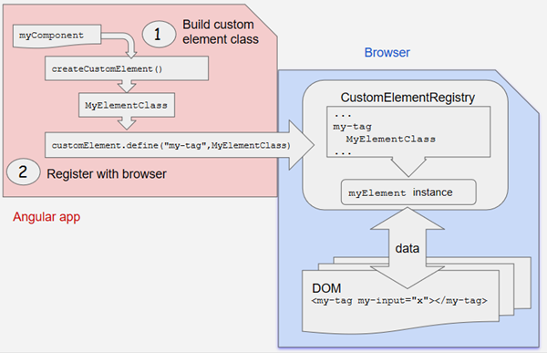

# 组件与模板
## 一、显示数据
  在Angular中最典型的数据显示方式，就是把HTML模板中的控件绑定到Angular组件的属性中，以创建一个列表组件为例，我要显示一些人物的名字，根据条件决定在列表下方是否显示一条消息，最终要变成这个样子：
```txt
  人物列表
  我最喜欢的是：许嵩
  这些人是：
  	· 许嵩
  	· 山田凉介
  	· 夏洛克
  	· 夏目
  哎呀，还有好多呢....
```
### 1.使用插值表达式显示组件属性
  要显示组件的属性，就直接通过插值表达式（interpolation）来绑定属性名，直接把属性名放在双花括号里面，然后放在模板里面就好啦。
```typescript
  app.component.ts //演示练习这些小demo，放在app.component里面就好啦
	import {Component} from "@angular/core" 
	@Component({
		//app-root作为标签使用，当通过main.ts中的AppComponent类启动时，Angular在index.html找到<app-root>的元素，然后去实例化一个AppComponent，渲染到<app-root>的标签中
  		selector:'app-root',
  		template:` 
  			<p>{{title}}</p>
  			<p>我最喜欢的是：{{favorite}}</p>
  		`
  		//Angular自动从组件中提取title和favorite属性的值，并且把这些值插入浏览器中，当这些属性值发生变化时，Angular就会自动刷新显示。
	})
	export class AppComponent {
  		title : '人物列表',
  		favorite : '许嵩'
	}
```
### 2.选择内联模板或者模板文件
  template用来定义内联模板，直接把元素写在后面就行，或者把模板放在单独的HTML文件里面，再通过templateUrl的属性，指定这个HTML文件的位置。
  上面的demo里面选择内联是因为代码很少，如果模板代码多的话，放在模板文件里面会更好有点，但是两种方法，在绑定数据上是完全一样的。
- 构造函数和变量初始化
  demo里面使用变量赋值的方式初始化组件，或者，可以使用构造函数来声明和初始化属性
```typescript
  	export class XXXComponent{
  		title: string;
  		favorite: string; 
  		constructor() {
  			this.title = '人物列表';
  			this.favorite = '许嵩';
		}
	}
```
### 3.使用ngFor显示数组属性
  要显示人物的列表，可以先向组件中添加一个数组，里面放着每个人物的名字，然后把favorite改成数组的第一个名字。
```typescript
	export class AppComponent{//定义数据
  		title = '人物列表';
  		lists = ['许嵩'，'山田凉介','夏洛克','夏目'];
  		favorite = this.lists[0];
	}
	//然后在模板里面
	template:`
		<p>{[title]}</p>
		<p>我最喜欢的是：{{favorite}}</p>
		<p>这些人是：</p>
		<ul>
			<li *ngFor="let tmp of list">{{tmp}}</li>
		</ul>
	`
	ngFor循环的时候，拿出list中的每个值，放入<li>标签内，生成多个li标签。ngFor不仅能循环数组，对象也可以，在插值表达式里面用取对象值的方法也可以拿到想要的数据。
```
### 4.为数据创建一个类
  demo里面是直接把数据定义在了组件内部，使用到的是一个普通的字符串数组的绑定，此外还有对于一个对象数组的绑定，要将此绑定转换成使用对象，需要把人物名字的数组转换成一个List的对象数组。
```txt
  首先需要创建一个List的类
  eg： List.ts
  		export class List{
  			constructor(
  				public id: number,
  				public name: string
  			){}
		}
  定义并导出这个类，里面有一个构造函数和id、name两个属性
  public id：number（这是ts的简写形式，用构造函数的参数直接定义属性） 做了哪些事？
  	· 声明了一个构造函数参数及其类型
  	· 声明了一个同名的公共属性
  	· 当new一个该类的实例时，把该属性初始化为相应的参数值
```
#### 4.1使用一个类
  导入List类之后，组件的lists属性就可以返回一个类型化过的lists数组了。
```typescript
	lists = [
  		new List(1,'许嵩'),
  		new List(2,'山田凉介'),
  		new List(3,'夏洛克'),
  		new List(4,'夏目')
	]
	favorite = this.lists[0];
	//按照上面这样创建这个数组，现在模板里面的{{tmp}}一下子把id和name都显示出来了，如果只要显示name：
	template: `
  		<p>{{title}}</p>
  		<p>我最喜欢的是: {{lists.name}}</p>
        <p>这些人是:</p>
        <ul>
          <li *ngFor="let tmp of lists">
            {{ tmp.name }}
          </li>
        </ul>
`
```
```txt
ps回忆（恰好想起来，和上面的没有关系）:
	JS面向对象，当用new创建一个新的对象的时候，发生了什么？？
	new的时候，做了四件事：
		1.创建了一个新的对象
		2.自动让新的子对象继承构造函数的原型对象！！important
		3.调用构造函数，向新的空的对象中强行添加新成员
		4.将新的变量地址返回给变量保存
```
### 5.通过ngIf进行条件显示
  显示数据的最后一步，根据需求是否显示某个视图
```txt
比如说，如果我列表的长度大于3了，就在视图最后显示一句话
	<li *ngIf="lists.length>3">哎呀，还有好多呢...</li>
	*ngIf 就是根据表达式的真假来显示或者移除某个元素
```
- 显示数据——小结
  - 带有双花括号的插值表达式 (interpolation) 来显示一个组件属性
  - 用 ngFor 循环显示出数组的值或者对象数组
  - 用一个 TypeScript 类来为我们的组件描述模型数据并显示模型的属性
  - 用 ngIf 根据一个布尔表达式有条件地显示一段 HTML

###### 最后，demo的所有代码：
- arc/app/app.component.ts
```typescript
	import { Component } from '@angular/core';
	import { List } from './list';
 
    @Component({
      selector: 'app-root',
      template: `
        <p>{{title}}</p>
        <p>我最喜欢的是: {{lists.name}}</p>
        <p>这些人是:</p>
        <ul>
          <li *ngFor="let tmp of lists">
            {{ tmp.name }}
            </li>
        </ul>
        <p *ngIf="lists.length > 3">哎呀，还有很多呢...</p>
    `
    })
    export class AppComponent {
      title = '人物列表';
      heroes = [
        new List(1, '许嵩'),
        new List(2, '山田凉介'),
        new List(3, '夏洛克'),
        new List(4, '夏目')
      ];
      favorite = this.lists[0];
    }
```
- src/app/list.ts
```typescript
	export class List(){
  		constructor(
  			public id: number,
  			public name: string
  		){}
	}
```
- app.module.ts和main.ts什么的没有什么变化...不写了

## 二、模板语法
  Angular应用管理着用户的所见所为，并且通过组件和模板来和用户交互。在MVC/MVVM框架中，组件就是Control或者ViewModule的角色了，模板就是View的角色。关于Angular的模板语言，需要知道它的基本原理，并且掌握大部分的语法。
###  1.模板中的HTML
```txt
  Angular的模板语言是HTML，HTML大部分的语法都是有效的模板语法，但是<script>被忽略了，还有html、body、base在模板中也没有意义，其它的元素都正常使用就好。
  在Angular里面，还可以通过组件和指令扩展HTML标签。创建的组件通过selector指定的名字直接用就好啦。
```
### 2.插值表达式
```txt
  插值表达式在之前的demo里面已经见了很多了，它可以把计算后的字符串插入HTML元素标签，它可以把计算后的字符串插入到 HTML 元素标签内的文本或对标签的属性进行赋值。
  <p>{{title}}
  	
  </p>
  花括号之间的就是组件的属性的名字，Angular会用组件中相应的属性的字符串的值，替换这个名字，在上面两行代码中，Angular会计算title和imgUrl的值，然后填在空白的地方，按顺序先显示title的内容，再显示图片。
  一般来说，括号间的素材是一个模板表达式，Angular先对它求职，再把它转成字符串
  比如<p>1 + 1= {{1+1}}</p>，插值表达式可以对其进行运算并显示在页面上，不管花括号里面是数字相加还是什么别的运算，也可以和组件中的属性或者方法一起调用。
```
### 3.模板表达式
  模板表达式产生一个值。 Angular 执行这个表达式，并把它赋值给绑定目标的属性，这个绑定目标可能是 HTML 元素、组件或指令。
  比如{{1+1}}中所包含的模板表达式是1 + 1。 在属性绑定中会再次看到模板表达式，它出现在等号右侧的引号中，就像这样：[property]="expression"。写的时候看上去像是js，很多js表达式也是合法的模板表达式，但是不是全部。
  有些js的表达式就不能用，可能会引起一些错误，比如：
```txt
  	赋值 (=, +=, -=, ...)
	new运算符
	使用;或,的链式表达式
	自增或自减操作符 (++和--)
```
  还有一些在语法上就不支持：
```txt
  	不支持位运算|和&
	具有新的模板表达式运算符，比如|、?.和!。
```
#### 3.1 表达式上下文
```txt
	eg：{{title}}
		<span [hidden]="isUnchanged">changed</span>
```
  典型的表达式上下文就是这个组件实例，它是各种绑定值的来源。 在demo中，双花括号中的title和引号中的isUnchanged所引用的都是AppComponent中的属性。
  表达式的上下文可以包括组件之外的对象。 比如模板输入变量 (let tmp)和模板引用变量(#userInput)就是备选的上下文对象之一。
```txt
	<div *ngFor="let tmp of lists">{{tmp.name}}</dv>
  	<input #userInput>{{userInput.value}}
```
  表达式中的上下文变量，是由模板变量，指令的上下文变量和组件的成员叠加而成的，如果我要引用的变量名存在于一个以上的命名空间中，那么模板变量是最优先的，其次是指令的上下文变量，最后是组件的成员。
  如果说我在组件的属性里面写了一个叫tmp的属性，那么就和*ngFor里面的tmp起了冲突，在{{tmp.name}}里面，tmp引用的是模板变量，而不是组件的属性。
  模板表达式不能引用全局命名空间中的任何东西，比如window或document。它们也不能调用console.log或Math.max。 它们只能引用表达式上下文中的成员。
#### 3.2表达式指南
  模板表达式能成就一个应用也能毁掉一个应用，在此列出以下指南：
  - 没有可见的副作用
    模板表达式除了目标属性的值以外，不应该改变应用的任何状态。
    这条规则是 Angular “单向数据流”策略的基础。 永远不用担心读取组件值可能改变另外的显示值。 在一次单独的渲染过程中，视图应该总是稳定的。
  - 执行迅速
    Angular 执行模板表达式非常的频繁。 它们可能在每一次按键或鼠标移动后被调用。 表达式应该快速结束，否则用户就会感到拖沓，特别是在较慢的设备上。 当计算代价较高时，应该考虑缓存那些从其它值计算得出的值。
  - 非常简单
    虽然也可以写出相当复杂的模板表达式，但不要那么写。
    常规是属性名或方法调用。偶尔的逻辑取反也还凑合。 其它情况下，应在组件中实现应用和业务逻辑，使开发和测试变得更容易。
  - 幂等性（可以使用相同参数重复执行，并能获得相同结果的函数。这些函数不会影响系统状态，也不用担心重复执行会对系统造成改变。）
    最好使用幂等的表达式，因为它没有副作用，并且能提升 Angular 变更检测的性能。
    在 Angular 的术语中，幂等的表达式应该总是返回完全相同的东西，直到某个依赖值发生改变。
    在单独的一次事件循环中，被依赖的值不应该改变。 如果幂等的表达式返回一个字符串或数字，连续调用它两次，也应该返回相同的字符串或数字。 如果幂等的表达式返回一个对象（包括Date或Array），连续调用它两次，也应该返回同一个对象的引用。
### 4.模板语句
  模板语句用来响应由绑定目标（如 HTML 元素、组件或指令）触发的事件。 模板语句在事件绑定的时候细说，它出现在=号右侧的引号中，就像这样：(event)="statement"。
```txt
  <button (click)="deletePerson()">Delete person</button>
```
  模板语句有副作用。 这是事件处理的关键。因为我们要根据用户的输入更新应用状态。
  响应事件是 Angular 中“单向数据流”的另一面。 在一次事件循环中，可以随意改变任何地方的任何东西。
  和模板表达式一样，模板语句使用的语言也像 JavaScript。 模板语句解析器和模板表达式解析器有所不同，特别之处在于它支持基本赋值 (=) 和表达式链 (;和,)。
  ps，一些js语法不能用：
```txt
  · new运算符
  · 自增和自减运算符：++和--
  · 操作并赋值，例如+=和-=
  · 位操作符|和&
  · 模板表达式运算符（就是管道的 | 还有判断的？之类的）
```
#### 4.1语句上下文
  和表达式中一样，语句只能引用语句上下文中 —— 通常是正在绑定事件的那个组件实例。
  典型的语句上下文就是当前组件的实例。 (click)="deletePerson()"中的deletePerson就是这个数据绑定组件上的一个方法。
```txt
  <button (click)="deletePerson()">Delete person</button>
  
  eg：
  <button (click)="onSave($event)">Save</button>
  <button *ngFor="let tmp of lists" (click)="deletePerson(tmp)">  {{tmp.name}}</button>
  <form #listForm (ngSubmit)="onSubmit(listForm)"> ... </form>
```
  语句上下文可以引用模板自身上下文中的属性。 在上面的demo中，就把模板的$event对象、模板输入变量 (let tmp)和模板引用变量 (#listForm)传给了组件中的一个事件处理器方法。
  模板上下文中的变量名的优先级高于组件上下文中的变量名。在上面的deletePerson(tmp)中，tmp是一个模板输入变量，而不是组件中的tmp属性。
  模板语句不能引用全局命名空间的任何东西。比如不能引用window 或 document，也不能调用console.log或Math.max。
#### 4.2 语句指南
  和表达式一样，避免写复杂的模板语句。 常规是函数调用或者属性赋值。
### 5.绑定语法（概览）
  数据绑定是一种机制，用来协调用户所见和应用数据，虽然我能往 HTML 推送值或者从 HTML 拉取值（jQuery操控DOM）， 但如果把这些琐事交给数据绑定框架处理， 应用会更容易编写、阅读和维护。 只要简单地在绑定源和目标 HTML 元素之间声明绑定，框架就会完成这项工作。
  Angular 提供了各种各样的数据绑定，之后细说。 先从高层视角来看看 Angular 数据绑定及其语法。
  绑定的类型可以根据数据流的方向分成三类： 从数据源到视图、从视图到数据源以及双向的从视图到数据源再到视图。
| 数据方向         |                    语法                    |                          绑定类型 |
| ------------ | :--------------------------------------: | ----------------------------: |
| 单向：从数据源到视图目标 | {{expression}}[target]="expression" bind-target="expression" | 插值表达式 Property Attribute 类 样式 |
| 单向：从视图目标到数据源 | (target)="statement" on-target="statement" |                            事件 |
| 双向           | [(target)]="expression" bindon-target="expression" |                            双向 |
  除了插值表达式之外的绑定类型，在等号左边是目标名， 无论是包在括号中 ([]、()) 还是用前缀形式 (bind-、on-、bindon-) 。
  这个目标名就是Property的名字。它可能看起来像是元素属性（Attribute）的名字，但它不是。 要理解它们的不同点，必须尝试用另一种方式来审视模板中的 HTML。
#### 5.1 新的思维模型
  数据绑定的威力和允许用自定义标记扩展 HTML 词汇的能力，容易误导我们把模板 HTML 当成 HTML+。
  它其实就是 HTML+。 但它也跟一般的的 HTML 有着显著的不同。 所以现在需要一种新的思维模型。
  在正常的 HTML 开发过程中，使用 HTML 元素创建视觉结构， 通过把字符串常量设置到元素的 attribute 来修改那些元素。
  比如：
```html
    <div class="special">Mental Model</div>
    
    <button disabled>Save</button>
```
  在 Angular 模板中，仍使用同样的方式来创建结构和初始化 attribute 值。
  然后，用封装了 HTML 的组件创建新元素，并把它们当作原生 HTML 元素在模板中使用
  比如：
```html
    <!-- Normal HTML -->
    <div class="special">Mental Model</div>
    <!-- A new element! -->
    <app-person-detail></app-person-detail>
```
  上面这个样子就是HTML+
  现在开始学习数据绑定。我们碰到的第一种数据绑定是这样的：
```html
<!-- Bind button disabled state to `isUnchanged` property -->
<button [disabled]="isUnchanged">Save</button>
```
  过儿再认识那个怪异的方括号记法。表面上看，我正在绑定按钮的disabled attribute。 并把它设置为组件的isUnchanged属性的当前值。
  但是wrong！日常的 HTML 确实是这样。但是在这儿，一旦开始数据绑定，就不再跟 HTML attribute 打交道了。 这里不是设置 attribute，而是设置 DOM 元素、组件和指令的 property。
  #### 5.2 HTML attribute 与 DOM property 的对比
```txt
	attribute 是由 HTML 定义的。property 是由 DOM (Document Object Model) 定义的。
	· 少量 HTML attribute 和 property 之间有着 1:1 的映射，如id。
	· 有些 HTML attribute 没有对应的 property，如colspan。
	· 有些 DOM property 没有对应的 attribute，如textContent。
	· 大量 HTML attribute看起来映射到了property…… 但却不像我们想的那样！
	最后一类尤其让人困惑…… 除非我们能理解这个普遍原则：
	attribute 初始化 DOM property，然后它们的任务就完成了。property 的值可以改变；attribute 的值不能改变。
	比如，当浏览器渲染<input type="text" value="许嵩">时，它将创建相应 DOM 节点， 其value property 被初始化为 “许嵩”。
	当用户在输入框中输入 “夏洛克” 时，DOM 元素的value property 变成了 “夏洛克”。 但是这个 HTML value attribute 保持不变。如果我们读取 input 元素的 attribute，就会发现确实没变： input.getAttribute('value') // 返回 "许嵩"。
	HTML attribute value指定了初始值；DOM value property 是当前值。
	disabled attribute 是另一个古怪的例子。按钮的disabled property 是false，因为默认情况下按钮是可用的。 当我们添加disabled attribute 时，只要它出现了按钮的disabled property 就初始化为true，于是按钮就被禁用了。
	添加或删除disabled attribute会禁用或启用这个按钮。但 attribute 的值无关紧要，这就是我们为什么没法通过 <button disabled="false">仍被禁用</button>这种写法来启用按钮。
	设置按钮的disabled property（如，通过 Angular 绑定）可以禁用或启用这个按钮。 这就是 property 的价值。
	就算名字相同，HTML attribute 和 DOM property 也不是同一样东西。
```
  总而言之，模板绑定是通过 property 和事件来工作的，而不是 attribute。不然全景图里面能是property binding么
  在 Angular里面，attribute 唯一的作用是用来初始化元素和指令的状态。 当进行数据绑定时，只是在与元素和指令的 property 和事件打交道，而 attribute 就完全靠边站了。
#### 5.3 绑定目标
  数据绑定的目标是 DOM 中的某些东西。 这个目标可能是（元素 | 组件 | 指令的）property、（元素 | 组件 | 指令的）事件，或(极少数情况下) attribute 名。 汇总表如下：
| 绑定类型      |                 目标                  |                    示例                    |
| --------- | :---------------------------------: | :--------------------------------------: |
| Property  | 元素的Property，组件的Property，指令的Property | <br /><app-person-detail [person]="currentPerson"></app-person-detail><br /><div [ngClass]="{'special': isSpecial}"></div> |
| 事件        |          元素的事件，组件的事件，指令的事件          | <button (click)="onSave()">Save</button><br /><app-person-detail (deleteRequest)="deletePerson()"></app-person-detail><br /><div (myClick)="clicked=$event" clickable>click me</div> |
| 双向        |             事件与Property             |        <input [([ngModel]="name">        |
| Attribute |           attribute（例外情况）           | <button [attr.aria-label]="help">help</button> |
| CSS类      |            CSS Property             | <div [class.special]="isSpecial">Special</div> |
| 样式        |           style Property            | <button [style.color]="isSpecial ? 'red' : 'green'"> |
### 6.属性绑定（[属性名]）
  当要把视图元素的属性 (property) 设置为模板表达式时，就要写模板的属性 (property) 绑定。
  最常用的属性绑定是把元素属性设置为组件属性的值，比如：
```html

```
  image元素的的src属性会被绑定到组件的imgUrl属性上。
```html
<button [disabled]="isUnchanged">Cancel is disabled</button>
```
  上面这个就是说当组件说它isUnchanged（未改变）时禁用按钮，还有就是设置指令的属性，比如：
```html
<div [ngClass]="classes">[ngClass] binding to the classes property</div>
```
  此外，还有父子组件通讯的时候需要设置自定义组件的模型属性：
```html
<app-person-detail [person]="currentPerson"></app-person-detail>
```
#### 6.1 单向输入
  属性绑定通常就被描述成单向数据绑定了，因为值的流动是单向的，从组件的数据属性流动到目标元素的属性，所以不能使用属性绑定来从目标元素拉取值，也不能绑定到目标元素的属性来读取它，只能设置它。
  此外，也不能使用属性 绑定 来调用目标元素上的方法。如果这个元素触发了事件，可以通过事件绑定来监听它们。如果必须读取目标元素上的属性或调用它的某个方法，得用另一种技术， ViewChild 和 ContentChild。
```txt
  ViewChild可以得到第一个元素，或者直接从DOM选择器上选择与之相匹配的，如果视图DOM发生了变化，并且新的子项和选择器相匹配，则属性将被更新。
  ContentChild与ViewChild不同的是，当内容DOM发生变化时，属性才会被改变。
```
#### 6.2 绑定目标
  eg：
```html

```
  包裹在方括号中的元素属性名标记着目标属性。代码中的目标属性是 image 元素的src属性。
  除此之外还有bind-，被称为规范形式：
```html

```
  目标的名字总是 property 的名字。即使它看起来和别的名字一样。 看到src时，可能会把它当做 attribute。但是并不是，它是 image 元素的 property 名。
  元素属性可能是最常见的绑定目标，但 Angular 会先去看这个名字是否是某个已知指令的属性名，比如：
```html
<div [ngClass]="classes">[ngClass] binding to the classes property</div>

ps:严格来说，Angular 正在匹配指令的输入属性的名字。 这个名字是指令的inputs数组中所列的名字，或者是带有@Input()装饰器的属性。 这些输入属性被映射为指令自己的属性。
```
#### 6.3 消除副作用
  就像之前说的，模板表达式的计算不能有可见的副作用（JS的语法有一些就不要用了），表达式语言本身可以提供一部分安全保障。 不能在属性绑定表达式中对任何东西赋值，也不能使用自增、自减运算符。
  当然，表达式可能会调用具有副作用的属性或方法。但 Angular 没法知道这一点，也没法阻止。
  表达式中可以调用像getFoo()这样的方法。只有我知道getFoo()干了什么。 如果getFoo()改变了某个东西，恰好又绑定到个这个东西，我就掉坑里了。 Angular 可能显示也可能不显示变化后的值。Angular 还可能检测到变化，并抛出警告型错误。所以 一般情况下，只绑定数据属性和那些只返回值而不做其它事情的方法就好。
####6.4 返回恰当的类型
  模板表达式应该返回目标属性所需类型的值。 如果目标属性想要个字符串，就返回字符串。 如果目标属性想要个数字，就返回数字。 如果目标属性想要个对象，就返回对象。
  PersonDetail组价的person属性想要一个Person对象，那就在属性绑定的时候精确地给他一个Person对象：
```html
<app-person-detail [person]="currentPerson"></app-person-detail>
```
#### 6.5方括号
  方括号告诉 Angular 要计算模板表达式。 如果忘了加方括号，Angular 会把这个表达式当做字符串常量看待，并用该字符串来初始化目标属性。 它不会计算这个字符串。
  eg：
```html
<!-- ERROR: PersonDetailComponent.person expects a Person object, not the string "currentPerson" -->
  <app-person-detail person="currentPerson"></app-person-detail>
```
#### 6.6 一次性字符串初始化
  当满足下列条件时，应该省略括号：
  - 目标属性接受字符串值。
  - 字符串是个固定值，可以直接合并到模块中。
  - 这个初始值永不改变。
    在标准 HTML 中经常用这种方式初始化 attribute，这种方式也可以用在初始化指令和组件的属性。 在PersonDetailComponent的prefix属性初始化为固定的字符串，而不是模板表达式。Angular 设置它，然后忘记它。
```html
<app-person-detail prefix="You are main" [person]="currentPerson"></app-person-detail>

ps:作为对比，[person]绑定是组件的currentPerson属性的活绑定，它会一直随着更新。
```
#### 6.7 选择属性绑定还是插值表达式
  代码eg：
```html
<p> is the <i>interpolated</i> image.</p>
<p> is the <i>property bound</i> image.</p>

<p><span>"{{title}}" is the <i>interpolated</i> title.</span></p>
<p>"<span [innerHTML]="title"></span>" is the <i>property bound</i> title.</p>
```
  在多数情况下，插值表达式是更方便的备选项。 实际上，在渲染视图之前，Angular 把这些插值表达式翻译成相应的属性绑定。当要渲染的数据类型是字符串时，两种形式都行。 鉴于可读性，所以倾向于插值表达式。 建议建立代码风格规则，选择一种形式， 这样，既遵循了规则，又能让手头的任务做起来更自然。但数据类型不是字符串时，就必须使用属性绑定了。
  比如假设有个恶意的内容：evilTitle = 'Template <script>alert("evil never sleeps")</script>Syntax';
  Angular 数据绑定对危险 HTML 有防备。 在显示它们之前，它对内容先进行消毒。 不管是插值表达式还是属性绑定，都不会允许带有 script 标签的 HTML 泄漏到浏览器中。
```html
<!--
  Angular generates warnings for these two lines as it sanitizes them
  WARNING: sanitizing HTML stripped some content (see http://g.co/ng/security#xss).
 -->
<p><span>"{{evilTitle}}" is the <i>interpolated</i> evil title.</span></p>
<p>"<span [innerHTML]="evilTitle"></span>" is the <i>property bound</i> evil title.</p>

所以最后显示会变这样：
 'Template <script>alert("evil never sleeps")</script>Syntax'is the  interpolated evil title.
  Template Syntax is the  interpolated evil title.
```
### 7.attribute、class 和 style 绑定
#### 7.1 attribute 绑定
  可以通过attribute 绑定来直接设置 attribute 的值，这是“绑定到目标属性 (property)”这条规则中唯一的例外。这是唯一的能创建和设置 attribute 的绑定形式。
  之前一直还在说，通过属性绑定来设置元素的属性总是好于用字符串设置 attribute。那为啥 Angular 还提供了 attribute 绑定。
  因为当元素没有属性可绑的时候，就必须使用 attribute 绑定。考虑 ARIA， SVG 和 table 中的 colspan/rowspan 等 attribute。 它们是纯粹的 attribute，没有对应的属性可供绑定。
  比如想写下面这样的：
```html
<tr><td colspan="{{1 + 1}}">Three-Four</td></tr>

<!--报错：
  Template parse errors:
Can't bind to 'colspan' since it isn't a known native property
（模板解析错误：不能绑定到 'colspan'，因为它不是已知的原生属性）-->
```
  正如提示中所说，<td>元素没有colspan属性。 但是插值表达式和属性绑定只能设置属性，不能设置 attribute。我们需要 attribute 绑定来创建和绑定到这样的 attribute。attribute 绑定的语法与属性绑定类似。 但方括号中的部分不是元素的属性名，而是由attr前缀，一个点 (.) 和 attribute 的名字组成。 可以通过值为字符串的表达式来设置 attribute 的值。
  这里把[attr.colspan]绑定到一个计算值：
```html
<table border=1>
  <!--  expression calculates colspan=2 -->
  <tr><td [attr.colspan]="1 + 1">One-Two</td></tr>

  <!-- ERROR: There is no `colspan` property to set!
    <tr><td colspan="{{1 + 1}}">Three-Four</td></tr>
  -->
  <tr><td>Five</td><td>Six</td></tr>
</table>
```
  attribute 绑定的主要用例之一是设置 ARIA attribute（译注：ARIA指可访问性，用于给残障人士访问互联网提供便利），比如：
```html
<!-- create and set an aria attribute for assistive technology -->
<button [attr.aria-label]="actionName">{{actionName}} with Aria</button>
```
#### 7.2 CSS类绑定
  借助 CSS 类绑定，可以从元素的class attribute 上添加和移除 CSS 类名。CSS 类绑定绑定的语法与属性绑定类似。 但方括号中的部分不是元素的属性名，而是由class前缀，一个点 (.)和 CSS 类的名字组成， 其中后两部分是可选的。比如这样：[class.class-name]。
```html
<!-- standard class attribute setting  -->
<div class="bad curly special">Bad curly special</div>
```
  demo里面示范了如何通过 CSS 类绑定来添加和移除应用的 "special" 类，不用绑定直接设置 attribute 。
  或者可以把它改写为绑定到所需 CSS 类名的绑定；这是一个或者全有或者全无的替换型绑定。 （就是当 badCurly 有值时 class 这个 attribute 设置的内容会被完全覆盖）
```html
<!-- reset/override all class names with a binding  -->
<div class="bad curly special" [class]="badCurly">Bad curly</div>
```
  最后，可以绑定到特定的类名。 当模板表达式的求值结果是真值时，Angular 会添加这个类，反之则移除它。
```html
<!-- toggle the "special" class on/off with a property -->
<div [class.special]="isSpecial">The class binding is special</div>

<!-- binding to `class.special` trumps the class attribute -->
<div class="special" [class.special]="!isSpecial">This one is not so special</div>
```
  但是用的时候直接可以用ngClass来切换类名啊，超级方便。
#### 7.3 样式绑定
  通过样式绑定，可以设置内联样式。样式绑定的语法与属性绑定类似。 但方括号中的部分不是元素的属性名，而由style前缀，一个点 (.)和 CSS 样式的属性名组成。 比如这样：[style.style-property]。
```html
<button [style.color]="isSpecial ? 'red': 'green'">Red</button>
<button [style.background-color]="canSave ? 'cyan': 'grey'" >Save</button>
```
  有些样式绑定中的样式带有单位。在这里，以根据条件用 “em” 和 “%” 来设置字体大小的单位。
```html
<button [style.font-size.em]="isSpecial ? 3 : 1" >Big</button>
<button [style.font-size.%]="!isSpecial ? 150 : 50" >Small</button>
```
  同样的，用的时候还是直接用ngStyle啊...
### 8.事件绑定
  （之前的就是全景图的property binding，这次就是event binding啦）
  前面遇到的绑定的数据流都是单向的：从组件到元素。
  但用户不会只盯着屏幕看。他们会在输入框中输入文本。他们会从列表中选取条目。 他们会点击按钮。这类用户动作可能导致反向的数据流：从元素到组件。知道用户动作的唯一方式是监听某些事件，如按键、鼠标移动、点击和触摸屏幕。 可以通过 Angular 事件绑定来声明对哪些用户动作感兴趣。事件绑定语法由等号左侧带圆括号的目标事件和右侧引号中的模板语句组成。 下面事件绑定监听按钮的点击事件。每当点击发生时，都会调用组件的onSave()方法。
  像这样：
```html
<button (click)="onSave()">Save</button>
```
#### 8.1 目标事件
  圆括号中的名称 —— 比如(click) —— 标记出目标事件。在下面例子中，目标是按钮的 click 事件
```html
  <button (click)="onSave()">Save</button>
```
  这个也有规范形式，就是不怎么用：
```html
  <button on-click="onSave()">On Save</button>
```
  元素事件可能是更常见的目标，但 Angular 会先看这个名字是否能匹配上已知指令的事件属性，比如：
```html
  <!-- `myClick` is an event on the custom `ClickDirective` -->
<div (myClick)="clickMessage=$event" clickable>click with myClick</div>
```
  我这个myClick必定是定义过的才能用，不然就报“未知错误”了。
#### 8.2 $event和事件处理语句
  在事件绑定中，Angular 会为目标事件设置事件处理器。当事件发生时，这个处理器会执行模板语句。 典型的模板语句通常涉及到响应事件执行动作的接收器，例如从 HTML 控件中取得值，并存入模型。绑定会通过名叫$event的事件对象传递关于此事件的信息（包括数据值）。事件对象的形态取决于目标事件。如果目标事件是原生 DOM 元素事件， $event就是 DOM事件对象，它有像target和target.value这样的属性。
  比如：
```html
  <input [value]="currentPerson.name" (input)="currentPerson.name=$event.target.value">
```
  上面的代码在把输入框的value属性绑定到firstName属性。 要监听对值的修改，代码绑定到输入框的input事件。 当用户造成更改时，input事件被触发，并在包含了 DOM 事件对象 ($event) 的上下文中执行这条语句。要更新firstName属性，就要通过路径$event.target.value来获取更改后的值。
#### 8.3 使用 EventEmitter 实现自定义事件
  通常，指令使用 Angular EventEmitter 来触发自定义事件。 指令创建一个EventEmitter实例，并且把它作为属性暴露出来。 指令调用EventEmitter.emit(payload)来触发事件，可以传入任何东西作为消息载荷。 父指令通过绑定到这个属性来监听事件，并通过$event对象来访问载荷。
  假设PersonDetailComponent用于显示人物的信息，并响应用户的动作。 虽然PersonDetailComponent包含删除按钮，但它自己并不知道该如何删除这个人物。 最好的做法是触发事件来报告“删除用户”的请求。
```typescript
  app.component.ts:
  template: `
        <div>
          
          <span [style.text-decoration]="lineThrough">
            {{prefix}} {{person?.name}}
          </span>
          <button (click)="delete()">Delete</button>
        </div>`
  deleteRequest = new EventEmitter<Person>();

  delete() {
	this.deleteRequest.emit(this.person);
  }
```
  当deleteRequest事件触发时，Angular 调用父组件的deletePerson方法， 在$event变量中传入要删除的人物（来自PersonDetail）。
#### 8.4 模板语句的副作用
  deletePerson方法有副作用：它删除了一个人物。 模板语句的副作用不仅没问题，反而正是所期望的。删除这个人物会更新模型，还可能触发其它修改，包括向远端服务器的查询和保存。 这些变更通过系统进行扩散，并最终显示到当前以及其它视图中。
### 9.双向数据绑定
  在项目中经常需要显示数据属性，并在用户作出更改时更新该属性。在元素层面上，既要设置元素属性，又要监听元素事件变化。Angular 为此提供一种特殊的双向数据绑定语法：[(x)]。 [(x)]语法结合了属性绑定的方括号[x]和事件绑定的圆括号(x)。当我更改数据的时候，视图直接跟着改变，非常方便啊。
  当一个元素拥有可以设置的属性x和对应的事件xChange时，就能解释通[(x)]语法了。
  下面的SizerComponent符合这个模式。它有size属性和伴随的sizeChange事件：
```typescript
import { Component, EventEmitter, Input, Output } from '@angular/core';
@Component({
  selector: 'app-sizer',
  template: `
  <div>
    <button (click)="dec()" title="smaller">-</button>
    <button (click)="inc()" title="bigger">+</button>
    <label [style.font-size.px]="size">FontSize: {{size}}px</label>
  </div>`
})
export class SizerComponent {
  @Input()  size: number | string;
  @Output() sizeChange = new EventEmitter<number>();
  dec() { this.resize(-1); }
  inc() { this.resize(+1); }
  resize(delta: number) {
    this.size = Math.min(40, Math.max(8, +this.size + delta));
    this.sizeChange.emit(this.size);
  }
}
```
  size的初始值是一个输入值，来自属性绑定。（size前面加了@Input）点击按钮，在最小/最大值范围限制内增加或者减少size。 然后用调整后的size触发sizeChange事件。
  在下面的代码里面，AppComponent.fontSize被双向绑定到SizerComponent：
```html
<app-sizer [(size)]="fontSizePx"></app-sizer>
<div [style.font-size.px]="fontSizePx">Resizable Text</div>
```
  SizerComponent.size初始值是AppComponent.fontSizePx。 点击按钮时，通过双向绑定更新AppComponent.fontSizePx。 被修改的AppComponent.fontSizePx通过样式绑定，改变文本的显示大小。
  双向绑定语法实际上是属性绑定和事件绑定的语法糖。 Angular将SizerComponent的绑定分解成这样：
```html
  <app-sizer [size]="fontSizePx" (sizeChange)="fontSizePx=$event"></app-sizer>
```
  $event变量包含了SizerComponent.sizeChange事件的荷载。 当用户点击按钮时，Angular 将$event赋值给AppComponent.fontSizePx。比起单独绑定属性和事件，双向数据绑定语法显得非常方便。
  在像<input>和<select>这样的 HTML 元素上不能使用这样的双向数据绑定。 因为原生 HTML 元素不遵循x值和xChange事件的模式。
  但是，最后还是只用[(ngModel)]啊，表单元素上就能双向数据绑定啦。
### 10.内置指令 - 内置属性指令
  属性型指令会监听和修改其它HTML元素或组件的行为、元素属性（Attribute）、DOM属性（Property）。 它们通常会作为HTML属性的名称而应用在元素上。
  常用的属性型指令
  - NgClass - 添加或移除一组CSS类
  - NgStyle - 添加或移除一组CSS样式
  - NgModel - 双向绑定到HTML表单元素
#### 10.1 NgClass 指令
  在Angular里面经常用动态添加或删除 CSS 类的方式来控制元素如何显示。 通过绑定到NgClass，可以同时添加或移除多个类。
  CSS类用来添加或者删除单个类好用：
```html
<!-- 切换"special" 这个类 -->
<div [class.special]="isSpecial">The class binding is special</div>
```
  上面用来切换一个还行，如果是多个class，就需要用ngClass，把ngClass绑定到一个 key:value 形式的控制对象。这个对象中的每个 key 都是一个 CSS 类名，如果它的 value 是true，这个类就会被加上，否则就会被移除。
  组件方法setCurrentClasses可以把组件的属性currentClasses设置为一个对象，它将会根据三个其它组件的状态为true或false而添加或移除三个类。
```typescript
currentClasses: {};
setCurrentClasses() {
  // CSS classes: 添加或者删除组件属性的每一个当前状态
  this.currentClasses =  {
    'saveable': this.canSave,
    'modified': !this.isUnchanged,
    'special':  this.isSpecial
  };
}
```
  然后把NgClass属性绑定到currentClasses，根据它来设置此元素的CSS类：
```html
<div [ngClass]="currentClasses">This div is initially saveable, unchanged, and special</div>
```
  setCurrentClassess()既可以在初始化时调用，也可以在所依赖的的属性变化时调用。
#### 10.2 NgStyle指令
  根据组件的状态动态设置内联样式。 NgStyle绑定可以同时设置多个内联样式。
  样式绑定是设置单一样式值的简单方式。比如：
```html
<div [style.font-size]="isSpecial ? 'x-large' : 'smaller'" >
  This div is x-large or smaller.
</div>
```
  如果需要设置多个内联样式，就用ngStyle。
  NgStyle需要绑定到一个 key:value 控制对象。 对象的每个 key 是样式名，它的 value 是能用于这个样式的任何值。
  看组件的setCurrentStyles方法，它会根据另外三个属性的状态把组件的currentStyles属性设置为一个定义了三个样式的对象：
```typescript
currentStyles: {};
setCurrentStyles() {
  // CSS styles: set per current state of component properties
  this.currentStyles = {
    'font-style':  this.canSave      ? 'italic' : 'normal',
    'font-weight': !this.isUnchanged ? 'bold'   : 'normal',
    'font-size':   this.isSpecial    ? '24px'   : '12px'
  };
}
```
  把NgStyle属性绑定到currentStyles，以据此设置此元素的样式：
```html
<div [ngStyle]="currentStyles">
  This div is initially italic, normal weight, and extra large (24px).
</div>
```
  setCurrentStyles()也是，既可以在初始化时调用，也可以在所依赖的的属性变化时调用。
#### 10.3 NgModel - 使用[(ngModel)]双向绑定到表单元素
  当开发数据输入表单时，通常都要既显示数据属性又根据用户的更改去修改那个属性。
  使用NgModel指令进行双向数据绑定可以简化这种工作。比如：
```html
  <input [(ngModel)]="currentPerson.name">
```
  使用 ngModel 时需要 FormsModule。在使用ngModel指令进行双向数据绑定之前，必须导入FormsModule并把它添加到Angular模块的imports列表中。
  eg：
```typescript
import { NgModule } from '@angular/core';
import { BrowserModule }  from '@angular/platform-browser';
import { FormsModule } from '@angular/forms'; 
// 从表单中引入FormsModule

@NgModule({
  imports: [
    BrowserModule,
    FormsModule  // <--- 引入 NgModule
  ],
})
export class AppModule { }
```
  先看之前的name绑定，是通过分别绑定到<input>元素的value属性和input事件来达到同样的效果：
```html
<input [value]="currentHero.name" (input)="currentHero.name=$event.target.value" >
```
  这样显得很笨重，谁会记得该设置哪个元素属性以及当用户修改时触发哪个事件？ 我该如何提取输入框中的文本并且更新数据属性？谁会希望每次都去查资料来确定这些？
  ngModel指令通过自己的输入属性ngModel和输出属性ngModelChange隐藏了那些细节。
```html
<input  [ngModel]="currentHero.name"  (ngModelChange)="currentHero.name=$event">
```
```txt
  ps：
  ngModel输入属性会设置该元素的值，并通过ngModelChange的输出属性来监听元素值的变化。
  各种元素都有很多特有的处理细节，因此NgModel指令只支持实现了ControlValueAccessor的元素， 它们能让元素适配本协议。 <input>输入框正是其中之一。 Angular为所有的基础HTML表单都提供了值访问器（Value accessor），表单一章展示了如何绑定它们。
  不能把[(ngModel)]用到非表单类的原生元素或第三方自定义组件上，除非写一个合适的值访问器，这种技巧超出了本章的范围。
  自己写的Angular组件不需要值访问器，因为我们可以让值和事件的属性名适应Angular基本的双向绑定语法，而不使用NgModel。 前面看过的sizer就是使用这种技巧的例子。
```
  使用独立的ngModel绑定优于绑定到该元素的原生属性，那样做的就更好了。
  而且不用被迫两次引用这个数据属性，Angular可以捕获该元素的数据属性，并且通过一个简单的声明来设置它，这样它就可以使用[(ngModel)]语法了。
```html
  <input [(ngModel)]="currentPerson.name">
```
  [(ngModel)]语法只能设置数据绑定属性。 如果要做更多或者做点不一样的事，就用它的展开形式。
  比如：
```html
<input [ngModel]="currentPerson.name" (ngModelChange)="setUppercaseName($event)">
```
  失去焦点之后，输入框的内容就会转成全大写。
### 11.内置指令 - 内置结构型指令
#### 11.1 NgIf指令
  通过把NgIf指令应用到元素上（称为宿主元素），可以往DOM中添加或从DOM中移除这个元素，比如：
```html
<app-person-detail *ngIf="isActive"></app-person-detail>
```
  当isActive为真时，就把当前组件挂载到DOM树上，为假时，就移除该组件。
  这和显示隐藏不一样，比如：
```html
<!-- isSpecial is true -->
<div [class.hidden]="!isSpecial">Show with class</div>
<div [class.hidden]="isSpecial">Hide with class</div>

<!-- HeroDetail is in the DOM but hidden -->
<app-hero-detail [class.hidden]="isSpecial"></app-hero-detail>

<div [style.display]="isSpecial ? 'block' : 'none'">Show with style</div>
<div [style.display]="isSpecial ? 'none'  : 'block'">Hide with style<
/div>
```
  当隐藏子树时，它仍然留在 DOM 中。 子树中的组件及其状态仍然保留着。 即使对于不可见属性，Angular 也会继续检查变更。 子树可能占用相当可观的内存和运算资源。
  当NgIf为false时，Angular 从 DOM 中物理地移除了这个元素子树。 它销毁了子树中的组件及其状态，也潜在释放了可观的资源，最终让用户体验到更好的性能。
  显示/隐藏的技术对于只有少量子元素的元素是很好用的，但要当心别试图隐藏大型组件树。相比之下，NgIf则是个更安全的选择。
  eg：
```html
<div *ngIf="currentPerson">Hello, {{currentPerson.name}}</div>
<div *ngIf="nullPerson">Hello, {{nullPerson.name}}</div>
```
  ngIf指令通常会用来防范空指针错误。 而显示/隐藏的方式是无法防范的，当一个表达式尝试访问空值的属性时，Angular就会抛出一个异常。
  在上面的demo中，用NgIf来保护了两个<div>防范空指针错误。 currentPerson的名字只有当存在currentPerson时才会显示出来。 而nullPerson永远不会显示。
#### 11.2 NgFor指令
  这是循环指令，展示一个由多个条目组成的列表。首先定义了一个 HTML 块，它规定了单个条目应该如何显示。 再告诉 Angular 把这个块当做模板，渲染列表中的每个条目。
  常用方式：
```html
<div *ngFor="let tmp of lists">{{tmp.name}}</div>
```
  NgFor的微语法：
```txt
  赋值给*ngFor的字符串不是模板表达式。 它是一个微语法 —— 由 Angular 自己解释的小型语言。在这个例子中，字符串"let tmp of lists"的含义是：
  取出lists数组中的每个英雄，把它存入局部变量hero中，并在每次迭代时对模板 HTML 可用
  Angular 把这个指令翻译成了一个<ng-template>包裹的宿主元素，然后使用这个模板重复创建出一组新元素，并且绑定到列表中的每一个person。
```
#### 11.3 模板输入变量
  tmp前的let关键字创建了一个名叫tmp的模板输入变量。 ngFor指令在由父组件的lists属性返回的lists数组上迭代，每次迭代都从数组中把当前元素赋值给tmp变量。
  我们可以在ngFor的宿主元素（及其子元素）中引用模板输入变量tmp，从而访问该英雄的属性。 这里它首先在一个插值表达式中被引用到，然后通过一个绑定把它传给了<person-detail>组件的tmp属性。
```html
<div *ngFor="let tmp of lists">{{tmp.name}}</div>
<app-person-detail *ngFor="let tmp of lists" [list]="List"></app-person-detail>
```
  ngFor 也可以带索引,NgFor指令上下文中的index属性返回一个从零开始的索引，表示当前条目在迭代中的顺序。 可以通过模板输入变量捕获这个index值，并把它用在模板中：
```html
<div *ngFor="let hero of heroes; let i=index">{{i + 1}} - {{hero.name}}</div>
```
  带trackBy的 *ngFor
  ngFor指令有时候会性能较差，特别是在大型列表中。 对一个条目的一丁点改动、移除或添加，都会导致级联的 DOM 操作。
  例如，可以通过重新从服务器查询来刷新英雄列表。 刷新后的列表可能包含很多（如果不是全部的话）以前显示过的英雄。
  他们中的绝大多数（如果不是所有的话）都是以前显示过的英雄。知道这一点，是因为每个英雄的id没有变化。 但在 Angular 看来，它只是一个由新的对象引用构成的新列表， 它没有选择，只能清理旧列表、舍弃那些 DOM 元素，并且用新的 DOM 元素来重建一个新列表。
  如果给它指定一个trackBy，Angular 就可以避免这种折腾。 我往组件中添加一个方法，它会返回NgFor应该追踪的值。 在这里，这个值就是人物的id。
```typescript
ts:
trackByPersons(index: number, person: Person): number { return person.id; }
```
```html
html:
<div *ngFor="let tmp of lists; trackBy: trackByPerson">
  ({{person.id}}) {{person.name}}
</div>
```
  页面有一个"Reset persons"按钮的话，它会创建一个具有相同person.id的新人物。 "Change ids"则会创建一个具有新person.id的新人物。
  - 如果没有trackBy，这些按钮都会触发完全的DOM元素替换。
  - 有了trackBy，则只有修改了id的按钮才会触发元素替换。
#### 11.4 NgSwitch
  NgSwitch指令类似于JavaScript的switch语句。 它可以从多个可能的元素中根据switch条件来显示某一个。 Angular只会把选中的元素放进DOM中。
  NgSwitch实际上包括三个相互协作的指令：NgSwitch、NgSwitchCase 和 NgSwitchDefault，就像这样
```html
<div [ngSwitch]="currentPerson.emotion">
  <app-happy-person    *ngSwitchCase="'happy'"    [hero]="currentPerson"></app-happy-person>
  <app-sad-person      *ngSwitchCase="'sad'"      [hero]="currentPerson"></app-sad-person>
  <app-confused-person *ngSwitchCase="'confused'" [hero]="currentPerson"></app-confused-person>
  <app-unknown-person  *ngSwitchDefault           [hero]="currentPerson"></app-unknown-person>
</div>
```
  NgSwitch是主控指令，要把它绑定到一个返回候选值的表达式。 本例子中的emotion是个字符串，但实际上这个候选值可以是任意类型。绑定到[ngSwitch]。如果试图用*ngSwitch的形式使用它就会报错，这是因为NgSwitch是一个属性型指令，而不是结构型指令。 它要修改的是所在元素的行为，而不会直接接触DOM结构。
  绑定到*ngSwitchCase和*ngSwitchDefault NgSwitchCase 和 NgSwitchDefault 指令都是结构型指令，因为它们会从DOM中添加或移除元素。
  NgSwitchCase会在它绑定到的值等于候选值时，把它所在的元素加入到DOM中。NgSwitchDefault会在没有任何一个NgSwitchCase被选中时把它所在的元素加入DOM中。
  这组指令在要添加或移除组件元素时会非常有用。 这个例子会在person-switch.components.ts中定义的四个“最厉害的人”组件之间选择。 每个组件都有一个输入属性person，它绑定到父组件的currentPerson上。
  这组指令在原生元素和Web Component上都能用， 比如，可以把<confused-person>分支改成这样：
```html
<div *ngSwitchCase="'confused'">Are you as confused as {{currentPerson.name}}?</div>
```
### 12.模板引用变量（#var）
  模板引用变量通常用来引用模板中的某个DOM元素，也可以引用angular组件或者指令或者Web Component。使用#来声明引用变量，比如：
```html
	<input #phone placeholder="请输入电话号码">
```
  在模板的任何地方都可以引用模板引用变量，比如：
```html
    <input #phone placeholder="请输入电话号码">
    <!-- 其它元素，什么都行 -->
    <button (click)="callPhone(phone.value)">Call</button>
```
  模板引用变量是怎么得到它的值的？
```txt
  大多数情况下，Angular会把模板引用变量的值设置为声明它的那个元素。 在上一个例子中，phone引用的是表示电话号码的<input>框。 "拨号"按钮的点击事件处理器把这个input值传给了组件的callPhone方法。 不过，指令也可以修改这种行为，让这个值引用到别处，比如它自身。 NgForm指令就是这么做的。
```
  就像这样用也可以：
```html
<form (ngSubmit)="onSubmit(personForm)" #personForm="ngForm">
  <div>
    <label for="name">Name
      <input name="name" required [(ngModel)]="person.name">
    </label>
  </div>
  <button type="submit" [disabled]="!personForm.form.valid">Submit</button>
</form>
<div [hidden]="!personForm.form.valid">
  {{submitMessage}}
</div>
```
  在上面，personForm出现了3次，中间还隔着HTML，那personForm的值是什么？
  如果之前没有导入FormsModule，Angular就不会控制这个表单，那么它就是一个HTMLFormElement实例。 这里的personForm实际上是一个Angular NgForm 指令的引用， 因此具备了跟踪表单中的每个控件的值和有效性的能力。
  原生的<form>元素没有form属性，但NgForm指令有。这就解释了为何当personForm.form.valid是无效时我们可以禁用提交按钮， 并能把整个表单控件树传给父组件的onSubmit方法。
  模板引用变量的作用范围是整个模板。 不要在同一个模板中多次定义同一个变量名，否则它在运行期间的值是无法确定的。
  也可以用ref-前缀代替#。 下面的例子中就用把fax变量声明成了ref-fax而不是#fax。（也可以作为组件间通讯的一种方法）
```html
    <input ref-fax placeholder="fax number">
    <button (click)="callFax(fax.value)">Fax</button>
```
### 13.输入输出属性（@Input和@Output）
  到目前为止，主要关注的点在于绑定声明的右侧，在模板表达式和模板语句中绑定到组件成员。 当成员出现在这个位置上，则称之为数据绑定的源。
  专注于绑定到的目标，它位于绑定声明中的左侧。 这些指令的属性必须被声明成输入或输出。
  **记住：所有组件皆为指令。**
```txt
     我们要重点突出下绑定目标和绑定源的区别。
     绑定的目标是在=左侧的部分， 源则是在=右侧的部分。
     绑定的目标是绑定符：[]、()或[()]中的属性或事件名， 源则是引号 (" ") 中的部分或插值符号 ({{}}) 中的部分。
     源指令中的每个成员都会自动在绑定中可用。 不需要特别做什么，就能在模板表达式或语句
     访问目标指令中的成员则受到限制。 只能绑定到那些显式标记为输入或输出的属性。
```
  在下面的例子中，iconUrl和onSave是组件的成员，它们在=右侧引号语法中被引用了。
```html
     < img [src]="iconUrl"/>
     <button (click)="onSave()">Save</button>
```
  它们既不是组件的输入也不是输出。它们是绑定的数据源。
  现在，看看PersonDetailComponent中的另一个片段，等号（=）左侧的是绑定的目标。
```html
	<app-person-detail [person]="currentPerson(deleteRequest)="deletePerson($event)"></app-person-detail>
```
  PersonDetailComponent.person和PersonDetailComponent.deleteRequest都在绑定声明的左侧。
  PersonDetailComponent.person在方括号中，它是属性绑定的目标PersonDetailComponent.deleteRequest在圆括号中，它是事件绑定的目标。
####13.1  声明输入和输出属性
  目标属性必须被显式的标记为输入或输出。
  在PersonDetailComponent内部，这些属性被装饰器标记成了输入和输出属性。
```typescript
  @Input()  person: Person;
   // 一个利用@Input的输入属性标识，表示可以接受数据
  @Output() deleteRequest = new EventEmitter<Person>();
   // 一个表示@Output的输出属性利用一个自定义事件的方法
   // 把需要传递出去的数据传递出去。
```
  另外，还可以在指令元数据的inputs或outputs数组中标记出这些成员。比如：
```typescript
  @Component({
  inputs: ['person'],
  outputs: ['deleteRequest'],
  })
```
**既可以通过装饰器，也可以通过元数据数组来指定输入/输出属性。但别同时用！**
```txt
  Q:现在是输入还是输出？
  输入属性通常接收数据值。 输出属性暴露事件生产者，如EventEmitter对象。
  输入和输出这两个词是从目标指令的角度来说的。
  <app-person-detail [person]="currentPerson(deleteRequest)="deletePerson($event)"></app-person-detail>//[person]-->input,(deleteRequest)-->output
  从PersonDetailComponent角度来看，PersonDetailComponent.person是个输入属性， 因为数据流从模板绑定表达式流入那个属性。
  从PersonDetailComponent角度来看，PersonDetailComponent.deleteRequest是个输出属性， 因为事件从那个属性流出，流向模板绑定语句中的处理器。
```
####13.2 给输入/输出属性起别名
  有时需要让输入/输出属性的公开名字不同于内部名字。
  这是使用 attribute 指令时的常见情况。 指令的使用者期望绑定到指令名。例如，在<div>上用myClick选择器应用指令时， 希望绑定的事件属性也叫myClick。
```html
  <div (myClick)="clickMessage=$event" clickable>click with myClick</div>
```
  然而，在指令类中，直接用指令名作为自己的属性名通常都不是好的选择。 指令名很少能描述这个属性是干嘛的。 myClick这个指令名对于用来发出 click 消息的属性就算不上一个好名字。
  幸运的是，可以使用约定俗成的公开名字，同时在内部使用不同的名字。 在上面例子中，实际上是把myClick这个别名指向了指令自己的clicks属性。
### 14.模板表达式操作符
  模板表达式语言使用了 JavaScript 语法的子集，并补充了几个用于特定场景的特殊操作符
#### 14.1 管道操作符（|）
  在绑定之前，表达式的结果可能需要一些转换。例如，可能希望把数字显示成金额、强制文本变成大写，或者过滤列表以及进行排序。
  Angular 管道对像这样的小型转换来说是个明智的选择。 管道是一个简单的函数，它接受一个输入值，并返回转换结果。 它们很容易用于模板表达式中，只要使用管道操作符 (|) 就行了。
```html
	<div>Title through uppercase pipe: {{title | uppercase}}</div>
```
  管道操作符会把它左侧的表达式结果传给它右侧的管道函数。uppercase就是将小写的英文全部转为大写。
  还可以通过多个管道串联表达式：
```html
<!--先转大写，再转小写，lowercase是转小写 -->
<div>
  Title through a pipe chain:
  {{title | uppercase | lowercase}}
</div>
```
  其它的还有date转换日期的，json、number等，具体的以后细说。
#### 14.2 安全导航操作符 ( ?. ) 和空属性路径
  Angular 的安全导航操作符 (?.) 是一种流畅而便利的方式，用来保护出现在属性路径中 null 和 undefined 值。 下面的代码里，当currentPerson为空时，保护视图渲染器，让它免于失败。
```txt
The current person's name is {{currentPerson?.name}}
```
  再比如，如果下面的title是空的话，会怎么样？
```txt
The title is {{title}}
```
  这个视图仍然被渲染出来，但是显示的值是空；只能看到 “The title is”，它后面却没有任何东西。 这是合理的行为。至少应用没有崩溃。
  假设模板表达式涉及属性路径，在下例中，显示一个空 (null) 人物的firstName。
```txt
The null person's name is {{nullPerson.name}}
```
  JavaScript 抛出了空引用错误，Angular 也是如此：
```javascript
TypeError: Cannot read property 'name' of null in [null].
```
  这个样子的话，整个视图就都没有了，如果确信person属性永远不可能为空，可以声称这是合理的行为。 如果它必须不能为空，但它仍然是空值，实际上是制造了一个编程错误，它应该被捕获和修复。 这种情况应该抛出异常。另一方面，属性路径中的空值可能会时常发生，特别是当我们知道数据最终会出现。当等待数据的时候，视图渲染器不应该抱怨，而应该把这个空属性路径显示为空白，就像上面title属性那样。
  但是，当currentPerson为空的时候，应用崩溃了。这个时候，可以通过ngIf来解决，当当前内容不为空的时候再挂载元素：
```html
<!--No hero, div not displayed, no error -->
<div *ngIf="nullPerson">The null person's name is {{nullPerson.name}}</div>
```
  或者可以尝试通过&&来把属性路径的各部分串起来，让它在遇到第一个空值的时候，就返回空。
```txt
The null person's name is {{nullPerson && nullPerson.name}}
```
  这些方法都有价值，但是会显得笨重，特别是当这个属性路径非常长的时候。 想象一下在一个很长的属性路径（如a.b.c.d）中对空值提供保护。Angular 安全导航操作符 (?.) 是在属性路径中保护空值的更加流畅、便利的方式。 表达式会在它遇到第一个空值的时候跳出。 显示是空的，但应用正常工作，而没有发生错误。
#### 14.3 非空断言操作符（！）
  在 TypeScript 2.0 中，可以使用--strictNullChecks标志强制开启严格空值检查。TypeScript就会确保不存在意料之外的null或undefined。在这种模式下，有类型的变量默认是不允许null或undefined值的，如果有未赋值的变量，或者试图把null或undefined赋值给不允许为空的变量，类型检查器就会抛出一个错误。如果类型检查器在运行期间无法确定一个变量是null或undefined，那么它也会抛出一个错误。 我们自己可能知道它不会为空，但类型检查器不知道。 所以我们要告诉类型检查器，它不会为空，这时就要用到非空断言操作符。
  Angular 模板中的\*\*非空断言操作符（!）也是同样的用途。
  比如在ngIf来检查过person是否是已定义的之后，就可以断言person属性是一定是已定义的。
```html
<!--如果没有人，这句话就不显示啦-->
<div *ngIf="person">
  The person's name is {{person!.name}}
</div>
```
  在 Angular 编译器把我的模板转换成 TypeScript 代码时，这个操作符会防止 TypeScript 报告 "person.name可能为null或undefined"的错误。与安全导航操作符不同的是，非空断言操作符不会防止出现null或undefined。 它只是告诉 TypeScript 的类型检查器对特定的属性表达式，不做 "严格空值检测"。如果打开了严格控制检测，那就要用到这个模板操作符，而其它情况下则是可选的。
### 15.类型转换函数$any($any(表达式))
  有时候，绑定表达式可能会报类型错误，并且它不能或很难指定类型。要消除这种报错，你可以使用 $any 转换函数来把表达式转换成 any 类型。
```html
<!-- Accessing an undeclared member -->
<div>
  The hero's marker is {{$any(hero).marker}}
</div>
```
  在这个例子中，当 Angular 编译器把模板转换成 TypeScript 代码时，$any 表达式可以防止 TypeScript 编译器报错说 marker 不是 Hero 接口的成员。$any 转换函数可以和 this 联合使用，以便访问组件中未声明过的成员。
```html
<!-- Accessing an undeclared member -->
<div>
  Undeclared members is {{$any(this).member}}
</div>
```
  $any转换函数可以在绑定表达式中的任何可以进行方法调用的地方使用。
## 三、生命周期钩子
  每个组件都有一个被Angular管理的生命周期，Angular创建它，渲染它，并且创建渲染它的子组件在它被绑定的属性发生变化时检查它，并在它从DOM中被移除前销毁它。Angular提供了生命周期钩子，把这些关键生命时刻暴露出来，然后就可以在这些时候发生事情的时候采取行动了。
### 1.组件生命周期钩子概览
  指令和组件的实例有一个生命周期：新建、更新和销毁。 通过实现一个或多个Angular core库里定义的生命周期钩子接口，开发者就可以介入该生命周期中的这些关键时刻。
  每个接口都有唯一的一个钩子方法，它们的名字是由接口名再加上ng前缀构成的。比如，OnInit接口的钩子方法叫做ngOnInit， Angular在创建组件后立刻调用它，就像这样：
```typescript
    export class PeekABoo implements OnInit {
      constructor(private logger: LoggerService) { }
      // implement OnInit 里面必须要有ngOnInit方法
      ngOnInit() { this.logIt(`OnInit`); }
      logIt(msg: string) {
        this.logger.log(`#${nextId++} ${msg}`);
      }
    }
```
  没有指令或者组件会实现所有这些接口，并且有些钩子只对组件有意义。只有在指令/组件中定义过的那些钩子方法才会被Angular调用。
### 2.生命周期的顺序
  当Angular使用构造函数新建一个组件或指令后，就会按下面的顺序在特定时刻调用这些生命周期钩子方法：
| 钩子                      | 目的和时机                                    |
| :---------------------- | :--------------------------------------- |
| ngOnChanges()           | 当Angular（重新）设置数据绑定输入属性时响应。 该方法接受当前和上一属性值的SimpleChanges对象。当被绑定的输入属性的值发生变化时调用，首次调用一定会发生在ngOnInit()之前。 |
| ngOnInit()              | 在Angular第一次显示数据绑定和设置指令/组件的输入属性之后，初始化指令/组件。在第一轮ngOnChanges()完成之后调用，只调用一次。 |
| ngDoCheck()             | 检测，并在发生Angular无法或不愿意自己检测的变化时作出反应。在每个Angular变更检测周期中调用，ngOnChanges()和ngOnInit()之后。 |
| ngAfterContentInit()    | 当把内容投影进组件之后调用。第一次ngDoCheck()之后调用，只调用一次。只适用于组件。 |
| ngAfterContentChecked() | 每次完成被投影组件内容的变更检测之后调用。ngAfterContentInit()和每次ngDoCheck()之后调用。只适合组件。 |
| ngAfterViewInit()       | 初始化完组件视图及其子视图之后调用。第一次ngAfterContentChecked()之后调用，只调用一次。只适合组件。 |
| ngAfterViewChecked()    | 每次做完组件视图和子视图的变更检测之后调用。ngAfterViewInit()和每次ngAfterContentChecked()之后调用。只适合组件。 |
| ngOnDestroy()           | 当Angular每次销毁指令/组件之前调用并清扫。 在这儿反订阅可观察对象和分离事件处理器，以防内存泄漏。在Angular销毁指令/组件之前调用。 |
### 3.生命周期的练习
  在AppComponent上进行了一些练习，演示一下生命周期的运作方式。遵循的模式是：用子组件演示一个或者多个生命周期钩子方法，父组件被当做子组件的测试台。
  练习描述
| 组件           | 描述                                       |
| :----------- | :--------------------------------------- |
| Peek-a-boo   | 展示每个生命周期钩子，每个钩子方法都会在屏幕上显示一条日志。           |
| Spy          | 指令也同样有生命周期钩子。我们新建了一个SpyDirective，利用ngOnInit和ngOnDestroy钩子，在它所监视的每个元素被创建或销毁时输出日志。本例把SpyDirective应用到父组件里的ngFor英雄重复器(repeater)的<div>里面。 |
| OnChanges    | 这里将会看到：每当组件的输入属性发生变化时，Angular会如何以changes对象作为参数去调用ngOnChanges()钩子。 展示了该如何理解和使用changes对象。 |
| DoCheck      | 实现了一个ngDoCheck()方法，通过它可以自定义变更检测逻辑。 这里将会看到：Angular会用什么频度调用这个钩子，监视它的变化，并把这些变化输出成一条日志。 |
| AfterView    | 显示Angular中的视图所指的是什么。 演示了ngAfterViewInit和ngAfterViewChecked钩子。 |
| AfterContent | 展示如何把外部内容投影进组件中，以及如何区分“投影进来的内容”和“组件的子视图”。 演示了ngAfterContentInit和ngAfterContentChecked钩子。 |
| 计数器          | 演示了组件和指令的组合，它们各自有自己的钩子。在这个例子中，每当父组件递增它的输入属性counter时，CounterComponent就会通过ngOnChanges记录一条变更。 同时，我们还把前一个例子中的SpyDirective用在CounterComponent上，来提供日志，可以同时观察到日志的创建和销毁过程。 |
### 4.Peek-a-boo 全部钩子
  在PeekABooComponent组件演示了组件中所有可能存在的钩子。为了直观的打印每一个生命周期钩子下的信息，首先创建一个打印的日志服务：
```typescript
import { Injectable } from '@angular/core';
@Injectable()
export class LoggerService {
  logs: string[] = [];
  prevMsg = '';//上一条消息
  prevMsgCount = 1;//计数用
  log(msg: string)  {
    if (msg === this.prevMsg) {
      // 重复的消息，就用计数更新最后一条日志条目
      this.logs[this.logs.length - 1] = msg + ` (${this.prevMsgCount += 1}x)`;
    } else {
      // 新消息就放到logs数组里面去
      this.prevMsg = msg;
      this.prevMsgCount = 1;
      this.logs.push(msg);
    }
  }
  clear() { this.logs.length = 0; }//清除
  // 刷新视图保证捕获信息
  tick() {  this.tick_then(() => { }); }
  tick_then(fn: () => any) { setTimeout(fn, 0); }
}
```
然后创建PeekABooComponent组件：
```typescript
import {AfterContentChecked,AfterContentInit, AfterViewChecked, AfterViewInit, DoCheck, OnChanges,OnDestroy,OnInit,SimpleChanges} from '@angular/core';//一般谁也用不了这么多...
import { Component, Input } from '@angular/core';
import { LoggerService } from './logger.service';
let nextId=1;
export class PeekABoo implements OnInit {
  constructor(private logger: LoggerService) { }
  // 实施OnInit下的ngOnInit方法
  ngOnInit() { this.logIt(`OnInit`); }
  logIt(msg: string) {
    this.logger.log(`#${nextId++} ${msg}`);
  }
}
@Component({
  selector: 'peek-a-boo',
  template: '<p>给你看看这个人, {{name}}</p>',
  styles: ['p {background: LightYellow; padding: 8px}']
})
export class PeekABooComponent extends PeekABoo implements
             OnChanges, OnInit, DoCheck,
             AfterContentInit, AfterContentChecked,
             AfterViewInit, AfterViewChecked,
             OnDestroy{
  @Input()  name: string;
  private verb = 'initialized';
  constructor(logger: LoggerService) {
    super(logger);
    let is = this.name ? 'is' : 'is not';
    this.logIt(`name ${is} known at construction`);
  }
  ngOnChanges(changes: SimpleChanges) {
  //只有父组件里面设置了有@Input的值的才会调用这个
    let changesMsgs: string[] = [];
    for (let propName in changes) {
      if (propName === 'name') {
        let name = changes['name'].currentValue;
        changesMsgs.push(`name ${this.verb} to "${name}"`);
      } else {
        changesMsgs.push(propName + ' ' + this.verb);
      }
    }
    this.logIt(`OnChanges: ${changesMsgs.join('; ')}`);
    this.verb = 'changed'; // 下次就是一个变化
  }
  //这个经常被调用，检测到angular不愿意检测的变化时就被调用
  ngDoCheck() { this.logIt(`DoCheck`); }
  ngAfterContentInit() { this.logIt(`AfterContentInit`);  }
  //这个也经常被调用，完成被投影组件的内容的变更之后就被调用
  ngAfterContentChecked() { this.logIt(`AfterContentChecked`); }
  ngAfterViewInit() { this.logIt(`AfterViewInit`); }
  //这个也经常被调用，做完组件视图和子组件视图的变更检测之后调用
  ngAfterViewChecked() { this.logIt(`AfterViewChecked`); }
  ngOnDestroy() { this.logIt(`OnDestroy`); }
}
```
创建它的父组件，然后将父组件放到AppComponent上：
```typescript
import { Component } from '@angular/core';
import { LoggerService } from './logger.service';
@Component({
  selector: 'peek-a-boo-parent',
  template: `
  <div class="parent">
    <h2>Peek-A-Boo</h2>
    <button (click)="toggleChild()">
      {{hasChild ? 'Destroy' : 'Create'}} PeekABooComponent
    </button>
    <button (click)="updatePerson()" [hidden]="!hasChild">Update Person</button>
    <peek-a-boo *ngIf="hasChild" [name]="myFavorite">
    </peek-a-boo>
    <h4>-- Lifecycle Hook Log --</h4>
    <div *ngFor="let msg of hookLog">{{msg}}</div>
  </div>
  `,
  styles: ['.parent {background: moccasin}'],
  providers:  [ LoggerService ]
})
export class PeekABooParentComponent{
  hasChild = false;
  hookLog: string[];
  myFavorite = '许嵩';
  private logger: LoggerService;
  constructor(logger: LoggerService) {
    this.logger = logger;
    this.hookLog = logger.logs;
  }
  toggleChild() {
    this.hasChild = !this.hasChild;
    if(this.hasChild) {
       this.myFavorite = '许嵩';
       this.logger.clear();//在创建时清空原来的日志
    }
    this.logger.tick();
  }
  updatePerson() {
    this.heroName += '!';
    this.logger.tick();
  }
}
```
  此时在页面上只有Create PeekABooComponent的按钮，单击此按钮，在Lifecycle Hook Log下方会出现生命周期钩子调用顺序，第几次单击调用结束再点击Destroy PeekABooComponent按钮，最后日志的信息：OnChanges、OnInit、DoCheck (3x)、AfterContentInit、AfterContentChecked (3x)、 AfterViewInit、AfterViewChecked (3x)和OnDestroy；这与钩子的调用顺序一致。
  如果点击Update Person按钮，就会看到另一个OnChanges和至少两组DoCheck、AfterContentChecked和AfterViewChecked钩子。 显然，这三种钩子被触发了很多次，所以必须让这三种钩子里的逻辑尽可能的精简！
### 5.OnInit和OnDestroy
  潜入spy钩子来发现一个元素是什么时候初始化或者销毁的，指令是一个完美的渗透方式，我的人物们也不会知道，注意：
```txt
1.就像对组件一样，Angular也会对指令调用这些钩子方法。
2.一个侦探(spy)指令可以让我们在无法直接修改DOM对象实现代码的情况下，透视其内部细节。 显然，你不能修改一个原生<div>元素的实现代码。 你同样不能修改第三方组件。 但我们用一个指令就能监视它们了。
```
  这个偷偷摸摸的侦探指令很简单，几乎完全由ngOnInit()和ngOnDestroy()钩子组成，它通过一个注入进来的LoggerService来把消息记录到父组件中去。
```typescript
// 监视应用程序中的元素
@Directive({selector: '[mySpy]'})
export class SpyDirective implements OnInit, OnDestroy {
  constructor(private logger: LoggerService) { }
  ngOnInit()    { this.logIt(`onInit`); }
  ngOnDestroy() { this.logIt(`onDestroy`); }
  private logIt(msg: string) {
    this.logger.log(`Spy #${nextId++} ${msg}`);
  }
}
```
  我们可以把这个侦探指令写到任何原生元素或组件元素上，它将与所在的组件同时初始化和销毁。 下面是把它附加到用来重复显示人物数据的这个<div>上。
```html
<div *ngFor="let tmp of lists" mySpy>
  {{tmp}}
</div>
```
  每个“侦探”的出生和死亡也同时标记出了存放英雄的那个<div>的出生和死亡。添加一个新的人物就会产生一个新的div，指令的ngOnInit()记录了这个事件。Reset按钮清除了这个lists列表。 Angular从DOM中移除了所有人物的div，并且同时销毁了附加在这些div上的侦探指令。 侦探的ngOnDestroy()方法汇报了它自己的临终时刻。
#### 5.1 OnInit()钩子
  使用ngOnInit的原因：
  - 在构造函数之后马上执行复杂的初始化逻辑。
  - 在Angular设置完输入属性之后，对该组件进行准备。 
    在组件创建完毕需要处理复杂的逻辑，初始化数据，对绑定属性进行赋值，都应该放在ngOnInit里面。
#### 5.2 OnDestroy()钩子
  一些清理逻辑必须在Angular销毁指令之前运行，把它们放在ngOnDestroy()中。这是在该组件消失之前，可用来通知应用程序中其它部分的最后一个时间点。
  这里是用来释放那些不会被垃圾收集器自动回收的各类资源的地方。 取消那些对可观察对象和DOM事件的订阅。停止定时器。注销该指令曾注册到全局服务或应用级服务中的各种回调函数。 如果不这么做，就会有导致内存泄露的风险。
### 6.OnChanges()钩子
  一旦检测到该组件(或指令)的输入属性发生了变化，Angular就会调用它的ngOnChanges()方法。
  练习中监控OnChanges钩子：
```typescript
ngOnChanges(changes: SimpleChanges) {
  for (let propName in changes) {
    let chng = changes[propName];
    let cur  = JSON.stringify(chng.currentValue);
    let prev = JSON.stringify(chng.previousValue);
    this.changeLog.push(`${propName}: currentValue = ${cur}, previousValue = ${prev}`);
  }
}
```
  ngOnChanges()方法获取了一个对象，它把每个发生变化的属性名都映射到了一个SimpleChange对象， 该对象中有属性的当前值和前一个值。然后我们在这些发生了变化的属性上进行迭代，并记录它们。
  这个例子中的OnChangesComponent组件有两个输入属性：person和power。
```typescript
@Input() person: Person;
@Input() power: string:
```
  宿主OnChangesParentComponent绑定了它们，就像这样：
```html
<on-changes [person]='person' [power]="power"></on-changes>
```
  在此方法里面，当power的属性值改变的时候，就会触发相应的方法，打印日志，但是ngOnChanges捕捉不到person.name的变化。Angular只会在输入属性类的值发生变化时调用这个钩子，而person属性的值是一个到对象的引用，Angular不会关注这个对象的name属性的变化，这个人物对象的引用没有发生变化，所以在Angular的视角来看，也就没有什么要报告的变化了。
### 7.DoCheck()钩子
  使用DoCheck钩子来检测那些Angular自身无法捕获的变更并采取行动。用这个方法来检测那些被Angular忽略的更改。
```typescript
ngDoCheck() {
  if (this.person.name !== this.oldPersonName) {
    this.changeDetected = true;
    this.changeLog.push(`DoCheck: 人名改成了 "${this.person.name}" 从"${this.oldPersonName}"`);
    this.oldPersonName = this.person.name;
  }

  if (this.power !== this.oldPower) {
    this.changeDetected = true;
    this.changeLog.push(`DoCheck: 这个人的能力改成了 "${this.power}" 从 "${this.oldPower}"`);
    this.oldPower = this.power;
  }

  if (this.changeDetected) {
      this.noChangeCount = 0;
  } else {
      // 当没有更改的时候调用
      let count = this.noChangeCount += 1;
      let noChangeMsg = `DoCheck called ${count}x when no change to hero or power`;
      if (count === 1) {
        // 添加新的 “no change”消息
        this.changeLog.push(noChangeMsg);
      } else {
        // 更新最近的“no change”消息
        this.changeLog[this.changeLog.length - 1] = noChangeMsg;
      }
  }

  this.changeDetected = false;
}
```
  该代码检测一些相关的值，捕获当前值并与以前的值进行比较。 当人物或它的能力发生了非实质性改变时，就往日志中写一条特殊的消息，然后你就会看到哗啦哗啦一大片的日志，被调用的频率非常大。
  虽然ngDoCheck()钩子可以可以监测到英雄的name什么时候发生了变化。但我们必须小心。 这个ngDoCheck钩子被非常频繁的调用 —— 在每次变更检测周期之后，发生了变化的每个地方都会调它。 在这个例子中，用户还没有做任何操作之前，它就被调用了超过二十次。大部分检查的第一次调用都是在Angular首次渲染该页面中其它不相关数据时触发的。 仅仅把鼠标移到其它<input>中就会触发一次调用。 只有相对较少的调用才是由于对相关数据的修改而触发的。 显然，我们的实现必须非常轻量级，否则将损害用户体验。
### 8.AfterView钩子
  AfterView例子展示了AfterViewInit()和AfterViewChecked()钩子，Angular会在每次创建了组件的子视图后调用它们。
  下面是一个子视图，它用来把人物的名字显示在一个<input>中：
```typescript
@Component({
  selector: 'app-child-view',
  template: '<input [(ngModel)]="person">'
})
export class ChildViewComponent {
  person = '山田凉介';
}
```
  AfterViewComponent把这个子视图显示在它的模板中：
```html
template: `
  <div>-- 子组件视图开始 --</div>
    <app-child-view></app-child-view>
  <div>-- 子组件视图结束 --</div>`
```
  下列钩子基于子视图中的每一次数据变更采取行动，那就只能通过带@ViewChild装饰器的属性来访问子视图。
```typescript
export class AfterViewComponent implements  AfterViewChecked, AfterViewInit {
  private prevPerson = '';
  // 查询出来视图类型ChildViewComponent的子组件
  @ViewChild(ChildViewComponent) viewChild: ChildViewComponent;
  ngAfterViewInit() {
    // viewChild设置后，视图也初始化
    this.logIt('AfterViewInit');
    this.doSomething();
  }
  ngAfterViewChecked() {
    // viewChild已经检查更新
    if (this.prevPerson === this.viewChild.person) {
      this.logIt('AfterViewChecked (no change)');
    } else {
      this.prevPerson = this.viewChild.person;
      this.logIt('AfterViewChecked');
      this.doSomething();
    }
  }
  // ...
}
```
#### 8.1 遵循单向数据流规则
  当人物的名字超过的10个字符时，doSomething()方法就会更新屏幕
```typescript
// 替代实际业务逻辑的语句设置了“注释”
private doSomething() {
  let c = this.viewChild.person.length > 10 ? `That's a long name` : '';
  if (c !== this.comment) {
    // 这个就要等一会，因为组件的视图已经被检查过了
    this.logger.tick_then(() => this.comment = c);
  }
}
```
```txt
Q: 为什么在更新comment属性之前，doSomething()方法要等上一拍(tick)？
  Angular的“单向数据流”规则禁止在一个视图已经被组合好之后再更新视图。 而这两个钩子都是在组件的视图已经被组合好之后触发的。如果我们立即更新组件中被绑定的comment属性，Angular就会抛出一个错误。 LoggerService.tick_then()方法延迟更新日志一个回合（浏览器JavaScript周期回合），这样就够了。
  注意，Angular会频繁的调用AfterViewChecked()，甚至在并没有需要关注的更改时也会触发。 所以务必把这个钩子方法写得尽可能精简，以免出现性能问题。
```
### 9.AfterContent钩子
  AfterContent例子展示了AfterContentInit()和AfterContentChecked()钩子，Angular会在外来内容被投影到组件中之后调用它们。
#### 9.1 内容投影
  内容投影是从组件外部导入HTML内容，并把它插入在组件模板中指定位置上的一种途径。
  对比前一个例子考虑这个变化。 这次不再通过模板来把子视图包含进来，而是改从AfterContentComponent的父组件中导入它。下面是父组件的模板：
```html
<after-content>
   <app-child></app-child>
 </after-content>
```
  注意，<my-child>标签被包含在<after-content>标签中。 永远不要在组件标签的内部放任何内容，除非你是想把这些内容投影进这个组件中。
  然后是<after-content>组件的模板：
```html
template: `
  <div>-- 内容开始啦 --</div>
    <ng-content></ng-content>
  <div>-- 内容结束啦 --</div>`
```
  <ng-content>标签是外来内容的占位符。 它告诉Angular在哪里插入这些外来内容。 在这里，被投影进去的内容就是来自父组件的<my-child>标签。
```txt
Tips:下面迹象表明存在着内容投影
· 在组件的元素标签中有HTML
· 组件的模板中出现了<ng-content>标签
```
#### 9.2 AfterContent钩子
  AfterContent钩子和AfterView相似。关键的不同点是子组件的类型不同。
  - AfterView钩子所关心的是ViewChildren，这些子组件的元素标签会出现在该组件的模板里面。
  - AfterContent钩子所关心的是ContentChildren，这些子组件被Angular投影进该组件中。
#### 9.3 AfterContent里的数据流
  使用AfterContent时，无需担心单向数据流规则，该组件的doSomething()方法立即更新了组件被绑定的comment属性。 它不用等下一回合。Angular在每次调用AfterView钩子之前也会同时调用AfterContent。 Angular在完成当前组件的视图合成之前，就已经完成了被投影内容的合成。 随意还是仍然有机会去修改那个视图。


##四、组件交互
### 1.通过输入型绑定把数据从父组件传到子组件
  PersonChildComponent有两个输入型属性，它们通常带有@Input装饰器：
```typescript
import { Component, Input } from '@angular/core';
import { Person } from './person';
@Component({
  selector: 'app-person-child',
  template: `
    <h3>{{person.name}} says:</h3>
    <p>yes, {{person.name}}, my lord, {{masterName}}.</p>
  `
})
export class PersonChildComponent {
  @Input() person: Person;
  @Input('master') masterName: string;
  // 定义输入型属性，别名可以不起
}
```
  第二个@Input为子组件的属性名masterName指定一个别名master（方便起见，别名能不起还是不要起了）
  父组件PersonParentComponent把子组件的PersonChildComponent放到ngFor循环器中，把自己的master字符串属性绑定到子组件的master别名上，并把每个循环的hero实例绑定到子组件的hero属性。
```typescript
import { Component } from '@angular/core';
import { PERSONS } from './person';
@Component({
  selector: 'app-person-parent',
  template: `
    <h2>{{master}} controls {{persons.length}} heroes</h2>
    <app-person-child *ngFor="let person of persons"
      [person]="person"
      [master]="master">
    </app-person-child>
  `
})
export class PersonParentComponent {
  persons = PERSONS;
  master = 'Master';
}
// 最后简单来说可以用props down来概括，在子组件里面引入Input并且定义输入型的属性并导出，在父组件里面用子组件的时候，把属性名字直接用作属性并把值绑定上去就行了，属性值是从上往下的，所以是props down
```
### 2.通过setter截听输入属性值的变化
  使用一个输入属性的setter，以拦截父组件中值的变化，并采取行动。
  子组件NameChildComponent的输入属性name上的这个setter，会修剪掉名字里的空格，并把空值替换成默认字符串。
```typescript
import { Component, Input } from '@angular/core';
@Component({
  selector: 'app-name-child',
  template: '<h3>"{{name}}"</h3>'
})
export class NameChildComponent {
  private _name = '';
  @Input()
  set name(name: string) {
    this._name = (name && name.trim()) || '<no name set>';
  }
  get name(): string { return this._name; }
}
```
  下面的NameParentComponent展示了各种名字的处理方式，包括一个全是空格的名字。
```typescript
import { Component } from '@angular/core';

@Component({
  selector: 'app-name-parent',
  template: `
  <h2>Master controls {{names.length}} names</h2>
  <app-name-child *ngFor="let name of names" [name]="name"></app-name-child>
  `
})
export class NameParentComponent {
  // 最后会显示为 'Mr. IQ', '<no name set>', 'Bombasto'
  names = ['Mr. IQ', '   ', '  Bombasto  '];
}
// 其实还是通过属性传值，把值从父组件传递到子组件。只不过用setter的方法，对值做了修改。
```
### 3.通过ngOnChanges()来截听输入属性值的变化
  使用OnChanges生命周期钩子接口的ngOnChanges()方法来监测输入属性值的变化并做出回应。
  这个VersionChildComponent会监测输入属性major和minor的变化，并把这些变化编写成日志以报告这些变化。
```typescript
import { Component, Input, OnChanges, SimpleChange } from '@angular/core';
@Component({
  selector: 'app-version-child',
  template: `
    <h3>Version {{major}}.{{minor}}</h3>
    <h4>Change log:</h4>
    <ul>
      <li *ngFor="let change of changeLog">{{change}}</li>
    </ul>
  `
})
export class VersionChildComponent implements OnChanges {
  @Input() major: number;
  @Input() minor: number;
  changeLog: string[] = [];
  ngOnChanges(changes: {[propKey: string]: SimpleChange}) {
    let log: string[] = [];
    for (let propName in changes) {
      let changedProp = changes[propName];
      let to = JSON.stringify(changedProp.currentValue);
      if (changedProp.isFirstChange()) {
        log.push(`Initial value of ${propName} set to ${to}`);
      } else {
        let from = JSON.stringify(changedProp.previousValue);
        log.push(`${propName} changed from ${from} to ${to}`);
      }
    }
    this.changeLog.push(log.join(', '));
  }
}
```
  VersionParentComponent提供minor和major值，把修改它们值的方法绑定到按钮上。
```typescript
import { Component } from '@angular/core';
@Component({
  selector: 'app-version-parent',
  template: `
    <h2>Source code version</h2>
    <button (click)="newMinor()">New minor version</button>
    <button (click)="newMajor()">New major version</button>
    <app-version-child [major]="major" [minor]="minor"></app-version-child>
  `
})
export class VersionParentComponent {
  major = 1;
  minor = 23;
  newMinor() {
    this.minor++;
  }
  newMajor() {
    this.major++;
    this.minor = 0;
  }
}
// 还是props down属性绑定，只不过方法放到了OnChange的钩子上
```
### 4.父组件监听子组件的事件
  子组件暴露一个EventEmitter属性，当事件发生时，子组件利用该属性emits事件。父组件绑定到这个事件属性，并在事件发生时作出回应。
  子组件的EventEmitter属性是一个输出属性，通常带有@Output装饰器，就像在VoterComponent中看到的。
```typescript
import { Component, EventEmitter, Input, Output } from '@angular/core';
@Component({
  selector: 'app-voter',
  template: `
    <h4>{{name}}</h4>
    <button (click)="vote(true)"  [disabled]="voted">Agree</button>
    <button (click)="vote(false)" [disabled]="voted">Disagree</button>
  `
})
export class VoterComponent {
  @Input()  name: string;
  @Output() onVoted = new EventEmitter<boolean>();
  voted = false;

  vote(agreed: boolean) {
    this.onVoted.emit(agreed);
    this.voted = true;
  }
}
```
  点击按钮会触发true或false(布尔型有效载荷)的事件。
  父组件VoteTakerComponent绑定了一个事件处理器(onVoted())，用来响应子组件的事件($event)并更新一个计数器。
```typescript
import { Component }      from '@angular/core';
@Component({
  selector: 'app-vote-taker',
  template: `
    <h2>Should mankind colonize the Universe?</h2>
    <h3>Agree: {{agreed}}, Disagree: {{disagreed}}</h3>
    <app-voter *ngFor="let voter of voters"
      [name]="voter"
      (onVoted)="onVoted($event)">
    </app-voter>
  `
})
export class VoteTakerComponent {
  agreed = 0;
  disagreed = 0;
  voters = ['Mr. IQ', 'Ms. Universe', 'Bombasto'];
  onVoted(agreed: boolean) {
    agreed ? this.agreed++ : this.disagreed++;
  }
}
// 子组件向父组件传值，事件的触发从子组件到父组件由下往上，又称为events up，在父组件里面绑定事件，在子组件触发事件往父组件发送消息，然后父组件通过子组件选择器上绑定的接收值的函数，就可以拿到要传的值啦。
```
### 5.父子组件通过本地变量互动
  父组件不能使用数据绑定来读取子组件的属性或调用子组件的方法。但可以在父组件模板里，新建一个本地变量来代表子组件，然后利用这个变量来读取子组件的属性和调用子组件的方法，如下例所示。
  子组件CountdownTimerComponent进行倒计时，归零时发射一个导弹。start和stop方法负责控制时钟并在模板里显示倒计时的状态信息。
```typescript
import { Component, OnDestroy, OnInit } from '@angular/core';
@Component({
  selector: 'app-countdown-timer',
  template: '<p>{{message}}</p>'
})
export class CountdownTimerComponent implements OnInit, OnDestroy {
  intervalId = 0;
  message = '';
  seconds = 11;
  clearTimer() { clearInterval(this.intervalId); }
  ngOnInit() { this.start(); }
  ngOnDestroy() { this.clearTimer(); }
  start() { this.countDown(); }
  stop() {
    this.clearTimer();
    this.message = `Holding at T-${this.seconds} seconds`;
  }
  private countDown() {
    this.clearTimer();
    this.intervalId = window.setInterval(() => {
      this.seconds -= 1;
      if (this.seconds === 0) {
        this.message = '发射啦!';
      } else {
        if (this.seconds < 0) { this.seconds = 10; } // reset
        this.message = `T-${this.seconds} seconds and counting`;
      }
    }, 1000);
  }
}
```
  然后来看看计时器组件的宿主组件CountdownLocalVarParentComponent。
```typescript
import { Component }                from '@angular/core';
import { CountdownTimerComponent }  from './countdown-timer.component';
@Component({
  selector: 'app-countdown-parent-lv',
  template: `
  <h3>Countdown to Liftoff (via local variable)</h3>
  <button (click)="timer.start()">Start</button>
  <button (click)="timer.stop()">Stop</button>
  <div class="seconds">{{timer.seconds}}</div>
  <app-countdown-timer #timer></app-countdown-timer>
  `,
  styleUrls: ['../assets/demo.css']
})
export class CountdownLocalVarParentComponent { }
```
  父组件不能通过数据绑定使用子组件的start和stop方法，也不能访问子组件的seconds属性。
  把本地变量(#timer)放到(<countdown-timer>)标签中，用来代表子组件。这样父组件的模板就得到了子组件的引用，于是可以在父组件的模板中访问子组件的所有属性和方法。
  在这个例子中，我们把父组件的按钮绑定到子组件的start和stop方法，并用插值表达式来显示子组件的seconds属性。
### 6.父组件调用@ViewChild()
  这个本地变量方法是个简单便利的方法。但是它也有局限性，因为父组件-子组件的连接必须全部在父组件的模板中进行。父组件本身的代码对子组件没有访问权。如果父组件的类需要读取子组件的属性值或调用子组件的方法，就不能使用本地变量方法。当父组件类需要这种访问时，可以把子组件作为ViewChild，注入到父组件里面。
  下面的例子用与倒计时相同的范例来解释这种技术。 我们没有改变它的外观或行为。子组件CountdownTimerComponent也和原来一样。
  下面是父组件CountdownViewChildParentComponent:
```typescript
import { AfterViewInit, ViewChild } from '@angular/core';
import { Component }                from '@angular/core';
import { CountdownTimerComponent }  from './countdown-timer.component';
@Component({
  selector: 'app-countdown-parent-vc',
  template: `
  <h3>Countdown to Liftoff (via ViewChild)</h3>
  <button (click)="start()">Start</button>
  <button (click)="stop()">Stop</button>
  <div class="seconds">{{ seconds() }}</div>
  <app-countdown-timer></app-countdown-timer>
  `,
  styleUrls: ['../assets/demo.css']
})
export class CountdownViewChildParentComponent implements AfterViewInit {
  @ViewChild(CountdownTimerComponent)
  private timerComponent: CountdownTimerComponent;
  seconds() { return 0; }
  ngAfterViewInit() {
    // 从`CountdownTimerComponent.seconds` 重新定义 `seconds()`，但是等一下首先要避免一次性DEVMODE
    // 单向数据流违规错误
    setTimeout(() => this.seconds = () => this.timerComponent.seconds, 0);
  }
  start() { this.timerComponent.start(); }
  stop() { this.timerComponent.stop(); }
}
```
  把子组件的视图插入到父组件类需要做一点额外的工作。
  首先，你要使用ViewChild装饰器导入这个引用，并挂上AfterViewInit生命周期钩子。接着，通过@ViewChild属性装饰器，将子组件CountdownTimerComponent注入到私有属性timerComponent里面。组件元数据里就不再需要#timer本地变量了。而是把按钮绑定到父组件自己的start和stop方法，使用父组件的seconds方法的插值表达式来展示秒数变化。
  这些方法可以直接访问被注入的计时器组件。
  ngAfterViewInit()生命周期钩子是非常重要的一步。被注入的计时器组件只有在Angular显示了父组件视图之后才能访问，所以我们先把秒数显示为0.然后Angular会调用ngAfterViewInit生命周期钩子，但这时候再更新父组件视图的倒计时就已经太晚了。Angular的单向数据流规则会阻止在同一个周期内更新父组件视图。我们在显示秒数之前会被迫再等一轮。使用setTimeout()来等下一轮，然后改写seconds()方法，这样它接下来就会从注入的这个计时器组件里获取秒数的值。
### 7.父组件和子组件通过服务通讯
  父组件和它的子组件共享同一个服务，利用该服务在家庭内部实现双向通讯。该服务实例的作用域被限制在父组件和其子组件内。这个组件子树之外的组件将无法访问该服务或者与它们通讯。
  比如这个MissionService把MissionControlComponent和多个AstronautComponent子组件连接起来。
```typescript
import { Injectable } from '@angular/core';
import { Subject }    from 'rxjs/Subject';
@Injectable()
export class MissionService {
  // 观察字符串资源
  private missionAnnouncedSource = new Subject<string>();
  private missionConfirmedSource = new Subject<string>();
  // 观察字符串数据流
  missionAnnounced$ = this.missionAnnouncedSource.asObservable();
  missionConfirmed$ = this.missionConfirmedSource.asObservable();
  // 服务信息控制
  announceMission(mission: string) {
    this.missionAnnouncedSource.next(mission);
  }
  confirmMission(astronaut: string) {
    this.missionConfirmedSource.next(astronaut);
  }
}
```
  MissionControlComponent提供服务的实例，并将其共享给它的子组件(通过providers元数据数组)，子组件可以通过构造函数将该实例注入到自身。
```typescript
import { Component }          from '@angular/core';
import { MissionService }     from './mission.service';
@Component({
  selector: 'app-mission-control',
  template: `
    <h2>Mission Control</h2>
    <button (click)="announce()">Announce mission</button>
    <app-astronaut *ngFor="let astronaut of astronauts"
      [astronaut]="astronaut">
    </app-astronaut>
    <h3>History</h3>
    <ul>
      <li *ngFor="let event of history">{{event}}</li>
    </ul>
  `,
  providers: [MissionService]
})
export class MissionControlComponent {
  astronauts = ['Lovell', 'Swigert', 'Haise'];
  history: string[] = [];
  missions = ['代表月亮消灭你!',
              '我是火星来的!',
              '你咋不说你太阳系的呢!'];
  nextMission = 0;
  constructor(private missionService: MissionService) {
    missionService.missionConfirmed$.subscribe(
      astronaut => {
        this.history.push(`${astronaut} confirmed the mission`);
      });
  }
  announce() {
    let mission = this.missions[this.nextMission++];
    this.missionService.announceMission(mission);
    this.history.push(`Mission "${mission}" announced`);
    if (this.nextMission >= this.missions.length) { this.nextMission = 0; }
  }
}
```
  AstronautComponent也通过自己的构造函数注入该服务。由于每个AstronautComponent都是MissionControlComponent的子组件，所以它们获取到的也是父组件的这个服务实例。
```typescript
import { Component, Input, OnDestroy } from '@angular/core';
import { MissionService } from './mission.service';
import { Subscription }   from 'rxjs/Subscription';
@Component({
  selector: 'app-astronaut',
  template: `
    <p>
      {{astronaut}}: <strong>{{mission}}</strong>
      <button
        (click)="confirm()"
        [disabled]="!announced || confirmed">
        Confirm
      </button>
    </p>
  `
})
export class AstronautComponent implements OnDestroy {
  @Input() astronaut: string;
  mission = '<no mission announced>';
  confirmed = false;
  announced = false;
  subscription: Subscription;
  constructor(private missionService: MissionService) {
    this.subscription = missionService.missionAnnounced$.subscribe(
      mission => {
        this.mission = mission;
        this.announced = true;
        this.confirmed = false;
    });
  }
  confirm() {
    this.confirmed = true;
    this.missionService.confirmMission(this.astronaut);
  }
  ngOnDestroy() {
    // 组件损坏时防止内存泄漏
    this.subscription.unsubscribe();
  }
}
/*
  注意，这个例子保存了subscription变量，并在AstronautComponent被销毁时调用unsubscribe()退订。 这是一个用于防止内存泄漏的保护措施。实际上，在这个应用程序中并没有这个风险，因为AstronautComponent的生命期和应用程序的生命期一样长。但在更复杂的应用程序环境中就不一定了。
  不需要在MissionControlComponent中添加这个保护措施，因为它作为父组件，控制着MissionService的生命期。
*/
```
##   五、组件样式
  Angular应用使用标准的CSS来设置样式，所以CSS的东西都可以直接用到Angular里面去，还有，Angular还能把组件样式捆绑在我们的组件上，以实现比标准样式更加模块化的设计。
### 1.使用组件样式
  对于每个 Angular 组件来说，除了定义 HTML 模板之外，还要定义用于模板的 CSS 样式、 指定任意的选择器、规则和媒体查询。
  实现方式之一，是在组件的元数据中设置styles属性。 styles属性可以接受一个包含 CSS 代码的字符串数组。 通常只给它一个字符串就行了，就像这样：
```typescript
@Component({
  selector: 'app-root',
  template: `
    <h1>緑間呢</h1>
    <app-person-main [person]=person></app-person-main>`,
  styles: ['h1 { font-weight: normal; }']
})
export class PersonAppComponent {

}
```
  上面styles，放在组件样式中的选择器，只会应用在组件自身的模板中。上面这个例子中的h1选择器只会对 PersonAppComponent模板中的<h1>标签生效，而对应用中其它地方的<h1>元素毫无影响。
  这种模块化相对于 CSS 的传统工作方式是一个巨大的改进。
  - 可以使用对每个组件最有意义的 CSS 类名和选择器。
  - 类名和选择器是仅属于组件内部的，它不会和应用中其它地方的类名和选择器出现冲突。
  - 组件的样式不会因为别的地方修改了样式而被意外改变。
  - 可以让每个组件的 CSS 代码和它的 TypeScript、HTML 代码放在一起，这样项目结构就很清爽啦。
  - 将来可以修改或移除组件的 CSS 代码，而不用遍历整个应用来看它有没有被别处用到，只要看看当前组件就可以了。
### 2.特殊的选择器
  组件样式中有一些从 Shadow DOM 样式范围领域引入的特殊选择器：
#### 2.1 :host选择器
  使用:host伪类选择器，用来选择组件宿主元素中的元素（相对于组件模板内部的元素）。
```css
:host {
  display: block;
  border: 1px solid black;
}
```
  这是能以宿主元素为目标的唯一方式。除此之外，就没有办法指定它了， 因为宿主不是组件自身模板的一部分，而是父组件模板的一部分。要把宿主样式作为条件，就要像函数一样把其它选择器放在:host后面的括号中。
  比如下面这样，再次把宿主元素作为目标，但是只有当它同时带有active CSS 类的时候才会生效。
```css
:host(.active) {
  border-width: 3px;
}
```
#### 2.2 :host-context选择器
  有时候，基于某些来自组件视图外部的条件应用样式是很有用的。 例如，在文档的<body>元素上可能有一个用于表示样式主题 (theme) 的 CSS 类，而我们应当基于它来决定组件的样式。这时可以使用:host-context()伪类选择器。它也以类似:host()形式使用。它在当前组件宿主元素的祖先节点中查找 CSS 类， 直到文档的根节点为止。在与其它选择器组合使用时，它非常有用。
  在下面的例子中，只有当某个祖先元素有 CSS 类theme-light时，才会把background-color样式应用到组件内部的所有<h2>元素中。
```css
:host-context(.theme-light) h2 {
  background-color: #eef;
}
```
#### 2.3 已废弃的 /deep/、>>>和::ng-deep
  组件样式通常只会作用于组件自身的 HTML 上我们可以使用/deep/选择器，来强制一个样式对各级子组件的视图也生效，它不但作用于组件的子视图，也会作用于组件的内容。
  比如下面，以所有的<h3>元素为目标，从宿主元素到当前元素再到 DOM 中的所有子元素：
```css
:host /deep/ h3 {
  font-style: italic;
}
```
```txt
  /deep/ 组合器还有两个别名：>>>和::ng-deep。
  /deep/和>>>选择器只能被用在仿真 (emulated) 模式下,CSS标准中用于 "刺穿Shadow DOM" 的组合器已经被废弃，并将这个特性从主流浏览器和工具中移除。 因此，在 Angular 中将移除对它们的支持（包括/deep/、>>> 和 ::ng-deep）。 目前，建议先统一使用::ng-deep，以便兼容将来的工具。
```
### 3.把样式加载进组件中
#### 3.1 数据中的样式
  可以给@Component装饰器添加一个styles数组型属性。 这个数组中的每一个字符串（通常也只有一个）定义一份 CSS。
```typescript
@Component({
  selector: 'app-root',
  template: `
    <h1>元数据中的样式</h1>
    <app-person-main [person]=person></app-person-main>`,
  styles: ['h1 { font-weight: normal; }']
})
export class PersonAppComponent {
/*随便写点啥*/
}
```
#### 3.2 元数据中指定样式表的URL
  通过在组件的@Component装饰器中添加styleUrls属性，就可以从外部CSS文件中加载样式：
```typescript
@Component({
  selector: 'app-person-details',
  template: `
    <h2>指定样式表</h2>
    <app-person-team [person]=person></app-person-team>
    <ng-content></ng-content>
  `,
  styleUrls: ['./hero-details.component.css']
})
export class HeroDetailsComponent {
/*随便写点啥*/
}
```
```txt
  注意：像 Webpack 这类模块打包器的用户可能会使用styles属性来在构建时从外部文件中加载样式。它们可能这样写：styles: [require('my.component.css')]
  其实，这时候是在设置styles属性，而不是styleUrls属性！ 是模块打包器在加载 CSS 字符串，而不是 Angular。 Angular 看到的只是打包器加载它们之后的 CSS 字符串。 对 Angular 来说，这跟我们手写了styles数组没有任何区别
```
#### 3.3 模板内联样式
  可以在组件的HTML模板中写上<style>的标签啊：
```typescript
@Component({
  selector: 'app-person-controls',
  template: `
    <style>
      button {
        background-color: white;
        border: 1px solid #777;
      }
    </style>
    <h3>模板内联样式</h3>
    <button (click)="activate()">Activate</button>
  `
})
```
#### 3.4 模板中的link标签
  同样可以在组件的HTML模板中写link标签，这个link标签的url相对于应用的根目录。
```typescript
@Component({
  selector: 'app-person-team',
  template: `
    <link rel="stylesheet" href="assets/person-team.component.css">
    <h3>模板内的link标签</h3>
    <ul>
      <li *ngFor="let member of person.team">
        {{member}}
      </li>
    </ul>`
})
```
#### 3.5 CSS @imports语法
  此外还可以利用标准的 CSS @import规则来把其它 CSS 文件导入到我们的 CSS 文件中。
  在这种情况下，URL 是相对于我们执行导入操作的 CSS 文件的。
```typescript
@import 'person-details-box.css'
```
### 4.控制视图的封装模式
  组件的 CSS 样式被封装进了自己的视图中，而不会影响到应用程序的其它部分。通过在组件的元数据上设置视图封装模式，就可以分别控制每个组件的封装模式。 可选的封装模式一共有如下几种：
  - Native模式使用浏览器原生的 Shadow DOM 实现来为组件的宿主元素附加一个 Shadow DOM。组件的样式被包裹在这个 Shadow DOM 中。(不进不出，没有样式能进来，组件样式出不去。)
  - Emulated模式（默认值）通过预处理（并改名）CSS 代码来模拟 Shadow DOM 的行为，以达到把 CSS 样式局限在组件视图中的目的。 (只进不出，全局样式能进来，组件样式出不去)
  - None意味着 Angular 不使用视图封装。 Angular 会把 CSS 添加到全局样式中。而不会应用上前面讨论过的那些作用域规则、隔离和保护等。 从本质上来说，这跟把组件的样式直接放进 HTML 是一样的。(能进能出。)
    通过组件元数据中的encapsulation属性来设置组件封装模式：
```typescript
  encapsulation: ViewEncapsulation.Native
```
  原生(Native)模式只适用于有原生 Shadow DOM 支持的浏览器。 因此仍然受到很多限制，这就是为什么会把仿真 (Emulated) 模式作为默认选项，并建议将其用于大多数情况。
  **查看仿真 (Emulated) 模式下生成的 CSS**
```txt
  当使用默认的仿真模式时，Angular 会对组件的所有样式进行预处理，让它们模仿出标准的 Shadow CSS 作用域规则。
  当查看启用了仿真模式的 Angular 应用时，可以看到每个 DOM 元素都被加上了一些额外的属性。
  <hero-details _nghost-pmm-5>
  <h2 _ngcontent-pmm-5>仿真模式</h2>
  <hero-team _ngcontent-pmm-5 _nghost-pmm-6>
    <h3 _ngcontent-pmm-6>跳跳</h3>
  </hero-team>
 </hero-detail>
  里面有两种被生成的属性：
· 元素在原生封装方式下可能是 Shadow DOM 的宿主，在这里被自动添加上一个_nghost属性。 这是组件宿主元素的典型情况。
· 视图中的每一个元素，都有一个_ngcontent属性，它会标记出该元素是哪个宿主的模拟 Shadow DOM。
  这些属性的具体值并不重要。它们是自动生成的，反正不会在程序代码中直接引用到它们。 但它们会作为生成的组件样式的目标，就像在 DOM 的<head>区看到的：
[_nghost-pmm-5] {
  display: block;
  border: 1px solid black;
}

h3[_ngcontent-pmm-6] {
  background-color: white;
  border: 1px solid #777;
}
  这些就是自己写的那些样式被处理后的结果，于是每个选择器都被增加了_nghost或_ngcontent属性选择器。 在这些附加选择器的帮助下，才实现了文档中所描述的这些作用域规则。
```
  **使用相对URL加载样式**
  把组件的代码 (ts/js)、HTML 和 CSS 分别放到同一个目录下的三个不同文件，是一个常用的实践：
```txt
    quest-summary.component.ts
    quest-summary.component.html
    quest-summary.component.css
```
  Angular里面通过设置元数据的templateUrl和styleUrls属性把模板和 CSS 文件包含进来。 既然这些文件都与组件（代码）文件放在一起，那么通过名字，而不是到应用程序根目录的全路径来指定它，就是个好方式。
  此外也可以通过为文件名加上./前缀来使用相对URL：
```typescript
@Component({
  selector: 'app-quest-summary',
  templateUrl: './quest-summary.component.html',
  styleUrls:  ['./quest-summary.component.css']
})
export class QuestSummaryComponent { }
```
## 六、Angular元素 概览
  Angular元素就是打包成自定义元素的Angular组件。所谓自定义元素就是一套与具体框架无关的用于定义新HTML元素的web标准。自定义元素这项特性目前受到了Chrome、Opera和Safari的支持，在其它浏览器中也能通过腻子脚本加以支持。自定义元素扩展了HTML，它允许我定义一个由JavaScript代码创建和孔子的标签，浏览器会维护一个自定义元素（也叫Web Components）的注册表CustomElementRegistry，它把一个可实例化的JavaScript类映射到HTML标签上。
  @angular/elements 包导出了一个 createCustomElement() API，它在 Angular 组件接口与变更检测功能和内置 DOM API 之间建立了一个桥梁。把组件转换成自定义元素会让所需的 Angular 基础设施也可用在浏览器中。创建自定义元素非常简单直接，它会自动把你的组件视图对接到变更检测和数据绑定机制，会把 Angular 的功能映射到原生 HTML 中的等价物。
### 1.使用自定义元素
  自定义元素会自举启动，它们在添加到DOM中时就会自行启动自己，并在从DOM中移除时自行销毁自己。一旦自定义元素添加到了任何页面的DOM中，它的外观和行为就和其它的HTML元素一样了，不需要对Angular的术语或使用约定有任何特殊的了解。
  - Angular应用中的简易动态内容
	把组件转换成自定义元素为你在 Angular 应用中创建动态 HTML 内容提供了一种简单的方式。 在 Angular 应用中，你直接添加到 DOM 中的 HTML 内容是不会经过 Angular 处理的，除非你使用动态组件来借助自己的代码把 HTML 标签与你的应用数据关联起来并参与变更检测。而使用自定义组件，所有这些装配工作都是自动的。
  - 富内容应用
	如果你有一个富内容应用（比如正在展示本文档的这个），自定义元素能让你的内容提供者使用复杂的 Angular 功能，而不要求他了解 Angular 的知识。比如，像本文档这样的 Angular 指南是使用 Angular 导航工具直接添加到 DOM 中的，但是其中可以包含特殊的元素，比如 <code-snippet>，它可以执行复杂的操作。 你所要告诉你的内容提供者的一切，就是这个自定义元素的语法。他们不需要了解关于 Angular 的任何知识，也不需要了解你的组件的数据结构或实现。
#### 1.1 工作原理
  使用createCustomElement()函数来把组件转换成一个可注册成浏览器中自定义元素的类。注册完这个配置好的类之后，我就可以在内容中像内置HTML元素一样使用这个新元素了。
```html
<my-popup message="msg"></my-popup>
```
  当我的自定义元素放进页面中时，浏览器会创建一个已注册类的实例。其内容是由组件模板提供的，它使用Angular模板语法，并且使用组件和DOM数据进行渲染。组件的输入属性（Property）对应于该元素的输入属性（Attribute）

	现在正在使用的这些自定义元素也可以被用在使用其它框架构建的Web应用中。Angular框架的一个最小化的、自包含的版本，会注入成一个服务，以支持变更检测和数据绑定功能。
### 2.把组件转换成自定义元素
  Angular提供的createCustomElement()函数，以支持把Angular组件及其依赖转换成自定义元素。该函数会收集组件的Observable型属性。提供浏览器创建和销毁实例时所需要的Angular功能，还会对变更进行检测并做出响应。
  这个转换过程实现了NgElementConstructor接口，并创建了一个构造器类，用于生成该组件的一个自举型实例。然后用JavaScript的customElements.define()函数把这个配置好的构造器和相关的自定义元素标签注册到浏览器的CustomElementRegistry中，当浏览器遇到这个已注册的标签时，就会使用该构造器来创建一个自定义元素的实例。
  
#### 2.1映射
  寄宿着 Angular 组件的自定义元素在组件中定义的"数据及逻辑"和标准的 DOM API 之间建立了一座桥梁。组件的属性和逻辑会直接映射到 HTML 属性和浏览器的事件系统中。
  - 用于创建的 API 会解析该组件，以查找输入属性（Property），并在这个自定义元素上定义相应的属性（Attribute）。 它把属性名转换成与自定义元素兼容的形式（自定义元素不区分大小写），生成的属性名会使用中线分隔的小写形式。 比如，对于带有 @Input('myInputProp') inputProp 的组件，其对应的自定义元素会带有一个 my-input-prop 属性。
  - 组件的输出属性会用 HTML 自定义事件的形式进行分发，自定义事件的名字就是这个输出属性的名字。 比如，对于带有 @Output() valueChanged = new EventEmitter() 属性的组件，其相应的自定义元素将会分发名叫 "valueChanged" 的事件，事件中所携带的数据存储在该事件对象的 detail 属性中。 如果你提供了别名，就改用这个别名。比如，@Output('myClick') clicks = new EventEmitter<string>(); 会导致分发名为 "myClick" 事件。
### 3.自定义元素的浏览器支持
浏览器 | 自定义元素支持
- | -
Chrome | 原生支持
Opera | 原生支持
Safari | 原生支持
Firefox | 把dom.webcompoents.enabled和dom.sebcomponents.customelements.enabled首选项设为true，计划在版本60/61中提供原生支持
Edge | 正在实现
  对于原生支持了自定义元素的浏览器，该规范要求开发人员使用ES2016的类来定义自定义元素，开发人员可以在项目的tsconfig.json中设置target:'es2015'属性来满足这一要求，并不是所有浏览器都支持自定义元素和 es2016，开发人员也可选择使用腻子脚本来让它支持老式浏览器和es5的代码。
  Angular CLI为项目添加正确的腻子脚本：
  ng add @angular/elements --name=\*project_name\*
### 4.范例：弹窗服务
  以前，如果我要在运行期间把一个组件添加到应用中，就不得不定义动态组件。还要把动态组件添加到模块的entryComponents列表中，以便应用在启动时能找到它，然后还要加载它、把它附加到DOM中的元素上，并且装备所有的依赖、变更检测和事件处理。
  用Angular自定义组件会让这个过程更简单更透明。它会自动提供所有基础设施和框架，而我要做的就是定义所需的各种事件处理逻辑（如果并不准备在应用中直接用它，还要把该组件在编译时排除出去）
  这个弹窗服务的例子，定义了一个组件，可以动态加载它也可以把它转换成自定义组件。
  - popup.component.ts定义了一个简单的弹窗元素，用于显示一条输入消息，附带一些动画和样式
  - popup.service.ts创建了一个可注入的服务，它提供了两种方式来执行PopupComponent：作为动态组件或作为自定义元素。注意动态组件的方式需要更多的代码来做搭建工作
  - app.module.ts把PopupComponent添加到模块的entryComponents列表中，而从编译过程中排除它，以消除启动时的警告和错误
  - app.component.ts定义了该应用的根组件，它借助PopupService在运行时把这个弹窗添加到DOM中。在应用运行期间，根组件的构造函数会把PopupComponent转换成自定义元素。
  为了对比，这个例子中同时演示了这两种方式，一个按钮使用动态加载的方式添加弹窗，另一个按钮使用自定义元素的方式。可以看到，两者的结果是一样的，差别只是准备的过程不同。
  **popup.component.ts**
```typescript
import {Component,EventEmitter,Input,Output} from '@angular/core';
import {AnimationEvent} from '@angular/animations';
import {animate,state,style,transition,trigger} from '@angular/animations';
@Component({
    selector:'my-popup',
    template:'Popup:{{msg}}',
    host:{
        '[@state]':'state',
        '(@state.done)':'onAnimationDone($event)'
    },
    animations:[
        trigger('state',[
            state('opened',style({transform:'translateY(0%)'})),
            state('void,closed',style({transform:'translateY(100%)',opacity:0})),
            transitionn('*=>*',animate('100ms ease-in')),
        ])
    ],
    styles:[`
    	:host{
            position:absolute;
            bottom:0;
            left:0;
            right:0;
            background:#009cff;
            height:48px;
            padding:16px;
            display:flex;
            align-items:center;
            border-top:1px solid #000;
            font-size:24px;
    	}
    `
    ]
})
export class PopupComponent{
    private state: 'opened'|'closed'='closed';
    @Input()
    set msg(msg:string){
        this._msg=msg;
        this.state='opened';
        setTimeout(()=>this.state='closed',2000);
    }
    get msg():string(return this._msg;)
    _msg:string;
    @Output()
    closed=new EventEmitter();
    onAnimationDone(e:AnimationEvent){
        if(e.toState === 'closed'){
            this.closed.next();
        }
    }
}
```
  **popup.service.ts**
```typescript
import {ApplicationRef,ComponentFactoryResolver,Injectable,Injector} from  '@angular/core'
import {PopupComponent} from './popup.component'
import {NgElementConstructor} from '../elements-dist'
@Injectable()
export class PopupService{
    constructor(private injector:Injector,
    			private applicationRef:ApplicationRef,
    			private componentFactoryResolver:ComponentFactoryResolver){}
    //之前的动态加载方法要求你在将弹出窗口添加到DOM之前设置基础结构
    showAsComponent(msg:string){
        //创建元素
        const popup=document.createElement('popup-component');
        //创建组件并用元素连接起来
        const factory=this.componentFactoryResolver.resolveComponentFactory(PopupComponent);
        const popupComponentRef=factory.create(this.injector,[],popup);
        //连接到视图，以便更改检测器知道要运行。
        this.applicationRef.attachView(popupComponentRef.hostView)
        //监听关闭事件
        popupComponentRef.instace.closed.subscribe(()=>{
            document.body.removeChild(popup);
            this.applicationRef.detachView(popupComponentRef.hostView);
        });
        //设置消息
        popupComponentRef.instance.msg=msg
        //添加到DOM
        document.body.appendChild(popup)
    }
    //这使用新的自定义元素方法将弹出式添加到DOM中。
    showAsElement(msg:string){
        //创建元素
        const popupEl=document.createElement('popup-element');
        //监听关闭事件
        popupEl.addEventListener('closed',()=>{
            document.body.removeChild(popupEl)
        })
        //设置msg
        popupEl.msg=msg;
        //添加到DOM
        document.body.appendChild(popupEl);
    }
}
```
  **app.module.ts**
```typescript
import { BrowserModule } from '@angular/platform-browser';
import { BrowserAnimationsModule } from '@angular/platform-browser/animations';
import { NgModule } from '@angular/core';

import { AppComponent } from './app.component';
import { PopupService } from './popup.service';
import { PopupComponent } from './popup.component';

// 包含PopUpService提供程序，但从编译中排除POPOUP组件，因为它将动态添加。

@NgModule({
  declarations: [AppComponent, PopupComponent],
  imports: [BrowserModule, BrowserAnimationsModule],
  providers: [PopupService],
  bootstrap: [AppComponent],
  entryComponents: [PopupComponent],
})

export class AppModule {}
```
  **app.component.ts**
```typescript
import { Component, Injector } from '@angular/core';
import { createNgElementConstructor } from '../elements-dist';
import { PopupService } from './popup.service';
import { PopupComponent } from './popup.component';

@Component({
  selector: 'app-root',
  template: `
    <input #input value="Message">
    <button (click)="popup.showAsComponent(input.value)">
        Show as component </button>
    <button (click)="popup.showAsElement(input.value)">
        Show as element </button>
  `
})

export class AppComponent {
   constructor(private injector: Injector, public popup: PopupService) {
    // 在init上，将POPOUP组件转换为自定义元素
    const PopupElement =
createNgElementConstructor(PopupComponent, {injector: this.injector});
    // 用浏览器注册自定义元素。
       customElements.define('popup-element', PopupElement);
  }
}
```
## 六、动态组件加载器
### 1.动态组件加载
  组件的模板不会永远是固定的。应用可能会需要在运行期间加载一些新的组件。
  假如说，在例子里面，我要搞一个广告活动，需要在广告条里面现在是一系列不同的广告，几个不同的小组可能会频繁加入新的广告组件，再用只支持静态组件结构的模板显然不好实现。那么就需要一种新的组件加载方式，它不需要在广告条组件的模板中引用固定的组件。
  Angular 自带的API就能支持动态加载组件。
### 2.指令
  在添加组件之前，先要定义一个锚点来告诉Angular要把组件插入到什么地方。广告条使用一个名叫AdDirective的辅助指令来在模板中标记出有效的插入点。
```typescript
import { Directive, ViewContainerRef } from '@angular/core';
@Directive({
  selector: '[ad-host]',
})
export class AdDirective {
  constructor(public viewContainerRef: ViewContainerRef) { }
}
```
  AdDirective注入了ViewContainerRef来获取对容器视图的访问权，这个容器就是那些动态加入的组件的宿主。在@Directive装饰器中，要注意选择器的名称：ad-host，它就是将要应用到元素上的指令。
### 3.加载组件
  广告条的大部分实现代码都在ad-banner.component.ts中。 例子比较简单，就把HTML直接放在了@Component装饰器的template属性中。<ng-template>元素就是刚才制作的指令将应用到的地方。 要应用AdDirective，来自ad.directive.ts的选择器ad-host。把它应用到<ng-template>（不用带方括号）。 然后，Angular就知道该把组件动态加载到哪里了。
```typescript
template: `
            <div class="ad-banner">
              <h3>广告广告</h3>
              <ng-template ad-host></ng-template>
            </div>
          `
```
  <ng-template>元素是动态加载组件的最佳选择，因为它不会渲染任何额外的输出。
### 4.解析组件
  来看看ad-banner.component.ts中的方法。
  AdBannerComponent接收一个AdItem对象的数组作为输入，它最终来自AdService。 AdItem对象指定要加载的组件类，以及绑定到该组件上的任意数据。 AdService可以返回广告活动中的那些广告。给AdBannerComponent传入一个组件数组可以让我们在模板中放入一个广告的动态列表，而不用写死在模板中。通过getAds()方法，AdBannerComponent可以循环遍历AdItems的数组，并且每三秒调用一次loadComponent()来加载新组件。
```typescript
export class AdBannerComponent implements AfterViewInit, OnDestroy {
  @Input() ads: AdItem[];
  currentAddIndex: number = -1;
  @ViewChild(AdDirective) adHost: AdDirective;
  subscription: any;
  interval: any;
  constructor(private componentFactoryResolver: ComponentFactoryResolver) { }
  ngAfterViewInit() {
    this.loadComponent();
    this.getAds();
  }
  ngOnDestroy() {
    clearInterval(this.interval);
  }
  loadComponent() {
    this.currentAddIndex = (this.currentAddIndex + 1) % this.ads.length;
    let adItem = this.ads[this.currentAddIndex];
    let componentFactory = this.componentFactoryResolver.resolveComponentFactory(adItem.component);
    let viewContainerRef = this.adHost.viewContainerRef;
    viewContainerRef.clear();
    let componentRef = viewContainerRef.createComponent(componentFactory);
    (<AdComponent>componentRef.instance).data = adItem.data;
  }
  getAds() {
    this.interval = setInterval(() => {
      this.loadComponent();
    }, 3000);
  }
}
```
  这里的loadComponent()方法很重要。 我们来一步步看看。首先，它选取了一个广告。
```txt
  loadComponent()如何选择广告
  loadComponent()方法使用某种算法选择了一个广告。
（译注：循环选取算法）首先，它把currentAddIndex递增一，然后用它除以AdItem数组长度的余数作为新的currentAddIndex的值， 最后用这个值来从数组中选取一个adItem。
```
  在loadComponent()选取了一个广告之后，它使用ComponentFactoryResolver来为每个具体的组件解析出一个ComponentFactory。 然后ComponentFactory会为每一个组件创建一个实例。接下来，我们要把viewContainerRef指向这个组件的现有实例。但我们怎么才能找到这个实例呢？ 很简单，因为它指向了adHost，而这个adHost就是我们以前设置过的指令，用来告诉Angular该把动态组件插入到什么位置。回忆一下，AdDirective曾在它的构造函数中注入了一个ViewContainerRef。 因此这个指令可以访问到这个被我们用作动态组件宿主的元素。要把这个组件添加到模板中，我们可以调用ViewContainerRef的createComponent()。
  createComponent()方法返回一个引用，指向这个刚刚加载的组件。 使用这个引用就可以与该组件进行交互，比如设置它的属性或调用它的方法。
  **对选择器的引用**
  通常，Angular编译器会为模板中所引用的每个组件都生成一个ComponentFactory类。 但是，对于动态加载的组件，模板中不会出现对它们的选择器的引用。
  要想确保编译器照常生成工厂类，就要把这些动态加载的组件添加到NgModule的entryComponents数组中：
```typescript
entryComponents: [ HeroJobAdComponent, HeroProfileComponent ],
```
### 5.公共的AdComponent接口
  在广告条中，所有组件都实现了一个公共接口AdComponent，它定义了一个标准化的API，让我们把数据传给组件。
  最终的代码像这样：
  **job-ad.component.ts**
```typescript
import { Component, Input } from '@angular/core';
import { AdComponent }      from './ad.component';
@Component({
  template: `
    <div class="job-ad">
      <h4>{{data.headline}}</h4> 
      {{data.body}}
    </div>
  `
})
export class HeroJobAdComponent implements AdComponent {
  @Input() data: any;

}
```
  **profile.component.ts**
```typescript
import { Component, Input }  from '@angular/core';
import { AdComponent }       from './ad.component';
@Component({
  template: `
    <div>
      <h3>Featured Hero Profile</h3>
      <h4>{{data.name}}</h4>
      <p>{{data.bio}}</p>
      <strong>Hire this hero today!</strong>
    </div>
  `
})
export class HeroProfileComponent implements AdComponent {
  @Input() data: any;
}
```
  **ad.component.ts**
```typescript
export interface AdComponent {
  data: any;
}
```
## 七、属性型指令
### 1.指令概览
  在angular中有三种类型的指令：
  - 组件--拥有模板的指令
  - 结构型指令--通过添加和移除 DOM 元素改变 DOM 布局的指令
  - 属性型指令--改变元素、组件或其它指令的外观和行为的指令。
    组件是这三种指令中最常见的，结构型指令会修改视图的结构，属性指令会改变一个元素的外观或者行为
### 2.创建一个简单的属性型指令
  属性型指令至少需要一个带有@Directive装饰器的控制器类。该装饰器指定了一个用于标识属性的选择器。 控制器类实现了指令需要的指令行为。
  这次就写个简单的属性型指令，鼠标悬停时，改变背景色，就像这样：
```html
<p appHightlight>悬停改变背景色</p>
```
#### 2.1 编写指令代码
  首先创建attribute-directives项目文件夹，在文件夹下创建highlight.directive.ts
```typescript
import { Directive, ElementRef, Input } from '@angular/core';
@Directive({ selector: '[appHighlight]' })//要用的就是这个名字啦
export class HighlightDirective {
    constructor(el: ElementRef) {
       el.nativeElement.style.backgroundColor = 'black';//颜色随便写
    }
}
```
  import语句指定了从 Angular 的core库导入的一些符号。Directive提供@Directive装饰器功能。ElementRef注入到指令构造函数中。这样代码就可以访问 DOM 元素了。Input将数据从绑定表达式传达到指令中。然后，@Directive装饰器函数以配置对象参数的形式，包含了指令的元数据。@Directive装饰器需要一个 CSS 选择器，以便从模板中识别出关联到这个指令的 HTML。用于 attribute 的 CSS 选择器就是属性名称加方括号。 这里，指令的选择器是[myHighlight]，Angular 将会在模板中找到所有带myHighlight属性的元素。
#### 2.2 为什么不直接叫做“highlight”
```txt
  尽管highlight 是一个比 myHighlight 更简洁的名字，而且它确实也能工作。 但是最佳实践是在选择器名字前面添加前缀，以确保它们不会与标准 HTML 属性冲突。 它同时减少了与第三方指令名字发生冲突的危险。
  而且不能给highlight指令添加ng前缀。 那个前缀属于 Angular，使用它可能导致难以诊断的 bug。例如，这个简短的前缀my可以帮助区分自定义指令。
```
  @Directive元数据之后就是该指令的控制器类，名叫HighlightDirective，它包含该指令的逻辑。 然后导出HighlightDirective，以便让它能从其它组件中访问到。Angular 会为每个匹配的元素创建一个指令控制器类的实例，并把 Angular 的ElementRef和Renderer注入进构造函数。 ElementRef是一个服务，它赋予我们通过它的nativeElement属性直接访问 DOM 元素的能力。 Renderer服务允许通过代码设置元素的样式。
### 3.使用属性型指令
  要使用这个新的HighlightDirective，创建一个模板，把这个指令作为属性应用到一个段落(p)元素上。 用 Angular 的话说，<p>元素就是这个属性型指令的宿主。然后把这个模板放到它的app.component.html文件中，就像这样：
```html
<h1>属性型指令</h1>
<p appHightlight>悬停变色</p>
```
  然后，在AppComponent中引用这个模板：
```typescript
import { Component } from '@angular/core';
@Component({
  selector: 'app-root',
  templateUrl: './app.component.html'
})
export class AppComponent {
  color: string;
}
```
  接下来，添加了一个import语句来获得Highlight指令类，并把这个类添加到 NgModule 元数据的declarations数组中。 这样，当 Angular 在模板中遇到myHighlight时，就能认出这是指令了。
```typescript
import { NgModule } from '@angular/core';
import { BrowserModule } from '@angular/platform-browser';
import { AppComponent } from './app.component';
import { HighlightDirective } from './highlight.directive';
@NgModule({
  imports: [ BrowserModule ],
  declarations: [
    AppComponent,
    HighlightDirective
  ],
  bootstrap: [ AppComponent ]
})
export class AppModule { }
```
**指令生效了吗？**
```txt
  如果没有，记着先设置@NgModule的declarations数组，
“EXCEPTION: Template parse errors:
  Can't bind to 'myHighlight' since it isn't a known property of 'p'.”
这个错误信息，就是Angular 检测到你正在尝试绑定到某些东西，但它不认识。所以它在declarations元数据数组中查找。 把HighlightDirective列在元数据的这个数组中，Angular 就会检查对应的导入语句，从而找到highlight.directive.ts，并了解myHightlight的功能。
```
  总结：Angular 在<p>元素上发现了一个myHighlight属性。 然后它创建了一个HighlightDirective类的实例，并把所在元素的引用注入到了指令的构造函数中。 在构造函数中，我们把<p>元素的背景设置为了黄色。
### 4.响应用户引发的事件
  当前，myHighlight只是简单的设置元素的颜色。 这个指令应该在用户鼠标悬浮一个元素时，设置它的颜色。先把HostListener加进导入列表中，同时再添加Input符号，一会儿就用到了：
```typescript
import { Directive, ElementRef, HostListener, Input } from '@angular/core';
```
  然后使用HostListener装饰器添加两个事件处理器，它们会在鼠标进入或离开时进行响应。
```typescript
@HostListener('mouseenter') onMouseEnter() {
  this.highlight('yellow');
}
@HostListener('mouseleave') onMouseLeave() {
  this.highlight(null);
}
private highlight(color: string) {
  this.el.nativeElement.style.backgroundColor = color;
}
```
  @HostListener装饰器引用属性型指令的宿主元素，在这个例子中就是<p>。
```txt
    也可以通过标准的JavaScript方式手动给宿主 DOM 元素附加一个事件监听器。 但这种方法至少有三个问题：
    必须正确的书写事件监听器。
    当指令被销毁的时候，必须拆卸事件监听器，否则会导致内存泄露。
    必须直接和 DOM API 打交道，应该避免这样做。
```
  这些处理器委托给了一个辅助方法，它用于为DOM元素设置颜色，el就是在构造器中声明和初始化过的。
```typescript
  constructor(private el: ElementRef) { }
```
下面是修改后的指令代码：
```typescript
import { Directive, ElementRef, HostListener, Input } from '@angular/core';
@Directive({
  selector: '[appHighlight]'
})
export class HighlightDirective {
  constructor(private el: ElementRef) { }
  @HostListener('mouseenter') onMouseEnter() {
    this.highlight('yellow');
  }
  @HostListener('mouseleave') onMouseLeave() {
    this.highlight(null);
  }
  private highlight(color: string) {
    this.el.nativeElement.style.backgroundColor = color;
  }
```
### 5.使用数据绑定向指令传递值
  现在的高亮颜色是硬编码在指令中的，这不够灵活。 我们应该让指令的使用者可以在模板中通过绑定来设置颜色。
首先先把highlightColor属性添加到指令类中，就像这样：
```typescript
@Input() highlightColor: string;
```
#### 5.1 绑定到@Input属性
  注意看@Input装饰器。它往类上添加了一些元数据，从而让该指令的highlightColor能用于绑定。它之所以称为输入属性，是因为数据流是从绑定表达式流向指令内部的。 如果没有这个元数据，Angular就会拒绝绑定。
  把下列指令绑定变量添加到AppComponent的模板中：
```html
<p appHightlight highlightColor="yellow">黄色的</p>
<p appHightlight [highlightColor]="'orange'">橙色的</p>
```
  把color属性添加到AppComponent中：
```typescript
export class AppComponent {
  color = 'yellow';
}
```
  让它通过属性绑定来控制高亮颜色。
```html
<p appHightlight [highlightColor]="color">高亮父组件的颜色</p>
```
  这样就还行，但是还可以在应用该指令时在同一个属性中设置颜色，就像这样：
```html
<p [appHighlight]="color">高亮</p>
```
  [myHighlight]属性同时做了两件事：把这个高亮指令应用到了<p>元素上，并且通过属性绑定设置了该指令的高亮颜色。 然后我复用了该指令的属性选择器[myHighlight]来同时完成它们。 这是清爽、简约的语法。
  然后还要把该指令的highlightColor改名为myHighlight，因为它是颜色属性目前的绑定名。
```typescript
@Input() myHighlight: string;
```
  但是这样不怎么地，因为myHighlight是一个比较差的属性名，而且不能反映该属性的意图。
  不过，angular允许随意命名该指令的属性，并且给它指定一个用于绑定的别名。
#### 5.2 绑定到@Input别名
  恢复原始属性名，并在@Input的参数中把选择器myHighlight指定为别名。
```typescript
@Input('appHighlight') highlightColor: string;
```
  在指令内部，该属性叫highlightColor，在外部，当我们绑定到它时，它叫myHighlight。
  这是最好的结果：理想的内部属性名，理想的绑定语法：
```html
<p [appHighlight]="color">Highlight me!</p>
```
  现在，绑定到了highlightColor属性，并修改onMouseEnter()方法来使用它。 如果有人忘了绑定到highlightColor，那就用红色进行高亮。
```typescript
@HostListener('mouseenter') onMouseEnter() {
  this.highlight(this.highlightColor || 'red');
}
```
  最终指令长这样：
```typescript
import { Directive, ElementRef, HostListener, Input } from '@angular/core';
@Directive({
  selector: '[appHighlight]'
})
export class HighlightDirective {
  constructor(private el: ElementRef) { }
  @Input('appHighlight') highlightColor: string;
  @HostListener('mouseenter') onMouseEnter() {
    this.highlight(this.highlightColor || 'red');
  }
  @HostListener('mouseleave') onMouseLeave() {
    this.highlight(null);
  }
  private highlight(color: string) {
    this.el.nativeElement.style.backgroundColor = color;
  }
}
```
### 6.在模板中测试
  把AppComponent改成一个测试程序，它让你可以通过单选按钮来选取高亮颜色，并且把我选取的颜色绑定到指令中。
  然后app.component.html长这样：
```html
<h1>指令</h1>
<h4>选颜色</h4>
<div>
  <input type="radio" name="colors" (click)="color='lightgreen'">绿色
  <input type="radio" name="colors" (click)="color='yellow'">黄色
  <input type="radio" name="colors" (click)="color='cyan'">青色
</div>
<p [appHighlight]="color">亮起来</p>
```
  然后修改AppComponent.color,让它不再有初始值：
```typescript
export class AppComponent {
  color: string;
}
```
### 7.绑定到第二个属性
  本例的指令只有一个可定制属性，真实的应用通常需要更多。目前，默认颜色（它在用户选取了高亮颜色之前一直有效）被硬编码为红色。我们要让模板的开发者也可以设置默认颜色。
  把第二个名叫defaultColor的输入属性添加到HighlightDirective中：
  然后highlight.directive.ts被改成这样：
```typescript
import { Directive, ElementRef, HostListener, Input } from '@angular/core';
@Directive({
  selector: '[appHighlight]'
})
export class HighlightDirective {
  constructor(private el: ElementRef) { }
  @Input() defaultColor: string;
  @Input('appHighlight') highlightColor: string;
  @HostListener('mouseenter') onMouseEnter() {
    this.highlight(this.highlightColor || this.defaultColor || 'red');
  }
  @HostListener('mouseleave') onMouseLeave() {
    this.highlight(null);
  }
  private highlight(color: string) {
    this.el.nativeElement.style.backgroundColor = color;
  }
}
```
  修改该指令的onMouseEnter，让它首先尝试使用highlightColor进行高亮，然后用defaultColor，如果它们都没有指定，那就用红色作为后备。
```typescript
@HostListener('mouseenter') onMouseEnter() {
  this.highlight(this.highlightColor || this.defaultColor || 'red');
}
```
  当已经绑定过myHighlight属性时，要如何绑定到第二个属性呢？
  像组件一样，直接可以绑定到指令的很多属性，只要把它们依次写在模板中就行了。 开发者可以绑定到AppComponent.color，并且用紫罗兰色作为默认颜色，就像这样：
```html
<p [appHighlight]="color" defaultColor="violet">
  亮起来
</p>
```
  Angular之所以知道defaultColor绑定属于HighlightDirective，是因为之前已经通过@Input装饰器把它设置成了公共属性。
**为什么要加@Input？**
  在这个例子中hightlightColor是HighlightDirective的一个输入型属性。它没有用别名时的代码是这样：
```typescript
@Input() highlightColor: string;
```
  用别名时的代码长这样：
```typescript
@Input('appHighlight') highlightColor: string;
```
  无论哪种方式，@Input装饰器都告诉Angular，该属性是公共的，并且能被父组件绑定。 如果没有@Input，Angular就会拒绝绑定到该属性。但之前也曾经把模板HTML绑定到组件的属性，而且从来没有用过@Input。 有啥区别呢。
  区别在于信任度不同。 Angular把组件的模板看做从属于该组件的。 组件和它的模板默认会相互信任。 这也就是意味着，组件自己的模板可以绑定到组件的任意属性，无论是否使用了@Input装饰器。但组件或指令不应该盲目的信任其它组件或指令。 因此组件或指令的属性默认是不能被绑定的。 从Angular绑定机制的角度来看，它们是私有的，而当添加了@Input时，它们变成了公共的 只有这样，它们才能被其它组件或属性绑定。
  所以可以根据属性名在绑定中出现的位置来判定是否要加@Input。
  - 当它出现在等号右侧的模板表达式中时，它属于模板所在的组件，不需要@Input装饰器。
  - 当它出现在等号左边的方括号（[ ]）中时，该属性属于其它组件或指令，它必须带有@Input 装饰器。
    比如 <p [appHighlight]="color">Highlight me!</p>，在这句代码里面，color属性位于右侧的绑定表达式中，它属于模板所在的组件。 该模板和组件相互信任。因此color不需要@Input装饰器。myHighlight属性位于左侧，它引用了MyHighlightDirective中一个带别名的属性，它不是模板所属组件的一部分，因此存在信任问题。 所以，该属性必须带@Input装饰器。


