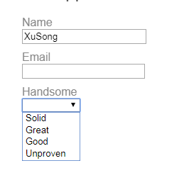

#Day22
##五、动态表单
  这一节，就利用formGroup来动态渲染一个简单的表单，包括各种控件类型和验证规则，在这个demo里面，就使用动态表单，为正在找工作的大神们创建一个在线申请表，职业介绍所会不断更改申请流程，我要在不用修改代码的情况下，动态创建这些表单。
### 1.启动/引导
  首先创建一个名叫AppModule的NgModule，然后从@angular/forms库中引入ReactiveFormsModule模块。在main.ts中启动AppModule
**main.ts**
```typescript
import {enableProdMode} from '@angular/core';
import {platformBrowserDynamic} from '@angular/platform-browser-dynamin';
import {AppModule} from './app/app.module';//引入AppModule
import {environment} from './environments/environment';
if(environment.production){
    enableProdMode();
}
platformBrowserDynamic().bootstrapModule(AppModule);
```
**app.module.ts**
```typescript
import {BrowserModule} from '@angular/platform-browser';
import {ReactiveFormsModule} from '@angular/forms';
import {NgModule} from '@angular/core';
import { AppComponent }                 from './app.component';
import { DynamicFormComponent }         from './dynamic-form.component';
import { DynamicFormQuestionComponent } from './dynamic-form-question.component';
@NgModule({
    imports:[BrowserModule,ReactiveFormsModule],
    declarations:[
        AppComponent, DynamicFormComponent, DynamicFormQuestionComponent
    ],
    bootstrap:[AppComponent]//此bootstrap非bootstrap，在这儿是启动的意思
})
export class AppModule({
    constructor(){}
})
```
### 2.问卷问题模型
  第一步是定义一个对象模型，用来描述所有表单功能需要的场景，人物在申请流程上涉及到一个包含很多问卷问题的表单。问卷问题是最基础的对象模型。
  下面是建立的最基础的问卷问题基类，名叫QuestionBase：
**question-base.ts**
```typescript
export class QuestionBase<T>{
    value:T;
    key:string;
    label:string;
    required: boolean;
    order: number;
    controlType: string;
    constructor(options:{
         value?: T,
         key?: string,
         label?: string,
         required?: boolean,
         order?: number,
         controlType?: string
    }={}){
        this.value = options.value;
        this.key = options.key || '';
        this.label = options.label || '';
        this.required = !!options.required;
        this.order = options.order === undefined ? 1 : options.order;
        this.controlType = options.controlType || '';
    }
}
```
  在这个基础上，派生出了两个新类extboxQuestion 和 DropdownQuestion，分别代表文本框和下拉框。这么做是为了表单能动态绑定到特定的问卷问题类型，并动态渲染出合适的控件。
  TextboxQuestion可以通过type属性来支持多种HTML5元素类型，比如文本、邮件、网址等。
**question-textbox.ts**
```typescript
import {QuestionBase} from './question-base';
export class TextboxQuestion extends QuestionBase<string> {
  controlType = 'textbox';
  type: string;
  constructor(options: {} = {}) {
    super(options);
    this.type = options['type'] || '';
  }
}
```
  DropdownQuestion表示一个带可选项列表的选择框。
**question-dropdown.ts**
```typescript
import { QuestionBase } from './question-base';
export class DropdownQuestion extends QuestionBase<string> {
  controlType = 'dropdown';
  options: {key: string, value: string}[] = [];
  constructor(options: {} = {}) {
    super(options);
    this.options = options['options'] || [];
  }
}
```
  然后，定义了QuestionControlService，一个可以把问卷问题转换为FormGroup的服务，简而言之，这个FormGroup使用问卷模型的元数据，并允许我设置默认值个和验证规则：
**question-control.service.ts**
```typescript
import {Injectable} from '@angular/core';
import {FormControl,FormGroup,Validators} from "@angular/froms";
import {QuestionBase} from './question-base';
@Injectable()
export class QuestionControlService{
    constructor(){}
    toFormGroup(questions:QuestionsBase<any>[]){
        let group:any={};
        questions.forEach(question => {
            group[question.key] = question.required ? 
            new FormControl(question.value || '',Validators.required) : 
            new FormGroup(question.value || '');
        });
        return new FormGroup(group);
    }
}
```
### 3.问卷表单组件
  现在有了一个定义好的完整模型了，然后就可以创建一个展现动态表单的组件：
  DynamicFormComponent是表单的主要容器和入口：
**daynamic-form.component.ts**
```typescript
import {Component,Input,OnInit} from '@angular/core';
import {FormGroup} from '@angular/forms';
import {QuestionBase} from './question-base';
import {QuestionControlService} from './question-control.service';
@Component({
    selector:'app-dynamic-form',
    templateUrl:'./dynamic-form.component.html',
    providers:[QuestionControlService]//切记切记
})
export class DynamicFormComponent implements OnInit{
    @Input() questions:QuestionBase<any>[] =[];
    form:FormGroup;
    payLoad = '';
    constructor(private qcService:QuestionControlService){}
    ngOnInit() {
        this.form = this.qcService.toFormGroup(this.questions);
    }
    onSubmit(){
        this.payLoad = JSON.stringify(this.form.value);
    }
}
```
**dynamic-form.component.html**
```html
<div>
  <form (ngSubmit)="onSubmit()" [formGroup]="form">
    <div *ngFor="let question of questions" class="form-row">
      <app-question [question]="question" [form]="form"></app-question>
    </div>
    <div class="form-row">
      <button type="submit" [disabled]="!form.valid">Save</button>
    </div>
  </form>
  <div *ngIf="payLoad" class="form-row">
    <strong>保存下来的值：</strong><br>{{payLoad}}
  </div>
</div>
```
  它代表了问卷问题列表，每个问题都被绑定到一个<app-question>组件元素，<app-question>标签匹配到的是组件DynamicFormQuestionComponent，该组件的职责是根据各个问卷问题对象的值来动态渲染表单组件：
**dynamic-form-question.component.ts**
```typescript
import {Component,Input} from '@angular/core';
import {FormGroup} from '@angular/forms';
import {QuestionBase} from './question-base';
@Component({
  selector: 'app-question',
  templateUrl: './dynamic-form-question.component.html'
})
export class DynamicFormQuestionComponent{
    @Input() question:QuestionBase<any>;
    @Input() form:FormGroup;
    get isValid(){
        return this.form.controls[this.question.key].valid;
    }
}
```
**dynamic-form-question.component.html**
```html
<div [formGroup]="form">
  <label [attr.for]="question.key">{{question.label}}</label>
  <div [ngSwitch]="question.controlType">
    <input *ngSwitchCase="'textbox'" [formControlName]='question.key' [id]="question.key" [type]="question.type">
    <select [id]="question.key" *ngSwitchCase="'dropdown'" [formControlName]="question.key">
      <option *ngFor="let opt of question.options" [value]="opt.key">
      	{{opt.value}}
      </option>
    </select>
  </div>
  <div class="errorMessage" *ngIf="!isValid">{{question.label}}is required</div>
</div>
```
  注意，这个组件能代表模型里的任何问题类型，目前还只有两种问题模型，但是可以添加更多的类型，所以用ngSwitch来决定显示哪种类型的问题。在这两个组件里面，所依赖的Angular的FormGroup来把模板HTML和底层控件对象连接起来，该对象从问卷问题模型里获取渲染和验证规则。formControlName和FormGroup是在ReactiveFormsModule中定义的指令，因为之前在AppModule里面导入了ReactiveFormsModule，所以在模板里面能用了。
### 4.问卷数据
  DynamicForm期望得到一个问题列表，该列表被绑定到@Input() questions属性。
  QuestionService会返回为工作申请表定义的那组问题列表，在真实的应用程序环境中，会从数据库里获得这些问题列表。关键是，现在是完全根据QuestionService返回的对象来控制人物的工作申请表，要维护这份问卷，只要简单的添加、删除、更新questions的数组就行了。
**question.service.ts**
```typescript
export class QuestionService{
    getQuestions(){
        let questions:QuestionBase<any>[] = [
            new DropdownQuestion({
                key:'handsome',
                label:'Handsome',
                options:[
                    {key: 'solid',  value: 'Solid'},
                    {key: 'great',  value: 'Great'},
                    {key: 'good',   value: 'Good'},
                    {key: 'unproven', value: 'Unproven'}
                ],
                order:3
            }),
            new TextboxQuestion({
                key:'name',
                label:'Name',
                value:'XuSong',
                required:true,
                order:1
            }),
            new TextboxQuestion({
                key:'emailAddress',
                label:'Email',
                type:'email',
                order:2
            })
        ];
        return questions.sort((a,b)=>a.order - b.order)
    }
}
```
  最后，在AppComponent里显示出表单
**app.component.ts**
```typescript
import {Component} from '@angular/core';
import {QuestionService} from './question.service';
@Component({
    selector:'app-root',
    tempalte:`
      <app-dynamic-form [questions]="questions"></app-dynamic-form>
    `,
    providers:[QuestionService]
})
export class AppComponent{
    question:any[];
    constructor(private service:QuestionService){
        this.questions = service.getQuestions()
    }
}
```
### 5.动态模板
  在这个demo里面，虽然只是在为人物的工作申请表建模，但是除了QuestionService返回的那些对象外，没有其它任何地方是与人物有关的，这点很重要，因为只要与问卷对象模型兼容，就可以在任何类型的的调查问卷中复用这些组件。这里的关键是用到元数据的动态数据绑定来渲染表单，对问卷问题没有任何的硬性假设，除控件的元数据外，还可以动态添加验证规则。表单验证通过之前，保存按钮是禁止的，验证通过后就可以点击保存按钮，程序会把当前值渲染成JSON显示出来，这就表明任何用户的输入都被传到了数据模型里。
  最后，表单长这样：


#第四章 - Observables 和 RxJS
##一、Observables
  观察对象支持在应用程序中的发布者和订阅者之间传递消息，与其它技术相比，Observable提供的优势在于事件处理、异步编程和处理多个值。可观察对象是声明式的，也就是说，我定义一个用于发布值的函数，但是直到用户订阅它才会执行。订阅的用户接收通知直到函数完成，或者用户取消订阅。
  根据上下文，observable可以传递任何类型文字，消息或事件的多个值。无论这些值是同步传递还是异步传递，用于接收值的API都是相同的。由于setup和teardown逻辑都是由observable处理的，因此我的应用程序代码只需要担心订阅消费值，并且在完成时取消订阅。无论流是键击，HTTP响应还是间隔定时器，用于侦听值并停止侦听的接口都是相同的。
### 1.基本用法和项目条款
  作为发布者，我创建了一个Observable定义订阅者函数的实例。这是用户调用该subscribe()方法时执行的功能。订阅者函数定义了如何获取或生成要发布的值或消息。
  为了执行我创建的observable并开始接收通知，需要调用它的subscribe()方法，传递一个观察者。这是一个JavaScript对象，它为接收到的通知定义处理程序。该subscribe()调用返回一个Subscription对象，该对象具有一个unsubscribe()您调用的用于停止接收通知的方法。
  下面来个demo，通过使用observable来提供地理位置更新：
```typescript
// 当用户订阅的时候创建一个监听地理位置更新的observable
const locations = new Observable((observer) => {
  // 用户订阅以后获得一个错误回调
  const {next, error} = observer;
  let watchId;
  // 精简的地理定位，API检查提供发布的值
  if ('geolocation' in navigator) {
    watchId = navigator.geolocation.watchPosition(next, error);
  } else {
    error('Geolocation not available');
  }
  // 当用户取消订阅的时候，清理掉原来的数据准备下一次的订阅
  return {unsubscribe() { navigator.geolocation.clearWatch(watchId); }};
});
// 回调subscribe()开始监听更新
const locationsSubscription = locations.subscribe({
  next(position) { console.log('当前位置: ', position); },
  error(msg) { console.log('定位错误: ', msg); }
});

// 10s以后停止监听定位
setTimeout(() => { locationsSubscription.unsubscribe(); }, 10000);
```
### 2.定义观察员
  接收可观察通知的处理程序实现Observer接口。它是一个定义回调方法来处理observable可以发送的三种类型的通知的对象：
  通知类型 | 描述
  -- | --
  next | 必须 ， 每个交付价值的处理程序。执行开始后调用零次或多次。
  error | 	可选的。处理错误通知的处理程序。错误会暂停可观察实例的执行。
  complete | 可选的。执行完成通知的处理程序。延迟值可以在执行完成后继续传递到下一个处理程序。
  观察者对象可以定义这些处理程序的任意组合。如果我没有为通知类型提供处理程序，那么观察者将忽略该类型的通知。
### 3.订阅
  Observable只有当某人订阅它时，一个实例才会开始发布值。我通过调用subscribe()实例的方法来订阅，传递观察者对象以接收通知。
```txt
  为了展示订阅的工作方式，需要创建一个新的可观察对象。有一个构造函数用于创建新的实例，但为了说明，我们可以在Observable类上使用一些静态方法来创建常用类型的简单可观察性：
  Observable.of(...items)返回一个Observable同步传递提供的值作为参数的实例。
  Observable.from(iterable)- 将其论点转化为一个Observable实例。此方法通常用于将数组转换为可观察对象。
```
  下面是创建和订阅简单观察者的示例，其中有一个将接收到的消息记录到控制台的观察者：
```typescript
// 创建一个简单发出三个值的observable
const myObservable = Observable.of(1,2,3);
//创建observer对象
const myObserver ={
	next: x => console.log('Observer 拿到值: ' + x),
    error: err => console.error('Observer 有个错误: ' + err),
    complete: () => console.log('Observer 结束'),
}
//用观察者对象执行
myObservable.subscribe(myObserver);
/*
最后的输出长这样：
Observer 拿到值：1
Observer 拿到值：2
Observer 拿到值：3
Observer 结束
*/
```
  或者，该subscribe()方法可以接受线回调函数定义，用于next，error和complete处理程序。例如，以下subscribe()调用与指定预定义观察者的调用相同：
```typescript
const myObserver ={
	x => console.log('Observer 拿到值: ' + x),
    err => console.error('Observer 有个错误: ' + err),
    () => console.log('Observer 结束'),
}
```
  无论哪种情况，next都需要一个处理程序。该error和complete处理程序是可选的。请注意next()，根据上下文，函数可以接收消息字符串或事件对象，数值或结构体。作为一个通用术语，我们将由观察者发布的数据称为流。任何类型的值都可以用可观察值来表示，并将值作为流发布。
### 3.创建Observables
  使用Observable构造函数创建任何类型的可观察流。构造函数将observable的subscribe()方法执行时的用户函数作为参数。订阅者函数接收一个Observer对象，并可以将值发布给观察者的next()方法。比如，要创建一个与Observable.of(1, 2, 3)上面相同的可观察对象，可以这样做：
```typescript
//当subscribe()被调用的时候运行该函数
function sequenceSubscribe(observer){
    //同步输出1,2,3，然后结束
    observer.next(1);
    observer.next(2);
    observer.next(3);
    observer.complete();
    //取消订阅的函数不需要了，因为是同步的，一下子就全都执行了
    return {unsubscribe() {}};
    //创建一个将提供上述顺序的新Observable
    const sequence = new Observable(sequenceSubscriber);
    //执行Observable并打印每个通知的结果
    sequence.subscribe({
  		next(num) { console.log(num); },
  		complete() { console.log('sequence 结束'); }
	});
	/*打印出来这样
	1，
	2，
	3，
	sequence 结束
	*/
}
```
  为了进一步说明这个例子，可以创建一个发布事件的可观察事件。在这个例子中，用户功能是内联定义的。
```typescript
function fromEvent(target, eventName) {
  return new Observable((observer) => {
    const handler = (e) => observer.next(e);
    // 为target添加事件处理
    target.addEventListener(eventName, handler);
    return () => {
      // 从target中分离事件处理程序
      target.removeEventListener(eventName, handler);
    };
  });
}
```
  现在就可以使用这个函数来创建一个发布keydown事件的observable：
```typescript
const ESC_KEY = 32;
const nameInput = document.getElementById('name') as HTMLInputElement;
const subscription = fromEvent(nameInput, 'keydown')
  .subscribe((e: KeyboardEvent) => {
    if (e.keyCode === ESC_KEY) {
      nameInput.value = '';
    }
  });
```
### 4.Multicasting(多播？！)
  一个典型的observable为每个订阅的观察者创建一个新的独立执行。当一个观察者订阅时，可观察的电线连接一个事件处理程序并将值传递给该观察者。当第二个观察者订阅时，观察者然后连接一个新的事件处理程序，并在单独的执行中向第二个观察者传递值。有时候，我不希望每个订阅者都开始独立执行，而是希望每个订阅都获得相同的值 - 即使值已经开始发布。可能出现类似于文档对象点击的情况。
  Multicasting是在一次执行中向多个用户列表广播的做法。使用Multicasting可观察性，就不用在文档上注册多个侦听器，而是重新使用第一个侦听器并将值发送给每个订阅者。当创建一个observable时，就应该确定我希望如何使用observable以及你是否想多点传送它的值。
  看一个从1到3的例子，每个数字发射后有一秒的延迟：
```typescript
function sequenceSubscriber(observer) {
  const seq = [1, 2, 3];
  let timeoutId;
  // 运行一组数字，每秒发出一个值，直到到达数组的末尾
  function doSequence(arr, idx) {
    timeoutId = setTimeout(() => {
      observer.next(arr[idx]);
      if (idx === arr.length - 1) {
        observer.complete();
      } else {
        doSequence(arr, idx++);
      }
    }, 1000);
  }
  doSequence(seq, 0);
  // 取消订阅应清除定时器
  return {unsubscribe() {
    clearTimeout(timeoutId);
  }};
}

// 创建一个能提供上面顺序的新的Observable
const sequence = new Observable(sequenceSubscriber);
sequence.subscribe({
  next(num) { console.log(num); },
  complete() { console.log('sequence 结束'); }
});

/*输出
(1s 的时候): 1
(2s 的时候): 2
(3s 的时候): 3
(3s 的时候): sequence 结束
*/
```
  注意，如果我订阅了两次，就会有两个单独的流，每个流每秒都会传一个值，长这样：
```typescript
// 订阅开始，1s后发出值
sequence.subscribe({
  next(num) { console.log('1st subscribe: ' + num); },
  complete() { console.log('1st sequence finished.'); }
});

// 1/2s后，再次订阅
setTimeout(() => {
  sequence.subscribe({
    next(num) { console.log('2nd subscribe: ' + num); },
    complete() { console.log('2nd sequence finished.'); }
  });
}, 500);

/*输出
(at 1 second): 1st subscribe: 1
(at 1.5 seconds): 2nd subscribe: 1
(at 2 seconds): 1st subscribe: 2
(at 2.5 seconds): 2nd subscribe: 2
(at 3 seconds): 1st subscribe: 3
(at 3 seconds): 1st sequence finished
(at 3.5 seconds): 2nd subscribe: 3
(at 3.5 seconds): 2nd sequence finished
*/
```
  将观察值更改为Multicasting可能如下所示：
```typescript
//创建一个组播用户
function multicastSequenceSubcriber(){
    const seq=[1,2,3];
    //跟踪每个观察者，用于每个有效的订阅
    const observer = [];
    // 仍然只是一个timeoutId，因为只会生成一组值，并且每个订阅者都是组播的
    let timeoutId
    //返回一个订阅者函数，当subscribe()函数被调用的时候调用
    return (obsrever) => {
        obsersers.push(observer);
        //当这是第一次订阅是，开始序列
        if(observers.length === 1){
            timeoutId = doSequence({
                next(val){
                    //遍历观察者并通知所有订阅
                }
            })
        }
    }
}
```


