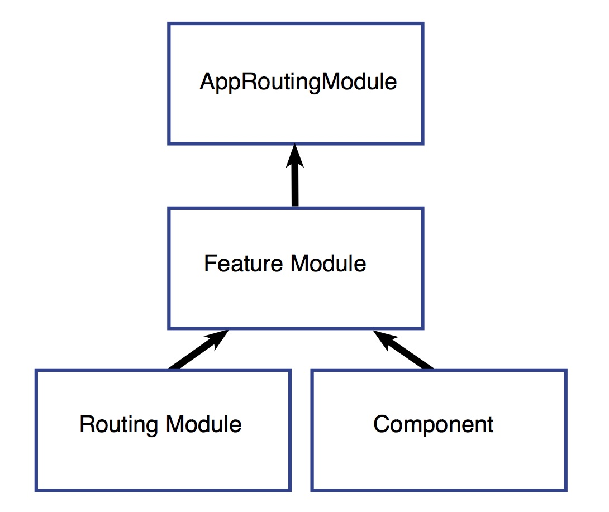

#Day27
##九、惰性加载的特性模块
  要建立一个惰性加载的特性模块，有三个主要步骤：
  - 创建该特性模块
  - 创建该特性模块的路由模块
  - 配置相关路由
### 1.建立应用
  直接用AngularCLI创建：
```txt
ng new my-app -routing
```
  这就创建一个叫my-app的应用了，而--routing标识生成了一个名叫app-routing.module.ts的文件，它是建立惰性加载的特性模块时所必须的。然后cd my-app进入该项目。
### 2.创建一个带路由的特性模块
  接下来，就需要一个创建一个带路由的特性模块，用AngularCLI生成就行
```txt
ng generate module anyname --routing
```
  这会创建一个anyname的目录，其中有两个文件：AnynameModule和AnynameRoutingModule。AnynameModule扮演的是与客户端紧密相关的所有事物的管理员，AnynameRoutingModule则会处理任何与客户有关的路由，这样就可以在应用不断成长时保持应用的良好结构，并且当复用本模板时，可以保持路由完好。CLI会把AnynameRoutingModule自动导入到AnynameModule，它会在文件的顶部添加一条JavaScript的imports语句，并把AnynameRoutingModule添加到@NgModule的imports数组中。
### 3.向特性模块中添加组件
  要想在浏览器中看出该模块惰性加载成功了，就创建一个组件来在应用加载AnynameModule之后渲染出一些HTML，命令如下：
```txt
ng generate component person/person-list
```
  这就在person目录里面创建一个person-list的文件夹，里面包含了该组件的四个文件，就像路由模块一样，CLI也自动把PersonListComponent导入了AnynameModule。
### 4.再添加一个特性模块
  为了提供另一个可路由到的地点，再创建第二个带路由的特性模块：
```txt
ng generate module orders --routing
```
  这就创建了一个名叫orders的新文件夹，其中包含OrdersModule和OrdersRoutingModule。然后添加组件（简写CLI）：
```txt
ng g c order/order-list
```
### 5.建立UI
  虽然在地址栏输入URL可以跳转，但是这不是人干的（这是猿干的），所以就弄导航栏菜单会更好一点。所以在app.component.html里面，增加一些代码：
```html
<h1> {{title}} </h1
<button routerLink="/anyname">Anyname</button>
<button routerLink="/orders">Orders</button>
<button routerLink="">Home</button>
<router-outlet></router-outlet>
```
  然后输入那ng serve 启动开发服务器，就能看到现在的样子了。 自己建的那两个模块，得让路由知道它们，结构长这样：

  每个特性模块都是路由器中的一个“门口”，在AppRoutingModule中，我配置了一些路由指向这些特性模块，通过这种方式，路由器就知道了如何跳转到特性模块，然后特性模块就把AppRoutingModule和AnynameRoutingModule或OrdersRoutingModule连接在一起。这些路由模块会告诉路由器该到哪里去加载相应的组件。
#### 5.1 顶层的路由
  在AppRoutingModule中，把routes数组改成这样：
```typescript
const routes: Routes = [ 
{
  path: 'anyname',loadChildren: 'app/anynam.module#AnynameModule',
},
{
  path: 'order',loadChildren: 'app/order/order.module#OrderModule'
},
{
  path:'',redirectTo:'',pathMatch:'full'
}
]
```
  这些imports语句没有变化，前两个路径分别路由到了AnynameModule和OrderModule，注意看惰性模块加载的语法，loadChildren后面紧跟着一个字符串，它指向模块路径，然后是一个#，然后是该模块的类名。
#### 5.2 特性模块的内部
  然后看看anyname.module.ts，如果使用的是CLI，并按照上面的步骤来的，那么下面就没必要做什么更改，特性模块就像是AppRoutingModule和该特性自己的路由模块之间的连接器，AppRoutingModule导入了特性模块AnynameModule，而AnynameModule又导入了AnynameRoutingModule。
**anyname.module.ts**
```typescript
import { NgModule } from '@angular/core';
import { CommonModule } from '@angular/common';
import { AnynameRoutingModule } from './anyname-routing.module';
import { PersonListComponent } from './person-list/customer-list.component';

@NgModule({
  imports: [
    CommonModule,
    AnynameRoutingModule
  ],
  declarations: [PersonListComponent]
})
export class AnynameModule { }
```
  anyname.module.ts文件导入了AnynameRoutingModule和PersonListComponent，所以AnynameModule类可以访问它们。然后AnynameRoutingModule又在imports数组里面，这让AnynameModule可以访问它的路由模块，而PersonListComponent出现在declarations数组里面，这表示PersonListComponent属于AnynameModule。
#### 5.3 配置该特性模块的路由
  接下来的步骤位于 anyname-routing.module.ts 中。首先，在文件的顶部使用 JS 的 import 语句导入该组件。然后添加指向 PersonListComponent 的路由。
```typescript
import { NgModule } from '@angular/core';
import { Routes, RouterModule } from '@angular/router';
import { PersonListComponent } from './customer-list/person-list.component';
const routes: Routes = [
  {
    path: '',
    component: PersonListComponent
  }
];

@NgModule({
  imports: [RouterModule.forChild(routes)],
  exports: [RouterModule]
})
export class AnynameRoutingModule { }
```
  注意，path 被设置成了空字符串。这是因为 AppRoutingModule 中的路径已经设置为了 anyname，所以 AnynameRoutingModule 中的这个路由定义已经位于 anyname 这个上下文中了。也就是说这个路由模块中的每个路由其实都是子路由。
  然后像刚刚那样把OrderListComponent也导入进来就行啦。
### 6.forRoot() 与 forChild()
  在前面可以看到，CLI会把RoutingModule.forRoot(routes)添加到app-routing.module.ts的imports数组里面。这回让Angular知道，AppRoutingModule是一个路由模块，而forRoot表示这是一个根路由模块。它会配置我传入的所有路由、让我能访问路由器指令并注册RouterService。forRoot只能在AppRoutingModule里面用，只能用一次。
  CLI 还会把 RouterModule.forChild(routes) 添加到各个特性模块中。这种方式下 Angular 就会知道这个路由列表只负责提供额外的路由并且其设计意图是作为特性模块使用。forChild可以在多个模块中使用。
  forRoot() 包含的注入器配置是全局性的，比如对路由器的配置。forChild() 中没有注入器配置，只有像 RouterOutlet 和 RouterLink 这样的指令。


