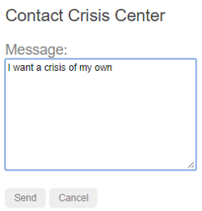

# Day39 核心知识-路由与导航
## 一、概览
 浏览器具有熟悉的导航模式：
 - 在地址栏输入URL，浏览器就会导航到响应的页面
 - 在页面中点击链接，浏览器就会导航到一个新的页面
 - 点击浏览器的前进和后退按钮，浏览器就会在我的浏览历史中向前或向后导航
    Angular的Router借鉴了这个模型，他把浏览器中的URL看做一个操作指南，据此导航到一个客户端生成的视图，并可以把参数传给支撑视图的相应组件，帮它决定具体该展现哪些内容。我可以为页面中的链接绑定一个路由，这样，当用户点击链接时，就会导航到应用中相应的视图。当用户点击按钮、从下拉框中选取，或响应来自任何地方的事件时，我也可以在代码控制下进行导航。路由器还在浏览器的历史日志中记录下这些活动，这样浏览器的前进和后退按钮也能照常工作。
## 二、基础知识
### 1.<base href> 元素
  大多数带路由的应用都要在index.html的<head>标签下先添加一个<base>元素，来告诉路由器该如何合成导航用的URL。如果app文件夹是该应用的根目录，那就把href的值设置为这样：
```html
<base href='/'>
```
### 2.从路由库中导入
  Angular的路由器是一个可选的服务，它用来呈现指定的URL所对应的视图。它并不是Angular核心库的一部分，而是在它自己的@angular/router包中，像其它Angular包一样，我可以从它导入所需的一切：
```typescript
import {RouterModule,Routes} from '@angular/router'
```
### 3.配置
  ，每个带路由的Angular应用都有一个Router服务的单例对象。当浏览器的URL变化时，路由器会查找对应的Route，并据此决定该显示哪个组件。
  路由器需要先配置才会有路由信息。下面的例子创建了四个路由定义，并用RouterModule.forRoot方法来配置路由器，并把它的返回值添加到AppModule的imports数组中：
```typescript
const appRoutes:Routes=[
    {path: 'crisis-center', component: CrisisListComponent},
    {path: 'person/:id', component: PersonDetailCompoennt},
    {path: 'persons': component:PersonListComponent,data: {title:'Persons List'}},
    {path: '',redirectTo:'/persons',pathMatchL'full'},
    {path: '**', component: PageNotFoundComponet}
];
@NgModule({
    imports:[
        RouterModule.forRoot(
          appRoutes,
          {enableTracing:true}// 仅调试用
        )
        //其它引入接着往后放就行
    ],
    ...
})
export class AppModule{}
```
  这里的路由数组appRoutes描述如何进行导航。把它传给RouterModule.forRoot方法并传给本模块的imports数组就可以配置路由器。每个Route都会把一个URL的path映射到一个组件。注意，path不能以 / 开头。路由器会为加息和构建最终的URL，这样当我的应用在多个视图之间导航时，可以任意使用相对路径和绝对路径。
  第二个路由中的:id是一个路由参数的token，比如/person/01这个URL中，01就是id参数的值，此URL对应的PersonDetailComponent组件将据此查找和展现id为42的人物。第三个路由中的data属性用来存放每个具体路由有关的任意信息。该数据可以被任何一个激活路由与访问，并能用来保存诸如页标题、面包屑以及其它静态只读数据。第四个个路由中的空路径表示应用的默认路径，当URL为空时就会访问那里，因此它通常会作为起点。这个默认路由会重定向到URL/persons，并显示PersonsListComponent。最后一个路由中的\*\*路径是一个通配符。当所请求的URL不匹配前面定义的路由表中的任何路径时，路由器就会选择此路由。这个特性可以用于显示404-not found 页，或自动重定向到其它路由。
  这些路由的定义顺序是刻意如此设计的。路由器使用先匹配者优先的策略来匹配路由，所以具体路由应该放在通用路由的前面。在上面的配置中，带静态路径的路由被放在了前面，后面是空路径路由，因此它会作为默认路由，而通配符路由被放在最后面，这是因为它能匹配上每一个URL，因此应该只有在前面找不到其它能匹配的路由时才匹配它。
  如果想要看到在导航的生命周期中发生过哪些事件，可以使用路由器默认配置中的enableTracing选项。它会把每个导航生命周期中的事件输出到浏览器的控制台，这应该只用于调试。我只需要把enableTracing:true选项作为第二个参数传给RouterModule.forRoot()方法就可以了。
### 4.路由出口
  有了这份配置，当本应用在浏览器中的URL变为/persons时，路由器就会匹配到path为persons的Route，并在宿主视图中的RouterOutlet之后显示PersonListComponent组件：
```html
<router-outlet></router-outlet>
<!--有这个容器，来放置组件-->
```
### 5.路由器链接
  现在我已经有了配置好的一些路由，还找到了渲染的地方，那应该如何导航过去。猿类直接从地址栏输入URL就行，但是大多数情况下，导航是某些用户操作的结果，比如点击了一个A标签：
```typescript
template:`
	<nav>
		<a routerLink="/crisis-center" routerLinkActive="active">Crisis Center</a>
		<a routerLink="/persons" routerLinkActive="active">Perons</a>
	</nav>
	<router-outlet></router-outlet>
`
```
  a标签上的RouterLink指令让路由器得以控制这个a元素，这里的导航路径是固定的，因此可以把一个字符串赋给routerLink。如果需要更加动态的导航路径，那就把它绑定到一个返回链接参数数组的模板表达式。路由器会把这个数组解析成完整的URL。每个a标签上的RouterLinkActivate指令可以帮用户在外观上区分出当前选中的 活动 路由，当与它关联的RouterLink被激活时，路由器会把css类active添加到这个元素上。我可以把该指令添加到a元素或它的父元素上。
### 6.路由器状态
  在导航时每个生命周期成功完成时，路由器会构建出一个ActivatedRoute组成的树，它表示路由器的当前状态。我可以在应用中的任何地方用Router服务及其routesState属性来访问当前的RouterState值。
  RouterState中的每个ActivateRoute都提供了从任意激活路由开始向上或者向下遍历路由树的一种方式，以获得关于父、子、兄弟路由的信息。
### 7.激活的路由
  该路由的路径和参数可以通过注入进来的一个名叫ActivatedRoute的路由服务来获取。它有一大堆信息，包括：
属性 | 说明
-- | --
url | 路由路径的Observable对象，是一个由路由路径中的各个部分组成的字符串数组
data | 一个Observable，其中包含提供给路由的data对象，也包含由解析守卫解析而来的值
paramMap | 一个Observable，其中包含一个由当前路由的必要参数和可选参数组成的map对象。用这个map可以获取来自同名参数的单一值或多重值
queryParamMap | 一个Observable，其中包含一个对所有路由都有效的查询参数组成的map对象，用这个map可以获取来自查询参数的单一值或多重值
fragment | 一个适用于所有路由的URL的fragment的Observable
outlet | 要把该路由渲染到的RouterOutlet的名字，对于无名路由，它的路由名是primary，而不是空串
routeConfig | 用于该路由的路由配置信息，其中包含原始路径
parent | 当该路由是一个子路由时，表示该路由的父级ActivatedRoute
firstChild | 包含该路由的子路由列表中的第一个ActivatedRoute
children | 包含当前路由下所有已激活的子路由
  有两个旧式属性仍然是有效的，但它们不如其替代品那样强力，建议不再使用，将来也有可能被废弃：
  - params -- 一个Observable对象，其中包含当前路由的必要参数和可选参数，改用paramMap
  - queryParams --一个Observable对象，其中包含对所有路由都有效的查询参数，改用queryParamMap
### 8.路由事件
  在每次导航中，Router都会通过Router.events属性发布一些导航事件。这些事件的范围涵盖了从开始导航到结束导航之间的很多时间点。下表中列出了全部导航事件：
路由器事件 | 说明
-- | --
NavigationStart | 本事件会在导航开始时触发
RoutesRecognized | 本事件会在路由器解析完URL，并识别出了响应的路由时触发
RouteConfigLoadStart | 本事件会在Router对一个路由配置进行惰性加载之前触发
RouteConfigLoadEnd | 本事件会在路由被惰性加载之后触发
NavigationEnd | 本事件会在导航成功结束之后触发
NavigationCancel | 本事件会在导航被取消之后触发，这可能是因为在导航期间某个路由守卫返回了false
NavigationError | 这个事件会在导航由于意料之外的错误而失败时触发
  当打开了enableTracing选项时，这些事件也同时会记录到控制台中，由于这些事件是以Observable的形式提供的，所以我可以对自己感兴趣的事件进行filter()，并subscribe()它们，以便根据导航过程中的事假顺序做出决策。
### 9.总结一下
  该应用有一个配置过的路由器，外壳组件中有一个RouterOutlet，它能显示路由器所生成的视图。他还有一些RouterLink，用户可以点击，来通过路由器进行导航。下面是一些路由器中的关键词汇及其含义
路由器部件 | 含义
-- | --
Router | 为激活的URL显示应用组件，管理从一个组件到另一个组件的导航
RouterModule | 一个独立的Angular模块，用于提供所需的服务提供商，以及用来在应用视图之间进行导航的指令
Routes（路由数组） | 定义了一个路由数组，每一个都会把一个URL路由映射到一个组件
Route（路由） | 定义路由器该如何根据URL模式来导航到组件。大多数路由都是由路径和组件类构成
RouterOutlet（路由出口） | 该指令用来标记出路由器应该在哪里显示视图
RouterLink（路由链接） | 这个指令把可点击的HTML元素绑定到某个路由，点击带有routerLink指令（绑定到字符串或链接参数数组）的元素时就会触发一次导航
RouterLinkActive（活动路由链接） | 当 HTML 元素上或元素内的routerLink变为激活或非激活状态时，该指令为这个 HTML 元素添加或移除 CSS 类。
ActivatedRoute（激活的路由） | 为每个路由组件提供提供的一个服务，它包含特定于路由的信息，比如路由参数、静态数据、解析数据、全局查询参数和全局碎片（fragment）。
RouterState（路由器状态） | 路由器的当前状态包含了一棵由程序中激活的路由构成的树。它包含一些用于遍历路由树的快捷方法。
链接参数数组  | 这个数组会被路由器解释成一个路由操作指南。你可以把一个RouterLink绑定到该数组，或者把它作为参数传给Router.navigate方法。
路由组件  | 一个带有RouterOutlet的 Angular 组件，它根据路由器的导航来显示相应的视图。
## 三、范例应用
  现在要说的是如何开发一个带路由的多页面应用。接下来重点说它的设计决策，并描述路由的关键特性，如果：
  - 把应用的各个特性组织成模块
  - 导航到组件（Persons链接到 人物列表 组件）
  - 包含一个路由参数（当路由到 人物详情 时，把该英雄的id传进去
  - 子路由（危机中心特性有一组自己的路由）
  - CanActivate守卫（检查路由的访问权限）
  - CanActivateChild守卫（检查子路由的访问权限）
  - CanDeactivate守卫（询问是否丢弃为保存的更改）
  - Resolve守卫（预先获取路由数据）
  - 惰性加载特性模块
  - CanLoad守卫（在加载特性模块之前进行检查）
## 四、从路由器开始
### 1.设置<base href>
  路由器使用浏览器的history.pushState进行导航。有了pushState，就能按所期望的样子来显示应用内部的URL路径，虽然我使用的全部是客户端合成的视图，但应用内部的这些URL看起来和来自服务器的没什么不同。
  必须往本应用的index.html添加一个<base href>元素，这样pushState才能正常工作。当引用CSS文件、脚本和图片时，浏览器会用<base href>的值作为相对URL的前缀。把<base>元素添加到<head>元素中。如果app目录是应用的根目录，对于本应用，可以像这样设置index.html中的href值：
```html
<base href="/">
```
### 2.从路由库中导入
  先从路由库导入一些符号，路由器在它自己的@angular/router包中。它不是Angular内核的一部分，该路由器是可选的服务，这是因为并不是所有应用都需要路由，并且，如果需要还可能需要另外的路由库。
  通过一些路由来配置路由器，可以教路由器如何进行导航
#### 2.1 定义路由
  路由器必须用路由定义的列表进行配置。第一个配置中定义了由两个路由构成的数组，它们分别通过path导航到了CrisisListComponent 和 PersonListComponent 组件。
  每个定义都被翻译成了一个Route对象。该对象有一个path字段，表示该路由中的URL路径部分，和一个component字段，表示与该路由相关联的组件。当浏览器的URL变化时或在代码中告诉路由器导航到一个路径时，路由器就会翻出它用来保存这些路由定义的注册表。
  直白的说，可以这样解释第一个路由：
  - 当浏览器地址栏的URL变化时，如果它匹配上了路径部分/cirisis-center，路由器就会激活一个CrisisListComponent的实例，并显示它的视图
  - 当应用程序请求导航到路径/crisis-center时，路由器激活一个CrisisListComponent实例，显示它的视图，并将该路径更新到浏览器地址栏和历史。
    下面是第一个配置，把路由数组传递到RouterModule.forRoot方法，该方法返回一个包含已配置的Router服务提供商模块和一些其它路由包需要的服务提供商。应用启动时，Router将在当前浏览器URL的基础上进行初始导航：
```typescript
import { NgModule } from '@angular/core';
import { BrowserModule } from '@angular/platform-browser';
import { FormsModule } from '@angular/forms';
import { RouterModule, Routes } from '@angular/router';

import { AppComponent }          from './app.component';
import { CrisisListComponent }   from './crisis-list.component';
import { PersonListComponent }     from './person-list.component';

const appRoutes: Routes = [
  { path: 'crisis-center', component: CrisisListComponent },
  { path: 'persons', component: PersonListComponent },
];

@NgModule({
  imports: [
    BrowserModule,
    FormsModule,
    RouterModule.forRoot(
      appRoutes,
      { enableTracing: true } // 调试用
    )
  ],
  declarations: [
    AppComponent,
    PersonListComponent,
    CrisisListComponent,
  ],
  bootstrap: [ AppComponent ]
})
export class AppModule { }
```
  在AppModule中提供RouterModule，让该路由器在应用的任何地方都能被使用。作为简单的路由配置，将添加配置好的RouterModule到AppModule中就足够了。随着应用的成长，需要将路由配置重构到单独的文件，并创建路由模块。
### 3.AppComponent外壳组件
  根组件AppComponent是本应用的外壳。它在顶部有一个标题、一个带两个链接的导航条，在底部有一个路由器出口，路由器会在它所指定的位置上把视图切入或调出页面。
  该组件所对应的模板是这样的：
```typescript
template: `
  <h1>Angular Router</h1>
  <nav>
    <a routerLink="/crisis-center" routerLinkActive="active">Crisis Center</a>
    <a routerLink="/persons" routerLinkActive="active">Persons</a>
  </nav>
  <router-outlet></router-outlet>
`
```
### 4.路由出口
  RouterOutlet是一个来自路由库的组件，路由器会在<router-outlet>标签中显示视图。(路由器会把router-outlet元素添加到了DOM中，紧接着立即在这个之后插入导航到的视图元素)
### 5.routerLink绑定
  每个A标签还有一个到RouterLinkActive指令的属性绑定，就像routerLinkActive="..."。等号右边的模板表达式包含用空格分割的一些CSS类。当路由激活时路由器就会把它们添加到此链接上（反之则移除）。还可以把RouterLinkActive指令绑定到一个CSS类组成的数组，如果[routerLinkActive]="['....']"。
  RouterLinkActive指令会基于当前的RouterState对象来为激活的ROuterLink切换CSS类。这会一直沿着路由树往下进行级联处理，所以父路由链接和子路由链接可能会同时激活。要改变这种行为，可以把[routerLinkActiveOpttions]绑定到{exact:true}表达式，如果使用了{exact:true}，那么只有在其URL与当前URL精确匹配时才会激活指定的RouterLink。
### 6.路由器指令采集
  RouterLink、RouterLinkActivate和RouterOutlet是由RouterModule包提供的指令。现在可以把他用在模板中了。
```typescript
//app.component.ts
import (Component) from '@angular/core'
@Component({
    selector: 'app-root',
    template: `
    	 <nav>
      <a routerLink="/crisis-center" routerLinkActive="active">Crisis Center</a>
      <a routerLink="/persons" routerLinkActive="active">Persons</a>
    </nav>
    <router-outlet></router-outlet>
    `
})
export class AppComponent{}
```
### 7.通配符路由
  之前在应用中创建过两个路由，一个是/crisis-center，另一是/persons。所有其它URL都会导致路由器抛出错误，并让应用崩溃。
  可恶意添加一个通配符来拦截所有无效的URL，并优雅的处理它们。通配符路由的path是两个星号，它会匹配任何URL。当路由器匹配不上以前定义的那些路由时，它就会选择这个路由。通配符路由可以导航到自定义的 404 notfound这种组件上去，也可以重定向到一个现有路由。
  **路由器使用先匹配者优先的策略来选择路由，通配符路由是路由配置中最没有特定性的那个，因此务必确保它是配置中的最后一个路由**
  检验这个特性，可以在PersonListComponent的模板中添加一个带有RouterLink的按钮，并且把链接设置为'/sidekinks'
```typescript
import { Component } from '@angular/core';

@Component({
  template: `
    <h2>PersonES</h2>
    <p>Get your Persones here</p>

    <button routerLink="/sidekicks">Go to sidekicks</button>
  `
})
export class PersonListComponent { }
```
  当用户点击该按钮的时候，应用就会失败，因为没有定义过sidekicks路由。不添加 /sidekicks路由，定义一个通配符路由，让它直接导航到PageNotFoundComponent组件：
```typescript
{ path: '**', component: PageNotFoundComponent }
```
  创建PageNotFoundComponent，以便在用户访问无效网址时显示它：
```typescript
import { Component } from '@angular/core';

@Component({
  template: '<h2>Page not found</h2>'
})
export class PageNotFoundComponent {}
```
  像其它组件一样，把PageNotFoundComponent添加到AppModule的声明中。现在当用户访问/sidekicks或任何无效的URL时，浏览器就会显示 Page not found了。浏览器的地址栏扔指向无效的URL。
### 8.把默认路由设置为人物列表
  应用启动的时候，浏览器地址栏中的初始URL是这样的：localhost:4200，它不能匹配上任何具体的路由，于是就会走到通配符路由中去，并且显示PageNotFoundComponent。
  这个应用需要有一个有效的默认路由，在这里用人物列表作为默认页，当用户点击Persons链接的时候，它应该就导航到列表页
### 9. 重定向路由
  首选方案是添加一个redirect路由来把最初的相对路径（' '）转换成期望的默认路径（/persons），浏览器地址栏会显示.../persons，就像直接导航到那里的一样。在通配符路由上方添加一个默认路由：
```typescript
const appRoutes: Routes = [
  { path: 'crisis-center', component: CrisisListComponent },
  { path: 'persons',        component: PersonListComponent },
  { path: '',   redirectTo: '/persons', pathMatch: 'full' },
  { path: '**', component: PageNotFoundComponent }
];
```
  重定向路由需要一个pathMatch属性，来告诉路由器如何用URL去匹配路由的路径，否则路由器就会报错。在本应用中，路由器应该是有在完整的URL等于 ' ' 的时候才选择PersonListComponent组件，因此要把pathMatch设置为‘full‘
```txt
	从技术角度说，pathMatch = 'full' 导致 URL 中剩下的、未匹配的部分必须等于 ''。 在这个例子中，跳转路由在一个顶级路由中，因此剩下的URL 和完整的URL 是一样的。
	pathMatch 的另一个可能的值是 'prefix'，它会告诉路由器：当剩下的URL 以这个跳转路由中的 prefix 值开头时，就会匹配上这个跳转路由。
	在这里不能这么做！如果 pathMatch 的值是 'prefix'，那么每个URL 都会匹配上 ''。
	尝试把它设置为 'prefix'，然后点击 Go to sidekicks 按钮。别忘了，它是一个无效 URL，本应显示“Page not found”页。 但是，你仍然在“英雄列表”页中。在地址栏中输入一个无效的 URL，你又被路由到了 /Persones。 每一个 URL，无论有效与否，都会匹配上这个路由定义。
	默认路由应该只有在整个URL 等于 '' 时才重定向到 PersonListComponent，别忘了把重定向路由设置为 pathMatch = 'full'。
```
## 五、路由模块
  在原始的路由配置中，听过了仅有两个路由的简单配置来设置应用的路由。对于简单的路由，没有问题，但是随着应用的成长，需要用到更多的路由器特性，比如守卫、解析器和子路由等，这就需要重构路由了。建议是将路由信息移到一个单独的特殊用途的模块，叫做路由模块。
  路由模块有一系列特性：
  - 把路由这个关注点从其它应用类关注点中分离出去
  - 测试特性模块时，可以替换或移除路由模块
  - 为路由服务提供商（包括守卫和解析等）提供一个共同的地方
  - 不要声明组件
### 1.将路由配置重构为路由模块
  在/app目录下创建一个名叫app-routing.module.ts的文件，以包含这个路由模块。
  导入CrisisListComponent和PersonListComponent组件，就像app.module.ts中一样，然后把Router的导入语句和路由配置以及RouterModule.forRoot移入这个路由模块中。遵循规约，添加一个AppRoutingModule类并导出它，以便稍后在AppModule中导入它。最后可以通过把它添加到该模块的exports数组中来再次导出RouterModule，通过在AppModule中导入AppRoutingModule并再次导出RouterModule，那些声明在AppModule中的组件就可以访问路由指令了，比如RouterLink和RouterOutlet。
  完事儿之后，文件就是这样的：
```typescript
import { NgModule } from '@angular/core';
import { RouterModule, Routes } from '@angular/router';
import { CrisisListComponent } from './crisis-list.component';
import { PersonListComponent } from './person-list.component';
import { PageNotFoundComponent } from './not-found.component';

const appRoutes: Routes = [
  { path: 'crisis-center', component: CrisisListComponent },
  { path: 'persons',        component: PersonListComponent },
  { path: '',   redirectTo: '/persons', pathMatch: 'full' },
  { path: '**', component: PageNotFoundComponent }
];

@NgModule({
  imports: [
    RouterModule.forRoot(
      appRoutes,
      { enableTracing: true } //仅供调试
    )
  ],
  exports: [
    RouterModule
  ]
})
export class AppRoutingModule {}
```
  接下来，修改 app.module.ts 文件，首先从 app-routing.module.ts 中导入新创建的 AppRoutingModule， 然后把 imports 数组中的 RouterModule.forRoot 替换为 AppRoutingModule。
```typescript
import { NgModule }       from '@angular/core';
import { BrowserModule }  from '@angular/platform-browser';
import { FormsModule }    from '@angular/forms';

import { AppComponent }     from './app.component';
import { AppRoutingModule } from './app-routing.module';

import { CrisisListComponent }   from './crisis-list.component';
import { PersonListComponent }     from './person-list.component';
import { PageNotFoundComponent } from './not-found.component';

@NgModule({
  imports: [
    BrowserModule,
    FormsModule,
    AppRoutingModule
  ],
  declarations: [
    AppComponent,
    PersonListComponent,
    CrisisListComponent,
    PageNotFoundComponent
  ],
  bootstrap: [ AppComponent ]
})
export class AppModule { }
```
### 2.是否需要路由模块
  路由模块在根模块或者特性模块替换了路由配置，在路由模块或者模块内部配置路由，但不要同时在两处都配置。路由模块是设计选择，它的价值在配置很复杂，并包含专门守卫和解析器服务时尤其明显。在配置很简单时，它可能就是多余的了。
  在配置很简答时，一些开发者跳过路由模块，并将路由配置直接混合在关联模块中。
  从中选择一种模式，并坚持模式的一致性。大多数开发者都应该采用路由模块，以保持一致性，它在配饰复杂时，能确保代码干净，它让测试特性模块更加容易，它的存在让人一眼就能看出这个模块是带路由的。开发者可以很自然的从路由模块中查找和扩展路由配置。
## 六、人物特征区
  知道了如何用RouterLink指令进行导航，接下来要：
  - 用模块把应用和路由组织为一些特性区
  - 命令式的从一个组件导航到另一个
  - 通过路由传递必要的信息和可选信息
    典型的应用具有多个特性区，每个特性区都专注于特定的业务用途。虽然可以把文件都放在src/app目录下，但是这并不现实，后期很难维护，大部分开发人员更喜欢把每个特性区都放在它自己的目录下。
    现在我准备把应用拆分成多个不同的特性模块，每个特有模块都有自己的关注点，然后，我就可以把它们导入到主模块中，并且在它们之间导航。
### 1.添加人物管理功能
  按照下面的步骤：
  - 创建src/app/persons文件夹
  - 在 app 目录下删除占位用的 person-list.component.ts 文件。
  - 在 src/app/persons 目录下创建新的 person-list.component.ts 文件。
  - 把部分代码复制到 app.component.ts 中。
  - 做一些微小但必要的修改：
      1.删除 selector（路由组件不需要它们）。
      2.删除 <h1>。
      3.给 <h2> 加文字，改成 <h2>PERSONS</h2>。
      4.删除模板底部的 <person-detail>。
      5.把 AppComponent 类改名为 PersonListComponent。
  - 把 person-detail.component.ts 和 person.service.ts 复制到 Persones 子目录下。
  - 在 persons 子目录下（不带路由）的 persons.module.ts 文件，内容如下：
```typescript
import { NgModule }       from '@angular/core';
import { CommonModule }   from '@angular/common';
import { FormsModule }    from '@angular/forms';

import { PersonListComponent }    from './person-list.component';
import { PersonDetailComponent }  from './person-detail.component';

import { PersonService } from './person.service';

@NgModule({
  imports: [
    CommonModule,
    FormsModule,
  ],
  declarations: [
    PersonListComponent,
    PersonDetailComponent
  ],
  providers: [ PersonService ]
})
export class PersonesModule {}
```
### 2.人物特性区的路由需求
  人物 特性有两个相互协作的组件，列表和详情。列表视图是自给自足的，我导航到它，它会自行获取人物列表并显示它们。
  详情视图就不同了，它要显示一个特定的人物，但是它本身无法知道是哪一个人，这个信息必须来自外部。
  当用户从列表中选择了一个人物时，，应用就导航到详情页去显示那个人物。通过把所选人物id编码进路由的URL中，就能告诉详情视图应该显示谁。
### 3.人物特性区路由配置
  在persons目录下创建一个新的persons-routing.module.ts文件，使用的技术和以前创建AppRoutingModule时一样：
```typescript
import { NgModule }             from '@angular/core';
import { RouterModule, Routes } from '@angular/router';

import { PersonListComponent }    from './Person-list.component';
import { PersonDetailComponent }  from './Person-detail.component';

const PersonesRoutes: Routes = [
  { path: 'persones',  component: PersonListComponent },
  { path: 'person/:id', component: PersonDetailComponent }
];

@NgModule({
  imports: [
    RouterModule.forChild(PersonesRoutes)
  ],
  exports: [
    RouterModule
  ]
})
export class PersonRoutingModule { }
```
  从新位置src/app/persons/目录中导入人物相关的组件，定义两个 人物管理 路由，并导出PersonRoutingModule类。现在有了Persons模块的路由，还得在RouterModule中把它们注册给路由器，和AppRoutingModule中的做法几乎完全一样。这里有少量但是关键的不同点。在AppRoutingModule中，使用了静态的RouterModule.forRoot方法来注册路由和完全应用级服务提供商。在特性模块中，要改用forChild方法。
```txt
	只在根模块AppRoutingModule中调用RouterModule.forRoot(如果在AppModule中注册应用的顶级路由，那就在AppModule中调用)。在其它模块中，就必须调用RouterModule.forChild方法来注册附属路由
```
### 4.把路由模块添加到PersonsModule中
  把PersonRouterModule添加到PersonModule中，就像为AppModule添加 AppRoutingModule一样。
```typescript
import { NgModule }       from '@angular/core';
import { CommonModule }   from '@angular/common';
import { FormsModule }    from '@angular/forms';

import { PersonListComponent }    from './Person-list.component';
import { PersonDetailComponent }  from './Person-detail.component';

import { PersonService } from './Person.service';

import { PersonRoutingModule } from './Persones-routing.module';

@NgModule({
  imports: [
    CommonModule,
    FormsModule,
    PersonRoutingModule
  ],
  declarations: [
    PersonListComponent,
    PersonDetailComponent
  ],
  providers: [ PersonService ]
})
export class PersonesModule {}
```
### 5.移除重复的 人物管理 路由
  人物 类的路由目前定义在两个地方：PersonsRoutingModule中（并最终给PersonsModule）和AppRoutingModule中。由特性模块提供的路由会被路由器再组合上它们所导入的模块的路由。这让我可以继续定义特性路由模块中的路由，而不是修改主路由配置。
  但是都不希望把同一个路由定义两次，那就移除PersonListComponent的导入和来自app-routing.module.ts中的/persons路由。
  保留默认路由和通配符路由。它们是应用程序顶层该自己处理的关注点：
```typescript
import { NgModule }              from '@angular/core';
import { RouterModule, Routes }  from '@angular/router';

import { CrisisListComponent }   from './crisis-list.component';
// import { PersonListComponent }  from './Person-list.component';  // <-- delete this line
import { PageNotFoundComponent } from './not-found.component';

const appRoutes: Routes = [
  { path: 'crisis-center', component: CrisisListComponent },
  // { path: 'persons',     component: PersonListComponent }, // <-- delete this line
  { path: '',   redirectTo: '/persons', pathMatch: 'full' },
  { path: '**', component: PageNotFoundComponent }
];

@NgModule({
  imports: [
    RouterModule.forRoot(
      appRoutes,
      { enableTracing: true } // 仅供调试
    )
  ],
  exports: [
    RouterModule
  ]
})
export class AppRoutingModule {}
```
### 6.把 人物管理 模块导入到AppModule
  人物这个特性模块已经准备好了，但是应用仍然不知道PersonsModule的存在，打开app.module.ts按照下面的步骤进行修改。
  导入PersonsModule并且把它加到根模块AppModule的@NgModule元数据中的imports数组中。
  从AppModule的declarations中移除PersonListComponent，因为它现在已经改由PersonsModule提供了。这一步很重要，因为一个组件只能声明在一个属主模块中。这个例子中Persons模块就是Persons组件的属主模块，而AppModule要通过导入PersonsModule才能使用这些组件。
  最终AppModule不再了解那些特定于 人物 特性的知识，比如它的组件、路由细节等。我可以让人物特性独立演化，添加更多的组件或各种各样的路由。这就是为每个特性区创建独立模块后获得的核心优势
  现在AppModule变这样：
```typescript
import { NgModule } from '@angular/core';
import { BrowserModule } from '@angular/platform-browser';
import { FormsModule } from '@angular/forms';
import { AppComponent } from './app.component';
import { AppRoutingModule } from './app-routing.module';
import { PersonesModule } from './persones/persones.module';
import { CrisisListComponent } from './crisis-list.component';
import { PageNotFoundComponent } from './not-found.component';

@NgModule({
  imports: [
    BrowserModule,
    FormsModule,
    PersonesModule,
    AppRoutingModule
  ],
  declarations: [
    AppComponent,
    CrisisListComponent,
    PageNotFoundComponent
  ],
  bootstrap: [ AppComponent ]
})
export class AppModule { }
```
### 7.导入模块的顺序很重要
  看看该模块的imports数组。注意，AppRoutingModule是最后一个，最重要的是，它位于PersonsModule之后。
```ttypescript
imports: [
  BrowserModule,
  FormsModule,
  PersonsModule,
  AppRoutingModule
],
```
  路由配置的顺序很重要，路由器会接受第一个匹配上导航所要求的路径的那个路由。当所有路由都在同一个AppRoutingModule时，要把默认路由和通配符路由放在最后，这样路由器才有机会匹配到/persons路由，否则他就会先遇到并匹配上该通配符路由，并导航到 not found。这些路由不再位于单一文件中，他们分布在两个不同的模块中：AppRoutingModule和PersonsRoutingModule。
  每个路由模块都会根据导入的顺序把自己的路由配置追加进去。如果先列出了AppRoutingModule，那么通配符路由就会被注册在 人物管理 路由之前。通配符路由将会拦截住每一个到 人物管理 路由的导航，因此事实上屏蔽了所有人物管理路由。
### 8.带参数的路由定义
  回到PersonsRoutingModule并再次检查这些路由定义，PersonDetailComponent的路由有点特殊有没有：
```typescript
{ path: 'person/:id', component: PersonDetailComponent }
```
  注意 :id，它为路由参数在路径中创建一个 空位，在这里，路由器把人物的id插入到那个空位中。如果要告诉路由器导航到详情组件，并让它显示 Sherlock，那么就希望地址栏是这样显示的：localhost:4200/person/01。
  如果用户把这个URL输入到地址栏，路由器就会识别这种模式，同样进入 Sherlock的详情视图
### 9.在列表视图中设置路由参数
  然后导航到 PersonDetailComponent 组件。在那里期望看到所选人物的详情，这需要两部分信息：导航目标和该人物的 id。因此，这个链接参数数组中有两个条目：目标路由的path（路径），和一个用来指定所选人物 id 的路由参数。
```typescript
['/hero', hero.id] // { 15 }
```
  路由器从该数组中组合出了目标URL：localhost:4200/person/01
### 10.Activated Route实战
  从路由器包中导入Router、ActivatedRoute和Params类：
```typescript
import { Router, ActivatedRoute, ParamMap } from '@angular/router';
```
  这里导入switchMap操作符是因为稍后将会处理路由参数的可观察对象Observable：
```typescript
import {switchMap} from 'rxjs/operators'
```
  通常直接写一个构造函数，让Angular把组件所需的服务注入进来，自动定义同名的私有变量，并把它们存进去：
```typescript
constructor(
  private route: ActivatedRoute,
  private router: Router,
  private service: PersonService
) {}
```
  然后在ngOnInit方法中，用ActivatedRoute服务来接收路由的参数，从参数中取得该英雄的id，并接收此英雄用于显示：
```typescript
ngOnInit() {
  this.hero$ = this.route.paramMap.pipe(
    switchMap((params: ParamMap) =>
      this.service.getHero(params.get('id')))
  );
}
```
  paramMap 的处理过程有点稍复杂。当这个 map 的值变化时，你可以从变化之后的参数中 get() 到其 id 参数。然后，让 PersonService 去获取一个具有此 id 的人物，并返回这个 PersonService 请求的结果。想使用 RxJS 的 map 操作符，但 PersonService 返回的是一个 Observable<Person>。 所以要改用 switchMap 操作符来打平这个 Observable。
  switchMap 操作符还会取消以前未完成的在途请求。如果用户使用新的 id 再次导航到该路由，而 PersonService 仍在接受老 id 对应的人物，那么 switchMap 就会抛弃老的请求，并返回这个新 id 的人物信息。
  这个可观察对象的 Subscription（订阅）将会由 AsyncPipe 处理，并且组件的 person属性将会设置为刚刚接收到的这个人物。
  **ParamMap API**
  ParamMap API是参照URLSearchParams接口来设计的，它提供了一些方法来处理对路由参数和查询参数的参数访问：
成员 | 说明
has(name) | 如果这个参数名位于参数列表中，就返回true
get(name) | 如果这个 map 中有参数名对应的参数值（字符串），就返回它，否则返回 null。如果参数值实际上是一个数组，就返回它的第一个元素
getAll(name) | 如果这个 map 中有参数名对应的值，就返回一个字符串数组，否则返回空数组。当一个参数名可能对应多个值的时候，请使用 getAll。
keys | 返回这个map中的所有参数名组成的字符串数组
  **参数的可观察对象与组件复用**
  在这个例子中，接收了路由参数的Observable对象，这种写法暗示着这些路由参数在该组件的生存期内可能会变化。确实如此，默认情况下，如果它没有访问过其它组件就导航到了同一个组件实例，那么路由器倾向于复用组件实例。如果复用，这些参数可以变化。假设父组件的导航栏有“前进”和“后退”按钮，用来轮流显示英雄列表中中英雄的详情。 每次点击都会强制导航到带前一个或后一个 id 的 HeroDetailComponent 组件。
  你不希望路由器仅仅从 DOM 中移除当前的 HeroDetailComponent 实例，并且用下一个 id 重新创建它。 那可能导致界面抖动。 更好的方式是复用同一个组件实例，并更新这些参数。
  不幸的是，ngOnInit 对每个实例只调用一次。 你需要一种方式来检测在同一个实例中路由参数什么时候发生了变化。 而 params 属性这个可观察对象（Observable）干净漂亮的处理了这种情况。
  **Snapshot（快照）：当不需要 Observable 时的替代品**
  本应用不需要复用 HeroDetailComponent。 用户总是会先返回英雄列表，再选择另一位英雄。 所以，不存在从一个英雄详情导航到另一个而不用经过英雄列表的情况。 这意味着路由器每次都会创建一个全新的 HeroDetailComponent 实例。
  假如你很确定这个 HeroDetailComponent 组件的实例永远、永远不会被复用，那就可以使用快照来简化这段代码。
  route.snapshot 提供了路由参数的初始值。 你可以通过它来直接访问参数，而不用订阅或者添加 Observable 的操作符。 这样在读写时就会更简单：
```typescript
ngOnInit() {
  let id = this.route.snapshot.paramMap.get('id');
  this.hero$ = this.service.getHero(id);
}
```
### 11.导航回列表组件
  HeroDetailComponent 组件有一个“Back”按钮，关联到它的 gotoHeroes 方法，该方法会导航回 HeroListComponent 组件。路由的 navigate 方法同样接受一个单条目的链接参数数组，你也可以把它绑定到 [routerLink] 指令上。 它保存着到 HeroListComponent 组件的路径：
```typescript
gotoHeroes() {
  this.router.navigate(['/heroes']);
}
```
### 12.路由参数是否必选
  如果想导航到 HeroDetailComponent 以对 id 为 01 的英雄进行查看并编辑，就要在路由的 URL 中使用路由参数来指定必要参数值 localhost:4200/person/01
  当从 HeroDetailComponent 返回时，你很快就会通过把正在查看的英雄的 id 作为可选参数包含在 URL 中来实现这个特性。
  可选信息有很多种形式。搜索条件通常就不是严格结构化的，比如 name='wind\*'；有多个值也很常见，如 after='12/31/2015'&before='1/1/2017'； 而且顺序无关，如 before='1/1/2017'&after='12/31/2015'，还可能有很多种变体格式，如 during='currentYear'。
  这么多种参数要放在 URL 的路径中可不容易。即使你能制定出一个合适的 URL 方案，实现起来也太复杂了，得通过模式匹配才能把 URL 翻译成命名路由。
  可选参数是在导航期间传送任意复杂信息的理想载体。 可选参数不涉及到模式匹配并在表达上提供了巨大的灵活性。
  和必要参数一样，路由器也支持通过可选参数导航。 在你定义完必要参数之后，再通过一个独立的对象来定义可选参数。
  通常，对于强制性的值（比如用于区分两个路由路径的）使用必备参数；当这个值是可选的、复杂的或多值的时，使用可选参数。
### 13.人物列表：选定一个人物（也可以不选）
  当导航到 HeroDetailComponent 时，你可以在路由参数中指定一个所要编辑的英雄 id，只要把它作为链接参数数组中的第二个条目就可以了。
```typescript
['/hero', hero.id] // { 15 }
```
  路由器在导航 URL 中内嵌了 id 的值，这是因为你把它用一个 :id 占位符当做路由参数定义在了路由的 path 中：
```typescript
{ path: 'hero/:id', component: HeroDetailComponent }
```
  当用户点击后退按钮时，HeroDetailComponent 构造了另一个链接参数数组，可以用它导航回 HeroListComponent。
```typescript
gotoHeroes() {
  this.router.navigate(['/heroes']);
}
```
  该数组缺少一个路由参数，这是因为你那时没有理由往 HeroListComponent 发送信息。
  但现在有了。你要在导航请求中同时发送当前英雄的 id，以便 HeroListComponent 可以在列表中高亮这个英雄。 这是一个有更好，没有也无所谓的特性，就算没有它，列表照样能显示得很完美。
  传送一个包含可选id 参数的对象。 为了演示，这里还在对象中定义了一个没用的额外参数（foo），HeroListComponent 应该忽略它。 下面是修改过的导航语
```typescript
gotoHeroes(hero: Hero) {
  let heroId = hero ? hero.id : null;
  // Pass along the hero id if available
  // so that the HeroList component can select that hero.
  // Include a junk 'foo' property for fun.
  this.router.navigate(['/heroes', { id: heroId, foo: 'foo' }]);
}
```
  该应用仍然能工作，点击back按钮返回英雄列表视图。注意浏览器的地址栏，它应该是这样的，不过也取决于在哪里运行：localhost:4200/person:id=01;foo=foo
  d 的值像这样出现在 URL 中（;id=15;foo=foo），但不在 URL 的路径部分。 “Heroes”路由的路径部分并没有定义 :id。
  可选的路由参数没有使用“？”和“&”符号分隔，因为它们将用在 URL 查询字符串中。 它们是用“;”分隔的。 这是矩阵 URL标记法.
### 14.ActivatedRoute服务中的路由参数
  英雄列表仍然没有改变，没有那个人物被加亮显示。
  HeroListComponent 还完全不需要任何参数，也不知道该怎么处理它们。你可以改变这一点。
  以前，当从 HeroListComponent 导航到 HeroDetailComponent 时，你通过 ActivatedRoute 服务订阅了路由参数这个 Observable，并让它能用在 HeroDetailComponent 中。 你把该服务注入到了 HeroDetailComponent 的构造函数中。
  这次，你要进行反向导航，从 HeroDetailComponent 到 HeroListComponent。
  首先，你扩展该路由的导入语句，以包含进 ActivatedRoute 服务的类：
```typescript
import { ActivatedRoute, ParamMap } from '@angular/router';
```
  导入switchMap操作符，在路由参数的Observable对象上执行操作:
```typescript
import { Observable } from 'rxjs';
import { switchMap } from 'rxjs/operators';
```
  接着注入ActivatedRoute到PersonListComponent的构造函数中：
```typescript
export class HeroListComponent implements OnInit {
  heroes$: Observable<Hero[]>;

  private selectedId: number;

  constructor(
    private service: HeroService,
    private route: ActivatedRoute
  ) {}

  ngOnInit() {
    this.heroes$ = this.route.paramMap.pipe(
      switchMap((params: ParamMap) => {
        // (+) before `params.get()` turns the string into a number
        this.selectedId = +params.get('id');
        return this.service.getHeroes();
      })
    );
  }
}
```
  ActivatedRoute.paramMap属性是一个路由参数的可观察对象，当用户导航到这个组件时，paramMap会发射一个新值，其中包含一个id，在ngOnInit中，订阅这些值，设置到selectedId，并获取人物数据。
  用css类绑定更新模板，把它绑定到isSelected方法上。如果该方法返回true，此绑定就会添加CSS类selected，否则就移除它，在<li>标记中找到它，就像这样：
```typescript
template: `
  <h2>HEROES</h2>
  <ul class="items">
    <li *ngFor="let hero of heroes$ | async"
      [class.selected]="hero.id === selectedId">
      <a [routerLink]="['/hero', hero.id]">
        <span class="badge">{{ hero.id }}</span>{{ hero.name }}
      </a>
    </li>
  </ul>
  <button routerLink="/sidekicks">Go to sidekicks</button>
`
```
### 15.为路由组件添加动画
  这个人物的特性模块就要完成了，但这个特性还没有平滑的转场效果。所以需要添加一些动画。首先导入 BrowserAnimationsModule：
```typescript
import { BrowserAnimationsModule } from '@angular/platform-browser/animations';

@NgModule({
  imports: [
    BrowserAnimationsModule
```
  在根目录src/app/下创建一个animations.ts，内容如下：
```typescript
import { animate, state, style, transition, trigger } from '@angular/animations';

// Component transition animations
export const slideInDownAnimation =
  trigger('routeAnimation', [
    state('*',
      style({
        opacity: 1,
        transform: 'translateX(0)'
      })
    ),
    transition(':enter', [
      style({
        opacity: 0,
        transform: 'translateX(-100%)'
      }),
      animate('0.2s ease-in')
    ]),
    transition(':leave', [
      animate('0.5s ease-out', style({
        opacity: 0,
        transform: 'translateY(100%)'
      }))
    ])
  ]);
```
  这个文件做了以下工作
  - 导入动画符号以构建动画触发器、控制状态并管理状态之间的过渡
  - 导出了一个名叫slideInDownAnimation的常量，并把它设置为一个名叫routerAnimation的动画触发器，带动画的组件将会引用这个名字
  - 指定了一个通配符状态  ，它匹配该路由组价存在时的任何动画状态
  - 定义两个过渡效果，其中一个（：enter）在组件进入应用视图时让它从屏幕左侧欢动进入，另一个（：leave）在组件离开应用视图时让它向下飞出。
    可以为其它路由组件用不同的转场效果创建更多的触发器，现在这个触发器先用着。
    返回PersonDetailComponent，从'./animatiions.ts'中导入slideInDownAnimation，从@angular/core中导入HostBinding装饰器，把一个包含slideInDownAnimation的animations数组添加到@Component的元数据中。
    然后把三个@HostBinding属性添加到类中以设置这个路由组件元素的动画和样式。
```typescript
@HostBinding('@routeAnimation') routeAnimation = true;
@HostBinding('style.display')   display = 'block';
@HostBinding('style.position')  position = 'absolute';
```
  传给了第一个 @HostBinding 的 '@routeAnimation' 匹配了 slideInDownAnimation触发器的名字 routeAnimation。 把 routeAnimation 属性设置为 true，因为你只关心 :enter 和 :leave 这两个状态。另外两个 @HostBinding 属性指定组件的外观和位置。当进入该路由时，HeroDetailComponent 将会从左侧缓动进入屏幕，而离开路由时，将会向下划出。
## 七、危机中心
  现在是时候往该应用的危机中心添加一些真实的特性了。
  先从模仿 人物管理 中的特性开始：
  - 删除危机中心的占位文件
  - 创建app/crisis-center文件夹
  - 把app/persons中的文件复制到新的危机中心文件夹
  - 在这些新文件中，把每一个对 person 替换为 crisis，并把persons替换为crises
    我会把CrisisService转换成模拟的危机列表，而不再是模拟的人物列表：
```typescript
import { BehaviorSubject } from 'rxjs';
import { map } from 'rxjs/operators';
export class Crisis {
  constructor(public id: number, public name: string) { }
}
const CRISES = [
  new Crisis(1, '天塌了'),
  new Crisis(2, '地陷了'),
  new Crisis(3, '小花猫不见了')
];
```
  最终的危机中心可以作为引入子路由这个新概念的基础。
### 1.带有子路由的危机中心
  这里会展示如何组织危机中心，来满足Angular应用所推荐的模式：
  - 把每个特性放在自己的目录中
  - 每个特性都有自己的Angular特性模块
  - 每个特性区都有自己的根组件
  - 每个特性区的根组件中都有自己的路由出口及其子路由
  - 特性区的路由很少与其它特性区的路由交叉
### 2.子路由组件
  往crisis-center目录下添加下列crisis-center.component.ts文件：
```typescript
import { Component } from '@angular/core';

@Component({
  template:  `
    <h2>CRISIS CENTER</h2>
    <router-outlet></router-outlet>
  `
})
export class CrisisCenterComponent { }
```
  CrisisCenterComponent 和 AppComponent 有下列共同点：
  - 它是危机中心特性区的根，正如AppComponent是整个应用的根
  - 它是危机管理特性区的壳，正如 AppComponent 是管理高层工作流的壳
    就像大多数的壳一样，CrisisCenterComponent类也非常简单，甚至比AppComponent更简单：它没有业务逻辑，它的模板中没有链接，只有一个标题和用于放置危机中心的子视图的<router-outlet>，与AppComponent和大多数其它组件不同的是，它甚至都没有指定选择器selector，它不需要选择器，因为我 不会把这个组件嵌入到某个父模板中，而是使用路由器导航到它。
### 3.子路由配置
  把下面这个crisis-center-home.component.ts添加到crisis-center目录下，作为 危机中心 特性区的宿主页面：
```typescript
import { Component } from '@angular/core';

@Component({
  template: `
    <p>Welcome to the Crisis Center</p>
  `
})
export class CrisisCenterHomeComponent { }
```
  像 persons-routing.module.ts 文件一样，也创建一个 crisis-center-routing.module.ts。 但这次，要把子路由定义在父路由 crisis-center 中
```typescript
const crisisCenterRoutes: Routes = [
  {
    path: 'crisis-center',
    component: CrisisCenterComponent,
    children: [
      {
        path: '',
        component: CrisisListComponent,
        children: [
          {
            path: ':id',
            component: CrisisDetailComponent
          },
          {
            path: '',
            component: CrisisCenterHomeComponent
          }
        ]
      }
    ]
  }
];
```
  注意，父路由crisis-center有一个children属性，它有一个包含CrisisListComponent的路由。CrisisListModule路由还有一个带两个 路由的children数组。
  这两个路由导航到了危机中心的两个子组件：CrisisCenterHomeComponent 和 CrisisDetailComponent。对这些路由的处理中有一些重要的不同。路由器会把这些路由对应的组件放在 CrisisCenterComponent 的 RouterOutlet 中，而不是 AppComponent 壳组件中的。CrisisListComponent 包含危机列表和一个 RouterOutlet，用以显示 Crisis Center Home 和 Crisis Detail 这两个路由组件。Crisis Detail 路由是 Crisis List 的子路由。由于路由器默认会复用组件，因此当你选择了另一个危机时，CrisisDetailComponent 会被复用。
  作为对比，回到PersonDetail 路由时，每当选择了不同的英雄时，该组件都会被重新创建。在顶级，以 / 开头的路径指向的总是应用的根。 但这里是子路由。 它们是在父路由路径的基础上做出的扩展。 在路由树中每深入一步，你就会在该路由的路径上添加一个斜线 /（除非该路由的路径是空的）。如果把该逻辑应用到危机中心中的导航，那么父路径就是 /crisis-center。要导航到 CrisisCenterHomeComponent，完整的 URL 是 /crisis-center (/crisis-center + '' + '')。要导航到 CrisisDetailComponent 以展示 id=2 的危机，完整的 URL 是 /crisis-center/2 (/crisis-center + '' + '/2')。
  这个例子中包含站点部分的绝对URL，就是：
```typescript
localhost:4200/crisis-center/2
```
  这里是完整的crisis-center.routing.ts及其导入语句：
```typescript
import { NgModule }             from '@angular/core';
import { RouterModule, Routes } from '@angular/router';

import { CrisisCenterHomeComponent } from './crisis-center-home.component';
import { CrisisListComponent }       from './crisis-list.component';
import { CrisisCenterComponent }     from './crisis-center.component';
import { CrisisDetailComponent }     from './crisis-detail.component';

const crisisCenterRoutes: Routes = [
  {
    path: 'crisis-center',
    component: CrisisCenterComponent,
    children: [
      {
        path: '',
        component: CrisisListComponent,
        children: [
          {
            path: ':id',
            component: CrisisDetailComponent
          },
          {
            path: '',
            component: CrisisCenterHomeComponent
          }
        ]
      }
    ]
  }
];

@NgModule({
  imports: [
    RouterModule.forChild(crisisCenterRoutes)
  ],
  exports: [
    RouterModule
  ]
})
export class CrisisCenterRoutingModule { }
```
### 4.把危机中心模块导入到AppModule的路由中
  就像PersonsModule模块中一样，必须把CrisisCenterModule添加到AppModule的imports数组中 ，就在AppRoutingModule前面：
```typescript
import { NgModule }       from '@angular/core';
import { CommonModule }   from '@angular/common';
import { FormsModule }    from '@angular/forms';

import { AppComponent }            from './app.component';
import { PageNotFoundComponent }   from './not-found.component';

import { AppRoutingModule }        from './app-routing.module';
import { PersonsModule }            from './persons/persons.module';
import { CrisisCenterModule }      from './crisis-center/crisis-center.module';

import { DialogService }           from './dialog.service';

@NgModule({
  imports: [
    CommonModule,
    FormsModule,
    PersonsModule,
    CrisisCenterModule,
    AppRoutingModule
  ],
  declarations: [
    AppComponent,
    PageNotFoundComponent
  ],
  providers: [
    DialogService
  ],
  bootstrap: [ AppComponent ]
})
export class AppModule { }
```
  从app.routing.ts中移除危机中心的初始路由，这些特性路由现在是由PersonsModule和CrisisCenter特性模块提供的。app-routing.module.ts文件中只有应用的顶级路由，比如默认路由和通配符路由：
```typescript
import { NgModule }                from '@angular/core';
import { RouterModule, Routes }    from '@angular/router';

import { ComposeMessageComponent } from './compose-message.component';
import { PageNotFoundComponent }   from './not-found.component';

const appRoutes: Routes = [
  { path: '',   redirectTo: '/persons', pathMatch: 'full' },
  { path: '**', component: PageNotFoundComponent }
];

@NgModule({
  imports: [
    RouterModule.forRoot(
      appRoutes,
      { enableTracing: true } //仅供调试
    )
  ],
  exports: [
    RouterModule
  ]
})
export class AppRoutingModule {}
```
### 5.相对导航
  虽然构建除了危机中心特性区，但是仍然在使用以斜杠开头的绝对路径来导航到危机详情的路由。路由器会从路由配置的顶层来匹配像这样的绝对路径。
  虽然 可以继续像危机中心特性区一样使用绝对路径，但是那样会把链接钉死在在特定的父路由结构上。 如果修改了父路径 /crisis-center，那就不得不修改每一个链接参数数组。通过改成定义相对于当前 URL 的路径，你可以把链接从这种依赖中解放出来。 当你修改了该特性区的父路由路径时，该特性区内部的导航仍然完好无损。
  例子如下：
	路由器支持在链接参数数组中使用“目录式”语法来为查询路由名提供帮助：
	./ 或 无前导斜线 形式是相对于当前级别的。
	../ 会回到当前路由路径的上一级。
	可以把相对导航语法和一个祖先路径组合起来用。 如果不得不导航到一个兄弟路由，你可以用 ../<sibling> 来回到上一级，然后进入兄弟路由路径中。
  用Router.navigate方法导航到相对路径，必须提供当前的ActivatedRoute，来让路由器知道现在处于路由树中的什么位置。在链接参数数组中，添加一个带有relativeTo属性的对象，并把它设置为当前的ActivatedRoute，这样路由器就会基于当前激活路由的位置来计算出目标URL。
	当调用路由器的navigateByUrl时，总是要指定完整的绝对路径。
### 6.使用相对URL导航到危机列表
  现在已经注入过了ActivatedRoute。需要把它来和相对导航路径组合在一起。如果使用RouterLink来代替Router服务进行导航，就要使用相同的链接参数数组，不过不再需要提供relativeTo属性，ActivatedRoute已经隐含在了RouterLink指令中。
  修改 CrisisDetailComponent 的 gotoCrises 方法，来使用相对路径返回危机中心列表。
```typescript
//相对路径返回
this.router.navigate(['../', { id: crisisId, foo: 'foo' }], { relativeTo: this.route });
//这里使用了../语法返回上一级，如果当前危机的id是3，那么最终返回到的路径就是/crisis-center./:id=3;foo=foo
```
### 7.用命名出口显示多重路由
  现在想要给用户提供一种方式来联系危机中心，当用户点击Contact按钮时，要在一个弹出框中显示一条消息。即使在应用中的不同页面之间切换，这个弹出框也应该始终保持打开状态，直到用户发送了消息或者手动取消、显示并不能把这个弹出框跟其它放在同一个路由出口中。
  到目前位置，只定义了单路由出口，并且在其中潜逃了子路由以便对路由分组，在每个模板中，路由器只能支持一个无名主路由出口。模板哈可以有多个命名的路由出口，每个命名出口都有自己有一组带组件的路由，多重出口可以在同一时间根据不同的路由来显示不同的内容。
  在AppComponent中添加一个名叫 popup 的出口，就在无名出口的下方：
```html
<router-outlet></router-outlet>
<router-outlet name="popup"></router-outlet>
```
  学会了如何把一个弹出框组件路由到该出口，那里就是将会出现弹出框的地方。
#### 7.1 第二路由
  命名出口是第二路由的目标。第二路由很像主路由，配置方式也一样。它们只有一些关键的不同点：
  - 它们彼此互不依赖。
  - 它们与其它路由组合使用。
  - 它们显示在命名出口中。
  在 src/app/compose-message.component.ts 中创建一个名叫 ComposeMessageComponent 的新组件。 它显示一个简单的表单，包括一个头、一个消息输入框和两个按钮： “Send” 和 “Cancel”
  
下面树该组件及其模板
**compose-message.component.ts**
```typescript
import { Component, HostBinding } from '@angular/core';
import { Router }                 from '@angular/router';

import { slideInDownAnimation }   from './animations';

@Component({
  templateUrl: './compose-message.component.html',
  styles: [ ':host { position: relative; bottom: 10%; }' ],
  animations: [ slideInDownAnimation ]
})
export class ComposeMessageComponent {
  @HostBinding('@routeAnimation') routeAnimation = true;
  @HostBinding('style.display')   display = 'block';
  @HostBinding('style.position')  position = 'absolute';

  details: string;
  sending = false;

  constructor(private router: Router) {}

  send() {
    this.sending = true;
    this.details = 'Sending Message...';

    setTimeout(() => {
      this.sending = false;
      this.closePopup();
    }, 1000);
  }

  cancel() {
    this.closePopup();
  }

  closePopup() {
    // 向命名出口提供 空 值清除指定出口的内容
    this.router.navigate([{ outlets: { popup: null }}]);
  }
}
```
**compose-message.component.html**
```typescript
<h3>Contact Crisis Center</h3>
<div *ngIf="details">
  {{ details }}
</div>
<div>
  <div>
    <label>Message: </label>
  </div>
  <div>
    <textarea [(ngModel)]="message" rows="10" cols="35" [disabled]="sending"></textarea>
  </div>
</div>
<p *ngIf="!sending">
  <button (click)="send()">Send</button>
  <button (click)="cancel()">Cancel</button>
</p>
```
  它看起来几乎和以前见到的其它组件一样，但有两个需要注意的区别：
  主要send()方法在发送消息和关闭弹出框之间通过等待模拟了一秒钟的延迟。closePopup()方法用把popup出口导航到null的方式关闭了弹出框。
  像其它组件一样，还要把ComposeMessageComponent添加到AppModule的declarations中。
#### 7.2 添加第二路由


