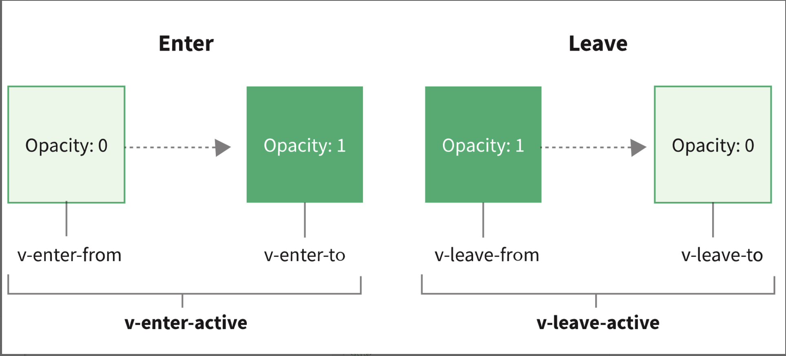

## Vue的升级

- Vue1，初始化时，每个数据都有一个watcher，数据一更新，就会主动告知页面更新，当数据很多时，性能就会下降
- Vue2加入虚拟DOM，以组件级别来划分。组件之间的变化，可以通过响应式来通知更新，组件内部的数据变化就通过虚拟DOM去更新页面，这就把响应式的监听器，控制在了组件级别，虚拟DOM的量级也控制在了组件大小
	- Vue2的响应式不是真正意义的代理，而是基于Object.defineProperty()实现的，这个api不是代理，而是对某个属性进行拦截，所以有时候 有的数据修改却监听不到
```js
Object.defineProperty(obj, 'title',{
	get(){}
	set(){}
})
// 当项目里 读取obj.title和 修改obj.title时，被defineProperty拦截，但是对于不存在属性无法拦截，所以Vue2中所有的数据都必须要在data里声明。而且，如果title是个数组的时候，对数组的操作并不会改变obj.title的指向，虽然可以通过拦截.push等操作实现部分功能，但是对数组的长度的修改等操作还是无法实现拦截，还需要额外的$set等API

// proxy的拦截
new Proxy(obj, {
	get() {}
	set() {}
})
// proxy拦截的是obj这个数据，但是obj是啥属性，Proxy不关心，统一拦截了。监听的数据格式也更多，但是不兼容IE11以下的浏览器
```
- Vue3继承响应式，虚拟DOM，组件化。proxy，自定义渲染器，TS重构，组合api，新组建Fragment、Teleport、Suspense，Vite

## 路由
- createRouter用来创建路由
- createWebHashHistory用来配置内部使用hash模式的路由，加了#号，加#和不加的区别，没忘

## Composition API
- ref用来创建一个响应式数据，打印出来的是一个对象，要用.value来取值或修改
- computed 计算属性单独引入使用
- 生命周期函数都需要单独引入，再使用

```ts
<script setup>
import { ref, computed, onMounted } from 'vue'
// 这种封装，用在某个功能多的页面内，封装，复用，维护，很方便。但是在一般的后台管理上，一个页面就负责一种功能的时候，就没必要了。
let { title, todos, addTodo, clear, active, all, allDone } = useTodos()

function useTodos() {
  onMounted(() => {
    console.log('mount');
  })
  let title = ref('')
  let todos = ref([
    { title: 'l1', done: false}
  ])

  function addTodo() {
    todos.value.push({
      title: title.value,
      done: false
    })
    title.value = ''
    console.log(todos);
  }
  function clear() {
    todos.value = todos.value.filter((v) => !v.done)
  }
  let active = computed(() => {
    return todos.value.filter((v) => !v.done).length
  })
  let all = computed(() => {
    return todos.value.length
  })
  let allDone = computed({
    get: function () {
      return active.value = 0
    },
    set: function (value) {
      todos.value.forEach((todo) => {
        todo.done = value
      })
    }
  })
  return { title, todos, addTodo, clear, active, all, allDone}
}
// 此处封装一个todo的方法，也就说这一块儿只负责todolist的功能，那后期维护，找代码修改都很清晰。思路上来说，如果页面又明确的功能区分，比如顶部的筛选可以是一块，主体的数据表格是一块。
```
###### 关于.value的官方解释
- 将值封装在一个对象中，看似没有必要，但为了保持JavaScript中不同数据类型的行为统一，这必须得。这是因为在JavaScript中，Number和String等基本类型是通过值而非引用传递的，在任何值周围都有一个封装对象，这样就可以在整个应用中安全地传递它，而不必担心在某个地方失去它的响应性
- 说人话就还是，怕有的值修改了，监听不到，解决vue2中那个bug了
```css
</script>
<style scoped>
/* v-bind可以使用变量，动态修改颜色*/
h1 {  color:v-bind(color);}
</style>
```

## Vue3的响应式机制
#### 什么是响应式
- 简单来说，就是一个值依赖于另一个值的变化而变化，当我们修改了这个值，不需要去手动调用什么方法，而让另一个值自动跟着变化，就吃响应式的雏形了。
#### Object.definePropery  --- vue2
- 该方法会在一个对象上定义一个新属性，或者修改一个对象的现有属性，并返回该对象
- defineProperty对obj的属性拦截，读取的时候执行get函数，修改的时候执行set函数，并在set内执行想做的计算，并返回计算结果。但是，如果把obj中的属性删掉一个，那么set里计算过的结果并不会变化，所以有一个$delete专门删除数据
#### Proxy ---- vue3 reactive
- 通过new Proxy代理一个obj，然后内部通过get、set和deleteProperty函数代理了对象的读取、修改和删除操作，从而实现响应式的功能。
- Proxy是针对对象来监听，而不是某个属性。所以不仅可以代理在data定义时不存在的属性，还可以代理更丰富的数据结构，比如Map、Set等，并且可以通过deleteProperty实现对删除操作的代理。
#### value setter ---- vue3 ref
- 利用get和set函数来进行监听，这种方式只能拦截某一个属性的更改，ref用.value来取值或者改值
#### 定制响应式数据
- 跟踪一个数据的变化，并直接做出响应，执行指定的函数。watchEffect，如果任何data发生了改变，那么就会自动执行里面的函数
- 思路就是抽离出一个use函数，在响应式的基础上，把任意响应数据的变化，在函数中做封装并返回，可以把这个函数放在工具函数文件夹中
```javascript
function useStorage(name, value=[]){
    let data = ref(JSON.parse(localStorage.getItem(name)|| value))
    watchEffect(()=>{
        localStorage.setItem(name,JSON.stringify(data.value))
    })
    return data
}
```
- 日常开发中用到的数据，无论是浏览器的本地存储，还是网路数据，都封装成响应式数据，统一使用响应式数据开发的模式。那开发项目时，只需要修改对应的数据就可以了。

### 组件化
- 通用型组件
- 业务型组件

### Vue的动画效果
#### 组件动画
- 提供了动画的封装，内置的transition组件来控制组件的动画，直接包裹想要加动画的元素，Vue就会在这个元素显示或隐藏的时候，设置标签的class，根据这些class实现想要的动效
```html
<transition name='fade'>
	<h1 v-if='showTitle'>hello</h1>
</transition>
```
- Vue 官网图，v-enter-from中的v，就是设置的name属性，所以在上面的html种，h1在进入和离开时，会有fade-enter-active和fade-leave-active的class，进入的开始和结束会有fade-enter-from和fadeleave-to两个class。
- 
- 根据这个原理，就可以在style里加一些样式，通过fade-enter-active和fade-leave-active两个class，去控制动画全过程的过渡属性
```css
<style>
.fade-enter-active,.fade-leave-active {
  transition: opacity 0.5s linear;
}
.fade-enter-from,.fade-leave-to {
  opacity: 0;
}
</style>
```
- transition 组件会把子元素作为一个整体去过渡，用transition-group组件来包裹元素，通过tag属性去指定渲染一个元素，增加了一个v-move类，class名是xxxname-move

#### 页面切换动画
- 默认在vue-router的模式下，使用router-view组件进行动态的组件渲染。在路由发生变化的时候，计算出对应匹配的组件去填充router-view。
- 那在路由组件上使用转场，并且对导航进行动画处理，需要使用v-slot API。
```html
<router-view v-slot="{ Component }">
  <transition  name="route" mode="out-in">
    <component :is="Component" />
  </transition>
</router-view>
<!--router-view通过v-slot获取渲染的组件并赋值给Component，然后使用transition包裹需要渲染的组件，并且通过内置组件component的is属性动态渲染组件-->
```


