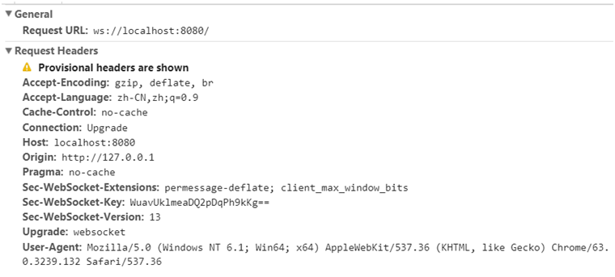

重点请求头部意义如下：

Connection: Upgrade：表示要升级协议

Upgrade: websocket：表示要升级到websocket协议。

Sec-WebSocket-Version: 13：表示websocket的版本。如果服务端不支持该版本，需要返回一个Sec-WebSocket-Versionheader，里面包含服务端支持的版本号。

Sec-WebSocket-Key：与后面服务端响应首部的Sec-WebSocket-Accept是配套的，提供基本的防护，比如恶意的连接，或者无意的连接。

注意，上面请求省略了部分非重点请求首部。由于是标准的HTTP请求，类似Host、Origin、Cookie等请求首部会照常发送。在握手阶段，可以通过相关请求首部进行安全限制、权限校验等。

 