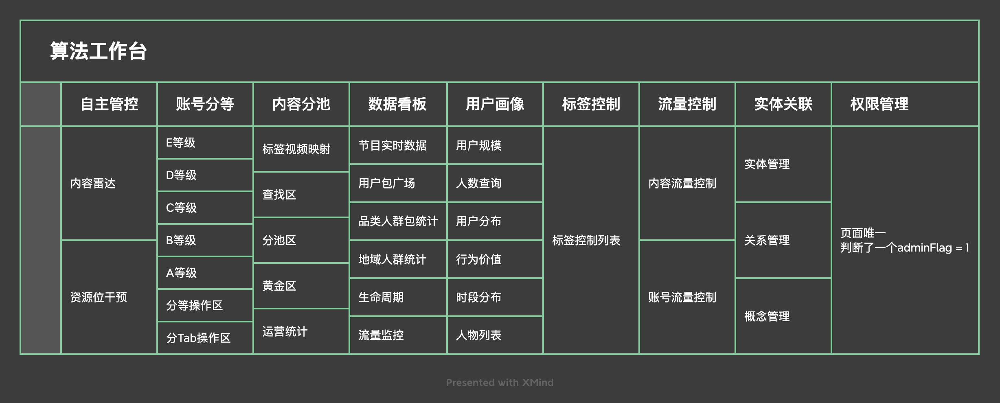

## 整体
### 技术框架
> Vue2 + elment
> 

### 页面功能概览
#### 功能组件

#### 其它公共组件
> topbar 和 leftnav

### 页面渲染逻辑
#### 整体渲染
> App 内引入所有的组件，通过Global.vue中定义的menuinfo，给每个组件添加了v-if，通过判断当前step的数值，去匹配menuinfo中的菜单值，渲染匹配上的组件
> Topbar有切换tab的功能，监听切换，发生变化时请求对应的tabid下的数据
> Leftbar，html静态列出了所有的功能列表，提供展开合并功能，通过权限和v-if控制菜单的展示，某个item时，把这个item的menuinfo再对比一次，然后通讯到APP内，修改需要渲染的组件
> *为什么没有使用路由，直接监听路由，直接在APP内判断，可以省去频繁的menuinfo判断*

#### 首次进入时
> 先获取用户信息，判断整体的权限，再获取Category的list，获取用户的权限列表，匹配categoryId，整合成一个数据组，通过判断权限的type值，决定显示与隐藏菜单。

### 组件间控制
> 渲染控制都放在APP内？！一个个的都用v-if判断！
> 这真的很生草

### 请求封装
> 没有使用axios，在api.js中，把Vue原生的请求，封装了起来，导出了get、post等方法。
> 所有请求地址，在url.js中，命名了全局变量，随处可用
> 

## bug点
- 频繁的menuinfo判断
- 权限判断、tab切换后对应左侧菜单的判断
- APP内多处对组件的refresh方法调用，但是v-if的渲染与方法调用，有时候会发生方法已经在调用了，但是组件并没有渲染上，导致的报错，虽然对页面无影响...

## 总结
- 麻了
- 重构吧